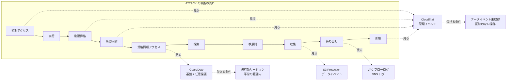
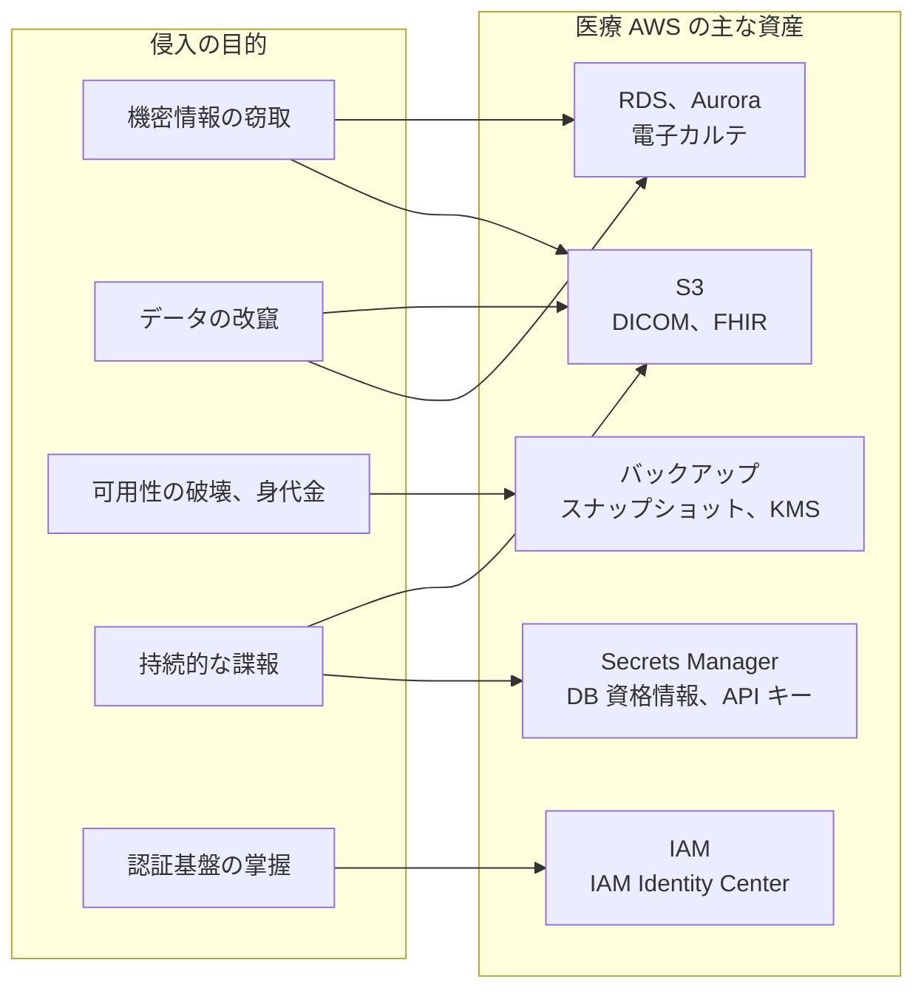
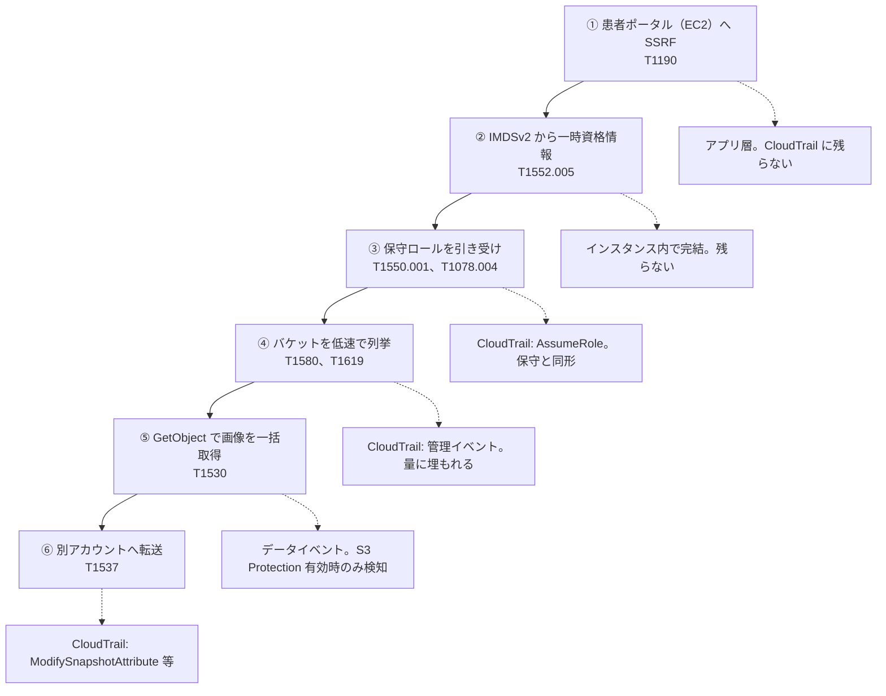
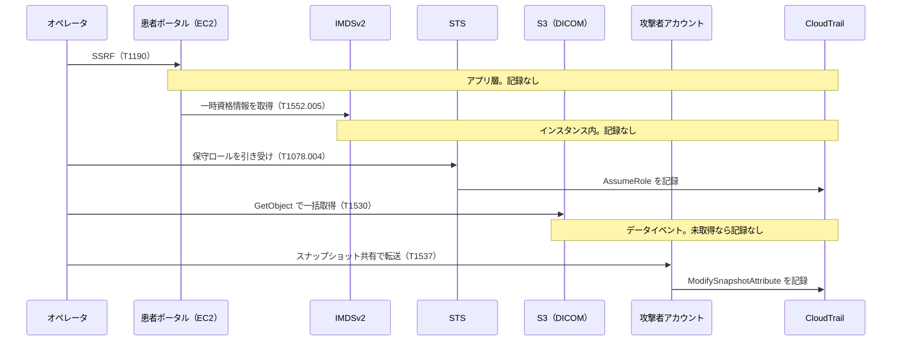
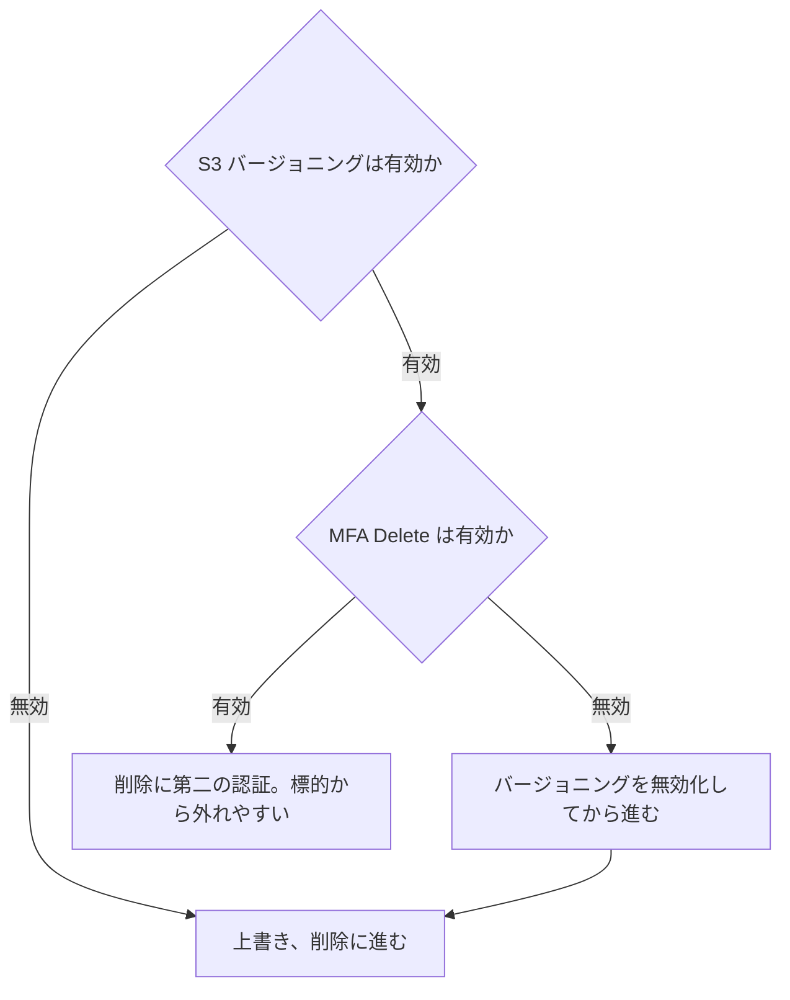
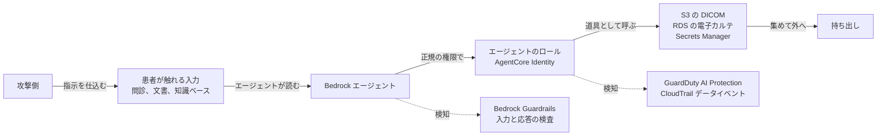

# 🗺️ MITRE ATT&CK for Cloud から見た医療クラウド環境（AWS 編）

医療機関や製薬企業の電子カルテ、画像、検査データが AWS 上に移ると、攻撃の起点は院内の端末から、クラウドの API と権限に移る。
そこで起きる操作の多くは、盗まれた資格情報による正当な API 呼び出しであり、マルウェアの実行として現れない。
このため、防御側が持つ手がかりは CloudTrail の記録と、GuardDuty の検出結果に集中する。

本ページは、AWS 上の医療システムに対する攻撃を、MITRE ATT&CK の Cloud（IaaS）の戦術の流れに沿って並べる。
各戦術で、医療の AWS 環境ではどう現れるか、そして CloudTrail と GuardDuty の検知から外れる条件は何かを、対になる観測点とともに示す。
高度なレッドチーム演習で問われるのは、攻撃が通るかどうかではなく、どの段でどのサービスが記録を残し、どの段が記録の外で進むかである。
医療機関が患者データを扱うモデルとエージェントを Amazon Bedrock に載せ始めたことで、攻撃面はさらに広がっている。
この新しい面は第 17 節にまとめる。

> [!NOTE]
> **表記ルール**：本ページでは、**事実**（一次情報で確認できる内容。出典を併記する）、**報道ベース**（報道や第三者の集計のみで確認でき、当事者の公表資料では裏付けが取れていない内容）、**分析**（筆者の解釈）を書き分ける。
>
> **ATT&CK のバージョン**：技術 ID は、本リポジトリの[クラウド事業者と医療](README.md#attck-との対応)および[脅威アクターと TTPs](../../threats/actors/) と揃え、従来の 14 戦術の区分で表記する。
> ATT&CK v18 で一部の技術は再編された。該当箇所には現行の ID を併記する。
>
> **Google Cloud 編との関係**：戦術の並びと表の形は [Google Cloud 編](mitre-attack-google-cloud.md)と揃えてある。
> 両者を横に並べて読むと、同じ技術が事業者ごとにどこで記録され、どこで欠けるかの差が見える。
> 事業者間の差の要点は [0.3](#03-google-cloud-との違いがどこに出るか) にまとめた。

> [!WARNING]
> 本ページは、自組織の AWS 環境の検知設計と、許可されたレッドチーム演習の設計に使うことを想定している。
> 権限のない環境に対する検証と、防御機能の無効化は行わない。
> 立場ごとにどこで法の線に触れるかは[検証と調査の法的境界](../../practice/legal-boundary.md)に、演習の枠組みは[レッドチームと TLPT を医療機関に当てはめる](../../practice/pentest/red-team-tlpt.md)にまとめている。
>
> 本ページに、そのまま実行できる攻撃コードは載せない。
> 載せるのは、**どの操作がどのサービスに記録され、どの条件でその記録が欠けるか**である。
> 攻撃シナリオは公表資料から組み立てた**想定**であり、実在する特定の医療機関や事業者を指すものではない。

---

## 0. 前提：AWS の検知サービスが見ている範囲

回避の可否は、攻撃の巧拙より先に、各サービスが何を入力にしているかで決まる。
まず、AWS が提供するセキュリティのサービスと機能を区分ごとに並べ、次にこの中で検知の入力になる記録の範囲を確定させる。

### 0.1 AWS のセキュリティサービスと機能

**事実**：AWS は、セキュリティ、アイデンティティ、コンプライアンスの区分に次のサービスを置いている（[AWS Overview: Security, Identity, and Compliance](https://docs.aws.amazon.com/whitepapers/latest/aws-overview/security-services.html)）。
本ページの主題である検知と回避に関わるものを中心に、役割ごとに整理する。
右端は、レッドチーム演習でその段の記録や検知の起点になるかどうかの目安である。

| 区分 | サービス、機能 | 役割 | 演習で見る段 |
|---|---|---|---|
| 記録 | AWS CloudTrail | API 呼び出し（管理イベント、データイベント）の記録 | 全戦術の起点 |
| 記録 | VPC フローログ | ネットワークインタフェースの通信の記録 | 横展開、持ち出し |
| 記録 | Route 53 Resolver DNS クエリログ | DNS の名前解決の記録 | 持ち出し、C2 |
| 記録 | AWS Config | リソース構成の変更履歴と評価 | 防御回避、永続化 |
| 記録 | Amazon Security Lake | 各種ログを OCSF 形式で集約するデータレイク | 調査基盤 |
| 記録 | Bedrock のモデル呼び出しログ | 基盤モデルへの入力と応答の記録。既定で無効 | AI ワークロード（17） |
| 脅威検知 | Amazon GuardDuty | ログを入力にした脅威検知（脅威インテリジェンスと機械学習） | 全戦術 |
| 脅威検知 | Amazon Detective | 検出結果の根本原因をたどる調査 | 事後調査 |
| 脅威検知 | Amazon Inspector | EC2 とコンテナの脆弱性、露出の継続評価 | 初期アクセス、探索 |
| 脅威検知 | GuardDuty AI Protection | Bedrock、Bedrock AgentCore、SageMaker AI の CloudTrail データイベントの解析 | AI ワークロード（17） |
| データ保護 | Amazon Macie | S3 上の機微データ（PHI、PII）の発見と公開範囲の評価 | 収集、探索 |
| 姿勢評価 | AWS Security Hub | 各サービスの検出結果の集約とベストプラクティス評価 | 全戦術の集約 |
| 姿勢評価 | IAM Access Analyzer | 外部到達可能な権限と未使用アクセスの検出 | 権限昇格、横展開 |
| ID とアクセス | AWS IAM | 主体、ロール、ポリシーによるアクセス制御 | 権限昇格、永続化 |
| ID とアクセス | IAM Identity Center | 複数アカウントへのアクセスと権限セットの集中管理 | 初期アクセス |
| ID とアクセス | AWS STS | 一時的な資格情報の発行 | 横展開 |
| データと鍵 | AWS KMS、CloudHSM | 暗号鍵の生成と管理、使用の制御 | 資格情報アクセス、影響 |
| データと鍵 | AWS Secrets Manager | 秘密（DB 資格情報、API キー）の保管と交換 | 資格情報アクセス |
| ネットワーク保護 | AWS WAF、Shield | Web アプリの攻撃と DDoS の緩和 | 初期アクセス |
| ネットワーク保護 | AWS Network Firewall、Firewall Manager | VPC の通信制御と、組織横断の適用 | 横展開、持ち出し |
| AI の予防 | Amazon Bedrock Guardrails | プロンプト攻撃と有害な内容の検査、遮断 | AI ワークロード（17） |

**分析**：予防（WAF、Network Firewall、KMS など）と、記録（CloudTrail、VPC フローログ）と、検知（GuardDuty、Inspector）は別の層である。
回避で問題になるのは記録と検知の層であり、予防の層は通れば記録に残らないとは限らない。
GuardDuty は独立したサービスに見えるが、入力は記録の層に依存する。
このため、次の 0.2 で記録の層の範囲を先に確定させる。

なお、組織全体のガードレールを敷くサービスコントロールポリシー（SCP）と AWS Organizations、統制の初期構成を作る AWS Control Tower は、上の一覧とは別の管理系の区分に置かれている。
本ページでは、権限昇格と防御回避の上限を敷く手当として第 5 節と第 6 節で扱う。

### 0.2 検知の入力になる記録の範囲

**事実**：AWS CloudTrail は、管理イベント（コントロールプレーンの操作）を既定で記録する。
オブジェクト単位の操作などのデータイベントは、証跡ごとに明示的に有効化しないと記録されない（[AWS ドキュメント](https://docs.aws.amazon.com/awscloudtrail/latest/userguide/logging-data-events-with-cloudtrail.html)）。

**事実**：Amazon GuardDuty は、有効化すると次の三つの基盤データソースを、利用者側の設定と独立した複製ストリームで解析する。
CloudTrail の管理イベント、VPC フローログ、Route 53 Resolver の DNS クエリログである（[AWS ドキュメント](https://docs.aws.amazon.com/guardduty/latest/ug/guardduty_data-sources.html)）。
S3 のデータイベント、EKS の監査ログ、実行時の監視、RDS のログイン、Lambda のネットワーク活動は、対応する保護プランを別に有効化したときに解析対象になる。
S3 Protection を有効にすると、CloudTrail 側で S3 のデータイベントを有効化しなくても、GuardDuty が独立したストリームで `GetObject` や `DeleteObject` などを解析する（[AWS ドキュメント](https://docs.aws.amazon.com/guardduty/latest/ug/s3-protection.html)）。

**事実**：GuardDuty は、IAM、STS、S3、CloudFront、Route 53 のようなグローバルサービスのイベントを、有効化しているすべてのリージョンに複製して処理する。
このためリソースを置いていないリージョンでも、これらの操作は解析される（[AWS ドキュメント](https://docs.aws.amazon.com/guardduty/latest/ug/guardduty_data-sources.html)）。

**分析**：ここから、回避が成立する条件は三つに整理できる。
第一に、CloudTrail のデータイベントと、GuardDuty の任意保護プランは、有効化されていなければ記録も検知も生じない。
第二に、GuardDuty を有効にしていないリージョンでは、そのリージョンに閉じた操作は検知の対象外になる。
ただしグローバルサービスの操作は、他のリージョンの GuardDuty が拾う。
第三に、GuardDuty の異常検知は、利用者ごとの平常の振る舞いを基準にする機械学習であり、平常の範囲に収まる操作は検出結果を生まない。
攻撃側はこの三つの隙間を選び、防御側はこの三つを閉じる。

ここまでを、医療で問題になる操作に当てはめると、既定の記録の範囲は次のようになる。

| 操作 | イベントの区分 | 既定で記録されるか | 出典 |
|---|---|---|---|
| IAM ポリシーの変更（`AttachRolePolicy`、`PutUserPolicy`） | 管理イベント | される | [管理イベントの記録](https://docs.aws.amazon.com/awscloudtrail/latest/userguide/logging-management-events-with-cloudtrail.html) |
| アクセスキーの作成（`CreateAccessKey`） | 管理イベント | される | 同上 |
| ロールの引き受け（`AssumeRole`） | 管理イベント | される | 同上 |
| 自分の権限の確認（`SimulatePrincipalPolicy`） | 管理イベント | される | 同上 |
| 秘密の値の取得（`GetSecretValue`） | 管理イベント | される | 同上 |
| バケットの一覧（`ListBuckets`） | 管理イベント | される | [S3 の CloudTrail イベント](https://docs.aws.amazon.com/AmazonS3/latest/userguide/cloudtrail-logging-s3-info.html) |
| バケットのポリシー変更（`PutBucketPolicy`） | 管理イベント | される | 同上 |
| オブジェクトの列挙（`ListObjects`、`ListObjectsV2`） | データイベント | されない | 同上 |
| オブジェクトの取得（`GetObject`） | データイベント | されない | 同上 |
| オブジェクトの作成、削除（`PutObject`、`DeleteObject`） | データイベント | されない | 同上 |
| インスタンスの一覧、取得（`DescribeInstances`） | 管理イベント | される | [管理イベントの記録](https://docs.aws.amazon.com/awscloudtrail/latest/userguide/logging-management-events-with-cloudtrail.html) |
| インスタンスの作成、メタデータ変更（`RunInstances`） | 管理イベント | される | 同上 |
| Lambda 関数の呼び出し（`Invoke`） | データイベント | されない | [データイベントの記録](https://docs.aws.amazon.com/awscloudtrail/latest/userguide/logging-data-events-with-cloudtrail.html) |
| DynamoDB の項目操作（`GetItem`、`Scan`） | データイベント | されない | 同上 |
| モデルの呼び出し（`InvokeModel`、`Converse`） | データイベント | されない（[17.1](#171-ai-ワークロードの記録はどこにあるか)） | 同上 |
| RDS、Aurora のクエリ | CloudTrail の対象外 | されない | DB エンジン側の監査に依る |
| インスタンスメタデータからの資格情報取得 | CloudTrail の対象外 | されない | インスタンス内で完結する |

**分析**：この表の中央に、医療で最も重い空白がある。
既定の設定のままの AWS アカウントでは、S3 に置いた DICOM 画像を一括で読み出しても、証跡には一行も残らない。
一方、権限を作る操作（ポリシーの変更、鍵の作成、ロールの引き受け）と、環境の形を調べる操作（`Describe*`、`List*` の大半）は、既定で残る。
**記録の線は、データ面と管理面のあいだに引かれている**。
攻撃側がデータ面に留まるほど記録は薄くなり、権限を作りに行くほど濃くなる。

なお、AI ワークロードの記録は別の系統にある。
どのモデルが呼ばれたかは管理イベントに残るが、何を尋ね何が返ったかは Bedrock のモデル呼び出しログを別に有効にしないと残らない。
詳細は第 17 節で扱う。

### 0.3 Google Cloud との違いが、どこに出るか

**分析**：AWS の CloudTrail は、コントロールプレーンの操作（管理イベント）とデータ面の操作（データイベント）で分かれる。
Google Cloud の Cloud Audit Logs は、書き込み（Admin Activity）と読み取りおよびデータ操作（Data Access）で分かれる。
この線の引き方が違うため、同じ攻撃技術でも、記録の有無が事業者ごとに入れ替わる。

| 攻撃側の操作 | AWS の既定 | Google Cloud の既定 |
|---|---|---|
| 別の主体の権限を得る | `AssumeRole` は管理イベントとして記録される | `GenerateAccessToken` は Data Access であり記録されない |
| 秘密の値を取り出す | `GetSecretValue` は管理イベントとして記録される | `AccessSecretVersion` は Data Access であり記録されない |
| 自分の権限を確かめる | `SimulatePrincipalPolicy` は管理イベントとして記録される | `testIamPermissions` は Data Access であり記録されない |
| 環境の形を調べる | `Describe*`、`List*` の大半は管理イベントとして記録される | 読み取りは区分を問わず Data Access に落ち、記録されない |
| オブジェクトを読む | データイベント。未設定なら記録されないが、GuardDuty の S3 Protection が独立して解析する | Data Access であり、有効化しなければ検知の入力自体が存在しない |
| 通信の記録 | GuardDuty が VPC フローログと DNS ログの複製を独自に解析する | Event Threat Detection は、利用者が有効化したログしか読まない |
| 記録そのものを止める | 証跡の停止と削除ができる | Admin Activity は無効化できない |
| 監視の外へ出る | GuardDuty も証跡も未整備のリージョンへ退避する（[T1535](https://attack.mitre.org/techniques/T1535/)） | プロジェクトを組織から外す（[T1666](https://attack.mitre.org/techniques/T1666/)） |
| データ境界の予防層 | リソースポリシーと VPC エンドポイントポリシーで個別に敷く | VPC Service Controls が API 単位の境界として一括で掛かる |

**分析**：AWS 側から見た含意は三つある。

第一に、**AWS では記録を止める操作に価値がある**。
権限の獲得、秘密の取得、探索の大半が既定で管理イベントに残るため、攻撃側にとって証跡そのものが邪魔になる。
Google Cloud では、価値のある操作の多くが既定で記録されておらず、止める必要がない。
防御回避（[6](#6-防御回避)）で `StopLogging` と `DeleteTrail` を単独の通知対象にする理由は、この差にある。

第二に、**AWS ではリージョンが回避の単位になる**。
CloudTrail と GuardDuty はリージョンごとに有効化するため、未有効のリージョンに閉じた操作は記録も検知も生じない。
Google Cloud では単位が資源階層（組織、フォルダ、プロジェクト）であり、リージョンを変えても何も変わらない。
組織証跡と全リージョンの GuardDuty は、AWS に固有の必須設定である。

第三に、**AWS では検知が利用者の設定に依存しない部分を持つ**。
GuardDuty は、CloudTrail の管理イベント、VPC フローログ、DNS クエリログを、利用者の証跡やログ設定と独立した複製ストリームで解析する（[0.2](#02-検知の入力になる記録の範囲)）。
S3 Protection と AI Protection も同じ形で、証跡を作らずに検知だけを先に入れられる。
Google Cloud の Event Threat Detection は、利用者が有効化したログしか読まない。
このため、**AWS では検知を先に入れて記録を後から足せるが、Google Cloud では記録を先に有効にしないと検知が始まらない**。
医療機関が両方を使っている場合、着手の順序が事業者ごとに変わる。

詳細は [Google Cloud 編の 0.3](mitre-attack-google-cloud.md#03-aws-との違いがどこに出るか)に置いた。

以降の節では、この対応を戦術ごとに具体化する。

---

## 1. 演習で狙う到達目標と、秘匿の原則

医療のレッドチーム演習は、権限を取ること自体を目的にしない。
何を取りに行くか（到達目標）を先に決め、そこへ気付かれずに届く経路を測る。
この節は、目的の例と、到達をどう判定するか、そして AWS で秘匿を成立させる原則を置く。

### 1.1 侵入の目的（レッドチーム視点の例）

医療の環境では、目的によって狙うデータと、成立したときの被害の質が変わる。

| 目的 | 医療での具体 | 主に使う戦術（本ページの節） | 患者と診療への帰結 |
|---|---|---|---|
| 機密情報の窃取 | 診療記録、DICOM 画像、検査結果、ゲノム、治験データの一括取得 | 探索（8）、収集（10）、持ち出し（11） | 大規模な個人情報の漏えい |
| データの改竄 | 検査値、処方、投薬記録、画像の改変 | 権限昇格（5）、収集（10） | 誤診、誤投薬。患者安全に直結する |
| 可用性の破壊、身代金 | バックアップとスナップショットの削除、暗号化 | 防御回避（6）、影響（12） | 診療の停止、復旧不能 |
| 持続的な諜報 | 気付かれない足場からの継続的な情報収集 | 永続化（4）、資格情報アクセス（7） | 長期の情報流出、供給網への波及 |
| 認証基盤の掌握 | IAM と ID 基盤を握り、任意の利用者になりすます | 権限昇格（5）、横展開（9） | 検知と調査の前提が崩れる |

**分析**：この五つのうち、機密情報の窃取と持続的な諜報は、気付かれないこと自体が価値に直結する。
改竄と可用性の破壊は、実行の瞬間に気付かれても目的は達せられるため、秘匿より速度を選ぶ場合がある。
演習の設計では、どの目的を模擬するかで、秘匿と速度のどちらを主に測るかが決まる。

目的は、医療の AWS 環境のどの資産に向かうかで具体化する。

### 1.2 到達の判定と、本番での安全な代替

稼働中の医療環境では、目的の完遂そのものは実行しない。
到達したことを、破壊や持ち出しの一歩手前で判定する。

- **機密情報の窃取**：データを外へ出さず、対象のオブジェクトやテーブルに到達して読める状態を、無害な標識ファイルの取得や件数の確認で示す。
- **データの改竄**：本番のレコードを書き換えず、書き込み権限が及ぶことを、演習用に用意した領域への書き込みで示す。
- **可用性の破壊**：削除や暗号化を実行せず、対象のバックアップと鍵への削除権限が及ぶことを、権限の評価で示す。

この線引きは、[診断とペネトレーションテスト](../../practice/pentest/README.md#6-実施設計止められない環境でどう安全に測るか)の実施設計と、[レッドチームと TLPT](../../practice/pentest/red-team-tlpt.md)の中止条件に沿わせる。

### 1.3 AWS で秘匿を成立させる原則

第 0 節の三つの隙間を、攻撃側の作業手順に翻訳すると次の原則になる。
いずれも新しい脆弱性ではなく、記録と検知の入力の性質を突くものである。
以下で挙げる検出結果の名称は、GuardDuty の検出タイプの一覧による（[IAM の検出タイプ](https://docs.aws.amazon.com/guardduty/latest/ug/guardduty_finding-types-iam.html)、[S3 の検出タイプ](https://docs.aws.amazon.com/guardduty/latest/ug/guardduty_finding-types-s3.html)）。

- **管理面よりデータ面を選ぶ**：データイベントを取得していない環境では、S3 のオブジェクト取得（[10](#10-収集)）や削除（[12](#12-影響)）が記録の外で進む。0.2 の表でいえば、データイベントの行に留まる。
- **発行元を AWS の内側に置く**：侵害した EC2 や Lambda から API を呼ぶと、`Recon:IAMUser/MaliciousIPCaller` と `Recon:IAMUser/TorIPCaller` の判定に触れない。これらは発行元 IP を脅威インテリジェンスと突き合わせるためである。
  - ただし AWS には、Google Cloud にない縛りがある。EC2 に割り当てた資格情報を、そのインスタンス以外から使うと、AWS の外なら `UnauthorizedAccess:IAMUser/InstanceCredentialExfiltration.OutsideAWS`、別アカウントの内側なら同 `.InsideAWS` が出る（[7](#7-資格情報アクセス)）。AWS の内側に置くだけでは足りず、**その資格情報が発行されたインスタンスの内側**に留まる必要がある。
- **既存の主体とロールを使う**：新しい鍵やユーザを増やさず、すでに広い権限を持つ保守のロールを引き受ける。`CreateAccessKey` と `CreateUser` は永続化（[4](#4-永続化)）として管理イベントに残り、平常から外れれば `Persistence:IAMUser/AnomalousBehavior` を呼ぶ。`AssumeRole` は残るが、保守の正常操作と形が同じである。
- **ルートの資格情報を使わない**：ルートユーザによる操作は `Policy:IAMUser/RootCredentialUsage` として、平常かどうかを問わず単独で検出される。広い権限が要る場面でも、ルートは選ばれない。
- **列挙を平常の速度に落とす**：短時間の広範囲な列挙は異常検知の基準に触れ、`Discovery:IAMUser/AnomalousBehavior` を呼ぶ。探索（[8](#8-探索)）を、平常の運用に紛れる速度と量に分ける。S3 Protection を有効にした環境では、データ面の列挙も `Discovery:S3/AnomalousBehavior` の対象になる。
- **道具の指紋を残さない**：Kali、Parrot、Pentoo などの診断用ディストリビューションからの API 呼び出しは `PenTest:IAMUser/*` として検出される。素の SDK と CLI には、この検出は反応しない。
- **監視の薄いリージョンを選ぶ**：GuardDuty も証跡も未整備の副リージョンでは、そのリージョンに閉じた操作は記録も検知も生じない。ただし IAM と STS のグローバル操作は、他のリージョンの GuardDuty が拾う（[0.2](#02-検知の入力になる記録の範囲)）。
- **保守の窓に合わせる**：夜間や休日の保守で権限行使が増える時間帯に作業を寄せると、平常との差が出にくい。
- **証跡を止めない**：`StopLogging`、`DeleteTrail`、`DeleteDetector` は、いずれも管理イベントに残り、`Stealth:IAMUser/CloudTrailLoggingDisabled` を呼ぶ。記録が既に薄い範囲では、止める操作が記録を増やすだけになる。

**分析**：これらは防御側から見れば、そのまま埋めるべき穴の一覧になる。
GuardDuty を全リージョンで有効にし、S3 Protection とデータイベントを取得し、保守のロールと時間帯の平常を測って基準に組み込むと、上の原則の大半は記録か検出結果を生む側に変わる。
秘匿の成否は、攻撃側の技量より、防御側がこの九項目をどれだけ潰しているかで決まる。

### 1.4 記録が残っても、何が書かれるかは攻撃側が選ぶ

前節までは、記録そのものを避ける原則だった。
AWS では、権限の獲得も秘密の取得も探索も既定で管理イベントに残るため、記録を避けきれない段のほうが Google Cloud より多い。
そこで問題になるのは、その一件に**何が書かれるか**である。
GuardDuty の異常検知は記録のフィールドを入力にするため、フィールドを平常に寄せられれば、記録が残っても検出結果は生じない。
CloudTrail のイベントのフィールドは、次のように攻撃側が制御できるものと、できないものに分かれる（[CloudTrail レコードの内容](https://docs.aws.amazon.com/awscloudtrail/latest/userguide/cloudtrail-event-reference-record-contents.html)）。

| フィールド | 内容 | 攻撃側が制御できるか |
|---|---|---|
| `userIdentity` | 呼び出した主体（種別、ARN、アカウント） | できない。引き受けたロールそのものが載る（[userIdentity 要素](https://docs.aws.amazon.com/awscloudtrail/latest/userguide/cloudtrail-userIdentity.html)） |
| `userIdentity.sessionContext.sessionIssuer` | セッションを発行したロール。ロールの連鎖の手掛かり | できない。連鎖が長いほど痕跡が濃くなる |
| `sourceIPAddress` | 発行元の IP | 消せないが、選べる。侵害した資源から呼べば AWS の IP になる |
| `userAgent` | 呼び出しに使われた道具 | 制御できる。クライアントが送る文字列である |
| `eventName`、`requestParameters` | 操作と対象 | できない |
| `errorCode` | 拒否や失敗の理由（`AccessDenied` など） | できない。権限を試すほど積み上がる |

**分析**：この表の三行目に、Google Cloud との差がはっきり出る。
Google Cloud では、侵害した VM の内側から呼ぶと `callerIp` が `gce-internal-ip` に置き換わり、発行元が記録から消える。
AWS の `sourceIPAddress` は消えず、EC2 の IP が載る。
攻撃側にできるのは、**載る値を平常の側にすること**だけである。
これは防御側にとって利点になる。
発行元が記録に残る以上、「その資格情報が、発行されたはずの資源の外から使われている」という判定が成立し、実際に `InstanceCredentialExfiltration` と `ResourceCredentialExfiltration` がその判定を担っている。
Google Cloud には、この形の検出が見当たらない。

**分析**：`userAgent` は制御できるため、`PenTest:IAMUser/*` は道具の指紋を見る検出であって、行為そのものを見る検出ではない。
演習では、診断用ディストリビューションから当てる構成と、素の SDK から当てる構成の二通りを流すと、検知が道具に依存しているか行為に依存しているかが分かる。

**分析**：`errorCode` は制御できない。
権限を総当たりで試す方式は `AccessDenied` を積み上げるため、平時の拒否の量を基準にしていれば信号になる。
Google Cloud の `testIamPermissions` のように、拒否のイベントを作らずに権限だけを束ねて問う API は、AWS の IAM にはない。
`SimulatePrincipalPolicy` は拒否を作らずに評価を返すが、その呼び出し自体が管理イベントとして残る（[8](#8-探索)）。
AWS では、権限の測り方のどれを選んでも、何らかの記録が生じる。

### 1.5 騒がしい操作と、静かな代替

上の原則を、目的ごとの選択として表にする。
演習の設計では、左の列を選べば検知を測れ、右の列を選べば記録の空白を測れる。

| 目的 | 騒がしい操作 | 発火する検出 | 静かな代替 | 代替が残す記録 |
|---|---|---|---|---|
| 権限の獲得 | `CreateAccessKey` で第二の鍵を作る | `Persistence:IAMUser/AnomalousBehavior` | 既存の保守ロールを `AssumeRole` で引き受ける | 管理イベントに一件。保守と同形 |
| 権限の獲得 | ルートの資格情報を使う | `Policy:IAMUser/RootCredentialUsage` | 権限の広い既存のロールを引き受ける | 同上 |
| 権限の把握 | API を順に試す | 拒否が積み上がり `Discovery:IAMUser/AnomalousBehavior` | `SimulatePrincipalPolicy` で評価だけ返させる | 管理イベントに残る（拒否は作らない） |
| 昇格 | 管理者ポリシーを自分に付ける | `Persistence:IAMUser/AnomalousBehavior` | 既に広い権限を持つロールを引き受ける | 管理イベントに `AssumeRole` 一件 |
| 探索 | 診断用ディストリビューションから呼ぶ | `PenTest:IAMUser/KaliLinux` ほか | 侵害した EC2 の素の SDK から呼ぶ | 呼び出しに応じた区分 |
| 探索 | 短時間に広範囲を列挙する | `Discovery:IAMUser/AnomalousBehavior` | 保守の時間帯に、平常の量に分けて呼ぶ | 管理イベント。量に埋もれる |
| 収集 | 別アカウントから EC2 の資格情報を使う | `InstanceCredentialExfiltration.InsideAWS` | 資格情報の発行元インスタンスの内側から使う | 発行元が平常。検出は生じない |
| 収集 | バケットを公開に変える | `Policy:S3/BucketPublicAccessGranted` | 既存の権限のまま `GetObject` で読む | データイベント（未取得なら記録なし） |
| 持ち出し | S3 から短時間に大量に読み出す | `Exfiltration:S3/AnomalousBehavior` ほか | スナップショットを別アカウントへ共有する | 管理イベントに一件。移行と同形 |
| 記録の除去 | `StopLogging`、`DeleteTrail` | `Stealth:IAMUser/CloudTrailLoggingDisabled` | データイベント未取得の範囲に留まる | 記録なし |
| 記録の除去 | `DeleteDetector` で GuardDuty を止める | 管理イベントに残る | 同上 | 記録なし |

**分析**：右の列に共通するのは、**新しい構成を作らず、既にあるものを引き受けて読む**ことである。
AWS でこの列を選んでも、Google Cloud と違って `AssumeRole` と `Describe*` は記録に残る。
残るが、単独では保守の正常操作と区別がつかない。
そのため AWS では、一件ずつの異常ではなく、操作の順序を読む設計が要る。
GuardDuty Extended Threat Detection が複数段の並びを攻撃シーケンスとして扱うのは、この構造に対応するためである（[GuardDuty Extended Threat Detection](https://docs.aws.amazon.com/guardduty/latest/ug/guardduty-extended-threat-detection.html)）。

### 1.6 機密情報の窃取を例にしたステルス経路

上の原則を、機密情報の窃取という目的で一本につなぐと次の経路になる。
左の列が攻撃の各段、右の点線がその段で記録に残るかどうかである。

**分析**：記録に残らないのは①②⑤である。
このうち⑤が、目的そのものが達せられる段でありながら記録の空白になる。
③④⑥は記録に残るが、保守の正常操作と形が同じで、単独では異常として浮かばない。
現実の攻撃側は、この形を保つために発行元を AWS の内側に置き、列挙を平常の速度に落とす。
防御側の手当は、⑤の空白を S3 Protection とデータイベントで閉じ、③④⑥を単独の異常ではなく順序（攻撃シーケンス）で見ることに集約される。
この経路の各段の詳細は、以降の戦術別の節に対応する。

---

## 2. 初期アクセス

医療の AWS 環境で最初の一歩になるのは、外向きのアプリケーションと、外部との信頼関係である。

**現れ方**：

- 患者ポータル、画像ビューア、予約や問診の Web アプリに認可の不備や既知の脆弱性があると、公開資産を起点に内側へ入られる（Exploit Public-Facing Application、[T1190](https://attack.mitre.org/techniques/T1190/)）。
  - 具体例：ファイルアップロード機能から EC2 上に Web シェルを置く、画像ビューアの SSRF を資格情報アクセス（7）につなぐ、公開 API のパラメータ改ざんで認可を越える。
- 電子カルテや部門システムのベンダが保守用に持つクロスアカウントの IAM ロールや、共有された資格情報を経由する経路は、信頼関係の悪用にあたる（Trusted Relationship、[T1199](https://attack.mitre.org/techniques/T1199/)）。
  - 具体例：信頼ポリシーに `ExternalId` の条件がない、または `Principal` が広いロールを攻撃者のアカウントから引き受ける（混乱した代理人）。保守事業者そのものの侵害が、契約先の複数の医療機関へ連鎖する。
- 運用担当者の長期アクセスキーやフェデレーションの資格情報が盗まれれば、正規のクラウドアカウントとして入られる（Valid Accounts: Cloud Accounts、[T1078.004](https://attack.mitre.org/techniques/T1078/004/)）。
  - 具体例：公開 GitHub、コンテナイメージの環境変数、S3 上の Terraform state、CI/CD のログに残った `AKIA` で始まる恒久キー。
- フィッシングで SSO や IAM Identity Center の資格情報とセッションを奪う手口は、多要素認証を回避する形をとることがある（Phishing、[T1566](https://attack.mitre.org/techniques/T1566/)）。
  - 具体例（MFA 回避）：AWS SSO のデバイス認可フローを悪用し、`https://device.sso.<リージョン>.amazonaws.com/` の正規ドメインの URL を送って承認させる。利用者が IdP に認証済みなら、パスワードも MFA も要求されずに攻撃者が SSO アクセストークンを得る。この形は Yubikey や IdP 側の IP 制限を無効化する（[Christophe Tafani-Dereeper の分析](https://blog.christophetd.fr/phishing-for-aws-credentials-via-aws-sso-device-code-authentication/)）。中間者型（AiTM）の逆プロキシでセッションクッキーを奪う形、承認要求を繰り返す MFA 疲労（Multi-Factor Authentication Request Generation、[T1621](https://attack.mitre.org/techniques/T1621/)）も同じ狙いである。
- ソフトウェアサプライチェーンを侵害し、ビルドや CI/CD からクラウドへ入る（Supply Chain Compromise、[T1195](https://attack.mitre.org/techniques/T1195/)）。
  - 具体例：悪性の依存パッケージや依存混同（dependency confusion）でビルド時に資格情報を抜く、汚染したコンテナ基盤イメージを使わせる。GitHub Actions の OIDC を引き受けるロールで、信頼ポリシーの `sub` の絞り込みが甘い（ワイルドカード）と、別リポジトリのワークフローから `sts:AssumeRoleWithWebIdentity` で入られる（[Datadog Security Labs](https://securitylabs.datadoghq.com/articles/exploring-github-to-aws-keyless-authentication-flaws/)）。
- AWS 固有の設定不備を直接突く（Exploit Public-Facing Application、[T1190](https://attack.mitre.org/techniques/T1190/)、Valid Accounts: Cloud Accounts、[T1078.004](https://attack.mitre.org/techniques/T1078/004/)）。
  - 具体例：Cognito の ID プールが未認証アクセスを許し、付与ロールの権限が過剰だと、クライアントの JavaScript に埋め込まれた Identity Pool ID から誰でも一時的な AWS 資格情報を得られる（[Hacking The Cloud](https://hackingthe.cloud/aws/exploitation/cognito_identity_pool_excessive_privileges/)）。公開設定のまま共有された EBS や RDS のスナップショット、AMI、匿名アクセスを許すリソースベースのポリシー（S3、SNS、SQS、Lambda）も入口になる。

**検知から外れる条件**：アプリケーション層での侵入は、AWS の API を呼ばない限り CloudTrail には現れない。
Web サーバのアクセスログやアプリケーションログを別に取っていないと、この段は AWS 側の記録に残らない。
盗んだ資格情報での最初のログインも、発行元が普段と同じ地域や AWS の IP 空間であれば、GuardDuty の脅威インテリジェンスや異常検知の基準に触れにくい。
デバイス認可のフィッシングは、利用者自身が正規に認証を終えるため、IdP 側の多要素認証や IP 制限では止まらない。

**残る観測点（検知、緩和）**：コンソールへのログインと STS の `AssumeRole` は管理イベントとして CloudTrail に残る。
GuardDuty は、既知の悪性 IP や Tor 出口からの呼び出しを `UnauthorizedAccess:IAMUser/MaliciousIPCaller` と `UnauthorizedAccess:IAMUser/TorIPCaller` として、初回の異常なアクセスを `InitialAccess:IAMUser/AnomalousBehavior` として検出する（[GuardDuty IAM finding types](https://docs.aws.amazon.com/guardduty/latest/ug/guardduty_finding-types-iam.html)）。
フィッシングとサプライチェーンの経路には、SSO のトークン発行（`sso-oidc:CreateToken`）とロール資格情報の取得（`sso:GetRoleCredentials`）、OIDC の `AssumeRoleWithWebIdentity` が、普段と異なる発行元から起きる点を監視対象にする。
緩和は、長期アクセスキーを配らず IAM Identity Center と一時資格情報に寄せること、デバイス認可のフィッシングにはフィッシング耐性のある多要素認証（パスキー、セキュリティキー）で対抗すること、OIDC を引き受けるロールの信頼ポリシーで `sub` を絞ること、ベンダのクロスアカウントロールに `ExternalId` と条件キーで発行元を縛ること、外向きアプリの前段に[攻撃面の把握](../../practice/attack-surface.md)を継続することにある。

---

## 3. 実行

クラウドでの実行は、端末上のプロセスではなく、API とマネージドサービスの上で起きる。

**現れ方**：

- 盗んだ資格情報から AWS CLI や SDK で API を呼ぶ操作は、クラウド API を介した実行にあたる（Command and Scripting Interpreter: Cloud API、[T1059.009](https://attack.mitre.org/techniques/T1059/009/)）。
  - 具体例：CloudShell を対話的な足場に使う、既存の CI/CD パイプラインに乗って正規の実行に紛れる。
- SSM の `SendCommand` や `StartSession` で EC2 上のコマンドを走らせる経路は、クラウド管理コマンドにあたる（Cloud Administration Command、[T1651](https://attack.mitre.org/techniques/T1651/)）。
  - 具体例：Run Command（`ssm:SendCommand`）、Session Manager（`ssm:StartSession`）、SSM Automation ドキュメント、ECS の `ExecuteCommand`。
- 侵害した権限で Lambda を作成、更新して任意の処理を動かす経路は、サーバレス実行にあたる（Serverless Execution、[T1648](https://attack.mitre.org/techniques/T1648/)）。
  - 具体例：`lambda:UpdateFunctionCode` で既存関数を書き換える、`ec2:RunInstances` の user-data に起動スクリプトを載せる。
- 管理者を欺いて悪性のイメージを実行させる経路は、利用者実行にあたる（User Execution: Malicious Image、[T1204.003](https://attack.mitre.org/techniques/T1204/003/)）。
  - 具体例：公開 ECR や Docker Hub に置いた汚染イメージ、共有された悪性 AMI を起動させる。
- ECS や EKS でコンテナを立てて実行する経路は、コンテナの配置にあたる（Deploy Container、[T1610](https://attack.mitre.org/techniques/T1610/)）。
  - 具体例：`ecs:RunTask` で攻撃者のイメージを動かす。EKS では、コンテナ内でコマンドを実行する操作が別の技術にあたる（Container Administration Command、[T1609](https://attack.mitre.org/techniques/T1609/)）。

**検知から外れる条件**：SSM 経由の実行は、`ssm:SendCommand` などの管理イベントは CloudTrail に残るが、そのコマンドが EC2 内で何をしたかは AWS 側には残らない。
Session Manager のログ記録を有効にしていない環境では、セッション内の操作は端末側の記録に頼るしかない。
Lambda の実行は、関数の作成と更新は管理イベントに残るが、実行時のネットワーク活動は Lambda Protection を有効にしないと GuardDuty の対象にならない。

**残る観測点（検知、緩和）**：`CreateFunction`、`UpdateFunctionCode`、`SendCommand`、`StartSession` はいずれも管理イベントに残る。
緩和は、SSM の Session Manager のログを S3 と CloudWatch Logs へ送り[ログと監視の設計](../logging.md)に組み込むこと、Lambda の作成と更新を許す主体を絞ること、実行基盤の内側は[検知の設計](../detection-engineering.md)で端末側の観測点と対にすることにある。

---

## 4. 永続化

一度得た足場を、初期経路を塞がれても残す段である。
医療環境では、保守の都合で作られた別経路と区別しにくい点が問題になる。

**現れ方**：

- 侵害した IAM 主体に新しいアクセスキーやログインプロファイルを足す操作は、追加のクラウド資格情報にあたる（Account Manipulation: Additional Cloud Credentials、[T1098.001](https://attack.mitre.org/techniques/T1098/001/)）。
  - 具体例：`iam:CreateAccessKey` で第二の鍵を発行、`iam:CreateLoginProfile` でコンソールログインを付与、`sts:GetFederationToken` で持続する一時資格情報を作る。
- 既存のロールに信頼ポリシーや権限を足す操作は、追加のクラウドロールにあたる（Additional Cloud Roles、[T1098.003](https://attack.mitre.org/techniques/T1098/003/)）。
  - 具体例：`iam:UpdateAssumeRolePolicy` で攻撃者のアカウントを信頼に加えたバックドアロール、SAML や OIDC の ID プロバイダの追加、IAM Roles Anywhere の信頼アンカーの追加でトークンを継続的に発行する。
- 新しい IAM ユーザやフェデレーションの設定を作る操作は、クラウドアカウントの作成にあたる（Create Account: Cloud Account、[T1136.003](https://attack.mitre.org/techniques/T1136/003/)）。
- EC2 の AMI やコンテナイメージに細工を仕込む経路は、内部イメージの埋め込みにあたる（Implant Internal Image、[T1525](https://attack.mitre.org/techniques/T1525/)）。
  - 具体例：起動テンプレートや Auto Scaling が参照する ECR イメージ、AMI を差し替え、再作成のたびに足場が戻る。Lambda と EventBridge の定期トリガでバックドアを常駐させる、Lambda の関数 URL を認証なしで公開して外部から呼べる裏口にする。
- 認証の仕組みを書き換えて足場を残す経路は、認証プロセスの改変にあたる（Modify Authentication Process、[T1556](https://attack.mitre.org/techniques/T1556/)）。
  - 具体例：フェデレーションの ID プロバイダ（SAML、OIDC）を足す、条件付きアクセスや MFA の要求を緩める、追加の MFA デバイスを登録する。SAML トークンの偽造そのものは資格情報アクセス（7）で扱う。

**検知から外れる条件**：これらはいずれも管理イベントとして CloudTrail に残る。
記録は残るが、保守の正当な操作に紛れる。
ベンダが日常的にロールと鍵を追加する運用では、`CreateAccessKey` や `AttachRolePolicy` の一件が異常として浮かびにくい。

**残る観測点（検知、緩和）**：`CreateAccessKey`、`CreateLoginProfile`、`AttachUserPolicy`、`UpdateAssumeRolePolicy`、`CreateUser` を監視対象にする。
GuardDuty は、これらが利用者の平常から外れると `Persistence:IAMUser/AnomalousBehavior` を出す。
緩和は、鍵とロールの追加を発行できる主体を限定すること、追加された資格情報を[外に出た認証情報](../credential-exposure.md)と[認証とアクセス管理](../identity.md)の棚卸しで定期的に突き合わせること、AMI とイメージの供給元を固定し[検索経路の汚染](../seo-poisoning.md)や供給の改ざんの経路を断つことにある。

---

## 5. 権限昇格

医療データへの一括アクセスは、多くの場合この段で得られる。
AWS の権限昇格は、脆弱性ではなく IAM の設定の連鎖で成立する。

**現れ方**：

- `iam:PassRole` と、Lambda、EC2、CloudFormation などのサービスへのロール引き渡しを組み合わせると、自分より広い権限のロールで処理を動かせる。
  - 具体例：`iam:PassRole` と `lambda:CreateFunction`、`ec2:RunInstances`、`glue:CreateDevEndpoint`、`cloudformation:CreateStack`、`ecs:RunTask` のいずれかを組み合わせる。
- 既存のポリシーに新しいバージョンを作って既定にする（`CreatePolicyVersion`）、インラインポリシーを足す（`PutUserPolicy`）といった操作で、自分の権限を自分で広げる（Account Manipulation、[T1098](https://attack.mitre.org/techniques/T1098/)）。
  - 具体例：`iam:CreatePolicyVersion` は `--set-as-default` を付けると `SetDefaultPolicyVersion` の権限なしで既定化できる。他にも `iam:AttachUserPolicy`、`iam:AddUserToGroup`、他ユーザへの `iam:CreateAccessKey` や `iam:UpdateLoginProfile`。
- 一時的な特権付与の仕組みを悪用する経路は、一時的な昇格アクセスの悪用にあたる（Abuse Elevation Control Mechanism: Temporary Elevated Cloud Access、[T1548.005](https://attack.mitre.org/techniques/T1548/005/)）。
  - 具体例：`iam:UpdateAssumeRolePolicy` で信頼を書き換えてから `sts:AssumeRole` で引き受ける。既知の昇格経路は公開カタログにまとまっている（[Hacking The Cloud](https://hackingthe.cloud/aws/exploitation/iam_privilege_escalation/)、[Rhino Security Labs](https://github.com/RhinoSecurityLabs/AWS-IAM-Privilege-Escalation)）。
- より広い権限を持つロールやアカウントを、そのまま使う経路は、正規アカウントの悪用にあたる（Valid Accounts、[T1078](https://attack.mitre.org/techniques/T1078/)）。
- 特権のロールで動く処理を書き換え、その実行に便乗する経路は、イベント駆動実行にあたる（Event Triggered Execution、[T1546](https://attack.mitre.org/techniques/T1546/)）。
  - 具体例：管理者ロールで動く既存の Lambda のコードを差し替え、次の起動で昇格した権限を得る。

**検知から外れる条件**：昇格に使う API はすべて管理イベントに残る。
残るが、権限管理の正常な操作と形が同じである。
GuardDuty の異常検知も、その主体が普段からポリシーを編集する運用担当であれば基準に触れにくい。
一件ずつは正当に見え、連鎖の全体を見て初めて昇格と分かる。

**残る観測点（検知、緩和）**：`CreatePolicyVersion`、`PutUserPolicy`、`PutRolePolicy`、`AttachRolePolicy`、`PassRole` を、単独ではなく順序で見る。
GuardDuty Extended Threat Detection は、複数段にまたがる操作の並びを攻撃シーケンスとして検出する（[GuardDuty Extended Threat Detection](https://docs.aws.amazon.com/guardduty/latest/ug/guardduty-extended-threat-detection.html)）。
緩和は、`iam:PassRole` の許可対象を渡せるロールで限定すること、権限境界（permissions boundary）とサービスコントロールポリシー（SCP）で昇格の到達先に上限を置くこと、IAM Access Analyzer で外部到達可能な権限と未使用のアクセスを継続的に洗い出すことにある。

---

## 6. 防御回避

この戦術は、検知そのものを外しにいく段である。
医療環境では、証跡の設計と有効化の範囲が、ここでの成否を分ける。

**現れ方**：

- CloudTrail の証跡を停止、削除する、対象を絞る、KMS 鍵を無効にしてログを読めなくする操作は、クラウドログの無効化にあたる（Impair Defenses: Disable or Modify Cloud Logs、[T1562.008](https://attack.mitre.org/techniques/T1562/008/)。v18 では Disable or Modify Tools の下位、[T1685.002](https://attack.mitre.org/techniques/T1685/002/)）。
  - 具体例：`cloudtrail:StopLogging` や `DeleteTrail`、`PutEventSelectors` で記録対象を絞る、組織証跡を単一リージョンに縮める、ログ用 S3 の KMS 鍵を `DisableKey`。GuardDuty は `DeleteDetector` や `UpdateDetector` で無効化、抑制フィルタ（`CreateFilter`）で検出結果を隠す、`DisassociateMembers` で集約を切る。AWS Config は `StopConfigurationRecorder`。
- 利用していない、または監視の手薄なリージョンで活動する経路は、未使用リージョンの悪用にあたる（Unused/Unsupported Cloud Regions、[T1535](https://attack.mitre.org/techniques/T1535/)）。
  - 具体例：GuardDuty も証跡も未整備の副リージョンに退避して列挙や複製を行う。ただし IAM や STS のグローバル操作は、他のリージョンの GuardDuty に届く。
- スナップショットの作成やインスタンスの複製で、監視の外にデータの複製を作る経路は、クラウド計算基盤の改変にあたる（Modify Cloud Compute Infrastructure、[T1578](https://attack.mitre.org/techniques/T1578/)）。
- 資源の階層を動かして統制や監視の外に出す経路は、クラウド資源階層の改変にあたる（Modify Cloud Resource Hierarchy、[T1666](https://attack.mitre.org/techniques/T1666/)）。
  - 具体例：アカウントを別の OU へ移して SCP の適用を外す、新しいアカウントを作って監視の対象から外す。
- 正規のロールと標準の管理ツールだけで用を足し、異常として浮かばないようにする経路は、正規アカウントの悪用にあたる（Valid Accounts、[T1078](https://attack.mitre.org/techniques/T1078/)）。

**検知から外れる条件**：GuardDuty を有効にしていないリージョンでは、そのリージョンに閉じた操作は検出されない。
ただし IAM や STS のようなグローバルサービスの操作は、他のリージョンの GuardDuty が複製して処理するため、リージョンを変えても隠れない。
CloudTrail を組織証跡にしていない場合、新しいリージョンや新しいアカウントの操作が既定で記録されない範囲が生じる。

**残る観測点（検知、緩和）**：CloudTrail の `StopLogging`、`DeleteTrail`、`UpdateTrail`、KMS の `DisableKey` と `ScheduleKeyDeletion` を監視する。
GuardDuty は CloudTrail の停止を `Stealth:IAMUser/CloudTrailLoggingDisabled` として、パスワードポリシーの改変を `Stealth:IAMUser/PasswordPolicyChange` として検出する（[GuardDuty IAM finding types](https://docs.aws.amazon.com/guardduty/latest/ug/guardduty_finding-types-iam.html)）。
緩和は、組織証跡を全リージョンで有効にし、証跡のログを別アカウントの S3 に集約すること（[監査ログは既定では足りない](README.md#監査ログは既定では足りない)）、GuardDuty を全リージョンで有効にすること、証跡のバケットにオブジェクトロックを掛け停止と削除自体を残す設計にすることにある。

---

## 7. 資格情報アクセス

盗んだ一つの資格情報から、次の資格情報へ広げる段である。

**現れ方**：

- SSRF などで EC2 のインスタンスメタデータに到達し、インスタンスに割り当てられた一時資格情報を取る経路は、インスタンスメタデータ API からの窃取にあたる（Unsecured Credentials: Cloud Instance Metadata API、[T1552.005](https://attack.mitre.org/techniques/T1552/005/)）。
  - 具体例：IMDSv1 が許可された環境では単純な `GET` で取得、コンテナからホストのメタデータへ到達する。EKS では、既定でポッドがワーカーノードの IMDS に届くため、ポッドの RCE や SSRF からノードの EC2 インスタンスロールの資格情報を奪える。IRSA や Pod Identity を使っていても、IMDS へのアクセスを塞がない限りこの経路は残る（[Datadog Security Labs](https://securitylabs.datadoghq.com/articles/amazon-eks-attacking-securing-cloud-identities/)）。
- Secrets Manager や SSM パラメータストアから鍵とパスワードを引き出す経路は、クラウドの秘密管理ストアからの取得にあたる（Credentials from Password Stores: Cloud Secrets Management Stores、[T1555.006](https://attack.mitre.org/techniques/T1555/006/)）。
  - 具体例：`secretsmanager:GetSecretValue` や `BatchGetSecretValue`、SSM の `GetParameter` を `WithDecryption` で、`kms:Decrypt`。EC2 の user-data（`ec2:DescribeInstanceAttribute`）や起動テンプレートに残る平文、S3 の Terraform state や `.env` を読む。
- アプリケーションのアクセストークンを盗む、DB 認証を作る経路は、アプリケーションアクセストークンの窃取にあたる（Steal Application Access Token、[T1528](https://attack.mitre.org/techniques/T1528/)）。
  - 具体例：EBS スナップショットを作って復元し鍵を読む、RDS の IAM 認証トークンを生成する、ECR の認証トークンを取る。
- 設定ファイルやディスクに平文で残る資格情報を拾う経路は、ファイル内の資格情報にあたる（Unsecured Credentials: Credentials In Files、[T1552.001](https://attack.mitre.org/techniques/T1552/001/)）。
  - 具体例：EC2 の user-data、`~/.aws/credentials`、S3 の設定ファイル、EBS スナップショットを復元して読む。
- SAML トークンを偽造して任意のロールを引き受ける経路は、Web 資格情報の偽造にあたる（Forge Web Credentials: SAML Tokens、[T1606.002](https://attack.mitre.org/techniques/T1606/002/)）。
  - 具体例：ID プロバイダの署名鍵を握り、任意の主体としての SAML 主張を作る（Golden SAML）。

**検知から外れる条件**：メタデータからの取得自体は、EC2 の内部で完結し CloudTrail には現れない。
取得した資格情報を、そのインスタンスの内側から使い続ける限り、発行元と使用元の不一致が生じない。
Secrets Manager からの取得（`GetSecretValue`）は管理イベントに残るが、その主体が普段からその秘密を読む運用であれば異常として浮かびにくい。

**残る観測点（検知、緩和）**：GuardDuty は、EC2 に割り当てた資格情報がそのインスタンス以外から使われた場合を `UnauthorizedAccess:IAMUser/InstanceCredentialExfiltration` として検出する。
この検出には、AWS の外から使われた場合（`.OutsideAWS`）に加え、別の AWS アカウントの内側から使われた場合（`.InsideAWS`）の区別がある（[GuardDuty IAM finding types](https://docs.aws.amazon.com/guardduty/latest/ug/guardduty_finding-types-iam.html)）。
Lambda 関数や ECS タスクのために発行された資格情報が、その外から使われた場合は `UnauthorizedAccess:IAMUser/ResourceCredentialExfiltration` として、同じく `.OutsideAWS` と `.InsideAWS` に分けて検出される（同上）。
`GetSecretValue`、`BatchGetSecretValue`、`GetPasswordData` が平常から外れると `CredentialAccess:IAMUser/AnomalousBehavior` が出る。
緩和は、IMDSv2 を必須にしホップ制限を下げること（[SSRF とインスタンスメタデータ](README.md#ssrf-とインスタンスメタデータ)）、秘密へのアクセスを主体と秘密の単位で最小化すること、[外に出た認証情報](../credential-exposure.md)の手順で失効の順序を決めておくことにある。

---

## 8. 探索

環境の形と、到達できる範囲を知る段である。
医療環境では、患者データがどのバケットとどのデータベースにあるかがここで割れる。

**現れ方**：

- IAM の主体、ロール、グループ、ポリシーを列挙する操作は、アカウントとグループの探索にあたる（Account Discovery: Cloud Account、[T1087.004](https://attack.mitre.org/techniques/T1087/004/)、Permission Groups Discovery: Cloud Groups、[T1069.003](https://attack.mitre.org/techniques/T1069/003/)）。
  - 具体例：`iam:GetAccountAuthorizationDetails` で権限を一括取得、`iam:SimulatePrincipalPolicy` で権限を試す、`sts:GetCallerIdentity` で立ち位置を確認する。
  - **分析**：`SimulatePrincipalPolicy` が「静か」なのは、実際に API を呼ばずに評価だけを返すため、`AccessDenied` を積み上げない点においてである。呼び出しそのものは管理イベントとして記録される（[1.4](#14-記録が残っても何が書かれるかは攻撃側が選ぶ)）。Google Cloud の `testIamPermissions` が記録も拒否も生まないのとは、静けさの度合いが違う。
- EC2、RDS、VPC などの構成を調べる操作は、クラウド基盤の探索にあたる（Cloud Infrastructure Discovery、[T1580](https://attack.mitre.org/techniques/T1580/)）。
  - 具体例：Resource Groups Tagging API の `GetResources` や Organizations の `ListAccounts` で横断的に棚卸しする。Pacu、ScoutSuite、enumerate-iam などの自動化を使う。
- どのマネージドサービスが使われているかを調べる操作は、クラウドサービスの探索にあたる（Cloud Service Discovery、[T1526](https://attack.mitre.org/techniques/T1526/)）。
- S3 のバケットとオブジェクトを列挙する操作は、クラウドストレージオブジェクトの探索にあたる（Cloud Storage Object Discovery、[T1619](https://attack.mitre.org/techniques/T1619/)）。
  - 具体例：`s3:ListBuckets`（管理イベント）と `s3:ListObjects`（データイベント）を分ける。後者は S3 Protection もデータイベントも未取得なら記録されない。
- 防御の有無を先に調べる経路は、セキュリティ製品の探索にあたる（Software Discovery: Security Software Discovery、[T1518.001](https://attack.mitre.org/techniques/T1518/001/)）。
  - 具体例：`guardduty:ListDetectors`、`cloudtrail:DescribeTrails`、`config:DescribeConfigurationRecorders` で、検知が有効かを確かめてから動く。

**検知から外れる条件**：`Describe*`、`List*`、`Get*` の多くは読み取り専用の管理イベントで、CloudTrail には残るが量が多く埋もれやすい。
権限がなく `AccessDenied` になった呼び出しも記録されるが、平時から拒否が多い環境では信号にならない。
S3 のオブジェクト列挙（`ListObjects`）はデータイベントであり、S3 Protection も CloudTrail のデータイベントも有効にしていないと、GuardDuty にも証跡にも残らない。

**残る観測点（検知、緩和）**：短時間に広範囲を列挙する操作は、GuardDuty の異常検知で `Discovery:IAMUser/AnomalousBehavior` として検出される。
Kali、Parrot、Pentoo などの診断用ディストリビューションからの API 呼び出しは `PenTest:IAMUser/*` として検出される（[GuardDuty IAM finding types](https://docs.aws.amazon.com/guardduty/latest/ug/guardduty_finding-types-iam.html)）。
緩和は、S3 Protection を有効にしてデータ面の列挙を検知対象に入れること、患者データを含むバケットとデータベースを Amazon Macie で継続的に分類し所在を把握すること、読み取り操作のうち医療の正常系から外れる列挙を[検知の設計](../detection-engineering.md)で条件化することにある。

---

## 9. 横展開

一つのアカウントや一つのロールから、隣へ移る段である。

**現れ方**：

- `AssumeRole` を連ねてアカウントやロールをまたぐ経路は、クラウドサービス経由の横展開にあたる（Remote Services: Cloud Services、[T1021.007](https://attack.mitre.org/techniques/T1021/007/)）。
  - 具体例：Organizations の `OrganizationAccountAccessRole` で管理アカウントからメンバーアカウントへ、ロールの連鎖（role chaining）で権限を渡り歩く。
- 盗んだアプリケーションアクセストークンやセッションを使い回す経路は、代替の認証材料の使用にあたる（Use Alternate Authentication Material: Application Access Token、[T1550.001](https://attack.mitre.org/techniques/T1550/001/)）。
- SSM 経由で別の EC2 へ移る、VPC ピアリングや共有を通じて別のセグメントへ届く経路もここに含む。
  - 具体例：`ssm:StartSession`、EC2 Instance Connect の `SendSSHPublicKey`、Transit Gateway や VPN、Direct Connect を経て院内網へ折り返す。リソースベースのポリシー（S3、KMS、SNS、SQS、Lambda）を緩めて別アカウントから触る。
- SSM や EC2 Instance Connect で仮想マシンへ直接つなぐ経路は、クラウド VM への直接接続にあたる（Remote Services: Direct Cloud VM Connections、[T1021.008](https://attack.mitre.org/techniques/T1021/008/)）。
- 盗んだコンソールのセッションクッキーを使い回す経路は、Web セッションクッキーの使用にあたる（Use Alternate Authentication Material: Web Session Cookie、[T1550.004](https://attack.mitre.org/techniques/T1550/004/)）。

**検知から外れる条件**：`AssumeRole` は管理イベントに残るが、正当なフェデレーションと形が同じである。
発行元の IP が AWS 内部であれば、GuardDuty の悪性 IP の判定には触れない。
ロールの連鎖が、どれも普段から使われる組み合わせであれば、異常検知の基準にも触れにくい。

**残る観測点（検知、緩和）**：STS の `AssumeRole` と `GetSessionToken` の連なりを、発行元と到達先の組で見る。
GuardDuty Extended Threat Detection は、複数段にまたがる並びを攻撃シーケンスとして扱う（[GuardDuty Extended Threat Detection](https://docs.aws.amazon.com/guardduty/latest/ug/guardduty-extended-threat-detection.html)）。
`userIdentity.sessionContext.sessionIssuer` は攻撃側が制御できないため、ロールの連鎖はここから一段ずつ遡れる（[1.4](#14-記録が残っても何が書かれるかは攻撃側が選ぶ)）。
緩和は、クロスアカウントの信頼を最小限にし `ExternalId` と条件キーで縛ること、アカウントをまたぐ経路を[ネットワークの分離](../segmentation.md)のゾーンモデルと突き合わせ、想定していない到達を可視化することにある。

---

## 10. 収集

目標のデータを集める段である。
医療では、DICOM 画像、FHIR のエクスポート、検査結果がここで一括で読まれる。

**現れ方**：

- S3 上の画像やエクスポートを一括で取得する操作は、クラウドストレージからのデータ取得にあたる（Data from Cloud Storage、[T1530](https://attack.mitre.org/techniques/T1530/)）。
  - 具体例：`aws s3 sync` に相当する一括 `GetObject`、AWS Backup や S3 バッチオペレーションで横断的にまとめる。
- RDS や Aurora、DynamoDB から患者記録を引く操作は、情報リポジトリからのデータ取得にあたる（Data from Information Repositories: Databases、[T1213.006](https://attack.mitre.org/techniques/T1213/006/)）。
  - 具体例：DynamoDB の `Scan` や `ExportTableToPointInTime`、RDS スナップショットを復元して別環境で読む、Athena や Glue でデータレイクに問い合わせる。
- 取得したデータを別のバケットにまとめる操作は、データの集積にあたる（Data Staged、[T1074](https://attack.mitre.org/techniques/T1074/)）。
- スクリプトで複数のサービスから機械的に集める経路は、自動収集にあたる（Automated Collection、[T1119](https://attack.mitre.org/techniques/T1119/)）。
  - 具体例：Pacu のデータ収集モジュールで S3、DynamoDB、Secrets を横断して抜く。
- スナップショットを復元してデータを読む経路もここに含む（Data from Cloud Storage、[T1530](https://attack.mitre.org/techniques/T1530/)）。
  - 具体例：EBS スナップショットからボリュームを作って別インスタンスにマウント、RDS スナップショットを復元して開く。

**検知から外れる条件**：S3 の `GetObject` はデータイベントであり、CloudTrail のデータイベントも GuardDuty の S3 Protection も有効にしていないと、どれだけ大量に読まれても AWS の記録に残らない。
これがこの段の中心的な隙間である。
データベースからの読み出しは、DB エンジン側のクエリログを取っていないと、AWS の管理イベントには現れない。

**残る観測点（検知、緩和）**：S3 Protection を有効にすると、GuardDuty は S3 のデータイベントを独立ストリームで解析し、大量取得や持ち出しにつながる操作を検出する（[GuardDuty S3 Protection](https://docs.aws.amazon.com/guardduty/latest/ug/s3-protection.html)）。
緩和は、S3 Protection を有効にすること、患者データのバケットに CloudTrail のデータイベントを設定し保存先を分けること、DB の監査ログを有効にすること、アプリケーション層で誰がどの患者記録を開いたかの監査ログを残すことにある（[監査ログは既定では足りない](README.md#監査ログは既定では足りない)）。

**分析**：機密情報の窃取（[1.1](#11-侵入の目的レッドチーム視点の例)）が現実に成立するのはこの段である。
データイベントを取得していない環境では一括取得が記録に残らないため、現実の攻撃側は急がず、平常の読み出しに紛れる速度で進める。
防御側がまず閉じるべきは、この段の記録の空白である。

---

## 11. 持ち出し

集めたデータを、境界の外へ出す段である。

**現れ方**：

- スナップショットや AMI を攻撃者の AWS アカウントへ共有、コピーする経路は、クラウドアカウントへの転送にあたる（Transfer Data to Cloud Account、[T1537](https://attack.mitre.org/techniques/T1537/)）。
  - 具体例：`ec2:ModifySnapshotAttribute` や `ec2:ModifyImageAttribute`、RDS の `ModifyDBSnapshotAttribute` でスナップショットを外部アカウントに共有する。
- S3 のクロスアカウント共有や、バケットポリシーの緩和で外へ出す経路もここに含む。
  - 具体例：バケットポリシーに攻撃者のプリンシパルを足す、レプリケーション規則で攻撃者のバケットへ複製する、署名付き URL を発行して外から取得する、AWS DataSync や S3 Transfer Acceleration で外部へ転送する。
- DNS や HTTPS を使ってデータを外へ流す経路は、代替プロトコルでの持ち出しにあたる（Exfiltration Over Alternative Protocol、[T1048](https://attack.mitre.org/techniques/T1048/)）。
- 外部の攻撃者管理のクラウドストレージや Web サービスへ上げる経路は、Web サービス経由の持ち出しにあたる（Exfiltration Over Web Service、[T1567](https://attack.mitre.org/techniques/T1567/)）。
- 仕組みで継続的に外へ流す経路は、自動化された持ち出しにあたる（Automated Exfiltration、[T1020](https://attack.mitre.org/techniques/T1020/)）。
  - 具体例：レプリケーション規則や定期実行の Lambda で、追加された患者データを継続的に攻撃者側へ送る。

**検知から外れる条件**：スナップショットの共有（`ModifySnapshotAttribute`）や AMI の共有は管理イベントに残るが、正当なバックアップやアカウント間移行と形が同じである。
EC2 からの外向き通信は、宛先が既知の悪性リストや DGA に該当しなければ、GuardDuty の DNS とネットワークの検知に触れにくい。
少量ずつ、既存の正当な宛先を装って送る通信は、平常のトラフィックに紛れる。

**残る観測点（検知、緩和）**：`ModifySnapshotAttribute`、`ModifyImageAttribute`、`PutBucketPolicy`、`PutBucketAcl` を、アカウント外への公開に向かう変更として監視する。
GuardDuty は、DNS ログと VPC フローログから外部への持ち出しの兆候を `Exfiltration:IAMUser/AnomalousBehavior` などとして検出し、既知の悪性ドメインへの通信を捉える。
緩和は、スナップショットと AMI の共有先をアカウント単位で制限すること、VPC のエンドポイントと出口の制御で外向き通信の宛先を絞ること、[記憶媒体の廃棄](../media-disposal.md)と同じく、複製が作られる経路を数え上げておくことにある。

---

## 12. 影響

診療の継続と、調査の成否に直結する段である。
医療では、暗号化より削除のほうが復旧を難しくする。
この段は、[1.1](#11-侵入の目的レッドチーム視点の例) の可用性の破壊と身代金という目的が現れる場所であり、前段までと違って速度を優先する場合が多い。

**現れ方**：

- スナップショット、バックアップ、オブジェクトを削除する操作は、データの破壊にあたる（Data Destruction、[T1485](https://attack.mitre.org/techniques/T1485/)）。
  - 具体例：`ec2:DeleteSnapshot`、`rds:DeleteDBSnapshot`、`backup:DeleteBackupVault`、バージョニングの停止、ライフサイクル規則で期限切れ削除を仕掛ける（Lifecycle-Triggered Deletion、[T1485.001](https://attack.mitre.org/techniques/T1485/001/)）。
- S3 のオブジェクトを暗号化し直して読めなくする、KMS 鍵を消して復号を不能にする経路は、影響のための暗号化と、復旧の妨害にあたる（Data Encrypted for Impact、[T1486](https://attack.mitre.org/techniques/T1486/)、Inhibit System Recovery、[T1490](https://attack.mitre.org/techniques/T1490/)）。
  - 具体例：盗んだ資格情報で `s3:GetObject` と `s3:PutObject` を使い、利用者提供鍵（SSE-C）でオブジェクトを暗号化して身代金を要求する手口がある。**事実**：AWS は「S3 never stores the encryption key when you use SSE-C」と記しており、鍵は保存されない（[AWS ドキュメント](https://docs.aws.amazon.com/AmazonS3/latest/userguide/ServerSideEncryptionCustomerKeys.html)）。**報道ベース**：CloudTrail に残るのは鍵の HMAC だけで、そこから鍵は復元できないと Arctic Wolf は報告している。**報道ベース**：この手口が 2025 年 1 月に実際の攻撃で使われ、攻撃側がライフサイクル規則で 7 日後の削除を仕掛けたと、複数のセキュリティ企業が報告している（[Arctic Wolf](https://arcticwolf.com/resources/blog/ransomware-campaign-encrypting-amazon-s3-buckets-using-sse-c/)、[The Register](https://www.theregister.com/2025/01/13/ransomware_crew_abuses_compromised_aws/)）。KMS の `ScheduleKeyDeletion` や `DisableKey` も同じ結果を生む。
- 侵害した主体の資格情報を無効化し、正規の管理者を締め出す経路は、アカウントアクセスの剥奪にあたる（Account Access Removal、[T1531](https://attack.mitre.org/techniques/T1531/)）。
  - 具体例：`iam:DeleteLoginProfile`、アクセスキーの無効化、ルートや管理者の資格情報の変更。
- 計算資源を乗っ取って費用と負荷を生む経路は、資源の乗っ取りにあたる（Resource Hijacking: Compute Hijacking、[T1496.001](https://attack.mitre.org/techniques/T1496/001/)）。
  - 具体例：高価な GPU インスタンスを大量に起動して暗号資産の採掘を回す。
- 稼働中のサービスやインスタンスを止める経路は、サービスの停止にあたる（Service Stop、[T1489](https://attack.mitre.org/techniques/T1489/)）。
  - 具体例：`ec2:StopInstances`、`rds:StopDBInstance`、`ecs:UpdateService` で稼働数を 0 にする。

**検知から外れる条件**：削除と鍵操作は管理イベントに残る。
残るが、この段は隠れることより速く進めることを狙う場合が多い。
S3 のオブジェクト削除（`DeleteObject`）はデータイベントであり、S3 Protection も CloudTrail のデータイベントも有効にしていないと、一括削除が記録の外で進む。

**残る観測点（検知、緩和）**：`DeleteDBSnapshot`、`DeleteSnapshot`、`DeleteBackup`、`ScheduleKeyDeletion`、KMS の `DisableKey`、大量の `DeleteObject` を、単独のイベントとして通知対象にする。
GuardDuty は破壊や暗号化につながる並びを `Impact:IAMUser/AnomalousBehavior` と攻撃シーケンスとして検出し、S3 Protection がデータ面の削除を捉える。
緩和は、バックアップとスナップショットにオブジェクトロックとボールトロックで保持期間中の削除と上書きを技術的に禁じること（[鍵管理とバックアップの不変性](README.md#鍵管理とバックアップの不変性)）、KMS 鍵の削除に待機期間を置くこと、復旧手段を別アカウントか事業者の外側に一つ持つこと（[事業者側で起きた事象](README.md#事業者側で起きた事象)）にある。

---

## 13. 戦術と検知の対応表

上の各節を、技術、既定で残る記録、記録が欠ける条件、足すべき手当の四列で並べる。
演習の記録を「気付かれたか」の二値でなく、どの段がどの条件で記録の外にあったかで残すための表である。

| 戦術 | 代表技術（ID） | 既定で残る記録 | 記録が欠ける条件 | 足す手当 |
|---|---|---|---|---|
| 初期アクセス | T1190、T1078.004 | ログイン、AssumeRole（管理イベント） | アプリ層の侵入は AWS に残らない | アプリ、Web のログ取得 |
| 実行 | T1651、T1648 | 関数作成、SendCommand（管理イベント） | SSM セッション内、Lambda 実行時の通信 | Session Manager ログ、Lambda Protection |
| 永続化 | T1098.001、T1136.003 | 鍵、ユーザ、ポリシーの追加（管理イベント） | 保守の正常操作に紛れる | 追加操作の主体限定と突き合わせ |
| 権限昇格 | T1098、T1548.005 | ポリシー編集、PassRole（管理イベント） | 一件ずつは正当に見える | 権限境界、SCP、Access Analyzer |
| 防御回避 | T1562.008／T1685.002、T1535 | CloudTrail、KMS の操作（管理イベント） | 未有効リージョンに閉じた操作 | 組織証跡、全リージョンで GuardDuty |
| 資格情報アクセス | T1552.005、T1555.006 | GetSecretValue（管理イベント） | メタデータ取得はインスタンス内で完結 | IMDSv2 必須、秘密アクセスの最小化 |
| 探索 | T1580、T1619 | Describe、List、Get（読み取り管理イベント） | S3 のオブジェクト列挙はデータイベント | S3 Protection、Macie で所在把握 |
| 横展開 | T1021.007、T1550.001 | AssumeRole の連なり（管理イベント） | 正当なフェデレーションと同形 | 信頼の最小化、ゾーンと突き合わせ |
| 収集 | T1530、T1213.006 | （データイベント未取得なら残らない） | S3 GetObject、DB 読み出し | S3 Protection、DB とアプリの監査ログ |
| 持ち出し | T1537、T1048 | スナップショット共有（管理イベント） | 少量ずつ、正当な宛先を装う通信 | 共有先制限、出口の宛先制御 |
| 影響 | T1485、T1490 | 削除、鍵操作（管理イベント） | DeleteObject はデータイベント | オブジェクトロック、鍵の待機期間、別系統の復旧 |

**分析**：この表を縦に読むと、記録が欠ける条件はデータイベントの未取得と、未有効リージョンと、正常操作との同形の三つに集約される。
最初の二つは設定で閉じられる。
三つ目は設定では閉じられず、医療の正常系を基準に置いた検知の設計でしか埋まらない（[検知の設計を技法単位に落とす](../detection-engineering.md)）。

**分析**：[Google Cloud 編](mitre-attack-google-cloud.md)の同じ表と並べると、埋めるべき優先順位が入れ替わる。
Google Cloud では、Data Access 監査ログという一つの設定が、資格情報アクセス、探索、横展開、収集の四つの戦術に同時に効く。
AWS では、記録の空白がデータ面（S3 のオブジェクト操作、DynamoDB、Lambda の呼び出し）に限られるため、閉じるべき対象が S3 Protection とデータイベントの取得という一点に集約される。
そのかわり、AWS では記録が残る段が多い分、**残った記録を並びとして読む設計の比重が大きい**。
医療機関が AWS で最初に打つべき手は、S3 Protection を有効にし、患者データを含むバケットに CloudTrail のデータイベントを設定し、GuardDuty を全リージョンで有効にすることである。

この表は、患者データを直接扱う経路を並べたものである。
モデルとエージェントを介して同じデータに届く経路は、記録の系統が違うため第 17 節で別に扱う。

---

## 14. 演習で、どこまで測れるか

この対応を、レッドチーム演習と診断のどちらで測るかは、目的で分かれる。

**分析**：検知の作りが分からない段階では、技法を先に選んで並べるパープルチーミングが向く。
S3 Protection の有無、組織証跡の範囲、GuardDuty の有効リージョンといった設定の穴は、技法単位で当てれば当日中に割れる。
その穴を埋めたあとに、予告なしの演習で、埋めた検知が実戦の速度で働くかを見る。
医療では、稼働中の電子カルテと接続された医療機器を対象にする制約があるため、影響（第 12 節）の段は本番で実行せず、削除や暗号化の一歩手前までを到達条件にすることが多い（[診断とペネトレーションテスト](../../practice/pentest/README.md#6-実施設計止められない環境でどう安全に測るか)、[レッドチームと TLPT](../../practice/pentest/red-team-tlpt.md)）。

**分析**：AWS の演習では、次の四つを分けて測ると結果が読みやすい。

- **道具に反応する検知**：診断用ディストリビューションから当てた場合に働く検知（`PenTest:IAMUser/*`）。`userAgent` は攻撃側が制御できるため、素の SDK に置き換えると消える（[1.4](#14-記録が残っても何が書かれるかは攻撃側が選ぶ)）。
- **単独の操作に反応する検知**：`StopLogging`、ルートの利用、バケットの公開のように、一件で条件が立つ検知。構成を変えない作戦では発火しない。
- **記録の有無に依存する検知**：S3 のオブジェクト取得と削除に働く検知。S3 Protection かデータイベントを有効にして初めて成立する。
- **並びに依存する検知**：昇格と横展開のように、一件ずつは正当に見え、順序で初めて意味が立つもの。GuardDuty Extended Threat Detection と、自組織で書く相関条件が担う。

**分析**：この四つを分けると、演習の報告に「どの検知が、なぜ働いたか、または働かなかったか」を書ける。
三つ目は設定を足せば埋まる。
四つ目は設定では埋まらず、医療の正常系の幅を測って基準に組み込む設計でしか埋まらない（[検知の設計](../detection-engineering.md)）。

**分析**：演習の成果物は、どの技法が通ったかの一覧では足りない。
本ページの対応表の形で、どの段がどの条件で記録の外にあったかを残すと、防御側が次に有効化する設定と、次に書く検知条件が特定できる。
あわせて、どの到達目標（[1.1](#11-侵入の目的レッドチーム視点の例)）にどこまで届いたかを、[1.2](#12-到達の判定と本番での安全な代替) の判定に沿って併記する。
目的ごとに、防御が破綻する境目が記録に残る。

---

## 15. プロのオペレータによる攻撃シナリオの一例

これまでの戦術を、一人のレッドチームオペレータが一本の作戦としてつなぐと、どう進むかを示す。

> [!NOTE]
> 以下は、公表された手法から組み立てた**想定シナリオ**である。
> 実在する医療機関や事業者を指すものではなく、そのまま再現できる手順としては書かない。

想定する標的は、患者ポータルを EC2 で公開し、DICOM 画像を S3 に、電子カルテを RDS に置く中規模の病院である。
GuardDuty は主要リージョンで有効だが、S3 Protection と CloudTrail のデータイベントは未取得で、一部の副リージョンでは GuardDuty が無効になっている。
保守はベンダのクロスアカウントロールが担い、そのロールは広い権限を常時持つ。
オペレータの到達目標は、診療記録と画像の窃取に置き、副次的にデータ改竄が可能かを確認する。

### 15.1 作戦の時系列

| 段階 | オペレータの動き | 判断（運用秘匿） | 記録と検知の状態 |
|---|---|---|---|
| 1. 初期アクセス | 患者ポータルの SSRF を突く | アプリ層に留め、AWS の API を呼ばない | CloudTrail に記録なし |
| 2. 資格情報アクセス | IMDSv2 から一時資格情報を取得 | 鍵はインスタンスの内側でのみ使う | 記録なし。インスタンス外で使えば `InstanceCredentialExfiltration` が発火する |
| 3. 権限の獲得 | その権限で保守ロールを引き受ける | 新しい鍵やユーザを作らない | CloudTrail に `AssumeRole`。保守と同形で単独では異常なし |
| 4. 探索 | バケットとテーブルを低速で列挙 | 保守の時間帯に合わせ、量を平常に寄せる | 管理イベントに残るが、量に埋もれる |
| 5. 収集 | S3 の DICOM を一括取得 | S3 Protection とデータイベントの未取得を先に確認 | データイベント。検知なし |
| 6. 改竄の到達確認 | RDS への書き込み権限を演習領域で確認 | 本番のレコードは書き換えない | 権限の評価にとどめる |
| 7. 持ち出し | スナップショットを別アカウントへ共有 | 少量ずつ、正当な移行を装う | 管理イベントに残る |
| 8. 撤収 | 追加した一時セッションを放棄 | 恒久的な痕跡を残さない | 残った証跡は保守と同形の操作のみ |

### 15.2 相互作用と、記録の状態

各段で、どの主体が動き、CloudTrail と GuardDuty が何を受け取るかを並べる。

### 15.3 防御側の読み替え

**分析**：この作戦が成立したのは、攻撃側の技量ではなく、防御側の三つの空白による。
第一に、S3 Protection とデータイベントの未取得（段階 5）。
第二に、副リージョンでの GuardDuty の無効（準備段階での退避先）。
第三に、保守ロールが広い権限を常時持つこと（段階 3）。
これらを閉じると、段階 5 は検出結果に変わり、段階 3 は攻撃シーケンスの一部として順序で捉えられ、段階 2 の資格情報はインスタンス外での利用で発火する側に回る。

演習の成果物には、[1.2](#12-到達の判定と本番での安全な代替) の判定に沿って、画像の一括取得に到達したこと（持ち出しは実行していないこと）と、RDS への書き込み権限が及ぶこと（改竄は実行していないこと）を記録する。
どの段が記録の外にあったかが、防御側が次に有効化する設定を一意に決める。

---

## 16. ランサムウェア攻撃の型と、医療での帰結

クラウドのランサムウェアは、端末の暗号化ではなく、API による削除と暗号化で成立する。
医療では、診療の停止に加えて、窃取した患者情報の暴露をちらつかせる二重脅迫が使われる。
本節は、AWS で観測される型を整理し、検知と手当を対にする。

### 16.1 攻撃者が先に確かめること

**分析**：オペレータは、暗号化や削除の前に、対象を戻せない状態にできるかを確かめる。
S3 では、オブジェクトのバージョニングと MFA Delete の有無が分かれ目になる。

**報道ベース**：この事前確認と、次の各型は、セキュリティ企業の分析に基づく（[Rhino Security Labs](https://rhinosecuritylabs.com/aws/s3-ransomware-part-1-attack-vector/)、[Trend Micro](https://www.trendmicro.com/en_us/research/25/k/s3-ransomware.html)）。

### 16.2 型

| 型 | 手口 | 復旧の可否 | 主な技術 |
|---|---|---|---|
| 二重脅迫 | 患者データを窃取（収集（10）、持ち出し（11））してから、暗号化または削除する | データは戻せても、暴露は止められない | [T1530](https://attack.mitre.org/techniques/T1530/)、[T1537](https://attack.mitre.org/techniques/T1537/)、[T1486](https://attack.mitre.org/techniques/T1486/) |
| SSE-C 暗号化 | 利用者提供鍵で再暗号化する。AWS に鍵の複製がない | 鍵がなければ不可能 | [T1486](https://attack.mitre.org/techniques/T1486/) |
| SSE-KMS と攻撃者鍵 | 攻撃者が自分のアカウントに作った KMS 鍵で再暗号化し、その鍵を削除予約する | 鍵の削除後は不可能 | [T1486](https://attack.mitre.org/techniques/T1486/)、[T1490](https://attack.mitre.org/techniques/T1490/) |
| 鍵材料の持ち込み（BYOK、XKS） | 持ち込んだ鍵や外部鍵ストアで暗号化し、鍵を破棄、失効する | 外部鍵を攻撃者が握ると不可能 | [T1486](https://attack.mitre.org/techniques/T1486/) |
| バックアップ破壊先行 | スナップショット、バックアップ、バージョンを消してから暗号化する | 復旧手段がない | [T1485](https://attack.mitre.org/techniques/T1485/)、[T1490](https://attack.mitre.org/techniques/T1490/) |
| 暗号化なしの脅迫 | 窃取だけを行い、暴露を材料に要求する | 暗号化は伴わない | [T1530](https://attack.mitre.org/techniques/T1530/)、[T1537](https://attack.mitre.org/techniques/T1537/) |

**分析**：医療では、暗号化なしの脅迫でも成立しやすい。
診療記録の暴露そのものが被害であり、攻撃側は暗号化の手間を省いても要求を通せる。

### 16.3 検知と手当

**検知**：一括の暗号化と、取得してから削除する並び、KMS 鍵の削除予約、バージョニングの無効化を、単独ではなく並びで捉える。
S3 Protection と CloudTrail のデータイベント、KMS のログを取っていないと、この並びは記録に残らない。

**手当**：

- バックアップとスナップショットに Object Lock とボールトロックで保持期間中の削除と上書きを禁じ、別アカウントに置く（[鍵管理とバックアップの不変性](README.md#鍵管理とバックアップの不変性)）。
- S3 のバージョニングと MFA Delete を有効にする。
- バケットポリシーで SSE-C の使用を拒否する（`s3:x-amz-server-side-encryption-customer-algorithm` を条件にする）。
  **事実**：AWS は 2026 年 4 月に既定を変え、新規の汎用バケットと、SSE-C で暗号化したオブジェクトを持たないアカウントの既存バケットでは、SSE-C による書き込みを既定で無効にした。
  SSE-C を使うには `PutBucketEncryption` で明示的に有効化する必要がある（[AWS ドキュメント](https://docs.aws.amazon.com/AmazonS3/latest/userguide/ServerSideEncryptionCustomerKeys.html)）。
  この既定によって新規のバケットではこの型の敷居が上がるが、過去に SSE-C を使ったことのあるアカウントの既存バケットは対象外であり、バケットポリシーによる明示的な拒否は引き続き要る。
- KMS 鍵の削除予約に待機期間を置き、`ScheduleKeyDeletion` を通知対象にする。
- 復旧手段を事業者の外側に一つ持ち、事業継続計画で復旧の順序を定める（[インシデント対応と事業継続](../../response/)）。

**医療での帰結**：暗号化や削除は診療の停止に直結し、窃取された患者情報は二重脅迫の材料になる。
改変の検知と患者安全の観点は[完全性への攻撃と患者安全](../../threats/integrity-attacks.md)に、復旧の設計は[インシデント対応と事業継続](../../response/)に置いた。

---

## 17. AI ワークロードとエージェントの悪用

医療機関は、診療記録の要約、問診の一次対応、画像所見の下書き、部門システムへの問い合わせを、Amazon Bedrock のモデルとエージェントに任せ始めている。
これらは患者データに触れる新しい主体であり、前節までの構図に二つの変化を加える。
一つは、攻撃側が AI を道具として使い、開発と保守の経路そのものを狙うこと。
もう一つは、AI が標的になり、エージェントに与えたロールが権限の集約点になることである。

> [!NOTE]
> 本節で挙げる事例は、AWS が公表したセキュリティ情報か、研究者が公表し当事者の確認を経たものである。
> 未修正の脆弱性の詳細や再現手順は載せず、どの操作がどの記録に残り、どこで検知と対になるかを示す。

### 17.1 AI ワークロードの記録は、どこにあるか

**事実**：Amazon Bedrock のモデル呼び出しログ（model invocation logging）は既定で無効である。
有効にすると、`Converse`、`ConverseStream`、`InvokeModel`、`InvokeModelWithResponseStream` の要求と応答の本文が、S3 か CloudWatch Logs へ記録される（[AWS ドキュメント](https://docs.aws.amazon.com/bedrock/latest/userguide/model-invocation-logging.html)）。
どのモデルがいつ呼ばれたかは管理イベントとして CloudTrail に残るが、何を尋ね何が返ったかは、この設定なしには残らない。

**事実**：GuardDuty の AI Protection は、Bedrock、Bedrock AgentCore、SageMaker AI の CloudTrail データイベントを解析する。
GuardDuty は監視対象の各アカウントに CloudTrail のサービスにリンクされたチャネルを作るため、利用者が証跡を作ることも、データイベントを有効にすることも要らない。
このチャネルの設定は GuardDuty が管理し、アカウントの持ち主は変更できない（[AWS ドキュメント](https://docs.aws.amazon.com/guardduty/latest/ug/ai-protection.html)）。
ただし AI Protection 自体は明示的に有効にする必要がある。
GuardDuty を初めて有効にしたアカウントでは Runtime Monitoring を除く保護プランが自動で有効になるが、すでに GuardDuty を使っているアカウントでは、後から提供が始まった保護プランは自動では有効にならない（[AWS ドキュメント](https://docs.aws.amazon.com/guardduty/latest/ug/what-is-guardduty.html)）。

**分析**：この二つは役割が違う。
モデル呼び出しログは、事後に「誰がどの患者情報をモデルへ渡したか」を答えるための記録であり、有効にしなければ存在しない。
AI Protection は、利用者側の証跡の設定に依存しない検知であり、有効にした時点で働く。
証跡を止めてもこの解析は止まらない。
ただし GuardDuty 自体や保護プランを無効にする権限を取られれば、この段も止まる（[6](#6-防御回避)）。
医療では、前者が届出の範囲の画定に効き、後者が最初の気付きに効く。
S3 のデータイベントと S3 Protection の関係（[0.2](#02-検知の入力になる記録の範囲)）と同じ形が、AI ワークロードでも繰り返されている。

### 17.2 LLMjacking：盗んだ資格情報から推論基盤へ

**報道ベース**：Sysdig は 2024 年 5 月、盗んだクラウド資格情報で他人のアカウントの基盤モデルを呼ぶ手口を LLMjacking と名付けて報告した。
攻撃側は `InvokeModel` に不正な値を渡して検証エラーを誘い、推論を実際に走らせずに権限の有無だけを確かめた。
そのうえで `GetModelInvocationLoggingConfiguration` を呼び、記録が有効かを先に調べていた（[Sysdig](https://www.sysdig.com/blog/llmjacking-stolen-cloud-credentials-used-in-new-ai-attack)）。

**報道ベース**：続報では、`ListFoundationModels` と `GetFoundationModelAvailability` で使えるモデルを調べ、`PutFoundationModelEntitlement` と `PutUseCaseForModelAccess` で未有効のモデルを自分で有効化し、`DeleteModelInvocationLoggingConfiguration` で記録を止める動きが観測された。
記録が有効なら資格情報を使わずに引き上げる側と、記録を消してから使う側の二通りがあったとしている（[Sysdig](https://www.sysdig.com/blog/growing-dangers-of-llmjacking)）。

**分析**：医療の文脈で問題になるのは費用だけではない。
Bedrock を呼べる資格情報は、多くの場合その環境の患者データにも届く。
LLMjacking として現れた一件は、同じ資格情報で収集（[10](#10-収集)）ができる状態にあることの通知として読む。
逆に、患者データの持ち出しより先に費用の異常が現れる場合があるため、請求の監視をこの段の観測点に含める価値がある。

**残る観測点（検知、緩和）**：`PutFoundationModelEntitlement`、`PutUseCaseForModelAccess`、`DeleteModelInvocationLoggingConfiguration` は、いずれも管理イベントとして CloudTrail に残る。
GuardDuty は Bedrock のログ無効化を `DefenseEvasion:IAMUser/BedrockLoggingDisabled` として検出する（[GuardDuty IAM finding types](https://docs.aws.amazon.com/guardduty/latest/ug/guardduty_finding-types-iam.html)）。
AI Protection を有効にすると、主体ごとの平常から外れたモデル呼び出しを `Impact:IAMUser/AnomalousModelInvocation`、費用を膨らませる入力を `Impact:IAMUser/CostHarvesting` として検出する。
どちらも既定の重大度は Low であり、通知の設計では重大度だけで絞らないほうがよい（[GuardDuty AI Protection finding types](https://docs.aws.amazon.com/guardduty/latest/ug/findings-ai-protection.html)）。
緩和は、`bedrock:InvokeModel` などの推論 API を必要な主体に絞ること、推論を使わないアカウントでは SCP で拒否すること、AWS Budgets と Cost Anomaly Detection で費用の異常を捉えることにある（同上）。

### 17.3 エージェントが権限の集約点になる

**事実**：Amazon Bedrock AgentCore Identity は、エージェントと道具が利用者に代わって AWS のリソースと第三者のサービスへアクセスするための、ID と資格情報の管理サービスである（[AWS ドキュメント](https://docs.aws.amazon.com/bedrock-agentcore/latest/devguide/identity.html)）。

**分析**：患者データに触れるエージェントは、二つを一点に集める。
一つは実行基盤に紐づくロールの権限。
もう一つは、エージェントが道具として呼ぶ API への到達である。
医療では、S3 の DICOM、RDS の電子カルテ、Secrets Manager の資格情報が、その到達先になる。
この二つが一点に集まるため、エージェントを操れた者は、集めた権限をまとめて使える。

**分析**：エージェント特有の経路が、間接的なプロンプトインジェクションである。
エージェントは、患者が入力した症状の記述、アップロードされた文書、知識ベースに取り込んだ資料を読んで動く。
攻撃側がその読み取られるデータの中に指示を仕込むと、エージェントは正規の権限で攻撃側の意図を実行する。
これは新しい脆弱性ではなく混乱した代理人（confused deputy）の一種であり、エージェントに与えたロールの権限が、そのまま被害の上限になる。
医療では、患者が触れられる入力欄（問診、メッセージ、文書の添付）が、そのままこの経路の入口になりうる。

**事実**：AWS は、プロンプトインジェクションを SQL インジェクションと同種のアプリケーション層の問題と位置づけ、責任共有モデルの利用者側の責任としている（[AWS ドキュメント](https://docs.aws.amazon.com/bedrock/latest/userguide/prompt-injection.html)）。

**報道ベース**：Palo Alto Networks の Unit 42 は 2026 年 4 月、Bedrock Agents の複数エージェント連携を対象に、動作モードの判別、協働エージェントの列挙、指示の配送、対象エージェントの実行という四段の手順を示した。
Supervisor モードでは、`AgentCommunication__sendMessage` を通じて加工されない指示が協働エージェントへ届いた。
Unit 42 は Bedrock 自体の脆弱性ではないとし、モデルが開発者の指示と敵対的な入力を確実に区別できないことが原因だとしている。
プロンプト攻撃の Guardrails が有効に働くことも、あわせて確かめている（[Unit 42](https://unit42.paloaltonetworks.com/amazon-bedrock-multiagent-applications/)）。

### 17.4 開発と保守の経路が狙われる

**事実**：AWS は 2025 年 7 月 23 日、Amazon Q Developer の Visual Studio Code 拡張について、CodeBuild の構成に権限の広すぎる GitHub トークンがあり、攻撃者が公開リポジトリへ悪性のコードを入れ、それが版 1.84.0 の公開に自動で含まれたと公表した。
AWS は、悪性のコードは配布されたが構文の誤りで実行されなかったとし、資格情報を失効させて置き換え、コードを取り除き、版 1.85.0 を公開して 1.84.0 を配布から取り下げた（[AWS-2025-015](https://aws.amazon.com/security/security-bulletins/AWS-2025-015/)）。

**事実**：AWS は 2025 年 10 月 7 日、Amazon Q Developer と Kiro の IDE プラグインについて、三つの問題を公表した。
悪性のファイルに仕込まれた指示から `find`、`grep`、`echo` が人による確認（Human-in-the-Loop）なしに実行されうること、`ping` や `dig` を使って DNS 経由でメタデータが持ち出されうること、Kiro では IDE や MCP の設定ファイルへの指示の注入から任意のコードが実行されうることである。
いずれも該当版で、人による確認を必須にする修正が入っている（[AWS-2025-019](https://aws.amazon.com/security/security-bulletins/AWS-2025-019/)）。

**分析**：この二つは、医療機関にとって別々の意味を持つ。
第一に、開発と保守を担うベンダの端末は、クラウドの資格情報を持ったまま AI の支援ツールを動かしている。
そこへ指示を届けられれば、初期アクセス（[2](#2-初期アクセス)）が端末の側で成立し、その先は盗まれた資格情報による正当な API 呼び出しになる。
第二に、拡張や MCP サーバは、供給の側から入れ替えられる。
これは供給網の侵害（[T1195](https://attack.mitre.org/techniques/T1195/)）であり、[検索経路の汚染](../seo-poisoning.md)で扱った、道具の入手経路が汚される型と同じ構造である。
ベンダとの契約で、開発端末の AI ツールの版の管理と、人による確認を外さない運用を求める余地がある。

### 17.5 観測点の対応

| 段 | 観測点 | 前提となる設定 |
|---|---|---|
| モデルの有効化 | `PutFoundationModelEntitlement`、`PutUseCaseForModelAccess` | CloudTrail 管理イベント（既定） |
| 記録の停止 | `DeleteModelInvocationLoggingConfiguration`、`DefenseEvasion:IAMUser/BedrockLoggingDisabled` | 同上 |
| 平常から外れた推論 | `Impact:IAMUser/AnomalousModelInvocation` | AI Protection |
| 費用を膨らませる入力 | `Impact:IAMUser/CostHarvesting` | AI Protection |
| 直接のプロンプト攻撃 | `Impact:IAMUser/PromptInjection.Direct` | AI Protection と Bedrock Guardrails のプロンプト攻撃フィルタ |
| 何を尋ね、何が返ったか | モデル呼び出しログの本文 | 明示的な有効化 |
| 実行基盤の資格情報の外部利用 | `UnauthorizedAccess:IAMUser/ResourceCredentialExfiltration.*` | CloudTrail 管理イベント（既定） |

**事実**：`Impact:IAMUser/PromptInjection.Direct` は、Bedrock Guardrails がプロンプト攻撃を高い確度で検出して介入したときに生成される。
このため、Guardrails を個々のアプリケーション任せにせず、アカウントまたは組織の単位で適用しないと、この検知の入力自体が生じない（[GuardDuty AI Protection finding types](https://docs.aws.amazon.com/guardduty/latest/ug/findings-ai-protection.html)）。
GuardDuty は、これらの検出結果を MITRE ATLAS の技術（AML.T0040、AML.T0034、AML.T0051）に対応づけている（[MITRE ATLAS](https://atlas.mitre.org/)）。

**分析**：この対応で欠けているのが、間接的なプロンプトインジェクションである。
`PromptInjection.Direct` は、利用者が送った入力に対する Guardrails の介入を見る。
知識ベースや取り込んだ文書の中に仕込まれた指示は、利用者の入力として評価されない限り、この経路には現れない。
ここは検知では埋まらず、次の手当の設計で埋める。

### 17.6 手当

- Bedrock のモデル呼び出しログを有効にし、患者データを渡すワークロードの入出力を残す。保存先を分け、保存期間は[ログと監視の設計](../logging.md)に合わせる。
- GuardDuty の AI Protection を有効にする。利用者側の証跡の設定に依存しないため、S3 Protection と同じ位置づけで先に入れる。
- Bedrock Guardrails のプロンプト攻撃フィルタを、AWS Organizations の Bedrock ポリシーでアカウントまたは組織の単位に適用する（[AWS ドキュメント](https://docs.aws.amazon.com/bedrock/latest/userguide/guardrails-enforcements.html)）。
- 知識ベースなどから動的に取り込んだ内容は、Guardrails が敵対的な指示として評価できるよう利用者入力として印を付ける。状態を変える操作の前に人の確認を挟み、実行が当初の計画に含まれていたかを検証する段を置く（[AWS の指針](https://aws.amazon.com/blogs/machine-learning/securing-amazon-bedrock-agents-a-guide-to-safeguarding-against-indirect-prompt-injections/)）。
- エージェントのロールを、そのエージェントが必要とする患者データの範囲に限る。被害の上限はこのロールで決まる。
- 推論 API を呼べる主体を絞り、使わないアカウントでは SCP で拒否する。費用の異常を AWS Budgets と Cost Anomaly Detection で捉える。
- 開発と保守の端末で動く AI 支援ツールの版を管理し、人による確認を外さない運用をベンダとの契約に含める。
- 患者が触れる入力欄を経由する間接的なプロンプトインジェクションを、[医療における AI のセキュリティ](../dx-ax/ai-security.md)の観点と対にして設計する。

**分析**：演習では、この面を三つに分けて当てると結果が読みやすい。
盗んだ資格情報からの推論（17.2）は、AI Protection の有無で結果が変わる。
エージェントへの間接的な指示（17.3）は、Guardrails の適用範囲と、人の確認を挟む設計の有無で変わる。
開発端末の経路（17.4）は、クラウドの設定ではなく端末側の運用で変わる。
Stratus Red Team には、モデルの有効化から `bedrock:InvokeModel` までを再現し、対応する CloudTrail のイベントを起こす技法がある。
ただしこの技法は有効化したモデルを元に戻さないため、実行する環境と、実行後にモデルの有効化を戻す手順を先に決めておく（[Stratus Red Team](https://stratus-red-team.cloud/attack-techniques/AWS/aws.impact.bedrock-invoke-model/)）。

**医療での帰結**：エージェントの権限が奪われると、被害の上限はそのエージェントが触れる患者データの範囲になる。
モデル呼び出しログのない環境では、どの患者情報がモデルへ渡ったかを事後に言えず、届出の範囲を画定できない。
記録の設計と権限の最小化が、事後に範囲を画定できるかどうかを分ける点は、前節までと同じである。

---

## 18. 防御側の構築順序と、検証

前節までの手当は、戦術ごとに散らばっている。
実装する側には、どれから敷くかの順序が要る。
本節は、記録の空白を塞ぐ最小のセットを適用の順に並べ、次に、その各手当が本当に効くかをレッドチームの技法で確かめる方法を示す。

### 18.1 最小硬化セット（適用の順序）

**分析**：順序は、費用対効果で決める。
先頭の三つは、一つの設定が複数の戦術に同時に効き、いずれも利用者側の証跡の設計に依存しない。
後ろへ行くほど、対象が限られるか、運用の調整を要する。

| 順 | 手当 | 効く戦術 | 具体 |
|---|---|---|---|
| 1 | GuardDuty を全リージョンで有効にし、S3 Protection を入れる | 収集、探索、持ち出し、影響 | 利用者側の証跡の設定に依存せず、データ面の操作が検知の対象に入る（[0.2](#02-検知の入力になる記録の範囲)） |
| 2 | 組織証跡を全リージョンで有効にし、ログを別アカウントの S3 へ集約する | 全戦術 | 単一アカウントの証跡では、新しいリージョンとアカウントに空白が残る |
| 3 | 患者データを含むバケットに CloudTrail のデータイベントを設定する | 収集、影響 | 誰がどのオブジェクトを読み、消したかを事後に画定するための記録 |
| 4 | IMDSv2 を必須にし、ホップ制限を 1 にする | 資格情報アクセス | SSRF からの一時資格情報の取得を塞ぐ（[インスタンスメタデータの設定](https://docs.aws.amazon.com/AWSEC2/latest/UserGuide/configuring-instance-metadata-service.html)） |
| 5 | 長期アクセスキーを廃し、IAM Identity Center と一時資格情報に寄せる | 初期アクセス、永続化 | 流出しても寿命で切れる。鍵の棚卸しの対象が減る |
| 6 | 権限境界と SCP で昇格の到達先に上限を置く | 権限昇格、防御回避 | [権限境界](https://docs.aws.amazon.com/IAM/latest/UserGuide/access_policies_boundaries.html)、[SCP](https://docs.aws.amazon.com/organizations/latest/userguide/orgs_manage_policies_scps.html)。`iam:PassRole` の対象も限定する |
| 7 | バックアップと鍵の不変性 | 影響 | [S3 Object Lock](https://docs.aws.amazon.com/AmazonS3/latest/userguide/object-lock.html)、[Backup のボールトロック](https://docs.aws.amazon.com/aws-backup/latest/devguide/vault-lock.html)、KMS の削除待機期間 |
| 8 | バケットポリシーで SSE-C の使用を拒否する | 影響 | 2026 年 4 月の既定の変更では、過去に SSE-C を使ったアカウントの既存バケットが残る（[16.3](#163-検知と手当)） |
| 9 | 証跡とスナップショットの共有先をアカウント単位で制限する | 持ち出し | `ModifySnapshotAttribute` の到達先を SCP と組織の条件キーで縛る |
| 10 | Macie で患者データの所在を継続的に把握する | 探索、収集 | どのバケットに PHI があるかを、攻撃側より先に知っておく |
| 11 | AI ワークロードに AI Protection、モデル呼び出しログ、Guardrails | AI ワークロード | 第 17 節 |

**分析**：順 1 が最上位にあるのは、AWS の記録の空白がデータ面に集約されており、S3 Protection が**証跡を作らずに検知だけを先に入れられる**唯一の経路だからである。
[Google Cloud 編](mitre-attack-google-cloud.md)では順序が逆で、Data Access 監査ログという記録を先に有効にしないと検知が始まらない。
順 2 と順 3 は、検知ではなく事後の画定のために要る。
どの患者記録が読まれたかを答えられるかどうかは、この二つに懸かる（[18.3](#183-残った記録からの復元)）。

### 18.2 パープルチームの検証マトリクス

**分析**：硬化セットを敷いたら、敷いた検知が本当に発火するかを、技法を当てて確かめる。
Stratus Red Team は、AWS の各技法を安全に実行し、元に戻す枠組みを持つ（[Stratus Red Team](https://stratus-red-team.cloud/attack-techniques/AWS/)）。
下の表は、代表的な技法と、期待する信号、確認する場所である。
右端に「専用の検出なし」が並ぶことが、この表の要点である。

| 技法（Stratus） | 期待する信号 | 確認する場所 |
|---|---|---|
| Stop CloudTrail Trail | `Stealth:IAMUser/CloudTrailLoggingDisabled` | GuardDuty の検出結果 |
| Disable CloudTrail Logging Through Event Selectors | 専用の検出は限定的 | `PutEventSelectors` の管理イベント |
| Console Login without MFA | `Policy:IAMUser/*`（構成に依る） | ログインイベントと Security Hub の評価 |
| Create an Access Key on an IAM User | `Persistence:IAMUser/AnomalousBehavior`（平常から外れた場合） | GuardDuty の検出結果。発火しなければ `CreateAccessKey` の生ログ |
| Create an administrative IAM User | 同上 | 同上 |
| Backdoor an IAM Role | 専用の検出なし | `UpdateAssumeRolePolicy` の管理イベント |
| Steal EC2 Instance Credentials | `UnauthorizedAccess:IAMUser/InstanceCredentialExfiltration.*` | GuardDuty の検出結果。使う場所を変えて二通り試す |
| Retrieve a High Number of Secrets Manager secrets | `CredentialAccess:IAMUser/AnomalousBehavior` | GuardDuty の検出結果 |
| Execute Discovery Commands on an EC2 Instance | `Discovery:IAMUser/AnomalousBehavior` | GuardDuty の検出結果。速度を落とすと消えるかを見る |
| Exfiltrate EBS Snapshot by Sharing It | 専用の検出なし | `ModifySnapshotAttribute` の管理イベント |
| Backdoor an S3 Bucket via its Bucket Policy | `Policy:S3/BucketPublicAccessGranted` ほか | GuardDuty の S3 の検出結果 |
| S3 Ransomware through client-side encryption | S3 Protection の検出結果 | S3 Protection 未有効なら記録も検出も生じない |
| S3 Ransomware through batch file deletion | `Impact:S3/*` | 同上 |
| Invoke Bedrock Model | `Impact:IAMUser/AnomalousModelInvocation` | AI Protection。実行後にモデルの有効化を戻す（[17.6](#176-手当)） |

**分析**：この表を実際に流すと、二種類の失敗が見える。
一つは、期待した検出結果が出ない失敗で、GuardDuty の有効リージョンか保護プランの穴を指す。
もう一つは、生ログにも残らない失敗で、S3 のデータ面が記録の外にあることを指す。
前者は順 1、後者は順 1 と順 3 の未達である。
「専用の検出なし」の行は、検出結果ではなく生ログの通知規則を自分で書く必要があることを意味し、[検知の設計](../detection-engineering.md)の対象になる。

**分析**：Stratus の技法のうち、`Attempt to Leave the AWS Organization` と `Deregister an Amazon EC2 AMI` は、稼働中の医療環境では実行しない。
本番で当てる技法と、隔離した検証環境でのみ当てる技法を、[1.2](#12-到達の判定と本番での安全な代替) の線引きに沿って先に分けておく。

### 18.3 残った記録からの復元

**分析**：侵害が疑われたとき、調査側は残った一件から前へ遡る。
AWS では、遡る手掛かりが CloudTrail のフィールドに集まる。
攻撃側が制御できないフィールド（[1.4](#14-記録が残っても何が書かれるかは攻撃側が選ぶ)）が、そのまま調査側の足場になる。

- `userIdentity.arn`、`userIdentity.type`：どの主体が操作したか。ロールを引き受けていれば、引き受けた側の一時セッションが載る。
- `userIdentity.sessionContext.sessionIssuer`：そのセッションを発行したロール。ロールの連鎖を一段ずつ遡れる。
- `sourceIPAddress`：発行元。EC2 の内側から呼ばれていれば、その IP からインスタンスを特定でき、VPC フローログと突き合わせられる。
- `eventName`、`requestParameters`、`resources`：どの操作が、どのリソースに向かったか。ここから対象の患者データの範囲を画定する。
- `errorCode`：拒否された試行。攻撃側が到達を試みて届かなかった範囲が分かる。
- `eventTime`：並びの復元。単独では正当に見える操作の順序が、この欄で立つ。

**分析**：ここで、記録の空白が調査を止める。
データイベントを取得していない環境では、`resources` の欄が、収集（[10](#10-収集)）と影響（[12](#12-影響)）の段のオブジェクト単位の操作について存在しない。
S3 Protection の検出結果は「大量に読まれた」ことは示すが、どのオブジェクトかまでは残さない。
このため、攻撃側が「どの患者記録を、何件持ち出したか」を、調査側は答えられない。
届出の要否や範囲は、この画定にかかる（[インシデント対応と事業継続](../../response/)）。
順 3 のデータイベントは、事前の検知のためではなく、事後に範囲を画定するための記録である。
検知は順 1 が担い、画定は順 3 が担う。
AWS ではこの二つを別々に足せる点が、Google Cloud との構造の違いになる。

---

## 19. 参照先

### AWS の記録と検知

- [GuardDuty foundational data sources](https://docs.aws.amazon.com/guardduty/latest/ug/guardduty_data-sources.html)（AWS）
- [GuardDuty IAM finding types](https://docs.aws.amazon.com/guardduty/latest/ug/guardduty_finding-types-iam.html) ／ [S3 finding types](https://docs.aws.amazon.com/guardduty/latest/ug/guardduty_finding-types-s3.html)（AWS）
- [GuardDuty S3 Protection](https://docs.aws.amazon.com/guardduty/latest/ug/s3-protection.html)（AWS）
- [GuardDuty Extended Threat Detection](https://docs.aws.amazon.com/guardduty/latest/ug/guardduty-extended-threat-detection.html)（AWS）
- [Logging management events（CloudTrail）](https://docs.aws.amazon.com/awscloudtrail/latest/userguide/logging-management-events-with-cloudtrail.html) ／ [Logging data events](https://docs.aws.amazon.com/awscloudtrail/latest/userguide/logging-data-events-with-cloudtrail.html)（AWS）
- [CloudTrail レコードの内容（sourceIPAddress、userAgent の定義）](https://docs.aws.amazon.com/awscloudtrail/latest/userguide/cloudtrail-event-reference-record-contents.html) ／ [userIdentity 要素](https://docs.aws.amazon.com/awscloudtrail/latest/userguide/cloudtrail-userIdentity.html)（AWS）
- [Amazon S3 の CloudTrail イベント（管理イベントとデータイベントの区分）](https://docs.aws.amazon.com/AmazonS3/latest/userguide/cloudtrail-logging-s3-info.html)（AWS）
- [S3 Object Lock](https://docs.aws.amazon.com/AmazonS3/latest/userguide/object-lock.html) ／ [AWS Backup のボールトロック](https://docs.aws.amazon.com/aws-backup/latest/devguide/vault-lock.html)（AWS）
- [権限境界](https://docs.aws.amazon.com/IAM/latest/UserGuide/access_policies_boundaries.html) ／ [サービスコントロールポリシー](https://docs.aws.amazon.com/organizations/latest/userguide/orgs_manage_policies_scps.html)（AWS）
- [インスタンスメタデータサービスの設定（IMDSv2）](https://docs.aws.amazon.com/AWSEC2/latest/UserGuide/configuring-instance-metadata-service.html)（AWS）

### MITRE ATT&CK

- [Cloud（IaaS）Matrix](https://attack.mitre.org/matrices/enterprise/cloud/iaas/)（MITRE）
- [Security Stack Mappings: AWS](https://ctid.mitre.org/projects/security-stack-mappings-amazon-web-services/)（Center for Threat-Informed Defense）

### AI ワークロードとエージェント

- [Monitor model invocation using CloudWatch Logs and Amazon S3](https://docs.aws.amazon.com/bedrock/latest/userguide/model-invocation-logging.html)（AWS）
- [GuardDuty AI Protection](https://docs.aws.amazon.com/guardduty/latest/ug/ai-protection.html) ／ [AI Protection finding types](https://docs.aws.amazon.com/guardduty/latest/ug/findings-ai-protection.html)（AWS）
- [Prompt injection security（Bedrock）](https://docs.aws.amazon.com/bedrock/latest/userguide/prompt-injection.html)（AWS）
- [Detect prompt attacks with Amazon Bedrock Guardrails](https://docs.aws.amazon.com/bedrock/latest/userguide/guardrails-prompt-attack.html) ／ [Guardrails enforcements](https://docs.aws.amazon.com/bedrock/latest/userguide/guardrails-enforcements.html)（AWS）
- [Amazon Bedrock AgentCore Identity](https://docs.aws.amazon.com/bedrock-agentcore/latest/devguide/identity.html)（AWS）
- [Securing Amazon Bedrock Agents: a guide to safeguarding against indirect prompt injections](https://aws.amazon.com/blogs/machine-learning/securing-amazon-bedrock-agents-a-guide-to-safeguarding-against-indirect-prompt-injections/)（AWS）
- [AWS-2025-015：Amazon Q Developer 拡張（版 1.84）の更新](https://aws.amazon.com/security/security-bulletins/AWS-2025-015/)（AWS）
- [AWS-2025-019：Amazon Q Developer と Kiro のプロンプトインジェクション](https://aws.amazon.com/security/security-bulletins/AWS-2025-019/)（AWS）
- [When an attacker meets a group of agents: navigating Amazon Bedrock's multi-agent applications](https://unit42.paloaltonetworks.com/amazon-bedrock-multiagent-applications/)（Palo Alto Networks Unit 42）
- [LLMjacking: stolen cloud credentials used in new AI attack](https://www.sysdig.com/blog/llmjacking-stolen-cloud-credentials-used-in-new-ai-attack)（Sysdig）
- [The growing dangers of LLMjacking](https://www.sysdig.com/blog/growing-dangers-of-llmjacking)（Sysdig）
- [MITRE ATLAS](https://atlas.mitre.org/)（MITRE）
- [Invoke Bedrock Model](https://stratus-red-team.cloud/attack-techniques/AWS/aws.impact.bedrock-invoke-model/)（Stratus Red Team、Datadog）

### 攻撃手法のリファレンス

- [Stratus Red Team: AWS attack techniques](https://stratus-red-team.cloud/attack-techniques/AWS/)（Datadog）
- [AWS IAM Privilege Escalation Techniques](https://hackingthe.cloud/aws/exploitation/iam_privilege_escalation/)（Hacking The Cloud）
- [AWS-IAM-Privilege-Escalation](https://github.com/RhinoSecurityLabs/AWS-IAM-Privilege-Escalation)（Rhino Security Labs）
- [Abusing Overpermissioned AWS Cognito Identity Pools](https://hackingthe.cloud/aws/exploitation/cognito_identity_pool_excessive_privileges/)（Hacking The Cloud）
- [Phishing for AWS credentials via AWS SSO device code authentication](https://blog.christophetd.fr/phishing-for-aws-credentials-via-aws-sso-device-code-authentication/)（Christophe Tafani-Dereeper）
- [Exploring GitHub to AWS keyless authentication flaws](https://securitylabs.datadoghq.com/articles/exploring-github-to-aws-keyless-authentication-flaws/)（Datadog Security Labs）
- [Attacking and securing cloud identities in managed Kubernetes: Amazon EKS](https://securitylabs.datadoghq.com/articles/amazon-eks-attacking-securing-cloud-identities/)（Datadog Security Labs）
- [S3 Ransomware Part 1: Attack Vector](https://rhinosecuritylabs.com/aws/s3-ransomware-part-1-attack-vector/)（Rhino Security Labs）
- [Breaking Down S3 Ransomware](https://www.trendmicro.com/en_us/research/25/k/s3-ransomware.html)（Trend Micro）
- [Ransomware Campaign Encrypting Amazon S3 Buckets using SSE-C](https://arcticwolf.com/resources/blog/ransomware-campaign-encrypting-amazon-s3-buckets-using-sse-c/)（Arctic Wolf）

### 関連ページ

- [MITRE ATT&CK for Cloud から見た医療クラウド環境（Google Cloud 編）](mitre-attack-google-cloud.md)：同じ戦術の流れを Google Cloud で追った内容
- [クラウド事業者と医療](README.md)：責任分界と、クラウド上の医療システムが侵害される経路
- [検知の設計を技法単位に落とす](../detection-engineering.md)：観測点、条件、医療の正常系
- [ログと監視の設計](../logging.md)：何を残すか、保存期間、読む仕組み
- [外に出た認証情報](../credential-exposure.md)：流出の経路、確認の手順、失効の順序
- [ネットワークの分離](../segmentation.md)：ゾーンモデル、到達性の確認
- [医療における AI のセキュリティ](../dx-ax/ai-security.md)：医療で AI を使うときの攻撃面と統制
- [レッドチームと TLPT を医療機関に当てはめる](../../practice/pentest/red-team-tlpt.md)：潜伏を要件にする理由と、対になる検知
- [診断とペネトレーションテスト](../../practice/pentest/README.md)：止められない環境での実施設計
