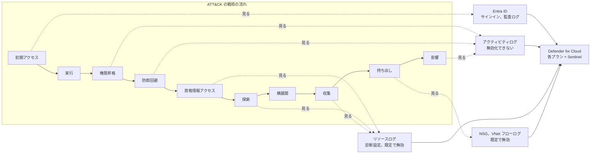
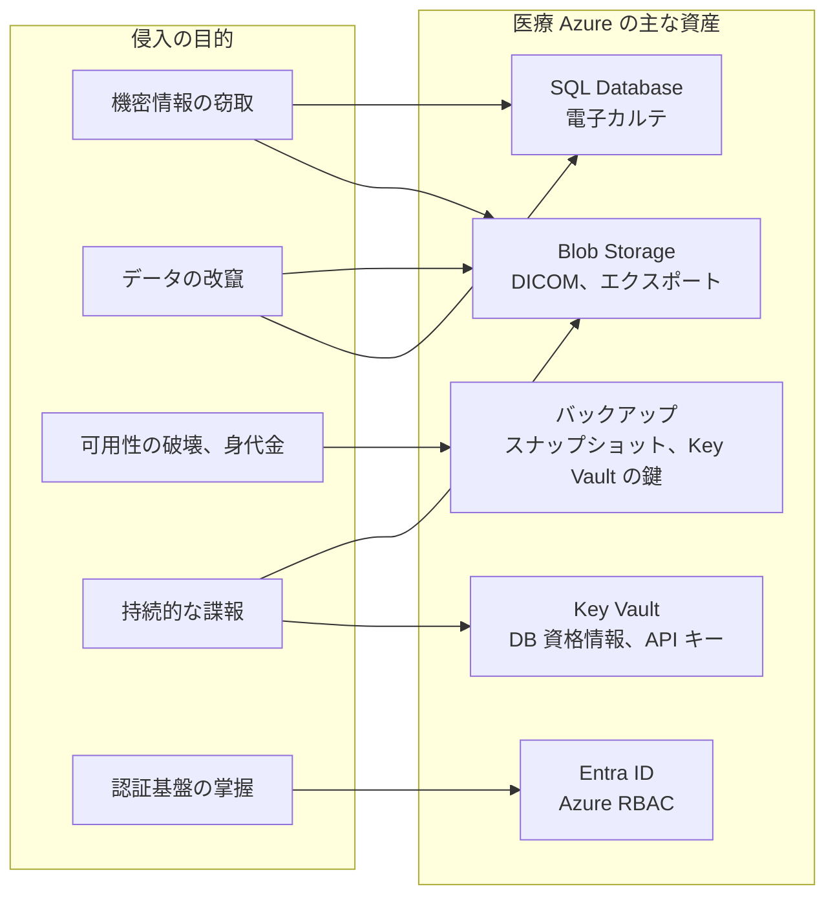
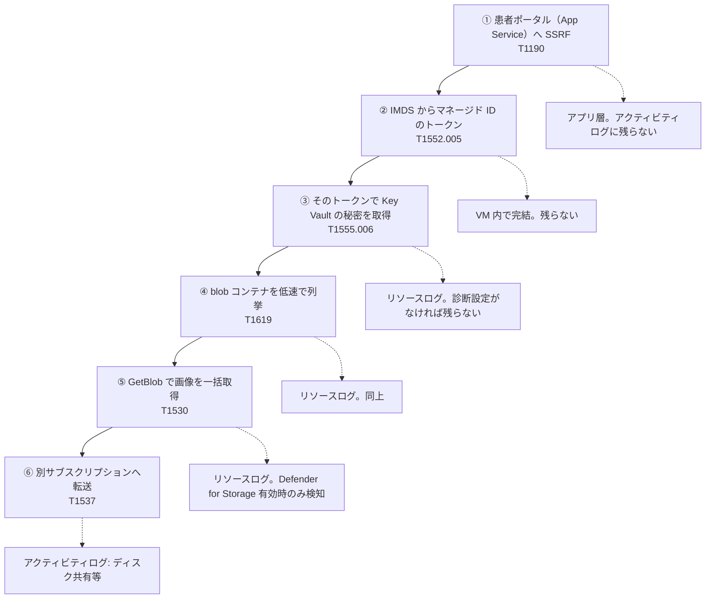
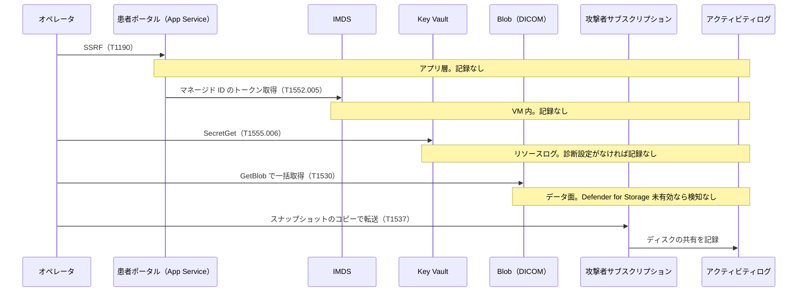
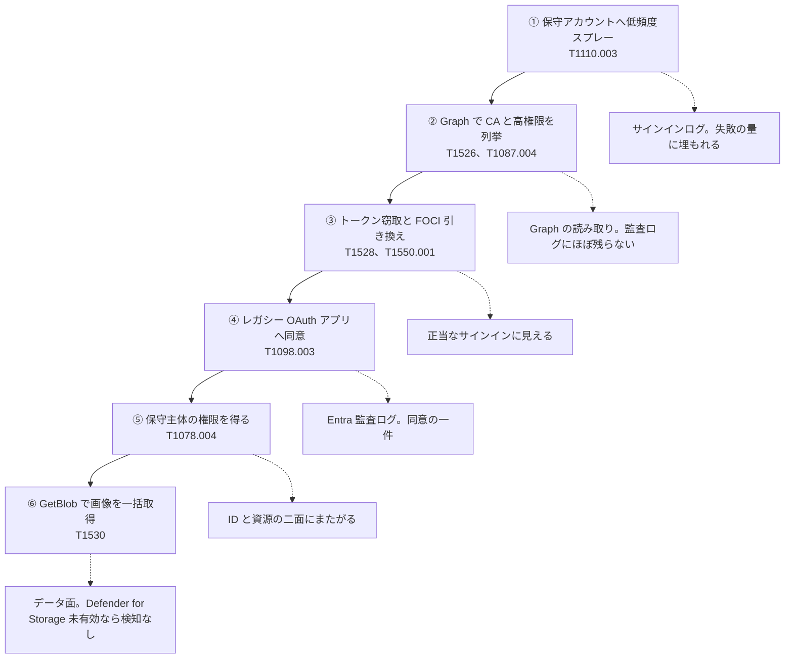
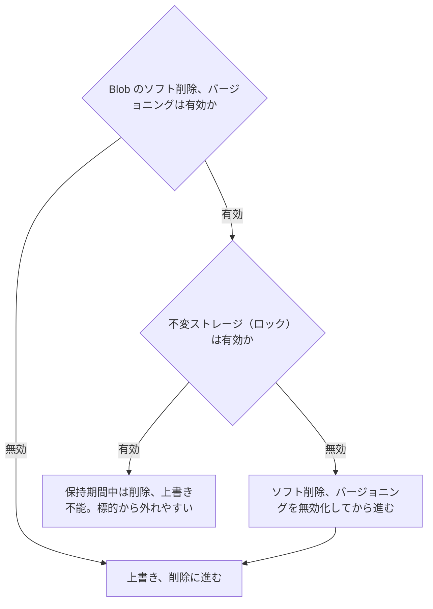
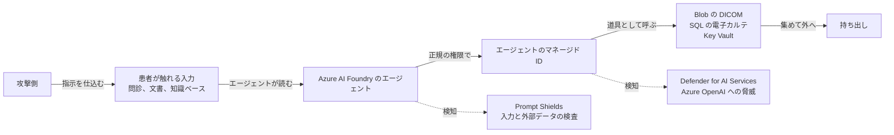

# 🗺️ MITRE ATT&CK for Cloud から見た医療クラウド環境（Microsoft Azure 編）

医療機関や製薬企業が電子カルテ、画像、検査データを Microsoft Azure に置くと、攻撃の起点は院内の端末から、テナントの ID とサブスクリプションの API に移る。
そこで起きる操作の多くは、盗まれた資格情報による正当な API 呼び出しであり、マルウェアの実行として現れない。
このため、防御側が持つ手がかりは、アクティビティログと Entra ID のサインインログ、そして Microsoft Defender for Cloud の検出結果に集中する。

本ページは、Azure 上の医療システムに対する攻撃を、MITRE ATT&CK の Cloud（IaaS）の戦術の流れに沿って並べる。
各戦術で、医療の Azure 環境ではどう現れるか、そしてどの条件で記録と検知から外れるかを、対になる観測点とともに示す。

Azure の記録の設計は、AWS とも Google Cloud とも違う。
最も大きいのは、ID が二つの面に分かれている点である。
テナントの ID（利用者、グループ、サービスプリンシパル、Global Administrator などのディレクトリロール）は Microsoft Entra ID が持ち、その記録はサインインログと監査ログにある。
サブスクリプションとリソースの権限（Owner、Contributor、User Access Administrator などの Azure RBAC ロール）は Azure Resource Manager が持ち、その記録はアクティビティログにある。
攻撃側にとって最も価値のある一手、すなわち Global Administrator から全サブスクリプションの root スコープの権限を得る操作は、この二つの面をまたぐ。
このため、防御側は二つの記録系統を突き合わせないと、経路の全体を追えない。

本ページは、手練れのオペレータが現実にこの環境へ侵入する視点で書く。
記録がどの面に、どの条件で残るか、記録が避けられない段でオペレータがフィールドの中身をどう平常に寄せるか、そして防御側がどこから閉じるかを、戦術ごとに対にして示す。
ステルスの成否は、攻撃側の技量より、防御側が診断設定と Defender for Cloud の各プランに加えて、ID の面の手当をどこまで敷いているかで決まる。
医療機関が患者データを扱う AI モデルとエージェントを Azure OpenAI と Azure AI Foundry に載せ始めたことで、攻撃面はさらに広がっている。
この新しい面は第 17 節にまとめる。

> [!NOTE]
> **表記ルール**：本ページでは、**事実**（一次情報で確認できる内容。出典を併記する）、**報道ベース**（報道や第三者の集計のみで確認でき、当事者の公表資料では裏付けが取れていない内容）、**分析**（筆者の解釈）を書き分ける。
>
> **ATT&CK のバージョン**：技術 ID は、本リポジトリの[クラウド事業者と医療](README.md#attck-との対応)および[脅威アクターと TTPs](../../threats/actors/) と揃え、従来の 14 戦術の区分で表記する。
> ATT&CK v18 で一部の技術は再編された。該当箇所には現行の ID を併記する。
>
> **AWS 編、Google Cloud 編との関係**：戦術の並びと表の形は [AWS 編](mitre-attack-aws.md)、[Google Cloud 編](mitre-attack-google-cloud.md)と揃えてある。
> 三者を横に並べて読むと、同じ技術が事業者ごとにどこで記録され、どこで欠けるかの差が見える。
> 事業者間の差の要点は [0.3](#03-aws-と-google-cloud-との違いがどこに出るか) に三者の対応表としてまとめた。

> [!WARNING]
> 本ページは、自組織の Azure 環境の検知設計と、許可されたレッドチーム演習の設計に使うことを想定している。
> 権限のない環境に対する検証と、防御機能の無効化は行わない。
> 立場ごとにどこで法の線に触れるかは[検証と調査の法的境界](../../practice/legal-boundary.md)に、演習の枠組みは[レッドチームと TLPT を医療機関に当てはめる](../../practice/pentest/red-team-tlpt.md)にまとめている。
>
> 本ページに、そのまま実行できる攻撃コードは載せない。
> 載せるのは、**どの操作がどの記録に残り、どの条件でその記録が欠けるか**である。
> 攻撃シナリオは公表資料から組み立てた想定であり、実在する特定の医療機関や事業者を指すものではない。

---

## 0. 前提：Azure の検知が見ている範囲

回避の可否は、攻撃の巧拙より先に、各サービスが何を入力にしているかで決まる。
まず Azure のセキュリティ機能を区分ごとに並べ、次に検知の入力になる記録の範囲を確定させる。

### 0.1 Azure のセキュリティサービスと機能

Azure のセキュリティ機能のうち、本ページの主題である記録と検知に関わるものを役割ごとに並べる。
右端は、レッドチーム演習でその段の記録や検知の起点になるかどうかの目安である。

| 区分 | サービス、機能 | 役割 | 演習で見る段 |
|---|---|---|---|
| 記録 | Azure Monitor アクティビティログ | Azure Resource Manager の書き込み操作（作成、更新、削除）の記録。無効化できない | 全戦術の起点 |
| 記録 | Azure Monitor リソースログ（診断設定） | リソースごとのデータ面の操作の記録。既定で無効 | 資格情報アクセス、探索、収集 |
| 記録 | Microsoft Entra ID サインインログ | 利用者とサービスプリンシパルの認証の記録 | 初期アクセス、横展開 |
| 記録 | Microsoft Entra ID 監査ログ | ディレクトリの変更（ロール付与、アプリ登録、同意）の記録 | 永続化、権限昇格 |
| 記録 | NSG フローログ、VNet フローログ | サブネットとネットワークインタフェースの通信の記録。既定で無効 | 横展開、持ち出し |
| 記録 | Azure Monitor Log Analytics ワークスペース | 記録の保存、相関、保持 | 防御回避、事後調査 |
| 脅威検知 | Microsoft Defender for Cloud | プランごとに分かれた脅威検知の集合 | 全戦術 |
| 脅威検知 | Defender for Resource Manager | アクティビティログを入力にした管理操作の検知 | 権限昇格、防御回避 |
| 脅威検知 | Defender for Storage | ストレージのデータ面と制御面のテレメトリの検知 | 収集、持ち出し |
| 脅威検知 | Defender for Key Vault | 鍵と秘密への異常なアクセスの検知 | 資格情報アクセス |
| 脅威検知 | Defender for Servers | VM 上の実行時の検知（Defender for Endpoint 統合） | 実行、権限昇格 |
| 脅威検知 | Defender for AI Services | Azure OpenAI などへの脅威の検知 | AI ワークロード（17） |
| 脅威検知 | Microsoft Entra ID Protection | サインインと利用者のリスク検知（トークンの異常、危険なサインイン） | 初期アクセス、資格情報アクセス |
| 脅威検知 | Microsoft Defender for Identity | オンプレミス AD と AD FS、Azure AD Connect の側の検知 | 資格情報アクセス（偽造） |
| SIEM、相関 | Microsoft Sentinel | 複数の記録を横断した相関と、攻撃の並びの検知 | 全戦術の集約 |
| 姿勢評価 | Defender CSPM、セキュリティスコア | 構成の逸脱の継続評価 | 全戦術の前提 |
| データ保護 | Microsoft Purview | 機微データ（PHI、PII）の発見と分類 | 収集、探索 |
| ID とアクセス | Microsoft Entra ID | 人とワークロードの ID、条件付きアクセス、多要素認証 | 初期アクセス |
| ID とアクセス | Azure RBAC | サブスクリプションとリソースへの権限付与 | 権限昇格、横展開 |
| ID とアクセス | マネージド ID | Azure リソースに割り当てる ID。資格情報を持たない | 資格情報アクセス、横展開 |
| ID とアクセス | Privileged Identity Management（PIM） | ロールの一時付与と承認 | 権限昇格 |
| 境界と予防 | Azure Policy | サブスクリプションと管理グループに構成の上限を敷く | 権限昇格、防御回避 |
| 境界と予防 | ストレージのファイアウォールとプライベートエンドポイント | データ面の到達制御 | 持ち出し |
| データと鍵 | Azure Key Vault、Managed HSM | 鍵、証明書、秘密の保管 | 資格情報アクセス、影響 |
| AI の予防 | Azure AI Content Safety（Prompt Shields） | プロンプト攻撃と有害な内容の検査、遮断 | AI ワークロード（17） |

**事実**：Microsoft Defender for Cloud は、資源の種別ごとに分かれたプランの集合である。
Defender for Servers、Storage、Key Vault、Resource Manager、Containers、Databases、App Service、APIs が個別に有効化され、それぞれが対応するテレメトリを解析する（[Microsoft Learn](https://learn.microsoft.com/en-us/azure/defender-for-cloud/defender-for-cloud-introduction)）。
AI ワークロード向けの Defender for AI Services も、同じくプランとして有効化する（[Microsoft Learn](https://learn.microsoft.com/en-us/azure/defender-for-cloud/ai-threat-protection)）。

**分析**：予防（Azure Policy、ストレージのファイアウォール、Key Vault）と、記録（アクティビティログ、リソースログ、Entra ID ログ）と、検知（Defender for Cloud の各プラン）は別の層である。
回避で問題になるのは記録と検知の層であり、この二層は Defender の該当プランを有効にしていない範囲で薄くなる。
Defender for Cloud は独立したサービスに見えるが、入力は記録の層に依存する。
このため、次の 0.2 で記録の層の範囲を先に確定させる。

### 0.2 三つの記録系統と、既定で欠ける範囲

**事実**：Azure のログは三つの系統に分かれる。

- **アクティビティログ**：Azure Resource Manager に対する制御面の操作（作成、更新、削除）を記録する。読み取りの操作は記録しない。Azure Monitor が既定で収集し、設定は要らず、無効化もできない。ネイティブの保持期間は 90 日で、延長するには診断設定でログ分析やストレージへ送る（[Microsoft Learn](https://learn.microsoft.com/en-us/azure/azure-monitor/essentials/platform-logs-overview)、[Activity Log](https://learn.microsoft.com/en-us/azure/azure-monitor/essentials/activity-log)）。
- **リソースログ（データ面）**：リソースの内部で起きる操作（Key Vault の秘密の取得、ストレージの blob 読み取りなど）を記録する。リソースごとに診断設定を作らない限り、収集されない（[Microsoft Learn](https://learn.microsoft.com/en-us/azure/azure-monitor/essentials/diagnostic-settings)）。
- **Microsoft Entra ID のログ**：利用者とサービスプリンシパルの認証（サインインログ）と、ディレクトリの変更（監査ログ）を記録する。アクティビティログとは別系統であり、保持期間は Entra ID Free で 7 日、P1 と P2 で 30 日である。延長するには診断設定で Log Analytics へ送る（[Microsoft Learn](https://learn.microsoft.com/en-us/entra/identity/monitoring-health/reference-reports-data-retention)）。

**事実**：Azure が定めるログの区分では、制御面のログは Resource Manager の作成、更新、削除の操作を、データ面のログは資源の利用として起きる操作を扱う（[Microsoft Learn](https://learn.microsoft.com/en-us/azure/security/fundamentals/log-audit)）。
Key Vault からの秘密の取得や、データベースへの要求は、後者にあたる。

ここまでを、医療で問題になる操作に当てはめると、既定の記録の範囲は次のようになる。

| 操作 | 記録系統 | 既定で記録されるか | 出典 |
|---|---|---|---|
| ロールの割り当て（`Microsoft.Authorization/roleAssignments/write`） | アクティビティログ | される | [Activity Log](https://learn.microsoft.com/en-us/azure/azure-monitor/essentials/activity-log) |
| root スコープへの権限昇格（`Microsoft.Authorization/elevateAccess/action`） | アクティビティログ | される | 同上 |
| ストレージアカウントキーの一覧（`Microsoft.Storage/storageAccounts/listKeys/action`） | アクティビティログ | される | 同上 |
| マネージドディスクの共有（`Microsoft.Compute/disks/beginGetAccess/action`） | アクティビティログ | される | 同上 |
| VM でのコマンド実行（`Microsoft.Compute/virtualMachines/runCommand/action`） | アクティビティログ | される（コマンドの中身は残らない） | 同上 |
| ARM の読み取り（リソース、ロールの割り当ての列挙） | アクティビティログ | されない | 同上 |
| サービスプリンシパルの作成、資格情報の追加 | Entra ID 監査ログ | される（Entra 側） | [Entra 監査ログ](https://learn.microsoft.com/en-us/entra/identity/monitoring-health/concept-audit-logs) |
| OAuth アプリへの同意 | Entra ID 監査ログ | される（Entra 側） | 同上 |
| 利用者、サービスプリンシパルのサインイン | Entra ID サインインログ | される（Entra 側） | [Entra サインインログ](https://learn.microsoft.com/en-us/entra/identity/monitoring-health/concept-sign-ins) |
| Key Vault の秘密の値の取得（`SecretGet`） | リソースログ（データ面） | されない | [Key Vault のログ](https://learn.microsoft.com/en-us/azure/key-vault/general/logging) |
| blob の読み取り（`GetBlob`） | リソースログ（データ面） | されない | [ストレージのログ](https://learn.microsoft.com/en-us/azure/storage/blobs/monitor-blob-storage) |
| blob の作成、削除（`PutBlob`、`DeleteBlob`） | リソースログ（データ面） | されない | 同上 |
| アカウントキーからの SAS の生成 | どの系統にも残りにくい | されない | クライアント側で計算される（[7](#7-資格情報アクセス)） |
| マネージド ID の IMDS からのトークン取得 | どの系統にも残らない | されない | VM 内で完結する |
| FHIR、DICOM の読み取り、エクスポート（`AuditLogs`） | リソースログ（データ面） | されない | [FHIR の診断ログ](https://learn.microsoft.com/en-us/azure/healthcare-apis/fhir/fhir-service-diagnostic-logs)、[DICOM の診断ログ](https://learn.microsoft.com/en-us/azure/healthcare-apis/dicom/enable-diagnostic-logging) |

**分析**：この表の中央から下に、医療で最も重い空白がある。
既定の設定のままの Azure 環境では、Key Vault から DB の資格情報を読み出しても、ストレージの blob から検査結果を一括で読んでも、Azure Health Data Services の FHIR や DICOM から患者記録をエクスポートしても、リソースログに一行も残らない。
一方、権限を作る操作（ロールの割り当て、root スコープへの昇格）と、ARM の制御面の操作（キーの一覧、ディスクの共有、Run Command）は、アクティビティログに既定で残る。
**記録の線は、Resource Manager の制御面の書き込みと、それ以外（ARM の読み取りと、資源のデータ面）の間に引かれている**。
そして ID の操作は、そのどちらでもない第三の系統（Entra ID のログ）にある。

なお、二つの空白は Azure に固有である。
一つは、盗んだストレージアカウントキーから生成する SAS（Shared Access Signature）で、鍵からクライアント側で計算されるため、生成そのものはサーバ側の記録に残りにくい（[7](#7-資格情報アクセス)）。
もう一つは、マネージド ID の IMDS からのトークン取得で、VM の内部で完結する（[7](#7-資格情報アクセス)）。

### 0.3 AWS と Google Cloud との違いが、どこに出るか

**分析**：三社は、記録の線の引き方が違う。
AWS の CloudTrail は、制御面（管理イベント）とデータ面（データイベント）で分かれる。
Google Cloud の Cloud Audit Logs は、書き込み（Admin Activity）と読み取りおよびデータ操作（Data Access）で分かれる。
Azure は、ARM の制御面（アクティビティログ）と、資源のデータ面（リソースログ）に加えて、ID の面（Entra ID のログ）が独立した第三の系統になる。
この線の引き方が違うため、同じ攻撃技術でも、記録の有無と、記録が乗る系統が事業者ごとに入れ替わる。

| 攻撃側の操作 | AWS の既定 | Google Cloud の既定 | Azure の既定 |
|---|---|---|---|
| 別の主体の権限を得る | `AssumeRole` は管理イベントに残る | `GenerateAccessToken` は Data Access であり残らない | ロールの割り当ては ARM のアクティビティログに残る |
| 秘密の値を取り出す | `GetSecretValue` は管理イベントに残る | `AccessSecretVersion` は Data Access であり残らない | Key Vault の `SecretGet` は診断設定がなければ残らない |
| 環境の形を調べる | `Describe*`、`List*` の大半は管理イベントに残る | 読み取りは Data Access に落ち残らない | ARM の読み取りは残らない。`listKeys` のような POST のアクションだけが残る |
| オブジェクトを読む | データイベント。未設定なら残らないが GuardDuty の S3 Protection が独立解析する | Data Access。有効化しなければ検知の入力も存在しない | 診断設定がなければ残らないが、Defender for Storage が独立解析する |
| 認証の記録 | ログインは管理イベントに残る | サインインは Cloud Identity 側に残る | サインインは Entra ID の別系統に残る |
| 記録そのものを止める | 証跡の停止と削除ができる | Admin Activity は無効化できない | アクティビティログは無効化も削除もできない。止められるのは診断設定（転送先）だけ |
| 監視の外へ出る | 未有効リージョンへ退避する（[T1535](https://attack.mitre.org/techniques/T1535/)） | プロジェクトを組織から外す（[T1666](https://attack.mitre.org/techniques/T1666/)） | 監視されないサブスクリプションを作る、管理グループの外へ移す（[T1666](https://attack.mitre.org/techniques/T1666/)） |
| ID の最上位を握る | ルートユーザ、Organizations 管理アカウント | 組織管理者、フォルダ管理者 | Global Administrator から root スコープの User Access Administrator へ昇格する |

**分析**：Azure 側から見た含意は三つある。

第一に、**Azure では ID の面と資源の面を別々に見ないと経路が切れる**。
攻撃側にとって最も価値のある一手は、Entra ID の Global Administrator から、Azure RBAC の全サブスクリプションの権限（root スコープの User Access Administrator）を得る操作である。
これは Entra ID とアクティビティログの二つの系統にまたがって残るため、片方だけを見ていると昇格の全体が見えない（[5](#5-権限昇格)）。
AWS と Google Cloud では ID の面が一つで、この分断がない。

第二に、**Azure では制御面のログを止められない**。
アクティビティログは Google Cloud の Admin Activity と同じく無効化も削除もできず、90 日はネイティブに残る。
AWS の `StopLogging` に相当する行為は、Azure では診断設定（Log Analytics やストレージへの転送）の削除になる。
これは記録の転送を止めるだけで、90 日のネイティブの記録は残る。
逆に、90 日を超える調査は診断設定の転送先に全面的に依存するため、転送先の Log Analytics ワークスペースや保存先ストレージの削除が、実質的な記録の除去になる（[6](#6-防御回避)）。

第三に、**Azure では検知を記録より先に入れられる**。
Defender for Storage と Defender for Resource Manager は、利用者側の診断設定に依存せず、独立したテレメトリで解析する（[Microsoft Learn](https://learn.microsoft.com/en-us/azure/defender-for-cloud/defender-for-storage-introduction)）。
この点は AWS の GuardDuty の S3 Protection に近く、Google Cloud の Event Threat Detection が利用者の有効化したログしか読まないのとは逆である。
医療機関が三社を併用している場合、着手の順序が事業者ごとに変わる。
Azure と AWS では検知を先に入れて記録を後から足せるが、Google Cloud では記録を先に有効にしないと検知が始まらない。

詳細は [AWS 編の 0.3](mitre-attack-aws.md#03-google-cloud-との違いがどこに出るか) と [Google Cloud 編の 0.3](mitre-attack-google-cloud.md#03-aws-との違いがどこに出るか) に置いた。

以降の節では、この対応を戦術ごとに具体化する。

---

## 1. 演習で狙う到達目標と、秘匿の原則

医療のレッドチーム演習は、権限を取ること自体を目的にしない。
何を取りに行くか（到達目標）を先に決め、そこへ気付かれずに届く経路を測る。
この節は、目的の例と、到達をどう判定するか、そして Azure で秘匿を成立させる原則を置く。

### 1.1 侵入の目的（レッドチーム視点の例）

医療の環境では、目的によって狙うデータと、成立したときの被害の質が変わる。

| 目的 | 医療での具体 | 主に使う戦術（本ページの節） | 患者と診療への帰結 |
|---|---|---|---|
| 機密情報の窃取 | 診療記録、DICOM 画像、検査結果、ゲノム、治験データの一括取得 | 探索（8）、収集（10）、持ち出し（11） | 大規模な個人情報の漏えい |
| データの改竄 | 検査値、処方、投薬記録、画像の改変 | 権限昇格（5）、収集（10） | 誤診、誤投薬。患者安全に直結する |
| 可用性の破壊、身代金 | バックアップとスナップショットの削除、暗号化 | 防御回避（6）、影響（12） | 診療の停止、復旧不能 |
| 持続的な諜報 | 気付かれない足場からの継続的な情報収集 | 永続化（4）、資格情報アクセス（7） | 長期の情報流出、供給網への波及 |
| 認証基盤の掌握 | Entra ID と Azure RBAC を握り、任意の利用者になりすます | 権限昇格（5）、横展開（9） | 検知と調査の前提が崩れる |

**分析**：この五つのうち、機密情報の窃取と持続的な諜報は、気付かれないこと自体が価値に直結する。
改竄と可用性の破壊は、実行の瞬間に気付かれても目的は達せられるため、秘匿より速度を選ぶ場合がある。
認証基盤の掌握は、Azure では Entra ID の掌握を意味し、他の四つの前提を一度に崩す点で重い。

目的は、医療の Azure 環境のどの資産に向かうかで具体化する。

### 1.2 到達の判定と、本番での安全な代替

稼働中の医療環境では、目的の完遂そのものは実行しない。
到達したことを、破壊や持ち出しの一歩手前で判定する。

- **機密情報の窃取**：データを外へ出さず、対象の blob やテーブルに到達して読める状態を、無害な標識ファイルの取得や件数の確認で示す。
- **データの改竄**：本番のレコードを書き換えず、書き込み権限が及ぶことを、演習用に用意した領域への書き込みで示す。
- **可用性の破壊**：削除や暗号化を実行せず、対象のバックアップと鍵への削除権限が及ぶことを、権限の評価で示す。

この線引きは、[診断とペネトレーションテスト](../../practice/pentest/README.md#6-実施設計止められない環境でどう安全に測るか)の実施設計と、[レッドチームと TLPT](../../practice/pentest/red-team-tlpt.md)の中止条件に沿わせる。

### 1.3 Azure で秘匿を成立させる原則

第 0 節の記録の性質を、攻撃側の作業手順に翻訳すると次の原則になる。
いずれも新しい脆弱性ではなく、記録と検知の入力の性質を突くものである。
以下で挙げる検出結果の名称は、Defender for Cloud の各プランのアラートの一覧による（[Resource Manager のアラート](https://learn.microsoft.com/en-us/azure/defender-for-cloud/alerts-resource-manager)、[Storage のアラート](https://learn.microsoft.com/en-us/azure/defender-for-cloud/alerts-azure-storage)）。

最初の一群は、記録の系統そのものを避ける原則である。
Azure の記録の中心であるアクティビティログは、あくまで Azure Resource Manager の制御面のログである。
ID の面（Entra ID、Microsoft Graph）とトークンの再生だけで進む作戦は、ARM を一度も呼ばず、アクティビティログに一行も残さない。
手練れのオペレータが Azure でまず考えるのは、資源を操作する前に、この ID の面でどこまで届くかである。

- **ARM を通らずに済ませる**：認証（Entra サインインログ）とディレクトリの読み取り（Graph）だけで進む探索は、ARM のアクティビティログに残らない。トークンの窃取と再生、Graph によるディレクトリの列挙は、この面の外を通る（[7](#7-資格情報アクセス)、[8](#8-探索)）。
- **パスワードでなくトークンを盗む**：盗んだアクセストークン、更新トークン、Primary Refresh Token（PRT）を再生すると、パスワードも多要素認証も要らず、正当なサインインとして現れる。パスワードスプレーが積み上げる失敗の信号も生じない。PRT は既定で 90 日有効で、その間トークンを刷り続けられる（[7](#7-資格情報アクセス)）。
- **FOCI で一つのトークンを横に広げる**：Azure CLI などの第一者クライアントの更新トークンは、同じファミリー（FOCI、Family of Client IDs）の別クライアント、たとえば Microsoft Graph、Teams、SharePoint のトークンに引き換えられる。一度の窃取が、再認証なしに複数のリソースへ届く（[9](#9-横展開)）。
- **再生の発行元を平常に寄せる**：トークンを被害者の普段の地域と経路に合わせて再生すると、Entra ID Protection の Atypical travel、Unfamiliar sign-in properties、Anomalous Token の判定に触れにくい。侵害した端末や、その組織と同じ国の住宅用プロキシを経由すると、位置の異常が立たない。
- **オンプレミスの面で偽造する**：フェデレーションや Seamless SSO を使う組織では、署名鍵や Kerberos 鍵をオンプレミス側で握れば、クラウドに正規のトークンを発行させられる。この偽造の記録はオンプレミス側にしか残らず、クラウドのサインインログには正規の利用として現れる（[7](#7-資格情報アクセス)）。

次の一群は、資源を操作せざるを得ない段での原則である。

- **ARM の制御面よりデータ面を選ぶ**：診断設定を敷いていないリソースでは、Key Vault の秘密の取得（[7](#7-資格情報アクセス)）や blob の取得（[10](#10-収集)）が記録の外で進む。0.2 の表でいえば、リソースログの行に留まる。
- **マネージド ID をその VM の内側で使う**：SSRF や RCE で得たマネージド ID のトークンは、IMDS の取得自体が VM 内で完結し記録に残らない。トークンをその VM の内側で使う限り、発行元と使用元の不一致が生じない。
- **既存の RBAC 割り当てを引き受ける**：新しいサービスプリンシパルや鍵を増やさず、すでに広い権限を持つ保守の主体を使う。サービスプリンシパルの作成やアプリへの資格情報追加は Entra ID の監査ログに残る。
- **道具の指紋を残さない**：MicroBurst、PowerZure、Azurite などの攻撃ツールキットは、Defender for Resource Manager が名指しで検出する（`ARM_MicroBurst.*`、`ARM_PowerZure.*`、`ARM_Azurite`）。素の Azure CLI や PowerShell の Az モジュール、REST の直接呼び出し、Entra とトークンを扱う ROADtools や AADInternals には、この ARM のアクティビティログを見る名指しの検出は反応しない。
- **root スコープへの昇格を避けられる場面では避ける**：Global Administrator から root スコープへ昇格する `elevateAccess` は、アクティビティログに残り、Defender for Resource Manager が `ARM_AnomalousElevateAccess` として検出する。既に広い権限を持つ主体を使えるなら、この一手は要らない。
- **列挙を平常の速度に落とす**：短時間の広範囲な列挙は、Defender の異常検知と、サービスプリンシパルによる高リスク操作の検出（`ARM_AnomalousServiceOperation.*`）に触れる。探索（[8](#8-探索)）を、平常の運用に紛れる速度と量に分ける。
- **監視の薄いサブスクリプションを選ぶ**：Defender for Cloud のプランはサブスクリプション単位で有効化するため、未有効のサブスクリプションに閉じた操作は検知の対象外になる。ただし Entra ID の操作はテナント単位で残る。
- **保守の窓に合わせる**：夜間や休日の保守で権限行使が増える時間帯に作業を寄せると、平常との差が出にくい。
- **診断設定を消しにいかない**：診断設定の削除はアクティビティログに残り、90 日のネイティブの記録は消えない。記録が既に薄い範囲では、消す操作が記録を増やすだけになる。

**分析**：これらは防御側から見れば、そのまま埋めるべき穴の一覧になる。
最初の一群、すなわちトークンと ID の面の原則は、資源の面の設定（診断設定、Defender for Cloud のプラン）をどれだけ敷いても閉じない。
Entra ID Protection、条件付きアクセス、トークン保護、そして Entra のログの集約が、この面の手当になる（[7](#7-資格情報アクセス)）。
秘匿の成否は、攻撃側の技量より、防御側が ID の面と資源の面の両方をどれだけ潰しているかで決まる。

### 1.4 記録が残っても、何が書かれるかは攻撃側が選ぶ

前節までは、記録そのものを避ける原則だった。
Azure では、権限の割り当ても root スコープへの昇格も既定でアクティビティログに残るため、記録を避けきれない段がある。
そこで問題になるのは、その一件に**何が書かれるか**である。
Defender の異常検知は記録のフィールドを入力にするため、フィールドを平常に寄せられれば、記録が残っても検出結果が生じないことがある。
アクティビティログのイベントのフィールドは、次のように攻撃側が制御できるものと、できないものに分かれる（[アクティビティログのスキーマ](https://learn.microsoft.com/en-us/azure/azure-monitor/essentials/activity-log-schema)）。

| フィールド | 内容 | 攻撃側が制御できるか |
|---|---|---|
| `caller` | 操作した主体（UPN、オブジェクト ID） | できない。引き受けた主体そのものが載る |
| `callerIpAddress` | 発行元の IP | 消せないが、選べる。侵害した資源から呼べば内部の経路を通せる |
| `operationName` | 操作の種別（`roleAssignments/write` など） | できない |
| `resultType` | 成否（`Success`、`Failure`） | できない。権限を試すほど失敗が積み上がる |
| `authorization` | 呼び出しに使われたスコープとロール | できない |
| `claims` | トークンの主張（アプリ ID、認証方法など） | 部分的。どのアプリ、どの認証を使うかは選べる |

**分析**：この表の一行目に、Azure の特徴が出る。
`caller` は制御できないため、サービスプリンシパルやマネージド ID を使っても、その主体の ID が載る。
攻撃側にできるのは、載る値を平常の側にすること、すなわち保守が普段から使う主体で、普段どおりのスコープに対して操作することだけである。
これは防御側にとって利点になる。
主体が記録に残る以上、「その主体が、普段は使わない高リスクの操作を初めて行った」という判定が成立し、Defender for Resource Manager の `ARM_AnomalousServiceOperation.*` と `ARM_UnusedAccountPersistence` がその判定を担っている。

**分析**：`resultType` は制御できない。
権限を総当たりで試す方式は `Failure` を積み上げるため、平時の失敗の量を基準にしていれば信号になる。
ただし、拒否を作らずに権限だけを問う経路は Azure にもある。
`Microsoft.Authorization/permissions` の読み取りは、呼び出し元がそのスコープで持つ権限の一覧を返す（[Microsoft Learn](https://learn.microsoft.com/en-us/rest/api/authorization/permissions/list-for-resource-group)）。
これは読み取りであり、アクティビティログにも残らない（[0.2](#02-三つの記録系統と既定で欠ける範囲)）。
`Failure` が積み上がるのは、権限を実際の書き込み操作で総当たりする方式に限られる。

### 1.5 騒がしい操作と、静かな代替

上の原則を、目的ごとの選択として表にする。
演習の設計では、左の列を選べば検知を測れ、右の列を選べば記録の空白を測れる。

| 目的 | 騒がしい操作 | 発火しうる検出 | 静かな代替 | 代替が残す記録 |
|---|---|---|---|---|
| 権限の獲得 | 新しいサービスプリンシパルに鍵を足す | Entra 監査ログ、異常検知 | 既存の保守の主体を使う | 保守と同形の操作 |
| 権限の獲得 | Global Admin から root スコープへ昇格 | `ARM_AnomalousElevateAccess` | 既に広い権限を持つ RBAC 割り当てを使う | アクティビティログに操作一件 |
| 権限の把握 | 攻撃ツールキットで列挙 | `ARM_MicroBurst.*`、`ARM_PowerZure.*` | 素の Az CLI、REST で必要な範囲だけ読む | 呼び出しに応じた区分 |
| 昇格 | カスタムの特権ロールを作る | `ARM_PrivilegedRoleDefinitionCreation` | 既に広い権限を持つ主体を使う | アクティビティログに割り当て一件 |
| 探索 | 短時間に広範囲を列挙する | `ARM_AnomalousServiceOperation.Collection` | 保守の時間帯に、平常の量に分けて呼ぶ | 記録に残るが量に埋もれる |
| 資格情報 | Key Vault の秘密を大量に読む | `ARM_MicroBurst.AzKeyVaultSecretsREST`、Defender for Key Vault | 診断設定のない Key Vault から必要分だけ読む | リソースログ（未設定なら記録なし） |
| 収集 | ストレージを匿名公開に変える | Defender for Storage の公開検出 | 既存の権限のまま `GetBlob` で読む | リソースログ（未設定なら記録なし） |
| 持ち出し | ディスクを SAS URL で外へ出す | `Export Disk Through SAS URL` 系の検出 | スナップショットを別サブスクリプションへコピー | アクティビティログに一件 |
| 記録の除去 | 診断設定を削除する | アクティビティログに残る | データ面の診断設定のない範囲に留まる | 記録なし |

**分析**：右の列に共通するのは、**新しい構成を作らず、既にあるものを引き受けて読む**ことである。
Azure でこの列を選んでも、ロールの割り当てのような書き込みの操作はアクティビティログに残る。
残るが、単独では保守の正常操作と区別がつかない。
そのため Azure では、一件ずつの異常ではなく、操作の順序を読む設計が要る。
Microsoft Sentinel の相関ルールと、Defender for Cloud のインシデント（複数のアラートを一つの攻撃に束ねる仕組み）が、この構造に対応するためにある。

### 1.6 機密情報の窃取を例にしたステルス経路

上の原則を、機密情報の窃取という目的で一本につなぐと次の経路になる。
左の列が攻撃の各段、右の点線がその段で記録に残るかどうかである。

**分析**：記録に残らないのは①②で、③④⑤は診断設定がなければ残らない。
このうち⑤が、目的そのものが達せられる段でありながら記録の空白になる。
⑥は制御面の操作としてアクティビティログに残るが、正当なバックアップやサブスクリプション間移行と形が同じで、単独では異常として浮かびにくい。
防御側の手当は、③④⑤の空白を診断設定と Defender for Storage、Defender for Key Vault で閉じ、⑥を単独の異常ではなく順序で見ることに集約される。
この経路の各段の詳細は、以降の戦術別の節に対応する。

---

## 2. 初期アクセス

医療の Azure 環境で最初の一歩になるのは、外向きのアプリケーションと、Entra ID の認証面である。

**現れ方**：

- 患者ポータル、画像ビューア、予約や問診の Web アプリに認可の不備や既知の脆弱性があると、公開資産を起点に内側へ入られる（Exploit Public-Facing Application、[T1190](https://attack.mitre.org/techniques/T1190/)）。
  - 具体例：ファイルアップロード機能から App Service や VM に Web シェルを置く、画像ビューアの SSRF を資格情報アクセス（7）につなぐ、公開 API のパラメータ改ざんで認可を越える。
- 電子カルテや部門システムのベンダが保守用に持つサービスプリンシパルや、テナント間で共有された資格情報を経由する経路は、信頼関係の悪用にあたる（Trusted Relationship、[T1199](https://attack.mitre.org/techniques/T1199/)）。
  - 具体例：マルチテナントのアプリ登録で `Application` 権限が過剰、ゲストユーザ（B2B 招待）の権限が広い、Lighthouse の委任が広範。保守事業者そのものの侵害が、契約先の複数の医療機関のテナントへ連鎖する。
- 運用担当者の資格情報が盗まれれば、正規のクラウドアカウントとして入られる（Valid Accounts: Cloud Accounts、[T1078.004](https://attack.mitre.org/techniques/T1078/004/)）。
  - 具体例：公開 GitHub、コンテナイメージの環境変数、Terraform state、CI/CD のログに残ったサービスプリンシパルのクライアントシークレット。
- パスワードスプレーで、多要素認証のない、または弱い設定のアカウントに入る（Brute Force: Password Spraying、[T1110.003](https://attack.mitre.org/techniques/T1110/003/)）。
  - **事実**：Microsoft は 2024 年 1 月、国家支援のアクター Midnight Blizzard（APT29）が、多要素認証を有効にしていない旧来の非本番のテストテナントのアカウントに対し、住宅用プロキシを経由した低頻度のパスワードスプレーで侵入したと公表した。攻撃側は失敗の量で気付かれないよう、対象と試行を絞っていた（[Microsoft Security Blog](https://www.microsoft.com/en-us/security/blog/2024/01/25/midnight-blizzard-guidance-for-responders-on-nation-state-attack/)）。
- フィッシングで Entra ID の資格情報とセッションを奪う手口は、多要素認証を回避する形をとることがある（Phishing、[T1566](https://attack.mitre.org/techniques/T1566/)）。
  - 具体例（MFA 回避）：Entra のデバイスコード認証フローを悪用し、正規の `https://login.microsoftonline.com/common/oauth2/deviceauth` に利用者を誘導してコードを入力させ、攻撃側がトークンを得る。中間者型（AiTM）の逆プロキシでセッションクッキーを奪う形、承認要求を繰り返す MFA 疲労（Multi-Factor Authentication Request Generation、[T1621](https://attack.mitre.org/techniques/T1621/)）も同じ狙いである。
- ソフトウェアサプライチェーンを侵害し、ビルドや CI/CD からクラウドへ入る（Supply Chain Compromise、[T1195](https://attack.mitre.org/techniques/T1195/)）。
  - 具体例：悪性の依存パッケージや依存混同でビルド時に資格情報を抜く、GitHub Actions の OIDC を引き受けるフェデレーション資格情報の信頼条件が甘く、別リポジトリのワークフローから Entra のトークンを得る。

**検知から外れる条件**：アプリケーション層での侵入は、Azure の管理 API を呼ばない限りアクティビティログには現れない。
Web サーバのアクセスログやアプリケーションログを別に取っていないと、この段は Azure 側の記録に残らない。
盗んだ資格情報での最初のサインインも、発行元が普段と同じ地域や、疑わしくない IP であれば、Entra ID Protection のリスク判定に触れにくい。
低頻度のパスワードスプレーは、失敗の量で気付かれない設計をとる。
デバイスコードのフィッシングは、利用者自身が正規に認証を終えるため、IdP 側の多要素認証や IP 制限では止まらない。

**残る観測点（検知、緩和）**：サインインの成否は Entra ID のサインインログに、ロールの割り当てはアクティビティログに残る。
Entra ID Protection は、危険なサインイン（見慣れない場所、匿名 IP、漏えい資格情報）をリスクとして評価する。
Defender for Resource Manager は、疑わしい IP やプロキシ IP からの ARM 操作を `ARM_OperationFromSuspiciousIP` と `ARM_OperationFromSuspiciousProxyIP` として検出する（[Microsoft Learn](https://learn.microsoft.com/en-us/azure/defender-for-cloud/alerts-resource-manager)）。
緩和は、全アカウントに多要素認証を課し条件付きアクセスでレガシー認証を塞ぐこと、デバイスコードのフィッシングにはフィッシング耐性のある多要素認証（パスキー、FIDO2）で対抗すること、サービスプリンシパルの資格情報を[外に出た認証情報](../credential-exposure.md)で監視すること、ゲストとマルチテナントのアプリの権限を最小化すること、外向きアプリの前段に[攻撃面の把握](../../practice/attack-surface.md)を継続することにある。

---

## 3. 実行

クラウドでの実行は、端末上のプロセスではなく、API とマネージドサービスの上で起きる。

**現れ方**：

- 盗んだ資格情報から Azure CLI や PowerShell、REST で API を呼ぶ操作は、クラウド API を介した実行にあたる（Command and Scripting Interpreter: Cloud API、[T1059.009](https://attack.mitre.org/techniques/T1059/009/)）。
  - 具体例：Cloud Shell を対話的な足場に使う、既存の CI/CD パイプラインに乗って正規の実行に紛れる。
- VM 上でコマンドを走らせる経路は、クラウド管理コマンドにあたる（Cloud Administration Command、[T1651](https://attack.mitre.org/techniques/T1651/)）。
  - 具体例：Run Command（`Microsoft.Compute/virtualMachines/runCommand/action`）、カスタムスクリプト拡張機能、VM アプリケーション、Azure Automation の Runbook、Arc 接続マシンへの拡張機能。
- 侵害した権限で Functions を作成、更新して任意の処理を動かす経路は、サーバレス実行にあたる（Serverless Execution、[T1648](https://attack.mitre.org/techniques/T1648/)）。
  - 具体例：Function App のコードを差し替える、Logic Apps のワークフローに処理を足す。
- 管理者を欺いて悪性のイメージを実行させる経路は、利用者実行にあたる（User Execution: Malicious Image、[T1204.003](https://attack.mitre.org/techniques/T1204/003/)）。
  - 具体例：共有ギャラリーや Container Registry に置いた汚染イメージ、共有された悪性のマネージドイメージを起動させる。
- コンテナを立てて実行する経路は、コンテナの配置にあたる（Deploy Container、[T1610](https://attack.mitre.org/techniques/T1610/)）。
  - 具体例：Azure Container Instances で攻撃者のイメージを動かす。AKS では、コンテナ内でコマンドを実行する操作が別の技術にあたる（Container Administration Command、[T1609](https://attack.mitre.org/techniques/T1609/)）。

**検知から外れる条件**：Run Command や拡張機能による実行は、ARM の操作としてアクティビティログに残るが、そのコマンドが VM 内で何をしたかは Azure 側には残らない。
Defender for Servers（Defender for Endpoint の統合）を有効にしていない VM では、実行時の挙動は端末側の記録に頼るしかない。
Functions の実行も、関数の作成と更新はアクティビティログに残るが、実行時の挙動は別に記録を取らないと残らない。

**残る観測点（検知、緩和）**：`runCommand`、カスタムスクリプト拡張機能の適用、`CreateFunction` はいずれもアクティビティログに残る。
Defender for Resource Manager は、攻撃ツールキットによる VM 上のコード実行を `ARM_MicroBurst.AzVMBulkCMD` として検出する（[Microsoft Learn](https://learn.microsoft.com/en-us/azure/defender-for-cloud/alerts-resource-manager)）。
カスタムスクリプト拡張機能を使った実行に伴う検出は、同じく ARM の操作を入力にしながら、Defender for Servers 側のアラートとして並ぶ（[Microsoft Learn](https://learn.microsoft.com/en-us/azure/defender-for-cloud/alerts-windows-machines)）。
緩和は、Run Command と拡張機能を適用できる主体を絞ること、Defender for Servers を有効にし実行時の観測点を端末側と対にすること（[検知の設計](../detection-engineering.md)）、Function App と Logic Apps の更新を許す主体を限定することにある。

---

## 4. 永続化

一度得た足場を、初期経路を塞がれても残す段である。
医療環境では、保守の都合で作られた別経路と区別しにくい点が問題になる。

**現れ方**：

- サービスプリンシパルやアプリ登録に新しいクライアントシークレットや証明書を足す操作は、追加のクラウド資格情報にあたる（Account Manipulation: Additional Cloud Credentials、[T1098.001](https://attack.mitre.org/techniques/T1098/001/)）。
  - 具体例：既存のアプリ登録に第二のシークレットを足して、正規のアプリとして継続的に認証する。マネージド ID やアプリにフェデレーション ID 資格情報（FIC）を足し、外部の IdP から発行したトークンで引き受ける裏口にする。
- 既存のロールや主体に権限を足す操作は、追加のクラウドロールにあたる（Additional Cloud Roles、[T1098.003](https://attack.mitre.org/techniques/T1098/003/)）。
  - 具体例：攻撃者の主体に Owner や User Access Administrator を割り当てる、Entra のディレクトリロール（Privileged Role Administrator など）を付与する。
- 新しい利用者やサービスプリンシパルを作る操作は、クラウドアカウントの作成にあたる（Create Account: Cloud Account、[T1136.003](https://attack.mitre.org/techniques/T1136/003/)）。
- マネージドイメージやコンテナイメージに細工を仕込む経路は、内部イメージの埋め込みにあたる（Implant Internal Image、[T1525](https://attack.mitre.org/techniques/T1525/)）。
  - 具体例：スケールセットが参照する共有ギャラリーのイメージや Container Registry のイメージを差し替え、再作成のたびに足場が戻る。Automation の Runbook と Webhook でバックドアを常駐させる。
- 認証の仕組みを書き換えて足場を残す経路は、認証プロセスの改変にあたる（Modify Authentication Process、[T1556](https://attack.mitre.org/techniques/T1556/)）。
  - 具体例：フェデレーションのドメインを足す、条件付きアクセスを緩める、追加の多要素認証手段を登録する。
  - **事実**：Microsoft は、初期アクセスの後に、攻撃側が正規の権限を持つレガシーのテスト用 OAuth アプリを悪用し、攻撃者が制御する OAuth アプリへ同意を与えて Office 365 Exchange Online の `full_access_as_app` 権限を得ることで、メールボックスへの継続的なアクセスを確立したと公表した（[Microsoft Security Blog](https://www.microsoft.com/en-us/security/blog/2024/01/25/midnight-blizzard-guidance-for-responders-on-nation-state-attack/)、経路の整理は [Wiz](https://www.wiz.io/blog/midnight-blizzard-microsoft-breach-analysis-and-best-practices)）。

**検知から外れる条件**：これらはアクティビティログか Entra ID の監査ログに残る。
記録は残るが、保守の正当な操作に紛れる。
ベンダが日常的にサービスプリンシパルとロールを扱う運用では、資格情報の追加やロールの割り当ての一件が異常として浮かびにくい。
OAuth アプリへの同意は、利用者が正規に同意した形をとるため、悪性かどうかは同意の中身を見ないと分からない。

**残る観測点（検知、緩和）**：サービスプリンシパルの資格情報追加、アプリへの同意、ロールの割り当ては Entra ID の監査ログに残る。
Defender for Resource Manager は、疑わしい役割の割り当てを `ARM_AnomalousRBACRoleAssignment` として、長く使われていなかった主体による永続化につながる操作を `ARM_UnusedAccountPersistence` として、Automation の Webhook を使った永続化を `ARM_NetSPI.MaintainPersistence` として検出する（[Microsoft Learn](https://learn.microsoft.com/en-us/azure/defender-for-cloud/alerts-resource-manager)）。
緩和は、シークレットとロールの追加を発行できる主体を限定すること、アプリの同意を管理者の承認制にすること、フェデレーション ID 資格情報の追加を監視対象にすること、追加された資格情報を[外に出た認証情報](../credential-exposure.md)と[認証とアクセス管理](../identity.md)の棚卸しで定期的に突き合わせることにある。

---

## 5. 権限昇格

医療データへの一括アクセスは、多くの場合この段で得られる。
Azure の権限昇格は、脆弱性ではなく Entra ID と Azure RBAC の設定の連鎖で成立する。
そして最も重い一手は、この二つの面をまたぐ。

**現れ方**：

- Entra ID の Global Administrator が、全サブスクリプションと管理グループへの権限を自分に付ける経路は、一時的な昇格アクセスの悪用にあたる（Abuse Elevation Control Mechanism: Temporary Elevated Cloud Access、[T1548.005](https://attack.mitre.org/techniques/T1548/005/)）。
  - **事実**：Global Administrator は「Access management for Azure resources」を有効にすると、Azure RBAC の User Access Administrator ロールを root スコープ（`/`）に割り当てられ、テナント内の全サブスクリプションと管理グループの権限を割り当てられるようになる（[Microsoft Learn](https://learn.microsoft.com/en-us/azure/role-based-access-control/elevate-access-global-admin)）。
  - **分析**：これは Entra ID（テナントの ID）から Azure RBAC（資源の権限）へ越境する一手であり、Entra ID を握った攻撃側が、資源側の記録に別の主体として現れる転換点になる。root スコープの割り当ては、あとで Entra 側のロールを剥奪されても残るため、永続化（[4](#4-永続化)）と一体で使われる。
- 自分に、または攻撃者の主体に、広い RBAC ロールを割り当てる操作は、追加のクラウドロールにあたる（Account Manipulation、[T1098](https://attack.mitre.org/techniques/T1098/)、Additional Cloud Roles、[T1098.003](https://attack.mitre.org/techniques/T1098/003/)）。
  - 具体例：Owner や Contributor を割り当てる、`Microsoft.Authorization/*` を含むカスタムロールを作って割り当てる。
- マネージド ID や別の主体の権限を借りて昇格する経路は、正規アカウントの悪用にあたる（Valid Accounts、[T1078](https://attack.mitre.org/techniques/T1078/)）。
  - 具体例：広い権限を持つマネージド ID が付いた VM や Automation アカウントを乗っ取り、その ID の権限で操作する。Key Vault のアクセスポリシーを書き換えて鍵と秘密に到達する。
- 特権の主体で動く処理を書き換え、その実行に便乗する経路は、イベント駆動実行にあたる（Event Triggered Execution、[T1546](https://attack.mitre.org/techniques/T1546/)）。
  - 具体例：管理者権限のマネージド ID で動く Function や Runbook のコードを差し替え、次の起動で昇格した権限を得る。

**検知から外れる条件**：昇格に使う操作はアクティビティログか Entra ID のログに残る。
残るが、権限管理の正常な操作と形が同じである。
Defender の異常検知も、その主体が普段からロールを扱う運用担当であれば基準に触れにくい。
一件ずつは正当に見え、連鎖の全体を見て初めて昇格と分かる。
とりわけ、Entra 側の一手（Global Admin の掌握）と Azure 側の一手（root スコープへの昇格）は別系統に残るため、片方だけを見ていると連鎖が切れる。

**残る観測点（検知、緩和）**：`elevateAccess`、`roleAssignments/write`、カスタムロールの作成を、単独ではなく順序で見る。
Defender for Resource Manager は、疑わしい昇格アクセス操作を `ARM_AnomalousElevateAccess` として、疑わしい特権カスタムロールの作成を `ARM_PrivilegedRoleDefinitionCreation` として、PowerZure による Entra から Azure への昇格を `ARM_PowerZure.AzureElevatedPrivileges` として、サービスプリンシパルによる高リスクの権限昇格操作を `ARM_AnomalousServiceOperation.PrivilegeEscalation` として検出する（[Microsoft Learn](https://learn.microsoft.com/en-us/azure/defender-for-cloud/alerts-resource-manager)）。
緩和は、Global Administrator を最小限にしフィッシング耐性のある多要素認証で守ること、特権ロールを PIM で一時付与と承認制にすること、Azure Policy でカスタムロールの作成と割り当てに上限を敷くこと、Entra のログとアクティビティログを Sentinel で相関させ、二つの面をまたぐ昇格を一つの並びとして捉えることにある。

---

## 6. 防御回避

この戦術は、検知そのものを外しにいく段である。
Azure では、制御面のログを止められない一方で、記録の転送先と、Defender の有効範囲が成否を分ける。

**現れ方**：

- 診断設定を消して記録の転送を止める、Log Analytics ワークスペースや保存先を消して蓄積を断つ経路は、クラウドログの無効化にあたる（Impair Defenses: Disable or Modify Cloud Logs、[T1562.008](https://attack.mitre.org/techniques/T1562/008/)。v18 では Disable or Modify Tools の下位、[T1685.002](https://attack.mitre.org/techniques/T1685/002/)）。
  - 具体例：診断設定を削除してアクティビティログや Entra ログの Log Analytics への転送を止める、Defender for Cloud のプランをサブスクリプションで無効化する、Sentinel の分析ルールを止める。アクティビティログのネイティブの 90 日は消えないため、価値があるのは 90 日を超える転送先を断つことにある。
- 監視の手薄なサブスクリプションで活動する経路は、資源階層の改変と、監視されない範囲の利用にあたる（Modify Cloud Resource Hierarchy、[T1666](https://attack.mitre.org/techniques/T1666/)）。
  - 具体例：Defender のプランを有効にしていないサブスクリプションを作って作業する、サブスクリプションを別の管理グループへ移して Azure Policy の適用を外す。
- スナップショットの作成やディスクの複製で、監視の外にデータの複製を作る経路は、クラウド計算基盤の改変にあたる（Modify Cloud Compute Infrastructure、[T1578](https://attack.mitre.org/techniques/T1578/)）。
- リソースロックを消して削除や変更の抑止を外す経路も、この段に含む。
  - 具体例：`Microsoft.Authorization/locks/delete` で削除ロックを外してから、破壊や持ち出しに進む。
- 正規のロールと標準の管理ツールだけで用を足し、異常として浮かばないようにする経路は、正規アカウントの悪用にあたる（Valid Accounts、[T1078](https://attack.mitre.org/techniques/T1078/)）。

**検知から外れる条件**：Defender のプランを有効にしていないサブスクリプションでは、そのサブスクリプションに閉じた操作は検出されない。
ただし Entra ID の操作はテナント単位で残るため、サブスクリプションを変えても ID の面の記録は隠れない。
診断設定を敷いていないリソースのデータ面の操作は、そもそも記録に残らないため、止める必要がない。

**残る観測点（検知、緩和）**：診断設定の削除、Defender プランの無効化、リソースロックの削除はアクティビティログに残る。
Defender for Resource Manager は、防御回避に向かう高リスクの操作を `ARM_AnomalousServiceOperation.DefenseEvasion` として検出する（[Microsoft Learn](https://learn.microsoft.com/en-us/azure/defender-for-cloud/alerts-resource-manager)）。
緩和は、診断設定を Azure Policy で強制し、アクティビティログと Entra ログを別サブスクリプションの Log Analytics へ集約すること（[監査ログは既定では足りない](README.md#監査ログは既定では足りない)）、Defender for Cloud のプランを全サブスクリプションで有効にし新規サブスクリプションにも自動適用すること、重要なリソースにロックを掛け削除の抑止を残すことにある。

---

## 7. 資格情報アクセス

盗んだ一つの資格情報から、次の資格情報へ広げる段である。
Azure では、この段の中心が OAuth トークンにある。
攻撃側は、パスワードを盗むより、発行済みのトークンを盗んで再生するほうを選ぶ。
トークンの再生は、多要素認証を通り直さず、正当なサインインとして現れるためである。
マネージド ID のトークンと SAS という二つの記録の空白も、この段に属する。

**現れ方（トークンの窃取と再生）**：

- 侵害した端末やブラウザから、発行済みのアクセストークン、更新トークン、Primary Refresh Token（PRT）を抜いて再生する経路は、アプリケーションアクセストークンの窃取にあたる（Steal Application Access Token、[T1528](https://attack.mitre.org/techniques/T1528/)、Web セッションクッキーの窃取、[T1539](https://attack.mitre.org/techniques/T1539/)）。
  - **事実**：PRT は、Entra 参加または Entra 登録した端末に発行される、SSO のためのトークンである。既定で 90 日有効で、端末が使われる限り継続して更新される。Windows では端末鍵とセッション鍵で端末に暗号的に束縛され、TPM がある場合は鍵が TPM で保護される。ただし Android、iOS、Linux は PRT のハードウェア束縛に対応しない（[Microsoft Learn](https://learn.microsoft.com/en-us/entra/identity/devices/concept-primary-refresh-token)）。
  - **事実**：PRT は特定の条件で多要素認証の主張（MFA claim）を帯び、その主張は PRT から発行するアプリのトークンへ引き継がれる（同上）。
  - **分析**：TPM は鍵の窃取を難しくするが、端末上でコードを実行できる攻撃側は、ブローカ経由で PRT クッキーを取得したり、DPAPI で暗号化されたアプリの更新トークンやトークンキャッシュ（`~/.azure`、MSAL のキャッシュ、ブラウザのクッキー）を復号したりして、トークンを持ち出す。持ち出したトークンを別の端末から再生でき、パスワードも多要素認証も要らない。中間者型（AiTM）のフィッシングでセッションを奪う経路も、同じ再生に行き着く。
- 盗んだ更新トークンを、同じファミリーの別クライアントのトークンに引き換える経路は、代替の認証材料の使用にあたる（Use Alternate Authentication Material: Application Access Token、[T1550.001](https://attack.mitre.org/techniques/T1550/001/)）。
  - **報道ベース**：Microsoft の第一者クライアントの一部は、更新トークンを共有するファミリー（FOCI、Family of Client IDs）を成す。Azure CLI などのファミリークライアントで得た更新トークンは、Microsoft Graph、Teams、SharePoint など同じファミリーの別クライアントのアクセストークンに引き換えられると、Secureworks の調査が整理している（[Secureworks](https://github.com/secureworks/family-of-client-ids-research)）。
  - **分析**：この性質により、一つの端末から抜いた一つの更新トークンが、再認証なしに複数のリソースへ広がる。Azure CLI のトークンから Graph へ移れば、ディレクトリの探索（[8](#8-探索)）が、資源の面を一度も触らずに始まる。

**現れ方（オンプレミスからの偽造）**：

- ハイブリッド ID の基盤を握り、クラウドに正規のトークンを発行させる経路は、Web 資格情報の偽造にあたる（Forge Web Credentials: SAML Tokens、[T1606.002](https://attack.mitre.org/techniques/T1606/002/)、秘密鍵、[T1552.004](https://attack.mitre.org/techniques/T1552/004/)）。
  - **事実**：Microsoft は 2023 年、アクター Storm-0558 が、取得した Microsoft アカウント（MSA）の署名鍵と、鍵の検証の不備を組み合わせて Entra ID のトークンを偽造し、約 25 の組織の Exchange Online にアクセスしたと公表した（[Microsoft Security Blog](https://www.microsoft.com/en-us/security/blog/2023/07/14/analysis-of-storm-0558-techniques-for-unauthorized-email-access/)）。
  - **報道ベース**：米国のサイバー安全審査委員会（CSRB）は 2024 年 4 月、この侵入は防げたものであり、Microsoft の一連のセキュリティ上の失敗が重なって成立したと結論づけ、署名鍵がどう盗まれたかは確定的な証拠がないとした（[CSRB 報告書](https://www.cisa.gov/sites/default/files/2025-03/CSRBReviewOfTheSummer2023MEOIntrusion508.pdf)）。
  - **分析**：同じ構造の偽造は、オンプレミス側でも成立する。AD FS のトークン署名証明書の秘密鍵を握れば、任意の利用者としての SAML 主張を作れる（Golden SAML）。Seamless SSO を使う組織では、オンプレミス AD に作られる `AZUREADSSOACC$` コンピュータアカウントの Kerberos 鍵を握れば、任意の利用者になりすます Kerberos チケットを偽造してクラウドに提示できる。Azure AD Connect の同期アカウントは、ディレクトリの同期権限を持ち、パスワードハッシュ同期の構成ではハッシュの材料に届く。いずれも、偽造の記録がオンプレミス側にしか残らず、クラウドのサインインログには正規の利用として現れる点で、クラウド側の検知の外を通る。

**現れ方（資源の面の資格情報）**：

- SSRF や RCE で VM の IMDS に到達し、割り当てられたマネージド ID のトークンを取る経路は、インスタンスメタデータ API からの窃取にあたる（Unsecured Credentials: Cloud Instance Metadata API、[T1552.005](https://attack.mitre.org/techniques/T1552/005/)）。
  - **事実**：マネージド ID のトークンは、VM 上から `http://169.254.169.254/metadata/identity/oauth2/token?api-version=2018-02-01&resource=...` に、HTTP ヘッダ `Metadata: true` を付けて取得する。このヘッダは SSRF への緩和として要求されるものであり、値は小文字の `true` でなければならない（[Microsoft Learn](https://learn.microsoft.com/en-us/entra/identity/managed-identities-azure-resources/how-to-use-vm-token)）。
  - **分析**：このヘッダは、単純な URL 差し込み型の SSRF を弾くが、任意ヘッダを付けられる SSRF や RCE では越えられる。トークンは VM 上の任意のコードから取得でき、その VM に割り当てられた全てのマネージド ID の分を得られる。
- Key Vault から鍵、証明書、秘密を引き出す経路は、クラウドの秘密管理ストアからの取得にあたる（Credentials from Password Stores: Cloud Secrets Management Stores、[T1555.006](https://attack.mitre.org/techniques/T1555/006/)）。
  - 具体例：マネージド ID のトークンで Key Vault の `SecretGet` を呼ぶ、アクセスポリシーや RBAC を書き換えて到達する。VM の user-data やアプリの設定に平文で残る接続文字列を読む。
- ストレージアカウントキーや SAS を悪用する経路は、アプリケーションアクセストークンの窃取にあたる（Steal Application Access Token、[T1528](https://attack.mitre.org/techniques/T1528/)）。
  - **分析**：`listKeys` はアクティビティログに残るが、得たアカウントキーから SAS を作る操作は、鍵を使ってクライアント側で署名を計算するため、サーバ側の記録に残りにくい。この SAS はアカウント内の広い範囲に、失効まで有効な資格情報になる。ユーザ委任 SAS は、Blob サービスの `GetUserDelegationKey` を Entra の資格情報で呼んで署名鍵を得るため（[Microsoft Learn](https://learn.microsoft.com/en-us/rest/api/storageservices/get-user-delegation-key)）、こちらはデータ面のリソースログとサインインログに手掛かりが残る。
- 設定ファイルやディスクに平文で残る資格情報を拾う経路は、ファイル内の資格情報にあたる（Unsecured Credentials: Credentials In Files、[T1552.001](https://attack.mitre.org/techniques/T1552/001/)）。
  - 具体例：マネージドディスクのスナップショットを取り、共有して別 VM にマウントして読む。App Service の発行プロファイルを取る。

**検知から外れる条件**：トークンの再生は、正規の署名の付いた発行済みトークンを使うため、認証の記録上は正当なサインインに見える。
再生元を被害者の普段の地域と経路に寄せると、位置の異常も立たない。
オンプレミスからの偽造は、偽造そのものの記録がオンプレミス側にしか残らず、クラウドは正規の利用として受ける。
IMDS からのトークン取得は VM の内部で完結し、Azure の記録に現れない。
Key Vault の `SecretGet` は診断設定を敷いていないと残らず、SAS の生成はサーバ側に残りにくい。

**残る観測点（検知、緩和）**：Entra ID Protection は、トークンの異常をリスクとして評価する。
**事実**：Anomalous Token は、トークンの寿命が異常であることや、見慣れない場所から再生されたことといった、トークンの異常な特徴を示す。
Token Issuer Anomaly は、関連する SAML トークンの発行元が侵害された可能性を示し、Golden SAML の偽造に対応する（[Microsoft Learn](https://learn.microsoft.com/en-us/entra/id-protection/concept-identity-protection-risks)）。
Unfamiliar sign-in properties と Atypical travel は、再生元の位置と属性の異常を捉える。
**事実**：AiTM のフィッシングは Microsoft Defender XDR の攻撃の中断（Attack Disruption）が扱う範囲であり、盗んだセッションクッキーの再生は、Microsoft Edge を使う利用者について Defender for Cloud Apps のコネクタ（Office 365、Azure）が検出する（[Microsoft Learn](https://learn.microsoft.com/en-us/entra/identity/devices/protecting-tokens-microsoft-entra-id)）。
対応するアラートは `Stolen session cookie was used` と `Authentication request from AiTM-related phishing page` である（[Microsoft Learn](https://learn.microsoft.com/en-us/defender-xdr/session-cookie-theft-alert)）。
オンプレミスの偽造は、Microsoft Defender for Identity が AD FS と Azure AD Connect の側で捉える設計になる。
Key Vault の診断設定（`AuditEvent`）を有効にすると秘密へのアクセスがリソースログに残り、Defender for Key Vault が異常なアクセスを検出する。
Defender for Resource Manager は、攻撃ツールキットによる Key Vault からの鍵と秘密の抽出を `ARM_MicroBurst.AzKeyVaultKeysREST` と `ARM_MicroBurst.AzKeyVaultSecretsREST` として、ストレージキーの抽出を `ARM_MicroBurst.AZStorageKeysREST` として検出する（[Microsoft Learn](https://learn.microsoft.com/en-us/azure/defender-for-cloud/alerts-resource-manager)）。

緩和は、トークンの再生に対しては、条件付きアクセスのトークン保護（token protection）で端末に束縛された更新トークンだけを許し、どの端末からでも使える持参トークンを拒むことにある。
**事実**：トークン保護は現在、Windows のネイティブアプリから Teams、SharePoint、Exchange への接続に対応し、対応する更新トークンだけを許す（[Microsoft Learn](https://learn.microsoft.com/en-us/entra/identity/devices/protecting-tokens-microsoft-entra-id)）。
対応しない範囲は、コンプライアンス準拠の端末とネットワークを条件付きアクセスで要求し、SharePoint と Exchange では継続的アクセス評価（CAE）で準拠ネットワーク外の再生を近リアルタイムで失効させる（同上）。
端末側は、Defender for Endpoint と Credential Guard でトークンの持ち出しを難しくする。
オンプレミスからの偽造には、AD FS の署名証明書と `AZUREADSSOACC$` の鍵を厳重に保護し定期的に更新すること、可能なら managed 認証へ寄せてフェデレーションの署名鍵の攻撃面を減らすことで対抗する。
資源の面では、マネージド ID を最小権限にし IMDS へのアクセスをアプリから塞ぐこと（[SSRF とインスタンスメタデータ](README.md#ssrf-とインスタンスメタデータ)）、Key Vault を RBAC 権限モデルにして秘密の単位でアクセスを絞ること、ストレージのアカウントキーを無効化し Entra 認証に寄せることにある。
失効の順序は[外に出た認証情報](../credential-exposure.md)に沿わせ、トークンの窃取が疑われる主体には、更新トークンの失効とサインインの強制再認証を同時にかける。

---

## 8. 探索

環境の形と、到達できる範囲を知る段である。
医療環境では、患者データがどのストレージとどのデータベースにあるかがここで割れる。

**現れ方**：

- Entra ID の利用者、グループ、ロール、アプリ、サービスプリンシパルを列挙する操作は、アカウントとグループの探索にあたる（Account Discovery: Cloud Account、[T1087.004](https://attack.mitre.org/techniques/T1087/004/)、Permission Groups Discovery: Cloud Groups、[T1069.003](https://attack.mitre.org/techniques/T1069/003/)）。
  - 具体例：Microsoft Graph で利用者とロールの割り当てを一括取得する、`AzureHound` や `ROADrecon` でディレクトリと RBAC の関係をグラフとして写し取り、どの主体からどの高権限へ最短で届くかを割り出す。
- 条件付きアクセスのポリシーを列挙し、認証の穴を探す操作も、この段に属する（Cloud Service Discovery、[T1526](https://attack.mitre.org/techniques/T1526/)）。
  - **分析**：Graph でポリシーを読めば、多要素認証を免除された主体、除外された IP と場所、レガシー認証やデバイスコードフローを許す条件、ブレークグラス（緊急用）アカウントが見える。攻撃側は、条件付きアクセスが覆っていない経路を選んで入る。
- サブスクリプション、リソースグループ、リソースの構成を調べる操作は、クラウド基盤の探索にあたる（Cloud Infrastructure Discovery、[T1580](https://attack.mitre.org/techniques/T1580/)）。
  - 具体例：`az resource list` や Resource Graph でサブスクリプションを横断して棚卸しする。MicroBurst、PowerZure、ScoutSuite などの自動化を使う。
- ストレージのコンテナと blob を列挙する操作は、クラウドストレージオブジェクトの探索にあたる（Cloud Storage Object Discovery、[T1619](https://attack.mitre.org/techniques/T1619/)）。
  - 具体例：ストレージアカウントの一覧（ARM）と、コンテナ、blob の列挙（データ面）を分ける。前者は読み取りでありアクティビティログに残らず、後者は診断設定も Defender for Storage も未設定なら記録されない。
- 防御の有無を先に調べる経路は、セキュリティ製品の探索にあたる（Software Discovery: Security Software Discovery、[T1518.001](https://attack.mitre.org/techniques/T1518/001/)）。
  - 具体例：Defender のプランの有効状態や、診断設定の有無を確かめてから動く。

**検知から外れる条件**：ここに、Azure に固有の大きな空白がある。
Entra ID の監査ログは、ディレクトリの**変更**を記録するものであり、ディレクトリの**読み取り**は記録しない。
このため、Microsoft Graph で利用者、ロールの割り当て、アプリ、条件付きアクセスのポリシーを列挙しても、監査ログにはほとんど残らない。
読み取りを捉えるには、Microsoft Graph アクティビティログを有効にする必要があるが、これは Entra ID P1、P2 の機能であり、保存先へ送らない限りデータは保持されない（[Microsoft Learn](https://learn.microsoft.com/en-us/entra/identity/monitoring-health/reference-reports-data-retention)）。
既定のままの環境では、`AzureHound` によるディレクトリ全体の写し取りが、ほぼ記録の外で進む。
これは、Google Cloud の Data Access 監査ログや AWS の読み取りの扱いと並ぶ、Azure 側の探索の空白である。
ARM の読み取りも、アクティビティログには残らない。
アクティビティログが記録するのは制御面の書き込みであり、読み取りの操作は対象外である（[Microsoft Learn](https://learn.microsoft.com/en-us/azure/azure-monitor/essentials/activity-log)）。
残るのは、`listKeys` のように POST のアクションとして実装された一部の列挙に限られる。
blob の列挙はデータ面であり、Defender for Storage も診断設定も有効にしていないと残らない。

**残る観測点（検知、緩和）**：Defender for Resource Manager は、攻撃ツールキットによる列挙を `ARM_MicroBurst.AzureDomainInfo`、`ARM_PowerZure.GetAzureTargets`、`ARM_Azurite` として、サービスプリンシパルによる高リスクの収集操作を `ARM_AnomalousServiceOperation.Collection` として検出する（[Microsoft Learn](https://learn.microsoft.com/en-us/azure/defender-for-cloud/alerts-resource-manager)）。
これらは道具の指紋やパターンを見るため、素の Az CLI や Graph の直接呼び出しに置き換えると反応しにくい。
緩和は、Microsoft Graph アクティビティログを有効にしてディレクトリの読み取りを保存先へ送ること、Defender for Storage を有効にしてデータ面の列挙を検知対象に入れること、患者データを含むストレージとデータベースを Microsoft Purview で継続的に分類し所在を把握すること、読み取り操作のうち医療の正常系から外れる列挙を[検知の設計](../detection-engineering.md)で条件化することにある。

---

## 9. 横展開

一つのサブスクリプションや一つの主体から、隣へ移る段である。

**現れ方**：

- 別のサブスクリプションや別の主体の権限を得て移る経路は、クラウドサービス経由の横展開にあたる（Remote Services: Cloud Services、[T1021.007](https://attack.mitre.org/techniques/T1021/007/)）。
  - 具体例：管理グループの権限からメンバーサブスクリプションへ、マネージド ID の連鎖で権限を渡り歩く、Lighthouse の委任を経て顧客テナントへ。
- 盗んだアクセストークンやセッションを使い回す経路は、代替の認証材料の使用にあたる（Use Alternate Authentication Material: Application Access Token、[T1550.001](https://attack.mitre.org/techniques/T1550/001/)）。
  - 具体例：同意させた OAuth アプリのトークンで、Graph や Exchange のリソースへ横断的に到達する。
- VM へ直接つなぐ経路は、クラウド VM への直接接続にあたる（Remote Services: Direct Cloud VM Connections、[T1021.008](https://attack.mitre.org/techniques/T1021/008/)）。
  - 具体例：Run Command や Bastion、シリアルコンソールで別 VM へ移る。VNet ピアリングや VPN、ExpressRoute を経て院内網へ折り返す。
- 盗んだポータルやアプリのセッションクッキーを使い回す経路は、Web セッションクッキーの使用にあたる（Use Alternate Authentication Material: Web Session Cookie、[T1550.004](https://attack.mitre.org/techniques/T1550/004/)）。

**検知から外れる条件**：マネージド ID の連鎖と RBAC の引き受けはアクティビティログに残るが、正当な保守と形が同じである。
発行元の IP が Azure 内部や普段の経路であれば、疑わしい IP の判定には触れない。
OAuth アプリのトークンによる横断は、アプリが正規に同意されている限り、認証の記録上は正当に見える。

**残る観測点（検知、緩和）**：ロールの割り当て、Run Command、Bastion の利用はアクティビティログに、トークンの発行と利用は Entra のログに残る。
Defender for Resource Manager は、疑わしい役割の割り当てを `ARM_AnomalousRBACRoleAssignment` として、サービスプリンシパルによる高リスクの横展開の操作を `ARM_AnomalousServiceOperation.LateralMovement` として検出する（[Microsoft Learn](https://learn.microsoft.com/en-us/azure/defender-for-cloud/alerts-resource-manager)）。
Bastion の共有リンクの作成には名指しの検出がなく、アクティビティログの `Microsoft.Network/bastionHosts/createshareablelinks/action` を自分で通知の条件にする。
Microsoft Sentinel は、複数の記録を横断して連鎖を一つの並びとして扱える。
緩和は、管理グループとサブスクリプションをまたぐ権限を最小化すること、Lighthouse の委任を必要な範囲に絞ること、サブスクリプションをまたぐ経路を[ネットワークの分離](../segmentation.md)のゾーンモデルと突き合わせ、想定していない到達を可視化することにある。

---

## 10. 収集

目標のデータを集める段である。
医療では、DICOM 画像、FHIR のエクスポート、検査結果がここで一括で読まれる。

**現れ方**：

- Blob Storage 上の画像やエクスポートを一括で取得する操作は、クラウドストレージからのデータ取得にあたる（Data from Cloud Storage、[T1530](https://attack.mitre.org/techniques/T1530/)）。
  - 具体例：`azcopy` に相当する一括 `GetBlob`、コンテナごとの同期。
- SQL Database、Cosmos DB から患者記録を引く操作は、情報リポジトリからのデータ取得にあたる（Data from Information Repositories: Databases、[T1213.006](https://attack.mitre.org/techniques/T1213/006/)）。
  - 具体例：接続文字列でクエリを流す、データベースをエクスポートして別環境で読む、Synapse でデータレイクに問い合わせる。
- Azure Health Data Services から患者記録を取る操作もここに含む。
  - 具体例：FHIR サービスの検索とエクスポート、DICOM サービスの取得。これらは診断設定の `AuditLogs` を有効にしないとリソースログに残らない。
- 取得したデータを別のストレージにまとめる操作は、データの集積にあたる（Data Staged、[T1074](https://attack.mitre.org/techniques/T1074/)）。
- スクリプトで複数のサービスから機械的に集める経路は、自動収集にあたる（Automated Collection、[T1119](https://attack.mitre.org/techniques/T1119/)）。
  - 具体例：MicroBurst のデータ収集モジュールで、ストレージ、Key Vault、DB を横断して抜く。

**検知から外れる条件**：blob の `GetBlob` はデータ面であり、Defender for Storage も診断設定も有効にしていないと、どれだけ大量に読まれても Azure の記録に残らない。
これがこの段の中心的な隙間である。
データベースからの読み出しは、監査ログを取っていないと、ARM の記録には現れない。
FHIR と DICOM のエクスポートも、`AuditLogs` の診断設定がなければ残らない。

**残る観測点（検知、緩和）**：Defender for Storage を有効にすると、利用者側の診断設定に依存せず、データ面と制御面のテレメトリを独立して解析し、大量取得や持ち出しにつながる操作、匿名アクセス、SAS の悪用（ID を持たない主体からのアクセス）を検出する（[Microsoft Learn](https://learn.microsoft.com/en-us/azure/defender-for-cloud/defender-for-storage-introduction)）。
緩和は、Defender for Storage を有効にすること、患者データのストレージ、DB、FHIR、DICOM に診断設定を敷き保存先を分けること、アプリケーション層で誰がどの患者記録を開いたかの監査ログを残すことにある（[監査ログは既定では足りない](README.md#監査ログは既定では足りない)）。

**分析**：機密情報の窃取（[1.1](#11-侵入の目的レッドチーム視点の例)）が現実に成立するのはこの段である。
診断設定を敷いていない環境では一括取得が記録に残らないため、現実の攻撃側は急がず、平常の読み出しに紛れる速度で進める。
Defender for Storage は「読まれた」ことは検知しうるが、どの blob が読まれたかまでは残さない。
このため防御側は、検知の Defender for Storage と、事後の画定のための診断設定を、別々に足す必要がある（[18.3](#183-残った記録からの復元)）。

---

## 11. 持ち出し

集めたデータを、境界の外へ出す段である。

**現れ方**：

- スナップショットやマネージドディスクを攻撃者のサブスクリプションへコピー、共有する経路は、クラウドアカウントへの転送にあたる（Transfer Data to Cloud Account、[T1537](https://attack.mitre.org/techniques/T1537/)）。
  - 具体例：ディスクの `beginGetAccess` で SAS URL を発行して外部へ吸い出す、スナップショットを別サブスクリプションへコピーする。
- ストレージのクロステナント共有や、公開設定の緩和で外へ出す経路もここに含む。
  - 具体例：コンテナを匿名アクセスに変える、SAS URL を発行して外から取得する、オブジェクトのレプリケーションで攻撃者のストレージへ複製する。
- DNS や HTTPS を使ってデータを外へ流す経路は、代替プロトコルでの持ち出しにあたる（Exfiltration Over Alternative Protocol、[T1048](https://attack.mitre.org/techniques/T1048/)）。
- 外部の攻撃者管理のクラウドストレージや Web サービスへ上げる経路は、Web サービス経由の持ち出しにあたる（Exfiltration Over Web Service、[T1567](https://attack.mitre.org/techniques/T1567/)）。
- 仕組みで継続的に外へ流す経路は、自動化された持ち出しにあたる（Automated Exfiltration、[T1020](https://attack.mitre.org/techniques/T1020/)）。
  - 具体例：レプリケーション規則や定期実行の Function で、追加された患者データを継続的に攻撃者側へ送る。

**検知から外れる条件**：ディスクの共有やスナップショットのコピーはアクティビティログに残るが、正当なバックアップやサブスクリプション間移行と形が同じである。
SAS URL による吸い出しは、SAS の生成がサーバ側に残りにくく、外向き通信はネットワークログを取っていないと捉えにくい。
少量ずつ、既存の正当な宛先を装って送る通信は、平常のトラフィックに紛れる。

**残る観測点（検知、緩和）**：ディスクの `beginGetAccess`、コンテナの公開設定の変更、レプリケーションの設定はアクティビティログに残る。
Defender for Storage は、データの持ち出しや、ID を持たない主体（SAS）からのアクセスを検出する（[Microsoft Learn](https://learn.microsoft.com/en-us/azure/defender-for-cloud/defender-for-storage-introduction)）。
緩和は、ディスクとスナップショットの共有をサブスクリプション単位で制限すること、ストレージのファイアウォールとプライベートエンドポイントで外向きの到達を絞ること、匿名アクセスを既定で無効にすること、[記憶媒体の廃棄](../media-disposal.md)と同じく複製が作られる経路を数え上げておくことにある。

---

## 12. 影響

診療の継続と、調査の成否に直結する段である。
医療では、暗号化より削除のほうが復旧を難しくする。
この段は、[1.1](#11-侵入の目的レッドチーム視点の例) の可用性の破壊と身代金という目的が現れる場所であり、前段までと違って速度を優先する場合が多い。

**現れ方**：

- スナップショット、バックアップ、blob を削除する操作は、データの破壊にあたる（Data Destruction、[T1485](https://attack.mitre.org/techniques/T1485/)）。
  - 具体例：スナップショットの削除、Recovery Services コンテナのバックアップ項目の削除、blob のバージョニングとソフト削除の無効化、ライフサイクル規則で期限切れ削除を仕掛ける。
- blob を暗号化し直して読めなくする、Key Vault の鍵を消して復号を不能にする経路は、影響のための暗号化と、復旧の妨害にあたる（Data Encrypted for Impact、[T1486](https://attack.mitre.org/techniques/T1486/)、Inhibit System Recovery、[T1490](https://attack.mitre.org/techniques/T1490/)）。
  - **報道ベース**：Blob Storage を標的にしたランサムウェアには、暗号化スコープを操る型、利用者提供鍵（CPK、customer-provided keys）で再暗号化する型、blob を個別に削除する型、Key Vault を消して顧客管理鍵での復号を不能にする型があると、攻撃技法の再現枠組みである Stratus Red Team が整理している（[Stratus Red Team](https://stratus-red-team.cloud/attack-techniques/azure/)）。CPK は AWS の SSE-C に対応し、鍵を攻撃側が握ると復旧できない。
- 侵害した主体の資格情報を無効化し、正規の管理者を締め出す経路は、アカウントアクセスの剥奪にあたる（Account Access Removal、[T1531](https://attack.mitre.org/techniques/T1531/)）。
- 計算資源を乗っ取って費用と負荷を生む経路は、資源の乗っ取りにあたる（Resource Hijacking: Compute Hijacking、[T1496.001](https://attack.mitre.org/techniques/T1496/001/)）。
  - 具体例：高価な GPU VM を大量に起動して暗号資産の採掘を回す。
- 稼働中のサービスや VM を止める経路は、サービスの停止にあたる（Service Stop、[T1489](https://attack.mitre.org/techniques/T1489/)）。

**検知から外れる条件**：削除と鍵操作はアクティビティログに残る。
残るが、この段は隠れることより速く進めることを狙う場合が多い。
blob の削除はデータ面であり、Defender for Storage も診断設定も有効にしていないと、一括削除が記録の外で進む。

**残る観測点（検知、緩和）**：スナップショットとバックアップの削除、Key Vault の鍵の削除、リソースロックの削除を、単独のイベントとして通知対象にする。
Defender for Resource Manager は、破壊や設定変更に向かう高リスクの操作を `ARM_AnomalousServiceOperation.Impact` として、疑わしい計算資源の作成（採掘の兆候）を `ARM_SuspiciousComputeCreation` として、削除された Key Vault の疑わしい復元を `Arm_Suspicious_Vault_Recovering` として検出する（[Microsoft Learn](https://learn.microsoft.com/en-us/azure/defender-for-cloud/alerts-resource-manager)）。
Defender for Storage が、データ面の削除と暗号化を捉える。
緩和は、Blob の不変ストレージ（時間ベースの保持、リーガルホールド）とソフト削除、バージョニングで保持期間中の削除と上書きを技術的に禁じること（[鍵管理とバックアップの不変性](README.md#鍵管理とバックアップの不変性)）、Key Vault の論理削除（ソフト削除）とパージ保護で鍵の即時削除を防ぐこと、復旧手段を別サブスクリプションか事業者の外側に一つ持つこと（[事業者側で起きた事象](README.md#事業者側で起きた事象)）にある。

---

## 13. 戦術と検知の対応表

上の各節を、技術、既定で残る記録、記録が欠ける条件、足すべき手当の四列で並べる。
演習の記録を「気付かれたか」の二値でなく、どの段がどの条件で記録の外にあったかで残すための表である。

| 戦術 | 代表技術（ID） | 既定で残る記録 | 記録が欠ける条件 | 足す手当 |
|---|---|---|---|---|
| 初期アクセス | T1190、T1078.004、T1110.003 | サインイン（Entra）、ロール割り当て（アクティビティログ） | アプリ層の侵入は Azure に残らない | アプリ、Web のログ、条件付きアクセス |
| 実行 | T1651、T1648 | Run Command、拡張機能、関数作成（アクティビティログ） | VM 内、関数実行時の挙動 | Defender for Servers、実行時の観測点 |
| 永続化 | T1098.001、T1136.003 | 資格情報追加、同意、ロール割り当て（Entra、アクティビティログ） | 保守の正常操作に紛れる | 追加操作の主体限定、同意の承認制 |
| 権限昇格 | T1548.005、T1098.003 | elevateAccess、ロール割り当て（二系統） | 一件ずつは正当。二面をまたぐと連鎖が切れる | PIM、Azure Policy、二系統のログの相関 |
| 防御回避 | T1562.008／T1685.002、T1666 | 診断設定削除、プラン無効化（アクティビティログ） | 未有効サブスクリプションに閉じた操作 | Policy で診断設定強制、全サブスクで Defender |
| 資格情報アクセス | T1552.005、T1555.006 | listKeys（アクティビティログ） | IMDS トークンと SAS 生成は記録に残りにくい | IMDS を塞ぐ、Key Vault 診断設定、キー認証の無効化 |
| 探索 | T1580、T1619 | POST の `list*` アクション（アクティビティログ） | ARM と Graph の読み取り、blob の列挙 | Graph アクティビティログ、Defender for Storage、Purview で所在把握 |
| 横展開 | T1021.007、T1550.001 | ロール割り当て、トークン（二系統） | 正当な保守、同意済みアプリと同形 | 委任の最小化、Sentinel で相関 |
| 収集 | T1530、T1213.006 | （診断設定なしなら残らない） | GetBlob、DB、FHIR、DICOM 読み出し | Defender for Storage、診断設定、アプリ監査 |
| 持ち出し | T1537、T1048 | ディスク共有（アクティビティログ） | SAS 吸い出し、少量ずつの通信 | 共有先制限、ファイアウォール、匿名無効化 |
| 影響 | T1485、T1490 | 削除、鍵操作（アクティビティログ） | blob 削除はデータ面 | 不変ストレージ、ソフト削除、別系統の復旧 |

**分析**：この表を縦に読むと、記録が欠ける条件は、診断設定の未設定と、未有効サブスクリプションと、正常操作との同形の三つに集約される。
最初の二つは設定で閉じられる。
三つ目は設定では閉じられず、医療の正常系を基準に置いた検知の設計でしか埋まらない（[検知の設計を技法単位に落とす](../detection-engineering.md)）。

**分析**：[AWS 編](mitre-attack-aws.md)、[Google Cloud 編](mitre-attack-google-cloud.md)の同じ表と並べると、埋めるべき優先順位が入れ替わる。
Google Cloud では、Data Access 監査ログという一つの設定が四つの戦術に同時に効く。
AWS では、S3 Protection とデータイベントという一点に集約される。
Azure では、記録が三つの系統に分かれるため、閉じるべき対象も三つになる。
Defender for Cloud の各プランを全サブスクリプションで有効にし、患者データを扱うリソースに診断設定を敷き、Entra ID のログを集約する。
そのうえで、AWS と同じく残る記録が多い分、**二つの面をまたぐ並びを相関して読む設計の比重が大きい**。
医療機関が Azure で最初に打つべき手は、Defender for Storage、Key Vault、Resource Manager を有効にし、Entra ID のログを Log Analytics へ集約し、患者データのリソースに診断設定を敷くことである。

この表は、患者データを直接扱う経路を並べたものである。
モデルとエージェントを介して同じデータに届く経路は、記録の系統が違うため第 17 節で別に扱う。

---

## 14. 演習で、どこまで測れるか

この対応を、レッドチーム演習と診断のどちらで測るかは、目的で分かれる。

**分析**：検知の作りが分からない段階では、技法を先に選んで並べるパープルチーミングが向く。
Defender for Cloud の各プランの有無、診断設定の範囲、Entra ログの集約先といった設定の穴は、技法単位で当てれば当日中に割れる。
その穴を埋めたあとに、予告なしの演習で、埋めた検知が実戦の速度で働くかを見る。
医療では、稼働中の電子カルテと接続された医療機器を対象にする制約があるため、影響（第 12 節）の段は本番で実行せず、削除や暗号化の一歩手前までを到達条件にすることが多い（[診断とペネトレーションテスト](../../practice/pentest/README.md#6-実施設計止められない環境でどう安全に測るか)、[レッドチームと TLPT](../../practice/pentest/red-team-tlpt.md)）。

**分析**：Azure の演習では、次の四つを分けて測ると結果が読みやすい。

- **道具に反応する検知**：攻撃ツールキットから当てた場合に働く検知（`ARM_MicroBurst.*`、`ARM_PowerZure.*`、`ARM_Azurite`）。パターンと指紋を見るため、素の Az CLI や REST に置き換えると反応しにくい。
- **単独の操作に反応する検知**：`elevateAccess`、特権カスタムロールの作成、匿名公開のように、一件で条件が立つ検知。構成を変えない作戦では発火しない。
- **記録の有無に依存する検知**：blob の取得と削除、Key Vault の秘密の取得に働く検知。Defender for Storage と Key Vault、または診断設定を有効にして初めて成立する。
- **面をまたぐ並びに依存する検知**：Entra ID の掌握から Azure RBAC の昇格へ、または横展開のように、一件ずつは正当に見え、二系統の記録を相関して初めて意味が立つもの。Microsoft Sentinel と、自組織で書く相関ルールが担う。

**分析**：この四つを分けると、演習の報告に「どの検知が、なぜ働いたか、または働かなかったか」を書ける。
三つ目は設定を足せば埋まる。
四つ目は設定では埋まらず、医療の正常系の幅を測って基準に組み込む設計でしか埋まらない（[検知の設計](../detection-engineering.md)）。

**分析**：演習の成果物は、どの技法が通ったかの一覧では足りない。
本ページの対応表の形で、どの段がどの条件で記録の外にあったかを残すと、防御側が次に有効化する設定と、次に書く検知条件が特定できる。
あわせて、どの到達目標（[1.1](#11-侵入の目的レッドチーム視点の例)）にどこまで届いたかを、[1.2](#12-到達の判定と本番での安全な代替) の判定に沿って併記する。
目的ごとに、防御が破綻する境目が記録に残る。

---

## 15. プロのオペレータによる攻撃シナリオの一例

これまでの戦術を、一人のレッドチームオペレータが一本の作戦としてつなぐと、どう進むかを示す。
Azure への侵入は、入る面で二つに分かれる。
一つは資源の面から入る作戦（15.1 から 15.3）で、外向きアプリの脆弱性を起点にマネージド ID とデータ面へ届く。
もう一つは ID の面から入る作戦（15.4 から 15.5）で、端末とトークンを起点に Entra ID とディレクトリへ届く。
後者のほうが、ARM のアクティビティログをほとんど通らない分、静かである。

> [!NOTE]
> 以下は、公表された手法から組み立てた**想定シナリオ**である。
> 実在する医療機関や事業者を指すものではなく、そのまま再現できる手順としては書かない。

想定する標的は、患者ポータルを App Service で公開し、DICOM 画像を Blob Storage に、電子カルテを SQL Database に置く中規模の病院である。
Defender for Cloud は一部のプランのみ有効で、Defender for Storage と患者データの診断設定は未整備、Entra ID のログは Log Analytics へ集約されていない。
保守はベンダのサービスプリンシパルが担い、その主体は広い権限を常時持つ。
オペレータの到達目標は、診療記録と画像の窃取に置き、副次的にデータ改竄が可能かを確認する。

### 15.1 作戦の時系列

| 段階 | オペレータの動き | 判断（運用秘匿） | 記録と検知の状態 |
|---|---|---|---|
| 1. 初期アクセス | 患者ポータルの SSRF を突く | アプリ層に留め、Azure の API を呼ばない | アクティビティログに記録なし |
| 2. 資格情報アクセス | IMDS からマネージド ID のトークンを取得 | トークンはその VM の内側でのみ使う | 記録なし。VM 内で完結する |
| 3. 資格情報アクセス | そのトークンで Key Vault の秘密を取得 | 診断設定の未整備を先に確認 | リソースログ。未設定なら記録なし |
| 4. 探索 | コンテナとテーブルを低速で列挙 | 保守の時間帯に合わせ、量を平常に寄せる | データ面。検知なし |
| 5. 収集 | Blob の DICOM を一括取得 | Defender for Storage の未有効を先に確認 | データ面。検知なし |
| 6. 改竄の到達確認 | SQL への書き込み権限を演習領域で確認 | 本番のレコードは書き換えない | 権限の評価にとどめる |
| 7. 持ち出し | スナップショットを別サブスクリプションへコピー | 少量ずつ、正当な移行を装う | アクティビティログに残る |
| 8. 撤収 | 追加した一時トークンを放棄 | 恒久的な痕跡を残さない | 残った記録は保守と同形の操作のみ |

### 15.2 相互作用と、記録の状態

各段で、どの主体が動き、アクティビティログと Entra ID、Defender が何を受け取るかを並べる。

### 15.3 防御側の読み替え（資源の面から入る作戦）

**分析**：この作戦が成立したのは、攻撃側の技量ではなく、防御側の三つの空白による。
第一に、Defender for Storage と診断設定の未整備（段階 3 から 5）。
第二に、Key Vault のアクセスをマネージド ID の広い権限で通せたこと（段階 3）。
第三に、保守のサービスプリンシパルが広い権限を常時持つこと。
これらを閉じると、段階 3 から 5 は検出結果に変わり、段階 2 のトークンは Key Vault の RBAC を絞ることで到達先が減り、保守の主体は PIM の一時付与に回る。

演習の成果物には、[1.2](#12-到達の判定と本番での安全な代替) の判定に沿って、画像の一括取得に到達したこと（持ち出しは実行していないこと）と、SQL への書き込み権限が及ぶこと（改竄は実行していないこと）を記録する。
どの段が記録の外にあったかが、防御側が次に有効化する設定を一意に決める。

### 15.4 ID の面から入る作戦

同じ標的に、端末とトークンを起点に入る作戦を並べる。
この経路は、実際の国家支援型の侵入で観測された形（[2](#2-初期アクセス)、[7](#7-資格情報アクセス) の公表事例）を、医療の環境に置き換えた**想定**である。
オペレータの到達目標は同じく診療記録と画像の窃取に置く。

| 段階 | オペレータの動き | 判断（運用秘匿） | 記録と検知の状態 |
|---|---|---|---|
| 1. 初期アクセス | 多要素認証のない保守アカウントへ低頻度のパスワードスプレー | 失敗の量を抑え、住宅用プロキシで発行元を平常に寄せる | サインインログに残るが、失敗の量で埋もれる |
| 2. 探索 | Graph で条件付きアクセスのポリシーと高権限の主体を列挙 | ARM を触らず、Graph の読み取りに留める | 監査ログにほぼ残らない（[8](#8-探索)） |
| 3. 資格情報アクセス | 侵害端末から更新トークンを抜き、FOCI で Graph のトークンへ引き換える | 再認証を起こさない | 正当なサインインとして現れる |
| 4. 永続化 | 過剰権限のレガシー OAuth アプリに同意を与える | 保守の同意に紛れる | Entra 監査ログに残るが、同意の一件に見える |
| 5. 権限昇格 | そのアプリの権限で、既に Owner を持つ保守主体のトークンを得る | 新しいロール割り当てを作らない | 面をまたぐため、単系統では連鎖が切れる |
| 6. 収集 | その権限で Blob の DICOM を一括取得 | Defender for Storage の未有効を先に確認 | データ面。検知なし |
| 7. 撤収 | 抜いたトークンを放棄 | 恒久的な痕跡を残さない | 残った記録は正当なサインインと同意のみ |

### 15.5 防御側の読み替え（ID の面から入る作戦）

**分析**：この作戦は、ARM のアクティビティログを段階 6 まで一度も通らない。
検知は ID の面に寄るため、資源の面の設定だけを固めた組織では、段階 1 から 5 が丸ごと視界の外に落ちる。
成立を許した空白は四つである。
第一に、保守アカウントに多要素認証がないこと（段階 1）。
第二に、Graph の読み取りが記録されないこと（段階 2）。
第三に、トークンが端末に束縛されず、別の端末から再生できたこと（段階 3）。
第四に、過剰権限のレガシー OAuth アプリが残っていたこと（段階 4）。

これらを閉じる手当は、資源の面のそれとは別の系統にある。
全アカウントにフィッシング耐性のある多要素認証を課し、Microsoft Graph アクティビティログを有効にし、条件付きアクセスのトークン保護で持参トークンを拒み、アプリの同意を管理者の承認制にして過剰権限のアプリを棚卸しする。
Entra ID Protection の Anomalous Token と Unfamiliar sign-in properties、Defender XDR の AiTM とセッションクッキー再生の検出が、段階 1 と 3 の観測点になる（[7](#7-資格情報アクセス)）。
二つの作戦を並べると、資源の面と ID の面の両方を固めない限り、どちらか静かなほうが必ず残ることが分かる。

---

## 16. ランサムウェア攻撃の型と、医療での帰結

クラウドのランサムウェアは、端末の暗号化ではなく、API による削除と暗号化で成立する。
医療では、診療の停止に加えて、窃取した患者情報の暴露をちらつかせる二重脅迫が使われる。
本節は、Azure で観測される型を整理し、検知と手当を対にする。

### 16.1 攻撃者が先に確かめること

**分析**：オペレータは、暗号化や削除の前に、対象を戻せない状態にできるかを確かめる。
Blob では、ソフト削除、バージョニング、不変ストレージの有無が分かれ目になる。

**報道ベース**：この事前確認と、次の各型は、Stratus Red Team の Azure Blob ランサムウェアの技法群に基づく（[Stratus Red Team](https://stratus-red-team.cloud/attack-techniques/azure/)）。

### 16.2 型

| 型 | 手口 | 復旧の可否 | 主な技術 |
|---|---|---|---|
| 二重脅迫 | 患者データを窃取（収集（10）、持ち出し（11））してから、暗号化または削除する | データは戻せても、暴露は止められない | [T1530](https://attack.mitre.org/techniques/T1530/)、[T1537](https://attack.mitre.org/techniques/T1537/)、[T1486](https://attack.mitre.org/techniques/T1486/) |
| CPK 暗号化 | 利用者提供鍵で再暗号化する。Azure に鍵の複製がない | 鍵がなければ不可能 | [T1486](https://attack.mitre.org/techniques/T1486/) |
| 暗号化スコープの操作 | 攻撃者が作った暗号化スコープで再暗号化する | スコープの鍵を握られると不可能 | [T1486](https://attack.mitre.org/techniques/T1486/) |
| Key Vault 削除先行 | 顧客管理鍵の入った Key Vault を消してから、または鍵を消してデータを読めなくする | パージ保護がなければ復旧不能 | [T1486](https://attack.mitre.org/techniques/T1486/)、[T1490](https://attack.mitre.org/techniques/T1490/) |
| バックアップ破壊先行 | スナップショット、バックアップ、バージョンを消してから暗号化する | 復旧手段がない | [T1485](https://attack.mitre.org/techniques/T1485/)、[T1490](https://attack.mitre.org/techniques/T1490/) |
| 暗号化なしの脅迫 | 窃取だけを行い、暴露を材料に要求する | 暗号化は伴わない | [T1530](https://attack.mitre.org/techniques/T1530/)、[T1537](https://attack.mitre.org/techniques/T1537/) |

**分析**：医療では、暗号化なしの脅迫でも成立しやすい。
診療記録の暴露そのものが被害であり、攻撃側は暗号化の手間を省いても要求を通せる。

### 16.3 検知と手当

**検知**：一括の暗号化と、取得してから削除する並び、Key Vault の削除、ソフト削除やバージョニングの無効化を、単独ではなく並びで捉える。
Defender for Storage、Key Vault の診断設定、Defender for Resource Manager を有効にしていないと、この並びは記録や検知に残らない。

**手当**：

- Blob の不変ストレージ（時間ベースの保持、リーガルホールド）で保持期間中の削除と上書きを禁じる。ロックした時間ベースの保持は、アカウントの管理権限を持つ利用者でも削除できず、保持期間は延長しかできない（[Microsoft Learn](https://learn.microsoft.com/en-us/azure/storage/blobs/immutable-storage-overview)）。あわせてソフト削除とバージョニングを有効にする。
- Key Vault の論理削除（ソフト削除）とパージ保護を有効にし、鍵の即時削除を防ぐ。CPK を使わせない構成を検討し、顧客管理鍵の Key Vault を別サブスクリプションに置く。
- バックアップは Recovery Services コンテナの不変性と論理削除で保護し、復旧手段を事業者の外側に一つ持ち、事業継続計画で復旧の順序を定める（[インシデント対応と事業継続](../../response/)）。
- ストレージのアカウントキーによるアクセスを無効化し、Entra 認証に寄せて、鍵と SAS を起点にした再暗号化の敷居を上げる。

**医療での帰結**：暗号化や削除は診療の停止に直結し、窃取された患者情報は二重脅迫の材料になる。
改変の検知と患者安全の観点は[完全性への攻撃と患者安全](../../threats/integrity-attacks.md)に、復旧の設計は[インシデント対応と事業継続](../../response/)に置いた。

---

## 17. AI ワークロードとエージェントの悪用

医療機関は、診療記録の要約、問診の一次対応、画像所見の下書き、部門システムへの問い合わせを、Azure OpenAI のモデルと、Azure AI Foundry のエージェントに任せ始めている。
これらは患者データに触れる新しい主体であり、前節までの構図に二つの変化を加える。
一つは、攻撃側が AI を道具として使い、資格情報の集約点を狙うこと。
もう一つは、AI が標的になり、エージェントに与えたマネージド ID が権限の集約点になることである。

> [!NOTE]
> 本節で挙げる事例は、Microsoft が公表したセキュリティ情報か、研究者が公表し当事者の確認を経たものである。
> 未修正の脆弱性の詳細や再現手順は載せず、どの操作がどの記録に残り、どこで検知と対になるかを示す。

### 17.1 AI ワークロードの記録は、どこにあるか

**事実**：Azure OpenAI の要求と応答の内容は、リソースの診断設定を有効にしない限りリソースログに残らない。
どのモデルがいつ呼ばれたか、どの主体が呼んだかは、ARM の操作としてアクティビティログや Entra のログに残るが、何を尋ね何が返ったかは、この設定と、Defender for AI の証跡機能を有効にしないと残らない。

**事実**：Microsoft Defender for Cloud の AI ワークロード向けの脅威防御（Defender for AI Services）は、Azure OpenAI などのリソースへの脅威を検出する。
プロンプトの証跡（user prompt evidence）を有効にすると、アラートに疑わしいプロンプトとモデルの応答の抜粋が含まれ、調査に使える。
無効のままでも検知は続くが、アラートの中でプロンプトの内容は伏せられる（[Microsoft Learn](https://learn.microsoft.com/en-us/azure/defender-for-cloud/ai-onboarding)）。
Azure AI Content Safety の Prompt Shields は、直接のジェイルブレイクと、外部データに仕込まれた間接的なプロンプト（XPIA、cross-prompt injection attack）の二つを検査する（[Microsoft Learn](https://learn.microsoft.com/en-us/azure/ai-services/content-safety/concepts/jailbreak-detection)）。

**分析**：この二つは役割が違う。
診断設定とプロンプトの証跡は、事後に「誰がどの患者情報をモデルへ渡したか」を答えるための記録であり、有効にしなければ存在しない。
Defender for AI Services は、有効にした時点で働く検知である。
医療では、前者が届出の範囲の画定に効き、後者が最初の気付きに効く。
Blob のデータ面と Defender for Storage の関係（[0.2](#02-三つの記録系統と既定で欠ける範囲)）と同じ形が、AI ワークロードでも繰り返されている。

### 17.2 盗んだ資格情報から推論基盤へ

**分析**：Azure OpenAI を呼べる資格情報は、多くの場合その環境の患者データにも届く。
Azure OpenAI のリソースキーが漏れると、攻撃側は他人のリソースで推論を走らせ、費用を膨らませ、または患者データを渡す入力に使う。
盗んだクラウド資格情報で他人の推論基盤を呼ぶこの手口は LLMjacking と呼ばれる（経緯は [AWS 編の 17.2](mitre-attack-aws.md#172-llmjacking盗んだ資格情報から推論基盤へ)）。

**分析**：LLMjacking として現れた一件は、同じ資格情報で収集（[10](#10-収集)）ができる状態にあることの通知として読む。
逆に、患者データの持ち出しより先に費用の異常が現れる場合があるため、請求の監視をこの段の観測点に含める価値がある。

**残る観測点（検知、緩和）**：Defender for AI Services は、費用を膨らませる大量の要求（denial of wallet）を `AI.Azure_DOWDuplicateRequests` と `AI.Azure_DOWVolumeAnomaly` として、Tor や疑わしい IP、疑わしいユーザエージェントからのアクセスを `AI.Azure_AccessFromAnonymizedIP`、`AI.Azure_AccessFromSuspiciousIP`、`AI.Azure_AccessFromSuspiciousUserAgent` として検出する（[Microsoft Learn](https://learn.microsoft.com/en-us/azure/defender-for-cloud/alerts-ai-workloads)）。
緩和は、Azure OpenAI をキー認証ではなく Entra 認証（マネージド ID）に寄せること、ネットワークをプライベートエンドポイントに閉じること、費用の異常を Cost Management の予算とアラートで捉えることにある。
Stratus には、ローカル認証を有効化して Azure AI Foundry の API キーを持ち出す技法があり、キー認証の残存が経路になることを示している（[Stratus Red Team](https://stratus-red-team.cloud/attack-techniques/azure/)）。

### 17.3 エージェントが権限の集約点になる

**分析**：患者データに触れるエージェントは、二つを一点に集める。
一つは実行基盤に紐づくマネージド ID の権限。
もう一つは、エージェントが道具として呼ぶ API への到達である。
医療では、Blob の DICOM、SQL の電子カルテ、Key Vault の資格情報が、その到達先になる。
この二つが一点に集まるため、エージェントを操れた者は、集めた権限をまとめて使える。

**分析**：エージェント特有の経路が、間接的なプロンプトインジェクションである。
エージェントは、患者が入力した症状の記述、アップロードされた文書、知識ベースに取り込んだ資料を読んで動く。
攻撃側がその読み取られるデータの中に指示を仕込むと、エージェントは正規の権限で攻撃側の意図を実行する。
これは新しい脆弱性ではなく混乱した代理人（confused deputy）の一種であり、エージェントに与えたマネージド ID の権限が、そのまま被害の上限になる。
医療では、患者が触れられる入力欄（問診、メッセージ、文書の添付）が、そのままこの経路の入口になりうる。

**事実**：Defender for AI Services は、間接的なプロンプトインジェクションの一形態である ASCII スムグリング（不可視の文字で指示を送る手口）を `AI.Azure_ASCIISmuggling` として、直接のジェイルブレイクを Prompt Shields が遮断または検出したことを `AI.Azure_Jailbreak.ContentFiltering.BlockedAttempt` と `.DetectedAttempt` として、モデルの応答に資格情報が含まれたことを `AI.Azure_CredentialTheftAttempt` として、エージェントが想定外のツールを呼んだことを `AI.Azure_AnomalousToolInvocation` として検出する（[Microsoft Learn](https://learn.microsoft.com/en-us/azure/defender-for-cloud/alerts-ai-workloads)）。

### 17.4 観測点の対応

| 段 | 観測点 | 前提となる設定 |
|---|---|---|
| 直接のジェイルブレイク | `AI.Azure_Jailbreak.ContentFiltering.*` | Defender for AI Services と Prompt Shields |
| 間接のプロンプト（不可視文字） | `AI.Azure_ASCIISmuggling` | Defender for AI Services |
| 応答への資格情報の混入 | `AI.Azure_CredentialTheftAttempt` | 同上 |
| 想定外のツール呼び出し | `AI.Azure_AnomalousToolInvocation` | 同上 |
| 費用を膨らませる入力 | `AI.Azure_DOWDuplicateRequests`、`AI.Azure_DOWVolumeAnomaly` | 同上 |
| 疑わしい発行元 | `AI.Azure_AccessFromAnonymizedIP`、`AI.Azure_AccessFromSuspiciousIP` | 同上 |
| 何を尋ね、何が返ったか | 診断設定とプロンプトの証跡 | 明示的な有効化 |

**分析**：Defender for AI Services のアラートは、MITRE ATLAS と ATT&CK の戦術に対応づけられている（[MITRE ATLAS](https://atlas.mitre.org/)）。
ただし、対応で欠けやすいのが、知識ベースや取り込んだ文書の中に仕込まれた指示のうち、Prompt Shields が利用者入力として評価しない経路である。
ここは検知だけでは埋まらず、次の手当の設計で埋める。

### 17.5 手当

- Azure OpenAI と AI Foundry の診断設定を有効にし、患者データを渡すワークロードの入出力を残す。保存先を分け、保存期間は[ログと監視の設計](../logging.md)に合わせる。
- Defender for AI Services を有効にし、プロンプトの証跡を必要な範囲で有効にする。利用者側の診断設定に依存しない検知として先に入れる。
- Prompt Shields を、直接のジェイルブレイクと間接（XPIA）の両方に対して有効にし、Azure OpenAI のコンテンツフィルタに組み込む。
- 知識ベースなどから動的に取り込んだ内容は、Prompt Shields が敵対的な指示として評価できるよう外部データとして印を付ける。状態を変える操作の前に人の確認を挟み、実行が当初の計画に含まれていたかを検証する段を置く。
- エージェントのマネージド ID を、そのエージェントが必要とする患者データの範囲に限る。被害の上限はこの ID で決まる。
- 推論のリソースを Entra 認証に寄せ、キー認証を無効化し、費用の異常を Cost Management で捉える。
- 患者が触れる入力欄を経由する間接的なプロンプトインジェクションを、[医療における AI のセキュリティ](../dx-ax/ai-security.md)の観点と対にして設計する。

**分析**：演習では、この面を三つに分けて当てると結果が読みやすい。
盗んだ資格情報からの推論（17.2）は、Defender for AI Services とキー認証の有無で結果が変わる。
エージェントへの間接的な指示（17.3）は、Prompt Shields の適用範囲と、人の確認を挟む設計の有無で変わる。
記録の面（17.1）は、診断設定とプロンプトの証跡の有無で、事後に何を言えるかが変わる。

**医療での帰結**：エージェントの権限が奪われると、被害の上限はそのエージェントが触れる患者データの範囲になる。
診断設定とプロンプトの証跡のない環境では、どの患者情報がモデルへ渡ったかを事後に言えず、届出の範囲を画定できない。
記録の設計と権限の最小化が、事後に範囲を画定できるかどうかを分ける点は、前節までと同じである。

---

## 18. 防御側の構築順序と、検証

前節までの手当は、戦術ごとに散らばっている。
実装する側には、どれから敷くかの順序が要る。
本節は、記録の空白を塞ぐ最小のセットを適用の順に並べ、次に、その各手当が本当に効くかをレッドチームの技法で確かめる方法を示す。

### 18.1 最小硬化セット（適用の順序）

**分析**：順序は、費用対効果で決める。
先頭のいくつかは、一つの設定が複数の戦術に同時に効き、いずれも利用者側の診断設定に依存しない。
後ろへ行くほど、対象が限られるか、運用の調整を要する。

| 順 | 手当 | 効く戦術 | 具体 |
|---|---|---|---|
| 1 | Defender for Cloud の各プラン（Storage、Key Vault、Resource Manager、Servers）を全サブスクリプションで有効にする | 収集、資格情報、権限昇格、防御回避 | 利用者側の診断設定に依存せず、データ面と制御面の操作が検知の対象に入る（[0.3](#03-aws-と-google-cloud-との違いがどこに出るか)） |
| 2 | 全アカウントにフィッシング耐性のある多要素認証を課し、条件付きアクセスでレガシー認証とデバイスコードフローを塞ぐ | 初期アクセス | パスワードスプレーと AiTM、デバイスコードのフィッシングの敷居を上げる |
| 3 | Entra ID Protection を有効にし、サインインログ、監査ログ、Microsoft Graph アクティビティログを Log Analytics へ集約する | 初期アクセス、資格情報、探索、横展開 | トークンの異常を検知し、ディレクトリの読み取り（[8](#8-探索)）を記録に残す。ID の面を資源の面と相関できる場所に集める |
| 4 | 条件付きアクセスのトークン保護と、準拠端末、準拠ネットワークを要求する。SharePoint と Exchange で CAE を効かせる | 資格情報アクセス | 端末に束縛されない持参トークンの再生を拒む（[7](#7-資格情報アクセス)） |
| 5 | アクティビティログを別サブスクリプションの Log Analytics へ集約する | 全戦術 | ネイティブの 90 日を超える調査と、面をまたぐ相関のため |
| 6 | 患者データを含むリソース（Storage、SQL、Key Vault、FHIR、DICOM）に診断設定を敷く | 収集、影響、資格情報 | 誰がどのデータを読み、消したかを事後に画定するための記録 |
| 7 | アプリの同意を管理者の承認制にし、過剰権限のアプリと古いサービスプリンシパルを棚卸しする | 永続化、権限昇格 | 同意悪用と、レガシー OAuth アプリを起点にした昇格を断つ |
| 8 | マネージド ID を最小権限にし、IMDS へのアプリからのアクセスを塞ぐ | 資格情報アクセス | SSRF からのトークン取得を断つ（[7](#7-資格情報アクセス)） |
| 9 | 特権ロールを PIM で一時付与と承認制にし、Global Admin を最小化する | 権限昇格 | 常時付与の広い権限を減らし、昇格を承認の対象にする |
| 10 | ハイブリッド ID の署名鍵を守る。AD FS の署名証明書と `AZUREADSSOACC$` の鍵を保護、更新し、可能なら managed 認証へ寄せる | 資格情報アクセス | Golden SAML と Kerberos 偽造の攻撃面を減らす（[7](#7-資格情報アクセス)） |
| 11 | Azure Policy で診断設定、カスタムロール、匿名アクセスに上限を敷く | 防御回避、権限昇格、持ち出し | 新規サブスクリプションと新規リソースにも自動で掛かる |
| 12 | ストレージのアカウントキー認証を無効化し、Entra 認証に寄せる | 資格情報、影響 | 鍵と SAS を起点にした持ち出しと再暗号化を減らす |
| 13 | バックアップと鍵の不変性 | 影響 | Blob の不変ストレージ、Key Vault のパージ保護、バックアップの論理削除 |
| 14 | Purview で患者データの所在を継続的に把握する | 探索、収集 | どこに PHI があるかを、攻撃側より先に知っておく |
| 15 | AI ワークロードに Defender for AI Services、診断設定、Prompt Shields | AI ワークロード | 第 17 節 |

**分析**：この順序は、Azure の攻撃が二つの面から来ることを反映している。
順 1 が最上位にあるのは、資源の面の記録の空白がデータ面に集約されており、Defender for Storage と Resource Manager が**診断設定を敷かずに検知だけを先に入れられる**経路だからである。
[Google Cloud 編](mitre-attack-google-cloud.md)では順序が逆で、Data Access 監査ログという記録を先に有効にしないと検知が始まらない。
順 2 から順 4 は、ID の面の手当であり、資源の面の設定をどれだけ固めても閉じない空白（トークンの再生、ディレクトリの読み取り）に対応する（[15.5](#155-防御側の読み替えid-の面から入る作戦)）。
順 5 と順 6 は、Azure に固有の重みを持つ。
ID の面と資源の面が別系統に残るため、二つを同じ場所に集めない限り、面をまたぐ昇格を並びとして読めない。
順 6 は、検知ではなく事後の画定のために要る（[18.3](#183-残った記録からの復元)）。

### 18.2 パープルチームの検証マトリクス

**分析**：硬化セットを敷いたら、敷いた検知が本当に発火するかを、技法を当てて確かめる。
Stratus Red Team は、Azure の各技法を安全に実行し、元に戻す枠組みを持つ（[Stratus Red Team](https://stratus-red-team.cloud/attack-techniques/azure/)）。
下の表は、代表的な技法と、期待する信号、確認する場所である。

| 技法（Stratus） | 期待する信号 | 確認する場所 |
|---|---|---|
| Elevate to User Access Administrator at Root Scope | `ARM_AnomalousElevateAccess` | Defender for Resource Manager の検出結果 |
| Backdoor Azure Managed Identity with Federated Identity Credential (FIC) | 専用の検出は限定的 | Entra 監査ログ、アクティビティログ |
| Execute Commands on Virtual Machine using Run Command | `ARM_AnomalousServiceOperation.Execution` ほか | Defender の検出結果。素の Run Command で発火するかを見る |
| Retrieve App Service Publishing Credentials | 専用の検出は限定的 | アクティビティログの `listPublishingCredentials` |
| Export Disk Through SAS URL | Defender for Storage の検出（構成に依る） | アクティビティログの `beginGetAccess` |
| Exfiltrate Azure Storage through SAS URL | Defender for Storage の検出結果 | Defender for Storage 未有効なら記録も検出も薄い |
| Exfiltrate Azure Storage via public access | Defender for Storage の公開検出 | 同上 |
| Azure Blob Storage ransomware through Customer-Provided Encryption Keys | Defender for Storage の検出結果 | 不変ストレージの有無で結果が変わる |
| Azure ransomware via Storage Account Blob deletion | Defender for Storage の検出結果 | 同上 |
| Delete Azure resource lock | 専用の検出は限定的 | アクティビティログの `locks/delete` |
| Enable Local Authentication and Exfiltrate Azure AI Foundry API Keys | AI 系のアラート（構成に依る） | Defender for AI Services。キー認証の残存を見る |

**分析**：この表を実際に流すと、二種類の失敗が見える。
一つは、期待した検出結果が出ない失敗で、Defender のプランの有効サブスクリプションか対象の穴を指す。
もう一つは、生ログにも残らない失敗で、データ面や SAS が記録の外にあることを指す。
前者は順 1、後者は順 1 と順 6 の未達である。
「専用の検出は限定的」の行は、検出結果ではなく生ログの通知規則を自分で書く必要があることを意味し、[検知の設計](../detection-engineering.md)の対象になる。

**分析**：上の表は資源の面（ARM）の技法である。
ID の面の手当（順 2 から順 4、順 7）を検証するには、Stratus では届かず、Entra とトークンを扱う道具で当てる。
下の表は、ID の面の代表的な技法と、期待する信号である。

| 技法 | 期待する信号 | 確認する場所 |
|---|---|---|
| 端末からのトークン窃取と別端末での再生（ROADtools、TokenTactics） | Anomalous Token、Unfamiliar sign-in properties | Entra ID Protection のリスク検出 |
| FOCI による更新トークンのクライアント間の引き換え | 専用の検出は限定的 | サインインログのアプリ ID の変化 |
| デバイスコードフローのフィッシング | 危険なサインイン（構成に依る） | サインインログの認証フロー |
| 悪性 OAuth アプリへの同意 | 専用の検出は限定的 | Entra 監査ログの同意イベント |
| トークン保護の有効時に、持参トークンで SharePoint、Exchange へ | アクセスの拒否 | 条件付きアクセスの結果。拒否されるかを見る |

**分析**：ID の面の検証では、二つを確かめる。
第一に、Anomalous Token や Unfamiliar sign-in properties が、再生元を平常に寄せたときに消えるか。
第二に、トークン保護と CAE が、持参トークンの再生を実際に拒むか。
前者は検知の限界を、後者は予防の効きを測る。

**分析**：Stratus と ID の面の技法のうち、資源階層を動かすものや、稼働中のリソース、ディレクトリに影響するものは、稼働中の医療環境では実行しない。
本番で当てる技法と、隔離した検証環境でのみ当てる技法を、[1.2](#12-到達の判定と本番での安全な代替) の線引きに沿って先に分けておく。

### 18.3 残った記録からの復元

**分析**：侵害が疑われたとき、調査側は残った一件から前へ遡る。
Azure では、遡る手掛かりが三つの系統に分かれて残るため、まず三つを同じ場所に集めることが前提になる。
攻撃側が制御できないフィールド（[1.4](#14-記録が残っても何が書かれるかは攻撃側が選ぶ)）が、そのまま調査側の足場になる。

- `caller`、`claims`：どの主体が、どのアプリと認証で操作したか。サービスプリンシパルなら、そのアプリ ID から Entra の監査ログへ渡れる。
- `callerIpAddress`：発行元。VM の内側から呼ばれていれば、その IP から VM を特定でき、ネットワークログと突き合わせられる。
- `operationName`、`authorization`、リソース ID：どの操作が、どのスコープの、どのリソースに向かったか。ここから対象の患者データの範囲を画定する。
- `resultType`：拒否された試行。攻撃側が到達を試みて届かなかった範囲が分かる。
- Entra のサインインログ：どのトークンが、いつ、どこから発行されたか。面をまたぐ昇格は、この系統とアクティビティログを時刻で突き合わせて初めて一本になる。

**分析**：ここで、記録の空白が調査を止める。
診断設定を敷いていない環境では、収集（[10](#10-収集)）と影響（[12](#12-影響)）の段のオブジェクト単位の操作について、リソースログが存在しない。
Defender for Storage の検出結果は「大量に読まれた」ことは示すが、どの blob かまでは残さない。
このため、攻撃側が「どの患者記録を、何件持ち出したか」を、調査側は答えられない。
届出の要否や範囲は、この画定にかかる（[インシデント対応と事業継続](../../response/)）。
順 6 の診断設定は、事前の検知のためではなく、事後に範囲を画定するための記録である。
検知は順 1 が担い、画定は順 6 が担い、面をまたぐ復元は順 3 と順 5 の集約が担う。
この三つを別々に足せる点と、ID が独立した系統に分かれる点が、AWS、Google Cloud との構造の違いになる。

---

## 19. 参照先

### Azure の記録と検知

- [Azure security logging and auditing](https://learn.microsoft.com/en-us/azure/security/fundamentals/log-audit)（Microsoft）
- [Azure Monitor platform logs overview](https://learn.microsoft.com/en-us/azure/azure-monitor/essentials/platform-logs-overview) ／ [Activity log](https://learn.microsoft.com/en-us/azure/azure-monitor/essentials/activity-log)（Microsoft）
- [Diagnostic settings](https://learn.microsoft.com/en-us/azure/azure-monitor/essentials/diagnostic-settings)（Microsoft）
- [Microsoft Entra data retention](https://learn.microsoft.com/en-us/entra/identity/monitoring-health/reference-reports-data-retention)（Microsoft）
- [Microsoft Defender for Cloud introduction](https://learn.microsoft.com/en-us/azure/defender-for-cloud/defender-for-cloud-introduction)（Microsoft）
- [What is Microsoft Defender for Storage](https://learn.microsoft.com/en-us/azure/defender-for-cloud/defender-for-storage-introduction)（Microsoft）
- [Alerts for Resource Manager](https://learn.microsoft.com/en-us/azure/defender-for-cloud/alerts-resource-manager)（Microsoft）
- [Alerts for Azure Storage](https://learn.microsoft.com/en-us/azure/defender-for-cloud/alerts-azure-storage)（Microsoft）
- [Permissions - List For Resource Group（呼び出し元の権限の一覧）](https://learn.microsoft.com/en-us/rest/api/authorization/permissions/list-for-resource-group)（Microsoft）
- [Get User Delegation Key（ユーザ委任 SAS の署名鍵）](https://learn.microsoft.com/en-us/rest/api/storageservices/get-user-delegation-key)（Microsoft）
- [Elevate access to manage all Azure subscriptions and management groups](https://learn.microsoft.com/en-us/azure/role-based-access-control/elevate-access-global-admin)（Microsoft）
- [Use managed identities on a VM to acquire an access token（IMDS、Metadata ヘッダ）](https://learn.microsoft.com/en-us/entra/identity/managed-identities-azure-resources/how-to-use-vm-token)（Microsoft）
- [Immutable storage for blob data overview](https://learn.microsoft.com/en-us/azure/storage/blobs/immutable-storage-overview)（Microsoft）

### ID とトークンの保護

- [Understanding Primary Refresh Token (PRT)](https://learn.microsoft.com/en-us/entra/identity/devices/concept-primary-refresh-token)（Microsoft）
- [Protecting tokens in Microsoft Entra ID（トークン保護、CAE）](https://learn.microsoft.com/en-us/entra/identity/devices/protecting-tokens-microsoft-entra-id)（Microsoft）
- [Risk detection and event types（Anomalous Token、Token Issuer Anomaly ほか）](https://learn.microsoft.com/en-us/entra/id-protection/concept-identity-protection-risks)（Microsoft）
- [Token protection in Microsoft Entra Conditional Access](https://learn.microsoft.com/en-us/entra/identity/conditional-access/concept-token-protection)（Microsoft）
- [Alert grading for session cookie theft alert](https://learn.microsoft.com/en-us/defender-xdr/session-cookie-theft-alert)（Microsoft）

### MITRE ATT&CK

- [Cloud（IaaS）Matrix](https://attack.mitre.org/matrices/enterprise/cloud/iaas/)（MITRE）
- [Security Stack Mappings: Azure](https://ctid.mitre.org/projects/security-stack-mappings-azure/)（Center for Threat-Informed Defense）

### AI ワークロードとエージェント

- [Alerts for AI services（Defender for AI）](https://learn.microsoft.com/en-us/azure/defender-for-cloud/alerts-ai-workloads)（Microsoft）
- [Prompt Shields in Azure AI Content Safety](https://learn.microsoft.com/en-us/azure/ai-services/content-safety/concepts/jailbreak-detection)（Microsoft）
- [Enable threat protection for AI services（プロンプトの証跡）](https://learn.microsoft.com/en-us/azure/defender-for-cloud/ai-onboarding)（Microsoft）
- [MITRE ATLAS](https://atlas.mitre.org/)（MITRE）

### 攻撃手法のリファレンス

- [Stratus Red Team: Azure attack techniques](https://stratus-red-team.cloud/attack-techniques/azure/)（Datadog）
- [Analysis of Storm-0558 techniques for unauthorized email access](https://www.microsoft.com/en-us/security/blog/2023/07/14/analysis-of-storm-0558-techniques-for-unauthorized-email-access/)（Microsoft）
- [Review of the Summer 2023 Microsoft Exchange Online Intrusion（CSRB 報告書）](https://www.cisa.gov/sites/default/files/2025-03/CSRBReviewOfTheSummer2023MEOIntrusion508.pdf)（Cyber Safety Review Board）
- [Midnight Blizzard: guidance for responders on nation-state attack](https://www.microsoft.com/en-us/security/blog/2024/01/25/midnight-blizzard-guidance-for-responders-on-nation-state-attack/)（Microsoft）
- [Midnight Blizzard breach: analysis and best practices](https://www.wiz.io/blog/midnight-blizzard-microsoft-breach-analysis-and-best-practices)（Wiz）
- [Family of Client IDs (FOCI) research](https://github.com/secureworks/family-of-client-ids-research)（Secureworks）

### 関連ページ

- [MITRE ATT&CK for Cloud から見た医療クラウド環境（AWS 編）](mitre-attack-aws.md)：同じ戦術の流れを AWS で追った内容
- [MITRE ATT&CK for Cloud から見た医療クラウド環境（Google Cloud 編）](mitre-attack-google-cloud.md)：同じ戦術の流れを Google Cloud で追った内容
- [クラウド事業者と医療](README.md)：責任分界と、クラウド上の医療システムが侵害される経路
- [検知の設計を技法単位に落とす](../detection-engineering.md)：観測点、条件、医療の正常系
- [ログと監視の設計](../logging.md)：何を残すか、保存期間、読む仕組み
- [外に出た認証情報](../credential-exposure.md)：流出の経路、確認の手順、失効の順序
- [認証とアクセス管理](../identity.md)：二要素認証の要求、ID の棚卸し
- [ネットワークの分離](../segmentation.md)：ゾーンモデル、到達性の確認
- [医療における AI のセキュリティ](../dx-ax/ai-security.md)：医療で AI を使うときの攻撃面と統制
- [レッドチームと TLPT を医療機関に当てはめる](../../practice/pentest/red-team-tlpt.md)：潜伏を要件にする理由と、対になる検知
- [診断とペネトレーションテスト](../../practice/pentest/README.md)：止められない環境での実施設計
