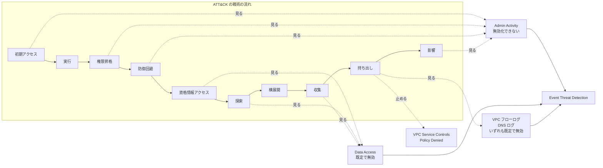
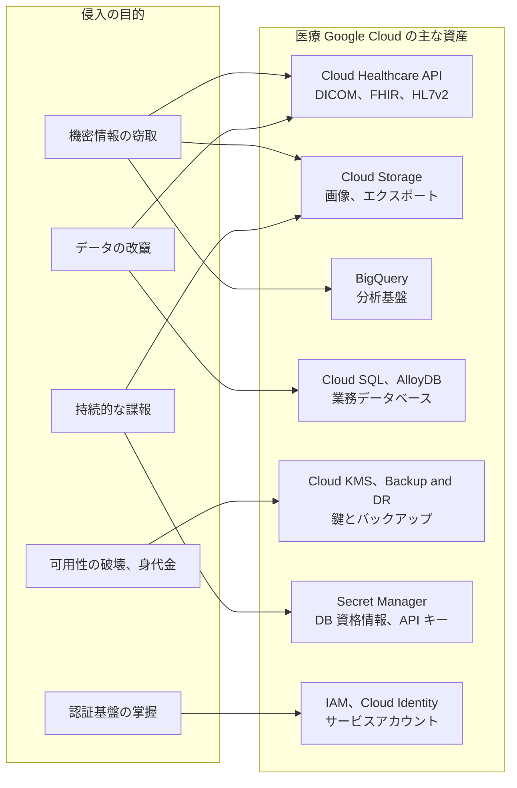
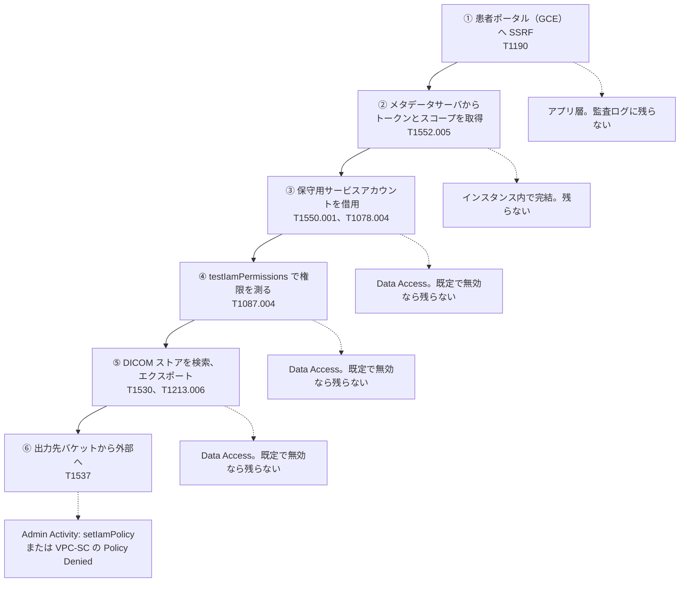
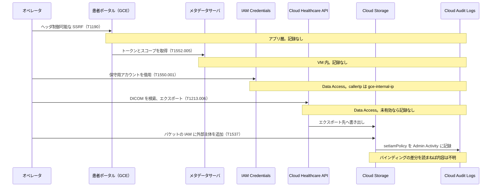
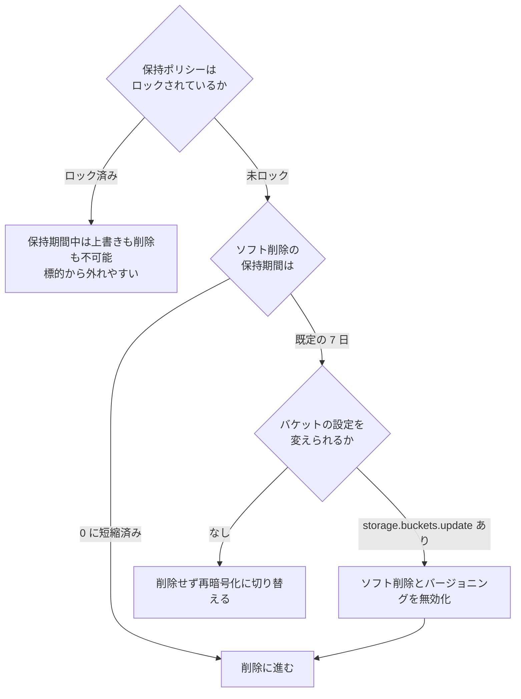
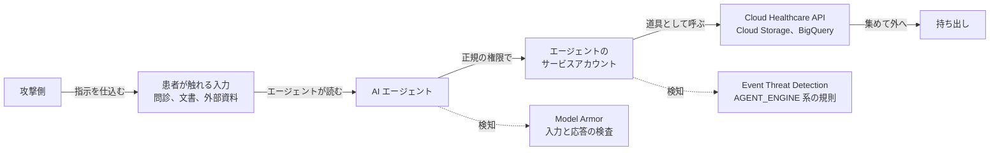

# 🗺️ MITRE ATT&CK for Cloud から見た医療クラウド環境（Google Cloud 編）

医療機関や製薬企業が電子カルテ、画像、検査データを Google Cloud に置くと、攻撃の起点は院内の端末から、プロジェクトの API と IAM に移る。
そこで起きる操作の多くは、盗まれた資格情報による正当な API 呼び出しであり、マルウェアの実行として現れない。
このため、防御側が持つ手がかりは Cloud Audit Logs の記録と、Security Command Center の検出結果に集中する。

本ページは、Google Cloud 上の医療システムに対する攻撃を、MITRE ATT&CK の Cloud（IaaS）の戦術の流れに沿って並べる。
各戦術で、医療の Google Cloud 環境ではどう現れるか、そしてどの条件で記録と検知から外れるかを、対になる観測点とともに示す。

Google Cloud の記録の設計は AWS と大きく違う。
AWS では、ロールの引き受けも秘密の取得も CloudTrail の管理イベントとして既定で残る。
Google Cloud では、権限の借用も秘密の取得も Data Access 監査ログに入り、これは既定で無効である。
このため、既定の設定のままの環境では、記録の空白が資格情報アクセスから収集までの連なり全体に及ぶ。

本ページは、手練れのオペレータが現実にこの環境へ侵入する視点で書く。
その空白がどこに開いているか、記録が避けられない段でオペレータがフィールドの中身をどう平常に寄せるか、そして防御側がどこから閉じるかを、戦術ごとに対にして示す。
ステルスの成否は、攻撃側の技量より、防御側が Data Access 監査ログと VPC Service Controls をどこまで敷いているかで決まる。
医療機関が患者データを扱う AI モデルとエージェントを Vertex AI に載せ始めたことで、攻撃面はさらに広がっている。
この新しい面は第 17 節にまとめる。

> [!NOTE]
> **表記ルール**：本ページでは、**事実**（一次情報で確認できる内容。出典を併記する）、**報道ベース**（報道や第三者の集計のみで確認でき、当事者の公表資料では裏付けが取れていない内容）、**分析**（筆者の解釈）を書き分ける。
>
> **ATT&CK のバージョン**：技術 ID は、本リポジトリの[クラウド事業者と医療](README.md#attck-との対応)および[脅威アクターと TTPs](../../threats/actors/) と揃え、従来の 14 戦術の区分で表記する。
> ATT&CK v18 で一部の技術は再編された。該当箇所には現行の ID を併記する。
>
> **AWS 編との関係**：戦術の並びと表の形は [AWS 編](mitre-attack-aws.md)と揃えてある。
> 両者を横に並べて読むと、同じ技術が事業者ごとにどこで記録され、どこで欠けるかの差が見える。

> [!WARNING]
> 本ページは、自組織の Google Cloud 環境の検知設計と、許可されたレッドチーム演習の設計に使うことを想定している。
> 権限のない環境に対する検証と、防御機能の無効化は行わない。
> 立場ごとにどこで法の線に触れるかは[検証と調査の法的境界](../../practice/legal-boundary.md)に、演習の枠組みは[レッドチームと TLPT を医療機関に当てはめる](../../practice/pentest/red-team-tlpt.md)にまとめている。
>
> 本ページに、そのまま実行できる攻撃コードは載せない。
> 載せるのは、**どの操作がどの監査ログに記録され、どの条件でその記録が欠けるか**である。
> 攻撃シナリオは公表資料から組み立てた想定であり、実在する特定の医療機関や事業者を指すものではない。

---

## 0. 前提：Google Cloud の検知が見ている範囲

回避の可否は、攻撃の巧拙より先に、各サービスが何を入力にしているかで決まる。
まず Google Cloud のセキュリティ機能を区分ごとに並べ、次に検知の入力になる監査ログの範囲を確定させる。

### 0.1 Google Cloud のセキュリティサービスと機能

Google Cloud のセキュリティ機能のうち、本ページの主題である記録と検知に関わるものを役割ごとに並べる。
右端は、レッドチーム演習でその段の記録や検知の起点になるかどうかの目安である。

| 区分 | サービス、機能 | 役割 | 演習で見る段 |
|---|---|---|---|
| 記録 | Cloud Audit Logs（Admin Activity） | 構成を変える API 呼び出しの記録。無効化できない | 全戦術の起点 |
| 記録 | Cloud Audit Logs（Data Access） | データの読み書きと、構成の読み取りの記録。既定で無効 | 資格情報アクセス、探索、収集 |
| 記録 | Cloud Audit Logs（System Event） | Google 側の自動処理による構成変更の記録。無効化できない | 権限昇格、影響 |
| 記録 | Cloud Audit Logs（Policy Denied） | ポリシーによる拒否の記録。無効化できないが除外はできる | 横展開、持ち出し |
| 記録 | VPC フローログ | サブネット単位の通信の記録。既定で無効 | 横展開、持ち出し |
| 記録 | Cloud DNS ログ | VPC 内からの名前解決の記録。既定で無効 | 持ち出し、C2 |
| 記録 | Cloud Logging（ログバケット、シンク） | 記録の保存と転送 | 防御回避 |
| 記録 | Access Transparency | Google の担当者による顧客データへのアクセスの記録 | 事業者側の事象 |
| 脅威検知 | Security Command Center：Event Threat Detection | Cloud Logging を入力にした脅威検知 | 全戦術 |
| 脅威検知 | Security Command Center：Container Threat Detection | GKE ノード上の実行時の検知 | 実行、権限昇格 |
| 脅威検知 | Security Command Center：Virtual Machine Threat Detection | ハイパーバイザからのメモリとディスクの走査 | 実行、影響 |
| 脅威検知 | Security Command Center：Sensitive Actions Service | 影響の大きい操作の観測 | 権限昇格、影響 |
| 姿勢評価 | Security Health Analytics | 構成の逸脱の継続評価 | 全戦術の前提 |
| 姿勢評価 | Policy Analyzer、Recommender | 過剰な権限と未使用の権限の洗い出し | 権限昇格 |
| データ保護 | Sensitive Data Protection | Cloud Storage、BigQuery 上の機微データの発見と分類 | 探索、収集 |
| 境界 | VPC Service Controls | API 単位のデータ境界と、境界越えの拒否 | 持ち出し |
| 予防 | 組織のポリシー（Org Policy） | 組織、フォルダ、プロジェクトに構成の上限を敷く | 権限昇格、防御回避 |
| 予防 | IAM 拒否ポリシー | 許可より先に評価される拒否 | 権限昇格 |
| ID とアクセス | Cloud Identity、Google Workspace | 人の ID と二段階認証 | 初期アクセス |
| ID とアクセス | IAM、サービスアカウント | 主体と権限の付与 | 全戦術 |
| ID とアクセス | Workload Identity 連携 | 外部 ID からのトークン交換 | 初期アクセス、横展開 |
| ID とアクセス | Privileged Access Manager | 一時的な権限付与 | 権限昇格 |
| データと鍵 | Cloud KMS、Cloud HSM、Cloud EKM | 鍵の生成、管理、破棄 | 資格情報アクセス、影響 |
| データと鍵 | Secret Manager | 秘密の保管と版の管理 | 資格情報アクセス |
| 医療データ | Cloud Healthcare API | DICOM、FHIR、HL7v2 のストアと、その IAM | 収集、持ち出し |

**事実**：Event Threat Detection、Container Threat Detection、Virtual Machine Threat Detection は Security Command Center の Premium 以上の階層に含まれ、Standard には含まれない（[Google Cloud ドキュメント](https://docs.cloud.google.com/security-command-center/docs/service-tiers)）。
Enterprise 階層は 2027 年 5 月 21 日に終了し、Premium へ移行する。

**分析**：予防（VPC Service Controls、組織のポリシー、IAM 拒否ポリシー）と、記録（Cloud Audit Logs、VPC フローログ）と、検知（Event Threat Detection ほか）は別の層である。
回避で問題になるのは記録と検知の層であり、この二層は Standard 階層では検知の側がほぼ空になる。
Event Threat Detection は独立したサービスに見えるが、入力はすべて Cloud Logging である。
このため、次の 0.2 で記録の層の範囲を先に確定させる。

### 0.2 監査ログの四区分と、既定で欠ける範囲

**事実**：Cloud Audit Logs は四つの区分に分かれる（[Google Cloud ドキュメント](https://docs.cloud.google.com/logging/docs/audit)）。

- **Admin Activity**：リソースの構成やメタデータを変える API 呼び出しを記録する。「always written; you can't configure, exclude, or disable them」と明記されており、無効化できない。
- **Data Access**：データの読み書きと、構成の読み取りを記録する。「Data Access audit logs are disabled by default for all services but some BigQuery services」であり、既定で無効である（[Google Cloud ドキュメント](https://docs.cloud.google.com/logging/docs/audit/configure-data-access)）。
- **System Event**：Google Cloud のシステムが行った構成変更を記録する。無効化できない。
- **Policy Denied**：セキュリティポリシーによる拒否を記録する。無効化はできないが、除外フィルタで保存を止められる。

**事実**：Data Access 監査ログの有効化は、組織、フォルダ、プロジェクトの IAM ポリシーの `auditConfigs` で設定する。
上位で有効にした記録を下位で無効にはできず、下位は追加しかできない（[Google Cloud ドキュメント](https://docs.cloud.google.com/logging/docs/audit/configure-data-access)）。
特定の主体を記録の対象から外す除外指定（exempted principals）も、この設定の中にある。

**事実**：`_Required` ログバケットは監査ログを 400 日保持し、この保持期間は変更できない。
`_Default` バケットは 30 日で、プロジェクト単位でのみ変更できる（[Google Cloud ドキュメント](https://docs.cloud.google.com/logging/quotas)）。
`_Required` のシンクは変更も削除もできない（[Google Cloud ドキュメント](https://docs.cloud.google.com/logging/docs/routing/overview)）。

ここまでを、医療で問題になる操作に当てはめると、既定の記録の範囲は次のようになる。

| 操作 | 区分 | 既定で記録されるか | 出典 |
|---|---|---|---|
| IAM ポリシーの変更（`SetIamPolicy`） | Admin Activity | される | [IAM 監査ログ](https://docs.cloud.google.com/iam/docs/audit-logging) |
| サービスアカウントキーの作成 | Admin Activity | される | 同上 |
| 権限の借用（`GenerateAccessToken`） | Data Access | されない | [サービスアカウントの監査ログ](https://docs.cloud.google.com/iam/docs/audit-logging/examples-service-accounts) |
| IAM ポリシーの読み取り（`GetIamPolicy`） | Data Access（ADMIN_READ） | されない | [IAM 監査ログ](https://docs.cloud.google.com/iam/docs/audit-logging) |
| 秘密の値の取得（`AccessSecretVersion`） | Data Access（DATA_READ） | されない | [Secret Manager 監査ログ](https://docs.cloud.google.com/secret-manager/docs/audit-logging) |
| オブジェクトの取得（`storage.objects.get`） | Data Access（DATA_READ） | されない | [Cloud Storage 監査ログ](https://docs.cloud.google.com/storage/docs/audit-logging) |
| オブジェクトの列挙（`storage.objects.list`） | Data Access（ADMIN_READ） | されない | 同上 |
| オブジェクトの作成、削除 | Data Access（DATA_WRITE） | されない | 同上 |
| バケットのメタデータ変更 | Admin Activity | される | 同上 |
| インスタンスの一覧、取得 | Data Access（ADMIN_READ） | されない | [Compute Engine 監査ログ](https://docs.cloud.google.com/compute/docs/audit-logging) |
| インスタンスの作成、メタデータ変更 | Admin Activity（ADMIN_WRITE） | される | 同上 |
| DICOM の取得、検索、エクスポート | Data Access（DATA_READ） | されない | [Cloud Healthcare API 監査ログ](https://docs.cloud.google.com/healthcare-api/docs/how-tos/audit-logging) |
| FHIR の読み取り、検索、エクスポート | Data Access（DATA_READ） | されない | 同上 |
| BigQuery のクエリとテーブル読み出し | Data Access | される（無効にできない） | [Data Access の設定](https://docs.cloud.google.com/logging/docs/audit/configure-data-access) |

**分析**：この表の中央に、医療で最も重い空白がある。
既定の設定のままの Google Cloud プロジェクトでは、Cloud Healthcare API の DICOM ストアから画像を丸ごとエクスポートしても、Cloud Storage のバケットから検査結果を一括で読み出しても、監査ログに一行も残らない。
BigQuery だけが例外で、Data Access 監査ログが既定で記録され、無効にもできない。
医療データを BigQuery に置いた組織は読み出しの記録を持ち、Cloud Healthcare API と Cloud Storage に置いた組織は既定では持たない。
この差は、事故のあとで「誰が何件の患者記録を見たか」を答えられるかどうかを分ける。

### 0.3 AWS との違いが、どこに出るか

**分析**：AWS の CloudTrail は、コントロールプレーンの操作（管理イベント）とデータ面の操作（データイベント）で分かれる。
Google Cloud の Cloud Audit Logs は、書き込み（Admin Activity）と読み取りおよびデータ操作（Data Access）で分かれる。
この線の引き方が違うため、同じ攻撃技術でも、記録の有無が事業者ごとに入れ替わる。

| 攻撃側の操作 | AWS の既定 | Google Cloud の既定 |
|---|---|---|
| 別の主体の権限を得る | `AssumeRole` は管理イベントとして記録される | `GenerateAccessToken` は Data Access であり記録されない |
| 秘密の値を取り出す | `GetSecretValue` は管理イベントとして記録される | `AccessSecretVersion` は Data Access であり記録されない |
| 自分の権限を確かめる | `SimulatePrincipalPolicy` は管理イベントとして記録される | `testIamPermissions` は Data Access であり記録されない |
| オブジェクトを読む | データイベント。未設定なら記録されないが、GuardDuty の S3 Protection が独立して解析する | Data Access であり、有効化しなければ検知の入力自体が存在しない |
| 通信の記録 | GuardDuty が VPC フローログと DNS ログの複製を独自に解析する | Event Threat Detection は、利用者が有効化したログしか読まない |
| 記録そのものを止める | 証跡の停止と削除ができる | Admin Activity は無効化できない |
| 監視の外へ出る | 未有効リージョンへ退避する | プロジェクトを組織から外す、監視対象外のプロジェクトを作る |

AWS 側から見た同じ差は、[AWS 編の 0.3](mitre-attack-aws.md#03-google-cloud-との違いがどこに出るか) に置いた。

**分析**：三つの含意がある。

第一に、Google Cloud では**記録を止める必要がない**。
攻撃側にとって最も価値のある操作の多くは、既定で記録されていない。
AWS で `StopLogging` に相当する行為は、Google Cloud では Data Access 監査ログの無効化になるが、これはプロジェクトの IAM ポリシー変更として Admin Activity に残る。
すでに無効なものを止め直すのは、記録を増やすだけの動作である。

第二に、Google Cloud では**リージョンによる回避が成り立たない**。
Cloud Audit Logs と Security Command Center はリージョンではなく資源階層（組織、フォルダ、プロジェクト）を単位とする。
AWS の未使用リージョンへの退避（[T1535](https://attack.mitre.org/techniques/T1535/)）に対応するのは、プロジェクトを組織から外す操作と、監視の届かないプロジェクトを作る操作であり、これは資源階層の改変（[T1666](https://attack.mitre.org/techniques/T1666/)）にあたる。

第三に、Google Cloud では**予防の層が持ち出しを止めうる**。
VPC Service Controls は、正規の資格情報を持つ呼び出しであっても、境界の外への API アクセスを拒否する（[Google Cloud ドキュメント](https://docs.cloud.google.com/vpc-service-controls/docs/overview)）。
記録が欠けていても、持ち出しの段でこの層に当たる。
AWS にもポリシーによる同種の制限はあるが、Google Cloud では医療データを扱うサービスを囲む境界として設計されることが多く、既定の記録の空白を補う位置に置ける。
この対応を取らないまま AWS 向けの検知設計を持ち込むと、記録の空白と境界の不在が同時に残る。

以降の節では、この対応を戦術ごとに具体化する。

---

## 1. 演習で狙う到達目標と、秘匿の原則

医療のレッドチーム演習は、権限を取ること自体を目的にしない。
何を取りに行くか（到達目標）を先に決め、そこへ気付かれずに届く経路を測る。
この節は、目的の例と、到達をどう判定するか、そして Google Cloud で秘匿を成立させる原則を置く。

### 1.1 侵入の目的（レッドチーム視点の例）

医療の環境では、目的によって狙うデータと、成立したときの被害の質が変わる。

| 目的 | 医療での具体 | 主に使う戦術（本ページの節） | 患者と診療への帰結 |
|---|---|---|---|
| 機密情報の窃取 | 診療記録、DICOM 画像、検査結果、ゲノム、治験データの一括取得 | 探索（8）、収集（10）、持ち出し（11） | 大規模な個人情報の漏えい |
| データの改竄 | 検査値、処方、投薬記録、画像の改変 | 権限昇格（5）、収集（10） | 誤診、誤投薬。患者安全に直結する |
| 可用性の破壊、身代金 | バックアップと鍵の削除、オブジェクトの再暗号化 | 防御回避（6）、影響（12） | 診療の停止、復旧不能 |
| 持続的な諜報 | 気付かれない足場からの継続的な情報収集 | 永続化（4）、資格情報アクセス（7） | 長期の情報流出、供給網への波及 |
| 認証基盤の掌握 | IAM と Cloud Identity を握り、任意の利用者になりすます | 権限昇格（5）、横展開（9） | 検知と調査の前提が崩れる |

**分析**：この五つのうち、機密情報の窃取と持続的な諜報は、気付かれないこと自体が価値に直結する。
改竄と可用性の破壊は、実行の瞬間に気付かれても目的は達せられるため、秘匿より速度を選ぶ場合がある。
演習の設計では、どの目的を模擬するかで、秘匿と速度のどちらを主に測るかが決まる。

目的は、医療の Google Cloud 環境のどの資産に向かうかで具体化する。

### 1.2 到達の判定と、本番での安全な代替

稼働中の医療環境では、目的の完遂そのものは実行しない。
到達したことを、破壊や持ち出しの一歩手前で判定する。

- **機密情報の窃取**：データを外へ出さず、対象のオブジェクトや FHIR リソースに到達して読める状態を、無害な標識ファイルの取得や件数の確認で示す。
- **データの改竄**：本番のリソースを書き換えず、書き込み権限が及ぶことを、演習用に用意したストアやバケットへの書き込みで示す。
- **可用性の破壊**：削除や再暗号化を実行せず、対象のバックアップと鍵への削除権限が及ぶことを、`testIamPermissions` による権限の評価で示す。

この線引きは、[診断とペネトレーションテスト](../../practice/pentest/README.md#6-実施設計止められない環境でどう安全に測るか)の実施設計と、[レッドチームと TLPT](../../practice/pentest/red-team-tlpt.md)の中止条件に沿わせる。

### 1.3 Google Cloud で秘匿を成立させる原則

第 0 節で確定した記録の範囲を、攻撃側の作業手順に翻訳すると次の原則になる。
いずれも新しい脆弱性ではなく、記録の区分と検知規則の性質を突くものである。
以下で挙げる検出規則の名称は、Event Threat Detection の規則一覧による（[Google Cloud ドキュメント](https://docs.cloud.google.com/security-command-center/docs/concepts-event-threat-detection-overview)）。

- **既定の空白の内側に留まる**：権限の借用、秘密の取得、権限の確認、オブジェクトと医療データの読み出しは、いずれも Data Access 監査ログである。有効化されていない環境では、この四つを連ねても記録が生じない。攻撃側は記録を消すのではなく、記録のない範囲に作業を収める。
- **鍵を作らず、借りる**：サービスアカウントキーの作成は Admin Activity に残り、Event Threat Detection の `Persistence: Service Account Key Created` を発火させる。権限の借用（`GenerateAccessToken`）は Data Access にしか残らない。恒久的な鍵を作った時点で、静かだった作戦が記録の側へ移る。
- **拒否を出さずに権限を測る**：API を順に試して権限を探ると `PERMISSION_DENIED` が積み上がり、`Initial Access: Excessive Permission Denied Actions` に触れる。`testIamPermissions` は、持っている権限だけを返し、拒否のイベントを作らない。
- **休眠した主体を選ばない**：Event Threat Detection は 180 日以上使われていないサービスアカウントの利用を `Initial Access: Dormant Service Account Action` として、その鍵の作成を `Dormant Service Account Key Created` として検出する。放置された権限の広いアカウントは、AWS の未使用ロールと違い、Google Cloud では検知を呼ぶ側にある。日常的に動いている保守用の主体のほうが静かである。
- **公開の場に出た鍵を使わない**：Google は公開の場に投稿されたサービスアカウントキーによる認証を `Initial Access: Leaked Service Account Key Used` として検出する。公開リポジトリで拾った鍵は、使った時点で名指しされる可能性が高い。
- **プロジェクトの境を越えない**：`Privilege Escalation: Suspicious Token Generation`（プロジェクト横断のアクセストークンと OpenID トークン）、`Discovery: Unauthorized Service Account API Call` は、いずれもプロジェクトをまたぐ呼び出しを名指しで見る。一つのプロジェクトに閉じるほど検出規則に当たらない。
- **組織とフォルダの階層に触れない**：組織とフォルダの階層での Service Account Token Creator の付与には、`Defense Evasion: Organization level TokenCreatorRole Added` と `Folder level` の専用規則がある。対象のサービスアカウント単体のリソース単位の IAM ポリシーに加えるほうが、規則の網に掛かりにくい。
- **発行元を記録から消す**：侵害した VM の内側から API を呼ぶと、監査ログの `callerIp` が消える（次の 1.4 節で詳述する）。`Persistence: New Geography` は発行元の地理を基準にするため、地理そのものが記録に載らなければ差の取りようがない。
- **道具の指紋を残さない**：`Discovery: Information Gathering Tool Used` は ScoutSuite を、`Resource Development: Offensive Security Distro Activity` は攻撃用ディストリビューションからの操作を検出する。素の `gcloud` と REST 呼び出しには、この二つは反応しない。user-agent は攻撃側が任意に設定できるため（1.4 節）、`New User Agent` も普段の値に寄せれば避けられる。
- **一度取ったトークンで押し切る**：借用したアクセストークンは既定で最長 1 時間有効で、その間はローカルにキャッシュされ、再取得の呼び出しを生まない。1 時間の作業を一度の借用に収めれば、`GenerateAccessToken` の記録も一件で済む（1.4 節）。
- **記録を止めない**：Data Access 監査ログの無効化、ログシンクの削除、DNS ログポリシーの削除、VPC フローログの無効化は、いずれも Admin Activity に残る。既に空白であるものを、わざわざ操作して記録を作らない。

**分析**：これらは防御側から見れば、そのまま埋めるべき穴の一覧になる。
Data Access 監査ログを医療データを扱うサービスで有効にし、Security Command Center を組織レベルで Premium 以上にし、VPC Service Controls で境界を敷くと、上の原則の大半は記録か検出結果を生む側に変わる。
秘匿の成否は、攻撃側の技量より、防御側がこの十一項目をどれだけ潰しているかで決まる。

### 1.4 記録が残っても、何が残るかは攻撃側が選ぶ

前節までは、記録そのものを避ける原則だった。
Admin Activity のように避けられない記録が生じる段でも、その一件に**何が書かれるか**は攻撃側の動き方で変わる。
異常検知は記録のフィールドを入力にするため、フィールドを平常に寄せられれば、記録が残っても検出結果は生じない。
監査ログのフィールドは、次のように攻撃側が制御できるものと、できないものに分かれる（[AuditLog の仕様](https://docs.cloud.google.com/logging/docs/audit/api/ref/rest/Shared.Types/AuditLog)）。

| フィールド | 内容 | 攻撃側が制御できるか |
|---|---|---|
| `authenticationInfo.principalEmail` | 呼び出した主体 | できない。借用した主体そのものが載る |
| `requestMetadata.callerIp` | 発行元の IP | 実質的に消せる。下記参照 |
| `requestMetadata.callerSuppliedUserAgent` | user-agent | 完全に制御できる。認証されない値である |
| `serviceAccountDelegationInfo` | 借用の連鎖 | できない。連鎖が長いほど痕跡が濃くなる |
| `methodName`、`resourceName` | 操作と対象 | できない |

**事実**：`callerIp` は、Google の内部を通る呼び出しでは `private` に、外部 IP を持たない同一組織の Compute Engine VM からの呼び出しでは `gce-internal-ip`（または VM の内部 IPv4）に置き換わる（[AuditLog の仕様](https://docs.cloud.google.com/logging/docs/audit/api/ref/rest/Shared.Types/AuditLog)）。
**事実**：`callerSuppliedUserAgent` は「This information is not authenticated and should be treated accordingly」と明記されており、呼び出し側が任意の文字列を入れられる（同上）。

**分析**：この二つのフィールドが、記録が避けられない段でのステルスを左右する。
攻撃側が侵害した VM の内側から API を呼ぶと、監査ログの発行元は `gce-internal-ip` か `private` になり、地理も外部 IP も記録に残らない。
`Persistence: New Geography` は発行元 IP の地理の差を見る規則だが、比べる地理そのものが記録にないため、判定が成立しない。
自分の端末や外部の VPS から直接呼ぶと外部 IP が載り、地理の差が出る。
このため、資格情報を得たあとの操作は、必ず侵害した資源の内側から発行する。
user-agent も、その主体が普段使う `gcloud` のバージョン文字列に合わせれば、`Persistence: New User Agent` の基準に触れない。

**分析**：制御できないフィールドが二つある。
一つは `principalEmail` で、借用した主体そのものが載る。
だからこそ、稼働中の保守用アカウントを借りる原則（1.3 節）が効く。
日常的にそのアカウントが動いている環境では、`principalEmail` が平常の側にある。
もう一つは `serviceAccountDelegationInfo` で、借用を連ねるほど連鎖の記録が濃くなる。
委任の多段は `Anomalous Multistep Service Account Delegation` の入力になるため、連鎖は短く保ち、可能なら一段で目的の権限に届く経路を選ぶ。

**分析**：`New Geography`、`New User Agent`、`New API Method` は、いずれも主体ごとの過去の振る舞いを平常として、そこからの差を見る（[Event Threat Detection の規則一覧](https://docs.cloud.google.com/security-command-center/docs/concepts-event-threat-detection-overview)）。
ここから二つの含意が出る。
第一に、新しく作られたプロジェクトや、最近権限を付けたサービスアカウントには蓄積された平常がなく、異常検知が働く土台がない。
第二に、平常の幅が広い主体（多様な地理、多様な user-agent、多様な API を日常的に使う保守の自動化）を借りると、攻撃側の操作がその幅に収まりやすい。
攻撃側にとって最も価値のある踏み台は、権限が広く、かつ振る舞いの幅が広く、かつ稼働中の主体である。

### 1.5 騒がしい操作と、静かな代替

上の原則を、目的ごとの選択として表にする。
演習の設計では、左の列を選べば検知を測れ、右の列を選べば記録の空白を測れる。

| 目的 | 騒がしい操作 | 発火する検出 | 静かな代替 | 代替が残す記録 |
|---|---|---|---|---|
| 権限の獲得 | サービスアカウントキーの作成 | `Persistence: Service Account Key Created` | 権限の借用（`GenerateAccessToken`） | Data Access（既定で無効） |
| 権限の把握 | API を順に試す | `Initial Access: Excessive Permission Denied Actions` | `testIamPermissions` で束ねて問う | Data Access（既定で無効） |
| 主体の選択 | 休眠したサービスアカウントの利用 | `Initial Access: Dormant Service Account Action` | 稼働中の保守用アカウントの借用 | Data Access（既定で無効） |
| 昇格 | 組織階層での TokenCreator の付与 | `Defense Evasion: Organization level TokenCreatorRole Added` | 対象アカウント単体の IAM ポリシーへの追加 | Admin Activity に一件 |
| 昇格 | 新しいサービスアカウントを Owner で作成 | `Privilege Escalation: New Service Account is Owner or Editor` | 既存の権限の広いアカウントを借りる | Data Access（既定で無効） |
| 探索 | ScoutSuite などの一括監査 | `Discovery: Information Gathering Tool Used` | 素の `gcloud` と REST | 呼び出しに応じた区分 |
| 探索 | 攻撃用ディストリビューションからの操作 | `Resource Development: Offensive Security Distro Activity` | 侵害した VM から呼ぶ | 同上 |
| 探索 | 自分の IAM ポリシーの読み取り | `Discovery: Service Account Self-Investigation` | `testIamPermissions` | Data Access（既定で無効） |
| 収集 | プロジェクトをまたぐトークン生成 | `Privilege Escalation: Suspicious Token Generation` | 対象データと同じプロジェクトに閉じる | Data Access（既定で無効） |
| 持ち出し | BigQuery の結果を Google ドライブへ保存 | `Exfiltration: BigQuery Data to Google Drive` | 同一組織内の別バケットへ集めてから出す | Data Access（既定で無効） |
| 持ち出し | バケットの IAM に外部の主体を加える | `SetIamPolicy` が Admin Activity に残る | 手元の鍵で署名付き URL を生成する | 生成は API 呼び出しを伴わない |
| 記録の除去 | Data Access 監査ログの無効化 | `SetIamPolicy` が Admin Activity に残る | 既定で無効な範囲に留まる | 記録なし |
| 記録の除去 | ログシンクの削除、保持期間の短縮 | Admin Activity に残る | 同上 | 記録なし |

**分析**：右の列に共通するのは、**新しい構成を作らない**ことである。
Google Cloud で Admin Activity に残るのは、ほぼすべて「作る、変える、消す」の操作である。
すでにあるものを借りて読むだけの作戦は、既定の設定では痕跡を残さない。
防御側の手当が Data Access 監査ログの有効化から始まるのは、この構造による。

### 1.6 機密情報の窃取を例にしたステルス経路

上の原則を、機密情報の窃取という目的で一本につなぐと次の経路になる。
上から下が攻撃の各段、右へ伸びる点線がその段で記録に残るかどうかである。

**分析**：AWS 編の同じ図では、③④⑥が管理イベントとして残り、①②⑤が空白だった。
Google Cloud では、既定の設定のままなら**①から⑤までが連続した空白になる**。
記録が現れるのは、外へ出す構成を作る⑥だけである。
逆に言えば、防御側が Data Access 監査ログを有効にすると③④⑤が一度に記録の側へ移り、VPC Service Controls を敷くと⑥が拒否されて Policy Denied に残る。
この二つの設定が、Google Cloud における記録と防御の分水嶺である。
以降の節では、各段を戦術ごとに具体化する。

---

## 2. 初期アクセス

医療の Google Cloud 環境で最初の一歩になるのは、外向きのアプリケーションと、外部との信頼関係、そして持ち出された資格情報である。

**現れ方**：

- 患者ポータル、画像ビューア、予約や問診の Web アプリに認可の不備や既知の脆弱性があると、公開資産を起点に内側へ入られる（Exploit Public-Facing Application、[T1190](https://attack.mitre.org/techniques/T1190/)）。
  - 具体例：ファイルアップロード機能から Compute Engine 上に Web シェルを置く、画像ビューアの SSRF を資格情報アクセス（7）につなぐ、Cloud Run で公開した API の認可を越える。
  - **事実**：Google の Cloud Threat Horizons Report（H1 2026 版、2025 年後半の観測）は、クラウド侵害の初期侵入経路のうち、第三者ソフトウェアの脆弱性の悪用が 44.5%、脆弱または未設定の資格情報が 27.2% を占めたとしている。資格情報は 2025 年前半の 47.1% から下がり、脆弱性の悪用は同時期の 3% 未満から上がった（[Google Cloud Blog](https://cloud.google.com/blog/products/identity-security/cloud-ciso-perspectives-new-threat-horizons-report-highlights-current-cloud-threats)、[報告書](https://cloud.google.com/security/report/resources/cloud-threat-horizons-report-h1-2026)）。
  - **分析**：医療機関の外向き資産は、患者ポータル、遠隔診療、予約、問診のように、更新の止まった第三者製品を抱えやすい。この統計の変化は、資格情報の管理だけでは初期侵入の主経路を塞げなくなったことを示す。[外部から見た自組織の攻撃面](../../practice/attack-surface.md)の棚卸しと、公開資産の更新の追跡を、同じ比重で置く。
- 電子カルテや部門システムのベンダが保守用に持つサービスアカウントや、共有された鍵ファイルを経由する経路は、信頼関係の悪用にあたる（Trusted Relationship、[T1199](https://attack.mitre.org/techniques/T1199/)）。
  - 具体例：ベンダのプロジェクトのサービスアカウントに、医療機関側のプロジェクトで広いロールが付いている。ベンダそのものの侵害が、契約先の複数の医療機関へ連鎖する。
- サービスアカウントの JSON キーが漏れると、正規のクラウド主体として入られる（Valid Accounts: Cloud Accounts、[T1078.004](https://attack.mitre.org/techniques/T1078/004/)）。
  - 具体例：公開 GitHub、コンテナイメージの層、Terraform の state ファイル、CI/CD のログに残る `"type": "service_account"` を含む JSON。
- Workload Identity 連携の設定不備は、外部の ID から直接プロジェクトへ入る経路になる（Valid Accounts: Cloud Accounts、[T1078.004](https://attack.mitre.org/techniques/T1078/004/)）。
  - 具体例：OIDC プロバイダに属性条件（attribute condition）を設定していないと、その発行者が出したトークンであれば主体を問わず `sts.googleapis.com` でサービスアカウントのトークンに交換できる。AWS プロバイダで条件を絞っていないと、その AWS アカウントの任意のロール（読み取り専用や第三者用を含む）から交換できる。プールに複数の外部 ID を登録し、サービスアカウントを全体に紐づけていると、どれか一つの侵害が全体に波及する（[Tenable](https://www.tenable.com/blog/how-attackers-can-exploit-gcps-multicloud-workload-solution)）。
- フィッシングで Google アカウントの資格情報とセッションを奪う手口は、二段階認証を回避する形をとることがある（Phishing、[T1566](https://attack.mitre.org/techniques/T1566/)、Multi-Factor Authentication Request Generation、[T1621](https://attack.mitre.org/techniques/T1621/)）。
  - 具体例：中間者型（AiTM）の逆プロキシでセッションクッキーを奪う、承認要求を繰り返す。
  - **分析**：AWS の SSO で成立するデバイス認可フローのフィッシングは、Google では同じようには通らない。攻撃側は自前の OAuth アプリを Google 側に登録する必要があり、デバイス認可フローで取れるスコープも Google が制限している（[Huntress](https://www.huntress.com/blog/oh-auth-2-0-device-code-phishing-in-google-cloud-and-azure)）。医療機関の演習では、Google Cloud に対するデバイス認可フィッシングを「効きにくい経路」として扱い、AiTM とセッション窃取に重心を置くほうが実態に合う。
- ソフトウェアサプライチェーンを侵害し、ビルドや CI/CD からクラウドへ入る（Supply Chain Compromise、[T1195](https://attack.mitre.org/techniques/T1195/)）。
  - 具体例：悪性の依存パッケージでビルド時にトークンを抜く。GitHub Actions から Workload Identity 連携で入るとき、属性条件でリポジトリとブランチを絞っていないと、別のリポジトリのワークフローから同じサービスアカウントを引ける。
- Google Workspace のドメイン全体の委任（domain-wide delegation）の設定を握られると、テナント内の任意の利用者になりすます経路が開く（Valid Accounts、[T1078](https://attack.mitre.org/techniques/T1078/)）。
  - **報道ベース**：2023 年 11 月、Hunters は、委任の設定がサービスアカウントの OAuth ID に紐づき、個々の秘密鍵に紐づかない設計から、特権管理者でなくても既存の委任を使い回せると報告し、DeleFriend と名付けた（[Hunters](https://www.hunters.security/en/blog/delefriend-a-newly-discovered-design-flaw-in-domain-wide-delegation-could-leave-google-workspace-vulnerable-for-takeover)）。医療機関が Google Workspace を院内のメールと共有ドライブに使っている場合、Google Cloud 側のプロジェクトの侵害が Workspace 側の患者関連文書に届く経路になりうる。

**検知から外れる条件**：アプリケーション層での侵入は、Google Cloud の API を呼ばない限り監査ログには現れない。
Web サーバのアクセスログとアプリケーションログを Cloud Logging へ送っていないと、この段は Google Cloud 側の記録に残らない。
盗んだ資格情報での最初の利用も、発行元が普段と同じ地域で、user-agent が普段と同じであれば、`Persistence: New Geography` と `New User Agent` の基準に触れにくい。
Workload Identity 連携によるトークン交換は、正規の連携と同じ形で成立する。

**残る観測点（検知、緩和）**：サービスアカウントキーによる認証は Admin Activity に残り、`serviceAccountKeyName` の欄でどの鍵が使われたかが分かる（[Google Cloud ドキュメント](https://docs.cloud.google.com/iam/docs/audit-logging/examples-service-accounts)）。
Event Threat Detection は、公開の場に出た鍵の利用を `Initial Access: Leaked Service Account Key Used` として、休眠アカウントの利用を `Initial Access: Dormant Service Account Action` として、拒否の連続を `Initial Access: Excessive Permission Denied Actions` として検出する（[Google Cloud ドキュメント](https://docs.cloud.google.com/security-command-center/docs/concepts-event-threat-detection-overview)）。
Workload Identity 連携については、プロバイダの作成と更新（`workloadIdentityPoolProviders.create`、`update`）を Admin Activity で監視する。
緩和は、サービスアカウントキーの作成を組織のポリシー（`constraints/iam.managed.disableServiceAccountKeyCreation`）で禁じ、Workload Identity 連携と権限の借用に寄せること、連携のプロバイダに属性条件を必ず設定すること、外向きアプリの前段に[攻撃面の把握](../../practice/attack-surface.md)を継続することにある。

---

## 3. 実行

クラウドでの実行は、端末上のプロセスではなく、API とマネージドサービスの上で起きる。

**現れ方**：

- 盗んだ資格情報から `gcloud` や各言語のクライアントライブラリで API を呼ぶ操作は、クラウド API を介した実行にあたる（Command and Scripting Interpreter: Cloud API、[T1059.009](https://attack.mitre.org/techniques/T1059/009/)）。
  - 具体例：Cloud Shell を対話的な足場に使う。Cloud Shell は Google の IP 空間から出るため、発行元による判別が効きにくい。
- インスタンスのメタデータに起動スクリプトを書き込む操作は、クラウド管理コマンドにあたる（Cloud Administration Command、[T1651](https://attack.mitre.org/techniques/T1651/)）。
  - 具体例：`compute.instances.setMetadata` で `startup-script` を書き換え、再起動時に実行させる。OS Login を有効にしていない環境では、`ssh-keys` のメタデータに公開鍵を足すだけでログインできる。
  - **事実**：Event Threat Detection は、稼働中のインスタンスへの SSH 鍵の追加を `Persistence: GCE Admin Added SSH Key`、起動スクリプトの追加を `Persistence: GCE Admin Added Startup Script` として検出する。プロジェクト全体への追加は `Persistence: Global Startup Script Added` と `Privilege Escalation: Global Shutdown Script Added` である（[Event Threat Detection の規則一覧](https://docs.cloud.google.com/security-command-center/docs/concepts-event-threat-detection-overview)）。
- 侵害した権限で Cloud Functions や Cloud Run を作成、更新して任意の処理を動かす経路は、サーバレス実行にあたる（Serverless Execution、[T1648](https://attack.mitre.org/techniques/T1648/)）。
  - 具体例：`cloudfunctions.functions.update` で既存の関数のコードを差し替える、`run.services.create` でサービスアカウントを付けたサービスを立てる。Cloud Scheduler の定期実行に載せる形もある。
- 汚染したイメージを実行させる経路は、利用者実行にあたる（User Execution: Malicious Image、[T1204.003](https://attack.mitre.org/techniques/T1204/003/)）。
  - 具体例：Artifact Registry のイメージを差し替える。**報道ベース**：Orca は 2023 年、`cloudbuild.builds.create` の権限から Cloud Build のサービスアカウントになりすまし、Artifact Registry のイメージを取り出して細工したうえで押し戻す経路を Bad.Build として報告した（[Orca Security](https://orca.security/resources/blog/bad-build-google-cloud-build-potential-supply-chain-attack-vulnerability/)）。Google は 2023 年 6 月に権限の範囲を絞る修正を入れた。
- GKE でコンテナを立てて実行する経路は、コンテナの配置とコンテナ管理コマンドにあたる（Deploy Container、[T1610](https://attack.mitre.org/techniques/T1610/)、Container Administration Command、[T1609](https://attack.mitre.org/techniques/T1609/)）。
  - 具体例：特権コンテナを含む Pod を作る。Event Threat Detection は `Privilege Escalation: Launch of privileged Kubernetes container` として検出する。

**検知から外れる条件**：起動スクリプトの書き込みは Admin Activity に残るが、そのスクリプトが VM の内側で何をしたかは Google Cloud 側には残らない。
Container Threat Detection と Virtual Machine Threat Detection は Premium 以上でのみ動き、Standard 階層では実行時の検知が存在しない。
Virtual Machine Threat Detection のメモリ走査は 30 分間隔で、Confidential VM と Arm 系のインスタンス、顧客管理鍵または顧客提供鍵で暗号化したディスクは対象外である（[Google Cloud ドキュメント](https://docs.cloud.google.com/security-command-center/docs/concepts-vm-threat-detection-overview)）。
Container Threat Detection のファイル監視の検出器は、CI/CD や入出力の多いワークロードへの影響を避けるため既定で無効になっている（[Google Cloud ドキュメント](https://docs.cloud.google.com/security-command-center/docs/concepts-container-threat-detection-overview)）。

**残る観測点（検知、緩和）**：`compute.instances.setMetadata`、`cloudfunctions.functions.update`、`run.services.create`、`cloudbuild.builds.create` はいずれも Admin Activity に残る。
Container Threat Detection は、イメージに含まれない実行ファイルの実行、想定外のライブラリの読み込み、逆シェル、悪性スクリプトの実行を検出する。
緩和は、OS Login を必須にしてメタデータの SSH 鍵経路を塞ぐこと（`constraints/compute.managed.requireOsLogin`）、Cloud Functions と Cloud Run を作成、更新できる主体を絞ること、Binary Authorization で実行するイメージを署名済みのものに限ること、実行基盤の内側は[検知の設計](../detection-engineering.md)で端末側の観測点と対にすることにある。

---

## 4. 永続化

一度得た足場を、初期経路を塞がれても残す段である。
医療環境では、保守の都合で作られた別経路と区別しにくい点が問題になる。

**現れ方**：

- サービスアカウントに新しい鍵を作る操作は、追加のクラウド資格情報にあたる（Account Manipulation: Additional Cloud Credentials、[T1098.001](https://attack.mitre.org/techniques/T1098/001/)）。
  - 具体例：`iam.serviceAccountKeys.create` で JSON キーを発行する。**分析**：これは最も分かりやすい永続化だが、同時に最も騒がしい。Admin Activity に残り、Event Threat Detection の `Persistence: Service Account Key Created` を発火させる。秘匿を優先する作戦では選ばれない。
- 対象のサービスアカウントの IAM ポリシーに、自分の主体を Service Account Token Creator として書き加える操作は、追加のクラウドロールにあたる（Additional Cloud Roles、[T1098.003](https://attack.mitre.org/techniques/T1098/003/)）。
  - 具体例：`iam.serviceAccounts.setIamPolicy` で、そのサービスアカウント一つだけに紐づく裏口を作る（[Datadog Security Labs](https://securitylabs.datadoghq.com/cloud-security-atlas/attacks/backdooring-service-account/)）。
  - **分析**：これが、鍵の作成に代わる静かな永続化である。以後は `gcloud --impersonate-service-account` で必要なときにトークンを取れ、恒久的な鍵を持ち歩かずに済む。初期侵入を塞がれても、この裏口は残る。鍵の作成と違い `Persistence: Service Account Key Created` を発火させず、組織階層への付与に対する専用規則にも当たらない。Admin Activity に `SetIamPolicy` が一件残るが、リソース単位の権限管理の日常操作と形が同じで、そのうえ**バインディングの差分を読まないと、どのロールを誰に与えたかは分からない**。以後の借用そのものは Data Access であり、既定では記録されない。
- Cloud Storage の HMAC 鍵や API キーを作る操作も、追加の資格情報にあたる。
  - 具体例：`storage.hmacKeys.create` は、サービスアカウントに紐づく S3 互換の XML API 用の鍵を作る（[Google Cloud ドキュメント](https://docs.cloud.google.com/storage/docs/authentication/hmackeys)）。IAM の鍵の棚卸しから漏れやすく、OAuth のトークンとは別系統で残る（[Rhino Security Labs](https://rhinosecuritylabs.com/cloud-security/privilege-escalation-google-cloud-platform-part-2/)）。
- 新しいサービスアカウントや、外部の Google アカウントをプロジェクトに招く操作は、クラウドアカウントの作成にあたる（Create Account: Cloud Account、[T1136.003](https://attack.mitre.org/techniques/T1136/003/)）。
  - **事実**：Event Threat Detection は、管理下にないアカウントへの重要なロールの付与を `Persistence: Unmanaged Account Granted Sensitive Role`、外部メンバーの特権グループへの追加を `Privilege Escalation: External Member Added To Privileged Group` として検出する（[Event Threat Detection の規則一覧](https://docs.cloud.google.com/security-command-center/docs/concepts-event-threat-detection-overview)）。
- イメージやテンプレートに細工を仕込む経路は、内部イメージの埋め込みにあたる（Implant Internal Image、[T1525](https://attack.mitre.org/techniques/T1525/)）。
  - 具体例：インスタンステンプレートやマネージドインスタンスグループが参照するイメージを差し替え、再作成のたびに足場が戻る。
- 認証の仕組みを書き換えて足場を残す経路は、認証プロセスの改変にあたる（Modify Authentication Process、[T1556](https://attack.mitre.org/techniques/T1556/)）。
  - 具体例：Cloud Identity の二段階認証の強制を外す、SSO の設定を変える。**事実**：Event Threat Detection はこれらを `Persistence: Strong Authentication Disabled`、`Persistence: Two Step Verification Disabled`、`Persistence: SSO Enablement Toggle`、`Persistence: SSO Settings Changed` として検出する（[Event Threat Detection の規則一覧](https://docs.cloud.google.com/security-command-center/docs/concepts-event-threat-detection-overview)）。
- Workload Identity 連携のプロバイダを書き換え、自分の側の発行者を信頼させる経路も永続化になる。
  - 具体例：`iam.workloadIdentityPoolProviders.update` で自分の AWS アカウント ID や OIDC の発行者を足すと、既に権限の広いサービスアカウントへ継続的に到達できる（[Tenable](https://www.tenable.com/blog/how-attackers-can-exploit-gcps-multicloud-workload-solution)）。

**検知から外れる条件**：これらはいずれも Admin Activity に残る。
記録は残るが、保守の正当な操作に紛れる。
ベンダが日常的にサービスアカウントとロールを追加する運用では、`SetIamPolicy` の一件が異常として浮かびにくい。
HMAC 鍵と API キーは、サービスアカウントキーの棚卸しの対象から外れやすく、`Persistence: Service Account Key Created` にも当たらない。

**残る観測点（検知、緩和）**：`SetIamPolicy`、`CreateServiceAccountKey`、`CreateServiceAccount`、`workloadIdentityPoolProviders.update`、`storage.hmacKeys.create` を監視対象にする。
Sensitive Actions Service は、特権ロールの付与を `Persistence: Add Sensitive Role`、プロジェクト単位の SSH 鍵の追加を `Persistence: Project SSH Key Added` として観測する（[Google Cloud ドキュメント](https://docs.cloud.google.com/security-command-center/docs/concepts-sensitive-actions-overview)）。
緩和は、サービスアカウントキーの作成そのものを組織のポリシーで禁じること、HMAC 鍵と API キーを鍵の棚卸しの対象に含めること（[外に出た認証情報](../credential-exposure.md)、[認証とアクセス管理](../identity.md)）、`iam.serviceAccounts.setIamPolicy` を持つ主体を限ること、二段階認証と SSO の設定変更を単独で通知対象にすることにある。

---

## 5. 権限昇格

医療データへの一括アクセスは、多くの場合この段で得られる。
Google Cloud の権限昇格は、脆弱性ではなく IAM の設定の連鎖で成立する。

**現れ方**：

- サービスアカウントの権限を借りる経路が、Google Cloud の昇格の中心にある（Abuse Elevation Control Mechanism: Temporary Elevated Cloud Access、[T1548.005](https://attack.mitre.org/techniques/T1548/005/)、Use Alternate Authentication Material: Application Access Token、[T1550.001](https://attack.mitre.org/techniques/T1550/001/)）。
  - 具体例：`iam.serviceAccounts.getAccessToken` で対象のトークンを直接得る。`signBlob` と `signJwt` は、署名を作れる立場から間接的にトークンを取りにいく。`implicitDelegation` は、A が B に対して持ち、B が C に対して `getAccessToken` を持つとき、A から C へ委任を連ねる（[Rhino Security Labs](https://rhinosecuritylabs.com/gcp/privilege-escalation-google-cloud-platform-part-1/)）。
  - **事実**：Event Threat Detection は、`signJwt`、`implicitDelegation`、プロジェクト横断の `getAccessToken` と `getOpenIdToken` を、それぞれ `Privilege Escalation: Suspicious Token Generation` の別々の規則として検出する。委任の連鎖の異常は `Anomalous Multistep Service Account Delegation` として扱われる（[Event Threat Detection の規則一覧](https://docs.cloud.google.com/security-command-center/docs/concepts-event-threat-detection-overview)）。
- `iam.serviceAccounts.actAs` と、計算資源を作る権限の組み合わせは、自分より広い権限のサービスアカウントで処理を動かす経路になる。
  - 具体例：`compute.instances.create` に `setServiceAccount` と `setMetadata` を組み合わせ、起動スクリプトからメタデータサーバのトークンを取る。`cloudfunctions.functions.create`、`run.services.create`、`cloudscheduler.jobs.create` も同じ形をとる（[Rhino Security Labs](https://rhinosecuritylabs.com/gcp/privilege-escalation-google-cloud-platform-part-1/)）。
- `deploymentmanager.deployments.create` は、その一つで既定の Cloud Services サービスアカウントとしてリソースを作れる（[Rhino Security Labs](https://rhinosecuritylabs.com/gcp/privilege-escalation-google-cloud-platform-part-1/)）。
- 既存のロールやポリシーを書き換えて自分の権限を広げる操作は、アカウントの操作にあたる（Account Manipulation、[T1098](https://attack.mitre.org/techniques/T1098/)）。
  - 具体例：`iam.roles.update` で自分に付いたカスタムロールに権限を足す。組織、フォルダ、プロジェクト、そして各リソースの `setIamPolicy` は、どれも自分にロールを付ける経路になる。
- 組織のポリシーを緩めて、上限そのものを外す経路もある。
  - 具体例：`orgpolicy.policy.set` で制約を解除してから、禁じられていた操作を行う（[Rhino Security Labs](https://rhinosecuritylabs.com/cloud-security/privilege-escalation-google-cloud-platform-part-2/)）。Sensitive Actions Service は `Defense Evasion: Organization Policy Changed` として観測する。
- Compute Engine の既定のサービスアカウントは、古い組織では Editor ロールを自動で付与されている。
  - **事実**：Google は「Depending on your organization policy configuration, the default service account might automatically be granted the Editor role on your project」と記し、2024 年 5 月 3 日より後に作られた組織では自動付与を止める制約が既定で有効だとしている（[Google Cloud ドキュメント](https://docs.cloud.google.com/compute/docs/access/service-accounts)）。それ以前に作られた医療機関の組織では、VM を一台取ることがプロジェクトの編集権限を取ることに等しい場合がある。
- GKE では、ノードのサービスアカウントとブートストラップの資格情報が昇格の材料になる。
  - 具体例：Workload Identity 連携を有効にしていないと、Pod からノードのメタデータサーバへ届き、`kube-env` に含まれる kubelet の証明書と鍵を読める。そこから証明書署名要求を出してノードとして振る舞い、そのノード上の Pod の Secret へ届く（[Rhino Security Labs](https://rhinosecuritylabs.com/cloud-security/kubelet-tls-bootstrap-privilege-escalation/)）。

**検知から外れる条件**：昇格に使う API のうち、`SetIamPolicy` と `roles.update` は Admin Activity に残る。
一方、権限の借用そのもの（`GenerateAccessToken`、`SignJwt`、`SignBlob`）は Data Access であり、有効化していなければ残らない。
このため、**権限を付ける操作は記録され、権限を使う操作は記録されない**という非対称が生じる。
すでに広い権限を持つサービスアカウントが環境にあり、それを借りられる立場を得た攻撃側は、ポリシーを一切書き換えずに昇格を完了できる。

**残る観測点（検知、緩和）**：`SetIamPolicy`、`CreateRole`、`UpdateRole`、`SetOrgPolicy` を、単独ではなく順序で見る。
`GenerateAccessToken` を見るには、`iamcredentials.googleapis.com` の Data Access 監査ログを有効にする必要がある（[Google Cloud ドキュメント](https://docs.cloud.google.com/iam/docs/audit-logging/examples-service-accounts)、[Stratus Red Team](https://stratus-red-team.cloud/attack-techniques/GCP/gcp.privilege-escalation.impersonate-service-accounts/)）。
緩和は、`iam.serviceAccounts.actAs` を渡せるサービスアカウントで限定すること、IAM 拒否ポリシーで昇格の到達先に上限を置くこと（許可より先に評価される。[Google Cloud ドキュメント](https://docs.cloud.google.com/iam/docs/deny-overview)）、組織のポリシーで既定のサービスアカウントへの Editor 自動付与を止めること、Policy Analyzer と Recommender で過剰な権限と未使用の権限を継続的に洗い出すこと、GKE では Workload Identity 連携を有効にしてノードのメタデータへの経路を塞ぐこと（[Google Cloud ドキュメント](https://docs.cloud.google.com/kubernetes-engine/docs/how-to/protecting-cluster-metadata)）にある。

---

## 6. 防御回避

この戦術は、検知そのものを外しにいく段である。
Google Cloud では、記録を止める余地が AWS より狭い代わりに、監視の範囲から抜ける経路が資源階層の側にある。

**現れ方**：

- Data Access 監査ログを無効にする操作は、クラウドログの無効化にあたる（Impair Defenses: Disable or Modify Cloud Logs、[T1562.008](https://attack.mitre.org/techniques/T1562/008/)。v18 では [T1685.002](https://attack.mitre.org/techniques/T1685/002/)）。
  - 具体例：プロジェクトの IAM ポリシーの `auditConfigs` を書き換える。これは `SetIamPolicy` として Admin Activity に残る。除外指定（exempted principals）で、特定の主体だけを記録の対象から外す形もある。
- ログの転送と保存を止める操作も同じ技術にあたる。
  - 具体例：組織レベルの集約シンクを削除、無効化する。包含フィルタを狭める、除外フィルタを足す。`_Default` バケットの保持期間を短くする。Cloud DNS のログポリシーを削除する。サブネットの VPC フローログを無効にする（[Stratus Red Team](https://stratus-red-team.cloud/attack-techniques/GCP/)）。
  - **事実**：`_Required` バケットのシンクは変更も削除もできず、保持期間 400 日も変更できない（[Google Cloud ドキュメント](https://docs.cloud.google.com/logging/quotas)）。Admin Activity と System Event の記録は、この経路では消せない。
- プロジェクトを組織から外す、または別の組織へ移す操作は、資源階層の改変にあたる（Modify Cloud Resource Hierarchy、[T1666](https://attack.mitre.org/techniques/T1666/)）。
  - 具体例：`resourcemanager.projects.move` でプロジェクトを移すと、組織のポリシー、組織レベルの集約シンク、組織ノードに設定した VPC Service Controls と Security Command Center の適用から外れる（[Stratus Red Team](https://stratus-red-team.cloud/attack-techniques/GCP/gcp.defense-evasion.remove-project-from-organization/)）。
  - **分析**：これが Google Cloud における「監視の外へ出る」経路である。AWS の未有効リージョンへの退避（[T1535](https://attack.mitre.org/techniques/T1535/)）とは違い、リージョンを変えても記録も検知も変わらない。単位はリージョンではなく資源階層である。
- Security Command Center を組織レベルではなくプロジェクトレベルでのみ有効にしている環境では、その外のプロジェクトに検知が及ばない。
  - **事実**：プロジェクトレベルの有効化では「Security Command Center's access to logs, data, and other resources is limited to the project in which it is activated」であり、プロジェクトの外のデータを必要とするサービスは動かないか、検出結果を出しきれない（[Google Cloud ドキュメント](https://docs.cloud.google.com/security-command-center/docs/activate-scc-overview)）。
- 検出結果を隠す操作もこの段に含まれる。
  - 具体例：Security Command Center のミュート規則を作る。**事実**：ミュートは検出結果を既定の表示から隠すだけで、検出自体は続き、結果も記録される（[Google Cloud ドキュメント](https://docs.cloud.google.com/security-command-center/docs/how-to-mute-findings)）。運用が既定の表示しか見ていない場合に限って効く。
- VPC Service Controls の境界を緩める操作は、予防の層を外す。
  - **事実**：Event Threat Detection は既存の境界の保護を弱める変更を `Defense Evasion: Modify VPC Service Control` として、Cloud Storage の IP フィルタリングの変更を `Defense Evasion: GCS Bucket IP Filtering Modified` として検出する（[Event Threat Detection の規則一覧](https://docs.cloud.google.com/security-command-center/docs/concepts-event-threat-detection-overview)）。
- 正規のサービスアカウントと標準の API だけで用を足し、異常として浮かばないようにする経路は、正規アカウントの悪用にあたる（Valid Accounts、[T1078](https://attack.mitre.org/techniques/T1078/)）。

**検知から外れる条件**：Security Command Center が Standard 階層である、または一部のプロジェクトでしか有効になっていない環境では、Event Threat Detection の規則が動かない。
組織レベルの集約シンクを持たず、各プロジェクトの `_Default` バケットに任せている環境では、プロジェクトの削除や移動とともに記録が事実上参照できなくなる。

**残る観測点（検知、緩和）**：`SetIamPolicy`（`auditConfigs` の変更を含む）、`google.logging.v2.ConfigServiceV2.DeleteSink` と `UpdateSink`、`MoveProject`、`SetOrgPolicy`、VPC フローログと DNS ログの設定変更を、それぞれ単独で通知対象にする。
**分析**：この節の操作はすべて Admin Activity に残る。
秘匿を優先する攻撃側は、この節をそもそも実行しない。
記録を止める操作は、既定で記録がない環境では利得がなく、記録がある環境では実行そのものが痕跡になる。
防御側から見れば、この節の検知は「記録を止めようとした者」を捕まえるためのものであり、「記録のない範囲で動く者」には効かない。
後者に対する手当は、0.2 節で挙げた空白を Data Access 監査ログの有効化で埋めることにしかない。

緩和は、組織レベルで Security Command Center を有効にすること、組織レベルの集約シンクを別プロジェクトのログバケットへ向け、そのプロジェクトの権限を分けること（[監査ログは既定では足りない](README.md#監査ログは既定では足りない)）、`resourcemanager.projects.move` と `orgpolicy.policy.set` を持つ主体を IAM 拒否ポリシーで絞ることにある。

---

## 7. 資格情報アクセス

盗んだ一つの資格情報から、次の資格情報へ広げる段である。
Google Cloud では、この段の主要な操作が Data Access 監査ログに入るため、既定では最も静かな段になる。

**現れ方**：

- SSRF などで Compute Engine のメタデータサーバに到達し、インスタンスに割り当てられたサービスアカウントのトークンを取る経路は、インスタンスメタデータ API からの窃取にあたる（Unsecured Credentials: Cloud Instance Metadata API、[T1552.005](https://attack.mitre.org/techniques/T1552/005/)）。
  - **事実**：Google Cloud のメタデータサーバは `Metadata-Flavor: Google` ヘッダを要求し、「If you don't provide this header, the metadata server denies your request」と明記されている（[Google Cloud ドキュメント](https://docs.cloud.google.com/compute/docs/metadata/querying-metadata)）。
  - **分析**：このため、URL を渡すだけの単純な SSRF は成立しない。攻撃側が必要とするのは、ヘッダを制御できる SSRF、リクエスト全体を組み立てられる経路、またはプロキシの設定不備である。AWS の IMDSv1 と比べると、この段の敷居は Google Cloud のほうが高い。逆に言えば、ヘッダを制御できる形の SSRF を見つけた時点で、AWS の IMDSv1 と同じ地点に立つ。
  - 具体例（GKE）：Workload Identity 連携を有効にしていないクラスタでは、Pod からノードのメタデータサーバへ届く。ここで取れるのはノードのサービスアカウントのトークンと、`kube-env` に含まれる kubelet のブートストラップ資格情報である（[Google Cloud ドキュメント](https://docs.cloud.google.com/kubernetes-engine/docs/how-to/protecting-cluster-metadata)）。
  - **分析**：攻撃側は、トークンを取った直後に `instance/service-accounts/default/scopes` を読む。Compute Engine のアクセススコープは、サービスアカウントのロールが広くても、そのトークンで呼べる API を制限するためである。スコープが `cloud-platform` であれば、ロールの範囲がそのまま使える。
- Secret Manager から鍵とパスワードを引き出す経路は、クラウドの秘密管理ストアからの取得にあたる（Credentials from Password Stores: Cloud Secrets Management Stores、[T1555.006](https://attack.mitre.org/techniques/T1555/006/)）。
  - **事実**：`AccessSecretVersion` は `secretmanager.versions.access`（DATA_READ）を必要とし、Data Access 監査ログを生む。この記録は既定で無効である（[Google Cloud ドキュメント](https://docs.cloud.google.com/secret-manager/docs/audit-logging)、[Stratus Red Team](https://stratus-red-team.cloud/attack-techniques/GCP/gcp.credential-access.secretmanager-retrieve-secrets/)）。
- 別のサービスアカウントのトークンを作る経路も、この段に属する（Steal Application Access Token、[T1528](https://attack.mitre.org/techniques/T1528/)）。
  - 具体例：`GenerateAccessToken`、`GenerateIdToken`、`SignJwt`。いずれも Data Access である。
  - **事実**：`GenerateAccessToken` で作るトークンの既定の最長寿命は 1 時間（3600 秒）で、組織のポリシー（`constraints/iam.allowServiceAccountCredentialLifetimeExtension`）を当てた主体では 12 時間まで延ばせる（[Google Cloud ドキュメント](https://docs.cloud.google.com/iam/docs/create-short-lived-credentials-direct)）。
  - **分析**：トークンは一度取れば、その寿命のあいだ IAM Credentials API を再び呼ばずに使い回せる。`gcloud` はトークンを `~/.config/gcloud/access_tokens.db` にキャッシュし、期限まで再取得しない（[Red Canary](https://redcanary.com/blog/threat-detection/gcp-service-accounts/)）。攻撃側から見れば、1 時間分の作業を一度の借用に束ねると、Data Access に残る `GenerateAccessToken` は一件で済む。頻繁に借り直すほど記録が増える。そして発行済みのトークンは失効させられず、防御側が鍵を消しても寿命が尽きるまで有効である（[Red Canary](https://redcanary.com/blog/threat-detection/gcp-service-accounts/)）。
- 設定ファイルやディスクに平文で残る資格情報を拾う経路は、ファイル内の資格情報にあたる（Unsecured Credentials: Credentials In Files、[T1552.001](https://attack.mitre.org/techniques/T1552/001/)）。
  - 具体例：インスタンスのカスタムメタデータ、起動スクリプト、`~/.config/gcloud` の資格情報とキャッシュされたトークン、Cloud Storage 上の Terraform の state、コンテナイメージの層に残る JSON キー。
- GKE の名前空間内で Secret やサービスアカウントトークンを読む経路もこの段に含まれる。
  - **事実**：Event Threat Detection は `Credential Access: Secrets Accessed In Kubernetes Namespace` として検出するが、これには GKE の Data Access ログが要る（[Event Threat Detection の規則一覧](https://docs.cloud.google.com/security-command-center/docs/concepts-event-threat-detection-overview)）。

**検知から外れる条件**：メタデータからの取得は VM の内部で完結し、監査ログには現れない。
Secret Manager からの取得とトークンの生成は、Data Access 監査ログを有効にしていない限り記録されない。
**分析**：AWS では、この段の主要な操作（`GetSecretValue`、`AssumeRole`）が管理イベントとして既定で記録され、GuardDuty が `InstanceCredentialExfiltration` として、VM に割り当てた資格情報が VM の外から使われた場合を検出する。
Google Cloud には、資格情報とインスタンスを結び付けて外部利用を判定する検出は見当たらない。
対応するのは `Persistence: New Geography`、`New User Agent`、`New API Method` という主体ごとの振る舞いの差であり、これは発行元を平常に寄せられると働かない。

**残る観測点（検知、緩和）**：`AccessSecretVersion`、`GenerateAccessToken`、`SignJwt`、`SignBlob` を Data Access 監査ログで捉えられるようにする。
これを有効にすると、同一の IP や user-agent から短時間に複数のサービスアカウントを借りようとする動きと、失敗した借用の試みが見えるようになる（[Stratus Red Team](https://stratus-red-team.cloud/attack-techniques/GCP/gcp.privilege-escalation.impersonate-service-accounts/)）。
ただし、発行元を VM の内側に置いた借用では `callerIp` が `gce-internal-ip` になり（1.4 節）、IP を軸にした相関は効かない。
このため、借用の検知は IP ではなく、借用元と借用先の主体の組と、`serviceAccountDelegationInfo` の連鎖を軸に組む。
緩和は、`iamcredentials.googleapis.com` と `secretmanager.googleapis.com` の Data Access 監査ログを組織レベルで有効にすること、Compute Engine のアクセススコープを最小にすること、トークンの寿命の延長（12 時間）を組織のポリシーで許可しないこと、GKE で Workload Identity 連携を有効にすること、秘密へのアクセスを主体と秘密の単位で最小化すること、鍵の失効だけでなく発行済みトークンの寿命が尽きるまでを侵害の窓として扱うこと（[外に出た認証情報](../credential-exposure.md)）にある。

**分析**：トークンが失効させられず、発行元も記録から消せるなら、検知に頼る前に**トークンの使える場所を縛る**手当が要る。
Access Context Manager のアクセスレベルは、リクエストの発行元の IP 範囲、デバイス、地理を属性として定義し、VPC Service Controls の受信規則を通じてサービスアカウントのリクエストにも適用できる（[Google Cloud ドキュメント](https://docs.cloud.google.com/access-context-manager/docs/overview)）。
これを敷くと、盗んだトークンを攻撃者の環境から使おうとしても、想定した発行元の外からのアクセスが境界で拒否される。
発行元を侵害した VM の内側に置く原則（1.4 節）は、この受信規則が「その VM のネットワークだけを許す」形になっていると通らなくなる。
IAM 条件（IAM Conditions）で、ロールの付与に `request.time` や対象リソースの条件を付けると、時間帯や対象を越えた行使も縛れる。
検知が届かない段を、行使できる文脈そのものを狭めることで補う。

---

## 8. 探索

環境の形と、到達できる範囲を知る段である。
医療環境では、患者データがどのストアとどのデータセットにあるかがここで割れる。

**現れ方**：

- 自分が何を持っているかを確かめる操作が、この段の最初に来る（Account Discovery: Cloud Account、[T1087.004](https://attack.mitre.org/techniques/T1087/004/)、Permission Groups Discovery: Cloud Groups、[T1069.003](https://attack.mitre.org/techniques/T1069/003/)）。
  - 具体例：`projects.testIamPermissions` に権限名を 100 件ずつ渡し、持っている権限だけを返させる。約 9500 の権限を総当たりできる（[Stratus Red Team](https://stratus-red-team.cloud/attack-techniques/GCP/gcp.discovery.enumerate-permissions/)、[Hacking The Cloud](https://hackingthe.cloud/gcp/enumeration/enumerate_all_permissions/)）。
  - **分析**：これが Google Cloud の探索の中心にある。`testIamPermissions` は組織、フォルダ、プロジェクト、そして個々のバケット、インスタンス、関数、サービスアカウントに対して呼べる。返るのは「持っている権限」だけで、持っていない権限は拒否のイベントを作らない。API を順に試す方式と違い、`Initial Access: Excessive Permission Denied Actions` に触れない。そして呼び出し自体が Data Access 監査ログであり、既定では記録されない。
- IAM ポリシーそのものを読む操作もあるが、こちらは検出規則を持つ。
  - **事実**：Event Threat Detection は、サービスアカウントの資格情報が自分自身のロールと権限を調べる動きを `Discovery: Service Account Self-Investigation` として検出する。これには IAM の Data Access 監査ログが要る（[Event Threat Detection の規則一覧](https://docs.cloud.google.com/security-command-center/docs/concepts-event-threat-detection-overview)）。
- 組織全体の資産を一度に棚卸しする経路は、クラウド基盤の探索にあたる（Cloud Infrastructure Discovery、[T1580](https://attack.mitre.org/techniques/T1580/)、Cloud Service Discovery、[T1526](https://attack.mitre.org/techniques/T1526/)）。
  - 具体例：Cloud Asset Inventory の `searchAllResources` と `searchAllIamPolicies` は、組織、フォルダ、プロジェクトを横断して資産とポリシーを返す。作成、更新、削除の履歴は 35 日分保持される（[Google Cloud ドキュメント](https://docs.cloud.google.com/asset-inventory/docs/overview)）。防御側の棚卸しの道具が、そのまま攻撃側の一括探索の道具になる。
- Cloud Storage のバケットを探す操作は、クラウドストレージオブジェクトの探索にあたる（Cloud Storage Object Discovery、[T1619](https://attack.mitre.org/techniques/T1619/)）。
  - **事実**：バケット名は全世界で一意の名前空間にあり、`testIamPermissions` は未認証でも、任意の Google アカウントからでも呼べる。このため、組織名から推測した名前に対して、`allUsers` と `allAuthenticatedUsers` に何が許されているかを外から確かめられる（[Rhino Security Labs](https://rhinosecuritylabs.com/gcp/google-cloud-platform-gcp-bucket-enumeration/)）。
  - **分析**：医療機関の場合、`<病院名>-dicom`、`<病院名>-backup`、`<部門システム名>-export` のような命名が推測の入口になる。院外から、認証なしで試せる段である。自組織の[攻撃面の把握](../../practice/attack-surface.md)では、この名前空間の観点を含める。
- 防御の有無を先に調べる経路は、セキュリティ機能の探索にあたる（Software Discovery: Security Software Discovery、[T1518.001](https://attack.mitre.org/techniques/T1518/001/)）。
  - 具体例：プロジェクトの IAM ポリシーを読み、`auditConfigs` に Data Access が設定されているかを確かめる。組織のポリシーの一覧、VPC Service Controls の境界の有無、Security Command Center の有効化を調べる。
  - **分析**：ここに循環がある。`GetIamPolicy` は ADMIN_READ であり Data Access 監査ログに入る。Data Access が無効な環境では、**「Data Access が無効かどうかを確かめる操作」自体が記録されない**。攻撃側は、記録の空白の中から、その空白の存在を確認できる。
- GKE では、到達できる Kubernetes オブジェクトを調べる操作がこの段に入る。
  - **事実**：Event Threat Detection は `Discovery: Can get sensitive Kubernetes object check` として検出する。GKE の Data Access ログが要る（[Event Threat Detection の規則一覧](https://docs.cloud.google.com/security-command-center/docs/concepts-event-threat-detection-overview)）。

**検知から外れる条件**：`testIamPermissions`、`GetIamPolicy`、`storage.objects.list` は、いずれも Data Access 監査ログであり、既定では記録されない。
Cloud Asset Inventory の検索も同様である。
**事実**：Compute Engine でも、`compute.instances.list` と `compute.instances.get` は ADMIN_READ であり Data Access 監査ログに入る。
Admin Activity に入るのは `insert` や `setMetadata` のような ADMIN_WRITE の操作である（[Google Cloud ドキュメント](https://docs.cloud.google.com/compute/docs/audit-logging)）。

**分析**：ここに Google Cloud の探索の性質が集約されている。
読み取りは種類を問わず Data Access に落ちるため、既定の設定では**探索の段が丸ごと記録の外にある**。
AWS では `Describe*` と `List*` が管理イベントとして残り、量に埋もれるとはいえ事後の調査では追える。
Google Cloud では、Data Access が無効なら追う材料そのものがない。
侵害の調査で「攻撃者がどこまで見たか」を答えられるかどうかは、この一つの設定に懸かる。

**残る観測点（検知、緩和）**：`testIamPermissions` の反復呼び出しと、Cloud Asset Inventory の組織スコープの検索を、Data Access 監査ログで捉える。
Event Threat Detection は、ScoutSuite の利用を `Discovery: Information Gathering Tool Used` として、攻撃用ディストリビューションからの操作を `Resource Development: Offensive Security Distro Activity` として検出する（[Event Threat Detection の規則一覧](https://docs.cloud.google.com/security-command-center/docs/concepts-event-threat-detection-overview)）。
**分析**：この二つは道具の指紋を見るものであり、素の API 呼び出しには反応しない。
演習の設計では、この二つに当たる構成と当たらない構成を分けて実施すると、検知が道具に依存しているか行為に依存しているかが分かる。

緩和は、Resource Manager と IAM の Data Access 監査ログを有効にすること、Cloud Storage の公開アクセスの防止（`constraints/storage.publicAccessPrevention`）と均一なバケットレベルのアクセスを組織のポリシーで強制すること、患者データを含むバケットとデータセットを Sensitive Data Protection で継続的に分類し所在を把握すること、`roles/cloudasset.viewer` を組織レベルで持つ主体を絞ることにある。

---

## 9. 横展開

一つのプロジェクトや一つのサービスアカウントから、隣へ移る段である。

**現れ方**：

- 権限の借用を連ねてサービスアカウントとプロジェクトをまたぐ経路は、クラウドサービス経由の横展開にあたる（Remote Services: Cloud Services、[T1021.007](https://attack.mitre.org/techniques/T1021/007/)、Use Alternate Authentication Material: Application Access Token、[T1550.001](https://attack.mitre.org/techniques/T1550/001/)）。
  - 具体例：`GenerateAccessToken` を連ねる。`implicitDelegation` で委任を連鎖させる。プロジェクト A のサービスアカウントに、プロジェクト B のリソースへのロールが付いていると、プロジェクトの境がそのまま抜ける。
  - **事実**：Event Threat Detection は、プロジェクトをまたぐトークン生成と、委任の連鎖の異常を専用の規則で検出する。プロジェクト内に閉じた借用には、これらの規則は当たらない（[Event Threat Detection の規則一覧](https://docs.cloud.google.com/security-command-center/docs/concepts-event-threat-detection-overview)）。
- VM へ直接つなぐ経路は、クラウド VM への直接接続にあたる（Remote Services: Direct Cloud VM Connections、[T1021.008](https://attack.mitre.org/techniques/T1021/008/)）。
  - 具体例：IAP の TCP 転送を経由した SSH、OS Login、メタデータへの SSH 公開鍵の追加。
- ディスクを付け替えて別のインスタンスから読む経路もここに含まれる。
  - **事実**：Event Threat Detection は `Lateral Movement: Modified Boot Disk Attached to Instance` として、あるインスタンスから外したブートディスクが別のインスタンスに付けられた動きを検出する（[Event Threat Detection の規則一覧](https://docs.cloud.google.com/security-command-center/docs/concepts-event-threat-detection-overview)）。
- 院内網へ折り返す経路もこの段に属する。
  - 具体例：Cloud VPN、Cloud Interconnect、VPC ピアリング、共有 VPC を経て院内のセグメントへ届く。
- 盗んだコンソールのセッションを使い回す経路は、Web セッションクッキーの使用にあたる（Use Alternate Authentication Material: Web Session Cookie、[T1550.004](https://attack.mitre.org/techniques/T1550/004/)）。

**検知から外れる条件**：権限の借用は Data Access であり、有効化していなければ記録されない。
プロジェクト内に閉じた借用は、プロジェクト横断を見る検出規則に当たらない。
発行元が同じ VPC の内側であれば、地理と user-agent による差も出にくい。

**残る観測点（検知、緩和）**：権限の借用の連なりを、呼び出し元と到達先の組で見る。
監査ログには、委任の連鎖が `serviceAccountDelegationInfo` として記録される。
VPC Service Controls を敷いた環境では、境界をまたぐ試みが Policy Denied 監査ログに残る。
緩和は、プロジェクトをまたぐロールの付与を最小にすること、VPC Service Controls の境界をプロジェクトの集合として設計し、境界をまたぐ経路を[ネットワークの分離](../segmentation.md)のゾーンモデルと突き合わせること、境界の設定はまずドライランで違反を観測してから強制に移すこと（[Google Cloud ドキュメント](https://docs.cloud.google.com/vpc-service-controls/docs/overview)）にある。

---

## 10. 収集

目標のデータを集める段である。
医療では、DICOM 画像、FHIR のエクスポート、検査結果がここで一括で読まれる。

**現れ方**：

- Cloud Healthcare API のストアから医療データを取り出す操作が、医療の Google Cloud 環境における中心にある（Data from Information Repositories: Databases、[T1213.006](https://attack.mitre.org/techniques/T1213/006/)、Data from Cloud Storage、[T1530](https://attack.mitre.org/techniques/T1530/)）。
  - 具体例：DICOMweb の QIDO-RS で患者 ID や検査日で検索し、WADO-RS で画像を取得する。FHIR ストアに対して `searchResources` と `getResource` を呼ぶ。`ExportDicomData` と `ExportResources` は、ストアの中身を一度の呼び出しで Cloud Storage や BigQuery へ出す。
  - **事実**：これらの操作は、検索、取得、エクスポートのいずれも DATA_READ であり、Data Access 監査ログに入る（[Google Cloud ドキュメント](https://docs.cloud.google.com/healthcare-api/docs/how-tos/audit-logging)）。
  - **分析**：ここが医療の Google Cloud 環境で最も重い空白である。既定の設定のままなら、DICOM ストアの全件エクスポートが一行も記録されない。しかもエクスポートは一回の API 呼び出しであり、大量の個別取得のような量の異常も生まない。防御側が最初に閉じるべきはこの一点である。
- Cloud Storage 上の画像やエクスポートを一括で取得する操作も同じ空白にある。
  - **事実**：`storage.objects.get` は DATA_READ、`storage.objects.list` は ADMIN_READ であり、どちらも Data Access 監査ログである（[Google Cloud ドキュメント](https://docs.cloud.google.com/storage/docs/audit-logging)）。
- BigQuery から患者データを引く操作は、記録が残る側にある。
  - **事実**：BigQuery の Data Access 監査ログは既定で記録され、無効にできない（[Google Cloud ドキュメント](https://docs.cloud.google.com/logging/docs/audit/configure-data-access)）。
  - **分析**：このため、医療データを BigQuery に置いた組織は、既定のままでも「誰がどのテーブルを読んだか」を後から言える。Event Threat Detection の持ち出しの検出規則の多くが BigQuery を対象にしているのも、入力となるログが常に存在するためである。医療データの配置を決める段階で、この差は監査可能性の差として効く。
- Cloud SQL と AlloyDB から引く操作は、データベース側の監査の設定に依存する。
  - **事実**：Event Threat Detection の Cloud SQL と AlloyDB の規則は、PostgreSQL の `pgAudit` 拡張や MySQL のデータベース監査を前提にする（[Event Threat Detection の規則一覧](https://docs.cloud.google.com/security-command-center/docs/concepts-event-threat-detection-overview)）。
- 取得したデータを別のバケットにまとめる操作は、データの集積にあたる（Data Staged、[T1074](https://attack.mitre.org/techniques/T1074/)）。
- スクリプトで複数のサービスから機械的に集める経路は、自動収集にあたる（Automated Collection、[T1119](https://attack.mitre.org/techniques/T1119/)）。
- ディスクのスナップショットからイメージを作り、別のインスタンスに付けて読む経路もここに含まれる（Data from Cloud Storage、[T1530](https://attack.mitre.org/techniques/T1530/)）。

**検知から外れる条件**：Cloud Healthcare API と Cloud Storage からの読み出しは、Data Access 監査ログを有効にしていない限り残らない。
DICOM のエクスポートのような一括の操作は、量の異常としても現れにくい。
Cloud SQL からの読み出しは、データベース側の監査を有効にしていないと Google Cloud の記録には現れない。

**分析**：機密情報の窃取（[1.1](#11-侵入の目的レッドチーム視点の例)）が現実に成立するのはこの段である。
AWS では一括取得が大量の `GetObject` として現れるため、記録さえ取っていれば量の異常が信号になりうる。
Google Cloud の `ExportDicomData` は一回の呼び出しで同じ結果をもたらすため、量では捉えられない。
**捉えられるのは呼び出しの種類そのものであり、これは記録を有効にしていなければ存在しない**。

**残る観測点（検知、緩和）**：Cloud Healthcare API、Cloud Storage、IAM の Data Access 監査ログを有効にする。
`ExportDicomData` と `ExportResources` は、成功しても失敗しても単独で通知対象にする価値がある。
これらは日常の運用では頻度が低く、正常系との区別がつけやすいためである。
緩和は、Data Access 監査ログの有効化に加え、Cloud Healthcare API のロールをストア単位で分け、読み取りとエクスポートを別の主体に割ること、患者データを含むバケットとデータセットを Sensitive Data Protection で分類すること、アプリケーション層で誰がどの患者記録を開いたかの監査ログを残すこと（[監査ログは既定では足りない](README.md#監査ログは既定では足りない)）、二次利用のためのデータには Cloud Healthcare API の匿名化を掛けたコピーを使うこと（[Google Cloud ドキュメント](https://docs.cloud.google.com/healthcare-api/docs/concepts/de-identification)）にある。

---

## 11. 持ち出し

集めたデータを、境界の外へ出す段である。
Google Cloud では、この段で初めて予防の層に当たる。

**現れ方**：

- ディスクのイメージやスナップショットを外部の主体へ共有する経路は、クラウドアカウントへの転送にあたる（Transfer Data to Cloud Account、[T1537](https://attack.mitre.org/techniques/T1537/)）。
  - 具体例：`v1.compute.images.setIamPolicy` でイメージの IAM ポリシーに攻撃者のアカウントを加え、そのアカウント側からエクスポートする（[Stratus Red Team](https://stratus-red-team.cloud/attack-techniques/GCP/gcp.exfiltration.share-compute-image/)）。
- Cloud Storage のバケットやオブジェクトの IAM に外部の主体を加える経路もここに含まれる。
  - 具体例：バケットの IAM に外部の Google アカウントを足す、`allUsers` や `allAuthenticatedUsers` を足す、Storage Transfer Service で外部のバケットへ複製する。
- 署名付き URL の発行は、静かな持ち出しの経路になる。
  - **分析**：V4 の署名付き URL は、サービスアカウントの秘密鍵があれば手元で生成でき、生成そのものは API 呼び出しを伴わない。`SignBlob` を使う場合も Data Access に入る。URL を受け取った側の取得は `storage.objects.get` であり、これも Data Access である。既定の設定では、発行から取得まで一つも記録が残らない。バケットの IAM を変えないため、Admin Activity にも現れない。
- BigQuery からの持ち出しは、記録と検出規則を持つ。
  - **事実**：Event Threat Detection は、組織の外への保存を `Exfiltration: BigQuery Data Exfiltration`、外部または公開のバケットへの抽出を `Exfiltration: BigQuery Data Extraction`、Google ドライブへの保存を `Exfiltration: BigQuery Data to Google Drive` として検出する。Cloud SQL については、外部または公開のバケットへのエクスポートと、外部組織のインスタンスへのバックアップ復元を検出する（[Event Threat Detection の規則一覧](https://docs.cloud.google.com/security-command-center/docs/concepts-event-threat-detection-overview)）。
- ログの転送先を攻撃者側へ向ける経路もある。
  - 具体例：ログシンクの宛先を外部プロジェクトの BigQuery や Pub/Sub に変える。Google の Cloud Storage の脅威モデルは、ログシンクの転用を情報開示の経路として挙げている（[Google Cloud ドキュメント](https://docs.cloud.google.com/docs/security/threat-model/storage-threat-model)）。
- DNS や HTTPS を使って外へ流す経路は、代替プロトコルでの持ち出しと、Web サービス経由の持ち出しにあたる（Exfiltration Over Alternative Protocol、[T1048](https://attack.mitre.org/techniques/T1048/)、Exfiltration Over Web Service、[T1567](https://attack.mitre.org/techniques/T1567/)）。
- 仕組みで継続的に外へ流す経路は、自動化された持ち出しにあたる（Automated Exfiltration、[T1020](https://attack.mitre.org/techniques/T1020/)）。
  - 具体例：Storage Transfer Service の定期ジョブ、Cloud Scheduler と Cloud Functions の組み合わせ。

**検知から外れる条件**：VPC Service Controls を敷いていない環境では、正規の資格情報を持つ呼び出しは、宛先が組織の外であっても API の層では止まらない。
VPC フローログと Cloud DNS ログを有効にしていない環境では、通信の層の記録もない。
**事実**：Policy Denied 監査ログは無効化できないが、除外フィルタで保存を止められる（[Google Cloud ドキュメント](https://docs.cloud.google.com/logging/docs/audit)）。
境界の違反を残す設計では、除外フィルタの設定自体を監視対象に含める。

**分析**：手練れのオペレータは、患者データを一括で出す前に、境界が敷かれているか、敷かれていてもドライランかを確かめる。
境界の違反時のエラーは「Request is prohibited by organization's policy」で、`vpcServiceControlsUniqueIdentifier` という識別子を含み、違反は保護対象プロジェクトの `cloudaudit.googleapis.com/policy` に記録される（[Google Cloud ドキュメント](https://docs.cloud.google.com/vpc-service-controls/docs/troubleshooting)）。
そこで、まず無害な小さな境界越え（自分のプロジェクトのバケットへ一件だけ書く）を試す。
拒否されれば境界は強制されており、成功すれば境界がないかドライランである。
ドライランなら、この一件の試行が違反ログに残るため、量の少ない探りに留め、本番の一括持ち出しはドライランのまま進められる場合がある。
防御側は、境界を強制に移すまでのあいだ、この違反ログ（拒否されない違反）を「境界を試された」信号として読む。
**分析**：Compute Engine の VM から Google の API へ出る通信は、宛先が `*.googleapis.com` であり、外向きの通信としては正常に見える。
攻撃者が自分の Google Cloud プロジェクトのバケットへ転送する場合、通信の宛先は変わらず、変わるのは API の引数だけである。
このため、ネットワークの層の監視では持ち出しを分けられない。
分けられるのは API の層、つまり VPC Service Controls と Data Access 監査ログである。

**残る観測点（検知、緩和）**：`compute.images.setIamPolicy`、`storage.buckets.setIamPolicy`、ログシンクの更新を、組織の外へ向かう変更として監視する。
VPC Service Controls を強制している環境では、境界をまたぐ試みが Policy Denied 監査ログに残る。
緩和は、VPC Service Controls の境界で医療データを扱うサービスを囲むこと、外向きの Google API 通信を `restricted.googleapis.com`（`199.36.153.4/30`）へ寄せて、VPC Service Controls が対応していない Google API への到達自体を断つこと（[Google Cloud ドキュメント](https://docs.cloud.google.com/vpc-service-controls/docs/set-up-private-connectivity)）、公開アクセスの防止を組織のポリシーで強制すること、[記憶媒体の廃棄](../media-disposal.md)と同じく、複製が作られる経路を数え上げておくことにある。

**分析**：VPC Service Controls には範囲の制限がある。
対応していないサービスは境界の中で動かないか、保護の対象にならない。
Google は「is not designed to enforce comprehensive controls on metadata movement」とも記しており、資源の属性の移動までは止めない（[Google Cloud ドキュメント](https://docs.cloud.google.com/vpc-service-controls/docs/overview)）。
医療データを扱うサービスが境界に対応しているかは、導入の前に `gcloud access-context-manager supported-services list` で確認する。

---

## 12. 影響

診療の継続と、調査の成否に直結する段である。
医療では、暗号化より削除のほうが復旧を難しくする。
この段は、[1.1](#11-侵入の目的レッドチーム視点の例) の可用性の破壊と身代金という目的が現れる場所であり、前段までと違って速度を優先する場合が多い。

**現れ方**：

- オブジェクト、スナップショット、バックアップを削除する操作は、データの破壊にあたる（Data Destruction、[T1485](https://attack.mitre.org/techniques/T1485/)）。
  - 具体例：`storage.objects.delete` の一括実行、バージョニングの無効化、ライフサイクル規則による期限切れ削除の仕掛け（Lifecycle-Triggered Deletion、[T1485.001](https://attack.mitre.org/techniques/T1485/001/)）。
  - **事実**：Event Threat Detection は、Backup and DR に対する削除と保持期間の短縮を、対象ごとに十件を超える専用の規則で検出する（バックアップボールトの削除、イメージの期限切れ、計画の削除、保持期間と頻度の短縮など）（[Event Threat Detection の規則一覧](https://docs.cloud.google.com/security-command-center/docs/concepts-event-threat-detection-overview)）。
- 鍵を使えなくして復号を不能にする経路は、影響のための暗号化と、復旧の妨害にあたる（Data Encrypted for Impact、[T1486](https://attack.mitre.org/techniques/T1486/)、Inhibit System Recovery、[T1490](https://attack.mitre.org/techniques/T1490/)）。
  - **事実**：Cloud KMS の鍵バージョンの破棄には既定で 30 日の待機期間があり、その間は復元できる。待機期間の下限は組織のポリシー（`constraints/cloudkms.minimumDestroyScheduledDuration`）で強制できる（[Google Cloud ドキュメント](https://docs.cloud.google.com/kms/docs/destroy-restore)）。
- 侵害した主体の資格情報を無効化し、正規の管理者を締め出す経路は、アカウントアクセスの剥奪にあたる（Account Access Removal、[T1531](https://attack.mitre.org/techniques/T1531/)）。
  - 具体例：組織やプロジェクトの IAM ポリシーから管理者のバインディングを外す、Cloud Identity 側で管理者アカウントを停止する、サービスアカウントを無効化する。**分析**：これらはいずれも Admin Activity に残るが、記録が残っても締め出された側は対応できない。ブレークグラス用のアカウントを別経路で用意しておく理由がここにある（[認証とアクセス管理](../identity.md)）。
- 計算資源を乗っ取って費用と負荷を生む経路は、資源の乗っ取りにあたる（Resource Hijacking: Compute Hijacking、[T1496.001](https://attack.mitre.org/techniques/T1496/001/)）。
  - **事実**：Sensitive Actions Service は GPU インスタンスの作成を `Impact: GPU Instance Created`、一日のうちの大量作成と大量削除を `Impact: Many Instances Created` と `Many Instances Deleted` として観測する。Virtual Machine Threat Detection は、ハイパーバイザからのメモリ走査で暗号資産の採掘を検出する。
  - **事実**：Google は、React2Shell の脆弱性が公表されてから約 48 時間のうちに、攻撃者が暗号資産の採掘プログラムを配置する動きを観測したとしている（[Google Cloud Blog](https://cloud.google.com/blog/products/identity-security/cloud-ciso-perspectives-new-threat-horizons-report-highlights-current-cloud-threats)）。
  - **分析**：採掘は、患者データを狙う攻撃と違って目的が費用の転嫁にあるが、成立の条件は同じである。公開資産の脆弱性から入り、計算資源を作れる権限に届いた時点で、同じ権限は収集（10）にも使える。採掘の検出は、その権限がすでに他人の手にあることの通知として読む。
- 稼働そのものを止める経路は、サービスの停止にあたる（Service Stop、[T1489](https://attack.mitre.org/techniques/T1489/)）。
  - **分析**：Google Cloud には、AWS にない広範な停止手段が二つある。課金の無効化はプロジェクト内のリソースを一斉に止め、サービス API の無効化は特定のサービスへの呼び出しを止める。Event Threat Detection はこれらを `Impact: Billing Disabled` と `Impact: Service API Disabled` として持つ。医療機関の演習では、単一のプロジェクトに診療系を集約している構成でこの経路の影響範囲を確認する価値がある。
- 通信を遮断する経路もこの段に含まれる。
  - **事実**：Event Threat Detection は、優先度 0 で全出力を遮断するファイアウォール規則の追加を `Impact: VPC Firewall High Priority Block` として検出する（[Event Threat Detection の規則一覧](https://docs.cloud.google.com/security-command-center/docs/concepts-event-threat-detection-overview)）。

**検知から外れる条件**：削除と鍵操作のうち、構成を変えるものは Admin Activity に残る。
一方、`storage.objects.delete` は Data Access であり、有効化していなければ一括削除が記録の外で進む。
この段は隠れることより速く進めることを狙う場合が多いため、攻撃側は記録の有無より、戻せない状態を作れるかどうかを先に確かめる。

**残る観測点（検知、緩和）**：`DestroyCryptoKeyVersion`、`UpdateCryptoKeyVersion`（無効化）、Backup and DR の削除系、`storage.buckets.update`（バージョニングと保持ポリシーの変更）、ファイアウォール規則の変更、課金とサービス API の無効化を、単独のイベントとして通知対象にする。
**分析**：`storage.buckets.update` の記録には、どの設定を変えたかが載らない。
バージョニングを止めたのか、ライフサイクル規則を足したのか、保持ポリシーを変えたのかは、記録からは分からない（[Panther](https://panther.com/blog/detecting-and-hunting-for-cloud-ransomware-part-2-gcp-gcs)）。
このため、この一点については検知に頼らず、変更できない状態を先に作る側に寄せる。

緩和は、次の第 16 節にまとめる。

---

## 13. 戦術と検知の対応表

上の各節を、技術、既定で残る記録、記録が欠ける条件、足すべき手当の四列で並べる。
演習の記録を「気付かれたか」の二値でなく、どの段がどの条件で記録の外にあったかで残すための表である。

| 戦術 | 代表技術（ID） | 既定で残る記録 | 記録が欠ける条件 | 足す手当 |
|---|---|---|---|---|
| 初期アクセス | T1190、T1078.004 | 鍵による認証（Admin Activity） | アプリ層の侵入は Google Cloud に残らない | アプリと Web のログを Cloud Logging へ |
| 実行 | T1651、T1648 | メタデータ変更、関数の作成（Admin Activity） | VM とコンテナの内側 | Premium 階層、Container/VM Threat Detection |
| 永続化 | T1098.001、T1098.003 | 鍵の作成、SetIamPolicy（Admin Activity） | HMAC 鍵と API キーは鍵の棚卸しから漏れやすい | 鍵作成の禁止、別系統の鍵も棚卸しへ |
| 権限昇格 | T1548.005、T1550.001 | ポリシーの変更（Admin Activity） | 権限の借用そのものは Data Access | iamcredentials の Data Access を有効化 |
| 防御回避 | T1562.008／T1685.002、T1666 | ログ設定の変更、MoveProject（Admin Activity） | 監視が組織レベルでない、集約シンクがない | 組織レベルの SCC と集約シンク |
| 資格情報アクセス | T1552.005、T1555.006 | （既定では残らない） | メタデータ取得は VM 内で完結。秘密の取得は Data Access | secretmanager の Data Access、IMDS 経路の遮断 |
| 探索 | T1087.004、T1619 | （既定ではほぼ残らない） | testIamPermissions と GetIamPolicy は Data Access | Resource Manager と IAM の Data Access |
| 横展開 | T1021.007、T1550.001 | （既定では残らない） | プロジェクト内に閉じた借用 | VPC Service Controls、委任の連鎖の可視化 |
| 収集 | T1213.006、T1530 | BigQuery のみ（無効にできない） | Healthcare API と Cloud Storage の読み出し | healthcare と storage の Data Access |
| 持ち出し | T1537、T1567 | IAM の変更（Admin Activity） | 署名付き URL、正規の宛先を装う通信 | VPC Service Controls、restricted VIP |
| 影響 | T1485、T1486、T1490 | 鍵とバックアップの操作（Admin Activity） | オブジェクトの削除は Data Access | 保持ポリシーのロック、鍵の待機期間 |

**分析**：この表を縦に読むと、記録が欠ける条件は三つに集約される。
第一に、Data Access 監査ログの未有効化。
第二に、Security Command Center が組織レベルでない、または Premium 未満であること。
第三に、正常な運用操作と形が同じであること。
最初の二つは設定で閉じられる。
三つ目は設定では閉じられず、医療の正常系を基準に置いた検知の設計でしか埋まらない（[検知の設計を技法単位に落とす](../detection-engineering.md)）。

**分析**：AWS 編の同じ表と並べると、埋めるべき優先順位が入れ替わる。
AWS では、まず S3 のデータイベントと S3 Protection という一点を閉じる。
Google Cloud では、閉じるべき対象が Data Access 監査ログという一つの設定に集約される代わりに、その一つが資格情報アクセス、探索、横展開、収集の四つの戦術に同時に効く。
医療機関が Google Cloud で最初に打つべき手は、`iamcredentials`、`secretmanager`、`storage`、`healthcare` の四つのサービスについて、組織レベルで Data Access 監査ログを有効にすることである。

---

## 14. 演習で、どこまで測れるか

この対応を、レッドチーム演習と診断のどちらで測るかは、目的で分かれる。

**分析**：検知の作りが分からない段階では、技法を先に選んで並べるパープルチーミングが向く。
Data Access 監査ログの有効範囲、Security Command Center の階層と有効化のスコープ、VPC Service Controls の境界の有無といった設定の穴は、技法単位で当てれば当日中に割れる。
その穴を埋めたあとに、予告なしの演習で、埋めた検知が実戦の速度で働くかを見る。

**分析**：Google Cloud の演習では、次の四つを分けて測ると結果が読みやすい。

- **道具に反応する検知**：ScoutSuite や攻撃用ディストリビューションを使った場合に働く検知（`Discovery: Information Gathering Tool Used`、`Resource Development: Offensive Security Distro Activity`）。素の API 呼び出しに置き換えると消える。
- **構成の変更に反応する検知**：鍵の作成、組織階層でのロール付与、ログ設定の変更に働く検知。構成を変えない作戦では発火しない。
- **記録の有無に依存する検知**：権限の借用、秘密の取得、データの読み出しに働く検知。Data Access 監査ログを有効にして初めて成立する。
- **記録の中身に依存する検知**：`Persistence: New Geography` と `New User Agent` のような、フィールドの平常との差を見る検知。侵害した VM の内側から発行して `callerIp` を消し、user-agent を平常に寄せると働かない（[1.4](#14-記録が残っても何が残るかは攻撃側が選ぶ)）。同じ技法を、外部の VPS から発行する構成と、VM の内側から発行する構成の二通りで当てると、この検知が発行元に依存していることが測れる。

**分析**：この四つを分けると、演習の報告に「どの検知が、なぜ働いたか、または働かなかったか」を書ける。
とくに四つ目は、設定を足すだけでは埋まらない。
発行元と user-agent に依存する検知は、医療の正常系の幅を測って基準に組み込む設計でしか埋まらず、これは[検知の設計](../detection-engineering.md)の領域に入る。

医療では、稼働中の電子カルテと接続された医療機器を対象にする制約があるため、影響（第 12 節）の段は本番で実行せず、削除や再暗号化の一歩手前までを到達条件にすることが多い（[診断とペネトレーションテスト](../../practice/pentest/README.md#6-実施設計止められない環境でどう安全に測るか)、[レッドチームと TLPT](../../practice/pentest/red-team-tlpt.md)）。

**分析**：演習の成果物は、どの技法が通ったかの一覧では足りない。
本ページの対応表の形で、どの段がどの条件で記録の外にあったかを残すと、防御側が次に有効化する設定と、次に書く検知条件が特定できる。
あわせて、どの到達目標（[1.1](#11-侵入の目的レッドチーム視点の例)）にどこまで届いたかを、[1.2](#12-到達の判定と本番での安全な代替) の判定に沿って併記する。

---

## 15. プロのオペレータによる攻撃シナリオの一例

これまでの戦術を、一人のレッドチームオペレータが一本の作戦としてつなぐと、どう進むかを示す。

> [!NOTE]
> 以下は、公表された手法から組み立てた想定シナリオである。
> 実在する医療機関や事業者を指すものではなく、そのまま再現できる手順としては書かない。

想定する標的は、患者ポータルを Compute Engine で公開し、DICOM 画像を Cloud Healthcare API の DICOM ストアに、分析用の抽出を BigQuery に置く中規模の病院である。
Security Command Center は Premium だが、Data Access 監査ログは BigQuery を除いて無効で、VPC Service Controls は敷いていない。
保守はベンダのサービスアカウントが担い、そのサービスアカウントは広い権限を常時持ち、日常的に稼働している。
オペレータの到達目標は、画像と診療記録の窃取に置き、副次的にデータ改竄が可能かを確認する。

### 15.1 作戦の時系列

すべての Google Cloud API は、侵害した患者ポータルの VM の内側から発行する。
これにより、記録が生じる段でも `callerIp` は `gce-internal-ip` になり、user-agent はその VM の `gcloud` の値に合わせる（[1.4](#14-記録が残っても何が残るかは攻撃側が選ぶ)）。

| 段階 | オペレータの動き | 判断（運用秘匿） | 記録と検知の状態 |
|---|---|---|---|
| 1. 初期アクセス | 患者ポータルの、ヘッダを制御できる SSRF を突く | アプリ層に留め、Google Cloud の API を呼ばない | 監査ログに記録なし |
| 2. 資格情報アクセス | メタデータサーバからトークンとスコープを取得 | スコープが `cloud-platform` であることを先に確かめる | VM 内で完結。記録なし |
| 3. 権限の把握 | `testIamPermissions` を束ねて呼ぶ | API を順に試さない。拒否のイベントを作らない | Data Access。未有効のため記録なし |
| 4. 防御の確認 | プロジェクトの IAM ポリシーの `auditConfigs` を読む | 記録の空白を確認してから先へ進む | Data Access。確認自体も記録されない |
| 5. 権限の獲得 | 保守用サービスアカウントを借用 | 鍵を作らない。稼働中の主体を選び、休眠の検出を避ける | Data Access。未有効のため記録なし |
| 6. 収集 | DICOM ストアを検索し、エクスポートする | 一度取ったトークンで押し切り、借り直さない。同一プロジェクト内に閉じる | Data Access。未有効のため記録なし |
| 7. 改竄の到達確認 | FHIR ストアへの書き込み権限を演習用ストアで確認 | 本番のリソースは書き換えない | 権限の評価にとどめる |
| 8. 境界の確認 | 自分のバケットへ一件だけ書いて境界を試す | ドライランか未設定かを、本番の持ち出し前に判定する | 境界があれば Policy Denied、なければ記録なし |
| 9. 持ち出し | 出力先バケットの IAM に外部の主体を加える | ここで初めて構成を変える | Admin Activity に `setIamPolicy` が残る |
| 10. 撤収 | 借用したトークンを寿命まで放置し、痕跡を足さない | 恒久的な資格情報を残さない | 残る証跡は段階 9 の一件のみ |

**分析**：段階 1 から 8 まで、記録は一行も生じない（段階 8 は境界がある場合のみ違反ログを残す）。
BigQuery を触れば必ず記録されるため、オペレータは分析用の抽出ではなく、原本のある DICOM ストアを選ぶ。
記録が生じるのは、外へ出す構成を変える段階 9 だけである。
現実の調査では、この一件の `setIamPolicy` から前へ遡ろうとして、遡る材料がないという形で行き詰まる。

### 15.2 相互作用と、記録の状態

各段で、どの主体が動き、Cloud Audit Logs が何を受け取るかを並べる。

### 15.3 防御側の読み替え

**分析**：この作戦が成立したのは、攻撃側の技量ではなく、防御側の三つの空白による。

第一に、Data Access 監査ログの未有効化（段階 3 から 6）。
これを `iamcredentials`、`storage`、`healthcare` で有効にすると、四つの段階が一度に記録の側へ移る。
借用の連なりは `serviceAccountDelegationInfo` として追え、`ExportDicomData` は日常の頻度が低いため単独の通知条件にできる。
発行元は `gce-internal-ip` で地理が取れないため、検知は IP ではなく、借用元と借用先の主体の組で組む。

第二に、VPC Service Controls の不在（段階 8、9）。
医療データを扱うプロジェクトを境界で強制すると、段階 8 の探りが Policy Denied として拒否され、そこで作戦が露見する。
ドライランのままでは、探りは違反ログを残すが拒否されず、段階 9 の持ち出しが通る。
境界は、敷くだけでなく強制に移して初めて持ち出しを止める。

第三に、保守用サービスアカウントが広い権限を常時持つこと（段階 5）。
Privileged Access Manager による一時的な付与に置き換えると、借用の前提が消える。
常時付与をやめると、その主体には平常の振る舞いの幅も蓄積されないため、借りても紛れにくくなる。

演習の成果物には、[1.2](#12-到達の判定と本番での安全な代替) の判定に沿って、画像のエクスポートに到達したこと（持ち出しは実行していないこと）と、FHIR ストアへの書き込み権限が及ぶこと（改竄は実行していないこと）を記録する。
どの段が記録の外にあったかが、防御側が次に有効化する設定を一意に決める。

---

## 16. ランサムウェア攻撃の型と、医療での帰結

クラウドのランサムウェアは、端末の暗号化ではなく、API による削除と再暗号化で成立する。
医療では、診療の停止に加えて、窃取した患者情報の暴露をちらつかせる二重脅迫が使われる。
本節は、Google Cloud で成立する型を整理し、検知と手当を対にする。

### 16.1 攻撃者が先に確かめること

**分析**：オペレータは、再暗号化や削除の前に、対象を戻せない状態にできるかを確かめる。
Cloud Storage では、Google が既定で入れている復旧手段を無効化できるかどうかが分かれ目になる。

**事実**：Cloud Storage のソフト削除は、対応するすべてのバケットで既定で有効であり、保持期間の既定は 7 日である（[Google Cloud ドキュメント](https://docs.cloud.google.com/storage/docs/soft-delete)）。
保持ポリシーをロックすると、その解除も保持期間の短縮もできず、保持期間中のオブジェクトが残るバケットは削除できない（[Google Cloud ドキュメント](https://docs.cloud.google.com/storage/docs/bucket-lock)）。

**分析**：ソフト削除が既定で有効なことは、Google Cloud における防御側の優位である。
攻撃側は削除の前に `storage.buckets.update` を呼ぶ必要があり、これは Admin Activity に残る。
ただし前述のとおり、この記録にはどの設定を変えたかが載らない。
このため、通知の条件は「医療データのバケットに対する `storage.buckets.update` はすべて」に置くのが現実的である。

### 16.2 成立する型と、復旧の可否

**報道ベース**：Google Cloud における再暗号化の各型は、セキュリティ企業の分析に基づく（[Panther](https://panther.com/blog/detecting-and-hunting-for-cloud-ransomware-part-2-gcp-gcs)）。
削除と持ち出しの型は、Google 自身の脅威モデルが挙げるものと重なる（[Google Cloud ドキュメント](https://docs.cloud.google.com/docs/security/threat-model/storage-threat-model)）。

| 型 | 手口 | 復旧の可否 | 主な技術 |
|---|---|---|---|
| 二重脅迫 | 患者データを窃取（収集（10）、持ち出し（11））してから、再暗号化または削除する | データは戻せても、暴露は止められない | [T1530](https://attack.mitre.org/techniques/T1530/)、[T1537](https://attack.mitre.org/techniques/T1537/)、[T1486](https://attack.mitre.org/techniques/T1486/) |
| 攻撃者の KMS 鍵（CMEK） | 攻撃者のプロジェクトに作った鍵で再暗号化し、その鍵を破棄予約する | 鍵の破棄後は不可能 | [T1486](https://attack.mitre.org/techniques/T1486/)、[T1490](https://attack.mitre.org/techniques/T1490/) |
| 顧客提供鍵（CSEK） | 手元で生成した鍵で再暗号化する。Google 側に鍵が残らない | 鍵がなければ不可能 | [T1486](https://attack.mitre.org/techniques/T1486/) |
| 既存 CMEK の無効化、破棄 | 正規に使われている鍵を無効化または破棄する。データは残るが復号できない | 待機期間内なら復元可能 | [T1490](https://attack.mitre.org/techniques/T1490/) |
| バックアップ破壊先行 | Backup and DR のボールト、計画、イメージを消してから進む | 復旧手段がない | [T1485](https://attack.mitre.org/techniques/T1485/)、[T1490](https://attack.mitre.org/techniques/T1490/) |
| 持ち出しと削除 | 外部のバケットへ複製してから元を消す | 複製は攻撃者の手にある | [T1537](https://attack.mitre.org/techniques/T1537/)、[T1485](https://attack.mitre.org/techniques/T1485/) |
| 暗号化なしの脅迫 | 窃取だけを行い、暴露を材料に要求する | 暗号化は伴わない | [T1530](https://attack.mitre.org/techniques/T1530/)、[T1537](https://attack.mitre.org/techniques/T1537/) |

**分析**：この七つのうち、記録の面で最も厄介なのは顧客提供鍵による再暗号化である。
Google は顧客提供鍵を保存しないため、監査ログに鍵が残らない。
オブジェクトの書き換えは `storage.objects.create` として記録されるが、これは Data Access であり、しかも記録から暗号化方式を判別できない（[Panther](https://panther.com/blog/detecting-and-hunting-for-cloud-ransomware-part-2-gcp-gcs)）。
攻撃者の KMS 鍵による再暗号化は、Cloud KMS 側に鍵の IAM 変更と大量の暗号化操作が残るため、まだ手掛かりが多い。

**分析**：医療では、暗号化なしの脅迫でも成立しやすい。
診療記録の暴露そのものが被害であり、攻撃側は暗号化の手間を省いても要求を通せる。

### 16.3 検知と手当

**検知**：Cloud KMS の鍵に対する `SetIamPolicy` のうち、Cloud Storage のサービスエージェントに暗号化と復号のロールを与えるものを条件にする。
そのうえで、短時間に集中する `Encrypt` 操作、`storage.objects.create` の一括発生、鍵の無効化と破棄予約、そして医療データのバケットに対する `storage.buckets.update` を、単独ではなく並びで捉える。
Cloud Storage と Cloud KMS の Data Access 監査ログを取っていないと、この並びの大半は記録に残らない。

**手当**：

- 医療データのバケットに保持ポリシーを設定してロックする。ロックは取り消せないため、保持期間の設計を先に固める（[鍵管理とバックアップの不変性](README.md#鍵管理とバックアップの不変性)）。
- オブジェクトのバージョニングを有効にし、ソフト削除の保持期間を既定の 7 日から必要な長さへ延ばす。組織のポリシー（`constraints/storage.softDeletePolicySeconds`、`constraints/storage.retentionPolicySeconds`）で下限を敷く。
- Cloud KMS の破棄の待機期間に下限を敷き（`constraints/cloudkms.minimumDestroyScheduledDuration`）、`DestroyCryptoKeyVersion` と鍵の無効化を通知対象にする。
- 鍵の管理とストレージの管理を別の主体に分ける。`storage.objects.delete` と Cloud KMS の鍵管理の権限を、同じ主体に集めない。
- Backup and DR のボールトを別プロジェクトに置き、削除の権限を分ける。
- 公開アクセスの防止と均一なバケットレベルのアクセスを組織のポリシーで強制し、レガシーな ACL の経路を閉じる。
- 復旧手段を事業者の外側に一つ持ち、事業継続計画で復旧の順序を定める（[インシデント対応と事業継続](../../response/)）。

**医療での帰結**：再暗号化や削除は診療の停止に直結し、窃取された患者情報は二重脅迫の材料になる。
改変の検知と患者安全の観点は[完全性への攻撃と患者安全](../../threats/integrity-attacks.md)に、復旧の設計は[インシデント対応と事業継続](../../response/)に置いた。

**分析**：2024 年 5 月の UniSuper の事例は、攻撃ではなく事業者側の設定の誤りによるものだが、復旧が別事業者に置いたバックアップで行われた点で、この節の手当と同じ結論を指している（[クラウド事業者と医療](README.md#事業者側で起きた事象)）。
Google Cloud の内側でどれだけ不変性を積んでも、その外側に一つ持つ復旧手段は別の役割を果たす。

---

## 17. AI ワークロードとエージェントの悪用

医療機関は、診療記録の要約、問診の一次対応、画像所見の下書き、FHIR への問い合わせを、Vertex AI のモデルとエージェントに任せ始めている。
これらは患者データに触れる新しい主体であり、攻撃面と検知の両面で、前節までの構図に二つの変化を加える。
一つは、攻撃側が AI を使って侵入を速めること。
もう一つは、AI そのものが標的になり、エージェントのサービスアカウントが権限の集約点になることである。

> [!NOTE]
> 本節で挙げる攻撃は、いずれもセキュリティ研究者が公表し、Google が修正済みのものである。
> 未修正の脆弱性の詳細や再現手順は載せず、どの操作がどの記録に残り、どこで検知と対になるかを示す。

### 17.1 攻撃を速める AI

**事実**：Google の Cloud Threat Horizons Report（H1 2026 版）は、攻撃側が発見の段を AI で加速させ、脆弱性の公表から悪用までの窓が数週間から数日に縮んだとしている（[Google Cloud Blog](https://cloud.google.com/blog/products/identity-security/cloud-ciso-perspectives-new-threat-horizons-report-highlights-current-cloud-threats)）。
第 2 節で触れた、第三者ソフトウェアの脆弱性が初期侵入の主経路になった変化も、AI を使った大規模な探索が背景にある。

**分析**：この変化は、防御側の時間を削る。
公開資産の脆弱性が、公表の当日に大規模に探索され、数日のうちに悪用される。
医療機関の外向き資産の更新は、月次の保守の周期では追いつかない場合がある。
[外部から見た自組織の攻撃面](../../practice/attack-surface.md)の把握を、公表の周期ではなく継続の運用に寄せる必要が、この加速によって強まる。
本節の以降は、もう一つの方向、標的になる AI を扱う。

### 17.2 医療の AI エージェントが作る単一障害点

**分析**：患者データに触れるエージェントは、二つの権限を一点に集める。
一つは、モデルやエージェントの実行基盤に紐づくサービスアカウントの権限。
もう一つは、エージェントが道具として呼ぶ API（Cloud Healthcare API、Cloud Storage、BigQuery）への到達である。
この二つが一点に集まると、そのエージェントを操れた者は、集めた権限をまとめて使える。

**分析**：エージェント特有の経路が、間接的なプロンプトインジェクションである。
エージェントは、患者が入力した症状の記述、アップロードした文書、外部から取り込んだ資料を読んで動く。
攻撃側が、その読み取られるデータの中に指示を仕込むと、エージェントは正規の権限で攻撃側の意図を実行する。
これは新しい脆弱性ではなく、混乱した代理人（confused deputy）の一種であり、エージェントの持つサービスアカウントの権限がそのまま被害の上限になる。
医療では、患者が触れられる入力欄（問診、メッセージ、文書の添付）が、そのままこの経路の入口になりうる。

### 17.3 公表された攻撃と、対になる観測点

**報道ベース**：Palo Alto Networks の Unit 42 は、Vertex AI のカスタムジョブの権限（`aiplatform.customJobs.create`）から、AI Platform Custom Code のサービスエージェント（`service-<番号>@gcp-sa-aiplatform-cc.iam.gserviceaccount.com`）としてコードを実行し、そのエージェントが既定で持つ広い権限（全サービスアカウントの列挙、全バケットの読み書き、全 BigQuery テーブルへのアクセス）を悪用する経路を ModeLeak として報告した。
汚染したモデルをデプロイさせると、予測用のサービスアカウントとして動き、他のモデルと微調整済みの LLM アダプタを持ち出せる（[Unit 42](https://unit42.paloaltonetworks.com/privilege-escalation-llm-model-exfil-vertex-ai/)）。
これは権限昇格（5）とモデルという資産の持ち出し（11）にあたる。

**報道ベース**：Unit 42 は別の調査で、Vertex AI Agent Engine にデプロイしたエージェントが既定で使う Reasoning Engine のサービスエージェント（`service-<番号>@gcp-sa-aiplatform-re.iam.gserviceaccount.com`）の資格情報を、エージェントのコードに仕込んだ道具がメタデータサーバから抜き取れることを示した（Double Agents）。
この資格情報は、利用者プロジェクトの全 Cloud Storage バケットの読み取りと、Google 内部のアーティファクトリポジトリへの到達を許した。
既定の OAuth スコープが広すぎて Google Workspace（Gmail、ドライブ）に届きうること、エージェントのコードを Python の pickle で直列化する設計がコード実行の危険を持つことも指摘された（[Unit 42](https://unit42.paloaltonetworks.com/double-agents-vertex-ai/)）。
これは資格情報アクセス（7）と横展開（9）にあたる。

**事実**：Tenable は、Vertex AI Workbench の単一ユーザモード（管理下の End User Credentials）で、起動スクリプト `runtime-config-post-result` と `status-config-url` メタデータの組み合わせから、別テナントの利用者の OAuth トークンを抜き取れる欠陥を報告した。
攻撃側が自分のプロジェクトに作った Workbench インスタンスの単一ユーザに他テナントの被害者を指定し、状態通知先を自分のサーバに向けると、被害者が JupyterLab を開いた際にトークンが送られる。
Google は 2026 年 2 月に、該当のメタデータキーの設定を禁じ、脆弱な起動スクリプトを新しいイメージから外す修正を入れた（[Tenable, CVE-2026-2244](https://www.tenable.com/security/research/tra-2026-10)、[NVD](https://nvd.nist.gov/vuln/detail/CVE-2026-2244)、CVSS 8.4）。
これは越境の初期アクセス（2）にあたる。

**残る観測点**：この三つに共通するのは、AI の実行基盤のサービスアカウントが、メタデータサーバ経由でトークンを取られ、道具として使われる点である。
Event Threat Detection は、AI エージェントの識別情報がメタデータサーバからトークンを取る動きを `Credential Access: AI Agent Anomalous Access to Metadata Service` として検出する（[Event Threat Detection の規則一覧](https://docs.cloud.google.com/security-command-center/docs/concepts-event-threat-detection-overview)）。
Workbench の経路のように、起動スクリプトとメタデータの改変を伴うものは、`compute.instances.setMetadata` として Admin Activity に残る。

### 17.4 エージェントの権限と、操作の帰属

**分析**：攻撃側から見た AI エージェントの価値は、権限の集約だけではない。
エージェントのサービスアカウントは、日常的に多様な API を、多様なデータに対して呼ぶ。
第 1.4 節の言葉でいえば、平常の振る舞いの幅が広い主体である。
攻撃側がこのアカウントの権限で患者データを読んでも、その操作は「エージェントが普段からやっていること」の幅に収まりやすい。
`principalEmail` にはエージェントのサービスアカウントが載り、地理も user-agent も実行基盤のものになる。
盗んだ人の資格情報より、乗っ取ったエージェントの権限のほうが、帰属の面で静かである。

**分析**：ただし、Google はこの静けさを崩す観測点を用意している。
AI エージェントの識別情報に紐づく操作には、専用の検出規則の系統がある。
下の表は、その主なものである（[Event Threat Detection の規則一覧](https://docs.cloud.google.com/security-command-center/docs/concepts-event-threat-detection-overview)）。

| 戦術 | 規則 | 何を見るか |
|---|---|---|
| 資格情報アクセス | `Credential Access: AI Agent Anomalous Access to Metadata Service` | エージェントがメタデータからトークンを取る |
| 探索 | `Discovery: AI Agent Service Account Self-Investigation` | エージェントの主体が自分の IAM を調べる |
| 探索 | `Discovery: AI Agent Unauthorized Service Account API Call` | エージェント経由のプロジェクト横断の呼び出し |
| 権限昇格 | `Privilege Escalation: AI Agent Token Generation Using signJwt` ほか | エージェントによるトークン生成の悪用 |
| 防御回避 | `Defense Evasion: ... TokenCreator Role Granted to AI Agent` | エージェントへの Token Creator 付与（組織、フォルダ、プロジェクト） |
| 永続化 | `Persistence: Sensitive Role Granted by AI Agent` ほか | エージェントによる重要ロールの付与 |
| 持ち出し | `Exfiltration: AI Agent Initiated BigQuery Data Exfiltration` ほか | エージェント起点の BigQuery、Cloud SQL の持ち出し |
| 初期アクセス | `Initial Access: Dormant Service Account Activity in AI Service` | AI サービスでの休眠アカウントの利用 |

**分析**：この系統が効くのは、エージェントの識別情報に紐づく操作を、人の主体と別に扱えるためである。
新しく作ったエージェントには蓄積された平常がなく、AI サービス向けの `New Geography` と `New API Method` が働く土台がある（[1.4](#14-記録が残っても何が残るかは攻撃側が選ぶ)）。
逆に、防御側がこの系統を有効にしていない、または Security Command Center が Premium 未満の環境では、エージェントの権限を使った操作は人の操作と区別されずに埋もれる。

### 17.5 開発と保守の経路が狙われる

前節までは、クラウドの内側に置いたエージェントを扱った。
もう一つの経路が、その環境を作り、保守する側の端末にある。

**報道ベース**：Tracebit は 2025 年 6 月 27 日、Gemini CLI について、信頼できないコードを読ませるだけで利用者に気付かれずに任意のコマンドが実行されうる問題を Google の VDP へ報告した。
`README.md` などの文脈ファイルに仕込んだ指示をモデルが読み、シェル実行の道具を呼ぶ。
実行前の確認は、利用者が一度許可したコマンドを再確認せずに通す仕組みだったが、その照合が緩く、許可済みのコマンドを装った別の処理が通った。
Google の VDP はこれを P1／S1 と分類し、2025 年 7 月 25 日公開の版 0.1.14 で修正され、7 月 28 日に公表された（[Tracebit](https://tracebit.com/blog/code-exec-deception-gemini-ai-cli-hijack)、[gemini-cli v0.1.14](https://github.com/google-gemini/gemini-cli/releases/tag/v0.1.14)）。

**分析**：この一件は、医療機関にとって二つの意味を持つ。
第一に、開発と保守を担うベンダの端末は、Google Cloud の資格情報を持ったまま AI の支援ツールを動かしている。
そこへ指示を届けられれば、初期アクセス（[2](#2-初期アクセス)）が端末の側で成立し、その先は盗まれた資格情報による正当な API 呼び出しになる。
`gcloud` がトークンを `~/.config/gcloud` にキャッシュしている以上（[7](#7-資格情報アクセス)）、端末上のコマンド実行は、そのままクラウドの権限の取得になる。
第二に、破れたのは検査の精度ではなく、**人による確認をどう通すか**の設計だった。
一度許可した操作を再確認しない仕組みは、指示の注入と組み合わせると確認そのものを迂回する。
エージェントの手当で人の確認を挟む設計を挙げるとき（[17.6](#176-検知と手当)）、その確認が何を単位に照合されるかまで見ないと、同じ形が残る。

**分析**：拡張や MCP サーバは、供給の側から入れ替えられる経路も持つ。
これは供給網の侵害（[T1195](https://attack.mitre.org/techniques/T1195/)）であり、[検索経路の汚染](../seo-poisoning.md)で扱った、道具の入手経路が汚される型と同じ構造である。
ベンダとの契約で、開発端末の AI ツールの版の管理と、人による確認を外さない運用を求める余地がある。
AWS 側で公表された同種の事例（Amazon Q Developer と Kiro の IDE プラグイン）は、[AWS 編の 17.4](mitre-attack-aws.md#174-開発と保守の経路が狙われる) に置いた。
事業者は違っても、狙われるのは同じ位置である。

### 17.6 検知と手当

**検知**：AI エージェントのサービスアカウントによるメタデータへのアクセス、プロジェクト横断の呼び出し、トークン生成を、上の表の規則で捉える。
エージェントが道具として呼ぶ Cloud Healthcare API と Cloud Storage の操作は Data Access 監査ログであり、これを有効にしていないと、エージェントが読んだ患者データの記録が残らない（第 10 節）。

**手当**：

- エージェントとモデルの実行基盤に、既定の広い権限を持つサービスエージェントではなく、必要な権限だけを与えた専用のサービスアカウントを割り当てる（Bring Your Own Service Account、[Unit 42](https://unit42.paloaltonetworks.com/double-agents-vertex-ai/)）。
- エージェントの入力と応答を Model Armor で検査する。Model Armor はプロンプトインジェクションと脱獄、機微データの露出、悪性 URL を、検査のみ、または遮断の二つの方式で扱う（[Google Cloud ドキュメント](https://docs.cloud.google.com/security-command-center/docs/model-armor-overview)）。
- エージェントに与える OAuth スコープを最小にし、Google Workspace のような別系統のサービスに届かないよう絞る。
- 患者データを扱う AI ワークロードを VPC Service Controls の境界に含め、エージェントの権限が奪われても境界の外へ出せないようにする（第 11 節）。
- カスタムロールへの重要な AI 権限の追加（`Persistence: Sensitive AI Permission Added to Custom Role`）を通知対象にし、AI の実行基盤の権限が静かに広がる経路を監視する。
- 状態を変える操作の前に人の確認を挟む。確認を省略できる仕組みを置く場合は、何を単位に照合するかを設計に含める（[17.5](#175-開発と保守の経路が狙われる)）。
- 開発と保守の端末で動く AI 支援ツールの版を管理し、人による確認を外さない運用をベンダとの契約に含める。
- 患者が触れる入力欄を経由する間接的なプロンプトインジェクションを、[医療における AI のセキュリティ](../dx-ax/ai-security.md)の観点と対にして設計する。

**医療での帰結**：エージェントの権限が奪われると、被害の上限はそのエージェントが触れる患者データの範囲になる。
人の資格情報の窃取と違い、エージェントの悪用は正規の自動処理に紛れやすいため、記録の設計と権限の最小化が、事後に範囲を画定できるかどうかを分ける。

---

## 18. 防御側の構築順序と、検証

前節までの手当は、戦術ごとに散らばっている。
実装する側には、どれから敷くかの順序が要る。
本節は、記録の空白を塞ぐ最小のセットを適用の順に並べ、次に、その各手当が本当に効くかをレッドチームの技法で確かめる方法を示す。

### 18.1 最小硬化セット（適用の順序）

**分析**：順序は、費用対効果で決める。
先頭の三つは、一つの設定が複数の戦術に同時に効く。
後ろへ行くほど、対象が限られるか、運用の調整を要する。

| 順 | 手当 | 効く戦術 | 具体 |
|---|---|---|---|
| 1 | 四サービスの Data Access 監査ログを組織レベルで有効化 | 資格情報アクセス、探索、横展開、収集 | `iamcredentials`、`secretmanager`、`storage`、`healthcare`。医療データが BigQuery 以外にあるほど効く |
| 2 | Security Command Center を組織レベルで Premium 以上に | 全戦術 | プロジェクト単位の有効化では組織横断の検知が欠ける |
| 3 | VPC Service Controls の境界で医療データのサービスを囲む | 持ち出し、横展開 | 記録が欠けても API の層で止める。まずドライラン、次に強制 |
| 4 | サービスアカウントキーの作成を禁止 | 永続化、初期アクセス | `constraints/iam.managed.disableServiceAccountKeyCreation`。借用と Workload Identity 連携に寄せる |
| 5 | 既定サービスアカウントへの Editor 自動付与を停止 | 権限昇格 | `constraints/iam.automaticIamGrantsForDefaultServiceAccounts`。2024 年 5 月 3 日以降の組織は既定で有効 |
| 6 | 公開アクセスの防止と均一なバケットレベルのアクセスを強制 | 探索、持ち出し | `constraints/storage.publicAccessPrevention`、`constraints/storage.uniformBucketLevelAccess` |
| 7 | バックアップと鍵の不変性 | 影響 | 保持ポリシーのロック、`constraints/storage.softDeletePolicySeconds`、`constraints/cloudkms.minimumDestroyScheduledDuration` |
| 8 | 破壊的な操作を IAM 拒否ポリシーで縛る | 防御回避 | `resourcemanager.projects.move`、`orgpolicy.policy.set` を許可より先に拒否する |
| 9 | トークンの寿命延長を許可しない | 資格情報アクセス | `constraints/iam.allowServiceAccountCredentialLifetimeExtension` を付けない |
| 10 | Access Context Manager のアクセスレベルで発行元を縛る | 資格情報アクセス、横展開 | 盗んだトークンの使える場所を、想定した IP とネットワークに限る |
| 11 | AI の実行基盤に専用のサービスアカウント（BYOSA）と Model Armor | AI ワークロード | 第 17 節 |

**分析**：順 1 が最上位にあるのは、Google Cloud の記録の空白が Data Access 監査ログに集約されているためである。
AWS では S3 のデータイベントという一点だったが、Google Cloud ではこの一つの設定が四つの戦術に同時に効く。
ただし Data Access 監査ログは量とコストを生む。
医療データを扱う主体に絞り、除外指定（exempted principals）を悪用されないよう、除外の設定自体を順 8 の拒否の対象に含める。

### 18.2 パープルチームの検証マトリクス

**分析**：硬化セットを敷いたら、敷いた検知が本当に発火するかを、技法を当てて確かめる。
Stratus Red Team は、GCP の各技法を安全に実行し、元に戻す枠組みを持つ（[Stratus Red Team](https://stratus-red-team.cloud/attack-techniques/GCP/)）。
下の表は、代表的な技法と、期待する信号、確認する場所である。
右端に「専用の検出なし」が並ぶことが、この表の要点である。
多くの技法は、専用の検出結果を生まず、Admin Activity か、有効化した Data Access 監査ログの生ログでしか追えない。

| 技法（Stratus） | 期待する信号 | 確認する場所 |
|---|---|---|
| サービスアカウントキーの作成 | `Persistence: Service Account Key Created` | Security Command Center の検出結果 |
| 管理者権限のサービスアカウント作成 | `Privilege Escalation: New Service Account is Owner or Editor` | 同上（提供状況を要確認） |
| 外部利用者をプロジェクトに招く | `Persistence: Unmanaged Account Granted Sensitive Role` | 同上 |
| IAM ポリシーでサービスアカウントに裏口 | `Persistence: IAM Anomalous Grant`（該当時） | 専用の検出は限定的。`SetIamPolicy` の生ログ |
| サービスアカウントの権限借用 | 専用の検出なし | `GenerateAccessToken`（要 Data Access 有効化） |
| Secret Manager の秘密取得 | 専用の検出なし | `AccessSecretVersion`（要 Data Access 有効化） |
| 権限の列挙（testIamPermissions） | 専用の検出なし | Resource Manager の Data Access 生ログ |
| Data Access 監査ログの無効化 | 専用の検出なし | `SetIamPolicy`（`auditConfigs` 変更）の生ログ |
| プロジェクトを組織から外す | 専用の検出なし | `MoveProject` の Admin Activity 生ログ |
| GPU インスタンスの作成 | `Impact: GPU Instance Created` | Sensitive Actions Service |
| GCS のオブジェクトを外部へ共有 | 専用の検出は限定的 | `storage.buckets.setIamPolicy` の生ログ |

**分析**：この表を実際に流すと、二種類の失敗が見える。
一つは、期待した検出結果が出ない失敗で、Security Command Center の階層か有効化のスコープの穴を指す。
もう一つは、生ログにも残らない失敗で、Data Access 監査ログの未有効化を指す。
前者は順 2、後者は順 1 の未達である。
「専用の検出なし」の行は、検出結果ではなく生ログの通知規則を自分で書く必要があることを意味し、[検知の設計](../detection-engineering.md)の対象になる。

### 18.3 疎な記録からの復元

**分析**：侵害が疑われたとき、調査側は残った一件から前へ遡る。
Google Cloud では、遡る手掛かりが監査ログのフィールドに限られる。
攻撃側が制御できないフィールド（1.4 節）が、そのまま調査側の足場になる。

- `authenticationInfo.principalEmail`：どの主体が操作したか。借用なら借用先が載る。
- `authenticationInfo.serviceAccountDelegationInfo`：借用の連鎖。誰が誰を経てその主体になったかを、一段ずつ遡れる。
- `authenticationInfo.serviceAccountKeyName`：鍵で認証していれば、どの鍵かが載る。
- `requestMetadata.callerIp`：`gce-internal-ip` や `private` なら、発行元が Google の内側だったことは分かる。どの VM かまでは、ネットワークの記録と突き合わせる。
- `resourceName`：どのリソースに触れたか。ここから対象の患者データの範囲を画定する。
- `authorizationInfo`：どの権限で通ったか。過剰な権限の所在を指す。

**分析**：ここで、記録の空白が調査を止める。
Data Access 監査ログを有効にしていない環境では、`resourceName` の欄が、収集と探索の段について存在しない。
このため、攻撃側が「どの患者記録を、何件見たか」を、調査側は答えられない。
届出の要否や範囲は、この画定にかかる（[インシデント対応と事業継続](../../response/)）。
順 1 の Data Access 監査ログは、事前の検知のためだけでなく、事後に範囲を画定するための記録でもある。
これが、Google Cloud で最初に閉じるべき空白を、二重の意味で規定する。

---

## 19. 参照先

### Google Cloud の記録と検知

- [Cloud Audit Logs overview](https://docs.cloud.google.com/logging/docs/audit)（Google Cloud）
- [Configure Data Access audit logs](https://docs.cloud.google.com/logging/docs/audit/configure-data-access)（Google Cloud）
- [AuditLog の型リファレンス（callerIp、callerSuppliedUserAgent の定義）](https://docs.cloud.google.com/logging/docs/audit/api/ref/rest/Shared.Types/AuditLog)（Google Cloud）
- [Event Threat Detection overview](https://docs.cloud.google.com/security-command-center/docs/concepts-event-threat-detection-overview)（Google Cloud）
- [短命の資格情報の作成（トークンの寿命）](https://docs.cloud.google.com/iam/docs/create-short-lived-credentials-direct)（Google Cloud）
- [VPC Service Controls のトラブルシューティング（違反の記録）](https://docs.cloud.google.com/vpc-service-controls/docs/troubleshooting)（Google Cloud）
- [Security Command Center service tiers](https://docs.cloud.google.com/security-command-center/docs/service-tiers)（Google Cloud）
- [Sensitive Actions Service](https://docs.cloud.google.com/security-command-center/docs/concepts-sensitive-actions-overview)（Google Cloud）
- [VM Threat Detection](https://docs.cloud.google.com/security-command-center/docs/concepts-vm-threat-detection-overview) ／ [Container Threat Detection](https://docs.cloud.google.com/security-command-center/docs/concepts-container-threat-detection-overview)（Google Cloud）
- [VPC Service Controls overview](https://docs.cloud.google.com/vpc-service-controls/docs/overview)（Google Cloud）
- [Cloud Storage threat model](https://docs.cloud.google.com/docs/security/threat-model/storage-threat-model)（Google Cloud）
- [Cloud Healthcare API の監査ログ](https://docs.cloud.google.com/healthcare-api/docs/how-tos/audit-logging)（Google Cloud）
- [Model Armor overview](https://docs.cloud.google.com/security-command-center/docs/model-armor-overview)（Google Cloud）
- [Access Context Manager overview](https://docs.cloud.google.com/access-context-manager/docs/overview)（Google Cloud）
- [Cloud Storage の組織のポリシー制約](https://docs.cloud.google.com/storage/docs/org-policy-constraints)（Google Cloud）
- [Cloud Threat Horizons Report H1 2026](https://cloud.google.com/security/report/resources/cloud-threat-horizons-report-h1-2026)（Google Cloud）

### MITRE ATT&CK

- [Cloud（IaaS）Matrix](https://attack.mitre.org/matrices/enterprise/cloud/iaas/)（MITRE）
- [Security Stack Mappings: Google Cloud Platform](https://ctid.mitre.org/projects/security-stack-mappings-google-cloud-platform/)（Center for Threat-Informed Defense）

### 攻撃手法のリファレンス

- [Stratus Red Team: GCP attack techniques](https://stratus-red-team.cloud/attack-techniques/GCP/)（Datadog）
- [Privilege Escalation in Google Cloud Platform, Part 1（IAM）](https://rhinosecuritylabs.com/gcp/privilege-escalation-google-cloud-platform-part-1/)（Rhino Security Labs）
- [Privilege Escalation in Google Cloud Platform, Part 2（Non-IAM）](https://rhinosecuritylabs.com/cloud-security/privilege-escalation-google-cloud-platform-part-2/)（Rhino Security Labs）
- [GCP Bucket Enumeration and Privilege Escalation](https://rhinosecuritylabs.com/gcp/google-cloud-platform-gcp-bucket-enumeration/)（Rhino Security Labs）
- [GKE Kubelet TLS Bootstrap Privilege Escalation](https://rhinosecuritylabs.com/cloud-security/kubelet-tls-bootstrap-privilege-escalation/)（Rhino Security Labs）
- [How Attackers Can Exploit GCP's Multicloud Workload Solution](https://www.tenable.com/blog/how-attackers-can-exploit-gcps-multicloud-workload-solution)（Tenable）
- [Bad.Build: A Critical Privilege Escalation Design Flaw in Google Cloud Build](https://orca.security/resources/blog/bad-build-google-cloud-build-potential-supply-chain-attack-vulnerability/)（Orca Security）
- [DeleFriend: Design flaw in Domain Wide Delegation](https://www.hunters.security/en/blog/delefriend-a-newly-discovered-design-flaw-in-domain-wide-delegation-could-leave-google-workspace-vulnerable-for-takeover)（Hunters）
- [Detecting and Hunting for Cloud Ransomware: GCP and GCS](https://panther.com/blog/detecting-and-hunting-for-cloud-ransomware-part-2-gcp-gcs)（Panther）
- [Backdooring a Google Cloud service account through its IAM policy](https://securitylabs.datadoghq.com/cloud-security-atlas/attacks/backdooring-service-account/)（Datadog Security Labs）
- [The dark cloud around GCP service accounts](https://redcanary.com/blog/threat-detection/gcp-service-accounts/)（Red Canary）
- [Oh-Auth 2.0: Device Code Phishing in Google Cloud and Azure](https://www.huntress.com/blog/oh-auth-2-0-device-code-phishing-in-google-cloud-and-azure)（Huntress）
- [Enumerate Org/Folder/Project Permissions](https://hackingthe.cloud/gcp/enumeration/enumerate_all_permissions/)（Hacking The Cloud）

### AI ワークロードとエージェント

- [ModeLeak: Privilege Escalation to LLM Model Exfiltration in Vertex AI](https://unit42.paloaltonetworks.com/privilege-escalation-llm-model-exfil-vertex-ai/)（Palo Alto Networks Unit 42）
- [Double Agents: Exposing Security Blind Spots in GCP Vertex AI](https://unit42.paloaltonetworks.com/double-agents-vertex-ai/)（Palo Alto Networks Unit 42）
- [Vertex AI Workbench Cross-Tenant Full Account Takeover（CVE-2026-2244）](https://www.tenable.com/security/research/tra-2026-10)（Tenable）
- [CVE-2026-2244](https://nvd.nist.gov/vuln/detail/CVE-2026-2244)（NVD）
- [Code Execution Through Deception: Gemini AI CLI Hijack](https://tracebit.com/blog/code-exec-deception-gemini-ai-cli-hijack)（Tracebit）

### 関連ページ

- [MITRE ATT&CK for Cloud から見た医療クラウド環境（AWS 編）](mitre-attack-aws.md)：同じ戦術の流れを AWS で追った内容
- [クラウド事業者と医療](README.md)：責任分界と、クラウド上の医療システムが侵害される経路
- [検知の設計を技法単位に落とす](../detection-engineering.md)：観測点、条件、医療の正常系
- [ログと監視の設計](../logging.md)：何を残すか、保存期間、読む仕組み
- [外に出た認証情報](../credential-exposure.md)：流出の経路、確認の手順、失効の順序
- [ネットワークの分離](../segmentation.md)：ゾーンモデル、到達性の確認
- [医療における AI のセキュリティ](../dx-ax/ai-security.md)：医療で AI を使うときの攻撃面と統制
- [Google のデジタルヘルス](../digital-health/google.md)：Google の医療領域での動き
- [レッドチームと TLPT を医療機関に当てはめる](../../practice/pentest/red-team-tlpt.md)：潜伏を要件にする理由と、対になる検知
- [診断とペネトレーションテスト](../../practice/pentest/README.md)：止められない環境での実施設計
