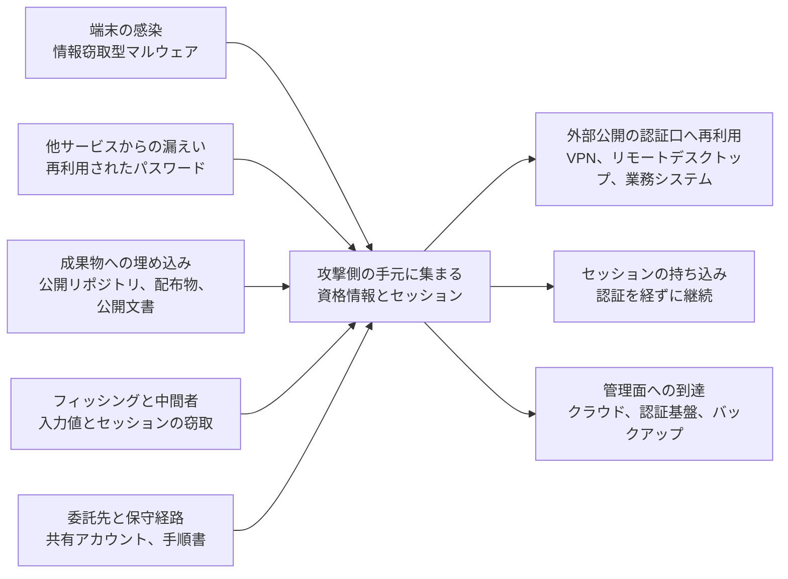
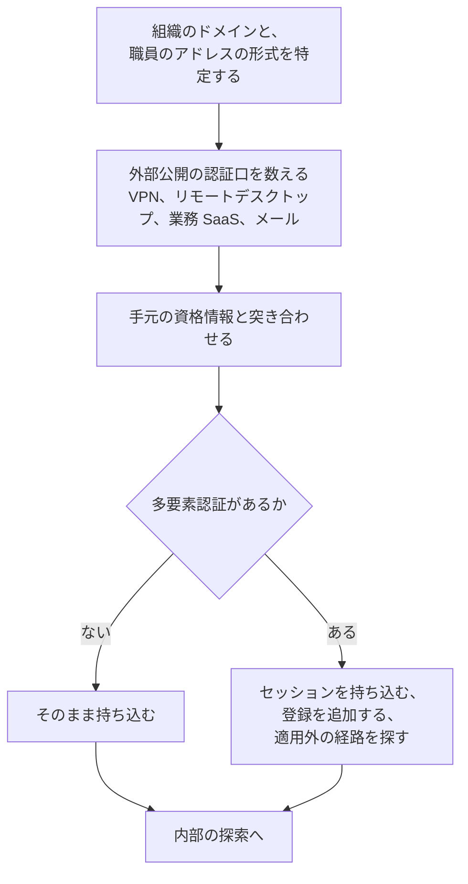

# 🔓 外に出た認証情報

侵入経路の統計は、装置の脆弱性と並んで認証情報を挙げる。
装置の側は更新で塞げるが、認証情報は組織の外にある期間が長く、いつ出たかも分からないまま使われる。

本ページは、資格情報が組織の外へ出る経路、攻撃側での使われ方、自組織で確認する手順、見つけたあとの初動を扱う。
認証方式の要求水準と設計は[認証とアクセス管理](identity.md)、外から見える資産の数え方は[外部から見た自組織の攻撃面](../practice/attack-surface.md)で扱う。

> [!NOTE]
> **表記ルール**：本ページでは、**事実**（一次情報で確認できる内容。出典を併記する）と、**分析**（筆者の解釈）を書き分ける。

---

## 侵入経路とされた機器の更新状況

**事実**：警察庁の統計は、侵入経路とされる機器のセキュリティパッチの適用状況について、「未適用のセキュリティパッチ有」が 40 件、「最新のセキュリティパッチを適用済み」が 31 件、合計 71 件と集計している（令和 7 年、統計編 P134）。
出典：[サイバー空間をめぐる脅威の情勢等について 令和 7 年 統計データ（xlsx）](https://www.npa.go.jp/publications/statistics/cybersecurity/data/R7/R07_jousei_data.xlsx)（警察庁）、集計は[国内の統計から読む脅威](../threats/statistics/japan.md#侵入経路)に整理している。

**分析**：更新済みの装置であっても、有効な資格情報があれば外から入れる。
装置の脆弱性を潰す作業は台帳と更新の管理で進むが、資格情報の側は、組織の管理下にない場所で複製されているため、同じ方法では追えない。
攻撃面の棚卸しに「外に出ている自組織の資格情報」の欄がない場合、この 31 件の側が見えないまま残る。

**事実**：Change Healthcare に対する 2024 年 2 月の攻撃について、UnitedHealth Group の最高経営責任者は米議会に提出した証言で、攻撃者が 2 月 12 日に窃取した資格情報を用いてリモートデスクトップ用の Citrix ポータルへアクセスしたこと、当該ポータルに多要素認証がなかったこと、その 9 日後にランサムウェアが展開されたことを述べている。
出典：[Testimony of Andrew Witty（PDF）](https://democrats-energycommerce.house.gov/sites/evo-subsites/democrats-energycommerce.house.gov/files/evo-media-document/Testimony_Witty_OI_2024.05.01.pdf)（UnitedHealth Group、米下院エネルギー商業委員会 監督調査小委員会、2024 年 5 月 1 日）、経緯は[GL-2024-01](../threats/incidents/global/2024-timeline.md#GL-2024-01)に整理している。

---

## 資格情報が外へ出る五つの経路

経路ごとに、出るものと、失効のさせ方が違う。

| 経路 | 外へ出るもの | 失効のさせ方 | 気づく契機 |
|---|---|---|---|
| 端末の感染 | 保存されたパスワード、ブラウザのセッション、鍵ファイル、VPN の設定 | 当該利用者の資格情報とセッションを両方失効する。端末を初期化しても、既に出たものは戻らない | 端末側の検知、外部からの通知 |
| 他サービスからの漏えい | 業務で使うアドレスと、そこで使ったパスワード | 同じパスワードを使っている業務アカウントを特定して変更する | 漏えいデータの照合 |
| 成果物への埋め込み | API 鍵、接続文字列、保守用の資格情報 | 鍵の再発行。履歴に残るため、削除しても失効にならない | 公開リポジトリと配布物の走査 |
| フィッシングと中間者 | 入力された資格情報、多要素認証の応答、発行済みセッション | セッションの一括失効と、再登録 | 認証基盤の記録、利用者の申告 |
| 委託先と保守経路 | 共有アカウント、作業手順書に書かれた資格情報 | 共有をやめ、個人に紐づけたうえで発行し直す | 契約と作業記録の突き合わせ |

**分析**：三行目と五行目は、失効の単位が「人」ではないため、対応が遅れやすい。
利用者のパスワード変更は手順があるが、機器やサービスに埋め込まれた資格情報は、変更すると連携が止まる。
止まる範囲を把握していないと、変更の判断ができないまま放置される。

---

## 医療の運用に由来する増幅の条件

**分析**：以下の条件は、どれも単独では小さいが、外に出た 1 件が生きたままになる期間を延ばす。

| 条件 | 何が起きるか |
|---|---|
| 部門や病棟の共有アカウント | 誰が使ったか特定できないため、変更の影響範囲が読めず、変更が先送りされる |
| ベンダ保守用の共通 ID | 一つの資格情報が複数の医療機関で通る。1 施設の端末の感染が他施設に波及しうる |
| 装置に付属する管理アカウント | 手順書に初期値のまま書かれ、更新の対象からも外れる |
| 交代勤務での端末の共有 | ブラウザに保存された資格情報とセッションが、利用者をまたいで残る |
| 私物端末からの接続 | 感染の検知も、端末の初期化も、組織の管理外で起きる |
| 退職と異動の反映の遅れ | 使われなくなった ID が、外に出た資格情報のまま有効期間を延ばす |
| 長期にわたって変わらないパスワード | 数年前の漏えいが、いまも通る |

**分析**：一行目と二行目は、[認証とアクセス管理](identity.md#id-のライフサイクル)の棚卸しと同じ対象を扱うが、動機が違う。
棚卸しは「使われていない ID を消す」ために行い、こちらは「既に外にある ID を特定して止める」ために行う。
台帳に載っていない ID は、どちらの作業からも漏れる。

---

## 攻撃側から見た資格情報

**分析**：外に出た資格情報を使う側は、量ではなく順序で動く。
1 件の資格情報から、どの認証口に持ち込むかを決めるまでの流れは次のようになる。

| 攻撃側の判断 | 防御側で対応する設計 |
|---|---|
| どの認証口が多要素認証の適用外かを探す | 適用範囲を、口の一覧に対して確認する。旧経路と例外を残さない |
| 窃取したセッションを使い、認証をやり直さない | セッションを端末や鍵に束縛する。失効の操作を用意する |
| 同じパスワードが別の系でも通るかを試す | 同一の資格情報が複数の系で通る構成をなくす |
| 保守用の共通 ID を、他の施設でも試す | 施設ごとに分け、必要時開放にする |
| 気づかれるまでの時間を測り、静かに待つ | 未知の場所からの成功ログインを検知の対象にする |

**事実**：MITRE ATT&CK は、有効なアカウントの利用を T1078（Valid Accounts）、認証情報の保管場所からの窃取を T1555、ウェブセッションの窃取を T1539 として整理している。
出典：[MITRE ATT&CK](https://attack.mitre.org/techniques/T1078/)（v19.2 時点）

**分析**：検知の設計では、T1078 が最も扱いにくい。
正規の資格情報による正規の手順のログインであり、記録の形が正常時と変わらないためである。
区別できるのは、接続元、時間帯、直後の操作の三つに限られる（[検知の設計を技法単位に落とす](detection-engineering.md)）。

---

## 自組織のものを確認する

外に出た資格情報の確認は、扱いを誤ると、確認する側が法の線に触れる。

> [!IMPORTANT]
> 漏えいした資格情報の一覧を入手して保持する行為は、目的と態様によっては不正アクセス禁止法 4 条（取得）と 6 条（保管）の評価対象になる。
> 自組織の防御を目的とすることを、実施の記録として残す。
> 生のパスワードを集めずに済む方法を先に検討する（[検証と調査の法的境界](../practice/legal-boundary.md)）。

**確認の手順**

1. 対象のドメインと、職員が業務で使うアドレスの形式を確定する
2. ドメイン単位で、漏えいの通知を受け取れる状態にする
3. 自組織の資格情報が、公開されている成果物に含まれていないかを走査する（リポジトリ、配布物、公開文書、Web の資産に含まれる設定）
4. 外部公開の認証口の一覧を作り、多要素認証の適用状況を口ごとに埋める
5. 突き合わせた結果を、アカウントの種類ごとに分けて扱う

**事実**：Have I Been Pwned は、ドメインを所有していることを確認した利用者に対し、そのドメインのアドレスが含まれる漏えいの一覧を提供する機能を用意している。
パスワードの照合には、SHA-1 ハッシュの先頭 5 文字だけを送る方式（k-匿名性）の API が公開されている。
メールアドレスを同じ方式で照合する場合は、先頭 6 文字を送る。
出典：[Domain search](https://haveibeenpwned.com/DomainSearch)、[API v3](https://haveibeenpwned.com/API/v3)（Have I Been Pwned）

**分析**：ハッシュの一部だけを送る方式を使えば、確認のために平文のパスワードを外部へ渡す必要がない。
自組織の認証基盤に「既知の漏えいパスワードを拒否する」機能を入れる場合も、この方式であれば、照合のために資格情報の一覧を手元へ集めずに済む。

**分析**：委託先が保持する資格情報は、この手順では見えない。
保守ベンダが複数の医療機関で同じ ID を使っている場合、自組織の走査では検出できず、契約と作業記録の側から確認する（[基盤の構えと、外部への依存](../response/dependencies.md)）。

---

## 見つけたときに何をするか

種類によって、初動の順序が変わる。
共通するのは、失効を先に行い、影響の確認を後から行うことである。

| 見つかったもの | 最初に行うこと | 次に確認すること |
|---|---|---|
| 職員のアドレスと、業務で使うパスワード | 当該アカウントのパスワード変更とセッション失効 | 同じパスワードが他の系で通らないか。当該アカウントの直近のログイン記録 |
| 外部公開の認証口で通る資格情報 | 当該アカウントの停止。多要素認証の適用 | 当該アカウントによる接続の履歴。接続後の操作 |
| 保守用の共有 ID | ベンダへの連絡と、個人紐づけへの切り替え | 同じ ID が使われている他の系と、他施設への波及 |
| 成果物に埋め込まれた鍵 | 鍵の再発行。旧鍵の失効 | 旧鍵で行われた操作の記録。履歴に残る範囲 |
| 窃取されたセッション | 当該利用者のセッションの一括失効と、多要素認証の再登録 | 失効前に行われた操作。登録されたデバイスの追加 |

**分析**：四行目で、履歴からの削除を先に行うと、失効の前に鍵が使われた期間の記録を失う。
公開の停止と失効を先に行い、履歴の整理はその後にする。

**分析**：五行目は、パスワードの変更だけでは止まらない。
セッションが有効なままであれば、変更後も接続が継続する。
失効の操作が用意されていない製品では、この行に対応できないため、選定の段階で確認する。

---

## 検知の側で何を見るか

| 監視対象 | 検知したい事象 | 医療で誤検知になりやすい正常系 |
|---|---|---|
| 外部公開の認証口 | 未知の接続元からの成功ログイン | 医師の自宅からの当直対応、学会出張中の接続 |
| 認証基盤 | 多要素認証の登録デバイスの追加、認証方式の変更 | 端末更改の時期に集中する正規の再登録 |
| 業務 SaaS | 同一アカウントの、地理的に離れた場所からのほぼ同時の接続 | 委託先の代行操作、複数拠点での共有利用 |
| 保守経路 | 作業計画にない時間帯のログオン | 緊急の障害対応 |
| 電子カルテ | 資格情報の利用者と、参照した患者の担当関係の不一致 | 当直帯の代行入力、緊急時アクセス |

**分析**：右の列を先に埋めないと、左の列は運用に乗らない。
医療機関では、正常系が「業務時間内、担当患者のみ」に収まらないため、時間帯や場所だけを条件にした検知は通知が多くなりすぎる。
接続元と直後の操作を組み合わせ、件数の少ない事象から選ぶ（[ログと監視の設計](logging.md#読む仕組みを作る)）。

---

## 出にくくする設計

| 対策 | 効く経路 | 医療での実施上の制約 |
|---|---|---|
| フィッシング耐性のある認証方式 | フィッシングと中間者 | 共有端末での運用と、生体認証を使えない場面の代替手段が要る |
| セッションを端末や鍵に束縛する | 端末の感染、セッションの窃取 | 端末更改と代替端末での運用に手順が要る |
| 既知の漏えいパスワードの拒否 | 他サービスからの漏えい | 変更を求める頻度が上がるため、利用者への説明が要る |
| 共有アカウントの廃止 | すべての経路 | 交代勤務での運用設計が要る。移行期は代行入力の機能で受ける |
| 保守 ID の必要時開放 | 委託先と保守経路 | ベンダの作業手順と、開放の申請経路を先に決める |
| 成果物の走査を継続する | 成果物への埋め込み | 委託先が作る成果物を対象に含める取り決めが要る |

**分析**：一行目と二行目は、外に出た資格情報の価値を下げる対策である。
出ること自体は止められないため、出たものが通らない状態を作る方向に投資が寄る。
三行目以降は、出る量そのものを減らす。

---

## 実務チェックリスト

**把握**
- [ ] 外部公開の認証口の一覧を作り、多要素認証の適用状況を口ごとに記入した
- [ ] 職員の業務アドレスの形式を確定し、ドメイン単位で漏えいの通知を受け取れるようにした
- [ ] 公開リポジトリと配布物に、自組織の資格情報が含まれていないか走査した
- [ ] 共有アカウントと保守用 ID を一覧にし、所管部署を特定した

**手続き**
- [ ] 漏えい資格情報の確認について、目的と手順を記録に残す形にした
- [ ] 生のパスワードを手元に集めない方法を採った
- [ ] 委託先が保持する資格情報について、契約で確認の方法を定めた

**初動**
- [ ] 種類ごとの失効手順（パスワード、セッション、鍵、保守 ID）を文書化した
- [ ] 鍵の再発行で止まる連携の範囲を把握した
- [ ] セッションの一括失効ができない製品を把握し、代替の手順を決めた

**検知と設計**
- [ ] 未知の接続元からの成功ログインを検知の対象にした
- [ ] 多要素認証の登録デバイスの追加を監視の対象にした
- [ ] 次期更改の要件に、フィッシング耐性のある認証とセッションの失効を書き込んだ

---

## 関連ページ

- [認証とアクセス管理](identity.md)：認証方式の要求水準と、ID のライフサイクル
- [検知の設計を技法単位に落とす](detection-engineering.md)：正規の資格情報による操作をどう見分けるか
- [ログと監視の設計](logging.md)：認証の記録をどこに残すか
- [検証と調査の法的境界](../practice/legal-boundary.md)：漏えい資格情報の取得と保管の扱い
- [外部から見た自組織の攻撃面](../practice/attack-surface.md)：認証口の数え方
- [ダークウェブと医療情報](../threats/actors/dark-web-medical-data.md)：流通の側
- [基盤の構えと、外部への依存](../response/dependencies.md)：委託先が保持する資格情報

---

## 一次情報

| 資料 | 発行元 |
|---|---|
| [サイバー空間をめぐる脅威の情勢等](https://www.npa.go.jp/publications/statistics/cybersecurity/index.html) | 警察庁 |
| [Testimony of Andrew Witty（PDF）](https://democrats-energycommerce.house.gov/sites/evo-subsites/democrats-energycommerce.house.gov/files/evo-media-document/Testimony_Witty_OI_2024.05.01.pdf) | UnitedHealth Group |
| [ATT&CK T1078 Valid Accounts](https://attack.mitre.org/techniques/T1078/) | MITRE |
| [Domain search](https://haveibeenpwned.com/DomainSearch) | Have I Been Pwned |
| [#StopRansomware](https://www.cisa.gov/stopransomware) | CISA |

---

[← 技術領域](README.md) | [トップへ](../../README.md)
