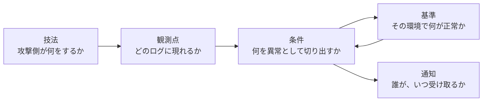

# 📡 検知の設計を技法単位に落とす

ログを集約し、保存期間も決めた。
そのうえで「では何が起きたら通知するのか」を書く段になると、多くの現場が止まる。

止まる理由は、条件そのものが難しいからではない。
医療機関の正常な業務が、一般的な検知ルールの想定と噛み合わないためである。
当直帯の一括ログイン、他の医師の代行入力、緊急時の全患者アクセス、深夜に動く画像の一括転送。
これらは、他業種の環境なら異常として扱う形をしている。

本ページは、攻撃の技法ごとに、どのログに何が現れ、医療で何が誤検知になるかを対応づける。
何を残すかは[ログと監視の設計](logging.md)、防御の段階ごとの位置づけは[防御プレイブック](../threats/actors/defense-playbook.md)で扱う。

> [!NOTE]
> **表記ルール**：本ページでは、**事実**（一次情報で確認できる内容。出典を併記する）と、**分析**（筆者の解釈）を書き分ける。

---

## 検知の条件を組み立てる要素

**分析**：現場で欠けるのは、多くの場合 D である。
製品が提供する既定のルールは A から C までを持っているが、D はその環境で測るしかない。
D を測らずに C を有効にすると、通知が多くなり、やがて誰も見なくなる。
検知の設計とは、C を書く作業ではなく、D を測って C を絞る作業である。

**事実**：厚生労働省のガイドライン第 7.0 版は、ログの確認について、全件の目視ではなく、システムでの監視や、運用に基づく適切な閾値でのスクリーニング後のログを確認することを想定している。
出典：[医療情報システムの安全管理に関するガイドライン 第 7.0 版](https://www.mhlw.go.jp/stf/shingi/0000516275_00006.html)（厚生労働省）、要求の詳細は[ログと監視の設計](logging.md#国内の要求水準)に整理している。

---

## 技法と、観測点と、医療の正常系

侵害の段ごとに並べる。
左から三列が一般的な検知の設計、四列目が医療に固有の調整である。
技法の識別子は ATT&CK v19.2（2026 年 4 月 28 日）のものである。
ATT&CK は改訂で識別子を統合または移動することがあるため、自組織の台帳に書くときは版を併記する。

| 技法 | 観測点 | 切り出す条件 | 医療で正常系に現れる形 |
|---|---|---|---|
| 外部リモートサービスの利用（[T1133](https://attack.mitre.org/techniques/T1133/)） | VPN、リモートデスクトップの認証記録 | 未知の接続元からの成功、地理的に離れた接続の連続 | 医師の自宅からの当直対応、学会出張、ベンダの遠隔保守 |
| 有効なアカウントの利用（[T1078](https://attack.mitre.org/techniques/T1078/)） | 認証基盤のログオン | 利用者と端末、利用者と時間帯の組み合わせの変化 | 応援勤務、非常勤医師の不定期な勤務、共有端末 |
| OS の資格情報のダンプ（[T1003](https://attack.mitre.org/techniques/T1003/)） | サーバ OS の監査、EDR | 認証情報の保管領域への異常な参照 | 正規の資産管理ツール、バックアップ処理 |
| Kerberoasting（[T1558.003](https://attack.mitre.org/techniques/T1558/003/)） | 認証基盤のチケット要求 | 弱い暗号種別での大量のチケット要求 | 古い部門システムが要求する互換設定 |
| アカウントの操作と作成（[T1098](https://attack.mitre.org/techniques/T1098/)、[T1136](https://attack.mitre.org/techniques/T1136/)） | 認証基盤、特権グループの変更 | 特権グループへの追加、業務時間外の作成 | システム更改時の一括作成、ベンダによる保守用アカウントの追加 |
| 防御機能の無効化（[T1685](https://attack.mitre.org/techniques/T1685/)） | EDR、サーバ OS | 保護機能の停止、除外設定の追加 | 医療機器ベンダが指定する除外設定の適用 |
| 復旧手段の破壊（[T1490](https://attack.mitre.org/techniques/T1490/)） | バックアップ基盤、サーバ OS | 世代の削除、シャドウコピーの削除、保持設定の変更 | 保守作業としての世代整理 |
| 痕跡の削除（[T1070](https://attack.mitre.org/techniques/T1070/)） | サーバ OS、集約先 | イベントログのクリア、転送の停止 | 検証環境の初期化 |
| 暗号化（[T1486](https://attack.mitre.org/techniques/T1486/)） | ファイルサーバ、EDR | 短時間での大量の書き換え、拡張子の変化 | 大容量の画像データの一括移行 |
| 持ち出し | 通信フロー、プロキシ | 平時と異なる宛先への大量転送 | 研究データの共同研究先への送付、画像の外部読影 |

**分析**：右端の列が埋まらないうちは、その行の条件を通知に接続しない。
たとえば六行目は、医療機器ベンダが「この製品の動作のためにこのフォルダを除外してほしい」と指定する運用が実在するため、除外設定の追加そのものは異常ではない。
異常なのは、指定の記録がない除外の追加である。
つまり条件は「除外設定の追加」ではなく「保守記録と対応しない除外設定の追加」になる。

**分析**：この読み替えは、ほぼすべての行で必要になる。
検知の条件は技法だけでは書けず、その組織が持つ台帳（保守記録、勤務表、担当関係、機器の一覧）と突き合わせる形になる。
台帳が電子化されていない場合、検知の条件も自動化できない。

---

## 医療の正常系を測る

条件を絞るために、先に測る対象を並べる。
どれも、侵害の後では測れない。

| 測るもの | 使いみち |
|---|---|
| 接続元の分布（時間帯、拠点、回線） | 未知の接続元の定義を決める |
| 端末と利用者の対応 | 共有端末を除いた範囲で、組み合わせの変化を条件にできる |
| 緊急時アクセスの発動頻度 | 発動そのものではなく、頻度の変化を条件にできる |
| 代行入力の実施状況 | 利用者と患者の担当関係の不一致を、条件から除外する範囲を決める |
| 機器の定時通信（画像転送、検体結果の連携） | 大量転送の基準値を決める |
| ベンダ保守の実施記録 | 保守時間帯と、作業計画にない接続を切り分ける |

**分析**：三行目と四行目は、医療でしか出てこない。
緊急時アクセス（ブレークグラス）は、正当な機能として設計されているため、発動を検知しても意味がない（[認証とアクセス管理](identity.md#ブレークグラスの設計)）。
条件として使えるのは、発動の記録に事後の確認が紐づいているかどうかである。

---

## ルールを持ち回せる形にする

**事実**：Sigma は、ログの事象を検知する条件を、製品に依存しない構造化された形式で記述するための記法である。
記述した条件は、変換ツールによって各製品の検索構文へ変換して使う。
出典：[Sigma](https://sigmahq.io/)

**分析**：医療機関で自前の検知基盤を持たない場合でも、この形式で条件を書いておく意味がある。
監視を委託している場合、委託先へ渡すのは「この技法を、この条件で、この除外を付けて見てほしい」という指示であり、製品の画面で設定した内容は契約が変わると引き継げない。
条件を文書として持てば、委託先の変更、製品の更改、監視の内製化のいずれでも残る。

**運用で決めること**

1. 条件ごとに、対応する技法と観測点を記録する
2. 除外を追加したときは、除外の理由と、除外を外す条件を併記する
3. 条件の変更を版で管理し、いつから何を見ていたかを説明できるようにする
4. 検証や演習のあとに、その条件で何が観測されたかを突き合わせる

**分析**：2 が抜けると、数年後には「なぜこの除外があるのか誰も知らない」状態になり、その除外の内側が死角として残る。
医療機器ベンダの指定による除外は特に長く残るため、機器の更新や撤去のときに見直す契機を作る。

---

## 医療機器のゾーンで、条件をどこに置くか

**分析**：端末側にエージェントを入れられない機器では、条件を機器の外側に置くしかない（[ログと監視の設計](logging.md#医療機器ゾーンで-edr-が入らないとき)）。

| 置く場所 | 見える事象 | 限界 |
|---|---|---|
| ゾーンの境界 | ゾーンをまたぐ通信の相手と量 | ゾーン内部の横方向の通信は見えない |
| 認証基盤 | 機器が使うアカウントの利用 | 機器がローカル認証で動く場合は現れない |
| DHCP、DNS、スイッチ | 新しい機器の出現、名前解決の変化 | 固定 IP で構成された機器は登場しない |
| 通信の受動的な観測 | 通信の相手、頻度、プロトコルの変化 | 内容の検査には別の判断が要る |

**分析**：この構成では「機器が侵害されたこと」は検知できず、「機器の通信の相手や量が変わったこと」だけが見える。
それでも意味があるのは、医療機器を経由する攻撃の多くが、最終的にゾーンの外へ出る通信を伴うためである。
機器の内部で完結する改変（[完全性への攻撃](../threats/integrity-attacks.md)）は、この構成では見えないため、別の検知を置く。

---

## 欺瞞とカナリアを、医療のどこに置くか

正常系のノイズが多い環境では、条件を厳しくするほど検知が遅れる。
これに対して、正常な業務が絶対に触れない対象を置き、触れられたら通知する方法がある。

**事実**：MITRE は、敵対者との関与（adversary engagement）の枠組みとして Engage を公開している。
出典：[MITRE Engage](https://engage.mitre.org/)

**事実**：NIST SP 800-160 Volume 2 Revision 1（2021 年 12 月）は、サイバーレジリエンスの技法の一つとして Deception を挙げ、その内容を、敵対者を誤導し、混乱させ、重要な資産を隠し、または細工を施した資産を敵対者に晒すことと定義している。
同書は、Deception が敵対者に労力を浪費させ、その戦術、技術、手順を明らかにさせうる一方で、分析的な監視と状況把握の一部を複雑にしうるとも述べている。
出典：[NIST SP 800-160 Vol. 2 Rev. 1](https://csrc.nist.gov/pubs/sp/800/160/v2/r1/final)（NIST）

**分析**：欺瞞が医療で効きやすいのは、業務系の通信が定型的で、正常時に触れられる対象が限られているためである。
一方で、医療では置き方を誤ると診療そのものに混入する。
効く置き方と、置いてはいけない置き方を分けて考える必要がある。

### 置ける場所

| 置くもの | 触れられたときに分かること | 前提 |
|---|---|---|
| 認証基盤の使われないアカウント | 資格情報の探索、権限昇格の試行 | 業務のどの処理からも参照されないことを確認する |
| 共有フォルダに置くファイル | 内部の探索、ファイルサーバの横断 | 検索やバックアップの対象から外す |
| 使われていない管理画面の応答 | 内部からの管理面の探索 | 実機ではなく、応答だけを返す構成にする |
| 割り当てのないアドレス帯への通信 | ゾーン内の走査 | ネットワークの設計と台帳が一致していること |

### 置いてはいけない場所

**分析**：以下は、検知の利得より、患者安全と診療への影響のほうが大きい。

| 置いてはいけないもの | 起きうること |
|---|---|
| 電子カルテ上のダミー患者 | 診療の対象として選択され、実際の指示や記録が架空の患者に紐づく。検査や投薬の取り違えにつながる |
| 偽の画像送信先（DICOM ノード） | 機器の送信先設定に紛れ、実際の検査画像が届かなくなる。読影と診断が止まる |
| 偽のオーダーや検査結果 | 部門システムへ流入し、結果の取り違えを起こす |
| 実在する患者の氏名を使った囮の記録 | 個人情報の取り扱いとして問題になる |

**分析**：一行目と三行目は、[完全性への攻撃](../threats/integrity-attacks.md)で扱う「値が変わる経路」を、防御側が自分で作ることになる。
検知のために作った偽のデータが、患者安全の側のリスクに転じる。
欺瞞を置く対象は、診療の流れに入らない領域（認証基盤、ファイル共有、ネットワークの空き領域）に限る。

### 置くときに決めること

1. 置いた場所の台帳を作り、置いた理由と担当者を記録する
2. 触れられたときの通知先を、夜間休日を含めて決める
3. 通知を受けた側が最初に行う確認（誤検知の切り分け）を手順にする
4. 更改や移設のときに、置いたものが残らないよう、撤去の契機を決める

**分析**：4 が抜けると、数年後の担当者が「用途不明のアカウント」として棚卸しの対象にし、通知だけが残る。
欺瞞は、置いた事実を知る人が組織を離れた時点で、負債に変わる。

---

## 検知の効きを確かめる

**分析**：検知の条件は、書いた時点では効くかどうか分からない。
確かめる方法は二つある。

**演習で確かめる**：机上の演習で、各段の検知が誰にどう届くかを追う（[演習シナリオのカタログ](../response/tabletop.md)）。
条件の有無ではなく、通知が判断につながるかを見る。

**検証と突き合わせる**：許可を得た検証のあとに、実施記録と、防御側に残った記録を突き合わせる（[診断とペネトレーションテスト](../practice/pentest/)）。
観測されなかった操作について、記録されない理由（設定、転送、保存期間、製品の仕様）を特定する。

**分析**：突き合わせの結果は、次の形の表にすると予算の根拠になる。
攻撃の段、期待した記録、実際の記録、差分の原因、対応の期限の五列である。
「脆弱性が見つかった」より「侵入されても気づけない段が三つある」のほうが、経営層の判断につながる（[経営とガバナンス](../governance/)）。

---

## 実務チェックリスト

**基準**
- [ ] 接続元の分布、端末と利用者の対応、機器の定時通信の基準値を測った
- [ ] 緊急時アクセスと代行入力の実施状況を把握した
- [ ] ベンダ保守の実施記録を、検知の条件と突き合わせられる形にした

**条件**
- [ ] 技法、観測点、条件、除外の形で条件を文書化した
- [ ] 除外ごとに、理由と、外す条件を併記した
- [ ] 条件の変更を版で管理している
- [ ] 監視を委託している場合、条件を文書として渡している

**医療機器**
- [ ] エージェントを入れられない機器について、条件を置く場所を決めた
- [ ] ゾーンをまたぐ通信の基準値を把握した

**欺瞞**
- [ ] 置いたものの台帳を作り、担当者と撤去の契機を決めた
- [ ] 診療の流れに入る位置に置いていないことを確認した
- [ ] 通知先と、最初の確認手順を決めた

**確認**
- [ ] 演習または検証のあとに、何が観測されたかを突き合わせた
- [ ] 観測されなかった操作について、記録されない理由を特定した

---

## 関連ページ

- [ログと監視の設計](logging.md)：何を、どこに、どれだけ残すか
- [防御プレイブック](../threats/actors/defense-playbook.md)：段階ごとの対策の順序
- [外に出た認証情報](credential-exposure.md)：正規の資格情報による操作の見分け方
- [ネットワークの分離](segmentation.md)：条件を置く場所としてのゾーン境界
- [完全性への攻撃と患者安全](../threats/integrity-attacks.md)：値の改変を見つける設計
- [演習シナリオのカタログ](../response/tabletop.md)：通知が判断につながるかを確かめる
- [診断とペネトレーションテスト](../practice/pentest/)：検証の記録と防御側の記録の突き合わせ

---

## 一次情報

| 資料 | 発行元 |
|---|---|
| [ATT&CK Enterprise Matrix](https://attack.mitre.org/matrices/enterprise/) | MITRE |
| [MITRE Engage](https://engage.mitre.org/) | MITRE |
| [NIST SP 800-160 Vol. 2 Rev. 1](https://csrc.nist.gov/pubs/sp/800/160/v2/r1/final) | NIST |
| [Sigma](https://sigmahq.io/) | SigmaHQ |
| [医療情報システムの安全管理に関するガイドライン 第 7.0 版](https://www.mhlw.go.jp/stf/shingi/0000516275_00006.html) | 厚生労働省 |

---

[← 技術領域](README.md) | [トップへ](../../README.md)
