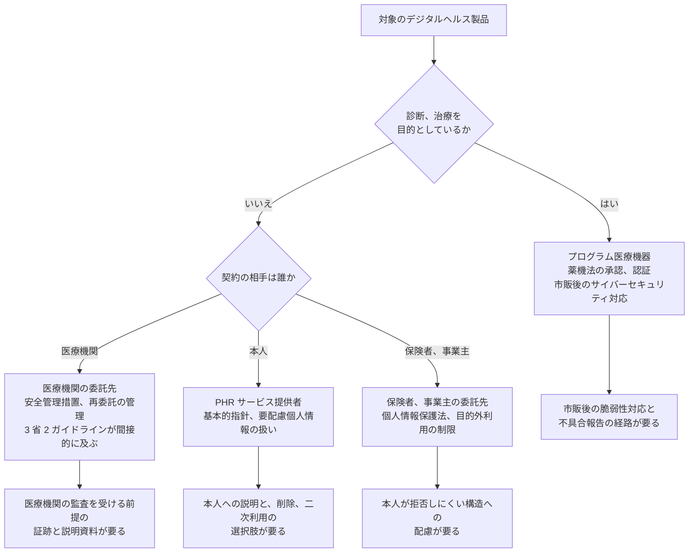
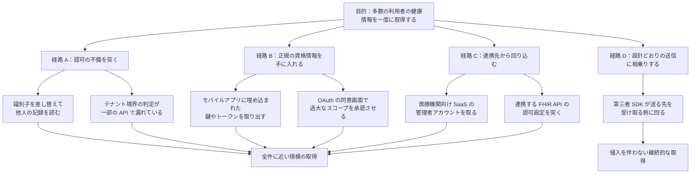

# 📲 デジタルヘルス

デジタルヘルスという語は、医療機関の中にあるシステムを指さない。
指しているのは、治療用アプリ、オンライン診療、PHR、ウェアラブル、医療機関向け SaaS、健康データの二次利用基盤といった、医療機関の外側で開発され、患者と医療者の双方が使う製品群である。

この群の多くは、医療情報システムと同じデータを扱いながら、医療情報システムの安全管理に関するガイドラインが直接の対象としていない。
守る側から見ると制度の谷になり、攻撃者から見ると、同じ価値のデータが施設の外に集約されている場所になる。
本セクションは、その谷を対象とする。

> [!NOTE]
> **表記ルール**：本ページでは、**事実**（一次情報で確認できる内容。出典を併記する）、**報道ベース**（報道や第三者の集計のみで確認でき、当事者の公表資料では裏付けが取れていない内容）、**分析**（筆者の解釈）を書き分ける。
> 出典は、当事者の公表資料、行政文書、CVE、ベンダアドバイザリなどの一次情報を優先して示す。
> 制度と製品は改定が続く領域であり、時期や仕様は変わりうる。判断にあたっては出典先の最新の記載を確認してほしい。

---

## このセクションの構成

- [Google のデジタルヘルス](google.md)：端末、ウェアラブル、クラウド、モデルを一社が縦に持つ構成と、その責任分界

## この語が指す範囲

**事実**：世界保健機関は「デジタルヘルスに関するグローバル戦略 2020-2025」で、デジタルヘルスを「健康を改善するためにデジタル技術を開発し利用することに関わる知識と実践の領域」と定義している。
同戦略は 2020 年の第 73 回世界保健総会で歓迎された（[WHO Global strategy on digital health 2020-2025](https://www.who.int/publications/i/item/9789240020924)）。

この定義は広い。
守る側が扱うには、規制の当たり方で切り直す必要がある。
次の六つに分けると、確認すべき項目が変わる位置が見える。

| 区分 | 例 | 規制の主な当たり方 |
|---|---|---|
| プログラム医療機器（SaMD）、治療用アプリ | 診断支援、治療用アプリ、画像解析 | 薬機法。承認、認証、市販後の対応 |
| 遠隔医療、遠隔モニタリング | オンライン診療、在宅の生体情報の常時送信 | オンライン診療の適切な実施に関する指針、医療情報システムの安全管理に関するガイドライン（医療機関側） |
| PHR、健康アプリ、ウェアラブル | 歩数、睡眠、心拍、健診結果の取り込み | 個人情報保護法、PHR の基本的指針 |
| 医療機関向け SaaS | 予約、問診、勤怠、AI 文書作成、クラウド電子カルテ | 医療機関から見た委託先。安全管理措置と再委託の管理 |
| データ基盤、二次利用 | 研究用データセット、リアルワールドデータ、レジストリ | 次世代医療基盤法、倫理指針、海外では EHDS |
| 保険者、健康経営向けサービス | 特定健診の管理、重症化予防、従業員向け健康支援 | 個人情報保護法、保険者としての義務 |

**分析**：この六つは、扱うデータの中身では区別できない。
血糖値は、SaMD の入力でもあり、PHR アプリの記録でもあり、健康経営サービスの集計対象でもある。
区分が変わるのは、その製品が何を主張しているか（診断するのか、記録するだけか）と、誰と契約しているか（患者本人か、医療機関か、保険者か）による。

---

## 規制の当たり方を決める二つの問い

規制の当たり方は、二つの問いで決まる。
製品を評価するとき、この二つを先に確定させると、確認すべき項目の一覧が定まる。

**事実**：厚生労働省は「プログラムの医療機器該当性に関するガイドライン」を令和 3 年 3 月 31 日に策定し、令和 5 年 3 月 31 日に一部改正した（薬生機審発 0331 第 1 号、薬生監麻発 0331 第 4 号）。
プログラムが医療機器に該当するかは、診断、治療への寄与の程度と、意図しない動作をしたときに人の生命と健康に与える影響の大きさから判断される（[ガイドライン本文（PDF）](https://www.pmda.go.jp/files/000240233.pdf)）。

**事実**：経済産業省と厚生労働省は、プログラム医療機器の実用化を促す施策として「プログラム医療機器実用化促進パッケージ戦略（DASH for SaMD）」を進めている（[経済産業省 SaMD](https://www.meti.go.jp/policy/mono_info_service/healthcare/SaMD.html)）。

**事実**：総務省、厚生労働省、経済産業省は「PHR サービス提供者による健診等情報の取扱いに関する基本的指針」を令和 3 年 4 月に策定し、令和 7 年 4 月に改定した（[総務省 報道資料](https://www.soumu.go.jp/menu_news/s-news/01ryutsu06_02000443.html)、[指針本文（PDF）](https://www.meti.go.jp/policy/mono_info_service/healthcare/00phrshishin_20250428.pdf)）。
業界側では、PHR サービス事業協会と一般社団法人 PHR 普及推進協議会が「PHR サービス提供に関わるガイドライン（第 4 版）」を 2025 年 6 月に公表している（[PHR サービス事業協会 ガイドライン](https://phr-s.org/contents/guidelines/)）。

**事実**：欧州連合は欧州健康データスペース規則（Regulation (EU) 2025/327）を 2025 年 3 月 5 日に官報で公示し、同年 3 月 26 日に発効した。
適用は段階的であり、二次利用は 2029 年 3 月に多くのデータ種別で始まり、医用画像、検査結果、退院時要約、ゲノムデータは 2031 年 3 月からとされている。
二次利用にあたっては、健康データアクセス機関の許可を得たうえで、認定された安全な処理環境の中でのみ処理することが求められる（[欧州委員会 European Health Data Space](https://health.ec.europa.eu/ehealth-digital-health-and-care/european-health-data-space_en)）。
安全な処理環境が満たすべき技術要件は、TEHDAS2 が仕様として公表している（[TEHDAS2](https://tehdas.eu/results/tehdas2-publishes-new-specifications-for-secure-processing-environments-under-the-ehds/)）。

**分析**：これらの制度は、対象を製品の種類ではなく、行為の性質で切っている。
そのため、一つの製品が複数の制度にまたがり、どれにも中途半端に当たる状態が生まれる。
健診結果を記録し、生活改善を助言し、医師に共有するアプリは、医療機器には該当せず、医療機関の委託先でもなく、PHR の指針だけが当たる。
このとき、外部から確認できるのはプライバシーポリシーの記載と、アプリが要求する権限と、実際の通信先しかない（[PHR、健康アプリ、ウェアラブル](../web-security/phr-apps.md)）。

---

## 攻撃者が標的を選ぶ四つの尺度

攻撃者は、対象が何法の規制下にあるかで標的を選ばない。
選ぶ基準は、到達できるか、一度で何件取れるか、気づかれるまでどれだけかかるか、取ったあと何に使えるか、の四つである。
攻撃者から見ると、デジタルヘルスの製品群は、この四つのいずれでも院内システムより条件がよい。

| 尺度 | 院内の医療情報システム | デジタルヘルスの製品 |
|---|---|---|
| 到達性 | 閉域網、VPN 装置、保守回線を越える必要がある | 設計上インターネットに公開されている。認証を経ずに到達できる部分がある |
| 集約度 | 一施設分の患者 | マルチテナントの SaaS では、契約した全施設分。消費者向けでは全利用者分 |
| 検知までの時間 | 診療の停止という形で表面化する | 参照が増えても診療は止まらない。認可の不備は正規のリクエストとして記録される |
| 取得後の使い道 | 身代金の交渉材料 | 名寄せ、なりすまし、詐欺の材料。病名や服薬は再発行できない |

**分析**：四つ目が、この領域に固有の点になる。
クレジットカード番号は再発行できるが、精神科の受診歴と処方は取り消せない。
漏えいの影響が時間とともに減らないため、攻撃者にとってのデータの価値も減らない。

攻撃の道筋を目的から逆にたどると、経路は四つに分かれる。

**事実**：Approov と研究者 Alissa Knight は、モバイル健康アプリと FHIR API を対象にした調査を 2021 年に一連の報告として公表している。
調査対象とした 30 のモバイル健康アプリのすべてでハードコードされた鍵やトークンが見つかり、オブジェクト単位の認可の欠落によって他の利用者の記録に到達できた、というのが報告の内容である（[Approov mHealth](https://approov.io/news/mhealth/)、[Approov FHIR](https://approov.io/news/fhir-pr/)）。

**分析**：この報告はセキュリティ製品の事業者による調査であり、査読を経た研究ではない。
対象アプリ名も公表されていないため、数字をそのまま引用するには注意がいる。
一方で、指摘された二つの型（鍵の埋め込みと、オブジェクト単位の認可の欠落）は、[患者用ポータルの脆弱性](../web-security/patient-portal.md)と[HL7 v2 と FHIR の攻撃面](../web-security/hl7-fhir.md)で扱った型と一致する。
新しい脆弱性の類型が出ているのではなく、既知の型が規制の薄い領域で再生産されている、と読むのが妥当である。

---

## 七つの攻撃面と、それぞれの確かめ方

攻撃手法だけを並べても守る側の作業にはならないため、面ごとに、典型的な失敗、気づく方法、抑える方法を対にする。

| 攻撃面 | 典型的な失敗 | 気づく方法 | 抑える方法 |
|---|---|---|---|
| 認証と同意 | 認証コードの再送に上限がない。招待リンクが推測できる。家族共有の解除が効かない | 同一 IP からの認証試行、招待リンクの発行と使用の乖離 | 二要素認証、リンクの有効期限と一回限りの使用、共有の失効を明示的に処理する |
| 認可とテナント境界 | 一覧 API だけ判定が抜ける。印刷用と出力用の経路で判定が省かれる | 応答したレコード数の分布、通常と異なる患者 ID 空間への参照 | 判定を画面ごとではなくデータ取得層に置く。検証用アカウント二つで境界を確かめる |
| API とモバイル | 鍵やトークンをアプリに埋め込む。サーバ側の検証をクライアントに任せる | 配布物からの文字列抽出を自組織で定期実行する | 秘密はサーバに置く。クライアントの入力を信頼しない |
| 端末上のデータ | 端末内に平文で保存する。スクリーンショットとバックアップに含まれる | 端末の設定と OS の権限画面で確認する | OS の保護領域を使い、権限は機能から説明できる範囲に絞る |
| 第三者 SDK と送信 | 解析と広告の SDK が、症状や診療科を含む URL を送る | 実機での通信の観測。送信先ドメインの一覧化 | タグと SDK を棚卸しし、説明と実際の送信を一致させる（[患者向けサイトの第三者送信](../web-security/tracking.md)） |
| AI 機能 | 取り込んだ文書の指示に従って要約が操作される。出力が検証されずに記録へ書かれる | 入力と出力の対応を記録し、事後に追えるようにする | AI の出力を提案として扱い、記録への反映に人の確認を挟む（[AX：医療における AI のセキュリティ](../dx-ax/ai-security.md)） |
| 事業と供給網 | 依存する OSS の更新が止まる。事業譲渡でデータの扱いが変わる。廃業でデータの行き先が決まらない | 依存の一覧（SBOM）と、契約上の終了条項を定期的に見る | 終了時のデータの扱いを契約に書く。移行できる形式で出力できるようにする（[ゲノムデータの保護](../genomics.md)） |

**分析**：この七つのうち、見つかりやすいのは二つ目である。
認可の判定が画面ごとに書かれていると、後から追加した API や出力機能に判定が伝わらない。
一方で、影響が最も長く残るのは七つ目になる。
脆弱性は直せるが、事業が終わったあとのデータの所在は、技術的な対処の外にある。

---

## 検証する側は、どこまで触れてよいか

デジタルヘルスの製品は、Web サービスの見た目をしていても、動いている先に患者がいる。
検証の範囲は、対象が医療機器に該当するかと、実データが入っているかで変わる。

| 対象 | 許可があれば確認してよい | 条件つき | 行わない |
|---|---|---|---|
| 消費者向け健康アプリ（自分のアカウント） | 通信の観測、端末内の保存、要求する権限、エクスポートと削除 | 認可の確認は、検証用に用意した二つのアカウントで行う | 他人のアカウント、実在の患者データへの到達確認 |
| 医療機関向け SaaS | 事業者の許可を得たテスト環境での検証 | 本番環境の検証は、書面の許可と時間帯の合意があるときに限る | 本番の他テナントへの到達確認、負荷をかける試験 |
| プログラム医療機器に該当する製品 | 事業者の管理下にある検証機での確認 | 治療や診断の動作に関わる部分は、事業者の立会いのもとで行う | 稼働中の機器、患者に装着された機器 |
| 医療機関の公開サイト | 事業者または医療機関が公開する脆弱性開示方針の範囲内 | 方針がない場合は、まず連絡経路を確認する | 方針の範囲外の探索、データの持ち出し |

**分析**：判断が分かれるのは二行目である。
医療機関向け SaaS は、契約上の相手が医療機関であるため、事業者の許可だけでは足りない場面がある。
他テナントに到達できるかを本番で確かめる行為は、成功した時点で他院の患者情報に触れることになる。
確かめる価値がある仮説ほど、確かめ方を先に合意しておく必要がある。

報告の経路と、報告を受け取る側の準備は [バグバウンティと脆弱性開示](../../practice/bug-bounty/)、検証の設計は [セキュリティ診断とペネトレーションテスト](../../practice/pentest/)、判断の枠組みは [医療の倫理とセキュリティの倫理](../../reference/ethics.md) に分けて置いている。

---

## 優先順位を決めるときに見る四つの値

守る側は、七つの面を同時に埋められない。
順序を決めるときは、次の四つを見る。

| 見る値 | 何で測るか |
|---|---|
| 到達しうる人数 | その経路で一度に取得できるレコード数。全件か、一件ずつか |
| データの取り消せなさ | 病名、遺伝情報、精神科の受診歴が含まれるか。含まれるなら、漏えいの影響は時間で減らない |
| 到達の容易さ | 認証前に到達できるか。一般利用者の権限で到達できるか |
| 気づくまでの時間 | 記録が残るか。残った記録を誰かが読むか |

**分析**：四つ目は、記録が残るかどうかと取り違えられやすい。
見るのは、記録が保存されているかではなく、その記録を読む担当者と手順があるかである。
参照ログが取れていても読む者がいなければ、認可の不備は最初の通報まで検知されない。
ログの設計は [ログと監視の設計](../logging.md)、外部から見える面の数え方は [外部から見た自組織の攻撃面](../../practice/attack-surface.md) にまとめている。

---

## 実務チェックリスト

**製品を導入または委託する側**
- [ ] 六つの区分のどれに当たるかを確定し、当たる制度を書き出した
- [ ] 医療機器に該当する場合、市販後の脆弱性対応と連絡経路を確認した
- [ ] 委託先として扱う場合、再委託の範囲と監査の可否を契約に書いた
- [ ] 終了時のデータの扱い（返却、削除、移行形式）を契約に書いた
- [ ] 外部への送信先を一覧化し、説明と一致することを確認した

**製品を提供する側**
- [ ] 認可の判定をデータ取得層に置き、新しい API に自動的に及ぶ設計にした
- [ ] 秘密をクライアントに置いていないことを、配布物の走査で確認した
- [ ] 検証用アカウント二つで、テナント境界と他人の記録への到達を確認した
- [ ] 参照ログを保存し、読む担当者と手順を決めた
- [ ] AI 機能の入力と出力を記録し、事後に追える形にした
- [ ] 脆弱性の報告を受け取る窓口を公開した

---

## 関連ページ

- [Google のデジタルヘルス](google.md)：一社が層をまたいで持つ構成と、その責任分界
- [PHR、健康アプリ、ウェアラブル](../web-security/phr-apps.md)：本人の手に渡ったあとのデータ
- [患者向けサイトの第三者送信](../web-security/tracking.md)：侵入を伴わずに情報が外部へ出る経路
- [HL7 v2 と FHIR の攻撃面](../web-security/hl7-fhir.md)：連携 API の攻撃面
- [医療 DX と AX](../dx-ax/)：国の基盤で増える接続点と、医療に AI を組み込むときの脅威
- [クラウド事業者と医療](../cloud/)：責任分界と、クラウド上で侵害される経路
- [医療機器のセキュリティ](../medical-devices/)：プログラム医療機器と市販後対応
- [ゲノムデータの保護](../genomics.md)：事業者が消えるときのデータの扱い
- [ガイドラインと法規制](../../guidelines/)：制度側の要求

---

[トップへ](../../../README.md)
