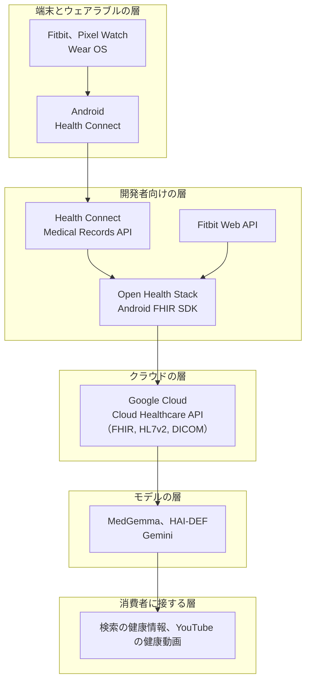

# 🔎 Google のデジタルヘルス

Google のデジタルヘルスは、一つの製品ではない。
患者が使う端末の OS、手首に着けるウェアラブル、医療機関のデータを置くクラウド、医療テキストと画像を扱うモデル、そして健康情報を探す検索と動画を、同じ企業が層として持っている。

この構成を単独で扱う理由は、医療機関や事業者から見たときに、契約の相手と責任の所在が層ごとに変わるからである。
クラウドの層では契約と監査の対象になり、端末の層では利用者本人の設定に依存し、モデルの層では重みを受け取った側が検証の責任を負う。
どの層の話をしているかを取り違えると、確認すべき項目が入れ替わる。

> [!NOTE]
> **表記ルール**：本ページでは、**事実**（一次情報で確認できる内容。出典を併記する）、**報道ベース**（報道や第三者の集計のみで確認でき、当事者の公表資料では裏付けが取れていない内容）、**分析**（筆者の解釈）を書き分ける。
> 製品名、提供範囲、規約は変更が続く。判断にあたっては出典先の最新の記載を確認してほしい。

---

## Google が持つ五つの層

**分析**：この図で確認したいのは技術の流れではなく、境界の位置である。
端末の層と開発者向けの層の境界は利用者の権限付与で切れており、クラウドの層とモデルの層の境界は契約で切れている。
侵害の影響範囲を見積もるとき、どの境界が破れたのかを最初に決める必要がある。

---

## 端末とウェアラブルの層

**事実**：Health Connect は、Android 上で健康と運動のデータをアプリ間で受け渡すための仕組みである。
Android 13 以前は Google Play から入手するアプリとして提供され、Android 14 以降は OS のモジュールとして組み込まれている（[Android 13 から 14 への移行](https://developer.android.com/health-and-fitness/health-connect/migration/android-13-to-14)）。
発表時の説明では、データは端末上に保存され、暗号化されるとされている（[Android Developers Blog（2022-05）](https://android-developers.googleblog.com/2022/05/introducing-health-connect.html)）。

**事実**：Health Connect には、医療記録を FHIR 形式で読み書きする Medical Records の機能がある。
通常の健康データとは別の権限画面が用意され、アレルギー、既往、検査結果といった種別ごとに読み取りの許可が分かれている。
この API は開発中の位置づけであり、Play ストアの取り扱い方針も策定中とされている（[Medical Records](https://developer.android.com/health-and-fitness/health-connect/medical-records)、[医療データの読み取り](https://developer.android.com/health-and-fitness/health-connect/medical-records/read-data)）。

**事実**：Google は Google Fit の API の提供終了を告知し、Android 向けの移行先として Health Connect を案内している（[Google Fit](https://developers.google.com/fit)、[Fit からの移行](https://developer.android.com/health-and-fitness/health-connect/migration/fit)）。

**事実**：Google は 2025 年 2 月 26 日、Pixel Watch 3 の Loss of Pulse Detection（脈拍の消失の検知）が米国 FDA のクリアランスを受けたと公表し、米国での提供を同年 3 月末から始めるとした（[Google の告知](https://blog.google/feed/pixel-watch-3-loss-of-pulse-detection-fda/)）。

**事実**：Google は 2026 年 3 月 17 日の The Check Up で、Fitbit が医療記録を連携して個別の健康助言に使う機能、YouTube の健康動画に付く AI の「Ask」ボタン、臨床家の教育に対する Google.org の 1000 万ドルの拠出を公表した（[blog.google（2026-03-17）](https://blog.google/innovation-and-ai/technology/health/google-check-up-health-ai-updates-2026/)）。

**分析**：この層で押さえるべき変化は、Health Connect が「歩数と心拍を渡す仕組み」から「診療情報を渡す仕組み」に広がった点にある。
歩数の集約と、アレルギーと処方の集約では、端末を失ったときに起きることが違う。
端末の権限画面が、実質的に一つの認可点になる。

---

## 開発者向けの層

**事実**：Open Health Stack は、FHIR を用いた医療アプリを構築するための部品群である。
Android FHIR SDK は Kotlin のライブラリで構成され、通信が切れた環境でも動作するアプリを作れるようにしている（[Open Health Stack](https://developers.google.com/open-health-stack)、[Android FHIR SDK](https://developers.google.com/open-health-stack/android-fhir)）。
2025 年 9 月には、複数プラットフォーム向けの Kotlin FHIR ライブラリが公開された（[Google Open Source Blog](https://opensource.googleblog.com/2025/09/introducing-kotlin-fhir-a-new-library-to-bring-fhir-to-multiplatform.html)）。

**事実**：Fitbit Web API は OAuth 2.0 で認可され、activity、heartrate、location、nutrition、profile、settings、sleep、social、weight といったスコープに分かれている。
発行されるアクセストークンには、利用者が実際に許可したスコープだけが含まれる（[Fitbit Application Design](https://dev.fitbit.com/build/reference/web-api/developer-guide/application-design/)）。

**分析**：この層の失敗は、スコープの設計に現れやすい。
必要のないスコープをまとめて要求する実装は、一度の同意で取得できる範囲を広げる。
アクセストークンが漏れたときに何が読めるかは、実装時に選んだスコープで決まっており、事後に狭められない。
オフライン動作を前提とする SDK では、端末上に保持される FHIR リソースの範囲も同じ検討の対象になる。

---

## クラウドの層

**事実**：Cloud Healthcare API は、FHIR、HL7 v2、DICOM を扱うマネージドサービスである。
匿名化の機能として、FHIR リソースの特定の値の除去、DICOM のタグの除去、画像に焼き込まれた文字を光学文字認識で検出して墨消しする処理が提供されている（[Cloud Healthcare API の匿名化](https://docs.cloud.google.com/healthcare-api/docs/concepts/de-identification)）。

**事実**：日本の医療情報ガイドラインへの対応と、HIPAA の BAA の締結手順は、いずれもコンプライアンスのページに整理されている。
HIPAA 対象の用途では、一部のサービスでデータログ機能を有効にしないこと、監視のラベルに保護対象保健情報を含めないことが、利用者側の遵守事項として挙げられている（[三省ガイドライン](https://cloud.google.com/security/compliance/3g3m?hl=ja)、[HIPAA](https://cloud.google.com/security/compliance/hipaa?hl=ja)）。

クラウド側の設定と責任分界は [クラウド事業者と医療](../cloud/) にまとめており、ここでは匿名化の限界を補う。

**分析**：タグの除去と墨消しは、規則に書いた項目を消す処理である。
消し残しは、規則に書かれていない場所に文字が残っているときに起きる。
DICOM では、私的タグ、構造化レポート、二次キャプチャの画像に識別子が入ることがある。
匿名化を実行したかではなく、実行後の標本を抽出して目視で確認したかが、実務上の分かれ目になる（[PACS / DICOM のセキュリティ](../medical-devices/pacs-dicom.md)）。

---

## モデルの層

**事実**：MedGemma は、医療のテキストと画像を扱う公開重みのモデル群であり、Gemma 3 を基礎にしている。
4B の多モーダル版と 27B の版があり、MedGemma 1.5 では CT、MRI、全スライド病理画像といった高次元の画像に対応している。
提供元は、MedGemma が臨床で使える水準には達しておらず、開発者が想定する用途ごとに性能を検証したうえで本番に投入する必要があると明記している（[MedGemma](https://developers.google.com/health-ai-developer-foundations/medgemma)、[モデルカード](https://developers.google.com/health-ai-developer-foundations/medgemma/model-card)）。

**分析**：公開重みのモデルは、責任の位置をクラウドとは逆向きに動かす。
API として提供されるモデルでは、更新と運用が提供側にあり、利用側は入出力の扱いを管理する。
重みを受け取って自組織で動かす場合、推論環境の分離、モデルファイルの完全性、微調整に使ったデータの管理は、すべて受け取った側に移る。
医療で使う場合は、これに加えて、プログラム医療機器に該当するかの判断が別途必要になる（[デジタルヘルス](README.md)、[AX：医療における AI のセキュリティ](../dx-ax/ai-security.md)）。

---

## 責任が切り替わる位置

| 層 | 契約の相手 | 主に責任を負う側 | 医療機関が確認できること |
|---|---|---|---|
| 端末とウェアラブル | 利用者本人と Google | 本人の設定と、アプリの実装 | 患者に説明する範囲。医療機関は設定を管理できない |
| 開発者向けの部品 | アプリの開発者 | アプリを提供する事業者 | スコープ、保存する範囲、削除の手段 |
| クラウド | 医療機関または事業者と Google Cloud | 設定は利用者、基盤は事業者 | 契約、監査ログ、匿名化の設定と結果 |
| モデル（公開重み） | なし（ライセンスの受諾） | 重みを受け取って運用する側 | 推論環境、検証の記録、用途の妥当性 |
| 消費者に接する面 | なし | Google | 患者が見る情報の質。医療機関からは制御できない |

**分析**：一行目と五行目は、医療機関が管理できない。
管理できないものを管理しようとするより、患者への説明と、持ち込まれたデータの扱いを決めるほうが、実際に運用できる（[PHR、健康アプリ、ウェアラブル](../web-security/phr-apps.md)）。

---

## 過去に論点になった三つの事例

いずれも当事者または規制当局の公表があるものに限って記す。

### Royal Free と DeepMind（2017 年）

**事実**：2017 年 7 月 3 日、英国の情報コミッショナー事務局（ICO）は、Royal Free NHS Foundation Trust が急性腎障害の検知アプリ Streams の臨床安全性試験のために約 160 万人分の患者データを DeepMind に渡したことについて、1998 年データ保護法を遵守していなかったと判断した。
ICO は制裁金を科さず、Trust に遵守のための誓約を求めた。
DeepMind は自らの声明で、NHS の複雑さと患者データに関する規則を過小評価していたと述べ、契約の見直し、透明性の確保、独立した監督者の設置を挙げた。
同社の記載によれば、データの安全性やセキュリティ自体に関する指摘はなかった。
出典：[DeepMind の声明](https://deepmind.google/blog/the-information-commissioner-the-royal-free-and-what-weve-learned/)

**分析**：この事例で問われたのは、侵入でも設定の誤りでもない。
直接の診療のために集めたデータを、臨床試験の性質を持つ用途に使う際の法的根拠と、患者への説明が足りていたかである。

### Ascension との提携（2019 年）

**報道ベース**：2019 年、Google と米国の医療法人 Ascension が患者情報を扱う提携を進めていることが報じられ、米国保健福祉省公民権局が照会を開始したと伝えられた。
本リポジトリでは、当事者または規制当局の公表資料を確認できていないため、経緯と結論をこれ以上記さない。
参照：[STAT（2019-11-13）](https://www.statnews.com/2019/11/13/hhs-probe-google-ascension-project-nightingale/)

### Fitbit の買収に付された条件（2020 年）

**事実**：2020 年 12 月 17 日、欧州委員会は Google による Fitbit の買収を、Google が提示した確約を条件として承認した。
確約には、欧州経済領域の利用者の健康データを広告に用いないこと、Fitbit のデータを Google の他のデータから技術的に分離すること、Fitbit Web API を利用料なしで維持すること、Android の公開 API を端末製造事業者に無償で提供し続けることが含まれ、いずれも 10 年間を対象としている。
遵守の監視のために受託者が任命される（[欧州委員会 IP/20/2484](https://ec.europa.eu/commission/presscorner/detail/en/ip_20_2484)）。

**分析**：この確約は、競争法の枠組みで課されたものであり、セキュリティの要求ではない。
それでも守る側にとって意味を持つのは、データの分離が契約ではなく構成として要求されている点にある。
分離が構成として実装されていれば、片側の資格情報が漏れたときに、もう片側へ到達しない。
確約に期限があることは、期限後の扱いを確認する必要が残ることを意味する。

---

## この構成で狙われるところ

**分析**：Google の製品を含む構成で、攻撃者が最初に見るのは、層をまたぐ接合部である。
以下は、Google 固有の脆弱性ではなく、この構成を採ったときに確認が抜けやすい位置を並べたものである。

| 位置 | 抜けやすい確認 | 気づく方法 | 抑える方法 |
|---|---|---|---|
| OAuth の同意 | アプリが要求するスコープが、機能から説明できる範囲を超えている | 発行済みトークンのスコープを棚卸しする | 必要な範囲に絞り、取り消しの導線を用意する |
| リフレッシュトークンの保管 | サーバ側の保管が暗号化されず、漏えい時に長期の参照を許す | 秘密の保管場所を一覧化する | 鍵管理サービスに預け、失効の手順を用意する |
| 端末の権限 | Health Connect で許可した範囲が、利用者にも運用側にも把握されていない | 端末の権限画面で定期的に確認する | 患者への説明に、許可の意味と取り消し方を含める |
| クラウドの権限 | サービスアカウントの権限が広く、境界を越えて持ち出せる | 権限の付与と、境界の設定を確認する | 最小権限と、境界からの持ち出しの制限（[クラウド事業者と医療](../cloud/)） |
| 匿名化の結果 | 規則どおりに実行されたが、消し残しがある | 出力の標本を抽出して目視で確認する | 確認の手順を運用に組み込む |
| 公開重みのモデル | 入手した重みの完全性と、推論環境の分離が確認されていない | 配布元と検証値を記録する | 分離した環境で動かし、検証の記録を残す |
| 第三者 SDK | 自組織のアプリやサイトが、広告基盤に健康に関する文脈を送っている | 実機で通信先を観測する | 送信先を棚卸しし、説明と一致させる（[患者向けサイトの第三者送信](../web-security/tracking.md)） |

---

## 脆弱性を見つけたときの報告先

**事実**：Google と Alphabet の製品を対象とする脆弱性報奨制度は Google Bug Hunters に集約されている（[Google and Alphabet VRP のルール](https://bughunters.google.com/about/rules/6625378258649088/google-and-alphabet-vulnerability-reward-program-vrp-rules)）。
端末については Android and Google Devices Security Reward Program が Android OS、Pixel、Nest、Fitbit の機器を対象とし（[ルール](https://bughunters.google.com/about/rules/android-friends/android-and-google-devices-security-reward-program-rules)）、モバイルアプリについては Google Mobile VRP が、Fitbit LLC と Nest Labs が公開するアプリを含む一群を対象としている（[ルール](https://bughunters.google.com/about/rules/android-friends/google-mobile-vulnerability-reward-program-rules)）。

**分析**：Google の部品を組み込んだ第三者のアプリで見つけた問題は、Google ではなく、そのアプリの提供事業者に報告する対象になる。
どちらに報告すべきかは、脆弱性が部品側にあるか、部品の使い方にあるかで決まる。
医療分野では、対象が稼働中の診療に関わるかどうかで、確認の進め方も変える必要がある（[バグバウンティと脆弱性開示](../../practice/bug-bounty/)）。

---

## 導入する側の確認項目

**医療機関**
- [ ] 患者が使う端末側の機能について、医療機関が管理できない範囲を説明資料に書いた
- [ ] 患者から持ち込まれたデータの出所と取得日時を、記録に残す形にした
- [ ] クラウドを使う場合、契約、監査ログ、匿名化の設定を確認した
- [ ] 公開重みのモデルを使う場合、用途と検証の記録を残し、医療機器該当性を確認した

**アプリや SaaS を提供する事業者**
- [ ] 要求するスコープと権限を、機能から説明できる範囲に絞った
- [ ] トークンの保管と失効の手順を用意した
- [ ] 端末上に保持する範囲と、削除の実効性を確認した
- [ ] 第三者へ送信する内容を一覧化し、説明と一致させた
- [ ] 脆弱性の報告先を、自社と部品提供元とで整理して公開した

---

## 本ページで扱っていないこと

Verily をはじめとする Alphabet 傘下の生命科学事業、医療機関向けの業務製品の提供状況、日本国内での提供範囲については、公表資料から現状を確認できた範囲が限られるため記していない。
製品の統廃合は続いており、本ページの記述は出典の日付時点のものである。

---

## 関連ページ

- [デジタルヘルス](README.md)：規制の当たり方と、攻撃面の整理
- [クラウド事業者と医療](../cloud/)：Google Cloud を含む四社の責任分界
- [AX：医療における AI のセキュリティ](../dx-ax/ai-security.md)：医療に AI を組み込むときの脅威
- [PHR、健康アプリ、ウェアラブル](../web-security/phr-apps.md)：本人の手に渡ったあとのデータ
- [患者向けサイトの第三者送信](../web-security/tracking.md)：広告基盤への送信
- [PACS / DICOM のセキュリティ](../medical-devices/pacs-dicom.md)：匿名化の消し残し
- [海外のガイドラインと法規制](../../guidelines/global.md)：HIPAA、GDPR、EHDS

---

[← デジタルヘルス](README.md) | [トップへ](../../../README.md)
