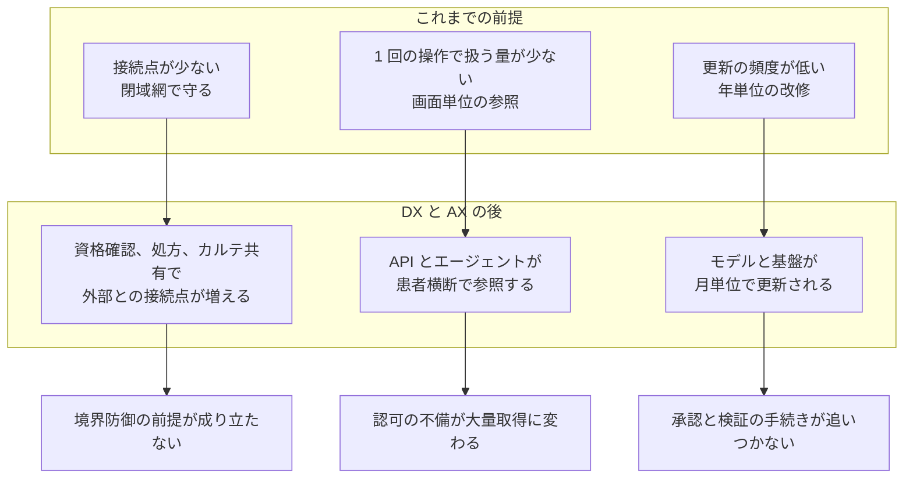

# 🔄 医療 DX と AX

医療 DX は、閉域網を前提に設計されてきた医療情報システムに、外部との接続点を増やす。
AX は、その接続点を通る情報を機械が解釈し、動作の根拠にする。
どちらも新しい脅威を作り出すわけではなく、既存の前提が崩れる速度を上げる。

本セクションは、国が進める医療 DX の基盤と、医療への AI の組み込みを、防御側の視点で扱う。
あわせて、情報システム部門を通らずに現場が単独で進める導入を、別ページで扱う。

> [!NOTE]
> **表記ルール**：本ページでは、**事実**（一次情報で確認できる内容。出典を併記する）、**報道ベース**（報道のみで確認でき、当事者の公表資料では裏付けが取れていない内容）、**分析**（筆者の解釈）を書き分ける。
> 出典は、当事者の公表資料、行政文書、CVE、ベンダアドバイザリなどの一次情報を優先して示す。
> 制度と工程は改定が続く領域であり、時期や仕様は変わりうる。判断にあたっては出典先の最新の記載を確認してほしい。

---

## このセクションの構成

- [医療 DX：国の基盤と接続点](medical-dx.md)
- [地域医療情報連携ネットワーク](regional-networks.md)
- [AX：医療における AI のセキュリティ](ai-security.md)
- [現場主導の DX と AX](field-led.md)

## 二つの語の指す範囲

**医療 DX**：診療、調剤、請求、健診の各過程で生じる情報を、施設ごとの閉じた保管から、全国規模で共有し活用する仕組みへ移す取り組みを指す。

**AX**：AI トランスフォーメーション。ここでは、生成 AI と機械学習を、診療、事務、研究開発、医療機器の各過程に組み込むことを指す。

**事実**：医療 DX 推進本部は 2023 年 6 月 2 日に「医療 DX の推進に関する工程表」を決定し、全国医療情報プラットフォームの創設、電子カルテ情報の標準化、診療報酬改定 DX の三つを重点施策として挙げている（[内閣官房 医療 DX 推進本部](https://www.cas.go.jp/jp/seisaku/iryou_dx_suishin/index.html)）。

---

## 前提の何が変わるか

医療のセキュリティは、[トップページ](../../../README.md)に挙げた六つの制約の上に成り立っている。
DX と AX は、そのうち三つの前提を直接動かす。

**接続点が増える**：オンライン資格確認、電子処方箋、電子カルテ情報共有サービスは、いずれも医療機関の外にある共通基盤と通信する。
閉域網の内側だけを守る設計では、これらの経路を扱えない。

**参照の単位が変わる**：標準化された API を通じた参照は、画面を一枚ずつ開く操作とは量が違う。
認可の設計を誤ったとき、漏えいするのは 1 件ではなく、条件に合致する全件になる。

**更新の速度が合わない**：AI を組み込んだ医療機器では、モデルの更新そのものが薬事手続きの対象になる。
一方で、モデルと基盤の側は月単位で変わる。
この差は、更新できないまま使い続ける期間として現れる。

---

## 共通して効く三つの確認

DX の基盤と AI の導入は、扱う技術が違っても、確認する内容は重なる。

| 確認 | 医療 DX での現れ方 | AX での現れ方 |
|---|---|---|
| 接続点の棚卸し | 資格確認端末、電子処方箋、カルテ共有の各経路がどこにつながるか | どのサービスに、どの経路で、どの情報が渡るか |
| 認可の粒度 | 標準 API で誰がどの範囲の患者情報を取得できるか | エージェントが行使できる権限の範囲 |
| 証跡の保存 | 共通基盤への照会と、その結果の参照が記録されるか | 入力、出力、参照した記録が事後に追えるか |

**分析**：どちらも、新しい技術に固有の対策を足す前に、既存の資産管理とアクセス制御が機能しているかで結果が変わる。
接続点を描けない組織は、接続点が増えたときに影響範囲を見積もれない。
この三つの確認は、導入が正規の経路を通った場合に成立する。
現場が単独で導入した仕組みでは、確認の前提となる台帳と設定そのものが存在しない。
その形は [現場主導の DX と AX](field-led.md) で扱う。

---

## 関連ページ

- [クラウド事業者と医療](../cloud/)：標準型電子カルテのクラウド化と、責任分界
- [国内のガイドラインと法規制](../../guidelines/japan.md)：医療情報ガイドライン、個人情報保護法、次世代医療基盤法
- [医療系 Web アプリケーションのセキュリティ](../web-security/)：患者向けサービスの認可
- [医療機器のセキュリティ](../medical-devices/)：プログラム医療機器と市販後対応

---

[トップへ](../../../README.md)
