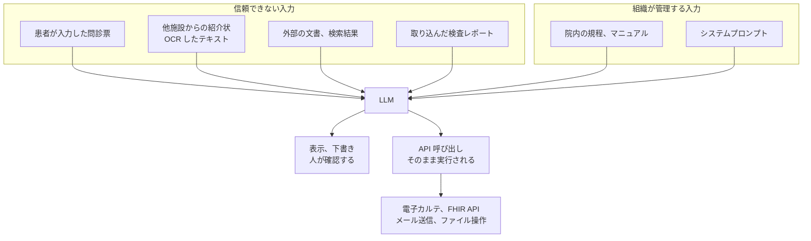

# 🤖 AX：医療における AI のセキュリティ

医療での AI 利用は、事務作業の支援から診療判断の補助、プログラム医療機器まで幅がある。
守り方は、どこに置くかではなく、出力が何に使われるかで決まる。
本ページは、導入形態ごとに脅威を整理し、検知と緩和策を対にして示す。

> [!NOTE]
> **表記ルール**：本ページでは、**事実**（一次情報で確認できる内容。出典を併記する）、**報道ベース**（報道のみで確認でき、当事者の公表資料では裏付けが取れていない内容）、**分析**（筆者の解釈）を書き分ける。
> 出典は、当事者の公表資料、行政文書、CVE、ベンダアドバイザリなどの一次情報を優先して示す。

---

## 導入形態で、問われるものが変わる

| 形態 | 例 | 主に問われるもの |
|---|---|---|
| 事務作業の支援 | 退院時サマリーの下書き、文書の要約、コード変換 | 入力した情報の扱い、出力の誤りが記録に残ること |
| 診療判断の補助 | 鑑別の候補提示、画像所見の下書き | 出力の完全性、責任の所在、記録の追跡 |
| 患者向けの応答 | 問診、受診案内、服薬の説明 | 外部からの入力による誘導、誤情報の提供 |
| 業務システムへの接続 | 電子カルテや FHIR API を操作するエージェント | 権限の範囲、横断参照、操作の証跡 |
| プログラム医療機器 | AI を用いた画像診断支援 | 薬事上の承認、更新手続き、市販後の性能監視 |

**分析**：上の四つは情報セキュリティの問題として扱えるが、最後の一つは薬事の枠組みが先に来る。
同じ技術でも、医療機器に該当するかどうかで、更新の可否と手続きが変わる。

---

## 信頼境界の引き方

生成 AI を組み込んだ処理では、入力の出所ごとに信頼度が異なる。
医療では、外部から届く文書がそのまま入力になる場面が多い。

**分析**：`O2` の経路がある構成では、信頼できない入力が、そのまま操作の指示になりうる。
医療で問題になるのは、この入力の多くが業務要件そのものだという点である。
紹介状を読み取る機能を削れば、機能自体が成立しない。
このため、入力を検査して防ぐ設計ではなく、実行できる操作の側を制限する設計が必要になる。

---

## 脅威と、対になる手当

### 間接プロンプトインジェクション

外部から届く文書に、モデルへの指示として解釈される文字列が含まれている場合、モデルの動作がその指示に従うことがある。
紹介状、問診票、外部の検査レポート、ウェブ検索の結果が経路になる。

**抑え方**：外部由来のテキストを、指示ではなくデータとして扱う構造にする。
モデルが呼び出せる操作を、読み取り専用に限る、または人の承認を挟む形にする。
出力をそのまま別の処理へ渡さず、想定した形式に合致するかを検証してから使う。

**検知**：入力に含まれる指示様の文字列と、モデルが実際に呼び出した操作の対応を記録する。
承認なしに実行された操作がないかを、事後に確認できる状態にしておく。

**分析**：入力側のフィルタは、表現を変えられると通る。
検知の対象を入力の文言に置くより、実行された操作の側に置くほうが、確認できる範囲が安定する。

### 業務システムに接続したエージェント

電子カルテや FHIR API を操作するエージェントは、利用者に代わって権限を行使する。
権限が利用者の職務範囲を超えていると、認可の不備が患者横断の参照に直結する。

**抑え方**：エージェントに与える権限を、利用者本人の権限を超えない範囲に限る。
参照できる患者の範囲、1 回の呼び出しで取得できる件数、書き込み操作の可否を、それぞれ明示的に制限する。
書き込みと外部送信は、人の承認を必須にする。

**検知**：エージェント経由の呼び出しを、利用者の直接操作と区別して記録する。
件数の上限に達した呼び出しと、通常の診療で起こらない参照の組み合わせを通知対象にする。

### 入力した情報の残り方

医療情報を入力する場合、モデルの学習に使われるか、どこで推論が行われるか、入出力のログがどこに残るかが論点になる。

**抑え方**：サービスごとに、学習利用の可否、推論を行うリージョン、ログの保存先と保存期間を確認する。
既定値が組織の要件と合わない場合は、設定で変更できるかを確認し、変更できない場合は入力する情報の範囲を絞る。
クラウド事業者ごとの確認点は [クラウド事業者と医療](../cloud/) に整理した。

**検知**：どの利用者がどのサービスに何を送信したかを、ネットワーク側またはアプリケーション側で記録する。
記録がない状態では、事後に漏えいの範囲を確定できない。

### 学習データとモデルの完全性

学習データへの混入や、公開されたモデルの差し替えは、出力の傾向を変える。
出力が診療判断に入る場合、これは情報漏えいではなく患者安全の問題になる。

**抑え方**：モデルとデータセットの取得元を固定し、取得したものの同一性を検証する。
外部の重みを取り込む場合、取得経路と版を記録に残す。
運用中は、既知の入力に対する出力を定期的に確認し、変化を検出できるようにする。

**検知**：性能指標の変化を、モデルの更新と基盤の更新のどちらに由来するか切り分けられる形で記録する。

### 依存関係とサプライチェーン

モデル、推論基盤、埋め込みの生成、外部ツールを呼び出す仕組みは、いずれも第三者の実装に依存する。
[製薬企業のセキュリティ](../../reference/pharma/supply-chain.md) で扱う供給網の問題と同じ構造が、ソフトウェアの側に現れる。

**抑え方**：構成要素を一覧として管理し、脆弱性情報を追える状態にする。
外部ツールを呼び出す仕組みでは、呼び出し先を許可リストで限定する。

### 資源の消費

長い入力や繰り返しの呼び出しは、費用と応答時間の両方に効く。
診療時間中に応答が返らない状態は、可用性の問題になる。

**抑え方**：利用者ごと、処理ごとの上限を設ける。
上限に達したときに診療が止まらないよう、AI を使わない手順を用意しておく。

---

## OWASP Top 10 for LLM Applications との対応

**事実**：OWASP の Gen AI Security Project は、2025 年版の Top 10 として、プロンプトインジェクション、機微情報の開示、サプライチェーン、データとモデルの毒入れ、出力の不適切な取扱い、過剰なエージェンシー、システムプロンプトの漏えい、ベクタと埋め込みの弱点、誤情報、無制限の消費を挙げている（[OWASP Top 10 for LLM Applications 2025](https://genai.owasp.org/resource/owasp-top-10-for-llm-applications-2025/)）。

| OWASP の項目 | 医療での現れ方 |
|---|---|
| LLM01 プロンプトインジェクション | 紹介状や問診票の記載が、モデルへの指示として解釈される |
| LLM02 機微情報の開示 | 応答や外部サービスのログに、患者の情報が残る |
| LLM03 サプライチェーン | 取り込んだ外部のモデルやツールが差し替えられる |
| LLM04 データとモデルの毒入れ | 学習データの混入で、特定の所見の見落としが増える |
| LLM05 出力の不適切な取扱い | 生成された文字列が、検証されずにクエリや文書に組み込まれる |
| LLM06 過剰なエージェンシー | エージェントが、利用者の職務範囲を超えて患者情報を参照する |
| LLM07 システムプロンプトの漏えい | 内部の規程や接続先の情報が、応答から推測される |
| LLM08 ベクタと埋め込みの弱点 | 検索対象の索引に、参照権限のない患者情報が混ざる |
| LLM09 誤情報 | 生成された下書きの誤りが、確認されずに診療録に残る |
| LLM10 無制限の消費 | 診療時間中に応答が返らず、業務が滞る |

---

## AI を組み込んだ医療機器

**事実**：市販後の改良が想定される医療機器については、承認された事項の一部の変更に係る計画を、あらかじめ確認しておく制度がある。
変更計画確認手続（IDATEN）と呼ばれ、2020 年 9 月 1 日に導入された。
根拠は医薬品医療機器等法第 23 条の 2 の 10 の 2 であり、確認を受けた計画の範囲内であれば、一部変更承認申請ではなく届出で変更できる（[PMDA プログラム医療機器の薬事開発, 承認申請に関する手引き](https://www.pmda.go.jp/files/000274829.pdf)）。

**分析**：この制度がある前提でも、モデルの更新は薬事の手続きを伴う。
一般のソフトウェアのように、脆弱性が公表された日に更新を適用するという運用は成り立たない。
医療機器メーカーに求められるのは、市販後のセキュリティ対応（脆弱性の監視、報告、更新の提供）と、変更計画の設計を両立させることになる。
規制側の枠組みは [ガイドラインと法規制](../../guidelines/) と [医療機器のセキュリティ](../medical-devices/) に整理した。

---

## 攻撃側の AI 能力向上に対する政府の対応

ここまでは AI を導入する側のリスクを扱った。
攻撃側が AI を使う場合の脅威に対しては、2026 年 5 月に政府横断の要請が出ている。

**事実**：2026 年 5 月 18 日、内閣官房国家サイバー統括室、内閣府政策統括官（経済安全保障担当）、警察庁、金融庁、総務省、厚生労働省、経済産業省、国土交通省、防衛省の連名で、「AI 性能の高度化を踏まえたサイバーセキュリティ対策の強化について（重要インフラ事業者等に対する注意喚起）」が発出された。
2026 年 4 月 7 日に Anthropic が公表した Claude Mythos Preview をはじめとするフロンティア AI モデルによって、脆弱性の発見と修正に関する性能が急速に向上したことを契機としている（[注意喚起 PDF](https://www.mhlw.go.jp/content/10808000/001701517.pdf)）。

要請は三つの柱で構成される。

| 柱 | 求められている内容 |
|---|---|
| 経営層のリーダーシップ | 対策を投資と位置づけ、実施方針、予算と人材、実施状況の確認までを経営層の責任で回す |
| 基本的な対策の確実な実施と、更なる強化 | 資産管理、リスクアセスメント、脆弱性管理、アカウント管理と認証とアクセス制御、バックアップ、監視と分析、事業継続計画、インシデント対応と復旧、サプライチェーンへの対応。加えてゼロトラストへの移行、脅威ハンティング、高性能 AI の防御側での活用、CYDER や IPA 中核人材育成プログラムによる人材育成 |
| 高速化する脆弱性の発見, 修正への対応 | 既知の未処理脆弱性のリスクを改めて検証し、資産管理を前提に脆弱性情報を収集し、影響度, 悪用リスク, 事業継続への影響を踏まえて優先順位を付ける。判断のプロセスと体制をあらかじめ構築する |

実施状況は、関係省庁と関係機関を通じて機動的に確認するとされている。
根拠として、英国 AISI による Claude Mythos Preview の評価と、米国 CISA の重要インフラのレジリエンス強化に関するガイダンス（CI Fortify）が挙げられ、基本的な対策、隔離、復旧の重要性が示されている。

**事実**：政府全体の対策パッケージは **Project YATA-Shield** として取りまとめられた。
YATA は Yielding Advanced Threat Awareness with AI の頭文字であり、「正確に写す」八咫鏡になぞらえて、AI 性能の高度化に伴う脅威を正しく認識し、防御し、対応するという趣旨が示されている。
パッケージは、重要インフラ事業者等と政府機関等への対応（注意喚起、金融分野での先行的な取組と他分野への展開、人材育成支援、政府機関等の情報システムにおける対応）と、脆弱性の発見と修正への対応（外国政府機関やビッグテック等との連携、ソフトウェアベンダへの注意喚起、AISI による技術支援、技術開発の推進、高性能 AI を活用したサイバー対処能力強化）で構成される（[厚生労働省 資料 1（PDF）](https://www.mhlw.go.jp/content/10808000/001703604.pdf)、出典は内閣官房国家サイバー統括室作成資料）。

同資料には、提供側の対応として、Anthropic が Mythos へのアクセスをビッグテックや重要インフラ等に限定していること、OpenAI が GPT-5.5-Cyber へのアクセスを一部の認証者に限定して付与していることが記載されている。

**事実**：厚生労働省は 2026 年 5 月 27 日に、「高性能 AI の悪用リスクを踏まえたサイバーセキュリティ対策の強化について（医療機関等への注意喚起）」を医療機関等に向けて発出している（[厚生労働省 医療分野のサイバーセキュリティ対策について](https://www.mhlw.go.jp/stf/seisakunitsuite/bunya/kenkou_iryou/iryou/johoka/cyber-security.html)）。

**分析**：医療にとって効いてくるのは三つ目の柱である。
脆弱性の発見から悪用までの時間が短くなる前提に立つと、パッチ適用に停止調整と動作検証を要する医療情報システムと医療機器は、その時間差の影響を受けやすい側にいる。
求められている優先順位付けは、何がどこで動いているかを把握していなければ着手できない。
資産管理は、この要請の中で最初に効く作業になる。
アクセス制限は提供側の方針であり、時期によって変わりうる。
守りの前提として数えるのではなく、[検証と診断](../../practice/pentest/)や資産管理の側で備える必要がある。

---

## 参照される規範

**事実**：総務省と経済産業省の「AI 事業者ガイドライン」は、2024 年 4 月に第 1.0 版が公表され、2025 年 3 月 28 日に第 1.1 版、2026 年 3 月 31 日に第 1.2 版が公表された。
第 1.2 版では、AI エージェントとフィジカル AI に関する定義、便益、リスクとその対策が追記されている（[AI 事業者ガイドライン 第 1.2 版](https://www.meti.go.jp/shingikai/mono_info_service/ai_shakai_jisso/pdf/20260331_1.pdf)）。

**事実**：厚生労働省の「医療デジタルデータの AI 研究開発等への利活用に係るガイドライン」は、医療機関、学術研究機関、民間企業が共同研究を起点に医療情報を利活用する場合の法的根拠と、仮名加工情報の作成手順を整理している（[ガイドライン本文 PDF](https://www.mhlw.go.jp/content/001310044.pdf)）。

**事実**：AI セーフティ・インスティテュート（AISI）のヘルスケアサブワーキンググループは、2026 年 4 月に「ヘルスケア領域における AI セーフティ評価観点ガイド（第 1.0 版）」を公表した。
AISI が定めた AI セーフティ評価観点ガイドを土台に、AI ライフサイクルの 5 段階と 10 項目の評価観点を、ヘルスケア領域の機微性とリスクに当てはめた実務者向けの文書である。
日本デジタルヘルス・アライアンス（JaDHA）をはじめとする事業者、団体が策定に参加している（[AISI 公表ページ](https://aisi.go.jp/output/output_information/260402/)、[IPA プレス発表](https://www.ipa.go.jp/pressrelease/2026/press20260403.html)）。

**事実**：国際的には、世界保健機関（WHO）が 2024 年 1 月に、医療で用いる大規模マルチモーダルモデル（LMM）に関する指針を公表している（[Ethics and governance of artificial intelligence for health: Guidance on large multi-modal models](https://www.who.int/publications/i/item/9789240084759)）。
EU では、AI 規則（Regulation (EU) 2024/1689）が、医療機器の安全構成要素として使われる AI を高リスクに位置づけ、MDR, IVDR の適合性評価と接続する構造をとる。

**分析**：規範は「守るべき要求」と「評価の観点」に分かれる。
薬機法や個人情報保護法は前者であり、AISI のガイドや WHO の指針は後者にあたる。
後者は罰則を伴わないが、導入審査で何を確認したかを説明する材料になるため、[導入時に確認する項目](#導入時に確認する項目)の裏づけとして使える。

**分析**：医療で AI を扱うとき、参照する規範は一つではない。
情報の取扱いは個人情報保護法と医療情報ガイドライン、研究開発への利用は次世代医療基盤法と上記のガイドライン、機器に該当する場合は薬機法が、それぞれ別に掛かる。
どの規範が掛かるかは技術ではなく用途で決まるため、導入の検討は用途の確定から始める。

---

## 導入時に確認する項目

| 区分 | 確認する内容 |
|---|---|
| 用途 | 出力が何に使われるか。表示のみか、記録に残るか、操作を起こすか |
| 該当性 | 医療機器に該当するか。該当する場合、承認と変更計画の状況 |
| 入力 | どの情報を入力するか。外部由来の文書が入力に含まれるか |
| 権限 | エージェントが行使できる操作と、参照できる患者の範囲 |
| 承認 | 書き込みと外部送信に、人の承認を挟んでいるか |
| 保存 | 入力、出力、操作の記録がどこに、何日残るか |
| 学習 | 入力が学習に使われるか。設定で変更できるか |
| 所在 | 推論が行われるリージョンと、ログの保存先の国 |
| 縮退 | AI が使えないときの業務手順 |
| 監視 | 出力の品質と、既知の入力に対する応答の変化を追う仕組み |

> [!WARNING]
> 生成された文書を診療録に残す運用では、誤りの訂正手順を先に決めておく必要がある。
> 記録が残ったあとに誤りが見つかった場合、訂正の履歴そのものが診療の証跡になる。

---

## 参照先

| 名称 | 発行 |
|---|---|
| [AI 事業者ガイドライン 第 1.2 版](https://www.meti.go.jp/shingikai/mono_info_service/ai_shakai_jisso/pdf/20260331_1.pdf)（[概要](https://www.meti.go.jp/shingikai/mono_info_service/ai_shakai_jisso/pdf/20260331_2.pdf)） | 総務省, 経済産業省 |
| [医療デジタルデータの AI 研究開発等への利活用に係るガイドライン](https://www.mhlw.go.jp/content/001310044.pdf) | 厚生労働省 |
| [プログラム医療機器の薬事開発, 承認申請に関する手引き](https://www.pmda.go.jp/files/000274829.pdf) | 医薬品医療機器総合機構（PMDA） |
| [次世代医療基盤法](https://www8.cao.go.jp/iryou/index.html) | 内閣府 |
| [ヘルスケア領域における AI セーフティ評価観点ガイド 第 1.0 版](https://aisi.go.jp/output/output_information/260402/) | AI セーフティ・インスティテュート（AISI） ヘルスケアサブワーキンググループ |
| [OWASP Top 10 for LLM Applications 2025](https://genai.owasp.org/resource/owasp-top-10-for-llm-applications-2025/) | OWASP Gen AI Security Project |
| [Ethics and governance of artificial intelligence for health: Guidance on large multi-modal models](https://www.who.int/publications/i/item/9789240084759) | 世界保健機関（WHO） |
| [AI Risk Management Framework（AI RMF 1.0）](https://www.nist.gov/itl/ai-risk-management-framework) | 米国国立標準技術研究所（NIST） |
| [Regulation (EU) 2024/1689（AI 規則）](https://eur-lex.europa.eu/eli/reg/2024/1689/oj) | 欧州連合 |
| [AI 性能の高度化を踏まえたサイバーセキュリティ対策の強化について（重要インフラ事業者等に対する注意喚起、2026 年 5 月 18 日）](https://www.mhlw.go.jp/content/10808000/001701517.pdf) | 内閣官房国家サイバー統括室ほか 8 機関 |
| [対策パッケージ（Project YATA-Shield）及び関係機関への注意喚起](https://www.mhlw.go.jp/content/10808000/001703604.pdf) | 厚生労働省（内閣官房国家サイバー統括室作成資料より） |

---

[医療 DX と AX へ戻る](README.md) ／ [トップへ](../../../README.md)
