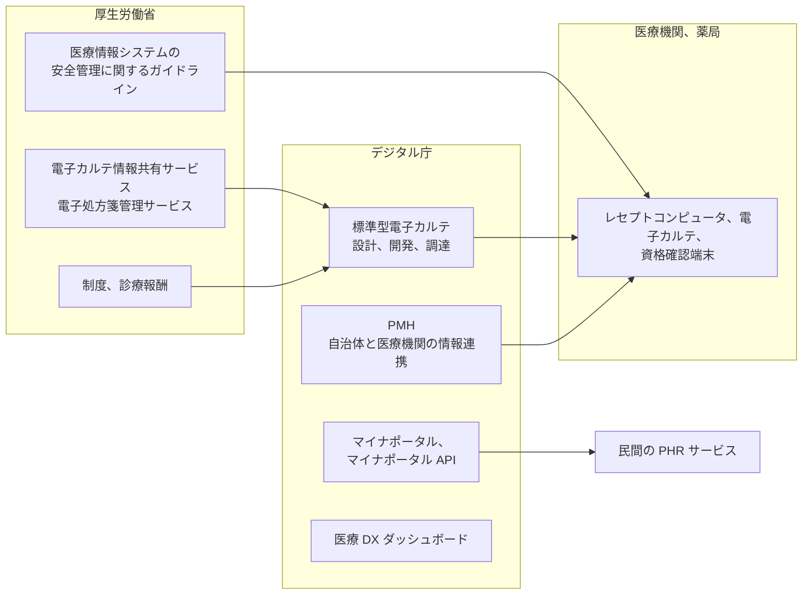
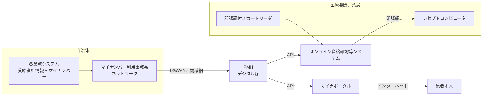

# 🏢 デジタル庁が担う医療 DX

医療 DX の制度と要件は厚生労働省が定めるが、基盤そのものの開発と調達はデジタル庁が担う範囲が広がっている。
本ページは、デジタル庁が主体となっている取り組みを整理し、そこから医療機関側の確認事項として何が導けるかを示す。

> [!NOTE]
> **表記ルール**：本ページでは、**事実**（一次情報で確認できる内容。出典を併記する）、**報道ベース**（報道のみで確認でき、当事者の公表資料では裏付けが取れていない内容）、**分析**（筆者の解釈）を書き分ける。
> 出典は、当事者の公表資料、行政文書、CVE、ベンダアドバイザリなどの一次情報を優先して示す。
> 事業と工程は改定が続いている。時期と数値は、出典先の最新の記載で確認してほしい。

---

## 厚生労働省との役割分担

**事実**：デジタル庁は健康・医療・介護を準公共分野と位置づけ、Public Medical Hub（PMH）の構築、標準型電子カルテの開発、病院情報システムの刷新を進めている（[デジタル庁 健康・医療・介護](https://www.digital.go.jp/policies/health)）。

**事実**：病院情報システム等の刷新に向けた協議会は、デジタル庁と厚生労働省の連名で開催され、事務局はデジタル庁の健康・医療・介護班が務める（[病院情報システム等の刷新に向けた協議会の開催について](https://www.digital.go.jp/assets/contents/node/information/field_ref_resources/493e627d-74db-4bb3-a5d1-38442d6473e7/eb245fa8/20250512_policies_health_outline_01.pdf)、令和 7 年 5 月 7 日）。

**分析**：この分担は、医療機関が仕様を確認しに行く先を二つに分ける。
運用ルールと安全管理の要求は厚生労働省の文書に、システムの構成と調達段階のセキュリティ要件はデジタル庁の公開資料に載る。
接続先の基盤が何を守ることになっているかを調べるとき、読む対象は多くの場合デジタル庁の調達仕様書である。

---

## 医療 DX ダッシュボード：施策の進捗を公開の数値で追う

**事実**：デジタル庁は厚生労働省とともに [医療 DX ダッシュボード](https://www.digital.go.jp/resources/govdashboard/healthcare-dx) を公開している。
掲載されているのは、マイナ保険証とオンライン資格確認、電子処方箋と電子処方箋管理サービス、マイナポータルと PHR、自治体が実施する健康・医療・介護分野の事業のデジタル化（PMH）、および主要な施策の状況をまとめた画面の五つである。
数値の出所は厚生労働省とデジタル庁が公開しているデータであり、構造化データが Excel と CSV の形式で提供される（2026 年 8 月 14 日更新）。
電子カルテ、自治体検診、予防接種、介護情報基盤は今後掲載予定とされている。

**分析**：このダッシュボードは、防御側にとっては攻撃面の広がりを時系列で確認できる公開の一次情報になる。
資格確認と電子処方箋の利用が増えるほど、共通基盤が停止したときに紙運用へ戻す作業量が増える。
縮退運用の手順を年に一度見直すとき、自施設の実績値と全国の普及状況を並べておくと、どの業務が停止の影響を受けるかを見積もりやすい（[インシデント対応と事業継続](../../response/)）。

---

## PMH：自治体と医療機関を結ぶ新しい経路

**事実**：PMH は、自治体、医療機関、薬局の間で必要な情報を交換する仕組みとして、デジタル庁が 2023 年度に開発した。
対象は医療費助成、予防接種、母子保健であり、介護保険などへの拡大が想定されている。
参加自治体は 2024 年度末時点の 183 自治体から 2026 年 6 月 7 日時点で 608 自治体へ、PMH が利用可能な医療機関と薬局は 2025 年 4 月の約 2.5 万施設から 2026 年 3 月には約 6.9 万施設へ拡大している（[デジタル庁 Public Medical Hub](https://www.digital.go.jp/policies/health/public-medical-hub)）。

**事実**：医療費助成では、自治体の各業務システムが受給者証の情報とマイナンバーを PMH に登録し、PMH が資格情報をオンライン資格確認等システム経由で医療機関のレセプトコンピュータに渡す。
自治体側で必要になる対応は、業務システムから PMH 連携用データを出力する改修と、既存のマイナンバー利用事務系ネットワークから LGWAN または他の閉域網を経由して PMH へ接続するためのネットワーク機器の設定変更である（[PMH の事業概要](https://www.digital.go.jp/assets/contents/node/basic_page/field_ref_resources/9ad8c7e9-828d-40e9-833b-f9af1cf2de6a/5c06c6f9/202312226_policies_health_outline_03.pdf)）。

**事実**：同資料は、PMH への参加にあたって当該事務を個人番号利用事務とする必要があること、自治体とデジタル庁が情報連携業務に関する委託契約を締結することを示している。
デジタル庁は、自治体がプライバシー影響評価を実施するための資料と、自治体向けおよび医療機関、薬局向けの利用規約を公開している。

**分析**：医療機関から見ると、PMH はレセプトコンピュータに届く資格情報の発信元を広げる。
これまで資格情報の出所は保険者と審査支払機関だったが、PMH の導入後は、患者が居住する範囲の自治体が発信元に加わる。
医療機関側の改修は資格情報を読み込んで自動反映させるところまでであり、受付の職員が内容を突き合わせる手順は改修の対象に含まれていない。
確認するのは、自動反映された資格情報が誤っていた場合に、どの段階でそれが判明し、誰が自治体に照会するかである。

**分析**：PMH は、自治体で個人番号を扱うネットワークを起点にして、医療機関側のオンライン資格確認の閉域網まで情報を通す。
医療機関から見ると、接続点の数は増えない。
変わるのは、その一つの接続点の向こう側にいる発信者の数である。
一つの経路を信頼して受け取ってきた情報の作成元が、保険者と審査支払機関から全国の自治体まで広がるため、確認の対象は経路の可否ではなく、受け取った情報の完全性をどこで担保するかに移る。
自治体側の業務システムで誤った資格情報が登録された場合、医療機関の側にはそれを検出する材料がない。

---

## 標準型電子カルテ：デジタル庁が開発主体になる SaaS

**事実**：標準型電子カルテ α 版は、令和 5 年度補正予算 12.9 億円で開発された（[標準型電子カルテ α 版の開発](https://www.digital.go.jp/assets/contents/node/basic_page/field_ref_resources/9ad8c7e9-828d-40e9-833b-f9af1cf2de6a/d4920dba/202312226_policies_health_outline_04.pdf)）。
デジタル庁はプロダクトオーナーとして、医療情報システムを提供する民間事業者が活用できるモジュールと機能の整備を進めるため、プロダクトワーキンググループの構成員を公募している。

**事実**：導入版について、デジタル庁は令和 8 年秋ごろからモデル事業を開始し、令和 8 年度末ごろの本格リリースを目指すとしている。
導入版に実装されるのは、所見の入力、電子カルテ情報共有サービスへのデータ連携と参照、電子処方箋管理サービスへの院外処方箋の連携と調剤情報の取得、検体検査の結果取得などの最小限の機能である（[令和 8 年度 標準型電子カルテ導入版の設計・開発業務 調達仕様書](https://www.digital.go.jp/assets/contents/node/basic_page/field_ref_resources/24d6cfea-9b50-4510-9365-64b29f9d5796/8edccaa3/20260306_procurement_public_notice_outline_02.pdf)、2026 年 2 月）。

**事実**：同仕様書は、本システムを SaaS 型のクラウドサービスとして提供し、オンライン資格確認等システム、電子カルテ情報共有サービス、電子処方箋管理サービス、各種院内システム、および民間事業者が提供するシステム群と接続するものと定めている。
あわせて、ガバメントクラウド上での開発と実装を前提とした検討を行うとしている。

**分析**：この構成では、医療機関が自施設で管理する範囲が縮む。
サーバの設置、OS の更新、バックアップの取得は提供側に移り、医療機関に残るのは端末、院内ネットワーク、利用者のアカウント管理になる。
残った範囲は狭いが、侵入経路として使われてきたのはこの範囲である。
責任分界の整理は [クラウド事業者と医療](../cloud/) で扱う項目と重なる。

---

## 調達仕様書から読めるセキュリティ要件

**事実**：標準型電子カルテ導入版の調達仕様書は、受注者に対して次を求めている。

- 「政府機関等のサイバーセキュリティ対策のための統一基準」（令和 7 年 6 月 27 日 サイバーセキュリティ戦略本部決定）の遵守
- 開発環境、本番環境、検証環境を分離し、各環境で取り扱う情報の機微性に応じたアクセス制御を実施すること
- 脆弱性が生じないよう留意して設計と開発を行い、稼働前および定期的な検査で確認すること。脆弱性検査は「政府情報システムにおける脆弱性診断ガイドライン」の実施基準を満たすこと
- 認証管理、アクセス制御、暗号化、資産管理と脆弱性管理、Web アプリケーションの脆弱性、ログ管理、外部委託の管理の七つについて、政府情報システムに含有されやすい問題点として列挙された各項目に漏れなく対応すること
- 本システムで用いるクラウドサービスは、原則として ISMAP クラウドサービスリストまたは ISMAP-LIU クラウドサービスリストに登録されているものを選定すること
- 情報資産を管理するデータセンタの設置場所は国内を基本とし、障害発生時に縮退運転を行う際にも情報資産が国外のデータセンタに移管されないこと。国外からの情報資産へのアクセスも国外への持ち出しに該当する
- 使用する機器やソフトウェアについて、サプライチェーンリスクの観点から内閣サイバーセキュリティセンターの助言を求めるため、機器等リストを提出すること

**分析**：ここに並ぶ項目は、医療機関が電子カルテのベンダに個別に確認してきた内容とほぼ重なる。
違うのは、要求の水準が調達文書として公開され、施設ごとの交渉力に依存しなくなる点である。
医療機関の側では、ベンダ選定時のセキュリティ確認の一部を、この仕様書を根拠として省ける可能性がある。

**分析**：ただし公開されているのは要求であって、実装や検査結果ではない。
脆弱性検査の実施結果は脆弱性検査結果報告書として納入される成果物であり、医療機関に届くものではない。
標準型電子カルテを導入する施設が確認できるのは、要求が仕様書に書かれていることまでである。
実装が要求を満たしているかは、運用開始後に事業者から提示される資料か、事故が起きたときの調査で初めて分かる。
この差は、SaaS を利用する側に共通する制約であり、標準型電子カルテに固有の問題ではない。

---

## 病院情報システム等の刷新に向けた協議会

**事実**：デジタル庁と厚生労働省は、遅くとも令和 12 年には概ねすべての医療機関で電子カルテを導入するという工程表の目標に向けて、現在のオンプレミス型のシステムを刷新し、電子カルテ、レセプトコンピュータ、部門システムを一体的にクラウド型システムへ移行する方針を検討している。
令和 7 年度中に国が標準仕様を取りまとめ、令和 8 年度から事業者が開発に着手する想定である。
標準仕様の対象として想定されているのは 100 床から 200 床程度の中小病院であり、薬剤、放射線、臨床検査、生理、手術、内視鏡、給食などの部門システムを含む（[病院情報システム等の刷新に向けた協議会の開催について](https://www.digital.go.jp/assets/contents/node/information/field_ref_resources/493e627d-74db-4bb3-a5d1-38442d6473e7/eb245fa8/20250512_policies_health_outline_01.pdf)）。

**事実**：協議会では、電子カルテと医事会計の主要機能を検討する分科会 A と、主要部門システムとの連携を検討する分科会 B が優先して立ち上げられ、要件定義に向けた協議が始まっている。
令和 7 年 9 月 12 日には、生成 AI などの先進技術を活用して医療機関の業務効率化に資するサービス群の連携を検討する分科会 C の設置に向けて、構成員の募集要件が追加された。
分科会 C が対象とするのは、AI 活用型の文書作成支援と、予約や問診などの患者コミュニケーションに資するサービス群である（[分科会 C 業務効率化群連携検討の募集について](https://www.digital.go.jp/assets/contents/node/information/field_ref_resources/9a4ec0da-a27b-4a41-ac9d-026aa87fdf59/a1ea69c5/20250918_policies_health_news_outline_01.pdf)）。

**分析**：分科会 C の存在は、AI の医療への組み込みが、施設ごとの個別導入から標準仕様上の接続口へ移ることを意味する。
現状では、文書作成支援の導入は情報システム部門を通らずに現場で始まる例があり、その形は [現場主導の DX と AX](field-led.md) で扱った。
接続口が標準仕様に入ると、導入の可否ではなく、どのサービスをその口につなぐかが判断の対象になる。
電子カルテの記載内容が外部のサービスへ渡る経路が既定の機能として存在する状態では、確認するのは「AI を使っているか」ではなく「どの範囲の記載が、どの事業者に、どの根拠で渡っているか」になる（[AX：医療における AI のセキュリティ](ai-security.md)）。

**分析**：部門システムを一体で刷新する方針は、更新できないまま残る機器の問題にも影響する。
部門システムには、医療機器に付属する制御用の端末が接続されており、これらは薬事の手続きと保守契約の制約で更新が遅れやすい。
クラウド型の中核システムと、更新が止まった部門側の端末が同じ院内網に並ぶ期間が生じるかどうかは、標準仕様の移行方法によって決まる（[医療機器のセキュリティ](../medical-devices/)）。

---

## マイナポータル API：医療情報が民間サービスへ渡る経路

**事実**：デジタル庁はマイナポータル API を公開しており、そのうち医療保険情報取得 API を使うと、民間事業者のサービスが利用者本人の薬剤情報、診療情報、健診情報、医療費通知情報を取得できる（[医療保険情報取得 API](https://developers.digital.go.jp/documents/mynaportal-api/specification/medicalexaminfo/)）。
利用者はマイナンバーカードで認証し、マイナポータルで利用者登録と情報提供への同意を行う。
事業者は仕様書の取得申請と利用申請を行い、デジタル庁との事前打合せと審査を経て開発に着手する。
取得した医療保険情報（医療費通知情報を除く）を扱う事業者は、「PHR サービス提供者による健診等情報の取扱いに関する基本的指針」を遵守する必要がある。

**事実**：マイナポータル API には PMH 情報連携 API も含まれており、PMH に登録された情報を本人がマイナポータル経由で参照する経路が用意されている（[マイナポータル API 一覧](https://developers.digital.go.jp/documents/mynaportal-api/specification/)）。

**分析**：この経路を通った情報は、医療機関の管理下から離れる。
医療機関が自施設のシステムで制御できるのは、レセプトとして請求した内容までであり、そこから先の保管と利用は本人と事業者の間の関係になる。
医療機関の側で用意しておくのは、患者から「アプリに表示されている自分の薬の情報が実際と違う」と申し出があったときに、どこを起点に確認するかの手順である。
情報の流れは、自施設のレセプト、審査支払機関、マイナポータル、事業者のアプリの順であり、表示の誤りがどの段階で生じたかによって照会先が変わる。

---

## 防御側の確認事項

| 区分 | 確認する内容 |
|---|---|
| PMH の経路 | オンライン資格確認の経路を通って届く情報の作成元に、どの自治体が含まれるか |
| 資格情報の検証 | レセプトコンピュータに自動反映された医療費助成の資格情報が誤っていたとき、判明する段階と照会先 |
| 自治体との窓口 | PMH に関する問い合わせを、自施設からどの自治体のどの部署に出すか |
| 標準型電子カルテ | 導入を検討する場合、調達仕様書のセキュリティ要件のうち、事業者から実施状況の提示を求める項目 |
| 責任分界 | SaaS 化で提供側に移る範囲と、自施設に残る端末、ネットワーク、アカウント管理の範囲 |
| AI の接続口 | 標準仕様の業務効率化サービス群につなぐ事業者と、渡る記載の範囲、根拠 |
| PHR | 患者が民間アプリで見ている情報の誤りを申し出たときの確認手順 |
| 縮退 | ダッシュボードで追える施策のうち、停止したときに紙運用へ戻す作業が生じる業務 |

> [!TIP]
> 調達仕様書は、接続先の基盤に何が要求されているかを施設の側から確認できる数少ない公開文書である。
> ベンダへの確認事項を作るとき、独自に項目を起こす前に、同種のシステムの調達仕様書に並ぶ項目を出発点にすると、要求の水準を合わせやすい。

---

## 参照先

| 名称 | 発行 |
|---|---|
| [健康・医療・介護](https://www.digital.go.jp/policies/health) | デジタル庁 |
| [医療 DX に関するダッシュボード](https://www.digital.go.jp/resources/govdashboard/healthcare-dx) | デジタル庁 |
| [Public Medical Hub（PMH）](https://www.digital.go.jp/policies/health/public-medical-hub) | デジタル庁 |
| [令和 8 年度 標準型電子カルテ導入版の設計・開発業務](https://www.digital.go.jp/procurement/24d6cfea-9b50-4510-9365-64b29f9d5796) | デジタル庁 |
| [病院情報システム等の刷新に向けた協議会の開催について](https://www.digital.go.jp/assets/contents/node/information/field_ref_resources/493e627d-74db-4bb3-a5d1-38442d6473e7/eb245fa8/20250512_policies_health_outline_01.pdf) | デジタル庁、厚生労働省 |
| [マイナポータル API 仕様公開サイト](https://developers.digital.go.jp/documents/mynaportal-api/specification/) | デジタル庁 |
| [サイバーセキュリティ](https://www.digital.go.jp/policies/security) | デジタル庁 |
| [デジタル社会推進標準ガイドライン](https://www.digital.go.jp/resources/standard_guidelines) | デジタル庁 |
| [医療 DX 推進本部](https://www.cas.go.jp/jp/seisaku/iryou_dx_suishin/index.html) | 内閣官房 |
| [医療 DX について](https://www.mhlw.go.jp/stf/iryoudx.html) | 厚生労働省 |

---

[医療 DX と AX へ戻る](README.md) ／ [トップへ](../../../README.md)
