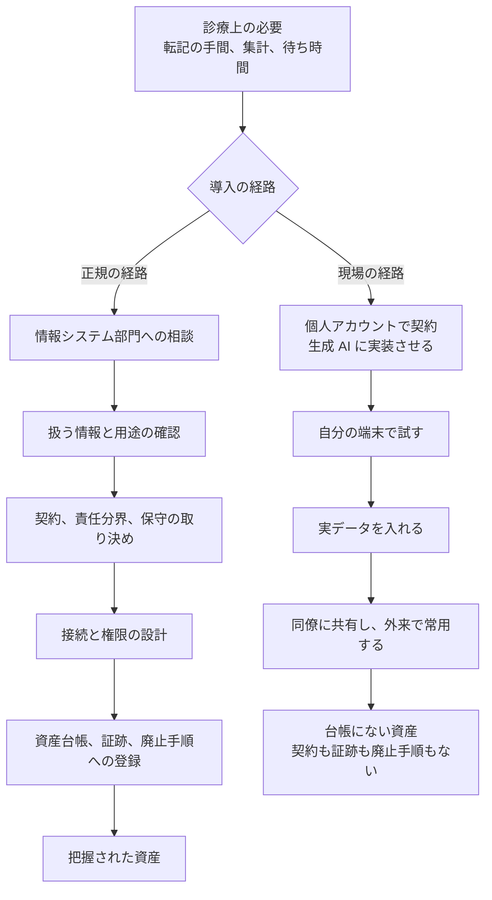
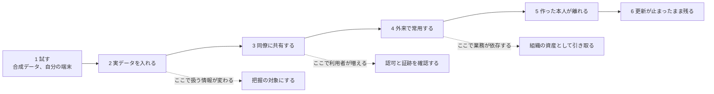

# 🧑‍⚕️ 現場主導の DX と AX

医療 DX と AX の導入は、情報システム部門を通らずに始まることがある。
診療科の医師が業務の不便を自分で解消し、研究室が解析基盤を自前で用意し、事務部門が無償の SaaS を使い始める。
本ページは、その形の導入で何が抜け落ち、どの順序で事故に至るかを機構ごとに整理する。
最後に、同じ構造が他業界でどう現れるかと、医療に固有の増幅要因を示す。

> [!NOTE]
> **表記ルール**：本ページでは、**事実**（一次情報で確認できる内容。出典を併記する）、**報道ベース**（報道のみで確認でき、当事者の公表資料では裏付けが取れていない内容）、**分析**（筆者の解釈）を書き分ける。
> 本ページの記述の多くは、公表資料から直接は確認できない運用上の型を扱うため、**分析**として示す。

---

## 現場が先に動く条件

現場主導の導入は、担当者の規律の問題として現れるが、成立させているのは組織側の三つの条件である。

**分析**：第一に、必要が先に生じる。
外来の待ち時間、紙からの転記、症例の集計は、日々の診療の中で毎回発生する。
第二に、正規の経路が診療の時間感覚と合わない。
要件定義、見積、契約、責任分界の確認、院内網への接続審査を順に通すと、着手までに月単位を要する。
第三に、作る側の障壁が下がった。
生成 AI に指示を出せば、画面と API を持つアプリケーションが数時間で動く。
専門の開発者を確保できないことが、これまでは事実上の抑止になっていた。

**分析**：二つの経路の違いは、技術の良し悪しではない。
右の経路には、動くものを作る工程しかなく、動いたあとに続く工程が存在しない。
事故は、作った時点ではなく、作ったものが業務に定着したあとに現れる。

> [!WARNING]
> 禁止の通達だけを出すと、導入は止まらずに見えなくなる。
> 必要が消えないまま報告の経路だけを塞ぐと、担当者は私物端末と個人アカウントへ移り、組織が把握できる範囲がさらに狭くなる。
> 統制の設計は、禁止ではなく、正規の経路を診療の時間感覚に近づける側で行う。

---

## 通らなかった工程は五つに集約される

現場主導の導入で抜けるものは、個々の技術ではなく、正規の経路にだけ含まれる工程である。

| 工程 | 正規の経路で担う役割 | 抜けた場合に現れること |
|---|---|---|
| 資産の把握 | 何がどこで動き、どの情報を持つかを台帳に載せる | 侵害時に影響範囲を確定できない。脆弱性の通知が届かない |
| 認可の設計 | 誰がどの範囲の患者情報に到達できるかをサーバ側で決める | 識別子の差し替えで他患者の情報が返る。全件が読める |
| 証跡の保存 | 参照、出力、変更を、事後に追える形で残す | 漏えいの有無と範囲を、痕跡から確定できない |
| 契約と責任分界 | 事業者と医療機関のどちらが何を守るかを文書で決める | 障害時と侵害時に、対応の主体が決まらない |
| 退出の手順 | 廃止、移行、担当者の異動時の引き継ぎを決める | 更新が止まったまま稼働し続ける。誰も止められない |

**分析**：この五つは、DX の基盤でも AI の導入でも同じ位置に現れる。
[医療 DX と AX の共通の確認](README.md#共通して効く三つの確認)で挙げた接続点、認可、証跡の三点に、契約と退出を加えたものが、現場主導の導入で最も抜けやすい。

---

## 事故に至る十の型

以下の十の型は、公表された個別事案の記録ではなく、成立する機構から整理した**分析**である。
各項目は、機構（なぜそうなるか）、現れ方、抑え方、検知の順に示す。
抑え方は、現場に規律を求める形ではなく、組織側が用意できる受け皿として書く。

### 1. 実データの複製が個人の管理下へ移る

**機構**：試作には実データが要る。
仮名化や合成データの用意には手間がかかり、試作の目的である速さと衝突する。
一方、電子カルテやレセコンからの CSV 出力は正規の機能であり、権限のある利用者が実行する限り、システムから見れば通常の操作にしか見えない。

**現れ方**：氏名や患者 ID を含む出力が、私物端末、個人向けクラウドストレージ、生成 AI への添付、USB メモリ、学会発表用の資料に渡る。

**抑え方**：試作用の受け皿を先に用意する。
合成データ、または仮名加工した抽出を、情報システム部門が申請から数日で払い出せる状態にしておく。
出力機能の権限を職務単位に絞り、1 回の出力で取得できる件数に上限を設ける。

**検知**：出力の実行者、件数、対象範囲を記録する。
通常の診療で生じない件数の出力を通知対象にする。
端末側では、外部記憶装置と個人向けクラウドへの書き出しを記録する。

### 2. 認可を書かないまま公開される患者向けの仕組み

**機構**：生成 AI を使った実装では、画面と機能が先に完成する。
画面が意図どおり動けば「できた」と判断されるが、認可はサーバ側に明示的に書かなければ成立しない。
画面遷移の設計に判断が埋め込まれていた従来の作り方の感覚のままだと、この工程が省かれる。

**現れ方**：URL やリクエストに含まれる識別子を差し替えると、他の患者の情報が返る。
クライアントから直接データベースを読む構成では、アクセス規則を書かない限り全件が読める状態になる。
この形の不備は [医療系 Web アプリケーションのセキュリティ](../web-security/) で扱う認可の問題と同じ構造である。

**抑え方**：患者本人または患者以外が到達できる位置に置くものは、公開前に第三者の確認を通す経路を作る。
認証と認可を自作させず、組織が用意した基盤を使う形にする。

**検知**：外部から到達できるホストとエンドポイントを、組織の外側から定期的に列挙する。
台帳にないホストが見つかることが、現場主導の導入を把握する入口になる。

### 3. 生成 AI に入力した情報の残り方

**機構**：業務契約のプランと、個人が無償で使うプランとでは、学習利用、ログの保存先、保存期間の既定値が異なる。
現場が個人アカウントで始めた場合、組織が結んだ条件は適用されない。

**現れ方**：症例の記述、検査結果、紹介状の本文が、組織の管理外のサービスに送信される。
入出力の履歴は個人のアカウントに残り、本人の退職後に組織が確認できない。

**抑え方**：組織として利用するサービスを決め、業務アカウントで使える状態にする。
サービスごとの確認項目は [AX：医療における AI のセキュリティ](ai-security.md#入力した情報の残り方) に整理した。

**検知**：どの利用者がどのサービスへ送信したかを、ネットワーク側で記録する。
記録がない状態では、事後に漏えいの範囲を確定できない。

### 4. 権限が組織ではなく個人に紐づく

**機構**：現場で契約したサービスは、組織の ID 基盤の外に置かれる。
多要素認証の有無、退職時の失効、権限の棚卸しは、いずれも ID 基盤に載っていることを前提とした仕組みである。

**現れ方**：部署で 1 つのアカウントを共有する。
異動した職員のアカウントが有効なまま残る。
逆に、契約者本人が退職して、誰も管理画面に入れなくなる。

**抑え方**：組織が用意した ID 基盤への接続を、利用開始の条件にする。
接続できないサービスは、扱ってよい情報の範囲を限定する。

**検知**：ID 基盤側で、外部サービスに許可した連携アプリの一覧を定期的に確認する。
経費精算と法人カードの明細は、把握していない SaaS 契約を見つける手段になる。

### 5. 院内網に足された経路と機器

**機構**：ネットワークの分離設計は、そこに書かれていない経路が存在しない前提で成り立つ。
現場が利便のために足した経路は、設計図に反映されない。

**現れ方**：無線アクセスポイント、モバイル回線での接続、遠隔操作ソフト、研究室の解析サーバ、計測用の小型機器が院内網に接続される。
[医療 DX：国の基盤と接続点](medical-dx.md) で扱う資格確認端末のように、外部と常時つながる端末が既にある環境では、経路の組み合わせが増える。

**抑え方**：機器の接続に、事前の申請と接続先セグメントの指定を要する状態にする。
研究用途の機器は、診療系と分離した区画に置く。

**検知**：新規に出現した MAC アドレスと、スイッチのポートの使用状況を定期的に確認する。
院内から外部への常時接続を、通信の宛先と継続時間で洗い出す。

### 6. 研究と診療の境界を越える

**機構**：現場から見ると、診療で扱うデータと研究で扱うデータは同じものである。
異なるのは根拠と手続きであり、データそのものには境界が現れない。

**現れ方**：診療目的で取得した情報が、同意の範囲を確認しないまま解析に使われる。
共同研究先や解析を委託した事業者へ、加工前のデータが渡る。

**抑え方**：解析の着手前に、根拠となる法令と同意の範囲、倫理審査の要否を確定させる。
[国内のガイドラインと法規制](../../guidelines/japan.md#次世代医療基盤法) に、次世代医療基盤法と個人情報保護法の位置づけを整理した。

**検知**：加工前後のデータがどの環境に何日置かれるかを、研究計画の記載と実際の保管場所で突き合わせる。

### 7. 作った本人以外に運用できない

**機構**：現場で作られた仕組みには、設計書も引き継ぎ手順もない。
作った本人が運用しているうちは問題が表面化せず、業務への定着だけが進む。

**現れ方**：担当医が異動したあと、更新も修正もできない仕組みが稼働し続ける。
資格情報が本人しか知らない状態で残る。
その仕組みが止まると外来が回らないところまで依存が進んでいる。

**抑え方**：業務で常用する段階に入った時点で、組織の資産として引き取る判断を行う。
引き取れない場合は、利用の期限を切る。

**検知**：定期の棚卸しで、稼働している仕組みごとに運用の担当者と代替の担当者を確認する。
担当者が 1 名の項目を、そのまま事業継続上の課題として扱う。

### 8. 医療機器該当性の見落とし

**機構**：情報セキュリティの枠組みで検討していると、薬事の枠組みは視野に入らない。
しかし、規制が掛かるかどうかは技術ではなく用途で決まる。

**現れ方**：所見の候補を提示する、検査値から判定を出すといった機能を院内で作り、他施設にも提供する。

**抑え方**：着手の前に用途を確定させ、診断、治療、予防に寄与する判断を出す設計であれば、薬事上の該当性を確認する。
プログラム医療機器に該当する場合の手続きは [AX：医療における AI のセキュリティ](ai-security.md#ai-を組み込んだ医療機器) と [医療機器のセキュリティ](../medical-devices/) に整理した。

### 9. 診療録としての要件を満たさない

**事実**：医療情報システムの安全管理に関するガイドラインは、電子的に保存する診療録等について、真正性、見読性、保存性の確保を求めている（[厚生労働省 医療情報システムの安全管理に関するガイドライン 第 7.0 版](https://www.mhlw.go.jp/stf/shingi/0000516275_00006.html)）。

**機構**：現場で作られた記録の仕組みは、記録を残す機能を持っていても、誰がいつ何を変更したかを追える形にはなっていないことが多い。

**現れ方**：生成 AI が作成した文書がそのまま診療録に取り込まれ、後から誤りが見つかったときに、訂正の履歴が残らない。
表計算ファイルで管理された記録が、上書き保存で過去の状態を失う。

**抑え方**：診療録に残る情報を扱う仕組みは、正規の経路で導入する対象として切り分ける。
生成物を記録に残す運用では、訂正の手順を先に決めておく。

### 10. 生成したコードが持ち込む依存とシークレット

**機構**：生成 AI が出力するコードは、外部のライブラリと外部サービスへの接続を含む。
動作の確認は行われても、依存の出所と、埋め込まれた資格情報の扱いは確認されない。

**現れ方**：API キーやデータベースの接続情報がコードに直接書かれ、そのまま公開リポジトリに登録される。
無償のホスティングに配置した結果、設定ファイルや管理画面が外部から到達できる状態になる。

**抑え方**：資格情報の保管先を組織として用意し、コードに書かない形を既定にする。
公開リポジトリへの登録前に、資格情報の混入を機械的に検査する。

**検知**：組織名やドメイン名を手掛かりに、公開リポジトリと公開ストレージを定期的に確認する。
[バグバウンティと脆弱性開示](../../practice/bug-bounty/) の窓口は、外部からの指摘を受け取る経路として働く。

---

## 試作が本番になる順序

事故は、導入の判断ではなく、途中の段階の移り変わりで起きる。

**分析**：組織が介入する位置は、1 の時点ではない。
試作の段階まで統制の対象にすると、正規の経路を通る動機がさらに下がる。
効くのは 2 の実データ投入と 3 の共有であり、この二つを「申請する行為」ではなく「相談すると受け皿が出てくる状態」に結びつけたときに、把握できる範囲が広がる。

---

## 他業界に現れる同じ構造

**分析**：現場主導の導入は医療に固有の現象ではない。
業務の必要が生じる速度と、統制を通す所要時間の差が、迂回を生む。
差が大きいほど迂回が増えるという点で、機構は業界を問わず同じである。

| 業界 | 現れ方 | 抜ける工程 |
|---|---|---|
| 金融 | 部門で作られた表計算とマクロが、基幹システムの外で算定と報告に使われる | 資産の把握、証跡 |
| 製造 | 生産設備に、遠隔監視のための通信機器と保守経路が後から足される | 資産の把握、認可の設計 |
| 建設, 物流 | 現場ごとに写真と作業記録を共有するサービスを個別に契約する | 契約と責任分界、退出 |
| 教育 | 教員が名簿と成績を、個人アカウントの共有機能で配布する | 認可の設計、証跡 |
| 研究機関 | 研究室が解析サーバと外部公開の仕組みを自前で運用する | 資産の把握、退出 |

**分析**：医療でこの構造が重く出る理由は三つある。

**扱う情報の性質**：病歴と診療情報は要配慮個人情報にあたり、取得には原則として本人の同意が必要で、オプトアウトによる第三者提供は認められていない（[国内のガイドラインと法規制](../../guidelines/japan.md#個人情報保護法と要配慮個人情報)）。
試作のために持ち出した抽出が漏えいした場合、個人情報保護委員会への報告と本人への通知が生じる。

**停止が診療に直結する**：現場で作られた仕組みが業務に定着したあと、それが止まると、代替の手順が用意されていない限り診療が滞る。
情報の漏えいだけでなく、可用性の低下が患者の安全に接続する点が、事務系の業務システムと異なる。

**規制の重なりが多い**：情報の取扱いには個人情報保護法と医療情報ガイドライン、研究利用には次世代医療基盤法、機器に該当する場合は薬機法が、それぞれ別に掛かる。
どれが掛かるかは用途で決まるため、作り始めてから判定すると、後戻りの費用が大きくなる。

---

## 組織側が用意する導線

**分析**：現場主導の導入に対して有効なのは、検出して止める仕組みよりも、正規の経路を選んだほうが速い状態を作ることである。
用意する項目は五つに整理できる。

| 項目 | 内容 |
|---|---|
| 受け皿 | 合成データと仮名加工済みの抽出を、数日で払い出せる状態にする |
| 軽量な相談経路 | 試作の段階で相談できる窓口を、審査ではなく相談として置く |
| 標準の部品 | 認証、資格情報の保管、ホスティングを、組織が用意したものから選べるようにする |
| 期限付きの許可 | 試用に期限を設け、期限までに引き取るか停止するかを判定する |
| 退出の手順 | 担当者の異動を前提に、引き継ぎと廃止の手順を利用開始時に決める |

棚卸しでは、台帳に載っていない導入を、次の記録から拾える。

- ID 基盤に登録された外部サービスとの連携、および許可済みの連携アプリ
- 経費精算と法人カードの明細に現れる、把握していないサービスの支払い
- 外向き通信の宛先と、名前解決の記録に現れる外部サービス
- 組織のドメイン名を含む、公開リポジトリと公開ストレージ

---

## 着手の前に答える項目

現場が自ら確認できる形として、次の項目を置く。

| 区分 | 確認する内容 |
|---|---|
| 情報 | 実在する患者の情報を入れるか。入れるなら、いつから入れるか |
| 用途 | 出力が表示だけで終わるか、記録に残るか、操作を起こすか |
| 該当性 | 診断や治療の判断を出す設計か。医療機器に該当しうるか |
| 利用者 | 自分だけか、部署内か、患者を含む外部の利用者がいるか |
| 認可 | 誰がどの範囲の情報に到達できるかを、サーバ側で決めているか |
| 保存 | データとログがどこの国のどの環境に、何日残るか |
| 契約 | 誰との契約か。障害時と侵害時に、どちらが何を負うか |
| 証跡 | 誰が何を参照し、変更したかを、事後に確認できるか |
| 停止 | その仕組みが止まったとき、診療をどう続けるか |
| 退出 | 担当者が異動したあと、誰が更新と廃止を行うか |

**分析**：この十項目のうち、実データを入れる時点で確定していなければならないのは、情報、認可、保存、証跡の四つである。
残りは運用の開始までに決めればよい。
すべてを着手前に求めると、現場は相談そのものを避ける。

---

## 事故が疑われたときに最初に必要になるもの

**分析**：現場主導で導入された仕組みが関わる事案では、初動の時間が、把握そのものに消費される。
何が動いていたか、どの情報が入っていたか、誰が使っていたかを、当事者への聞き取りで再構成する必要が生じるためである。
影響範囲の確定に必要な材料は、資産台帳、認可の設定、証跡の三つに集約される。
このうち一つでも残っていない場合、漏えいの有無を否定する根拠が作れず、公表と通知の判断が保守的な側に倒れる。

初動と届出の手順は [インシデント対応と事業継続](../../response/)、判断の主体と権限は [経営とガバナンス](../../governance/) に対応する。

---

## 関連ページ

- [医療 DX：国の基盤と接続点](medical-dx.md)：正規の経路で増える接続点
- [AX：医療における AI のセキュリティ](ai-security.md)：導入形態ごとの脅威と手当
- [組織の脆弱性の分類](../../threats/actors/organizational-vulnerabilities.md)：把握できていない資産が攻撃面になる過程
- [医療系 Web アプリケーションのセキュリティ](../web-security/)：認可の不備の具体
- [国内のガイドラインと法規制](../../guidelines/japan.md)：安全管理ガイドライン、個人情報保護法、次世代医療基盤法

---

[医療 DX と AX へ戻る](README.md) ／ [トップへ](../../../README.md)
