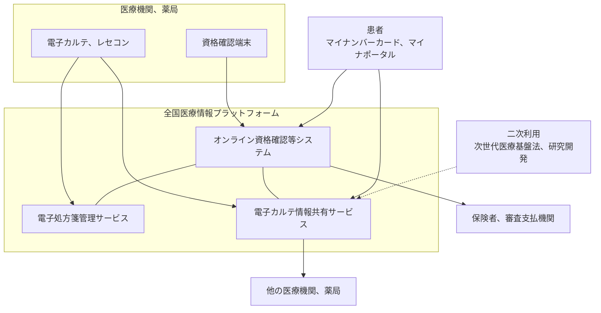

# 🏛️ 医療 DX：国の基盤と接続点

医療 DX で導入される仕組みは、いずれも医療機関の外にある共通基盤と通信する。
本ページは、その基盤ごとに何が接続され、防御側が何を確認するかを整理する。

> [!NOTE]
> **表記ルール**：本ページでは、**事実**（一次情報で確認できる内容。出典を併記する）、**報道ベース**（報道や第三者の集計のみで確認でき、当事者の公表資料では裏付けが取れていない内容）、**分析**（筆者の解釈）を書き分ける。
> 出典は、当事者の公表資料、行政文書、CVE、ベンダアドバイザリなどの一次情報を優先して示す。
> 工程と仕様は改定が続いている。時期の記述は、出典先の最新版で確認してほしい。

---

## 全体像

**事実**：医療 DX 推進本部は 2023 年 6 月 2 日に「医療 DX の推進に関する工程表」を決定した。
重点施策は、全国医療情報プラットフォームの創設、電子カルテ情報の標準化、診療報酬改定 DX の三つである（[内閣官房 医療 DX 推進本部](https://www.cas.go.jp/jp/seisaku/iryou_dx_suishin/index.html)）。

**分析**：この図で防御側が見るべきなのは、線の本数ではなく線の向きである。
資格確認は医療機関から外へ出る照会だが、カルテ情報共有と処方箋は、他施設が登録した情報を自施設が取り込む方向を含む。
外から入ってくる情報が診療の判断材料になる経路は、完全性の問題として扱う必要がある。

**事実**：2026 年 6 月 17 日に公布された改正経済安全保障推進法により、医療 DX 関連業務（オンライン資格確認等システム、電子処方箋管理サービス、電子カルテ情報共有サービスに関する業務）が、基幹インフラ制度の特定社会基盤事業に追加された。
これらのサービスに係る設備を特定重要設備として指定し、導入と維持管理等の委託を事前届出と審査の対象とすることが想定されている（[経済安全保障推進法の基幹インフラ制度への追加](../../guidelines/japan.md)）。

**分析**：三つの基盤が止まると、医療機関と薬局の側で診療と服薬指導が滞る。
制度上の位置づけが変わったことで、これらの基盤は「便利な共通基盤」から「止まると広範囲の混乱が生じる設備」として扱われる。
医療機関の側で対応が必要になるのは、基盤そのものではなく、基盤に接続する自施設の経路と端末である。

---

## オンライン資格確認等システム

**事実**：2023 年 4 月から、保険医療機関と保険薬局に、オンライン資格確認等システムの導入が原則として義務づけられた。
根拠は保険医療機関及び保険医療養担当規則などの改正である（[厚生労働省 オンライン資格確認、マイナンバーカードの保険証利用について](https://www.mhlw.go.jp/stf/newpage_08544.html)）。

このシステムは、資格情報の確認だけでなく、薬剤情報や特定健診情報を医療機関が参照する経路にもなっている。

**分析**：資格確認端末は、医療機関の中で最初に「外部と常時つながる端末」として置かれた例が多い。
導入時に、既存の院内網とどう分離するかの判断が施設ごとに委ねられた結果、構成の実態が施設によって大きく異なる。
確認するのは、端末が接続するネットワークの範囲、端末から院内の他のセグメントへ到達できるか、端末の OS 更新を誰が行うかの三点になる。

---

## 電子処方箋

**事実**：電子処方箋管理サービスは 2023 年 1 月 26 日に運用を開始した（[厚生労働省 電子処方箋](https://www.mhlw.go.jp/stf/denshishohousen.html)）。
オンライン資格確認等システムの基盤を利用し、複数の医療機関と薬局にまたがる処方、調剤情報の参照と、重複投薬や併用禁忌の確認を行う。
処方箋の発行には、HPKI（保健医療福祉分野の公開鍵基盤）による電子署名が用いられる。

**分析**：署名鍵が関わる仕組みでは、鍵の保管と利用者の紐づけが攻撃対象になる。
資格を持つ医師の署名が、本人の意図しない形で行使されないことは、技術的な保護だけでなく運用の手順で担保される部分がある。
カードの保管場所、代行入力の運用、離席時の扱いを、規程の文面ではなく実際の動作として確認する必要がある。

---

## 電子カルテ情報共有サービス

**事実**：電子カルテ情報共有サービスは、全国医療情報プラットフォームの一部として、診療情報提供書の電子共有、健診結果の閲覧、患者の臨床情報の閲覧、患者本人による閲覧の四つを提供する。
手続と申請は、社会保険診療報酬支払基金が運営する医療機関等向け総合ポータルサイトで扱う（[厚生労働省 電子カルテ情報共有サービス](https://www.mhlw.go.jp/stf/seisakunitsuite/bunya/kenkou_iryou/iryou/johoka/denkarukyouyuu.html)）。

**報道ベース**：本格運用の時期は、モデル事業での検証と改修を経て後ろ倒しになっており、2026 年度冬頃を目指すと報じられている（[GemMed](https://gemmed.ghc-j.com/?p=71681)）。

**分析**：このサービスが扱うのは、施設をまたいで流通する診療情報である。
自施設が登録した情報の参照範囲を自施設で完結して管理できないため、確認の対象は「誰が参照できるか」から「参照された事実を自施設で把握できるか」に移る。
参照の記録が自施設側に残るか、残らない場合に患者からの問い合わせにどう答えるかを、運用開始の前に決めておく必要がある。

---

## 標準型電子カルテ

**事実**：厚生労働省は標準型電子カルテ検討ワーキンググループを設置し、2025 年 1 月 31 日の第 3 回で、標準型電子カルテ α 版のコンセプトと実装機能、モデル事業計画を議題とした（[厚生労働省 標準型電子カルテ検討ワーキンググループ](https://www.mhlw.go.jp/stf/newpage_35729.html)）。
電子カルテとレセプトコンピュータの標準仕様書は、中小病院向けと医科診療所向けが公表されている（[厚生労働省 電子カルテ及びレセプトコンピュータ標準仕様](https://www.mhlw.go.jp/stf/seisakunitsuite/bunya/kenkou_iryou/iryou/johoka/standardspec.html)）。

**分析**：標準型電子カルテは、クラウド上の SaaS として提供される形が想定されている。
この形では、施設ごとに異なっていた電子カルテの構成が、共通の基盤とテナント分離の設計に置き換わる。
利点は、更新と脆弱性対応が提供事業者側に集約されることであり、代償は、テナント分離の実装に問題があったときの影響範囲が施設をまたぐことである。
確認する内容は [クラウド事業者と医療](../cloud/) に整理した項目と重なる。

標準型電子カルテの設計と開発はデジタル庁が担っており、調達仕様書に書かれたセキュリティ要件は公開されている。
その内容と、デジタル庁が別に運用する自治体向けの情報連携基盤は [デジタル庁が担う医療 DX](digital-agency.md) で扱う。

---

## 標準化と API が変える認可の設計

電子カルテ情報の標準化は、施設ごとの独自形式を HL7 FHIR などの共通形式に置き換える。
形式が揃うことで、機械が横断して読める状態になる。

**分析**：この変化は、認可の設計にそのまま効く。
画面越しの参照では、担当患者かどうかの判断が画面遷移の設計に埋め込まれていた。
API では、その判断を明示的な認可として書く必要がある。
書かれていない場合、患者 ID を差し替えるだけで他の患者の情報が返る状態になりうる。
この形の不備は [医療系 Web アプリケーションのセキュリティ](../web-security/) で扱う認可の問題と同じ構造であり、対象が全国規模の基盤になった分だけ影響が大きい。

**確認する内容**：

- 認可の判断が、呼び出し元のアプリケーションではなくサーバ側で行われているか
- 取得できる範囲が、患者単位ではなく利用者の職務単位で制限されているか
- 大量取得を検知する仕組みがあるか。件数の上限と、上限に達した場合の記録
- 発行したトークンの有効期間と、失効の手段

---

## 二次利用と、加工した情報の扱い

**事実**：次世代医療基盤法は 2023 年に改正され、2024 年 4 月から施行された。
従来の匿名加工医療情報に加えて、仮名加工医療情報の作成と提供が可能になった（[内閣府 次世代医療基盤法](https://www8.cao.go.jp/iryou/index.html)）。

**事実**：厚生労働省は「医療デジタルデータの AI 研究開発等への利活用に係るガイドライン」を公表している。
医療機関、学術研究機関、民間企業が共同研究を起点に医療情報を利活用する場合を想定し、研究開発の段階ごとの法的根拠と、仮名加工情報の作成手順を整理したものである（[ガイドライン本文 PDF](https://www.mhlw.go.jp/content/001310044.pdf)）。

**分析**：二次利用は、情報が組織の外へ出る経路である。
加工の手順が正しくても、加工前のデータが置かれた場所、受け渡しの経路、受領側の管理体制が抜けていれば、そこが漏えいの起点になる。
確認するのは、法的根拠の整理だけでなく、加工前後のデータがどの環境に何日置かれるかである。

---

## 共通基盤への接続が生む二つのリスク

閉域網に接続すること自体より、接続したあとの運用と、切断されたあとの復帰が問題になる。

**事実**：専門家へのインタビュー調査では、次の二点が指摘されている（[日医総研ワーキングペーパー No.488](https://www.jmari.med.or.jp/result/working/post-4657/)、2024 年 12 月 10 日）。

- オンライン資格確認等システムや全国医療情報プラットフォームは閉域網として構成されているが、現場の都合や利便性から、インターネットに接続されたネットワークと安易につないでしまう事態が起こりうる。特殊な通信プロトコルを使っているわけではないため、機器を介した接続は技術的に可能である
- 有事に支払基金とのネットワークから切り離されると、業務が停止、遅延する。オンライン資格確認だけに使われている現状でも受付業務は混乱し、電子処方箋や医療情報の参照に用途が広がるほど、切断の影響は大きくなる。この意味で、共通基盤との接続は医療機関経営における単一障害点になりつつある

**事実**：同資料は、切断後の再接続についても、「再接続しても安全であること」を証明する確立された手順は存在せず、セキュリティ専門事業者の支援を受けて個別に検証しているのが復旧現場の実情であるとしている。
費用は医療情報システムの規模に応じて数百万円から数千万円とされる。

**分析**：この二点は、防御側の作業として別のものになる。
前者は構成管理の問題であり、閉域網側の端末とインターネット側の端末の物理的な分離、機器の持ち込みの検出、定期的な棚卸しで扱う。
後者は事業継続と予算の問題であり、切断されている期間の診療手順（[縮退運用](#防御側の確認事項)）と、再接続の検証費用をあらかじめ見込んでおくかどうかに帰着する。
接続の可否を論じるより、切られた状態で何日診療を続けられるかを先に決めるほうが、実務は動かしやすい（[インシデント対応と事業継続](../../response/)、[経営とガバナンス](../../governance/)）。

---

## 防御側の確認事項

| 区分 | 確認する内容 |
|---|---|
| 接続点 | 資格確認端末、電子処方箋、カルテ共有の各経路の接続先と、経路上の機器 |
| 分離 | 外部接続を持つ端末から、院内の他のセグメントへ到達できるか |
| 端末 | 資格確認端末の OS とソフトウェアの更新を誰が行うか。保守経路の認証 |
| 署名 | HPKI カードの保管、代行入力の運用、離席時の扱い |
| 認可 | 標準 API での認可がサーバ側で行われているか。取得範囲の上限 |
| 証跡 | 共通基盤への照会と、他施設からの参照が、自施設側で追えるか |
| 二次利用 | 加工前後のデータの保管場所、受け渡しの経路、保持期間 |
| 縮退 | 共通基盤が停止したときの診療手順。紙運用への切り替えと復帰 |

> [!TIP]
> 縮退運用の手順は、システムの導入時ではなく停止時に必要になる。
> 共通基盤の停止は自施設で復旧できないため、対応は「復旧」ではなく「その間どう診療を続けるか」の設計になる。

---

## 参照先

| 名称 | 発行 |
|---|---|
| [医療 DX 推進本部](https://www.cas.go.jp/jp/seisaku/iryou_dx_suishin/index.html) | 内閣官房 |
| [医療分野の情報化の推進について](https://www.mhlw.go.jp/stf/seisakunitsuite/bunya/kenkou_iryou/iryou/johoka/index.html) | 厚生労働省 |
| [医療分野のサイバーセキュリティ対策について](https://www.mhlw.go.jp/stf/seisakunitsuite/bunya/kenkou_iryou/iryou/johoka/cyber-security.html) | 厚生労働省 |
| [オンライン資格確認、マイナンバーカードの保険証利用について](https://www.mhlw.go.jp/stf/newpage_08544.html) | 厚生労働省 |
| [電子処方箋](https://www.mhlw.go.jp/stf/denshishohousen.html) | 厚生労働省 |
| [電子カルテ情報共有サービス](https://www.mhlw.go.jp/stf/seisakunitsuite/bunya/kenkou_iryou/iryou/johoka/denkarukyouyuu.html) | 厚生労働省 |
| [標準型電子カルテ検討ワーキンググループ](https://www.mhlw.go.jp/stf/newpage_35729.html) | 厚生労働省 |
| [医療機関等向け総合ポータルサイト](https://iryohokenjyoho.service-now.com/csm) | 社会保険診療報酬支払基金 |
| [次世代医療基盤法](https://www8.cao.go.jp/iryou/index.html) | 内閣府 |

---

[医療 DX と AX へ戻る](README.md) ／ [トップへ](../../../README.md)
