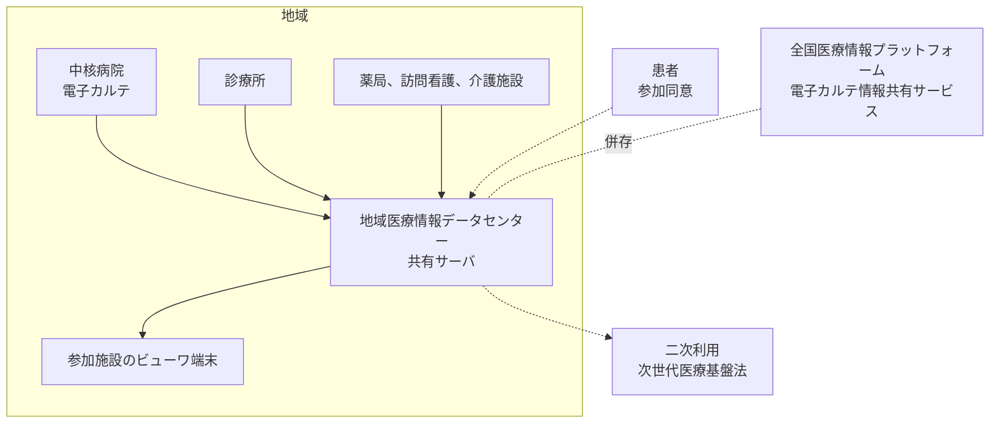

# 🕸️ 地域医療情報連携ネットワーク

全国医療情報プラットフォームが動き出す前から、施設をまたいで診療情報を共有する仕組みは地域単位で動いてきた。
本ページは、その源流にある Dolphin プロジェクトから現在の地域医療情報連携ネットワーク（以下、地連 NW）までを追い、防御側が確認する箇所を整理する。

> [!NOTE]
> **表記ルール**：本ページでは、**事実**（一次情報で確認できる内容。出典を併記する）、**報道ベース**（報道のみで確認でき、当事者の公表資料では裏付けが取れていない内容）、**分析**（筆者の解釈）を書き分ける。
> 出典は、当事者の公表資料、行政文書、CVE、ベンダアドバイザリなどの一次情報を優先して示す。
> 調査の数値は調査時点のものであり、地連 NW は新設と統合と廃止が続いている。最新の状況は出典先で確認してほしい。

---

## 地域単位の共有が先にあった

**事実**：日本医師会総合政策研究機構は、全国の地連 NW を対象とした調査を 2012 年度から続けている。
2024 年度版の調査は 2025 年 2 月に実施され、2025 年 1 月 1 日時点の状況を尋ねている。
331 地域に回答を依頼し、280 地域から有効回答を得た。
回答のうち 20 地域は、運用終了や他地域との統合により対象外となった（[日医総研ワーキングペーパー No.495](https://www.jmari.med.or.jp/result/working/post-4956/)）。

**分析**：図の中心にあるデータセンターは、参加施設が登録した情報を患者ごとに統合して保持する。
自施設の診療情報の複製が自施設の外にあることが、院内資産だけを数える棚卸しでは抜ける。
地連 NW を使う施設では、守る対象が院内のサーバで完結しない。

---

## Dolphin プロジェクトと MML

**事実**：Dolphin プロジェクトは、2001 年に経済産業省の公募事業へ採択されて始まった。
地域ごとに患者の診療データを管理する地域医療情報データセンターを置き、診療所、病院、検査センター、薬局、訪問看護ステーションを接続して、経過記録、検査結果、紹介状、退院時サマリーを患者ごとに蓄積する構成である。
データの送信には、医療情報の交換規格である **MML**（Medical Markup Language）と HL7 の形式を用いた。
稼働は 2001 年の熊本に始まり、2002 年に宮崎、2003 年に東京、2006 年に京都へ広がったが、2017 年の時点で運用が続いていたのは宮崎と京都であった（[吉原博幸「千年カルテプロジェクト：本格的日本版 EHR と医療データの 2 次利用に向けて」情報管理 60 巻 11 号、2018](https://doi.org/10.1241/johokanri.60.767)）。

**事実**：同じ資料は、各地域がサーバを購入して管理し、5 年から 6 年ごとに機器を更新する人的、財務的な負担を、地域ごとにデータセンターを持つ方式の課題として挙げている。

**事実**：Dolphin プロジェクトで開発された電子カルテは、2004 年 6 月 15 日にオープンソース化され、OpenDolphin として公開されている。
日医標準レセプトソフト ORCA との接続は 2001 年 11 月に確認された。
プロジェクトのページは、コミッターが存在せず GitHub でソースを共有している状態だと記している（[OpenDolphin](https://dolphin-dev.github.io/)）。

**分析**：コミッターのいない OSS を診療に使う場合、脆弱性が見つかっても修正を担当する者が決まっていない。
この状態で確認するのは、その電子カルテが外部から到達できる位置にあるか、依存する Java 実行環境とアプリケーションサーバの更新を誰が行うか、更新が止まったときに切り替える先があるかである。
OSS 医療情報システムに共通する脆弱性の傾向は [OSS 電子カルテ、病院情報システムの脆弱性](../oss-vulnerabilities/ehr-systems.md) に整理した。

---

## 千年カルテと二次利用への接続

**事実**：2015 年に始まった千年カルテプロジェクトは、地域ごとに置いていたデータセンターを EHR センター 1 か所へ集め、各地域がネットワーク越しに機能を分割利用する設計に変えた。
接続した施設は初年度が 11 施設、2016 年度が 23 病院である（[情報管理 60 巻 11 号](https://doi.org/10.1241/johokanri.60.767)）。

**事実**：一般社団法人ライフデータイニシアティブ及び株式会社 NTT データは、次世代医療基盤法の認定作成事業者及び認定医療情報等取扱受託事業者として、内閣府の一覧に掲載されている（[内閣府 次世代医療基盤法に基づく事業者の認定](https://www8.cao.go.jp/iryou/nintei/nintei.html)）。

**分析**：地域で集めた診療情報は、診療のための共有と、研究のための提供という二つの出口を持つ。
出口が二つあることで、参加施設が同意を取得した範囲と、実際に情報が流れる先が一致しているかの確認が必要になる。
二次利用の制度面は [医療 DX：国の基盤と接続点](medical-dx.md) に、法令は [国内のガイドラインと法規制](../../guidelines/japan.md) にまとめている。

---

## いま稼働している地連 NW の規模

**事実**：日医総研の 2024 年度版調査（2025 年 1 月 1 日時点）が示す規模は次のとおりである。

| 項目 | 値 |
|---|---|
| 有効回答 | 280 箇所（回答依頼 331 箇所、有効回答率 84.6%） |
| 平均運用年数 | 10.2 年 |
| 1 地連 NW あたりの平均参加施設数 | 143.3 施設 |
| 使用している製品（n=253、複数回答） | その他、独自 128 箇所、ID-Link 76 箇所、HumanBridge 63 箇所 |
| 参加患者数 | 5,325,414 人。うち参加同意書取得済み 5,015,351 人（94.2%） |
| 平均システム構築費用（累積） | 2 億 3,390 万円 |
| 2025 年度運営予算の平均 | 1,131 万円 |

**分析**：最も多いのは特定のパッケージではなく、独自に構築されたシステムである。
独自構築では、脆弱性情報が製品名で流通しない。
ベンダアドバイザリを製品名で追う運用がそのまま効かないため、更新の要否は個々の構築事業者に問い合わせて確認することになる。
参加施設の平均が 143 施設という規模は、共有サーバ 1 台の背後に百を超える施設の資格情報が並ぶことを意味する。

---

## 安全管理の実態

**事実**：安全管理対策（n=210、複数回答）は「ウイルスソフトを最新バージョンに保つ」181 箇所が最も多く、「定期的な運用管理規程等の見直し」160 箇所、「共有情報サーバ等の設備室の入退管理」156 箇所と続く。
「共有情報の閲覧履歴の定期的確認」は 134 箇所、「情報漏えいした場合の対策」は 113 箇所であった。

**事実**：ランサムウェアなどサイバー攻撃への予防対策は、「実施中」127 箇所（56.4%、n=225）、「把握していない」57 箇所（25.3%）、「実施検討中」27 箇所（12.0%）、「実施なし」14 箇所（6.2%）である。
インシデントが発生した際の対策ができている地域は 81 箇所（36.0%）にとどまる。
予防対策を実施中と答えた地域の具体策では、「サーバのアクセスログを管理」が 102 箇所（n=122、複数回答）で最も多い（[日医総研ワーキングペーパー No.495](https://www.jmari.med.or.jp/result/working/post-4956/)）。

**事実**：救急時に患者の同意がない状況で情報を閲覧できる地域は 40 箇所（19.7%、n=203）、閲覧できる予定を含めて 50 箇所（24.6%）である。
閲覧できる 50 地域で見られる情報は、患者基本情報 48 箇所、薬剤情報 43 箇所、検査情報 42 箇所が多い。

**分析**：予防対策の設問で 4 分の 1 が「把握していない」と答えたことは、対策の有無より前に、運営主体が参加施設の状態を知る経路を持っていないことを示す。
共有サーバを複数施設で使う形では、1 施設の端末が侵害されると、その施設の資格情報で他施設が登録した情報まで参照できる。
確認するのは、参加施設側で退職者や異動者の資格情報が失効する手順と、共有サーバ側で通常と異なる参照を検知できるかの二点である。
閲覧履歴を保管していても、定期的に見る担当が決まっていなければ、事後に経緯を追う用途に限られる。

---

## 稼働終了と統合が起きている

**事実**：厚生労働省は令和 7 年度に地連 NW の調査研究事業を実施し、その結果を 2026 年 5 月 29 日の第 32 回医療等情報利活用ワーキンググループに提出した。
月間アクティブ施設率は 20% から 40% 台で、登録施設数と実際に利用する施設数に乖離がある。
協議会の支出は年間数十万円から数千万円まで幅があり、公的補助金の有無と額の差も大きい。
稼働を終了した例として、登録施設が減るなかでシステムリプレイスの費用を捻出できなかった地域と、費用負担や費用対効果に対する参加施設と構成市町の認識の違いから廃止に至った地域が挙げられている（[厚生労働省 資料 3](https://www.mhlw.go.jp/content/10808000/001705947.pdf)、[医療分野の情報化の推進について](https://www.mhlw.go.jp/stf/seisakunitsuite/bunya/kenkou_iryou/iryou/johoka/index.html)）。

**分析**：ネットワークの廃止は、そこに集まった診療情報の行き先を決める作業を伴う。
稼働中に手順を定めていない場合、廃止の決定から停止までの短い期間で、移行先、保存期間、消去の責任者を決めることになる。
確認するのは、廃止や統合のときにデータをどこへ移すか、移さない情報を誰がいつ消去するか、患者から取得した同意が移行先でも有効かである。

---

## 全国医療情報プラットフォームとの併存

**事実**：厚生労働省の同資料は、電子カルテ情報共有サービスと地連 NW を直接連携させる場合の課題として、各医療機関での送信データ抽出、標準コード対応と FHIR 変換、地連 NW と電子カルテ情報共有サービスの接続の認証、接続経路の構築を挙げている。
地連 NW での名寄せには被保険者番号、診察券番号、氏名、生年月日などの属性情報を用いており、運用負荷になっている。
オンライン資格確認の仕組みを活用すれば軽減できる可能性があるが、同システムに患者情報を照会する機能の追加が必要になる。

**事実**：日医総研の調査では、全国医療情報プラットフォームの創設について「心配である」と答えた地域が 81 箇所（36.5%、n=222）であった。
運営主体別では NPO と一般社団、財団法人で心配する割合が高い。

**分析**：属性情報の突合で患者を同定する仕組みは、条件を誤ると別人の情報を結びつける。
この誤りは漏えいではなく診療情報の誤りとして現れるため、アクセス制御の検査では検出されない。
確認するのは、突合の判定に使う項目の組み合わせと、誤って結びついたときに解消する手順である。

---

## 防御側の確認事項

| 区分 | 確認する内容 |
|---|---|
| 接続点 | 参加施設と共有サーバを結ぶ回線、境界の機器、ビューワを動かす端末の管理者 |
| 権限 | 施設ごと、職種ごとに参照できる範囲。退職者と異動者の資格情報が失効する手順 |
| 同意 | 参加同意の取得方式と、同意の範囲を超える参照が起きたときに気づく手段 |
| 救急時 | 同意なしの閲覧を運用しているか。運用する場合の記録と事後確認の担当 |
| 証跡 | 共有サーバのアクセスログを誰が保管し、誰がどの頻度で確認するか |
| 名寄せ | 突合に使う属性の組み合わせと、誤って結びついたときの解消手順 |
| 二次利用 | 提供先、加工の方法、患者から取得した同意の範囲との一致 |
| 継続性 | 機器更改の費用負担者。廃止や統合のときのデータの移行と消去 |

> [!TIP]
> 地連 NW が止まったときの影響は、自施設の復旧作業では戻せない。
> 他施設の情報を参照できない状態で診療を続ける手順は、[インシデント対応と事業継続](../../response/) に整理した縮退運用と同じ設計になる。

---

## 参照先

| 名称 | 発行 |
|---|---|
| [ICT を利用した全国地域医療情報連携ネットワークの概況（2024 年度版）No.495](https://www.jmari.med.or.jp/result/working/post-4956/) | 日本医師会総合政策研究機構 |
| [令和 7 年度地域医療情報連携ネットワーク調査研究事業の結果について（第 32 回医療等情報利活用 WG 資料 3）](https://www.mhlw.go.jp/content/10808000/001705947.pdf) | 厚生労働省 |
| [医療分野の情報化の推進について](https://www.mhlw.go.jp/stf/seisakunitsuite/bunya/kenkou_iryou/iryou/johoka/index.html) | 厚生労働省 |
| [次世代医療基盤法に基づく事業者の認定](https://www8.cao.go.jp/iryou/nintei/nintei.html) | 内閣府 |
| [千年カルテプロジェクト：本格的日本版 EHR と医療データの 2 次利用に向けて](https://doi.org/10.1241/johokanri.60.767) | 情報管理 60 巻 11 号（吉原博幸） |
| [OpenDolphin](https://dolphin-dev.github.io/) | OpenDolphin コミュニティ |

---

## 関連ページ

- [医療 DX：国の基盤と接続点](medical-dx.md)：全国医療情報プラットフォームと、施設が接続する経路
- [OSS 電子カルテ、病院情報システムの脆弱性](../oss-vulnerabilities/ehr-systems.md)：OpenDolphin を含む OSS 医療情報システム
- [医療系 Web アプリケーションのセキュリティ](../web-security/)：ビューワと患者向け画面の認可
- [インシデント対応と事業継続](../../response/)：共有基盤が止まったときの診療の継続

---

[医療 DX と AX へ戻る](README.md) ／ [トップへ](../../../README.md)
