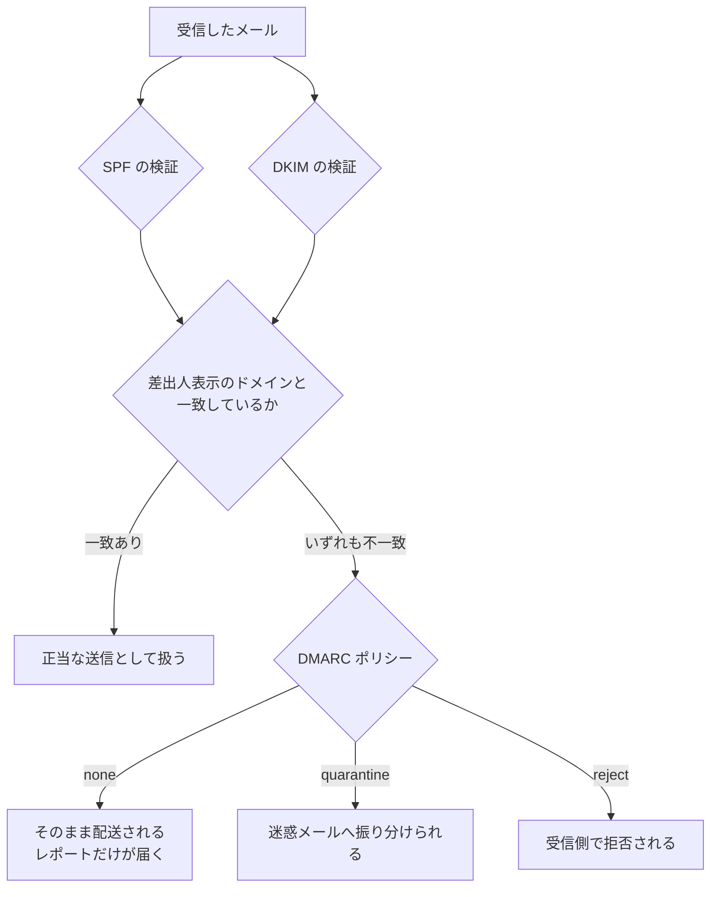

# ✉️ メールとドメインの管理

医療機関のドメイン名は、院内で使う道具ではない。
患者への検査案内、取引先への発注、行政への報告、地域の医療機関との連絡に使われる。
そのため、なりすまされたときの被害は組織の外側に出る。
自院のシステムが一切侵害されていなくても、患者と取引先が被害を受ける。

本ページは二つを扱う。
送信するメールを本物と判定させる仕組みと、ドメイン名そのものの管理である。
後者は資産管理の一部でありながら、台帳に載らないまま放置されやすい。

> [!NOTE]
> **表記ルール**：本ページでは、**事実**（一次情報で確認できる内容。出典を併記する）、**報道ベース**（報道や第三者の集計のみで確認でき、当事者の公表資料では裏付けが取れていない内容）、**分析**（筆者の解釈）を書き分ける。

---

## ドメイン名が使われる場面

| 用途 | 受け手 | なりすまされたときの帰結 |
|---|---|---|
| 検査結果、予約、健診の案内 | 患者 | 偽の案内で個人情報を入力させられる。受診の妨げになる |
| 請求と発注 | 医薬品卸、医療機器メーカー、委託事業者 | 支払先の変更を装った詐欺が成立する |
| 紹介状、地域連携の連絡 | 他の医療機関 | 患者情報を含むやり取りが第三者に渡る |
| 行政への報告、届出 | 自治体、厚生局 | 報告の真正性が疑われる |
| 採用、研究、寄付の案内 | 応募者、研究者、寄付者 | 組織の信用が使われる |
| Web サイトと患者ポータル | 患者、一般 | 偽サイトへ誘導される |

**分析**：この表の上二行が、医療機関に固有の重さを持つ。
患者は医療機関からの連絡を疑わないことを前提に行動する。
「本物かどうか患者に見分けさせる」設計は、この前提の上では機能しない。

---

## 送信ドメイン認証

三つの仕組みが役割を分けている。

| 仕組み | 何を確かめるか | 設定する場所 |
|---|---|---|
| SPF | そのドメインの名前で送ってよい送信元かどうか | DNS の TXT レコード |
| DKIM | 送信内容が改変されていないか、正当な鍵で署名されているか | DNS の TXT レコードと、送信側の署名設定 |
| DMARC | SPF と DKIM の結果を、差出人として表示されるドメインと突き合わせ、失敗時の扱いを指示する | DNS の TXT レコード |

**事実**：Google は、Gmail 宛に 1 日 5,000 通を超えて送信する送信者に対し、2024 年 2 月以降、SPF と DKIM に加えて送信ドメインへの DMARC の設定を求めている。
DMARC のポリシーは `none` でも要件を満たすとされている。
あわせて、送信ドメインまたは IP の正引きと逆引きの一致、TLS による送信、迷惑メール率を 0.30% 未満に保つことなどが挙げられている。
出典：[Google Email sender guidelines](https://support.google.com/a/answer/81126)

**事実**：総務省は電気通信事業者に対し、フィッシングメール対策の強化を要請しており、DMARC の導入と DMARC ポリシーの設定、ドメインレピュテーション、BIMI、踏み台送信対策等を重点項目に挙げている。
出典：[総務省 フィッシングメール対策の強化に関する要請](https://www.soumu.go.jp/menu_news/s-news/01kiban18_01000260.html)

**事実**：フィッシング対策協議会は、DMARC の導入状況と必要性についての報告書を公表している。
出典：[フィッシング対策協議会 送信ドメイン認証技術「DMARC」の導入状況と必要性について](https://www.antiphishing.jp/report/wg/cert_explaindoc_20250130.html)

### ポリシーを上げる手順

**分析**：DMARC は設定しただけでは効果が出ない。
ポリシーが `none` の間は、なりすましメールがそのまま配送される。
一方で、いきなり `reject` にすると、正規のメールが届かなくなる恐れがある。
医療機関では、健診案内の一斉配信、地域連携システムからの通知、外部委託の予約サービスなど、自組織のドメイン名で第三者が送信している経路が残っていることが多い。

1. `p=none` で設定し、レポートの送信先を用意する
2. レポートから、自ドメイン名で送信している経路を洗い出す（委託事業者、業務システム、複合機、クラウドサービス）
3. 経路ごとに、SPF の記述と DKIM 署名を整える。廃止できる経路は止める
4. `p=quarantine` へ上げ、影響を確認する
5. `p=reject` へ上げる
6. サブドメインの扱い（`sp=`）と、送信に使わないドメインの扱いを決める

**分析**：2 が最も時間を要する。
洗い出しの過程で、退職者が設定したまま残っている配信サービスや、契約が終了した業者の経路が見つかることがある。
この作業自体が、送信経路の棚卸しになる。

**分析**：送信に使っていないドメイン（取得しただけのドメイン、旧名称のドメイン）にも、送信を拒否する内容の SPF と DMARC を設定しておく。
使っていないドメインは、なりすましに使われても気づく手立てがない。

---

## ドメイン名そのものの管理

ドメイン名は、契約が切れれば第三者が取得できる。
組織の統廃合、事業の終了、キャンペーンサイトの閉鎖のあとに、同じ名前が別の用途で使われることがある。

**事実**：2025 年 10 月 24 日、厚生労働省医政局総務課は事務連絡を発出し、「医業等に係るウェブサイトの監視体制強化事業」の通報ホームページについて、旧ドメイン名が現在は当該事業と全く関連のない内容のサイトで利用されていることを注意喚起した。
現在有効な通報先の URL を示したうえで、通報ホームページへのハイパーリンクを設定する際は遷移先が現在有効なものかを必ず確認すること、既にポスター等の掲示物や配布物、会議資料等で旧ドメイン名や二次元バーコードを周知している場合は可能な限り対応することを依頼している。
出典：[事務連絡（全日本病院協会が公開、PDF）](https://www.ajha.or.jp/topics/admininfo/pdf/2025/251027_2.pdf)、[周知の例（日本再生医療学会）](https://www.jsrm.jp/news/news-16861/)

**分析**：この事例が示しているのは、ドメイン名の失効が、失効した組織だけの問題ではないことである。
リンクを張っていた側、ポスターに印刷した側、会議資料に二次元バーコードを載せた側に、それぞれ残る。
紙に印刷された二次元バーコードは、回収も更新もできない。

| 発生源 | 残るもの | 対応 |
|---|---|---|
| 病院の統廃合、名称変更 | 旧ドメインのメールアドレスとリンク | 一定期間は保持し、転送と告知を行う。手放す時期を計画に入れる |
| キャンペーン、周年事業のサイト | 印刷物、外部サイトからのリンク | 独立ドメインを取らず、自院ドメインのサブディレクトリで運用する |
| 委託事業者が取得したドメイン | 契約終了後の管理者不在 | 契約で、ドメインの名義と終了時の扱いを定める |
| 検査、予約などの外部サービス | 患者に案内した URL | 変更時の告知経路を、契約に含める |
| 使っていない防御目的の取得 | 更新忘れ | 資産台帳に載せ、更新期限を管理する |

**分析**：ドメイン名は、サーバや端末と違って物理的な実体がないため、資産台帳から漏れる。
台帳に載せる項目は、ドメイン名、名義、管理者、レジストラ、更新期限、用途、廃止時の判断者の七つで足りる。

---

## 請求と支払いを狙うメール

**事実**：FBI IC3 の 2025 年次報告では、ビジネスメール詐欺（BEC）による被害申告額は 30.46 億ドルで、損失区分の第 2 位である。
出典：[2025 Internet Crime Report（PDF）](https://www.ic3.gov/AnnualReport/Reports/2025_IC3Report.pdf)、[海外の統計](../threats/statistics/global.md)

**分析**：医療機関と製薬企業では、次の取引が標的になりやすい。
いずれも、金額が大きく、担当者が限られ、支払いの期日が決まっている。

- 医薬品と医療材料の卸への支払い
- 医療機器のリースと保守契約
- 建物の改修と設備工事
- 治験の受託と、研究費の送金
- 職員の給与振込先の変更

**対策**：支払先の変更は、メール以外の経路で確認する運用にする。
確認先の電話番号は、依頼メールに書かれた番号ではなく、契約書に記載された番号を使う。
金額と経路の条件（一定額以上、初回の振込先、変更の依頼）で、二人以上の承認を必須にする。

**検知**：外部から届いたメールに表示を付ける、自組織のドメインを装う外部からのメールを受信側で拒否する、返信先アドレスが差出人と異なるメールを警告する、という三つが実装しやすい。

---

## 攻撃側から見たドメインとメール

| 手口 | 成立する条件 | 外部から観測できる兆候 | 緩和 |
|---|---|---|---|
| 類似ドメインからの送信 | 見分けの付きにくい名前が取得できる | 自組織名を含むドメインの新規登録 | 登録の監視、患者への案内経路の統一 |
| 自ドメインを装う送信 | DMARC が未設定、またはポリシーが `none` | DMARC レポートに現れる認証失敗 | ポリシーの引き上げ |
| SPF の設定不備の利用 | `+all` の指定、`include` の連鎖が広い | DNS の TXT レコードの確認 | 送信経路の棚卸しと記述の最小化 |
| 失効ドメインの再取得 | 更新されずに手放されたドメインがある | 登録情報の変更、内容の変化 | 台帳での期限管理、手放す前の告知 |
| サブドメインの乗っ取り | 外部サービスの解約後も CNAME が残る | 解決先が未使用のサービスを指している | DNS レコードの棚卸し、解約時の削除手順 |
| 転送設定の悪用 | 侵害されたアカウントに転送規則が作られる | 外部宛の自動転送規則の増加 | 転送規則の作成の制限と監視 |

### 検証の進め方

**分析**：この領域は、自組織の許可があれば、対象のシステムに一切パケットを送らずに確認できる部分が多い。

1. 自組織が保有するドメインを列挙する（登録情報の照会、請求書、担当者への確認）
2. 各ドメインの SPF、DKIM、DMARC のレコードと、ポリシーの値を確認する
3. DNS レコードのうち、外部サービスを指すものを列挙し、解決先が有効かを確認する
4. 自組織名を含む類似ドメインの登録状況を確認する
5. 印刷物と外部サイトに残る URL、二次元バーコードの遷移先を確認する
6. 結果を、ドメイン、用途、認証設定、期限、担当の形で台帳にする

**分析**：6 の台帳が成果物になる。
脆弱性の指摘ではなく、管理対象の一覧が出てくる点で、他の検証と性質が違う。

---

## 実務チェックリスト

**送信ドメイン認証**
- [ ] 送信に使うすべてのドメインで、SPF、DKIM、DMARC を設定した
- [ ] DMARC のレポートを受け取り、送信経路を洗い出した
- [ ] 委託事業者や外部サービスが自ドメイン名で送信している経路を把握した
- [ ] ポリシーを `none` から段階的に引き上げる計画を立てた
- [ ] 送信に使わないドメインにも、拒否の設定を入れた

**ドメイン管理**
- [ ] 保有するドメインを台帳にした（名義、管理者、更新期限、用途、廃止の判断者）
- [ ] 委託事業者が取得したドメインの名義と、契約終了時の扱いを定めた
- [ ] 外部サービスを指す DNS レコードを棚卸しし、解約時の削除手順を決めた
- [ ] 印刷物と外部リンクに残る URL の更新手順を決めた

**請求と支払い**
- [ ] 支払先の変更を、メール以外の経路で確認する運用にした
- [ ] 確認先の連絡先を、契約書記載のものに限定した
- [ ] 一定額以上と、初回の振込先について、複数名の承認を必須にした

**患者への案内**
- [ ] 患者へ送るメールと SMS の送信元を統一した
- [ ] 案内に含める URL のドメインを限定し、事前に周知した
- [ ] 偽の案内を確認したときの窓口と、公表の手順を決めた

---

## 関連ページ

- [患者向けサイトの第三者送信](web-security/tracking.md)：Web 側で外部へ出る情報
- [患者用ポータルの脆弱性](web-security/patient-portal.md)：患者向けサービスの攻撃面
- [認証とアクセス管理](identity.md)：メールアカウントの保護と、転送規則の管理
- [ログと監視の設計](logging.md)：認証と転送設定の変更を記録する
- [組織の脆弱性の分類](../threats/actors/organizational-vulnerabilities.md)：委託と契約に起因する構造
- [海外の統計](../threats/statistics/global.md)：BEC の被害規模
- [脅威アクターとリスク](../threats/actors/actors-and-risks.md)：金銭目的のアクターの動機

---

[← 技術領域](README.md) | [トップへ](../../README.md)
