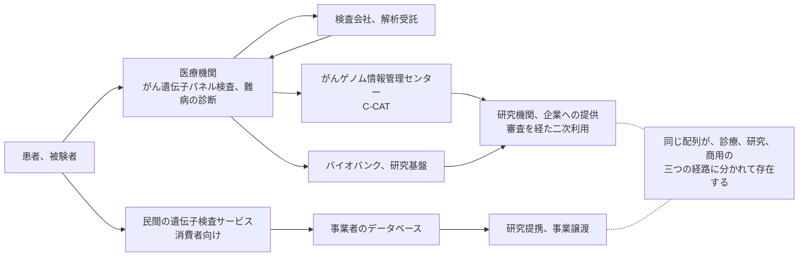

# 🧬 ゲノムデータの保護

診療情報は再発行できないという性質を持つが、ゲノムデータはその性質を極端な形で備えている。
配列は生涯変わらず、漏れた後に無効化する手段がない。
本人だけの情報でもない。
一人分の配列は、血縁者の情報を部分的に含む。

本ページは、ゲノムデータがどこに置かれ、どの制度が関わり、どの経路で失われるかを扱う。
がんゲノム医療の情報基盤、研究用の配列データ、民間の遺伝子検査サービスの三つを対象にする。

> [!NOTE]
> **表記ルール**：本ページでは、**事実**（一次情報で確認できる内容。出典を併記する）、**報道ベース**（報道や第三者の集計のみで確認でき、当事者の公表資料では裏付けが取れていない内容）、**分析**（筆者の解釈）を書き分ける。

---

## 他の医療情報と違う四点

| 性質 | 帰結 | 設計への影響 |
|---|---|---|
| 変更できない | パスワードやカード番号と違い、漏えい後の無効化ができない | 事後対応に頼れない。取得と保管の段階で決まる |
| 本人だけの情報ではない | 血縁者の遺伝的特徴が推定される | 同意の主体と、影響を受ける主体がずれる |
| 時間が経っても価値が落ちない | 数十年後に不利益が生じうる | 保存期間と、事業終了時の扱いを最初に決める必要がある |
| 匿名化しても再識別されうる | 公開されている系譜情報や属性と突合される | 「識別子を外したから安全」という前提が成立しない |

**分析**：四点目が、他の医療情報との運用上の差を生む。
氏名と患者 ID を外した検査結果は、多くの場合それだけでは個人に戻らない。
一方で配列データは、それ自体が個人を特定しうる識別子として機能する。
そのため、二次利用の設計では「どの識別子を外すか」ではなく「誰に、どの粒度で、どの環境で渡すか」が制御点になる。

---

## どこに置かれているか

**事実**：C-CAT（がんゲノム情報管理センター）は 2018 年 6 月に国立がん研究センター内に開設され、全国のがんゲノム医療中核拠点病院等から、がん遺伝子パネル検査の結果と臨床情報を集約している。
登録されたデータの一部は、審査を経て国内外の研究機関や企業へ提供される。
出典：[C-CAT の役割](https://www.ncc.go.jp/jp/c_cat/kaisetsu/yakuwari/index.html)

**分析**：この構造では、同じ患者の配列が医療機関、解析受託事業者、集約基盤、提供先の四箇所に存在しうる。
医療機関の側で守るべき対象は自院内のデータだけではなく、外部へ出す際の条件と、出した先での取り扱いを含む。

---

## 国内の制度

**事実**：ゲノム情報を含む個人情報は、要配慮個人情報として扱われる（[国内のガイドラインと法規制](../guidelines/japan.md)）。

**事実**：2023 年 6 月に「良質かつ適切なゲノム医療を国民が安心して受けられるようにするための施策の総合的かつ計画的な推進に関する法律」（令和 5 年法律第 57 号、ゲノム医療推進法）が公布、施行された。
基本理念として、ゲノム情報の適切な保護と、ゲノム情報による不当な差別の防止が挙げられている。
同法に基づく「ゲノム医療施策に関する基本的な計画」も公表されている。
出典：[厚生労働省 ゲノム医療について](https://www.mhlw.go.jp/stf/newpage_59050.html)

**分析**：この法律が示しているのは、ゲノム情報の保護が情報セキュリティの問題であると同時に、差別の防止という社会的な問題として位置づけられている点である。
そのため、漏えい時の影響評価では、直接の被害額だけでなく、就労や保険加入における不利益という形の被害を想定する必要がある。

**事実**：研究目的での医療情報の利活用については、次世代医療基盤法が別の枠組みを定めている（[医療 DX：国の基盤と接続点](dx-ax/medical-dx.md)）。

**分析**：米国では、遺伝情報の保護が州法と州司法長官による執行を通じて行われている場面がある。
後述する 23andMe の事例では、破産手続における請求について、40 を超える州と首都ワシントンの司法長官が和解に至っている。

---

## 23andMe の事例

消費者向け遺伝子検査サービスの侵害と、その後の事業破綻は、ゲノムデータを扱う組織が直面する論点を一通り含んでいる。

### 何が起きたか

**事実**：2023 年 4 月から 9 月にかけて、他のサービスから漏えいした資格情報を用いたクレデンシャルスタッフィング攻撃が行われた。
直接侵害されたアカウントは 1 万 8000 件を超え、DNA Relatives 機能を通じて、影響は世界で約 690 万人に及んだ。
カナダで約 32 万人、英国で 15 万 5600 人である。
出典：[カナダ プライバシーコミッショナー PIPEDA Findings #2025-001](https://www.priv.gc.ca/en/opc-actions-and-decisions/investigations/investigations-into-businesses/2025/pipeda-2025-001/)、[調査結果の概要](https://www.priv.gc.ca/en/opc-news/news-and-announcements/2025/bg_23andme_250617/)

**事実**：カナダと英国の当局が共同調査で認定した不備は、次のとおりである。

| 区分 | 認定された内容 |
|---|---|
| 予防 | 多要素認証が任意で、採用率は 22% 未満。パスワードの最低長は 8 文字。既知の漏えい資格情報との照合なし。生の遺伝データへのアクセスに追加の検証なし |
| 検知 | 警告の仕組みが機能せず、個別に発生した三つの異常な事象を、全体として進行中の攻撃を示すものとして調査しなかった |
| 対応 | セッションの無効化とパスワードのリセットまで 4 日。生の遺伝データのダウンロード停止と認証の強化まで 1 か月 |

**事実**：英 ICO は 2025 年 6 月 5 日付で 231 万ポンドの制裁金を科した。
UK GDPR 第 5 条(1)(f) および第 32 条(1) の違反と認定している。
出典：[ICO の公表](https://ico.org.uk/about-the-ico/media-centre/news-and-blogs/2025/06/23andme-fined-for-failing-to-protect-uk-users-genetic-data/)、[Penalty Notice（PDF）](https://ico.org.uk/media2/kclbljpo/23andme-penalty-notice.pdf)

**分析**：認定された不備に、高度な攻撃手法への対処は含まれていない。
いずれも、医療機関の患者向けサービスにそのまま適用できる項目である。
特に「生の遺伝データのダウンロードに追加の検証がなかった」は、検査結果の一括ダウンロードや家族分の閲覧といった機能を持つ患者ポータルに対応する（[認証とアクセス管理](identity.md)）。

### 事業が終わるときにデータはどこへ行くか

**事実**：23andMe は 2025 年 3 月に連邦破産法第 11 章の適用を申請した。
資産は競売にかけられ、創業者が設立した非営利法人 TTAM Research Institute が 3 億 500 万ドルで取得した（Regeneron の 2 億 5600 万ドルの提示を上回る金額）。
裁判所の承認は 2025 年 7 月 1 日、取得の完了は同年 7 月 14 日である。
出典：[23andMe の公表](https://mediacenter.23andme.com/press-releases/23andme-receives-court-approval-sale-ttam-research-institute/)

**事実**：2026 年 7 月 14 日、40 を超える州と首都ワシントンの司法長官が、破産手続における請求について総額 1800 万ドルの和解に達したと公表した。
取得側は、リスク分析の実施、データセキュリティに関する諮問委員会の設置、消費者による削除権の維持に同意している。
出典：[ニューヨーク州司法長官](https://ag.ny.gov/press-release/2026/attorney-general-james-secures-18-million-23andme-failing-protect-customers)、[メリーランド州司法長官](https://oag.maryland.gov/News/pages/Attorney-General-Brown-Announces-Multistate-Settlement-of----Bankruptcy-Claims-Against-23andMe-Over-Genetic-Data-Breach-.aspx)

**分析**：この経緯が示すのは、預けたデータの取り扱いが、事業者の存続を前提にした契約でしか担保されていないという構造である。
事業が続く限り有効なプライバシーポリシーは、破産手続では資産の一部として扱われうる。
医療機関や製薬企業が外部の解析事業者やクラウドサービスへゲノムデータを預ける場合、契約に次の三点が書かれているかを確認する意味はここにある。

- 事業譲渡、合併、破産の際に、データがどう扱われるか
- 契約終了時の返却または削除の方法と、その証跡
- 削除の要求に、どの範囲（バックアップ、派生データ、学習済みモデル）まで及ぶか

---

## 攻撃側から見たゲノムデータ

**分析**：ゲノムデータを狙う経路は、配列そのものを解析する高度な手法ではなく、保管と受け渡しの実務にある。

| 経路 | 成立する条件 | 検知の手立て | 緩和 |
|---|---|---|---|
| 利用者アカウントの侵害からの一括取得 | 認証が記憶認証のみ、大量ダウンロードに制限がない | 通常と異なる時間帯の大量取得、取得件数の急増 | 二要素認証、取得の追加検証、件数と速度の制限 |
| 研究環境の共有アカウント | 解析基盤を研究室単位の共有 ID で運用している | 参照ログが個人単位で残らない時点で検知不能 | 個人 ID の維持、[アクセス管理](identity.md) |
| クラウドストレージの誤設定 | 解析結果を置いた領域が公開設定になっている | 設定変更の検知、外部からの定期確認 | 権限の既定値の見直し、設定変更の自動検知 |
| 受け渡しの経路 | 可搬媒体、メール添付、汎用のファイル転送サービス | 送信ログの確認 | 受け渡し手段の限定、暗号化と鍵の分離管理 |
| 委託先での再委託 | 解析の一部が別事業者へ渡っている | 契約と実態の突合 | 再委託の承認制、監査権の確保 |
| 二次利用先での取り扱い | 提供後の環境の統制が及ばない | 提供時の審査と、事後の報告 | 提供の粒度を下げる、解析環境を提供側に置く |

**分析**：最下段が、設計上の分岐点になる。
データを相手の環境へ渡す方式と、相手を自分の解析環境へ招く方式では、漏えいしたときの範囲が変わる。
後者は運用の負担が大きいが、持ち出しの制御ができる。
C-CAT のように審査を経て提供する枠組みは、この判断を組織の外に置いた形といえる。

### 検証で確認すること

自組織の許可を得た検証では、次の順で確認する。

1. ゲノムデータが存在する場所を列挙する（診療系、解析基盤、研究用ストレージ、バックアップ、外部委託先）
2. それぞれの認証方式と、大量取得に対する制限の有無を確認する
3. 参照ログが個人単位で残るかを確認する
4. 外部への受け渡し経路を、実際の運用として洗い出す（規程ではなく、担当者への確認で）
5. 契約書に、事業終了時と再委託の条項があるかを確認する

**分析**：4 が最も差が出る。
規程上は可搬媒体の使用が禁止されていても、解析データの受け渡しに実際は使われている、という形の乖離が残りやすい。

---

## 実務チェックリスト

**把握**
- [ ] ゲノムデータの所在を、診療系と研究系の両方で列挙した
- [ ] 外部委託先と二次利用先の一覧を作成した
- [ ] 各所在での認証方式と、大量取得への制限を確認した

**設計**
- [ ] 生データのダウンロードに、追加の検証を置いた
- [ ] 参照と持ち出しのログを、個人単位で記録する構成にした
- [ ] 研究環境の共有アカウントを、個人 ID へ置き換えた
- [ ] 受け渡しの手段を限定し、暗号化と鍵の管理を分けた

**契約**
- [ ] 事業譲渡、合併、破産の際のデータの扱いを確認した
- [ ] 契約終了時の削除の範囲と証跡を定めた
- [ ] 再委託の承認と、監査の権利を定めた

**説明**
- [ ] 患者と被験者への説明に、二次利用の範囲と削除の方法を含めた
- [ ] 漏えい時の影響として、差別や不利益の可能性を評価に含めた

---

## 関連ページ

- [認証とアクセス管理](identity.md)：一括取得を防ぐ認証と認可の設計
- [ログと監視の設計](logging.md)：参照を個人単位で残す
- [患者用ポータルの脆弱性](web-security/patient-portal.md)：利用者向けサービスでの認可
- [クラウド事業者と医療](cloud/)：解析基盤を外部へ置くときの責任分界
- [治験と研究データ](../reference/pharma/clinical-trials.md)：製薬企業の研究データとの共通点
- [医療 DX：国の基盤と接続点](dx-ax/medical-dx.md)：次世代医療基盤法と二次利用
- [国内のガイドラインと法規制](../guidelines/japan.md)：要配慮個人情報とゲノム医療推進法

---

[← 技術領域](README.md) | [トップへ](../../README.md)
