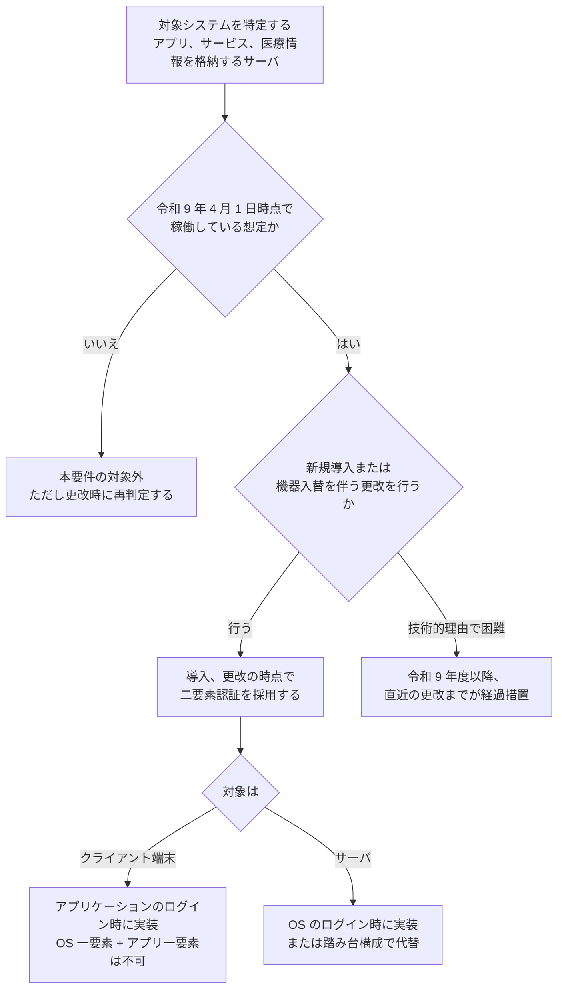
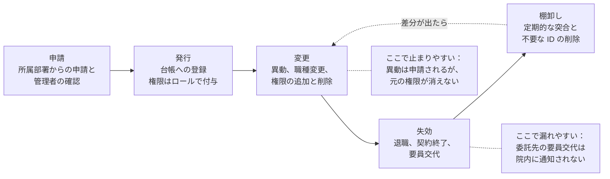

# 🔑 認証とアクセス管理

侵入を許すかどうかは、境界機器の脆弱性や委託先の状態で決まる。
侵入されたあとにどこまで広がるかは、この領域で決まる。

医療機関の認証設計には、他の業種にない制約が二つある。
一つは、認証を強くすると診療が遅れる場面が実在することである。
救急外来で手袋をしたまま患者情報を開く場面と、パスワードを 13 桁入力する要求は、同じ時間軸の上で衝突する。
もう一つは、認証の主体が職員だけではないことである。
ベンダの保守要員、医療機器そのもの、代行入力を行う医師事務作業補助者が、同じシステムに触れる。

本ページは、この制約の中で決められる範囲を扱う。
求められている水準、期限、代替が認められる構成、そして攻撃側から見たときにどこが最初に狙われるかを並べる。

> [!NOTE]
> **表記ルール**：本ページでは、**事実**（一次情報で確認できる内容。出典を併記する）、**報道ベース**（報道や第三者の集計のみで確認でき、当事者の公表資料では裏付けが取れていない内容）、**分析**（筆者の解釈）を書き分ける。

---

## 認証設計の効果をどこで測るか

[ネットワークの分離](segmentation.md)と同じく、認証設計の効果は「侵入されたかどうか」では測れない。
侵入された後、何段で基幹システムに届いたかで測る。

| 攻撃の段 | 認証設計の効き方 |
|---|---|
| 初期侵入 | 部分的に効く。VPN 装置や公開サービスに二要素認証があれば、窃取した資格情報だけでは入れない |
| 内部探索 | ほとんど効かない。到達性の問題であり、[分離](segmentation.md)の領域になる |
| 資格情報の窃取 | 効く。ローカル管理者の共通化と、平文で保存された認証情報の有無で結果が変わる |
| 水平展開 | 最も効く。奪った資格情報が他のサーバでも通るかどうかが、被害範囲を決める |
| 特権の掌握 | 効く。管理者アカウントの分離と、管理操作の経路の限定で段数が増える |
| バックアップの破壊 | 効く。バックアップ基盤の認証を業務ドメインから分けていれば、同時に失われない |

**事実**：大阪急性期・総合医療センターの調査委員会報告書は、攻撃者の手順として、給食事業者の端末から窃取した認証情報で病院給食サーバへ RDP 接続し、そこを踏み台に他サーバの認証情報を窃取したと記している。
報告書は「病院給食サーバーと他サーバーの ID・パスワードは共通で窃取は容易」と明記している（[調査報告書 概要（PDF）](https://www.gh.opho.jp/pdf/reportgaiyo_v01.pdf)、[事例](../threats/incidents/japan/2022-timeline.md#JP-2022-01)）。

**分析**：分離が破られた後に被害を全体へ広げたのは、脆弱性ではなく、共通化された認証情報だった。

---

## 医療現場で認証が緩む理由

現場の運用には、それぞれ理由がある。
理由を否定しても運用は戻らないため、理由を残したまま状態だけを変える方向で設計する。

| 現場の事情 | 生まれる状態 | 攻撃側から見た価値 | 崩さずに直す方向 |
|---|---|---|---|
| ナースステーションの端末を複数人で使う | ログオンしたまま放置される | 端末に触れれば、その職員の権限で操作できる | 画面ロックの時間短縮、IC カードによる高速な切り替え、離席時の自動ロック |
| 当直帯に人が入れ替わる | 当直用の共有 ID が作られる | 操作の主体が特定できず、監査でも追跡できない | 個人 ID を維持し、当直権限をロールとして付与する |
| 手袋と手指衛生で指紋認証が使えない | 認証手段が記憶認証だけになる | パスワードスプレーが成立する | IC カード、近接カード、ワンタイムトークンなど、非接触の第二要素を選ぶ |
| 緊急時に即座に情報が要る | 認証を迂回する経路が常設される | 常設された迂回路は、平時にも使える | ブレークグラスとして手順化し、期限と事後確認を付ける（後述） |
| 医師の入力を補助者が代行する | 補助者が医師の ID を借りる | 医師の権限で操作でき、記録の責任も転嫁される | 代行入力の機能を使い、入力者と確定者を分けて記録する |
| ベンダが 24 時間の保守を担う | 保守用アカウントが常時有効で共有される | 常時有効な高権限アカウントは、最優先の標的になる | 保守要員ごとの専用アカウント、必要時開放、作業記録との照合 |
| 医療機器が固定の資格情報を持つ | 機器の資格情報を変更できない | 一台から取れた資格情報が他機でも通る | 機器を[分離](segmentation.md)し、資格情報の再利用範囲を機器ゾーンに閉じる |

**分析**：表の左端は、いずれも患者の安全か診療の速度を理由に成立している。
そのため「規程で禁止する」だけでは戻らない。
右端の列のように、同じ速度を保ったまま識別を維持できる手段に置き換えたときにだけ、運用が定着する。

---

## 国内の要求水準

**事実**：以下は「医療情報システムの安全管理に関するガイドライン 第 7.0 版 システム運用編」（厚生労働省、2026 年 6 月）14 章および 10 章の記述である。
出典：[厚生労働省 医療情報システムの安全管理に関するガイドライン 第 7.0 版](https://www.mhlw.go.jp/stf/shingi/0000516275_00006.html)（[システム運用編 PDF](https://www.mhlw.go.jp/content/10808000/001716295.pdf)）

### 二要素認証の要否と期限

**事実**：令和 9 年度（令和 9 年 4 月 1 日時点）で稼働していることが想定される医療情報システムを、今後、新規導入または機器の入替等を伴うシステム更改をする際には、二要素認証を採用するか、これに相当する対応を行うことが遵守事項とされた。
技術的な理由等により令和 9 年度までの対応が困難な場合は、令和 9 年度以降、直近の次期の医療情報システムの更新までが期限とされている（14 章 遵守事項⑤）。

**事実**：ここでいう医療情報システムには、医療情報を作成、更新、閲覧、削除するアプリケーションまたはサービスのほか、医療情報を格納するサーバも含まれる（14.1.1）。

**事実**：要否は次の表で示されている（表 14-1）。

| 対象 | アプリケーション | ミドルウェア | OS |
|---|---|---|---|
| クライアント端末 | 要（注） | ー | ー |
| サーバ | ー | ー | 要 |

注：認証した情報をアプリケーションの資格情報等と連携し、適切な権限付与が可能な場合は、OS やミドルウェアでの二要素認証が許容される。
ただし「OS で一要素、アプリケーションで一要素」のような認証は許容されない。

**分析**：判定の要点は二つある。
第一に、この要件は「すべてのシステムを今すぐ」ではなく、更改の契機に紐づいている。
そのため、次の更改の仕様書に書き込めなかった時点で、期限を一世代分逃すことになる。
第二に、対象にサーバが含まれる点が見落とされやすい。
アプリケーションの二要素認証だけを整えても、データベースへ直接到達できるサーバ OS が一要素のままなら、要件を満たしていない。

### サーバ OS を踏み台構成で代替する

**事実**：サーバ OS のログイン時の二要素認証は、院内ネットワークやシステムの再構築を要する場合があるため、次の①②のいずれか、またはそれと同等以上の措置が施されていれば、二要素認証を実装できているものとみなすとされている。

| 構成 | 要件 |
|---|---|
| ① | 医療情報システムのサーバ群へのアクセスを、別ドメインに設置された踏み台端末からの RDP や SSH 等による接続のみに限定する。踏み台端末の OS ログイン時に二要素認証を実装する |
| ② | サーバ群へのアクセスを、別ドメインに設置された踏み台端末からの RDP、SSH 等による接続に限定する。踏み台端末に EDR 機能を具備し、運用上想定されない振る舞いを検知可能とする。医療機関等の外部からの接続は VPN を経由し、踏み台端末への RDP、SSH 等による接続に限定する |

**事実**：②の EDR 機能は、必ずしも EDR 製品を要さず、Windows の標準機能等で振る舞い検知が可能であればよいとされている。

**事実**：①②のいずれを採る場合も、次の三つが適用されていることが前提であり、満たされない場合は十分な措置とみなされない。

- 外部から踏み台端末にログインするユーザに管理者権限を与えない
- 十分な OS のセキュリティアップデート
- 医療情報システムサーバ群と踏み台端末で共通のパスワードを利用しない

**事実**：「同等以上の措置」については、医療法に基づく立入検査の際に同等性を検査職員に対して説明できること、が例として脚注に示されている。

**分析**：三つの前提は、いずれも踏み台構成が実際には迂回されるときの条件を潰している。
踏み台の利用者に管理者権限があれば、踏み台自体を改変して認証を素通しにできる。
踏み台とサーバ群でパスワードが共通なら、踏み台を取った時点でサーバ群も取れる。
つまり前提条件が本体であり、踏み台の設置は形式にすぎない。

### パスワードの扱い

**事実**：二要素認証を採用していることを前提とした場合、パスワードの桁数は 8 桁（PIN であれば 4 桁）以上、英数字の混在（大文字小文字は問わない）が求められる。
二要素認証を採用していない場合は 13 桁以上とし、システムの仕様上 13 桁以上を設定できない場合は設定可能な最大桁数を設定したうえで、直近の更改、新規導入時に必ず対応することとされている。

**事実**：いずれの場合も、パスワードの定期的な変更は不要とされている。

**事実**：PIN は「特定のデバイスにおける電子証明書等の使用のための 4-8 桁の暗証番号」と定義されている。

**事実**：14 章 遵守事項⑥は、類推されやすいパスワードを設定できないよう制限を設けること、異なる医療情報システム間でパスワードを使い回さないこと、パスワードファイルはハッシュ値の保存等により平文を復元できない状態にすること、システム運用担当者であっても利用者のパスワードを推定できないようにすること（設定ファイルに平文で記載しない）、一定回数の認証失敗後に一定時間ログイン試行を不能にすることを求めている。

**事実**：VPN 装置についても、パスワードの使い回しや単純なパスワードの利用による被害が多発しているとして、記憶認証のみに依存せず二要素認証等を導入することが望ましいとされている。

**分析**：13 桁という数字は、記憶認証だけでパスワードスプレーとオフライン解析に耐えさせるための値である。
現場に定着させるなら、桁数を伸ばす交渉より、第二要素を入れて 8 桁に戻す交渉のほうが通りやすい。

### ID の台帳と棚卸し

**事実**：医療情報システムで用いる ID について、台帳管理等を行うほか、定期的に棚卸しを行い、不要なものは適宜削除すること、およびその手順を作成することが遵守事項とされている（14 章 遵守事項⑧）。

**事実**：アクセス権限は、情報区分ごと、利用者や利用者グループごとに規定し、必要最小限とすることが求められる。
人事異動等による担当業務の変更に合わせて見直す必要がある（14.2）。

**事実**：利用者がアプリケーションを使う際に端末の OS の管理者権限を要するような製品は、過度の権限付与を避けるため選定しないこととされている（14.2）。

**事実**：クラウドサービスでは、設定（ポリシー）が既定値へ戻る等により、アクセス権限が意図せず変更され、医療情報が意図しない相手先に送信されるリスクがあるとして、意図せぬ設定変更を自動的に検知して運用に反映できる措置が求められている（14.2）。

### 緊急時のバイパス

**事実**：利用者の識別、認証に IC カード等のセキュリティデバイスを用いる場合、デバイスの破損等を想定し、緊急時の代替手段によるバイパス等、一時的なアクセスルールを用意することが遵守事項とされている（14 章 遵守事項③）。

### 記録の確定と代行入力

**事実**：14.3 は、真正性を「正当な権限で作成された記録に対し、虚偽入力、書換え、消去及び混同が防止されており、かつ、第三者から見て作成の責任の所在が明確であること」と定義している。
混同とは、患者を取り違えた記録がなされること、記録された情報間の関連性を誤ることを指すと明記されている。

**事実**：代行入力が行われた場合は、誰の代行がいつ誰によって行われたかの管理情報を、代行入力の都度記録することが求められる。
代行入力により記録された診療録等は、できるだけ速やかに確定者による確定操作（承認）が行われるようにし、この際、内容の確認を行わずに確定操作を行ってはならないとされている（14 章 遵守事項⑨(5)(6)）。

**分析**：代行入力は、認証の問題であると同時に記録の責任の問題である。
補助者が医師の ID を借りる運用は、認証の観点では ID 共有、記録の観点では作成責任の所在の喪失にあたる。
一方だけを指摘しても運用は変わらないため、両方の要求が同じ機能で満たされることを示す必要がある。

---

## 保守アカウントとリモート保守

**事実**：10 章 遵守事項③は、保守作業のためにサーバに事業者の作業員がアクセスする際、保守要員の専用アカウントを使用させ、個人情報へのアクセスの有無、アクセスした対象個人情報、作業内容を記録することを求めている。
利用者を模して操作確認を行う際の識別、認証についても同様とされている。

**事実**：同④⑤は、リモートメンテナンスを行う場合に外部接続等への対策を講じること、リモートメンテナンスによる改造、保守作業では必ずアクセスログを収集し、作業終了時に作業計画書と照合して確認し、終了後速やかに企画管理者へ報告して確認を求めることを定めている。

**事実**：同①は、動作確認等の保守作業で事業者が個人情報を含むデータを使用したときは、保守終了後に確実にデータを消去させ、その結果の報告を求めることを定めている。
出典：[医療情報システムの安全管理に関するガイドライン 第 7.0 版 システム運用編（PDF）](https://www.mhlw.go.jp/content/10808000/001716295.pdf) 10 章

**分析**：保守アカウントは、権限の高さと、利用者が組織の外にいることの両方を備える。
[ネットワークの分離](segmentation.md)で保守回線が例外として扱われるのと同じ理由で、認証でも例外になりやすい。
専用アカウント、必要時開放、作業計画書との照合という三点は、いずれも「作業の記録と、システムに残る痕跡を突き合わせられる状態」を作るためのものである。

---

## 海外の要求水準

**事実**：米国では、HIPAA Security Rule の改正案（NPRM）が 2024 年 12 月 27 日に公表され、2025 年 1 月 6 日に Federal Register へ掲載された。
多要素認証の使用、保存時と転送時の暗号化、資産目録の作成などを、限定的な例外を除いて求める内容である。
意見募集は 2025 年 3 月 7 日に締め切られた（[HHS ファクトシート](https://www.hhs.gov/hipaa/for-professionals/security/hipaa-security-rule-nprm/factsheet/index.html)、[Federal Register 2024-30983](https://www.federalregister.gov/documents/2025/01/06/2024-30983/hipaa-security-rule-to-strengthen-the-cybersecurity-of-electronic-protected-health-information)）。

**事実**：2026 年 8 月時点で最終規則は公表されておらず、現行の Security Rule が引き続き適用される。

**事実**：HHS が 2024 年 1 月 24 日に公表した医療分野向けのサイバーセキュリティ性能目標（HPH CPG）は、必須（Essential）と発展（Enhanced）の二層で構成され、多要素認証は必須側に置かれている（[海外のガイドライン、法規制](../guidelines/global.md)）。

**分析**：日本の第 7.0 版と米国の改正案は、要求の中身が近い。
国際的に事業を展開する製薬企業や、海外ベンダの製品を導入する医療機関では、二つの要求を別々に管理せず、同じ統制の記録で両方を説明できる形にしておくと運用が軽くなる。

---

## 医療 DX が持ち込む要求

**事実**：電子処方箋では、処方箋の発行に HPKI（保健医療福祉分野の公開鍵基盤）による電子署名が用いられる（[医療 DX：国の基盤と接続点](dx-ax/medical-dx.md)）。

**報道ベース**：救急時医療情報閲覧機能について、2025 年 4 月 1 日以降、電子カルテがこの機能を備えていることが総合入院体制加算、急性期充実体制加算、救命救急入院料の算定要件に含まれるようになったとされる。
この機能を利用する医療機関では、閲覧者が電子カルテにアクセスする際に二要素認証が必要になるとされている。
診療報酬上の要件は、厚生労働省の通知原文で確認したうえで判断してほしい（[セキュリティサービスのカタログ 国内](../reference/security-services/japan.md)）。

**分析**：国の基盤に接続するほど、認証は「院内の規程」ではなく「接続の条件」になる。
院内で二要素認証を先送りしてきた組織は、基盤への接続や診療報酬の要件という別の入口から同じ要求に直面する。
先に院内の ID 基盤を整えたほうが、個別の要求ごとに継ぎ足すより結果として安くなる。

---

## ID のライフサイクル

認証の設計が崩れるのは、多くの場合、発行時ではなく変更時と終了時である。

**事実**：14 章 遵守事項④は、規程に基づいてアクセス権限を付与する場合、利用者が所属する部署等からの申請などを踏まえて権限を付与し、その結果について申請部署の管理者からの確認を得る等の手順を作成することを求めている。

対象は職員だけではない。

| 種別 | 具体例 | 失効の契機が見えにくい理由 | 対応 |
|---|---|---|---|
| 職員 | 医師、看護師、技師、事務 | 異動時に権限が加算されていく | 人事情報との定期突合、ロールベースでの付与 |
| 委託先の要員 | 保守、清掃、給食、警備 | 要員の交代が院内へ通知されない | 契約に要員名簿の更新義務を書く、期間を区切って発行する |
| 研修医、実習生、非常勤 | 短期間で入れ替わる | 終了日が管理されない | 発行時に失効日を必須にする |
| 非人間のアカウント | サービスアカウント、機器のアカウント、バッチ処理 | 所有者が決まっていない | 台帳に所有部署を書く、権限を最小化する、認証情報の保管場所を決める |
| 共用の端末とアカウント | 当直用、外来受付用 | 廃止すると業務が止まる | 個人 ID を維持し、端末側で切り替えを速くする |

**分析**：棚卸しは、名簿と ID を突き合わせる作業として設計されがちだが、最も効くのは「所有者が特定できない ID を列挙する」ことである。
所有者が特定できない ID は、無効化しても誰からも苦情が出ないか、業務が止まって初めて所有者が判明する。
どちらの結果も、台帳の精度を上げる。

---

## ブレークグラスの設計

緊急時に認証を迂回する手順は、禁止すると別の形で常設される。
手順として設計し、痕跡が残る形にするほうが安全になる。

| 設計項目 | 決めること | 決めていないと起きること |
|---|---|---|
| 発動条件 | どの事象で使えるか（患者の意識障害、システム障害、災害時） | 平時の業務効率のために使われる |
| 発動者 | 誰が判断し、誰が実行するか | 誰でも使えるアカウントになる |
| 認証手段 | 封緘したパスワード、専用 IC カード、管理者による一時発行 | 共有パスワードが常設される |
| 有効範囲 | どのシステム、どの患者、どの操作までか | 全権限のアカウントが渡る |
| 有効期限 | 何時間で自動失効するか | 使われたまま残る |
| 記録 | 使用の事実、使用者、対象、理由をどこに残すか | 事後に誰が何を見たか分からない |
| 事後確認 | 誰が、いつまでに、何と突き合わせるか | 記録は残るが読まれない |

**分析**：ブレークグラスの価値は、緊急時に使えることよりも、平時に使われたことを検知できることにある。
使用が記録され、翌営業日に必ず確認されると分かっていれば、便宜のための使用は自然に減る。

---

## 攻撃側から見た認証

自組織の許可を得た検証で、認証まわりは最初に確認する領域になる。
以下は、公表された事例と、防御側が観測できる痕跡を対応づけた整理である。

| 手口 | 成立する条件 | 防御側に残る痕跡 | 緩和 |
|---|---|---|---|
| パスワードスプレー | ロックアウトが緩い、共通の弱いパスワード、外部公開された認証口 | 同一 IP から多数のアカウントへの少数回の失敗 | 二要素認証、失敗回数の制限、既知の弱いパスワードの拒否 |
| クレデンシャルスタッフィング | 他サービスからの漏えい資格情報の再利用 | 未知の IP からの成功ログイン、通常と異なる時間帯 | 漏えい済み資格情報との照合、二要素認証、異常検知 |
| ローカル管理者の共通化を利用した水平展開 | 全端末、全サーバで同じ管理者パスワード | 短時間に多数のホストへの管理者ログオン | 端末ごとに異なる管理者パスワード、管理者ログオンの経路限定 |
| 保守アカウントの悪用 | 常時有効、共有、初期パスワードのまま | 保守時間外のログオン、作業計画にない接続 | 専用アカウント、必要時開放、作業計画書との照合 |
| 設定ファイル内の平文パスワード | 運用手順としてスクリプトに直書き | ファイル参照そのものは目立たない | 認証情報の保管場所を分ける、権限を絞る、定期的な走査 |
| 特権アカウントによるバックアップの削除 | 業務ドメインの管理者でバックアップ基盤に到達できる | バックアップ基盤での認証成功と削除操作 | 認証ドメインの分離、削除操作の多要素承認、[分離](segmentation.md) |

**事実**：23andMe に対する攻撃は、他のサービスから漏えいした資格情報を用いたクレデンシャルスタッフィングであった。
カナダのプライバシーコミッショナーと英 ICO の共同調査は、多要素認証が任意であり採用率が 22% 未満だったこと、パスワードの最低長が 8 文字であったこと、既知の漏えい資格情報との照合を行っていなかったこと、生の遺伝データのダウンロードに追加の検証がなかったことを不備として認定した（[PIPEDA Findings #2025-001](https://www.priv.gc.ca/en/opc-actions-and-decisions/investigations/investigations-into-businesses/2025/pipeda-2025-001/)）。

**分析**：この四点は、患者ポータルにそのまま置き換えられる。
医療機関が運営する患者向けサービスは、利用者が他サービスと同じパスワードを使う前提で設計する必要がある。
そのうえで、大量の情報を一度に取得できる機能（検査結果の一括ダウンロード、家族分の閲覧、紹介状の共有）には、追加の検証を置く（[患者用ポータルの脆弱性](web-security/patient-portal.md)）。

### 検証をどう進めるか

**分析**：稼働中の医療情報システムに対する認証の検証は、アカウントロックによって診療を止めうる。
そのため、次の順で進めると影響を抑えられる。

1. 設定の確認から始める（ロックアウトの閾値、パスワードポリシー、二要素認証の適用範囲、権限の一覧）
2. 台帳と実データを突き合わせる（有効な ID の一覧、最終ログオン日時、所有者不明の ID、無効化されていない退職者）
3. 認証情報の再利用範囲を、実際の試行ではなく構成情報から確認する（ローカル管理者の管理方式、サービスアカウントの配置）
4. 試行を伴う検証は、対象アカウントと時間帯を限定し、ロックアウトを解除できる担当者を待機させたうえで実施する
5. 検証の記録を、起点、対象、時刻、結果の形で残し、防御側のログに何が残ったかを併せて確認する

**分析**：5 の「何が残ったか」の確認が、検証の成果として最も長く効く。
攻撃が成立したかどうかより、成立したときに気づけるかどうかのほうが、次の設計に直結する（[ログと監視](logging.md)）。

---

## 実務チェックリスト

**棚卸し**
- [ ] 医療情報システムごとに、認証方式（記憶認証のみ、二要素）を一覧にした
- [ ] 医療情報を格納するサーバの OS ログインの認証方式を確認した
- [ ] ID の台帳を作り、所有者不明の ID を列挙した
- [ ] 委託先要員のアカウントと、契約上の要員名簿を突き合わせた
- [ ] 非人間のアカウント（サービス、機器、バッチ）の所有部署を特定した

**設計**
- [ ] 次期更改の仕様書に、二要素認証の要件を書き込んだ
- [ ] サーバ OS を踏み台構成で代替する場合、前提の三条件を満たす設計にした
- [ ] 管理者権限を要するアプリケーションを、選定基準から除外した
- [ ] バックアップ基盤の認証を、業務ドメインから分離した
- [ ] ブレークグラスの発動条件、有効期限、事後確認を文書化した

**運用**
- [ ] ID の棚卸しの周期と、実施責任者を決めた
- [ ] 保守要員に専用アカウントを発行し、必要時開放に切り替えた
- [ ] リモート保守のログを収集し、作業計画書と照合する手順を作った
- [ ] 代行入力を機能として運用し、確定操作の実施状況を確認している
- [ ] クラウドサービスの権限設定の変更を検知する仕組みを入れた

**確認**
- [ ] ロックアウト設定を確認したうえで、限定した範囲で認証の検証を行った
- [ ] 検証時に防御側のログへ何が残ったかを確認した
- [ ] 立入検査で「同等以上の措置」を説明できる資料を用意した

---

## 関連ページ

- [ネットワークの分離](segmentation.md)：到達性の制御。認証と組み合わせて初めて水平展開が止まる
- [ログと監視の設計](logging.md)：認証の失敗と成功を、どこに残し、どう読むか
- [防御プレイブック](../threats/actors/defense-playbook.md)：対策の着手順序
- [組織の脆弱性の分類](../threats/actors/organizational-vulnerabilities.md)：委託先と契約に起因する構造
- [患者用ポータルの脆弱性](web-security/patient-portal.md)：患者向けサービスでの認証と認可
- [医療 DX：国の基盤と接続点](dx-ax/medical-dx.md)：HPKI と電子署名
- [国内のガイドラインと法規制](../guidelines/japan.md)：第 7.0 版の全体像と、各編の読み分け
- [海外のガイドラインと法規制](../guidelines/global.md)：HIPAA Security Rule と HPH CPG
- [診断とペネトレーションテスト](../practice/pentest/)：認証まわりの検証の位置づけ
- [セキュリティの基礎](../reference/security-basics.md)：最小権限とゼロトラストの前提

---

[← 技術領域](README.md) | [トップへ](../../README.md)
