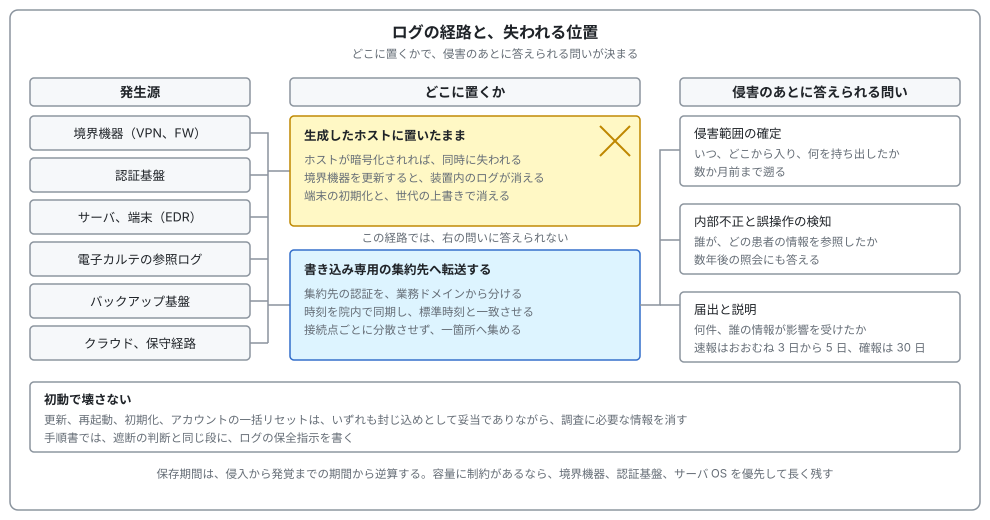
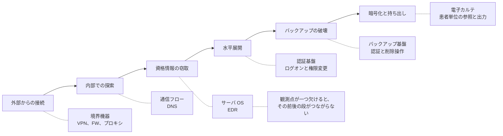

# 🪵 ログと監視の設計

公表された調査報告書を読むと、同じ記述が繰り返し現れる。
侵入経路は特定できたが、どこまで見られたかは確定できなかった、という記述である。

この差は、防御の強さではなくログの設計で決まる。
攻撃を止められなかったことと、何をされたか説明できないことは別の失敗であり、後者は事前の設計だけで避けられる。

本ページは、何を、どこに、どれだけ残し、誰が読むかを扱う。
到達性の制御は[ネットワークの分離](segmentation.md)、認証の設計は[認証とアクセス管理](identity.md)で扱う。

> [!NOTE]
> **表記ルール**：本ページでは、**事実**（一次情報で確認できる内容。出典を併記する）、**報道ベース**（報道や第三者の集計のみで確認でき、当事者の公表資料では裏付けが取れていない内容）、**分析**（筆者の解釈）を書き分ける。

---

## 三つの用途で、必要なログが違う

ログは一つの目的のために取るものではない。
医療機関では、次の三つが同時に要求される。

| 用途 | 答えるべき問い | 主に使うログ | 期限 |
|---|---|---|---|
| 侵害範囲の確定 | いつ、どこから入り、どこへ広がり、何を持ち出したか | 認証、境界機器、通信フロー、EDR、サーバ OS | 調査の期間。数か月前まで遡る |
| 内部不正と誤操作の検知 | 誰が、どの患者の、どの情報を、なぜ参照したか | 電子カルテの参照ログ、権限変更の記録 | 継続的。申告や照会は数年後にも来る |
| 届出と説明 | 何件、誰の情報が、どの範囲で影響を受けたか | 上の二つを患者単位に集計できる形 | 速報はおおむね 3 日から 5 日、確報は 30 日（[国内のガイドラインと法規制](../guidelines/japan.md)） |

**分析**：三つ目の期限が、設計の制約として最も強く効く。
確報までに患者単位の影響範囲を出す必要があるのに、参照ログが患者 ID を含まない形式だと、期限内に集計できない。
「ログはあるが、届出に使えない」という状態は、ログがない状態と実務上あまり変わらない。

三つの用途に答えられるかは、ログをどこに置いたかで決まる。

---

## 国内の要求水準

**事実**：以下は「医療情報システムの安全管理に関するガイドライン 第 7.0 版 システム運用編」（厚生労働省、2026 年 6 月）17 章の記述である。
出典：[厚生労働省 医療情報システムの安全管理に関するガイドライン 第 7.0 版](https://www.mhlw.go.jp/stf/shingi/0000516275_00006.html)（[システム運用編 PDF](https://www.mhlw.go.jp/content/10808000/001716295.pdf)）

**事実**：利用者のアクセスについて、アクセスログ等を記録し、定期的にログを確認することが遵守事項とされている。
アクセスログは、少なくとも利用者のログイン時刻、アクセス時間、ログイン中に操作した医療情報が特定できるように記録することとされている。

**事実**：医療情報システムにアクセスログの記録機能がない場合は、業務日誌等により操作者と操作内容を記録することが求められる。

**事実**：ログへのアクセス制限を行い、不当な削除、改ざん、追加を防止する対策を実施することが遵守事項とされている。

**事実**：ログの記録に用いる時刻は信頼できる情報を利用し、医療機関等の内部で同期させるとともに、標準時刻と定期的に一致させることとされている。

**事実**：確認は全件の目視を指すのではなく、システムでの監視や、運用に基づく適切な閾値でのスクリーニング後のログを確認することが想定されている。

**事実**：アクセスログを分析し、緊急時にアラートを発する仕組みを講じることも求められている。

**事実**：外部ネットワークとの接続点を集約する際は、サービスごとにログ管理を分散させず、接続先制御、監査ログ集約、責任分界の整理を一元管理することが負担軽減に有効であるとされている。

**事実**：医療情報システムの管理を委託している場合は、事業者との間でログの管理方法や提供等について明確に取り決めることが求められる。

**事実**：リモートメンテナンスによるシステムの改造、保守作業が行われる場合には、必ずアクセスログを収集し、作業終了時に作業計画書と照合するなどの確認を実施することが遵守事項とされている（10 章 遵守事項⑤）。

**分析**：ここで実務上の分岐になるのは、委託先との取り決めである。
運用を委託している場合、ログは委託先の環境に存在し、インシデント時に医療機関が直接取得できないことがある。
契約に「保全の依頼から提供までの時間」と「保存期間」が書かれていないと、確報の期限と噛み合わない。

---

## 何を残すか

侵害の各段階に対応する観測点を並べる。
どれか一つが欠けても、その段の前後がつながらなくなる。

| 層 | 具体的なログ | 侵害時に答えられる問い | 欠けたときに起きること |
|---|---|---|---|
| 境界機器 | VPN の接続履歴、ファイアウォールの通過と遮断、プロキシの宛先 | いつ、どの資格情報で、どこから入ったか | 初期侵入の時刻と経路が特定できない |
| 認証基盤 | ログオンの成功と失敗、Kerberos や NTLM の記録、権限変更 | 誰の資格情報が使われ、どこまで権限が広がったか | 水平展開の経路が推測になる |
| サーバ OS | プロセス起動、サービス登録、タスク登録、ローカルアカウント作成 | 何が実行され、どこに居座ったか | 永続化の有無が判定できない |
| エンドポイント | EDR の検知と実行履歴 | 端末単位で何が起きたか | 端末を初期化した時点で情報が消える |
| ネットワーク | 通信フロー、DNS 問い合わせ、大量転送の記録 | 何が外部へ出たか | 持ち出しの有無を「痕跡がない」としか言えない |
| 電子カルテ | 患者単位の参照、更新、印刷、出力 | 誰のどの情報が見られたか | 届出の対象者を確定できない |
| バックアップ基盤 | 認証、世代の削除、設定変更 | 復旧手段がいつ失われたか | 復旧不能の原因が判定できない |
| クラウド | 管理 API の操作、権限変更、鍵の利用 | 設定がいつ、誰に変更されたか | 意図せぬ公開の発生時期が分からない |
| 保守経路 | 踏み台へのログオン、保守作業中の操作 | 保守と攻撃を切り分けられるか | 正規の保守と侵害の区別がつかない |

**分析**：医療機関に固有なのは、下から三行目の電子カルテの参照ログである。
一般企業のインシデント対応では「どのファイルサーバから何 GB 出たか」で範囲を語れるが、医療では「誰の診療情報が見られたか」を患者単位で答える必要がある。
この粒度は、事後にネットワークのログから復元できない。
システム側が最初から患者 ID を含む参照ログを出力していなければ、確報は推計になる。

---

## 時刻、保護、集約

三つとも、侵害の後で追加できない性質を持つ。

**時刻**：時刻源を院内で同期し、標準時刻と一致させる。
機器ごとに時刻がずれていると、複数のログを時系列に並べられない。
医療機器や古い部門システムは、時刻同期の設定が初期値のまま放置されやすい。

**保護**：ログを生成したホストにだけ置くと、そのホストが暗号化された時点で失われる。
書き込み専用の集約先へ転送し、集約先の認証を業務ドメインから分ける。

**集約**：接続点ごとに分散させず、一箇所へ集める。
第 7.0 版が、接続点の集約とあわせて監査ログの集約を挙げているのは、平時の管理負担と、有事の調査速度の両方に効くためである。

---

## 保存期間をどう決めるか

**分析**：保存期間を「規程にそう書いてあるから」で決めると、実際の調査に足りない長さになりやすい。
決め方は二段階になる。

第一に、診療録等の法定保存期間と、ログの保存期間は別の議論である。
診療録の保存義務は記録そのものに課されるものであり、アクセスログの保存期間を直接定めるものではない。

第二に、必要な長さは、侵入から発覚までの期間から逆算する。
公表された事例では、侵入から発覚まで数か月を要したものがある。

**事実**：23andMe に対するクレデンシャルスタッフィングは 2023 年 4 月から 9 月にかけて行われ、公表は同年 10 月だった。
規制当局は、異常な事象が個別に検知されながら、全体として進行中の攻撃を示すものとして調査されなかったことを不備として認定している（[PIPEDA Findings #2025-001](https://www.priv.gc.ca/en/opc-actions-and-decisions/investigations/investigations-into-businesses/2025/pipeda-2025-001/)）。

**事実**：Change Healthcare への攻撃では、影響を受けた個人の数の届出が段階的に更新され、2025 年 7 月 31 日時点で 1 億 9270 万人となった（[OCR Breach Portal](https://ocrportal.hhs.gov/ocr/breach/breach_report.jsf)）。

**分析**：この二つは、ログの保存期間を決める材料になる。
発覚が数か月遅れる前提に立つなら、境界機器と認証基盤のログは、少なくともその期間を超えて残す必要がある。
容量の制約がある場合は、全てを同じ期間残すのではなく、上の表の上から三行（境界、認証、サーバ OS）を優先して長く残す設計にする。

---

## 初動でログを壊さない

**事実**：大阪急性期・総合医療センターの調査報告書は、VPN 装置について、2022 年 10 月 31 日 19 時ごろに最新バージョンへ更新したためログが消失し、後日、当該装置のバージョンが 5.4.8 であったことを確認したと記している（[調査報告書 概要（PDF）](https://www.gh.opho.jp/pdf/reportgaiyo_v01.pdf)、[事例](../threats/incidents/japan/2022-timeline.md#JP-2022-01)）。

**分析**：異常を認知した直後の行為は、封じ込めと証跡の保全のあいだで衝突する。
更新、再起動、初期化は、いずれも封じ込めとしては妥当な選択でありながら、調査に必要な情報を消しうる。
判断を有事に委ねず、順序を事前に決めておく。

| 初動の行為 | 失われうるもの | 先に行うこと |
|---|---|---|
| 境界機器のファームウェア更新 | 装置内のログ、設定、稼働バージョンの記録 | 設定とログのエクスポート、バージョンの記録 |
| 端末の再起動 | メモリ上の情報、実行中プロセス | 電源を維持したままネットワークから切り離す |
| 端末の初期化と再構築 | ディスク上の痕跡 | イメージの取得 |
| アカウントの一括リセット | 攻撃者がどのアカウントを使っていたかの手掛かり | 対象アカウントの直近の認証記録を保全 |
| ログの世代を上書きする通常運用 | 侵入初期の記録 | ログの保全指示を、遮断の判断と同時に出す |

**分析**：この表の右列は、いずれも数分で終わる作業である。
にもかかわらず有事に飛ばされるのは、手順書の中で「遮断」と「保全」が別の章に書かれているためである。
[インシデント対応](../response/)の初動手順では、同じ段に並べて書く。

---

## 医療機器ゾーンで EDR が入らないとき

**分析**：医療機器と製造設備には、承認された構成を変更できないという制約がある。
エージェントを入れられない対象では、観測点を機器の外側に移す。

| 手段 | 何が見えるか | 制約 |
|---|---|---|
| スイッチのミラーポートによる受動観察 | 機器が誰と通信しているか、想定外の宛先 | 暗号化された内容は見えない。設置場所の選定が要る |
| 通信フローの記録 | 通信量の急増、新しい宛先 | 個々の操作までは分からない |
| DNS の問い合わせ記録 | 外部への名前解決、既知の悪性ドメイン | 直接 IP へ接続する通信は捕捉できない |
| 機器が出力する syslog | 機器側で記録される事象 | 出力の有無と項目はメーカー依存 |
| 接続元の側で記録する | 機器へアクセスした端末とアカウント | 機器側で完結する操作は見えない |

**分析**：受動観察は、機器に一切のパケットを送らないため、[医療機器の検証手法](medical-devices/testing-methodology.md)が求める非侵襲の原則と両立する。
機器ゾーンの監視は、まずここから始めるのが安全である。

---

## 読む仕組みを作る

集めただけのログは読まれない。
第 7.0 版が全件目視ではなく閾値によるスクリーニングを想定していることを踏まえ、次の三点を決める。

**何をアラートにするか**：深夜帯の大量参照、退職予定者の広範な参照、通常と異なる端末からの管理者ログオン、バックアップ基盤での削除操作など、件数が少なく、確認の負担が小さいものから始める。

**誰がいつ見るか**：当直帯に情報システム部門が不在の組織では、アラートの宛先が翌営業日になる。
夜間に届いても誰も見ないなら、夜間の検知は事実上ないものとして設計する。
外部の監視サービスを使う場合は、通報先と、遮断の判断を誰が持つかを契約で決める。

**委託先とどう分担するか**：ログの保存場所、保全依頼から提供までの時間、費用負担、インシデント時の優先対応を、契約書に記載する。

---

## 攻撃側から見たログ

**分析**：侵入する側は、検知される可能性を段階ごとに評価している。
どの段でログが残らないかが分かれば、そこを通る。
以下は、防御側が「残っているはず」と考えている記録が、実際には残らない典型である。

| 攻撃の段 | 残るはずの記録 | 残らない典型的な理由 | 対抗 |
|---|---|---|---|
| VPN への資格情報の再利用 | 認証成功の記録 | 装置のログを外部へ転送しておらず、装置内で上書きされる | 集約先への転送、保存期間の確認 |
| 正規ツールによる内部探索 | プロセス起動の記録 | サーバ OS の監査設定が既定のままで記録されない | 監査ポリシーの設定、EDR の導入 |
| 管理者アカウントでの水平展開 | 認証の記録 | 記録はあるが、正規の運用と区別できない | 経路の限定、特権操作の場所と時間の把握 |
| バックアップの削除 | 削除操作の記録 | バックアップ基盤のログを業務ドメイン側に置いている | 認証の分離、削除の多要素承認 |
| データの持ち出し | 通信量の記録 | フローを取得していない、正規のクラウドサービス宛で目立たない | 宛先と量の基準値の把握 |
| 痕跡の削除 | イベントログのクリア記録 | 集約していなければ、クリアされた事実ごと消える | 生成と同時に転送する構成 |

**分析**：ホスト上のログは、攻撃者が管理者権限を取った時点で攻撃者の管理下に入る。
生成と同時に別の管理下へ送っている場合にのみ、消された事実そのものが記録として残る。

### 検証で確かめること

自組織の許可を得た検証では、脆弱性の有無と同じ比重で「何が記録されたか」を確認する。

1. 検証の実施記録を、起点、対象、時刻、操作の形で残す
2. 検証後に、防御側のログとアラートで何が観測されたかを突き合わせる
3. 観測されなかった操作について、記録されない理由を特定する（設定、転送、保存期間、製品の仕様）
4. 対応表を作る（攻撃の段、期待した記録、実際の記録、差分の原因、対応の期限）

**分析**：この対応表は、次年度の予算要求で最も説得力を持つ成果物になる。
「脆弱性が見つかった」より「侵入されても気づけない段が三つある」のほうが、経営層に伝わる形になる（[経営とガバナンス](../governance/)）。

---

## 実務チェックリスト

**設計**
- [ ] 侵害範囲の確定、内部不正の検知、届出の三つの用途で、必要なログを洗い出した
- [ ] 電子カルテの参照ログが、患者単位で集計できる形式か確認した
- [ ] 境界機器、認証基盤、サーバ OS のログを集約先へ転送している
- [ ] 集約先の認証を、業務ドメインから分離した
- [ ] 時刻同期を、医療機器と部門システムを含めて確認した

**保存**
- [ ] 保存期間を、発覚までの想定期間から逆算して決めた
- [ ] 容量制約がある場合の優先順位（境界、認証、サーバ OS）を決めた
- [ ] 委託先が保持するログについて、保存期間と提供までの時間を契約に書いた

**運用**
- [ ] アラートの対象を、件数の少ない事象から選定した
- [ ] 夜間と休日のアラートの宛先と、判断者を決めた
- [ ] 定期的な確認の周期と、確認結果の記録の残し方を決めた
- [ ] リモート保守のログと、作業計画書を照合する運用にした

**有事**
- [ ] 遮断の判断と同時に、ログの保全指示を出す手順にした
- [ ] 境界機器の更新や端末の初期化の前に行う保全作業を、手順書に書いた
- [ ] 検証や演習のあとに、何が記録されたかを突き合わせた

---

## 関連ページ

- [認証とアクセス管理](identity.md)：認証の記録は、この設計の中心に来る
- [ネットワークの分離](segmentation.md)：接続点の集約と、監査ログの集約は同じ設計に属する
- [インシデント対応と事業継続](../response/)：初動での保全と、届出の期限
- [医療機器の検証手法](medical-devices/testing-methodology.md)：非侵襲の観察
- [ダークウェブと医療情報](../threats/actors/dark-web-medical-data.md)：届出と公表の時間軸
- [国内のガイドラインと法規制](../guidelines/japan.md)：報告義務と期限
- [経営とガバナンス](../governance/)：検知できない範囲を、投資の根拠として示す

---

[← 技術領域](README.md) | [トップへ](../../README.md)
