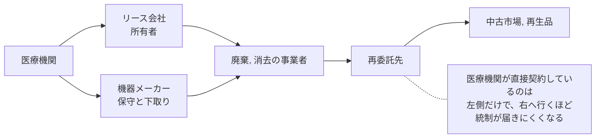

# 🗑️ 記憶媒体の廃棄と機器の下取り

セキュリティの議論は、稼働している資産に集まる。
一方で、組織の管理から外れていく資産には、同じ注意が向かない。
リース期限を迎えたサーバ、更新された端末、下取りに出す医療機器、返却する複合機は、いずれも中身を持ったまま外へ出る。

医療機関では、この経路に固有の事情が二つある。
機器のライフサイクルが長いため、中古市場が成立していることと、機器の内部構成をメーカーしか把握していないことである。

> [!NOTE]
> **表記ルール**：本ページでは、**事実**（一次情報で確認できる内容。出典を併記する）、**報道ベース**（報道のみで確認でき、当事者の公表資料では裏付けが取れていない内容）、**分析**（筆者の解釈）を書き分ける。

---

## 対象になる機器

| 機器 | 残るもの | 見落とされる理由 |
|---|---|---|
| サーバ、ストレージ | 診療データ、バックアップ、認証情報 | リース返却の窓口が総務や用度で、情報システム部門を経由しないことがある |
| 端末 | ローカルに保存された文書、資格情報、ブラウザの保存情報 | 台数が多く、一台ずつの確認が省かれる |
| 複合機 | 印刷、スキャン、FAX の蓄積画像、アドレス帳 | 記憶装置を持つ認識がない |
| PACS のワークステーション | 医用画像、サーバの接続設定 | 医療機器としてメーカー管理下にあり、廃棄の窓口が別になる |
| 生体情報モニタ、輸液ポンプ | 患者情報、無線ネットワークの資格情報 | 台数が多く、更新のたびに下取りに出る |
| ネットワーク機器 | 設定、鍵、認証情報、ログ | 「データを持たない機器」と見なされる |
| 可搬媒体 | 検査データ、バックアップ、持ち出し用の資料 | 個人が管理していて台帳にない |
| 携帯端末 | 業務アプリの資格情報、患者情報 | 私物との区別が曖昧なまま返却される |

**分析**：この表で最も抜けやすいのは、下から二行と、上から三行目である。
いずれも「データを保存している機器」として認識されていないことが原因であり、消去の手順以前に、対象の一覧に入っていない。

---

## 医療機器に残るのは患者情報だけではない

**事実**：Rapid7 は 2023 年 8 月 2 日、中古市場（eBay 等）で入手した輸液ポンプ 13 台を調査し、少なくとも 8 台に、前所有組織の無線ネットワークの事前共有鍵（PSK）が残存していたと公表した。
機器の取得と手放しに関する方針と手順、所有と統制の所在、データの消去方法を定めること、リース機器では消去の期待値を契約に含めることを推奨している。
出典：[Rapid7 Security Implications from Improper De-acquisition of Medical Infusion Pumps](https://www.rapid7.com/blog/post/2023/08/02/security-implications-improper-deacquisition-medical-infusion-pumps/)

**事実**：関連する脆弱性として、輸液ポンプの無線バッテリモジュールにおいて、不揮発性メモリが上書きされないまま廃棄された場合に資格情報が流出しうる問題が CVE-2022-26390 として扱われている。
出典：[Rapid7 Baxter SIGMA Spectrum Infusion Pumps: Multiple Vulnerabilities](https://www.rapid7.com/blog/post/2022/09/08/baxter-sigma-spectrum-infusion-pumps-multiple-vulnerabilities-fixed/)

**分析**：この結果が示す被害は、患者情報の漏えいではない。
中古機器を入手した者が、その組織の無線ネットワークへ接続するための資格情報を得る、という侵入経路である。
機器を手放した組織は、自組織のネットワークの認証情報が外部に出たことに気づかない。

**分析**：同じ構造は、医療機器以外にも当てはまる。
ネットワーク機器の設定、複合機のアドレス帳、端末に保存された接続情報は、いずれも「次の侵入に使える情報」であり、患者情報とは別に評価する必要がある（[ネットワークの分離](segmentation.md)、[認証とアクセス管理](identity.md)）。

---

## 国内の要求水準

**事実**：「医療情報システムの安全管理に関するガイドライン 第 7.0 版 システム運用編」7.3 は、医療情報を格納した情報機器等について、OS のファイル管理システムによる削除のみでは不十分であり、専用のソフトウェア等により復元不能な形で確実に情報を削除するなどの対応を求めている。
記録媒体を物理的に破壊することも選択肢とされ、リース等により情報機器等を返却する場合も同様の措置が必要とされている。
出典：[医療情報システムの安全管理に関するガイドライン 第 7.0 版](https://www.mhlw.go.jp/stf/shingi/0000516275_00006.html)（[システム運用編 PDF](https://www.mhlw.go.jp/content/10808000/001716295.pdf)）

**事実**：同 7.3 は、廃棄を外部の事業者に委託した場合、委託先から廃棄の証跡の提供などを求めて確認することとし、次を例示している。

- 廃棄時に医療機関の担当者が立ち会うこと、または記録媒体を含むすべての機器等が廃棄された写真やソフトウェア消去に係るログの提出を求めること
- 医療機関等が指定した第三者の廃棄事業者により実施し、廃棄対象、方法、実施日、実施者、結果を含む廃棄証明書その他の証跡を入手して内容を確認すること
- 委託契約時に、記録媒体を含めた情報機器等の廃棄について契約条項として明確に合意すること

**事実**：同 7.3 は、事業者が保有するシステムに医療情報を格納している場合、破棄の証明が難しいことがあるとして、事業者のデータ破棄手順を確認することで破棄の状況を把握することを求めている。
また、データベースのように情報が互いに関連して存在する場合、一部の情報を不適切に破棄すると他の情報が利用不能になるリスクにも触れている。

**事実**：同 10 章 遵守事項①は、動作確認等の保守作業で事業者が個人情報を含むデータを使用したときは、保守終了後に確実にデータを消去することを求め、その結果の報告を求めることを定めている。

**分析**：要求の中心は、消去の方法ではなく証跡である。
「消した」と言われた事実ではなく、何を、いつ、誰が、どの方法で消したかを示す記録を、医療機関の側が保持する形になっている。

---

## 消去の方法を選ぶ

**事実**：米国 NIST は、媒体の無害化について SP 800-88 Rev.1 を公表しており、Clear、Purge、Destroy の三段階で方法を整理している。
出典：[NIST SP 800-88 Rev.1 Guidelines for Media Sanitization](https://csrc.nist.gov/pubs/sp/800/88/r1/final)

| 方法 | 適する対象 | 確認のしかた | 限界 |
|---|---|---|---|
| 上書き消去 | 磁気ディスク | 消去ソフトのログ、対象媒体のシリアル番号との対応 | 故障して認識しない媒体には適用できない |
| 暗号化消去 | 最初から暗号化して運用している媒体 | 鍵の破棄の記録 | 運用開始時から暗号化していない場合は使えない |
| 機器の消去機能 | SSD、一部の医療機器 | 実行結果の記録 | 実装の品質に依存する。機器側の仕様確認が要る |
| 物理破壊 | 故障した媒体、確実性を優先する場合 | 立ち会い、破壊後の写真、破壊証明書 | 破壊の粒度が粗いと復元の余地が残る |
| 消磁 | 磁気媒体 | 実施記録 | SSD には効果がない |

**分析**：故障した媒体の扱いが、実務では最も難しい。
認識しない媒体は上書き消去ができないため、物理破壊に回る。
このとき、故障品を保守で交換したメーカーが持ち帰る運用になっていると、医療機関の手元に証跡が残らない。
保守契約に、交換した記録媒体の扱いを書いておく必要がある。

---

## 委託の連鎖

**報道ベース**：2019 年、自治体のサーバから取り外された記録媒体が、リース会社を経由して委託された廃棄事業者の従業員によって持ち出され、オークションサイトで転売された事案が報じられた。
出典：[日本経済新聞の報道](https://www.nikkei.com/article/DGXMZO53033300W9A201C1MM0000/)

**分析**：この事案は医療機関のものではないが、機器の所有者がリース会社であり、廃棄が再委託されるという構造は、医療機関の機器調達と同じである。
医療機関が確認できるのは自らが契約している相手までであり、その先は契約条項と証跡で担保するほかない。

契約で決める項目を挙げる。

| 項目 | 内容 |
|---|---|
| 対象の範囲 | 記録媒体を含むか、故障品と交換品を含むか |
| 消去の方法 | どの方法を用いるか、機器ごとの指定 |
| 再委託 | 可否、事前承認、再委託先の開示 |
| 証跡 | 廃棄証明書の記載事項、シリアル番号との対応、写真とログ |
| 立ち会い | 医療機関の担当者が立ち会う場合の条件 |
| 期限 | 引き渡しから消去完了までの期間 |
| 事故時 | 紛失や流出が判明したときの通知と責任 |

---

## 医療機器に固有の制約

**分析**：医療機器では、次の理由で医療機関の側が消去を実施できないことがある。

- 承認された構成の一部であり、利用者が内部設定を操作できない
- 消去の手順がメーカーの保守マニュアルにしか記載されていない
- 患者データが機器内のどこに保存されるか、公開資料からは分からない
- 交換部品（バッテリモジュール、通信モジュール）に情報が残る

**分析**：この制約への対応は、廃棄の段階ではなく調達の段階に置く。
機器の調達仕様に、廃棄と返却の際の消去手順、実施主体、証跡の様式を含める。
機器のセキュリティ情報を示す様式（MDS2 など）でも、保存されるデータの種類と消去手段は確認項目として扱われる（[IoMT のリスク](medical-devices/iomt.md)、[医療機器の検証手法](medical-devices/testing-methodology.md)）。

---

## 攻撃側から見た中古機器

**分析**：中古市場で入手した機器の解析は、自分が所有する機器を対象とするため、稼働中のシステムに触れずに実施できる。
攻撃者にとっては、侵入の前段で組織の内部情報を得る手段になり、防御側にとっては、自組織が手放した機器に何が残るかを確かめる手段になる。

| 取得経路 | 得られうるもの | 医療機関側の対応 |
|---|---|---|
| 中古市場に出た医療機器 | 無線の資格情報、サーバのアドレス、患者データ | 下取り前の消去と証跡、無線の認証方式の見直し |
| 中古のネットワーク機器 | 設定、認証情報、経路情報 | 返却前の初期化と設定の確認 |
| 中古の複合機 | 蓄積画像、アドレス帳 | 記憶装置の消去、返却時の証跡 |
| 廃棄された端末 | 資格情報、業務データ | 台帳での管理と、消去の実施記録 |

**分析**：無線の資格情報が残っていた場合、機器を回収しても事後の対処は限られる。
事前共有鍵を全機器で共通にしている構成では、鍵の変更に機器の再設定が伴い、診療への影響が出る。
機器ごとに異なる資格情報を使う方式へ移すか、機器ゾーンを分離して、鍵が漏れても到達できる範囲を限定する設計が現実的な対応になる（[ネットワークの分離](segmentation.md)）。

### 自組織で確かめる手順

1. 直近で手放した機器の一覧を作る（廃棄、返却、下取り、故障交換）
2. 各機器について、消去の記録と証跡が残っているかを確認する
3. 手元にある同型機で、どこに何が保存されるかをメーカーに確認する
4. 可能であれば、下取りに出す前の一台で、消去後に情報が残らないかを確認する
5. 無線の資格情報など、機器に保存される認証情報の再利用範囲を確認する

**分析**：4 を実施できる組織は多くない。
その場合でも、3 をメーカーへ書面で照会した記録を残しておくと、廃棄手順の妥当性を説明する材料になる。

---

## 実務チェックリスト

**棚卸し**
- [ ] 記憶装置を持つ機器の一覧に、複合機、医療機器、ネットワーク機器を含めた
- [ ] リース物件と自己所有を区別し、返却時の窓口を確認した
- [ ] 保守で交換した故障品の行き先を確認した

**手順**
- [ ] 機器の種類ごとに、消去の方法を決めた
- [ ] 故障して認識しない媒体の扱いを決めた
- [ ] 廃棄証明書の記載事項を定め、シリアル番号と対応づけている
- [ ] 消去の記録を、機器台帳と紐づけて保管している

**契約**
- [ ] 委託契約に、対象範囲、方法、再委託、証跡、期限、事故時の通知を明記した
- [ ] 保守契約に、交換した記録媒体の扱いを明記した
- [ ] 調達仕様に、廃棄時の消去手順と証跡の様式を含めた

**設計**
- [ ] 機器に保存される認証情報の再利用範囲を限定した
- [ ] 端末とサーバを、運用開始時から暗号化する方針にした

---

## 関連ページ

- [IoMT（医療 IoT 機器）のリスク](medical-devices/iomt.md)：機器の調達と管理
- [医療機器の検証手法](medical-devices/testing-methodology.md)：機器の確認のしかた
- [ネットワークの分離](segmentation.md)：資格情報が漏れたときの到達範囲
- [認証とアクセス管理](identity.md)：資格情報の再利用を断つ
- [国内のガイドラインと法規制](../guidelines/japan.md)：ガイドラインの位置づけ
- [組織の脆弱性の分類](../threats/actors/organizational-vulnerabilities.md)：委託の連鎖に起因する構造

---

[← 技術領域](README.md) | [トップへ](../../README.md)
