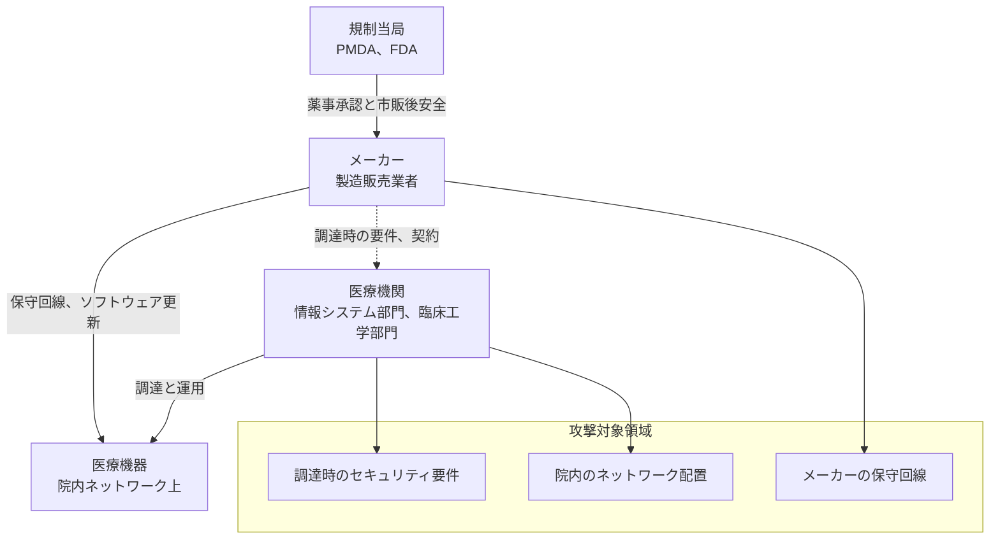

# 🩺 医療機器のセキュリティ（IoMT / PACS）

輸液ポンプ、患者モニタ、人工呼吸器、ペースメーカー、画像診断装置、検査機器。
これらはネットワークにつながったコンピュータでありながら、一般的な IT 資産とはまったく異なる制約のもとにある。

> [!NOTE]
> **表記ルール**：本ページでは、**事実**（一次情報で確認できる内容。出典を併記する）、**報道ベース**（報道のみで確認でき、当事者の公表資料では裏付けが取れていない内容）、**分析**（筆者の解釈）を書き分ける。
> 出典は、当事者の公表資料、行政文書、CVE、ベンダアドバイザリなどの一次情報を優先して示す。

## IT セキュリティの常識が通用しない理由

| 制約 | 内容 | 帰結 |
|---|---|---|
| **勝手にパッチを当てられない** | 薬事承認された構成の変更は、メーカーの検証と承認が必要 | 既知の脆弱性を数年単位で抱え続ける |
| **エージェントを入れられない** | EDR / ウイルス対策ソフトの導入がメーカー保証の対象外になる | 端末側の可視性が確保できない |
| **10 年以上使われる** | 高額な資本設備であり、更新サイクルが長い | サポート終了 OS（Windows XP/7、組込み Linux）が現役で稼働 |
| **可用性が最優先** | 停止と再起動が患者の生命に直結する | スキャンや検証行為そのものがリスクになる |
| **CIA の優先順位が逆転する** | 一般 IT は機密性を優先するが、医療機器は可用性と完全性を優先する | 止めて安全にするという選択肢が取れない |
| **所有と管理の分離** | 資産は病院、保守はメーカー。保守回線が院内 IT の管理外にある | 攻撃対象領域が組織図に載らない |

> [!IMPORTANT]
> 医療機器のセキュリティは、情報保護ではなく**患者安全（Patient Safety）**の問題として扱われる。
> この視点の違いが、規制、設計、運用のすべてに反映されている。

## 一覧

- [IoMT（医療 IoT 機器）のリスク](iomt.md)
- [PACS / DICOM のセキュリティ](pacs-dicom.md)
- [医療機器の検証手法](testing-methodology.md)
- [メーカー側の脆弱性受付と開示](psirt-cvd.md)

## 医療機器を取り巻く関係者

**分析**：攻撃対象領域は、メーカーの保守回線、調達時のセキュリティ要件、院内でのネットワーク配置の三点に集約される。
医療機関が単独で制御できるのは三つ目だけであり、残る二つは契約と調達で担保するしかない。

## 関連する規制

医療機器のセキュリティは、規制と切り離せない。

- [国内のガイドラインと法規制](../../guidelines/japan.md)：薬機法、QMS 省令、JIS T 81001-5-1 ほか
- [海外のガイドラインと法規制](../../guidelines/global.md)：FDA 市販前サイバーセキュリティガイダンス、EU MDR、IMDRF ほか

---

[トップへ](../../../README.md)
