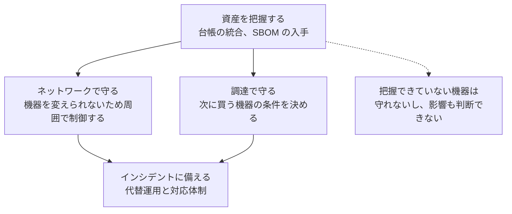

# IoMT（医療 IoT 機器）のセキュリティリスク

IoMT（Internet of Medical Things）は、ネットワークに接続された医療機器の総称である。
輸液ポンプ、患者モニタ、人工呼吸器、透析装置、植込み型デバイス、検査機器、さらには気送管システムまでが含まれる。

> [!NOTE]
> **表記ルール**：本ページでは、**事実**（一次情報で確認できる内容。出典を併記する）、**報道ベース**（報道のみで確認でき、当事者の公表資料では裏付けが取れていない内容）、**分析**（筆者の解釈）を書き分ける。
> 出典は、当事者の公表資料、行政文書、CVE、ベンダアドバイザリなどの一次情報を優先して示す。

---

## 機器カテゴリ別のリスク

| カテゴリ | 代表的な機器 | 想定される最悪の結果 | 主なリスク要因 |
|---|---|---|---|
| **輸液、投薬** | 輸液ポンプ、シリンジポンプ、薬剤ライブラリサーバ | 投与量の改ざんによる過量投与 | Wi-Fi 認証情報の平文保持、無認証の設定変更 API |
| **生体モニタリング** | 患者モニタ、セントラルモニタ、テレメトリ | アラームの抑止、偽アラーム | 独自プロトコル、無認証のネットワーク通信 |
| **生命維持** | 人工呼吸器、体外循環装置、透析装置 | 動作停止、パラメータ改ざん | 可用性最優先の設計、更新の困難さ |
| **植込み型** | ペースメーカー、ICD、インスリンポンプ | 治療の停止、致死的な電気ショック、インスリン過量投与 | 近距離無線（RF/BLE）の認証、暗号化の欠如、電池制約 |
| **画像診断** | CT、MRI、超音波、PACS ワークステーション | 画像の改ざん、検査の停止、大量の患者情報漏えい | 汎用 OS ベース、DICOM の認証欠如（[詳細](pacs-dicom.md)） |
| **検査（LIS）** | 自動分析装置、検体搬送システム | 検査結果の改ざん、停止 | HL7 の平文通信、レガシー端末 |
| **院内物流** | 気送管システム、搬送ロボット、自動薬剤払出装置 | 検体、薬剤、血液製剤の搬送停止 | セキュリティが考慮されていない制御系 |

---

## 押さえるべき代表的な脆弱性研究

医療機器セキュリティを理解するうえで、参照される頻度が高い研究を挙げる。

### プロトコルスタック由来の大規模脆弱性

複数のメーカーの製品に横断的に影響するため、影響範囲の把握が難しくなる。

| 名称 | 年 | 対象 | 概要 | 一次情報 |
|---|---|---|---|---|
| **URGENT/11** | 2019 | VxWorks の IPnet TCP/IP スタック | リアルタイム OS の TCP/IP 実装に 11 件の脆弱性。患者モニタなど多数の医療機器が影響を受け、FDA が安全性通知を発出した（発見：Armis） | [FDA Safety Communication](https://www.fda.gov/medical-devices/safety-communications) ／ [CISA Advisory](https://www.cisa.gov/news-events/ics-advisories) |
| **Ripple20** | 2020 | Treck TCP/IP スタック | 組込み機器に広く採用されたスタックに 19 件の脆弱性。輸液ポンプを含む医療機器が影響を受けた（発見：JSOF） | [JSOF 公表](https://www.jsof-tech.com/disclosures/ripple20/) |
| **SweynTooth** | 2020 | 複数ベンダの BLE SoC | Bluetooth Low Energy の実装不備群。ペースメーカープログラマや血糖モニタなどが影響を受けた（発見：SUTD ASSET Research Group） | [ASSET 公表](https://asset-group.github.io/disclosures/sweyntooth/) |
| **Access:7** | 2022 | PTC Axeda エージェント | 医療機器のリモート保守に使われるエージェントの脆弱性。多数のメーカー製品に影響（発見：Forescout, CyberMDX） | [CISA Advisory](https://www.cisa.gov/news-events/ics-advisories) |
| **PwnedPiper** | 2021 | 気送管システム（Swisslog Healthcare Translogic PTS） | 北米の多数の病院に導入された検体と薬剤の搬送システムの制御に関する脆弱性群（発見：Armis） | [CISA Advisory](https://www.cisa.gov/news-events/ics-advisories) |

> [!IMPORTANT]
> **SBOM（ソフトウェア部品表）が求められる理由がここにある。**
> 「自院の機器に、この TCP/IP スタックが使われているか」に答えられなければ、この種の脆弱性には対応できない。
> FDA は市販前提出で SBOM の提出を求めており、調達時に SBOM を要求することが、医療機関側の実務対策になる。

### 個別機器の脆弱性研究

| 事例 | 年 | 概要 | 一次情報 |
|---|---|---|---|
| **Hospira 製輸液ポンプ** | 2015 | FDA が特定の輸液ポンプについて、サイバーセキュリティ上の理由から使用中止を推奨した初期の事例（研究：Billy Rios ほか） | [FDA Safety Communications](https://www.fda.gov/medical-devices/medical-device-safety/safety-communications) |
| **Animas OneTouch Ping（インスリンポンプ）** | 2016 | リモコンとポンプ間の無線通信に認証と暗号化の不備があり、第三者がインスリン投与を指示できる可能性が示された（研究：Rapid7） | [Rapid7 の公表](https://blog.rapid7.com/2016/10/04/r7-2016-07-multiple-vulnerabilities-in-animas-onetouch-ping-insulin-pump/) |
| **St. Jude Medical（現 Abbott）の植込み型心臓デバイス** | 2016-2017 | 通信の脆弱性を理由に、FDA がファームウェア更新を伴うリコールを実施した | [FDA Safety Communications](https://www.fda.gov/medical-devices/medical-device-safety/safety-communications) |
| **Medtronic の心臓デバイスとプログラマ** | 2018-2019 | テレメトリプロトコルとソフトウェア更新経路の脆弱性について、FDA が安全性通知を発出した | [FDA Safety Communications](https://www.fda.gov/medical-devices/medical-device-safety/safety-communications) |
| **Medtronic MiniMed インスリンポンプ** | 2019 | 無線通信の脆弱性を理由に、FDA が特定モデルのリコールを発表した | [FDA Safety Communications](https://www.fda.gov/medical-devices/medical-device-safety/safety-communications) |
| **Natus NeuroWorks（脳波計測ソフト）** | 2018 | ネットワーク経由で悪用しうる複数の脆弱性（研究：Cisco Talos） | [Talos の公表](https://blog.talosintelligence.com/2018/04/vulnerability-spotlight-natus.html) |
| **MEDJACK（Medical Device Hijack）** | 2015 | セキュリティ製品を導入できない医療機器を足場として、院内に持続的な拠点を築く攻撃手法の報告（TrapX） | [レポート](https://securityledger.com/wp-content/uploads/2015/06/AOA_MEDJACK_LAYOUT_6-0_6-3-2015-1.pdf) |

**分析**：これらの研究に共通するのは、医療機器が攻撃者を想定しない設計で作られてきたという点である。
認証されない制御コマンド、平文の無線通信、ハードコードされた認証情報は、2010 年代前半までの組込み機器では一般的だった。
設計時期が古いほどこの傾向は強く、しかもその機器は今も稼働している。

---

## 医療機関側の実務対策

医療機器は、脆弱性が見つかっても医療機関の側で直せない。
そのため対策は、機器そのものではなく、機器を取り巻く条件に対して打つことになる。

### 1. 資産を把握する（すべての起点）

| 項目 | 内容 |
|---|---|
| 機器の一覧 | 台数、機種、設置場所、所管部署（臨床工学技士 / IT / 放射線技師） |
| ソフトウェア構成 | OS とバージョン、組込みソフトの SBOM |
| 接続状況 | IP アドレス、接続先セグメント、外部接続（保守回線）の有無 |
| 保守契約 | メーカーによるリモートアクセスの有無、更新提供の条件、サポート終了日 |

> [!TIP]
> 医療機関では、医療機器の管理台帳は臨床工学部門にあり、IT 資産管理台帳は情報システム部門にある。
> この二つが統合されていないことが、可視化を妨げる。
> まず両者を突き合わせるところから始めてほしい。

### 2. ネットワークで守る（機器を変えられないから）

- 医療機器を専用 VLAN に分離し、必要な通信のみを許可する
- 医療機器セグメントからのインターネット直接アクセスを禁止する
- 保守用のリモートアクセスは、常時接続ではなく**必要時のみ開放**する運用に切り替える
- 医療機器セグメントの通信を監視する（機器側にエージェントを置けないため、ネットワーク側で可視化する）

### 3. 調達で守る（最も効果が高い）

- **MDS2**（Manufacturer Disclosure Statement for Medical Device Security）の提出を求める
- **SBOM** の提供と、脆弱性発生時の通知義務を契約に含める
- サポート期間、パッチ提供の頻度、脆弱性対応の SLA を仕様書に明記する
- 認証方式（デフォルトパスワードの有無、MFA 対応）、ログ出力の可否を確認する

### 4. インシデントに備える

- 機器が停止した場合の代替運用（手動運用への切り替え手順）を、機器カテゴリごとに用意する
- 医療機器のインシデントは、IT 部門だけでは判断できない。臨床工学技士、医師、メーカーを含む対応体制を事前に定義する
- MITRE の [Medical Device Cybersecurity Regional Incident Preparedness and Response Playbook](https://www.mitre.org/) が、地域連携も含めた対応計画の参考になる

---

## 関連ページ

- [医療機器の検証手法](testing-methodology.md)
- [PACS / DICOM のセキュリティ](pacs-dicom.md)
- [ガイドラインと法規制](../../guidelines/)

---

[← 医療機器のセキュリティ](README.md) | [トップへ](../../../README.md)
