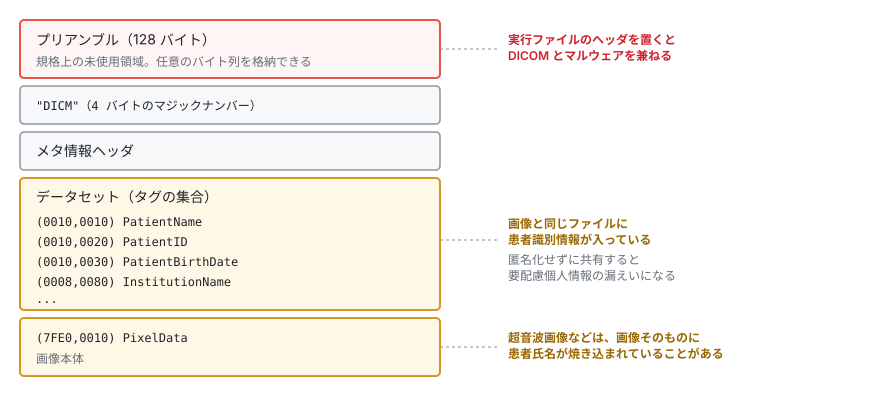
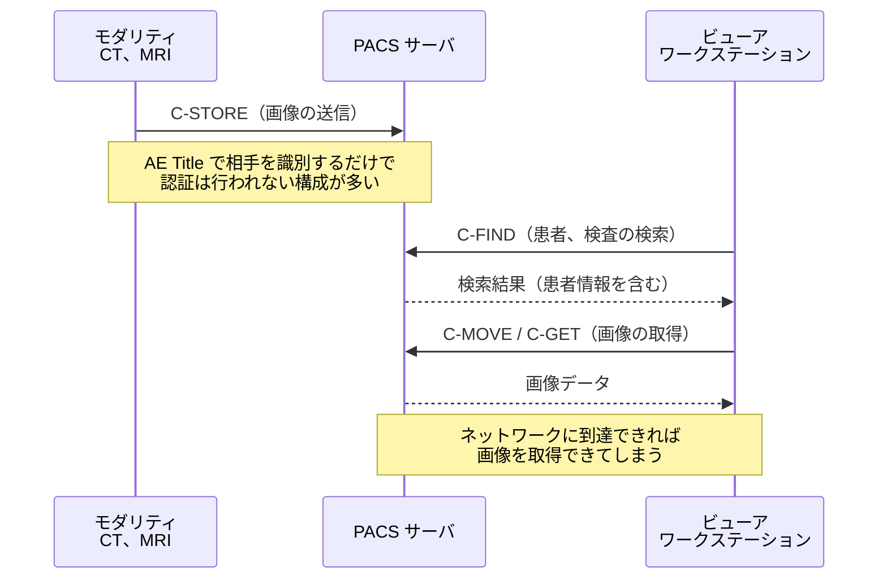
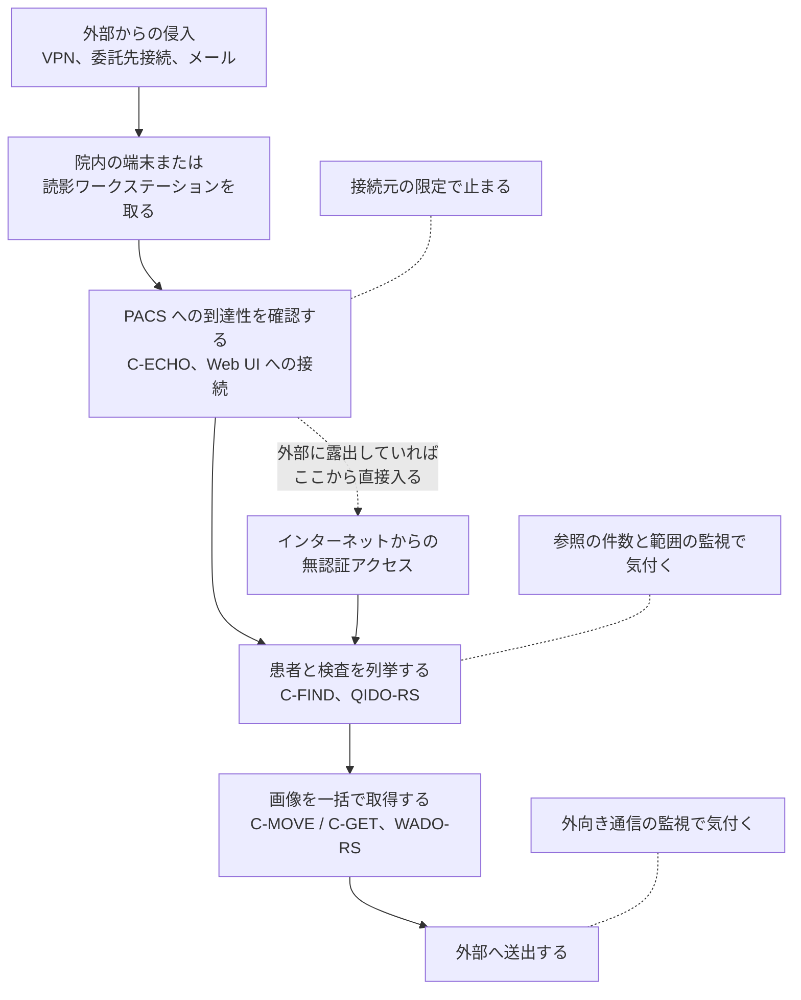
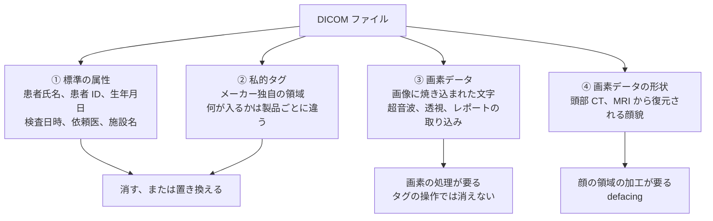

# PACS / DICOM のセキュリティ

医用画像は、量が多く、患者識別情報と不可分で、長期保存が義務づけられているデータである。
その保管と通信を担う PACS と DICOM は、医療セキュリティの主要な攻撃対象領域になる。

> [!NOTE]
> **表記ルール**：本ページでは、**事実**（一次情報で確認できる内容。出典を併記する）、**報道ベース**（報道のみで確認でき、当事者の公表資料では裏付けが取れていない内容）、**分析**（筆者の解釈）を書き分ける。
> 出典は、当事者の公表資料、行政文書、CVE、ベンダアドバイザリなどの一次情報を優先して示す。

---

## セキュリティから見た DICOM

**DICOM（Digital Imaging and Communications in Medicine）** は、医用画像のファイル形式と通信プロトコルの両方を規定する規格である。

### ファイル形式としての DICOM

  

> [!IMPORTANT]
> **DICOM ファイルは画像ではなく、患者情報を伴う医療記録である。**
> 匿名化せずに研究利用や外部共有を行うと、それ自体が要配慮個人情報の漏えいになる。
> 超音波画像などは画像そのものに患者氏名が焼き込まれていることがあり、タグの削除だけでは匿名化が終わらない。

### 通信プロトコルとしての DICOM

医用画像は、撮影装置から PACS へ送られ、読影のためにワークステーションへ配信される。
この一連のやり取りに、利用者を認証する仕組みは規格の基本部分に含まれていない。

| サービス | 内容 | セキュリティ上の意味 |
|---|---|---|
| **C-ECHO** | 疎通確認（DICOM の ping） | サーバの存在確認に使われる。偵察の入口 |
| **C-FIND** | 検査、患者の検索 | 患者情報の列挙が可能になる |
| **C-MOVE / C-GET** | 画像の取得 | 画像の一括ダウンロード |
| **C-STORE** | 画像の送信 | 不正な画像の投入、改ざんされた画像の混入 |
| **DICOMweb（QIDO-RS / WADO-RS / STOW-RS）** | HTTP ベースの API | 一般的な Web 脆弱性（認証不備、IDOR、SSRF）の対象になる |

**認証について（事実）**

- 従来の DICOM 通信では、通信相手の識別に AE Title という文字列を使う。これは認証情報ではない。
- 規格上は TLS による相互認証（Secure Transport Connection Profile）やユーザ識別の拡張が定義されているが、実運用で有効化されていない構成が広く存在する。
- **出典**：[DICOM 標準 Part 15（Security and System Management Profiles）](https://www.dicomstandard.org/current)
- 標準ポートは 104（伝統的に使われてきたもの）と 11112（IANA に登録された DICOM ポート）である。

---

## 主なリスク

### 1. インターネットへの露出

**事実**：複数の調査により、インターネットから認証なしで到達できる PACS サーバが世界中に多数存在し、数千万件規模の医用画像と患者情報が第三者から参照可能な状態にあったことが報告されている。

**出典**：[Greenbone Networks の調査レポート](https://www.greenbone.net/en/)、[CISA ICS Medical Advisories](https://www.cisa.gov/news-events/ics-advisories)

**確認すべきこと**
- 自組織の外部 IP レンジで、104 / 11112 / 8042 などが開放されていないか
- 遠隔読影、地域連携のための接続が、意図せず全開放になっていないか
- クラウド PACS のストレージ（S3 バケット等）が公開設定になっていないか

### 2. 院内ネットワークからの無制限アクセス

**分析**：侵入後の攻撃者にとって、PACS はまとめて持ち出せる価値の高いデータの集積地になる。
認証がない構成では、院内の一端末を奪取するだけで全画像を取得できてしまう。

**対策**
- PACS サーバへの接続元を、必要なモダリティ、ワークステーションに限定する（AE Title と IP のホワイトリスト）
- 大量取得を検知する（単位時間あたりの C-MOVE / WADO リクエスト数の監視）

### 3. 画像の改ざん

**事実**：研究レベルでは、CT 画像に病変を追加または除去する改ざんが可能であり、放射線科医と診断支援 AI の判断を誤らせうることが示されている。

**出典**：Mirsky ほか「CT-GAN: Malicious Tampering of 3D Medical Imagery using Deep Learning」（USENIX Security 2019、[論文](https://www.usenix.org/conference/usenixsecurity19/presentation/mirsky)）

**分析**：医療における完全性の侵害は、情報漏えいよりも直接的に患者被害へつながる。
にもかかわらず、画像の完全性検証（デジタル署名）は実運用でほとんど使われていない。

### 4. DICOM ファイルを介したマルウェア

**事実**：プリアンブル領域に PE ヘッダを配置すると、DICOM としても実行ファイルとしても有効なファイルを構成できる（[詳細](../oss-vulnerabilities/imaging-pacs.md)）。

**出典**：Cylera Labs の研究者による 2019 年の公表。
規格上の定義は [DICOM 標準 Part 10](https://www.dicomstandard.org/current) を参照。

---

## 侵入から画像の持ち出しまで

上の四つは、単独で成立するのではなく、順につながって被害の規模を決める。
攻撃者から見た手順に並べ直すと、どの段で止められるかがわかる。

**分析**：この流れで最も見落とされるのは、C から D への移行である。
到達性の確認と患者の列挙はどちらも正規の DICOM サービスであり、機器が日常的に行う通信と形が変わらない。
止める手段を「不正な通信を弾く」ことに置くと、この段は通過してしまう。
接続元を限定して到達性そのものを与えないか、件数の異常で気付くかのどちらかになる。

---

## 検知に使える指標

PACS の通信は、参照そのものが業務である。
そのため、通信の種類ではなく、主体と量と範囲の組み合わせで異常を測ることになる。

| 監視対象 | 検知したい事象 | 緩和策 |
|---|---|---|
| 接続元 | 登録されていない AE Title、台帳にない IP からの接続、想定時間帯を外れた接続 | AE Title と送信元 IP の組でホワイトリストを構成する。未登録の接続は破棄して記録する |
| 検索の量 | 単位時間あたりの C-FIND、QIDO-RS の件数。条件を広く取った検索（患者 ID のワイルドカード、日付範囲の全指定） | 検索条件の上限と返却件数の上限をサーバ側で強制する |
| 取得の量と範囲 | 1 主体が取得した検査数と患者数。読影の担当範囲を超える取得 | 取得の上限を設け、超過を通知する。読影の割り当てと突き合わせる |
| DICOMweb API | 画面遷移を伴わない WADO-RS の直接呼び出し、認証トークンの共有 | API に認証を適用し、トークンごとに参照範囲を制限する（[FHIR と共通の論点](../web-security/hl7-fhir.md)） |
| 書き込み | 想定しない送信元からの C-STORE、既存検査と同じ UID での上書き | 受信する送信元を限定する。UID の重複を検査して拒否する |
| 外向き通信 | PACS サーバとワークステーションからの、業務で使わない宛先への大量転送 | 画像を扱う機器のセグメントから、直接インターネットへ出られない構成にする |

**分析**：この表のうち、書き込みの監視は漏えい対策としては優先度が下がるが、完全性の観点では最初に置く対象になる。
画像の改ざんは、参照ログを見ても発生した事実が残らず、検査の重複や UID の異常としてしか現れない。

> [!TIP]
> 監査ログを「取得している」ことと、「誰がどの患者を見たかを後から追える」ことは別である。
> PACS の既定のログが、利用者、患者、検査、時刻の四つを同じ行に持っているかを確認してほしい。
> 持っていない場合、参照の異常を検知する仕組みは、ログの設計から始めることになる。

---

## 匿名化は、タグを消したところでは終わらない

研究利用、外部提供、AI の学習データ、ベンダへの障害調査用の提供。
医用画像が組織の外へ出る経路は複数あり、いずれも匿名化の失敗がそのまま漏えいになる。

**事実**：DICOM 標準 Part 15 の Annex E は、基本的な機密性プロファイルと、それに対する選択肢（画素データの消去、記述文の消去、UID の保持、装置識別の保持など）を定めている（[DICOM 標準](https://www.dicomstandard.org/current)）。
消すべき属性の一覧は規格の側にあり、実装ごとに決めるものではない。

識別につながる情報は、四つの層に分かれて存在する。

| 層 | 処理 | 見落とすと起きること |
|---|---|---|
| ① 標準の属性 | 規格の一覧に沿って除去、置換する。UID は再割り当てするか、保持する方針を明示する | 患者氏名や患者 ID が残る。UID をそのまま残すと、提供先の別データと突き合わせて同一患者を追跡できる |
| ② 私的タグ | 既定で削除する。残す必要があるものだけを個別に許可する | メーカー独自の領域に、患者氏名や施設内の識別子が入っていることがある |
| ③ 画素データ | 焼き込み文字の有無を属性（Burned In Annotation）で判定し、必要なら画素を塗りつぶす | 超音波や透視の画像に、患者氏名と生年月日が表示されたまま出る |
| ④ 画素データの形状 | 頭部の断層画像では、顔貌の除去を検討する | 画像から顔を再構成し、顔認識で本人にたどり着ける |

**事実**：頭部 MRI の研究データから顔を再構成し、顔認識ソフトウェアで研究参加者を特定できたとする報告がある（Schwarz ほか「Identification of Anonymous MRI Research Participants with Face-Recognition Software」、The New England Journal of Medicine、2019 年、[論文](https://www.nejm.org/doi/full/10.1056/NEJMc1908881)）。

**分析**：①だけを処理して「匿名化済み」として扱う運用が残りやすい。
匿名化ツールの既定設定は①と②を対象にすることが多く、③と④は別の処理として明示的に指定する必要があるためである。
出す前に、処理後のファイルを機械的に検査する工程を置くと、この差に気付ける。
検査は、残存する属性の一覧化と、焼き込み文字の有無の判定の二つで足りることが多い。

**確認すること**

- 匿名化の方針を、どの選択肢を採るかまで文書にしている（UID を保持するか、日付をずらすか、装置識別を残すか）
- 私的タグの扱いを、削除を既定にしている
- 焼き込み文字を含みうる検査種別を洗い出し、画素の処理を工程に含めている
- 頭部の断層画像を外部提供する場合、顔貌の扱いを決めている
- 処理後のファイルを機械的に検査し、その記録を残している
- 提供先での再識別を禁じる取り決めを、契約に含めている

使えるツールは [ツール](../../reference/resources/tools.md#dicom-医用画像) に挙げている。

---

## 実務チェックリスト

**露出確認**
- [ ] 外部から DICOM ポート（104 / 11112）に到達できないことを確認した
- [ ] PACS の Web UI / DICOMweb API が外部公開されていないことを確認した
- [ ] クラウドストレージの公開設定を確認した

**アクセス制御**
- [ ] AE Title と送信元 IP のホワイトリストを設定した
- [ ] DICOM TLS を有効化した（対応機器の範囲で）
- [ ] DICOMweb API に認証（OAuth 2.0 / SMART on FHIR 等）を適用した
- [ ] 遠隔読影、地域連携の接続を、必要最小限に限定した

**監視**
- [ ] 誰がどの患者の画像を参照したかの監査ログを取得している
- [ ] 大量取得（C-MOVE / WADO）を検知するアラートを設定した
- [ ] 未登録の AE Title からの接続試行を検知している

**データ保護**
- [ ] 研究、外部提供時の匿名化手順を、標準の属性、私的タグ、焼き込み文字、顔貌の四つについて定めた
- [ ] 匿名化後のファイルを、機械的に検証している
- [ ] 保存データの暗号化を適用している

---

## 関連ページ

- [医用画像 OSS（PACS/DICOM 実装）の脆弱性](../oss-vulnerabilities/imaging-pacs.md)
- [HL7 v2 と FHIR の攻撃面](../web-security/hl7-fhir.md)
- [ネットワークの分離](../segmentation.md)
- [医療機器の検証手法](testing-methodology.md)
- [ツール](../../reference/resources/tools.md)

---

[← 医療機器のセキュリティ](README.md) | [トップへ](../../../README.md)
