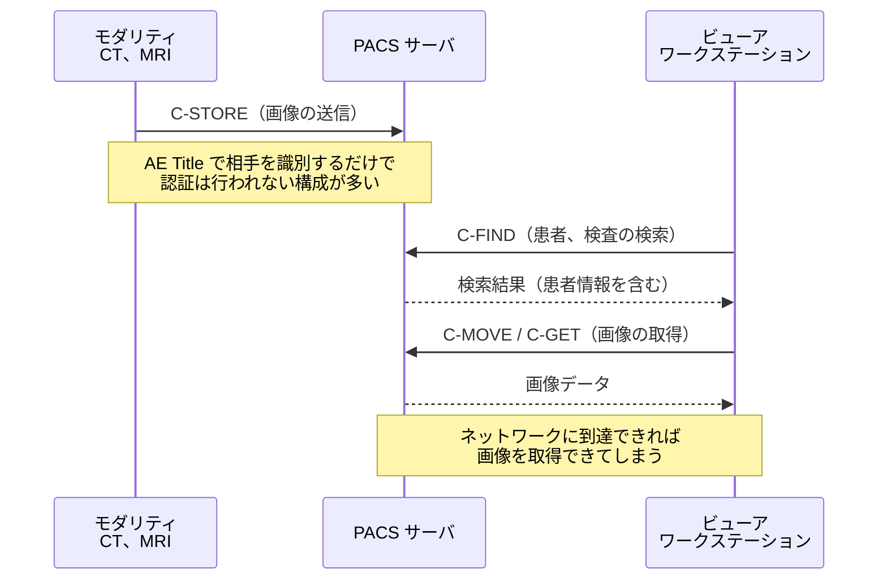

# PACS / DICOM のセキュリティ

医用画像は、量が多く、患者識別情報と不可分で、長期保存が義務づけられているデータである。
その保管と通信を担う PACS と DICOM は、医療セキュリティの主要な攻撃対象領域になる。

> [!NOTE]
> **表記ルール**：本ページでは、**事実**（一次情報で確認できる内容。出典を併記する）、**報道ベース**（報道のみで確認でき、当事者の公表資料では裏付けが取れていない内容）、**分析**（筆者の解釈）を書き分ける。
> 出典は、当事者の公表資料、行政文書、CVE、ベンダアドバイザリなどの一次情報を優先して示す。

---

## DICOM を理解する（セキュリティの観点から）

**DICOM（Digital Imaging and Communications in Medicine）** は、医用画像のファイル形式と通信プロトコルの両方を規定する規格である。

### ファイル形式としての DICOM

  

> [!IMPORTANT]
> **DICOM ファイルは画像ではなく、患者情報を伴う医療記録である。**
> 匿名化せずに研究利用や外部共有を行うと、それ自体が要配慮個人情報の漏えいになる。
> 超音波画像などは画像そのものに患者氏名が焼き込まれていることがあり、タグの削除だけでは匿名化が終わらない。

### 通信プロトコルとしての DICOM

医用画像は、撮影装置から PACS へ送られ、読影のためにワークステーションへ配信される。
この一連のやり取りに、利用者を認証する仕組みは規格の基本部分に含まれていない。

| サービス | 内容 | セキュリティ上の意味 |
|---|---|---|
| **C-ECHO** | 疎通確認（DICOM の ping） | サーバの存在確認に使われる。偵察の入口 |
| **C-FIND** | 検査、患者の検索 | 患者情報の列挙が可能になる |
| **C-MOVE / C-GET** | 画像の取得 | 画像の一括ダウンロード |
| **C-STORE** | 画像の送信 | 不正な画像の投入、改ざんされた画像の混入 |
| **DICOMweb（QIDO-RS / WADO-RS / STOW-RS）** | HTTP ベースの API | 一般的な Web 脆弱性（認証不備、IDOR、SSRF）の対象になる |

**認証について（事実）**

- 従来の DICOM 通信では、通信相手の識別に AE Title という文字列を使う。これは認証情報ではない。
- 規格上は TLS による相互認証（Secure Transport Connection Profile）やユーザ識別の拡張が定義されているが、実運用で有効化されていない構成が広く存在する。
- **出典**：[DICOM 標準 Part 15（Security and System Management Profiles）](https://www.dicomstandard.org/current)
- 標準ポートは 104（伝統的に使われてきたもの）と 11112（IANA に登録された DICOM ポート）である。

---

## 主なリスク

### 1. インターネットへの露出

**事実**：複数の調査により、インターネットから認証なしで到達できる PACS サーバが世界中に多数存在し、数千万件規模の医用画像と患者情報が第三者から参照可能な状態にあったことが報告されている。

**出典**：[Greenbone Networks の調査レポート](https://www.greenbone.net/en/)、[CISA ICS Medical Advisories](https://www.cisa.gov/news-events/ics-medical-advisories)

**確認すべきこと**
- 自組織の外部 IP レンジで、104 / 11112 / 8042 などが開放されていないか
- 遠隔読影、地域連携のための接続が、意図せず全開放になっていないか
- クラウド PACS のストレージ（S3 バケット等）が公開設定になっていないか

### 2. 院内ネットワークからの無制限アクセス

**分析**：侵入後の攻撃者にとって、PACS はまとめて持ち出せる価値の高いデータの集積地になる。認証がない構成では、院内の一端末を奪取するだけで全画像を取得できてしまう。

**対策**
- PACS サーバへの接続元を、必要なモダリティ、ワークステーションに限定する（AE Title と IP のホワイトリスト）
- 大量取得を検知する（単位時間あたりの C-MOVE / WADO リクエスト数の監視）

### 3. 画像の改ざん

**事実**：研究レベルでは、CT 画像に病変を追加または除去する改ざんが可能であり、放射線科医と診断支援 AI の判断を誤らせうることが示されている。

**出典**：Mirsky ほか「CT-GAN: Malicious Tampering of 3D Medical Imagery using Deep Learning」（USENIX Security 2019、[論文](https://www.usenix.org/conference/usenixsecurity19/presentation/mirsky)）

**分析**：医療における完全性の侵害は、情報漏えいよりも直接的に患者被害へつながる。にもかかわらず、画像の完全性検証（デジタル署名）は実運用でほとんど使われていない。

### 4. DICOM ファイルを介したマルウェア

**事実**：プリアンブル領域に PE ヘッダを配置すると、DICOM としても実行ファイルとしても有効なファイルを構成できる（[詳細](../oss-vulnerabilities/imaging-pacs.md)）。

**出典**：Cylera Labs の研究者による 2019 年の公表。規格上の定義は [DICOM 標準 Part 10](https://www.dicomstandard.org/current) を参照。

---

## 実務チェックリスト

**露出確認**
- [ ] 外部から DICOM ポート（104 / 11112）に到達できないことを確認した
- [ ] PACS の Web UI / DICOMweb API が外部公開されていないことを確認した
- [ ] クラウドストレージの公開設定を確認した

**アクセス制御**
- [ ] AE Title と送信元 IP のホワイトリストを設定した
- [ ] DICOM TLS を有効化した（対応機器の範囲で）
- [ ] DICOMweb API に認証（OAuth 2.0 / SMART on FHIR 等）を適用した
- [ ] 遠隔読影、地域連携の接続を、必要最小限に限定した

**監視**
- [ ] 誰がどの患者の画像を参照したかの監査ログを取得している
- [ ] 大量取得（C-MOVE / WADO）を検知するアラートを設定した
- [ ] 未登録の AE Title からの接続試行を検知している

**データ保護**
- [ ] 研究、外部提供時の匿名化手順を定め、タグと**画像内焼き込み文字**の両方を処理している
- [ ] 匿名化後のファイルを、機械的に検証している
- [ ] 保存データの暗号化を適用している

---

## 関連ページ

- [医用画像 OSS（PACS/DICOM 実装）の脆弱性](../oss-vulnerabilities/imaging-pacs.md)
- [医療機器の検証手法](testing-methodology.md)
- [ツール](../../reference/resources/tools.md)

---

[← 医療機器のセキュリティ](README.md) | [トップへ](../../../README.md)
