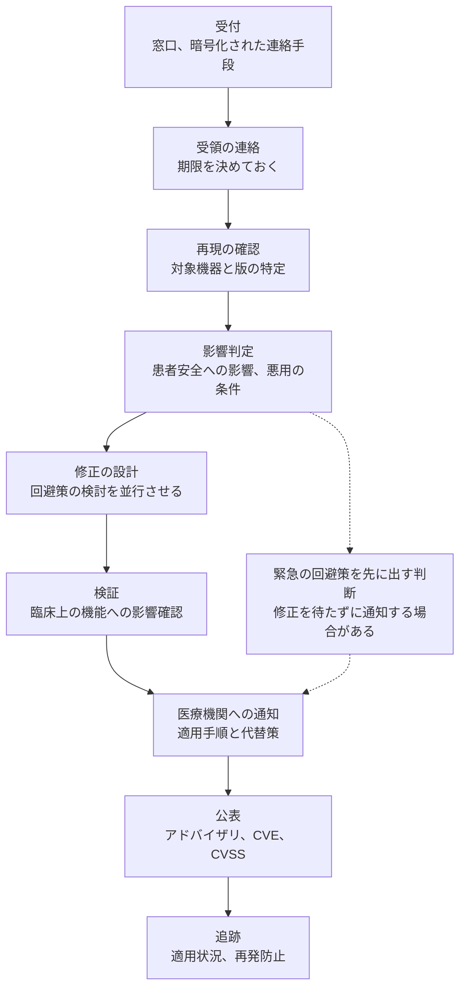

# 🛠️ メーカー側の脆弱性受付と開示

脆弱性を報告する側の手順は[バグバウンティと脆弱性開示](../../practice/bug-bounty/)で扱っている。
本ページは、報告を受け取る側、すなわち医療機器の製造販売業者とソフトウェアの提供事業者が、受付から公表までに何を行うかを扱う。

医療機器には、他の製品にない断絶がある。
修正版を作っても、医療機関がすぐに適用できない。
承認された構成の変更にはメーカーの検証が要り、稼働中の機器を止める時間も要る。
このため、受付の設計は「修正を出すまで」ではなく「医療機関が適用を終えるまで」を範囲に含める必要がある。

> [!NOTE]
> **表記ルール**：本ページでは、**事実**（一次情報で確認できる内容。出典を併記する）、**報道ベース**（報道のみで確認でき、当事者の公表資料では裏付けが取れていない内容）、**分析**（筆者の解釈）を書き分ける。

---

## 受け取る側に課されている要求

| 地域 | 要求の内容 | 根拠 |
|---|---|---|
| 米国 | Cyber Device の市販前提出において、市販後の脆弱性を監視、特定、対処する計画を示す。計画には調整型の脆弱性開示が含まれる。SBOM の提出も求められる | FD&C Act 第 524B 条 |
| 米国 | 市販前提出の内容と品質システム上の考慮事項に関する最終ガイダンス | FDA ガイダンス（2025 年 6 月 27 日） |
| 日本 | プログラムを用いた医療機器で、他の機器やネットワークへの接続、不正アクセスや攻撃が想定される場合に、サイバーセキュリティのリスクを特定、評価、管理する | 医療機器の基本要件基準 第 12 条第 3 項 |
| 国際 | 医療機器サイバーセキュリティの原則と実践、レガシー機器の扱い | IMDRF N60、N70 |
| 国際 | 脆弱性の開示（外部とのやり取り）と、脆弱性の処理（社内のプロセス） | ISO/IEC 29147、ISO/IEC 30111 |

**事実**：FDA は 2025 年 6 月 27 日に最終ガイダンス "Cybersecurity in Medical Devices: Quality System Considerations and Content of Premarket Submissions" を発出し、2023 年 9 月 27 日付の最終ガイダンスを置き換えた。
第 524B 条に関する FDA の考え方を扱う節が追加されている。
出典：[HHS Guidance Repository に掲載された本文（PDF）](https://www.hhs.gov/guidance/sites/default/files/hhs-guidance-documents/FDA/GUI00001825-final-PremarketCybersecurity-2025.pdf)、[FDA Medical Device Cybersecurity](https://www.fda.gov/medical-devices/digital-health-center-excellence/cybersecurity)

**事実**：日本では、IMDRF のガイダンスの内容を踏まえて基本要件基準が改正され、第 12 条第 3 項が 2023 年 4 月 1 日に施行された。
1 年間の経過措置を経て、2024 年 4 月 1 日から全面的に適用されている。
出典：[PMDA 医療機器のサイバーセキュリティについて](https://www.pmda.go.jp/review-services/drug-reviews/about-reviews/devices/0051.html)、[厚生労働省 通知（PDF）](https://www.mhlw.go.jp/content/11120000/001167218.pdf)

**事実**：国内の実装指針として、日本医療機器産業連合会が「医療機器のサイバーセキュリティ導入に関する手引書（第 2 版、2023 年 3 月）」を公表しており、厚生労働省の通知で参照されている（[国内のガイドラインと法規制](../../guidelines/japan.md)）。

**分析**：これらの要求に共通するのは、脆弱性への対処を製品開発の一部ではなく、市販後の継続的な義務として位置づけている点である。
受付窓口を置くこと自体は難しくない。
運用として難しいのは、報告が来てから公表までの各段で、誰が判断するかを決めておくことにある。

---

## 受付から公表までの工程

各段で決めておく事項を挙げる。

| 段 | 決めておくこと | 決めていないと起きること |
|---|---|---|
| 受付 | 窓口の所在、受け付ける言語、暗号化された連絡手段、匿名報告の可否 | 報告が営業窓口や問い合わせフォームに埋もれる |
| 受領の連絡 | 何営業日以内に返すか | 報告者が「無視された」と判断し、一方的に公表する |
| 再現 | 対象機器の確保、試験環境、旧版の保持 | 販売終了した版の再現ができない |
| 影響判定 | 患者安全への影響を誰が評価するか（品質保証、臨床、開発の合議） | 情報セキュリティの重大度だけで判断し、患者への影響を見落とす |
| 修正 | 承認手続きの要否の判定 | 修正版の提供時期が読めない |
| 通知 | 医療機関への連絡経路（保守窓口、販売代理店、ISAC） | 使っている医療機関に届かない |
| 公表 | 公表の時期、報告者との調整、CVE の採番 | 報告者との合意なく遅延し、信頼を失う |
| 追跡 | 適用状況の把握、未適用機器への再通知 | 修正を出したことで完了と扱ってしまう |

---

## 影響判定に SBOM を使う

**分析**：SBOM は、どの部品が含まれるかを示すが、影響の有無を決めるものではない。
脆弱な部品を含んでいても、その機能を呼び出していない、外部から到達できない、という理由で影響が生じないことがある。
逆に、部品表に現れない独自実装や、設定ファイルの初期値に起因する問題は、SBOM では検出できない。

影響判定は、次の順で行うと結論の根拠が残る。

1. 部品表と版の突合で、対象候補を絞る
2. 該当機能をどの経路で呼び出しているかを確認する
3. 外部からその経路に到達できるかを、既定の構成と、想定される運用構成の両方で確認する
4. 到達できた場合、患者安全に及ぶ影響を評価する
5. 判定の根拠を、機器と版ごとに記録する

**分析**：5 の記録が、次の報告への対応を速くする。
同じ部品に別の脆弱性が出たとき、2 と 3 の調査を繰り返さずに済む（[SCA と SBOM で既知脆弱性に対処する](../oss-vulnerabilities/sca-sbom.md)）。

---

## アドバイザリに何を書くか

| 項目 | 記載する内容 | 医療機関が使う場面 |
|---|---|---|
| 対象 | 機器名、型式、ソフトウェアの版、製造番号の範囲 | 自院の保有機器と突き合わせる |
| 影響 | 何が起こりうるか。患者安全への影響の有無 | 対応の優先順位を決める |
| 条件 | 悪用に必要な条件（ネットワークへの到達、認証の要否、物理的接触） | 自院の構成で成立するかを判断する |
| 深刻度 | CVSS の値と、その算出根拠となる想定 | 他の脆弱性と並べて優先順位を付ける |
| 回避策 | 修正版が出るまでに取りうる措置（通信の制限、機能の停止、運用での代替） | 適用までの期間をしのぐ |
| 修正 | 提供時期、適用方法、所要時間、再起動の要否 | 停止の調整と、臨床部門への説明に使う |
| 適用できない場合 | 対象機器を使い続ける場合の条件 | 更新できない機器の扱いを決める |
| 連絡先 | 技術的な問い合わせ先 | 自院の構成に固有の判断を確認する |

**分析**：医療機関の側から見て情報が足りなくなるのは、条件と回避策の二項目である。
条件が書かれていないと、自院のネットワーク構成で成立するかを判断できず、すべての機器を同じ優先度で扱うことになる。
回避策が書かれていないと、修正版が出るまでの数か月を無防備に過ごすか、機器を止めるかの二択になる。

**分析**：回避策は、機器の外側で実施できる形で書けると医療機関が動ける。
特定の通信の遮断、接続元の限定、管理インタフェースの分離は、いずれも機器の構成を変えずに医療機関側で実施できる（[ネットワークの分離](../segmentation.md)）。

---

## 修正が届かない期間の扱い

**分析**：医療機器では、修正版の提供と適用の完了に時間差がある。
その間の扱いを、次の三者で分担する。

| 主体 | 担う部分 |
|---|---|
| メーカー | 回避策の提示、適用手順の提供、保守要員による作業 |
| 医療機関 | 到達経路の遮断、機器の一時的な運用変更、優先順位の判断 |
| 規制当局と情報共有組織 | 注意喚起の配信、業界横断での情報共有 |

**事実**：FDA と MITRE は、医療機関向けの対応計画の枠組みとして "Medical Device Cybersecurity Regional Incident Preparedness and Response Playbook" を公表しており、2022 年 11 月 15 日に改訂している。
改訂では、Hospital Incident Command System との整合、広域の影響と長期のダウンタイムへの考慮、資料の付録が加えられた。
出典：[MITRE](https://www.mitre.org/news-insights/publication/medical-device-cybersecurity-regional-incident-preparedness-and-response)

**分析**：修正の提供と、回収や是正措置の境界は、患者安全への影響の程度で分かれる。
サイバーセキュリティ上の欠陥であっても、健康被害の可能性が認められる場合は、医療機器の安全対策の枠組みで扱われる。
どちらに当たるかの判断は、社内で情報セキュリティの担当だけでは完結しない。
品質保証と安全管理の部門を、影響判定の段から関与させておく必要がある。

---

## 報告者との関係

**分析**：外部の研究者からの報告は、無償で提供される検証結果である。
受付の設計が悪いと、報告そのものが来なくなり、脆弱性は残ったまま把握できない状態になる。

研究者の側から見て、応答しやすい窓口には共通点がある。

| 研究者が求めるもの | メーカー側の制約 | 折り合いの付け方 |
|---|---|---|
| 受領の連絡が早い | 一次受付が技術部門でない | 受領のみ自動応答とし、担当の割り当て期限を内規で決める |
| 進捗が分かる | 承認手続きの時期を約束できない | 「次の連絡の期日」を都度示す |
| 公表できる | 医療機関への通知前の公表は避けたい | 公表の目安時期を最初に共有し、延長時は理由を説明する |
| 名前が残る | 慣行がない | アドバイザリに謝辞欄を設ける |
| 法的に安全である | 無断の検証は認められない | 検証の範囲と条件を明示した方針を公開する |

**事実**：国内では、脆弱性関連情報の届出制度が IPA と JPCERT/CC によって運用されており、製品開発者への連絡と公表の調整が行われる。
出典：[JPCERT/CC 脆弱性関連情報の取扱い](https://www.jpcert.or.jp/vh/)、[IPA 脆弱性関連情報の届出](https://www.ipa.go.jp/security/todokede/vuln/uketsuke.html)

**分析**：自社で窓口を運用する場合も、この制度の存在を前提に設計する。
研究者が制度側へ届け出た場合、調整はこの枠組みで進む。
自社窓口と制度側の両方から同じ報告が来ることもあるため、社内で同一の案件として扱える識別の仕組みを用意しておく。

---

## 医療機関の調達側から見た確認項目

**分析**：受け取る側の体制は、医療機関にとっては調達の判断材料になる。
機器を選ぶ段階で確認できると、稼働後の対応の速さが変わる。

- 脆弱性の受付窓口が公開されているか
- 過去のアドバイザリが公開され、内容に条件と回避策が含まれているか
- SBOM の提供の可否と、提供の形式
- 修正版の提供期間（製品のサポート終了時期）
- 修正の適用にかかる作業と、その費用負担
- サポート終了後の機器の扱いについての方針

---

## 実務チェックリスト

**メーカー側**
- [ ] 受付窓口を公開し、暗号化された連絡手段を用意した
- [ ] 受領の連絡と、次回連絡の期日を返す運用にした
- [ ] 影響判定に、品質保証と臨床の担当を含めた
- [ ] 判定の根拠を、機器と版ごとに記録する形式を決めた
- [ ] アドバイザリの様式に、条件と回避策の欄を設けた
- [ ] 医療機関への通知経路（保守窓口、代理店、情報共有組織）を確認した
- [ ] 修正版の適用状況を追跡し、未適用へ再通知する運用にした
- [ ] 公表の時期を報告者と調整する手順を決めた

**医療機関の調達側**
- [ ] 調達仕様に、脆弱性の受付窓口とアドバイザリの提供を含めた
- [ ] SBOM の提供と形式を要件に含めた
- [ ] 修正版の提供期間と、適用作業の費用負担を契約で定めた
- [ ] サポート終了後の扱いを、調達時に確認した

---

## 関連ページ

- [医療機器の検証手法](testing-methodology.md)：報告の前提となる検証のしかた
- [IoMT（医療 IoT 機器）のリスク](iomt.md)：機器側のリスクと調達要件
- [バグバウンティと脆弱性開示](../../practice/bug-bounty/)：報告する側の手順と交戦規則
- [SCA と SBOM で既知脆弱性に対処する](../oss-vulnerabilities/sca-sbom.md)：部品表を影響判定に使う
- [ネットワークの分離](../segmentation.md)：修正が届くまでの回避策を医療機関側で実施する
- [国内のガイドラインと法規制](../../guidelines/japan.md)：薬機法と基本要件基準
- [海外のガイドラインと法規制](../../guidelines/global.md)：FD&C Act 第 524B 条と FDA ガイダンス

---

[← 医療機器のセキュリティ](README.md) | [トップへ](../../../README.md)
