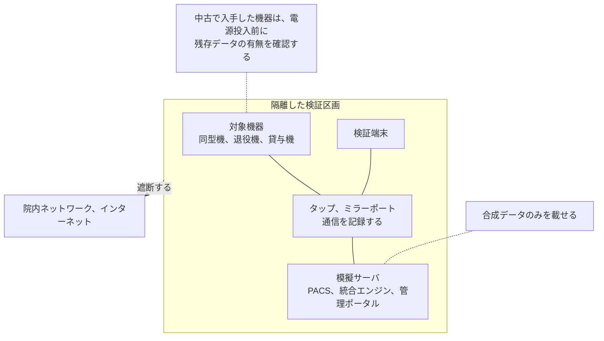
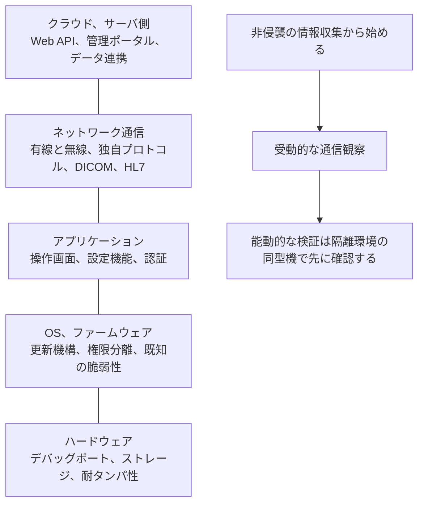
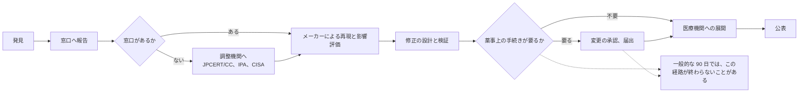

# 医療機器の検証手法

医療機器のセキュリティ検証は、一般的なペネトレーションテストと同じ手順では行えない。
対象が動作を止めた瞬間に、患者の生命が危険にさらされる可能性があるためである。

> [!NOTE]
> **表記ルール**：本ページでは、**事実**（一次情報で確認できる内容。出典を併記する）、**報道ベース**（報道のみで確認でき、当事者の公表資料では裏付けが取れていない内容）、**分析**（筆者の解釈）を書き分ける。
> 出典は、当事者の公表資料、行政文書、CVE、ベンダアドバイザリなどの一次情報を優先して示す。

> [!WARNING]
> 患者が接続された稼働中の医療機器に対する検証は、いかなる場合も行わない。
> 検証は、書面での許可を得たうえで、患者から切り離された機器または隔離されたテスト環境で実施する。
> 医療機関で実施する場合は、臨床工学技士および該当部門の責任者の立ち会いを得る。

---

## 検証を始める前に決めること

| 項目 | 内容 |
|---|---|
| **許可の範囲** | 誰が、どの機器に対して、どの期間、どの手法を許可したかを書面で確定する |
| **機器の状態** | 患者から切り離されているか。臨床で使用中の機器ではないか |
| **停止時の手順** | 機器が応答しなくなった場合に、誰がどう復旧するかを事前に決める |
| **メーカーへの連絡** | 保証や薬事承認との関係を確認する。検証がサポート対象外の行為にあたる場合がある |
| **データの扱い** | 実在する患者データが機器内に残っていないかを確認する。残っている場合は消去してから検証する |
| **報告先** | 発見した脆弱性を、メーカーのどの窓口に報告するかを事前に確認する |

**分析**：医療機器の検証で最も時間がかかるのは、技術的な作業ではなく、この事前調整である。
調整を省いた検証は、結果が使えないだけでなく、機器の破損や薬事上の問題を招く。

---

## 検証環境の置き方

検証は、稼働中の院内ネットワークから切り離した区画で行う。
機器がメーカーの保守サーバへ自動的に接続する構成を持つ場合、隔離しないまま電源を入れると、検証の事実が外部に出る。

**分析**：模擬サーバを置く理由は、機器の通信を成立させるためである。
接続先が応答しないと、機器は初期化の途中で止まり、本来の通信が観察できない。
[ツール](../../reference/resources/tools.md)に挙げた Orthanc や Mirth Connect は、この模擬サーバとして使える。

---

## 検証の対象領域

医療機器は、次の層に分けて検証する。

### 1. 情報収集（非侵襲）

機器に触れずにできる作業から始める。

- 機器の型番、ソフトウェアバージョン、OS を特定する
- メーカーが公表しているセキュリティ情報、MDS2、SBOM を入手する
- 該当する CVE と公的アドバイザリを検索する（[NVD](https://nvd.nist.gov/vuln/search)、[CISA ICS Medical Advisories](https://www.cisa.gov/news-events/cybersecurity-advisories)、[FDA Safety Communications](https://www.fda.gov/medical-devices/medical-device-safety/safety-communications)）
- 取扱説明書、保守マニュアルを読む。初期パスワードやサービスモードの記載が見つかることがある

### 2. ネットワーク通信の観察（受動）

- 機器の通信をミラーポートやタップで取得する
- 平文で送受信されている情報を確認する（認証情報、患者情報、制御コマンド）
- 通信先を確認する（インターネットへの接続、メーカーの保守サーバ）
- 使用しているプロトコルを特定する（DICOM、HL7、MQTT、独自プロトコル）

受動的な観察だけで、次の判断まで到達できることが多い。

| 観察できること | 導ける判断 |
|---|---|
| 認証情報が平文で流れる | 同一セグメントに置いた時点で資格情報が漏れる。経路の分離が必須になる |
| 患者情報が平文で流れる | 通信の傍受が漏えいに直結する。TLS の対応可否をメーカーに確認する |
| 機器が外部へ常時接続する | 保守回線が院内 IT の管理外にある。契約と監視の範囲を確認する |
| 機器が相互に無認証で通信する | 1 台の侵害が同種の機器全体に波及する |

> [!IMPORTANT]
> 能動的なスキャンを行う前に、必ず受動的な観察を終える。
> 医療機器に対する Nmap のスキャンが機器の応答停止を引き起こした事例が報告されている。
> スキャンを行う場合も、まず隔離環境の同型機で影響を確認する。

### 能動的なスキャンを避けられないとき

資産の可視化を受動観察で完結できず、能動的な確認が要る場面がある。
その場合も、機器を落としにくい側に振った設計にする。

| 設計 | 理由 |
|---|---|
| 隔離環境の同型機で先に実行し、応答を確認する | 影響を本番より前に観測できる唯一の手段になる |
| 対象を 1 台ずつ、順番に扱う | 同時並行では、どの機器が異常を起こしたか特定できない |
| 送信レートを絞る | 組込み機器の TCP スタックは、同時接続数と処理速度に厳しい制約を持つことがある |
| 接続を最後まで確立する形にする | 途中で放棄する形の通信は、機器側の接続テーブルを埋めたまま残す実装がある |
| 対象ポートを、受動観察で確認済みの範囲に絞る | 未使用ポートへの試行が、機器の例外処理を踏む |
| バージョン検出とスクリプト実行を外す | 応答を引き出すために異常な入力を送るため、影響が読めない |
| 臨床工学技士の立ち会いと、実施中の機器状態の目視を伴わせる | ネットワーク側の応答が正常でも、機器の表示が異常になることがある |
| 実施時間帯を、当該機器が使われない時間に合わせる | 影響が出た場合の復旧時間を確保できる |

**分析**：これらは影響を小さくする措置であり、影響がないことを保証しない。
「絞ったスキャンなら安全」と扱わず、停止したときの復旧手順を用意したうえで実施する。

### 3. アプリケーションと管理インタフェースの検証

- 管理用の Web UI、設定ツールの認証を確認する
- 初期認証情報が変更可能かを確認する
- 権限分離を確認する（技師、管理者、サービスの各ロール）
- ログの出力内容と保護状態を確認する

Web ベースの管理画面については、一般的な Web アプリケーションの検証手法がそのまま使える。

### 4. ファームウェアの解析

- 更新ファイルを入手し、署名検証の有無を確認する
- ファイルシステムを展開し、ハードコードされた認証情報や鍵を探す
- 使用しているコンポーネントとそのバージョンを確認する（SBOM との突き合わせ）

機器に触れずに進められるため、稼働機器を止められない環境では、ここが最も手をつけやすい。
使うツールは [ファームウェアと組込み機器の解析](../../reference/resources/tools.md#ファームウェアと組込み機器の解析)に挙げている。

### 5. ハードウェア

- デバッグインタフェース（UART、JTAG）の有無を確認する
- ストレージの暗号化状態を確認する
- 物理的にアクセスされた場合に、どこまで取得できるかを評価する

---

## 評価と報告

### CVSS をそのまま使わない

一般的な CVSS のスコアは、情報システムへの影響を前提としている。
医療機器では、機密性の侵害よりも、可用性と完全性の侵害が患者の危害に直結する。

MITRE が公表している [Rubric for Applying CVSS to Medical Devices](https://www.mitre.org/) は、この差を埋めるための指針である。
評価にあたっては、次を併記することが望ましい。

- CVSS スコア（バージョンを明記する）
- 患者への危害の可能性と重篤度
- 悪用に必要な条件（物理アクセス、同一ネットワーク、遠隔）
- 臨床での使用状況における現実的な影響

### 報告の手順

1. メーカーの脆弱性報告窓口を確認する（製品のセキュリティページ、`security.txt`、CVD ポリシー）
2. 窓口が見つからない場合は、調整機関を経由する（[JPCERT/CC](https://www.jpcert.or.jp/vh/)、[IPA](https://www.ipa.go.jp/security/todokede/vuln/uketsuke.html)、米国では [CISA](https://myservices.cisa.gov/irf)）
3. 修正と公表までの猶予期間を協議する
4. 患者に危害が及ぶ可能性がある場合、規制当局への報告が必要になりうる

**分析**：医療機器の脆弱性は、修正に要する期間が一般的なソフトウェアより長い。
薬事上の手続き、検証、医療機関への展開が必要になるためである。
一般的な 90 日の開示ポリシーをそのまま当てはめると、修正が間に合わないことがある。
開示の期間は、患者へのリスクと、修正の現実的な所要期間の両方を踏まえて決める必要がある。

一方で、期間を無制限に延ばすと、同じ脆弱性が別の研究者や攻撃者に発見される時間も延びる。
猶予の合意には、暫定的な緩和策（ネットワークでの遮断、機能の停止）を医療機関へ先に案内できるかを含めて判断する。

---

## 参照できる文書

| 文書 | 内容 |
|---|---|
| [OWASP Secure Medical Device Deployment Standard](https://cloudsecurityalliance.org/artifacts/owasp-secure-medical-devices-deployment-standard) | 医療機関側の導入, 運用基準 |
| [MITRE Playbook for Threat Modeling Medical Devices](https://www.mitre.org/) | 医療機器の脅威モデリング |
| [MITRE Rubric for Applying CVSS to Medical Devices](https://www.mitre.org/) | 医療機器向けの脆弱性評価 |
| [FDA Cybersecurity in Medical Devices（市販前ガイダンス）](https://www.fda.gov/medical-devices/digital-health-center-excellence/cybersecurity) | メーカーが満たすべき要求 |
| [IMDRF N60](https://www.imdrf.org/) | 医療機器サイバーセキュリティの国際的な原則 |
| [JIS T 81001-5-1 / IEC 81001-5-1](https://www.iso.org/standard/76097.html) | セキュアな開発ライフサイクル |

---

## 合法的に手を動かせる場

実機に触れる機会を得るのは難しい。
次の場は、許可された環境で医療機器を扱える数少ない機会になる。

- [Biohacking Village Device Lab（DEF CON）](../../reference/labs-communities/biohacking-village.md)：メーカーが持ち込んだ実機を、研究者が合法的に検証できる
- [CyberMed Summit](https://www.cybermedsummit.org/)：臨床シミュレーションを通じて、攻撃が診療に与える影響を体験できる
- 中古市場で入手した機器：ただし、患者データが残存している可能性があるため、取得後ただちに確認して消去する

---

## 関連ページ

- [IoMT（医療 IoT 機器）のリスク](iomt.md)
- [PACS / DICOM のセキュリティ](pacs-dicom.md)
- [HL7 v2 と FHIR の攻撃面](../web-security/hl7-fhir.md)
- [診断とペネトレーションテスト](../../practice/pentest/)
- [ツール](../../reference/resources/tools.md)

---

[← 医療機器のセキュリティ](README.md) | [トップへ](../../../README.md)
