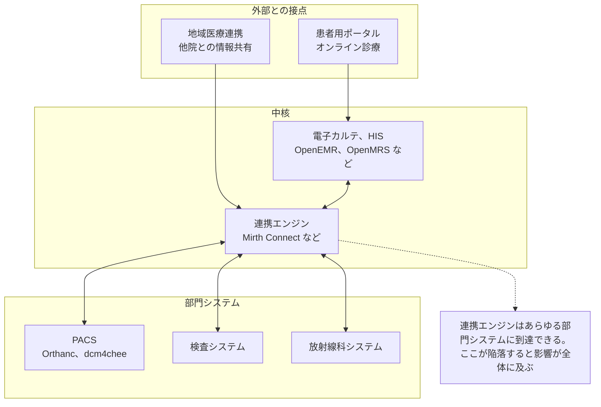

# 🧬 OSS 医療情報システムの脆弱性

オープンソースの電子カルテ（EHR/EMR）、病院情報システム（HIS）、医用画像システムは、小規模なクリニック、新興国の医療機関、研究用途で世界的に使われている。
ソースコードが公開されているため、脆弱性研究の入口としても現実的な対象になる。

> [!NOTE]
> **表記ルール**：本ページでは、**事実**（一次情報で確認できる内容。出典を併記する）、**報道ベース**（報道のみで確認でき、当事者の公表資料では裏付けが取れていない内容）、**分析**（筆者の解釈）を書き分ける。
> 出典は、当事者の公表資料、行政文書、CVE、ベンダアドバイザリなどの一次情報を優先して示す。

## なぜ OSS 医療システムを見るのか

| 観点 | 内容 |
|---|---|
| **合法的に検証できる** | 商用の医療情報システムと異なり、自前で構築して自由に検証できる |
| **実運用されている** | 研究用の玩具ではなく、実際の診療現場で患者データを扱っている |
| **医療ドメイン固有の設計が学べる** | 患者、受診、オーダ、処方、保険請求という医療特有のデータモデルと権限設計を、コードレベルで理解できる |
| **商用システムにも通じる** | 医療 IT に共通する設計上の落とし穴（患者 ID の直接参照、監査ログの欠落など）は、商用製品でも同様に発生する |

> [!WARNING]
> 検証は、自分で構築したローカル環境で行ってほしい。
> インターネット上で公開稼働している医療システムへの無許可のテストは、多くの国で違法であり、実在する患者の診療に影響する。

## 一覧

- [医療で使われる OSS の一覧](oss-catalog.md)
- [報告された脆弱性の事例（CVE）](cve-cases.md)
- [SCA と SBOM で既知脆弱性に対処する](sca-sbom.md)
- [OSS 電子カルテ、HIS の脆弱性](ehr-systems.md)
- [医用画像 OSS（PACS/DICOM 実装）の脆弱性](imaging-pacs.md)

## 医療情報システムの構成

OSS であれ商用であれ、医療情報システムの構成は共通している。
どの層を見ているのかを意識すると、脆弱性の性質が整理しやすい。

## 医療システムに固有の脆弱性パターン

一般的な Web 脆弱性のうち、医療システムでは次のものが繰り返し発見される（**分析**）。
脆弱性の種類そのものは Web 一般と変わらない。
変わるのは、医療のデータモデルと運用が、同じ欠陥の影響範囲を広げる点である。

| # | パターン | 医療における現れ方 | 深刻度が上がる理由 |
|---|---|---|---|
| 1 | **IDOR / 権限昇格** | `patient_id`、`encounter_id`、`document_id` の直接参照 | 1 件の欠陥で全患者の診療録が読める |
| 2 | **認証、セッションの不備** | 共有端末前提の設計、長時間セッション、緊急時ログイン（Break-glass）の乱用 | 病棟の共有端末が実質的に無認証端末になる |
| 3 | **SQL インジェクション** | 検索画面（患者検索、オーダ検索）に集中 | 検索は患者テーブル全体に対する権限で動くことが多い |
| 4 | **ファイルアップロード / ダウンロード** | スキャン文書、紹介状、画像添付 | 医療文書は種類が多く、検証が緩くなりがち |
| 5 | **監査ログの欠落、改ざん可能性** | 誰がどの患者記録を見たかの記録 | 法令上の要求事項であり、欠落自体がコンプライアンス違反になる |
| 6 | **API / 連携インタフェース** | HL7 v2、FHIR、CSV バッチ連携 | 「内部システム間だから」と認証が省略されがち |

以下、それぞれについて、どういう機構で生じるか、OSS のコードのどこを見るか、何をすれば減らせるかを順に述べる。

### 1. IDOR と認可の不備

**なぜ生じるか（分析）**

医療の業務データは患者を軸に正規化されており、受診、オーダ、処方、検査結果、文書のほぼすべてのテーブルが患者 ID を外部キーに持つ。
画面と API は「渡された ID のレコードを取得して表示する」形で実装され、取得したレコードに対して「この利用者が見てよいか」を判定する層が抜け落ちる。
医療では、診察券番号やカルテ番号が業務上あちこちに現れるため、識別子が推測可能な連番のまま外部に出やすい。

ロールの数も一般的な業務システムより多い。
医師、看護師、検査技師、事務、委託業者、患者本人、家族が同じデータに異なる範囲で触れるため、判定条件が画面ごとに散らばる。

**コードのどこを見るか**

| 箇所 | 見るもの |
|---|---|
| 一覧と詳細の非対称 | 一覧のクエリには所属や担当の条件が入っているが、詳細表示は ID だけで引いていないか |
| 印刷、PDF、CSV の出力 | 画面と別のコードパスになっており、認可チェックが複製されていないか |
| 添付文書のダウンロード | ファイル ID から直接ストレージを引いていないか |
| 後付けの API | 画面側の権限判定が API 層に反映されているか |
| 患者ポータルと職員画面の境界 | 同じコントローラを共用し、ロールで分岐しているだけになっていないか |

**深刻度が上がる理由**

診療記録は、パスワードのように事後に差し替えられない。
また、認可判定が個々の画面に散っている構造では、1 か所の漏れが患者テーブル全体への到達を意味する。

**減らし方**

認可判定をデータ取得層に一元化し、画面ごとの実装に任せない。
医療従事者が担当外の患者を参照できる設計（緊急時アクセス）は正当な業務要件として存在するため、禁止ではなく、理由の記録と事後監査で担保する。

患者向け画面に固有の観点は [患者用ポータルで狙われやすい脆弱性](../web-security/patient-portal.md) にまとめている。

### 2. 認証とセッションの設計

**なぜ生じるか（分析）**

病棟のスタッフステーションや外来の診察室では、1 台の端末を複数の職員が代わる代わる使う。
診療の合間に何度もログインし直す負荷が現場の抵抗を生むため、長いセッションタイムアウト、部署の代表アカウント、短い PIN といった設計が採用されやすい。
その結果、システムから見た操作者と、実際に操作した人物が一致しなくなる。

この設計は、監査ログの価値も同時に失わせる。

**コードのどこを見るか**

| 箇所 | 見るもの |
|---|---|
| セッションの既定値 | タイムアウトの初期値、明示的なログアウト時のセッション破棄 |
| パスワードの保存 | 歴史の長いコードベースでは、旧方式のハッシュを扱う経路が残ることがある |
| 初期アカウント | インストール直後の管理者アカウントと初期パスワードの扱い |
| セットアップ、インストーラ | 導入後に無効化されるか。再実行で管理者を作り直せないか |
| 緊急時アクセス | 理由の入力を求めるか。実行が記録されるか。事後にレビューされるか |

**減らし方**

端末単位ではなく個人単位で識別する。
再ログインの摩擦を下げる手段（IC カードのタップなど）と、短い自動ロックを組み合わせる。
緊急時アクセスは、機能を残したうえで、実行の記録と事後レビューを運用に組み込む。

### 3. SQL インジェクション

**なぜ検索画面に集中するのか（分析）**

医療業務の入口は検索である。
氏名、カナ、生年月日、期間、診療科、病名コード、検査項目といった条件の組合せが可変で、しかも現場ごとに求める切り口が違う。
このため、ORM を使っている実装でも、患者検索, オーダ検索, 統計, 帳票の周辺だけは動的に SQL を組み立てるコードが残りやすい。
帳票やレポート生成の機能は、条件式や列名を利用者から受け取る設計になりがちで、プレースホルダで塞げない箇所を作る。

**深刻度が上がる理由**

検索処理は、その性質上、患者テーブル全体を対象とする権限で動く。
アプリ層の認可がどれほど正しくても、SQL インジェクションはその判定より下の層で成立する。

**コードのどこを見るか**

- 検索条件の組み立て（特に、条件が空のときに文字列連結で `WHERE` を作る箇所）
- ソート順とページングのカラム名。値はプレースホルダにできても、識別子はできない
- `LIKE` に渡す前のワイルドカードの扱い
- CSV、帳票の出力処理。画面と別のクエリを持つことが多い
- レポートビルダ、カスタムクエリ機能

**減らし方**

値はプレースホルダで渡し、列名やソート順は許可リストで検証する。
アプリが使う DB ユーザの権限を用途ごとに分け、参照系の処理から更新やファイル書き出しができないようにする。

### 4. ファイルのアップロードとダウンロード

**なぜ検証が緩むのか（分析）**

医療機関が扱う文書は種類が多い。
紹介状、同意書、スキャンした保険証、心電図の波形、検査機器が吐く独自形式、DICOM 画像が、同じ添付機能に集まる。
「どの形式を受け入れるか」を決め切れないため、拡張子や `Content-Type` による検証が緩くなり、最終的に何でも通る実装に落ち着く。

**何が起きるか**

| 経路 | 結果 |
|---|---|
| Web ルート配下への保存と実行可能拡張子 | アップロードしたファイルが直接実行され、コード実行に至る |
| 受信した識別子をそのままファイル名に使う | パストラバーサルによる任意パスへの書き込み |
| ダウンロード側の認可欠落 | 1 の IDOR と同型。文書 ID の付け替えで他患者の紹介状や診断書が取得できる |
| DICOM ファイルの取り込み | プリアンブル領域を悪用したポリグロット。[医用画像 OSS の脆弱性](imaging-pacs.md) に詳述した |

OpenEMR で公開されてきた攻撃経路は、SQL インジェクションで管理者権限を得たうえで、このアップロード機能をコード実行に使う連鎖だった（[OSS 電子カルテ、HIS の脆弱性](ehr-systems.md)）。

**減らし方**

保存先を Web ルートの外に置き、保存名は利用者入力から切り離した乱数にする。
配信は認可を通したハンドラ経由に限る。
宣言された形式と実体の一致を検証し、アーカイブ展開には件数とサイズの上限を設ける。

### 5. 監査ログの欠落と改ざん可能性

**事実**

厚生労働省の医療情報システムの安全管理に関するガイドラインは、医療情報システムに対するアクセスの記録と、その保存を求めている（[医療情報システムの安全管理に関するガイドライン 第 7.0 版](https://www.mhlw.go.jp/stf/shingi/0000516275_00006.html)）。
標準の側にも仕組みがあり、FHIR は監査記録を表現するリソースとして [AuditEvent](https://hl7.org/fhir/auditevent.html) を定義している。

**医療で特に問われる点（分析）**

医療で問題になる内部不正は、データの改ざんではなく参照であることが多い。
知人や著名人の診療録を業務上の必要なく閲覧する行為は、更新を伴わないため、更新ログしか取得していないシステムでは痕跡が残らない。

**実装で見つかる欠落**

| 欠落 | 帰結 |
|---|---|
| 参照イベントを記録していない | 閲覧だけで完結する不正が追跡できない |
| ログに記録されるのが接続ユーザだけ | 2 の共有アカウント問題と結びつき、人物まで辿れない |
| ログが業務データと同じ DB, 同じ権限で書かれる | 侵入者や内部者が削除, 改変できる |
| 端末とサーバの時刻がずれている | 複数システムのログを突き合わせられない |

**減らし方**

参照イベントを患者単位で記録し、追記のみが可能な別系統へ転送する。
時刻同期と保存期間を運用として定める。
通常と異なる参照パターンの検知は有効だが、しきい値の設定次第で漏れも過検知も起きる。
自動検知だけに委ねず、定期的な事後レビューと組み合わせる。

### 6. API と連携インタフェース

**事実**

FHIR の仕様は、自身がセキュリティのプロトコルではなく、セキュリティ機能を定義しないと明記している。
認証と認可には OAuth 2.0 と SMART App Launch の利用を推奨する形で、外部の規格に委ねている（[FHIR Security](https://hl7.org/fhir/security.html)）。
HL7 v2 も同様に、認証と暗号化を規格自体に含まない（[HL7 v2 と FHIR の攻撃面](../web-security/hl7-fhir.md)、[用語集](../../reference/GLOSSARY.md)）。

**帰結（分析）**

セキュリティが実装と設置環境に委ねられる以上、「院内ネットワークに閉じているから安全」という前提が、実質的な唯一の防御になっている構成が生まれる。
この前提は、VPN 機器の侵害や委託先経由の侵入で崩れる。
連携エンジンはあらゆる部門システムに到達できる位置にあるため、そこが陥落したときの影響は電子カルテ、検査、画像、会計に及ぶ。

**コードと設定のどこを見るか**

| 箇所 | 見るもの |
|---|---|
| 連携用エンドポイント | 固定の Basic 認証や IP 制限だけで守っていないか |
| FHIR サーバの検索 | 患者コンパートメント（[Patient compartment](https://hl7.org/fhir/compartmentdefinition-patient.html)）の制約が全リソースに適用されているか |
| バルクエクスポート | 一括取得の権限が、通常の参照権限と分離されているか |
| CSV バッチ連携 | 共有フォルダの権限、置きっぱなしの中間ファイル |
| 連携用アカウント | 用途を越えた権限を持っていないか。人のアカウントと混在していないか |

**減らし方**

システム間の通信にも相互 TLS と認証を導入し、ネットワーク境界だけに依存しない。
連携用アカウントは用途ごとに分け、必要なリソースの範囲に限定する。
メッセージ単位の送受信ログを残し、想定外の宛先や量の変化を検知できるようにする。

## 脆弱性の調べ方

特定の製品について既知の脆弱性を調べるときの入口を挙げる。

| 情報源 | 用途 |
|---|---|
| [NVD 検索](https://nvd.nist.gov/vuln/search) | 製品名で CVE を横断検索する |
| [CVE Program 検索](https://www.cve.org/) | CVE の一次情報を確認する |
| [GitHub Security Advisories](https://github.com/advisories) | OSS のエコシステム別アドバイザリ |
| [GitHub Issues / Commit ログ](https://github.com/) | 「セキュリティ修正だが CVE が振られていない」コミットを探す |
| [Exploit-DB](https://www.exploit-db.com/) | 公開 PoC の有無を確認する |
| [OSV](https://osv.dev/) | 依存パッケージ由来の脆弱性を機械的に確認する |
| [JVN](https://jvn.jp/) | 国内で調整, 公表された脆弱性情報 |
| [JVN iPedia](https://jvndb.jvn.jp/) | 日本語で CVE を検索する。[MyJVN API](https://jvndb.jvn.jp/apis/myjvn/) で機械的にも取得できる |
| [CISA KEV](https://www.cisa.gov/known-exploited-vulnerabilities-catalog) | 悪用が確認された脆弱性。適用の優先順位に使う |
| [EPSS](https://www.first.org/epss/) | 悪用される確率の推定値 |
| [FDA / CISA ICS Medical Advisories](https://www.cisa.gov/news-events/cybersecurity-advisories) | 医療機器、医療システム向けの公的アドバイザリ |

## 新規追加のしかた

新しい脆弱性事例を追加するときは、[`docs/reference/_templates/vulnerability.md`](../../reference/_templates/vulnerability.md) をコピーして使ってほしい。

---

[トップへ](../../../README.md)
