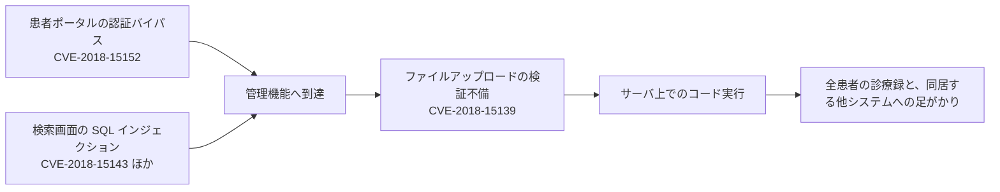

# 報告された脆弱性の事例（CVE）

医療で使われる OSS に実際に報告された脆弱性を、製品ごとにまとめる。
各項目は、何が起きるか、医療の運用で何を意味するか、どう検知し緩和するかの順に書く。

> [!NOTE]
> **表記ルール**：本ページでは、**事実**（一次情報で確認できる内容。出典を併記する）、**分析**（筆者の解釈）を書き分ける。
> CVE の内容、CVSS 値、影響バージョンは [NVD](https://nvd.nist.gov/vuln/search) の記載を、日本語の登録は [JVN iPedia](https://jvndb.jvn.jp/) を確認した（2026 年 8 月 20 日時点）。
> 製品の一覧と選定の観点は [医療で使われる OSS の一覧](oss-catalog.md) にある。

> [!WARNING]
> 本ページに攻撃を再現する手順やコードは書かない。
> 記載した CVE は、いずれも修正版が公開されている。
> 検証する場合は、自分で構築した隔離環境に限り、実在の患者データを投入しない。

## 読み方

**分析**：CVE が多い製品を「危険な製品」と読むと判断を誤る。
CVE は、監査を受け、報告を受け付け、採番に協力したプロジェクトほど多く積み上がる。
医療機関の側で意味を持つのは件数ではなく、次の三つである。

1. その欠陥が **認証前** に成立するか
2. その製品が **どこに置かれているか**（外部公開か、連携基盤か、部門内か）
3. **修正版が出ているのに適用していない期間** がどれだけあるか

3 が最も現実的な指標になる。
公表された CVE は、攻撃者にとっても欠陥の所在を示す地図になるためである。

---

## OpenEMR

**事実**：NVD のキーワード検索では 226 件が該当する。
JVN iPedia にも日本語で 218 件が登録されている（検索語 `OpenEMR`）。

### 2018 年に公開された連鎖

| CVE | CVSS v3 | 内容 | 修正 |
|---|---|---|---|
| CVE-2018-15143 | 9.8 | 予約検索の SQL インジェクション | 5.0.1.4 |
| CVE-2018-15145 | 9.8 | イベント編集画面の SQL インジェクション | 5.0.1.4 |
| CVE-2018-15152 | 9.1 | 患者ポータルの認証バイパス | 5.0.1.4 |
| CVE-2018-15139 | 8.8 | サイトファイル管理での無制限な PHP ファイルアップロード | 5.0.1.4 |
| CVE-2018-15142 | 8.8 | ディレクトリトラバーサルによる PHP コード実行 | 5.0.1.4 |
| CVE-2018-15153〜15156 | 8.8 | FAX 送受信, 請求検索での OS コマンドインジェクション | 5.0.1.4 |

**何が起きるか**：認証を回避して管理者相当の権限を得たうえで、アップロード機能に PHP ファイルを置き、サーバ上でコードを実行する。
単独の欠陥ではなく、認証バイパス、SQL インジェクション、ファイルアップロードを順に使う連鎖として成立する。

### 2026 年に公開されたもの

| CVE | CVSS v3 | 内容 | 修正 |
|---|---|---|---|
| CVE-2026-39932 | 9.1 | CategoryTree の `eval()` に PHP のコードを注入され、リモートコード実行に至る | 8.2.0 より後 |
| CVE-2026-33918 | 8.8 | 請求のファイルダウンロードで権限確認が欠落し、診療情報を取得できる | 8.0.0.3 |
| CVE-2026-34055 | 8.1 | 旧来の患者ノート機能の IDOR。他患者の記録を参照できる | 8.0.0.3 |
| CVE-2026-67611 | 8.1 | パスワードグラントを使った認証で多要素認証を回避できる | 8.2.0 より後 |
| CVE-2026-67610 | 8.1 | OAuth2 の動的クライアント登録の不備により FHIR API へ不正にアクセスできる | 8.2.0 より後 |
| CVE-2026-33913 | 7.7 | Carecoordination モジュールの XXE によりサーバ上のファイルを読み出せる | 8.0.0.3 |
| CVE-2026-33931 | 6.5 | 患者ポータルの支払い画面の IDOR | 8.0.0.3 |
| CVE-2026-33934 | 4.3 | ポータルの患者が職員の署名を取得できる | 8.0.0.3 |

出典：[NVD](https://nvd.nist.gov/vuln/search/results?query=openemr)、[JVN iPedia](https://jvndb.jvn.jp/)（例：JVNDB-2026-009228 が CVE-2026-33913 に対応する）

**分析**：2018 年の一群と 2026 年の一群では、脆弱性の性質が変わっている。
2018 年は SQL インジェクションとコマンドインジェクションが中心で、Web アプリ一般の欠陥だった。
2026 年に目立つのは、患者ポータルと FHIR API の**認可**である。
IDOR、ACL の欠落、OAuth2 の動的クライアント登録、多要素認証の回避が並ぶ。
これは、電子カルテが外部と接続する機能を増やした結果、攻撃面が「入力の処理」から「誰が何に触れてよいかの判定」へ移動したことを示す。

**医療での意味**：ポータル側の IDOR は、認証済みの患者アカウント 1 つで他患者の情報に到達する。
攻撃には特別な権限がいらず、正規の利用者が普通に操作しているようにしか見えない。
アクセスログを患者単位で残していなければ、事後に範囲を特定できない。

**検知と緩和**

- 修正版へ更新する。バージョンは資産台帳で管理し、公表から適用までの日数を記録する
- 患者ポータルを、職員用の画面と別のホストに分離し、外部からの到達範囲を狭める
- ポータルのアカウント 1 つが短時間に多数の患者 ID を参照する動きを検知対象にする
- FHIR API のクライアント登録を管理者の承認制にし、動的登録を無効化できるか確認する

---

## OpenMRS

**事実**：NVD のキーワード検索で 33 件。

| CVE | CVSS v3 | 内容 |
|---|---|---|
| CVE-2017-12796 | 9.8 | 細工した XML のデシリアライズによる未認証のリモートコード実行（2.6.1 未満） |
| CVE-2018-19276 | 9.8 | 安全でないオブジェクトのデシリアライズによるコード実行（2.24.0 未満） |
| CVE-2018-16521 | 9.8 | HTML Form Entry モジュールの XXE |
| CVE-2021-43094 | 9.8 | 患者検索パラメータの SQL インジェクション（2.4.0 以前） |
| CVE-2020-24621 | 8.8 | htmlformentry のパストラバーサル |
| CVE-2022-23612 | 7.5 | 細工したリクエストによる任意ファイルの持ち出し |
| CVE-2020-5732 / 5733 | 6.1 | Data Exchange の入出力で認証確認が欠落 |
| CVE-2026-40075 / 40076 | - | パストラバーサル（JVNDB-2026-015409, JVNDB-2026-015118） |

出典：[NVD](https://nvd.nist.gov/vuln/search/results?query=openmrs)、[JVN iPedia](https://jvndb.jvn.jp/)

**分析**：OpenMRS の重い脆弱性は、デシリアライズに集中している。
Java のオブジェクトデシリアライズと XML パーサは、入力を「データ」ではなく「命令」として扱ってしまう箇所であり、外部に開いたエンドポイントに置かれると未認証の実行につながる。
モジュール機構を持つ製品では、本体を更新してもモジュール側が古いまま残る。
CVE-2018-16521 と CVE-2020-24621 は本体ではなくモジュールの欠陥であり、資産台帳に「OpenMRS 2.x」とだけ書いていると追跡できない。

**検知と緩和**

- 本体とモジュールのバージョンを別々に台帳へ記録する
- XML パーサの外部エンティティ解決を無効化する設定を確認する
- Data Exchange のような一括入出力機能は、通常の参照権限と分けて権限を割り当てる

---

## OpenClinic GA

**事実**：NVD のキーワード検索（`openclinic`）で 48 件が該当する。
2020 年から 2021 年にかけて、同一バージョンに対する多数の CVE が一括で公開された。

| CVE | CVSS v3 | 内容 |
|---|---|---|
| CVE-2020-14487 | 9.8 | 隠された既定アカウントによる不正アクセス |
| CVE-2020-14485 | 9.8 | クライアント側でのアクセス制御。管理機能を直接呼び出せる |
| CVE-2020-14484 / 14494 | 9.8 | 認証の強度不足とロックアウトの回避により総当たりが成立する |
| CVE-2020-27227 | 9.8 | 未認証のコマンドインジェクション（5.173.3） |
| CVE-2020-27233〜27241 | 9.8 | 各種パラメータの SQL インジェクション |
| CVE-2020-14493 | 8.8 | SQL インジェクション経由のファイル書き込みとコマンド実行 |
| CVE-2020-14490 | 8.8 | ローカルファイルインクルードと任意ファイルの実行 |
| CVE-2020-14488 | 8.8 | ファイルアップロードの検証不足 |

同名の別製品である OpenClinic 0.8.2 にも、認証なしで検査結果を参照できる CVE-2020-28937（7.5）が登録されている。

出典：[NVD](https://nvd.nist.gov/vuln/search/results?query=openclinic)

**分析**：CVE-2020-14485 の「クライアント側のアクセス制御」は、医療システムで繰り返し見つかる型である。
画面上でボタンを隠して権限を表現し、サーバ側で同じ判定をしていない。
利用者が画面から操作する限りは正しく動くため、受け入れテストでは発見されない。

**医療での意味**：隠し既定アカウント（CVE-2020-14487）が意味するのは、パッチだけでは終わらないということである。
導入時から存在したアカウントが使われていた場合、更新しても侵入の痕跡は消えず、認証情報の棚卸しとログの遡及確認が必要になる。

**検知と緩和**

- 稼働中のアカウント一覧を出し、業務上の持ち主が説明できないアカウントを止める
- 認証の失敗回数とロックアウトの設定を、既定値のまま使っていないか確認する
- 認可の判定がサーバ側にあるかを、画面ではなく API への直接リクエストで確認する

---

## LibreHealth EHR

**事実**：NVD のキーワード検索で 20 件。
LibreHealth EHR は OpenEMR からのフォークである。

| CVE | CVSS v3 | 内容 |
|---|---|---|
| CVE-2018-1000646 / 1000648 / 1000649 | 8.8 | テンプレート取り込みと患者文書作成における無制限のファイル書き込み。コード実行に至る |
| CVE-2020-11439 | 8.8 | ローカルファイルインクルードによる任意の PHP 実行 |
| CVE-2020-23829 | 8.8 | 認証済みのファイルアップロードからのコード実行 |
| CVE-2022-31496 | 8.8 | `manage_site_files.php` のアクセス制御不備 |
| CVE-2022-29938 | 8.8 | `payment_id` パラメータの SQL インジェクション |

出典：[NVD](https://nvd.nist.gov/vuln/search/results?query=librehealth)

**分析**：フォークされた製品では、元プロジェクトが修正した欠陥が、フォーク側に残り続けることがある。
LibreHealth EHR の 2018 年の一群は、OpenEMR で同時期に扱われたテンプレート取り込みとファイル書き込みの問題と同型である。
OSS を選ぶときにフォークの由来を確認するのは、この継承を見落とさないためである（[医療で使われる OSS の一覧](oss-catalog.md#採用するときに見る点)）。

---

## Mirth Connect

**事実**：NextGen Healthcare Mirth Connect の 4.4.1 より前のバージョンに、未認証のリモートコード実行の脆弱性 CVE-2023-43208（CVSS v3.1 基本値 9.8）が存在する。
NVD の記述によれば、これは CVE-2023-37679 の修正が不完全であったことに起因する。
CISA は 2024 年 5 月 20 日にこの脆弱性を Known Exploited Vulnerabilities カタログへ追加し、対応期限を 2024 年 6 月 10 日、名称を "NextGen Healthcare Mirth Connect Deserialization of Untrusted Data Vulnerability" とした。

出典：[NVD CVE-2023-43208](https://nvd.nist.gov/vuln/detail/CVE-2023-43208)、[CISA Known Exploited Vulnerabilities Catalog](https://www.cisa.gov/known-exploited-vulnerabilities-catalog)

**なぜ重いか（分析）**：三つが重なっている。

1. **未認証で成立する**：到達できれば、資格情報がいらない
2. **置かれている場所**：連携エンジンは電子カルテ、検査、画像、会計のすべてに接続する
3. **悪用が確認されている**：KEV への掲載は、理論上のリスクではないことを意味する

さらに、修正が不完全だった点が実務上の教訓になる。
CVE-2023-37679 に対して更新を済ませた組織でも、CVE-2023-43208 には対応できていなかった。
「一度当てたから安全」という前提が崩れる典型例である。

**検知と緩和**

- 4.4.1 以降へ更新する。KEV 掲載分は、通常のパッチ運用と別の期限で扱う
- 管理コンソールと接続用ポートの外部到達性を確認する。連携エンジンは公開しない
- チャネルの設定変更、デプロイ、スクリプト更新を監査ログとして残し、変更を監視する
- 連携用アカウントの権限を接続先ごとに分け、1 つの侵害が全部門に及ばないようにする

関連：[OSS 電子カルテ、HIS の脆弱性](ehr-systems.md)

---

## HAPI FHIR と HL7 FHIR Core

**事実**：NVD のキーワード検索（`hapi fhir`）で 16 件。

| CVE | CVSS v3 | 内容 |
|---|---|---|
| CVE-2024-51132 | 9.8 | XXE により内部データの読み出しやコード実行に至る（6.4.0 未満） |
| CVE-2026-34361 | 9.3 | SSRF と資格情報の窃取が組み合わさる（6.9.4 未満） |
| CVE-2026-34359 | 9.1 | URL 検証が前方一致で行われ、リダイレクト先へ資格情報が渡る |
| CVE-2026-55471 | 9.1 | XSLT 変換が保護されておらず XXE と SSRF が成立する（6.9.10 未満） |
| CVE-2024-52007 | 8.6 | XSLT の処理が外部 DTD による XXE を許す |
| CVE-2026-34360 | 5.8 | `/loadIG` エンドポイントの未認証 SSRF |
| CVE-2026-45367 / 49485 | 7.5 | 正規表現の破滅的バックトラックによるサービス妨害 |
| CVE-2026-62295 / 62296 | 7.5 | 深くネストした JSON, XHTML によるスタックオーバーフロー |
| CVE-2026-55470 | 7.5 | DSTU2 モジュールで XXE の修正が不完全 |

日本語では JVNDB-2026-024365（CVE-2026-55471）、JVNDB-2026-010099（CVE-2026-34360）などとして登録されている。

出典：[NVD](https://nvd.nist.gov/vuln/search/results?query=hapi+fhir)、[JVN iPedia](https://jvndb.jvn.jp/)

**分析**：FHIR の実装で XXE と SSRF が繰り返し現れるのは、仕様が外部参照を前提に組み立てられているためである。
Implementation Guide の読み込み、プロファイルの解決、`Reference` による他リソースの参照は、いずれも「外部の URL を取りに行く」処理になる。
サーバがこれを行う以上、行き先を利用者が指示できる箇所は SSRF の候補になる。
クラウド上に置いた FHIR サーバでは、SSRF がインスタンスメタデータへの到達につながる（[クラウド事業者と医療](../cloud/)）。

CVE-2026-55470 は、CVE-2024-51132 と CVE-2024-52007 に対する修正が別モジュールで不完全だったものである。
Mirth Connect と同じく、同一の欠陥系統が複数回にわたって採番されている。

**検知と緩和**

- XML パーサで外部エンティティと外部 DTD を無効化する設定を確認する
- サーバから外部へ出る通信を、許可リストで制限する。クラウドではメタデータエンドポイントへの到達を塞ぐ
- IG の読み込みなど外部取得を伴う機能は、運用環境では無効化するか認証を必須にする
- リクエストのサイズとネストの深さに上限を設ける

---

## Orthanc

**事実**：NVD のキーワード検索で 9 件。

| CVE | CVSS | 内容 |
|---|---|---|
| CVE-2025-0896 | v3.1: 9.8 / v4.0: 9.2 | 1.5.8 より前では、リモートアクセスを有効にしても基本認証が既定で有効にならない |
| CVE-2023-33466 | 8.8 | 認証済みの利用者が任意のファイルを上書きでき、コード実行に至りうる（1.12.0 未満） |
| CVE-2026-5438 / 5439 | 7.5 | gzip 展開と ZIP のメタデータを悪用したメモリ枯渇 |
| CVE-2026-5444 | 7.1 | PAM 画像の解析における整数オーバーフロー起因のヒープバッファオーバーフロー |
| CVE-2024-22725 | 6.1 | エラー表示に起因する反射型 XSS |

CVE-2025-0896 については、CISA が ICS Medical Advisory（ICSMA-25-037-02）を公開している。
日本語では JVNDB-2026-011273（CVE-2026-5438）などとして登録されている。

出典：[NVD CVE-2025-0896](https://nvd.nist.gov/vuln/detail/CVE-2025-0896)、[CISA ICS Medical Advisories](https://www.cisa.gov/news-events/cybersecurity-advisories)

**分析**：CVE-2025-0896 は、コードの欠陥というより**既定設定の設計**の問題である。
「リモートアクセスを有効にする」という 1 つの操作で、認証のない画像サーバが外部に現れる。
医用画像は容量が大きく、通常の DLP では持ち出しの検知が遅れる。
インターネットに露出した PACS が繰り返し観測されてきた背景には、この種の既定値がある（[医用画像 OSS の脆弱性](imaging-pacs.md)）。

2026 年に公開された一群は、メモリ枯渇と境界外書き込みである。
DICOM の受信は、外部から届いたバイト列を解析する処理であり、受信するだけで到達する。

**検知と緩和**

- 認証を明示的に有効化する。既定で無効な設定を、導入手順のチェック項目にする
- 管理 UI（既定で 8042 など）と DICOM のポート（104, 11112）を、外部から到達不能にする
- 取り込むファイルのサイズと展開後のサイズに上限を設ける
- 画像の一括取得（C-MOVE、REST での大量ダウンロード）を、量と時間帯で監視する

---

## DCMTK、GDCM、pydicom

**事実**：DCMTK は NVD のキーワード検索で 31 件。

| CVE | CVSS v3 | 内容 |
|---|---|---|
| CVE-2022-2119 | 9.8 | SCP のパストラバーサルにより任意のファイルを書き込め、コード実行に至る（3.6.7 未満） |
| CVE-2022-2120 | 9.8 | SCU の相対パストラバーサルによる任意ファイルの配置（3.6.7 未満） |
| CVE-2019-1010228 | 9.8 | RLE デコーダのバッファオーバーフロー（3.6.3 以前） |
| CVE-2024-47796 / 52333 | 7.8 | 配列インデックスの検証不備による境界外書き込み |
| CVE-2021-41687〜41690 | 7.5 | メモリリーク, 二重解放によるサービス妨害 |
| CVE-2025-25475 | 7.5 | RLE コーデックの NULL ポインタ参照 |

GDCM（Grassroots DICOM）にも境界外読み書きが継続的に登録されている（CVE-2024-22373、CVE-2024-22391、CVE-2024-25569、CVE-2025-48429、CVE-2025-52582、CVE-2025-53618、CVE-2025-53619、CVE-2025-11266、CVE-2026-3650）。
pydicom にはパストラバーサルの CVE-2026-32711 が登録されている（JVNDB-2026-008596）。

出典：[JVN iPedia](https://jvndb.jvn.jp/)、[NVD](https://nvd.nist.gov/vuln/search/results?query=dcmtk)

**分析**：この層の脆弱性は、利用者が製品名で追えない点に難しさがある。
DCMTK と GDCM は、商用の PACS、ビューア、AI 解析ソフトの内部で動く。
医療機関の台帳には製品名しか載らないため、CVE が公表されても自組織が影響を受けるかを判断できない。
判断できるのはベンダだけであり、利用者側が同じ土俵に立つには SBOM が要る（[SCA と SBOM で既知脆弱性に対処する](sca-sbom.md)）。

CVE-2022-2119 と CVE-2022-2120 が示す経路も、この分野に固有である。
受信した DICOM の識別子（SOP Instance UID など）をそのままファイル名に使う実装では、識別子に含まれるパス区切りが保存先を変えてしまう。
DICOM を「画像」ではなく「外部入力の構造体」として扱えているかが分かれ目になる。

**検知と緩和**

- ベンダに、製品が使う DICOM ライブラリとそのバージョンを問い合わせる。契約に SBOM の提供を含める
- 受信した識別子をファイル名やパスに直接使わない実装であることを確認する
- 画像受信のプロセスを最小権限で動かし、書き込み先を専用のディレクトリに限定する
- 送信元の AE Title と IP を許可リストで制限し、想定外の送信元からの取り込みを止める

---

## DHIS2

**事実**：NVD のキーワード検索で 13 件。

| CVE | CVSS v3 | 内容 |
|---|---|---|
| CVE-2021-39179 / 41187 | 8.8 | Tracker と `/api/trackedEntityInstances` の SQL インジェクション |
| CVE-2022-24848 | 8.8 | `/api/programs/orgUnits` の SQL インジェクション |
| CVE-2026-55084 | 8.8 | SqlView API のフィルタパラメータの SQL インジェクション |
| CVE-2026-55082 | 8.7 | SQL View のフィルタ値の展開における SQL インジェクション |
| CVE-2022-41948 | 7.2 | 権限昇格によりスーパーユーザ権限を付与できる |
| CVE-2023-31139 | 7.5 | Personal Access Token がセッションクッキーとして扱われ、アクセス制限を回避する |
| CVE-2022-41949 | 5.0 | 外部リソースへのリクエストを発生させる SSRF |

出典：[NVD](https://nvd.nist.gov/vuln/search/results?query=dhis2)

**分析**：DHIS2 は国単位の保健情報を集約する用途で使われる。
同じ SQL インジェクションでも、影響が 1 施設ではなく国民規模の集計データに及ぶ。
SQL View のように「利用者が問い合わせを定義できる」機能は、設計上プレースホルダで塞ぎ切れない箇所を残す。
この種の機能は、権限を限定した管理者だけに開くのが現実的である。

---

## REDCap、OpenClinica、XNAT

**事実**

| 製品 | CVE | CVSS v3 | 内容 |
|---|---|---|---|
| REDCap | CVE-2020-26712 | 9.8 | ToDoList の `sort` パラメータの SQL インジェクション |
| REDCap | CVE-2019-14937 | 7.5 | カレンダー機能の時間ベース SQL インジェクション |
| REDCap | CVE-2017-7351 | 8.8 | ファイルアップロード処理の SQL インジェクション |
| OpenClinica | CVE-2022-24830 | 9.8 | 複数エンドポイントのパストラバーサル |
| OpenClinica | CVE-2022-24831 | 9.8 | 文字列連結でクエリを組み立てたことによる SQL インジェクション |
| OpenClinica | CVE-2025-12921 / 12922 | 8.8 | CRF データ取り込みの XML インジェクションとパストラバーサル |
| XNAT | CVE-2019-14276 | 6.5 | POST 本文による XXE |

NVD の件数は REDCap が 43 件、OpenClinica が 4 件、XNAT が 1 件である。

出典：NVD の製品別検索（[REDCap](https://nvd.nist.gov/vuln/search/results?query=redcap)、[OpenClinica](https://nvd.nist.gov/vuln/search/results?query=openclinica)、[XNAT](https://nvd.nist.gov/vuln/search/results?query=xnat)）

**分析**：研究系のシステムは、情報システム部門の管理外に置かれやすい。
研究費で立てたサーバが、研究終了後も更新されずに残る。
扱うデータは同意の範囲が定められた研究データであり、漏えいしたときは個人情報保護法の問題に加えて、研究倫理と同意の逸脱の問題になる。

**検知と緩和**

- 研究用サーバを資産台帳に載せる。台帳の対象を「情報システム部門が構築したもの」に限定しない
- 研究の終了時に、サーバの停止とデータの取り扱いを決める手続きを作る
- インターネットからの到達性を定期的に確認する

---

## MONAI

**事実**：医用画像向けの深層学習フレームワークである MONAI には、次の脆弱性が GitHub Security Advisory として公開されている。

| 識別子 | 深刻度 | 内容 |
|---|---|---|
| CVE-2025-58757 | HIGH | 安全でない `pickle` のデシリアライズによるリモートコード実行 |
| CVE-2025-58756 | HIGH | 安全でない `torch` の利用により任意コードが実行されうる |
| CVE-2025-58755 | HIGH | パストラバーサルを防いでいない |
| GHSA-wg9g-w2j2-8pgr | HIGH | NumpyReader が細工した `.npy` ファイルを安全でない形で読み込む |
| GHSA-rghg-q7wp-9767 | HIGH | OS コマンドインジェクション |
| GHSA-qxq5-qhx6-94qw | HIGH | `algo_from_pickle()` の `pickle.loads()` に対する修正が 1.5.2 でも不完全 |
| CVE-2026-21851 | MODERATE | NGC のバンドル取得におけるパストラバーサル（Zip Slip） |

出典：[OSV](https://osv.dev/)（`MONAI` / PyPI）、[GitHub Security Advisories](https://github.com/advisories)

**分析**：ここに並ぶのは、AI 固有の新しい欠陥ではない。
`pickle` の読み込み、アーカイブの展開、外部コマンドの実行という、既知の型がそのまま現れている。
医療で意味が変わるのは、**モデルの配布経路が実行経路になる**ことである。
学習済みモデルやバンドルを外部から取得して読み込む運用では、モデルの入手元を侵害されると、読み込んだ時点でコードが動く。

さらに、GHSA-qxq5-qhx6-94qw が示すとおり、修正が不完全なまま「対応済み」と記録されることがある。
Mirth Connect、HAPI FHIR と同じ構造がここにも現れている。

**検知と緩和**

- モデルとバンドルの入手元を限定し、配布物のハッシュまたは署名を検証する
- `pickle` を伴う読み込みを避け、重みのみを読む形式（`safetensors` など）を検討する
- 推論環境をネットワークから分離し、外部への通信を許可リストで制限する
- AI の実験環境を資産台帳に載せる。研究部門が立てた GPU サーバは見落とされやすい

---

## 横断して見える型

**分析**：ここまでの事例には、製品をまたいで繰り返される型がある。

| 型 | 具体例 | 実務上の意味 |
|---|---|---|
| **修正が不完全** | Mirth Connect（CVE-2023-37679 → CVE-2023-43208）、HAPI FHIR（CVE-2024-51132 → CVE-2026-55470）、MONAI（GHSA-qxq5-qhx6-94qw） | 「更新済み」の記録は、同系統の欠陥が消えたことを意味しない。同じ箇所の CVE を系統で追う |
| **既定設定が危険** | Orthanc（CVE-2025-0896）、OpenClinic GA の隠し既定アカウント（CVE-2020-14487） | パッチ管理だけでは塞げない。導入時の設定確認を手順に入れる |
| **認証前に成立する** | Mirth Connect、OpenMRS のデシリアライズ、OpenClinic GA のコマンドインジェクション | 露出面の把握が最優先の対策になる |
| **認可がコード全体に散る** | OpenEMR の IDOR と ACL 欠落の一群 | 1 か所の漏れが患者テーブル全体への到達になる |
| **パーサのメモリ安全性** | DCMTK、GDCM、Orthanc の画像処理 | 受信するだけで到達する。送信元の制限と権限分離が効く |
| **デシリアライズ** | OpenMRS、MONAI | 入力を命令として扱う箇所。形式の変更で構造的に減らせる |
| **フォークが欠陥を継承** | LibreHealth EHR と OpenEMR | 由来を確認し、元プロジェクトの修正を追う |

**分析**：これらのうち、医療機関の側で手を打てるのは、修正の適用、露出面の縮小、既定設定の確認、そして影響判断を速くする仕組みの四つである。
四つ目が [SCA と SBOM](sca-sbom.md) に対応する。

---

## 情報源

| 情報源 | 用途 |
|---|---|
| [NVD](https://nvd.nist.gov/vuln/search) | CVE の内容、CVSS、影響バージョンの確認 |
| [CVE Program](https://www.cve.org/) | CVE の一次記録 |
| [JVN](https://jvn.jp/) | 国内向けの脆弱性情報と、開発者との調整結果 |
| [JVN iPedia](https://jvndb.jvn.jp/) | 日本語での検索。国内製品と海外製品の双方を収録 |
| [MyJVN API](https://jvndb.jvn.jp/apis/myjvn/) | JVN iPedia の機械的な取得 |
| [CISA KEV](https://www.cisa.gov/known-exploited-vulnerabilities-catalog) | 悪用が確認された脆弱性。適用の優先順位付けに使う |
| [CISA ICS Medical Advisories](https://www.cisa.gov/news-events/cybersecurity-advisories) | 医療機器, 医療システム向けの公的アドバイザリ |
| [GitHub Security Advisories](https://github.com/advisories) | OSS のエコシステム別アドバイザリ |
| [OSV](https://osv.dev/) | 依存パッケージ単位での機械的な確認 |

---

## 関連ページ

- [医療で使われる OSS の一覧](oss-catalog.md)
- [SCA と SBOM で既知脆弱性に対処する](sca-sbom.md)
- [OSS 電子カルテ、HIS の脆弱性](ehr-systems.md)
- [医用画像 OSS（PACS/DICOM 実装）の脆弱性](imaging-pacs.md)
- [組織の脆弱性の分類](../../threats/actors/organizational-vulnerabilities.md)

---

[← OSS 医療情報システムの脆弱性](README.md) | [トップへ](../../../README.md)
