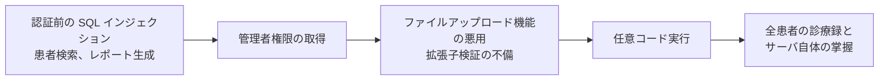

# OSS 電子カルテ、病院情報システムの脆弱性

主要な OSS 電子カルテと病院情報システムについて、報告されてきた脆弱性の傾向をまとめる。

> [!NOTE]
> **表記ルール**：本ページでは、**事実**（一次情報で確認できる内容。出典を併記する）、**報道ベース**（報道のみで確認でき、当事者の公表資料では裏付けが取れていない内容）、**分析**（筆者の解釈）を書き分ける。
> 出典は、当事者の公表資料、行政文書、CVE、ベンダアドバイザリなどの一次情報を優先して示す。
>
> 本ページは製品ごとの傾向を扱う。
> 個別の CVE 番号と内容は [報告された脆弱性の事例（CVE）](cve-cases.md) に、製品の一覧は [医療で使われる OSS の一覧](oss-catalog.md) にまとめた。
> 最新の状況は、各製品の NVD 検索リンクで一次情報を確認してほしい。

---

## 主要な OSS 医療情報システム

| 製品 | 技術スタック | 用途 | 一次情報 |
|---|---|---|---|
| **OpenEMR** | PHP / MySQL | 電子カルテ＋診療所管理。OSS 医療システムで最も広く使われている | [公式](https://www.open-emr.org/)、[GitHub](https://github.com/openemr/openemr)、[NVD](https://nvd.nist.gov/vuln/search/results?query=openemr) |
| **OpenMRS** | Java / Spring | 新興国の医療現場で広く導入されているモジュール型 EMR プラットフォーム | [公式](https://openmrs.org/)、[GitHub](https://github.com/openmrs)、[NVD](https://nvd.nist.gov/vuln/search/results?query=openmrs) |
| **Bahmni** | OpenMRS ベース | 病院情報システム（EMR + LIS + 会計 + 画像連携） | [公式](https://www.bahmni.org/)、[GitHub](https://github.com/Bahmni) |
| **GNU Health** | Python / Tryton | 病院情報システム＋公衆衛生。国際機関でも採用実績あり | [公式](https://www.gnuhealth.org/) |
| **LibreHealth EHR** | PHP | OpenEMR からのフォーク | [公式](https://librehealth.io/)、[GitHub](https://github.com/LibreHealthIO) |
| **OpenClinic GA** | Java | 病院情報システム。過去に多数の脆弱性が報告されている | [SourceForge](https://sourceforge.net/projects/open-clinic/)、[NVD](https://nvd.nist.gov/vuln/search/results?query=openclinic) |
| **HospitalRun** | JavaScript / Node | オフライン優先設計の病院システム | [公式](https://hospitalrun.io/)、[GitHub](https://github.com/HospitalRun) |
| **GNUmed** | Python | 電子カルテクライアント | [公式](https://www.gnumed.de/) |
| **OpenHIM / OpenHIE** | Node.js | 医療情報連携基盤（インターオペラビリティレイヤ） | [公式](https://openhim.org/) |
| **HAPI FHIR** | Java | FHIR サーバ／クライアントの参照実装。多数の医療 API の基盤 | [公式](https://hapifhir.io/)、[GitHub](https://github.com/hapifhir/hapi-fhir) |
| **Mirth Connect / NextGen Connect** | Java | HL7 連携エンジン。医療機関の統合基盤として広く使われる | [GitHub](https://github.com/nextgenhealthcare/connect)、[NVD](https://nvd.nist.gov/vuln/search/results?query=mirth+connect) |

---

## 製品別の傾向

### OpenEMR

**事実**

- PHP 製の歴史ある大規模コードベースで、世界で最も広く使われている OSS 電子カルテのひとつ。
- 複数のセキュリティ研究チームによる監査が行われており、SQL インジェクション、認証バイパス、任意ファイルアップロード、リモートコード実行に至る脆弱性の連鎖が繰り返し報告されてきた。
- 過去には、認証前の SQL インジェクションから管理者権限を奪取し、ファイルアップロード機能と組み合わせて RCE に至る一連の攻撃経路が公開されている。
- プロジェクトはセキュリティ報告の受付とパッチ提供を継続しており、脆弱性の修正履歴が GitHub 上で追跡できる。

過去に公開された攻撃経路は、単独の脆弱性ではなく連鎖として構成されている。



**着目すべき箇所（分析）**

| 領域 | 理由 |
|---|---|
| 患者検索、レポート生成 | 動的 SQL が集中しており、歴史的に SQLi の温床 |
| ポータル（患者向け画面） | 患者ロールと職員ロールの境界。IDOR が発生しやすい |
| ドキュメント管理 | アップロード、ダウンロード処理。パストラバーサルと拡張子検証の不備 |
| API（FHIR / REST） | 後付けで実装されており、画面側の権限チェックが反映されていない場合がある |
| セットアップ、インストーラ | 導入後に削除されないと、再インストールによる乗っ取りが可能になる |

### Mirth Connect（NextGen Connect）

**事実**

- HL7 メッセージのルーティングを担う統合エンジンであり、多くの医療機関でシステム間連携の中心に置かれている。
- 認証前のリモートコード実行に至る深刻な脆弱性が報告され、CISA の Known Exploited Vulnerabilities カタログに掲載された実績がある（実際の攻撃での悪用が確認された）。

**なぜ重大か（分析）**

- 連携エンジンは、その役割上、あらゆる部門システムに到達できる位置にある。ここが陥落すると、電子カルテ、検査、画像、会計のすべてに影響が及ぶ。
- 「内部システムだから」とインターネットに露出したまま放置されているケースが実際に存在する。

該当する CVE と、CISA KEV に掲載された経緯は [報告された脆弱性の事例（CVE）](cve-cases.md#mirth-connect) にまとめた。

### OpenClinic GA

**事実**

- 認証バイパス、SQL インジェクション、パストラバーサル、任意ファイルアップロードなど、多数の CVE が公開されている。
- 公開されている PoC も多く、医療システムの脆弱性を学ぶ教材として使える。

---

## 導入後に確認する構成

報告されてきた脆弱性の多くは、認証、ファイルの取り扱い、権限の三箇所に集まる。
更新の適用とは別に、導入時の構成で塞げる面がある。

| 項目 | 確認すること |
|---|---|
| セットアップ経路 | インストーラとセットアップ用のディレクトリが、導入後に削除または到達不能になっているか。残っていると、再インストールによる乗っ取りが成立する |
| 管理インタフェースの露出 | 管理コンソールと連携エンジンの管理ポートが、インターネットと業務ネットワークの双方から直接到達できない位置にあるか |
| 初期の認証情報 | 既定の管理者アカウントを変更したか。導入手順書に記載された値が残っていないか |
| アップロード先 | 添付文書の保存先が、Web が配信するディレクトリの外にあるか。拡張子の検証だけに頼っていないか |
| API と画面の権限 | 後から追加された REST / FHIR API に、画面側と同じ認可判定が適用されているか（[患者用ポータルで狙われやすい脆弱性](../web-security/patient-portal.md)） |
| データベースの権限 | アプリケーションが使う権限が、スキーマ変更やファイル出力まで持っていないか |

**分析**：この六つのうち、外部からの到達性に関わる二つを先に確認する。
認証の不備や SQL インジェクションが残っていても、到達できなければ悪用されない。
逆に、到達できる位置に置かれた連携エンジンは、更新が一度遅れるだけで侵入口になる。

---

## 検知

| 監視対象 | 検知したい事象 | 緩和策 |
|---|---|---|
| 認証 | 同一アカウントへの試行の集中、初期の利用者名での認証成功、業務時間外のログイン | 試行回数の制限、初期アカウントの無効化 |
| 患者情報の参照 | 1 利用者が短時間に参照した患者数、担当外の患者への参照 | 参照を患者単位で記録し、想定量を超えたら通知する |
| 検索とレポート | 応答時間の異常、エラー応答の急増、結果件数が通常と桁違いになる要求 | 入力の検査、結果件数の上限、エラー内容を応答に含めない |
| ファイル | 保存先ディレクトリへの想定外の書き込み、実行可能な拡張子の出現 | 保存先を配信経路から分離し、書き込み可能な範囲を限定する |
| 連携エンジン | チャネルの追加と変更、スクリプトの編集、管理コンソールへの外部からの接続 | 変更を記録して通知する。管理コンソールの接続元を限定する |
| 権限 | 管理者ロールの付与、ロール定義の変更 | 変更の承認記録と突き合わせる |

**分析**：連携エンジンの行を最後にせず、優先して扱う。
連携エンジンは、部門システムへ届く経路と認証情報を集約しているため、ここでのチャネル追加やスクリプト編集は、それ自体が他システムへの到達を意味する。
アプリケーションのログだけを見ていると、この変更は視野に入らない。

---

## 検証環境の作り方

ほとんどの OSS 医療システムは Docker で構築できる。

```bash
# 例: OpenEMR の検証環境（公式の Docker 構成を利用）
git clone https://github.com/openemr/openemr.git
cd openemr/docker/development-easy
docker compose up -d
# ブラウザで http://localhost:8300 にアクセス
```

> [!WARNING]
> 検証環境はローカルまたは隔離ネットワークに構築し、インターネットに露出させないでほしい。
> 医療システムの初期構成は、外部公開を想定していない。

**検証時のチェックリスト**

- [ ] 実在の患者データを絶対に投入しない（ダミーデータのみ使用する）
- [ ] 検証環境をインターネットから到達不能にする
- [ ] 発見した脆弱性は、プロジェクトのセキュリティポリシーに従って報告する（[Coordinated Vulnerability Disclosure](https://www.first.org/global/sigs/vulnerability-coordination/multiparty/guidelines-v1.1)）
- [ ] 公開前に、修正版のリリースまで十分な猶予期間を設ける

---

## 関連ページ

- [医療で使われる OSS の一覧](oss-catalog.md)
- [報告された脆弱性の事例（CVE）](cve-cases.md)
- [SCA と SBOM で既知脆弱性に対処する](sca-sbom.md)
- [医用画像 OSS（PACS/DICOM 実装）の脆弱性](imaging-pacs.md)
- [患者用ポータルで狙われやすい脆弱性](../web-security/patient-portal.md)
- [ツール](../../reference/resources/tools.md)

---

<sub>[← OSS 医療情報システムの脆弱性](README.md) | [トップへ](../../../README.md)</sub>
