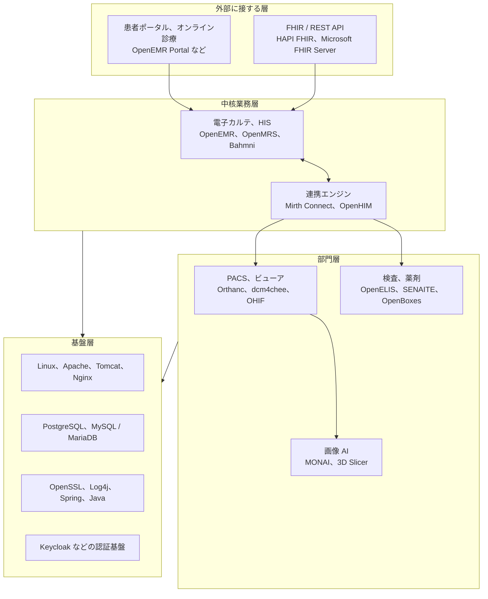

# 医療で使われる OSS の一覧

医療機関と製薬企業で動く OSS を、用途別に列挙する。
対象は二つある。

**医療のために作られた OSS**：電子カルテ、PACS、連携エンジン、臨床研究の基盤。
**医療専用ではないが医療情報システムの内部で動く OSS**：Web サーバ、データベース、ログライブラリ、認証基盤。

後者を一覧から落とすと、脆弱性が公表されたときに自組織への影響を判断できない。
Log4Shell のときに医療機関が直面したのは、この不足だった。

> [!NOTE]
> **表記ルール**：本ページでは、**事実**（一次情報で確認できる内容。出典を併記する）、**報道ベース**（報道や第三者の集計のみで確認でき、当事者の公表資料では裏付けが取れていない内容）、**分析**（筆者の解釈）を書き分ける。
> 製品ごとの CVE 件数は 2026 年 8 月 20 日時点の [NVD](https://nvd.nist.gov/vuln/search) のキーワード検索結果である。
> 実際に報告された脆弱性の内容は [報告された脆弱性の事例（CVE）](cve-cases.md) にまとめた。

## 同じ欠陥でも、置かれる場所で重さが変わる

OSS の危険度は、製品の品質だけでは決まらない。
その OSS が医療情報システムのどこに置かれ、どの範囲のデータに手が届くかで決まる。

| 層 | 陥落したときに届く範囲 | 例 |
|---|---|---|
| 外部に接する層 | 認証前の欠陥がそのまま外部から届く | 患者ポータルの IDOR、FHIR API の SSRF |
| 中核業務層 | 患者データベース全体 | 電子カルテの SQL インジェクション |
| 連携エンジン | 接続先の全部門システム | 未認証のリモートコード実行 |
| 部門層 | その部門の全データ。画像は容量が大きく持ち出しに時間がかかる | PACS の認証欠落 |
| 基盤層 | 上位のすべて。自組織が書いていないコードで起きる | Log4Shell、OpenSSL |

**分析**：調達と資産管理では中核業務層の製品名だけが台帳に載り、基盤層の構成要素が記録されないことが多い。
CVE が公表されたときに動けるかどうかは、この層を台帳に持っているかで決まる（[SCA と SBOM で既知脆弱性に対処する](sca-sbom.md)）。

---

## 1. 電子カルテ、病院情報システム

| 製品 | 実装 | 何をするか | 一次情報 |
|---|---|---|---|
| **OpenEMR** | PHP、MySQL | 診療所向けの電子カルテと診療管理。患者ポータル、請求、FHIR API を含む | [公式](https://www.open-emr.org/) / [GitHub](https://github.com/openemr/openemr) / [NVD](https://nvd.nist.gov/vuln/search/results?query=openemr) |
| **OpenMRS** | Java、Spring | モジュール型の EMR プラットフォーム。国際保健の現場で広く導入されている | [公式](https://openmrs.org/) / [GitHub](https://github.com/openmrs) / [NVD](https://nvd.nist.gov/vuln/search/results?query=openmrs) |
| **Bahmni** | OpenMRS、OpenELIS、Odoo | 電子カルテ、検査、会計、画像連携をまとめた病院情報システム | [公式](https://www.bahmni.org/) / [GitHub](https://github.com/Bahmni) |
| **GNU Health** | Python、Tryton | 病院情報システムと公衆衛生の管理 | [公式](https://www.gnuhealth.org/) / [NVD](https://nvd.nist.gov/vuln/search/results?query=gnu+health) |
| **LibreHealth EHR** | PHP | OpenEMR からのフォーク | [公式](https://librehealth.io/) / [GitHub](https://github.com/LibreHealthIO/lh-ehr) / [NVD](https://nvd.nist.gov/vuln/search/results?query=librehealth) |
| **OpenClinic GA** | Java | 病院情報システム。多数の CVE が公開されている | [SourceForge](https://sourceforge.net/projects/open-clinic/) / [NVD](https://nvd.nist.gov/vuln/search/results?query=openclinic) |
| **Open Hospital** | Java | 低資源環境の病院向け情報システム | [GitHub](https://github.com/informatici/openhospital) |
| **HospitalRun** | JavaScript、Node | 通信が不安定な環境を前提としたオフライン優先設計 | [公式](https://hospitalrun.io/) / [GitHub](https://github.com/HospitalRun) |
| **GNUmed** | Python | 電子カルテクライアント | [公式](https://www.gnumed.de/) |
| **日医標準レセプトソフト（ORCA）** | 日本 | 医事会計（レセプト）システム | [ORCA Project](https://www.orca.med.or.jp/orca/summary/) |

**事実**：日本医師会は 2002 年から日医標準レセプトソフトをオープンソースとして公開しており、「全国の医師、医療関係機関が誰でも無料で使え、改良できる公開ソフトウェア（オープンソース）方式でプログラムを配布します」と説明している。
医学用データベース部分には、日医オープンソース使用許諾契約による再配布の制限がある。
出典：[ORCA Project 日医標準レセプトソフトの概要](https://www.orca.med.or.jp/orca/summary/)

**分析**：国内の医療機関で「OSS を使っているか」を尋ねると、多くは「使っていない」と答える。
しかし ORCA を導入していれば OSS を運用しているし、電子カルテのベンダ製品も内部は Java か PHP と OSS ライブラリで構成されている。
自分が保守する OSS と、ベンダ製品に含まれる OSS は、対応の主体が違うだけで、脆弱性が届く経路は同じである。

---

## 2. 医用画像（PACS、ビューア、パーサ）

| 製品 | 実装 | 何をするか | 一次情報 |
|---|---|---|---|
| **Orthanc** | C++ | 軽量な PACS サーバ。REST API とプラグイン機構を持つ | [公式](https://www.orthanc-server.com/) / [NVD](https://nvd.nist.gov/vuln/search/results?query=orthanc) |
| **dcm4che / dcm4chee** | Java | DICOM ツールキットと、実運用規模のアーカイブ | [公式](https://www.dcm4che.org/) / [GitHub](https://github.com/dcm4che) |
| **DCMTK** | C++ | DICOM の参照実装に近いツールキット。商用製品の内部でも動く | [公式](https://dicom.offis.de/dcmtk) / [NVD](https://nvd.nist.gov/vuln/search/results?query=dcmtk) |
| **GDCM（Grassroots DICOM）** | C++ | DICOM の読み書きライブラリ。ITK、VTK 経由で研究用途にも広がる | [GitHub](https://github.com/malaterre/GDCM) |
| **pydicom** | Python | Python の DICOM 処理ライブラリ。研究と前処理の標準的な入口 | [GitHub](https://github.com/pydicom/pydicom) |
| **fo-dicom** | .NET | .NET の DICOM 実装 | [GitHub](https://github.com/fo-dicom/fo-dicom) |
| **OHIF Viewer** | JavaScript | ブラウザで動く医用画像ビューア | [公式](https://ohif.org/) / [GitHub](https://github.com/OHIF/Viewers) |
| **Cornerstone.js** | JavaScript | OHIF などが使う画像表示ライブラリ | [GitHub](https://github.com/cornerstonejs/cornerstone3D) |
| **Weasis** | Java | デスクトップの医用画像ビューア | [GitHub](https://github.com/nroduit/Weasis) |
| **Conquest DICOM** | C++ | 小規模施設と研究で使われる軽量 PACS | [公式](https://www.image-systems.biz/) |

**分析**：この分野は、ライブラリ層に脆弱性が集中する。
DICOM のパーサは、外部から届いたバイト列を C/C++ で解釈する処理であり、境界外読み書きが起きやすい。
DCMTK や GDCM は多くの製品に組み込まれるため、1 件の欠陥が複数のベンダ製品に同時に波及する。
どの製品が内部で何を使っているかは、SBOM がなければ利用者側から分からない。

---

## 3. 相互運用、連携基盤

| 製品 | 実装 | 何をするか | 一次情報 |
|---|---|---|---|
| **Mirth Connect / NextGen Connect** | Java | HL7 メッセージのルーティングと変換。院内連携の中心に置かれる | [GitHub](https://github.com/nextgenhealthcare/connect) / [NVD](https://nvd.nist.gov/vuln/search/results?query=mirth+connect) |
| **HAPI FHIR** | Java | FHIR サーバとクライアントの参照実装。多数の医療 API の土台 | [公式](https://hapifhir.io/) / [GitHub](https://github.com/hapifhir/hapi-fhir) |
| **HL7 FHIR Core（org.hl7.fhir.core）** | Java | FHIR のバリデータと変換処理。IG のビルドにも使われる | [GitHub](https://github.com/hapifhir/org.hl7.fhir.core) |
| **HAPI HL7 v2** | Java | HL7 v2 メッセージの解析と生成 | [GitHub](https://github.com/hapifhir/hapi-hl7v2) |
| **Microsoft FHIR Server** | .NET | FHIR サーバの実装 | [GitHub](https://github.com/microsoft/fhir-server) |
| **LinuxForHealth FHIR Server** | Java | FHIR サーバの実装（旧 IBM FHIR Server） | [GitHub](https://github.com/LinuxForHealth/FHIR) |
| **OpenHIM** | Node.js | 医療情報連携基盤のインターオペラビリティレイヤ | [公式](https://openhim.org/) |
| **OpenHIE** | 設計仕様 | 国レベルの医療情報交換アーキテクチャ | [公式](https://ohie.org/) |

**分析**：連携基盤は、業務上あらゆる部門システムに到達できる位置に置かれる。
そのうえ「内部システム同士の通信だから」という理由で認証が省略されやすい。
この二つが重なると、1 件の未認証の欠陥が院内全体への足がかりになる。
[Mirth Connect の CVE-2023-43208](cve-cases.md#mirth-connect) はその実例である。

---

## 4. 検査、薬剤、物流

| 製品 | 実装 | 何をするか | 一次情報 |
|---|---|---|---|
| **OpenELIS Global** | Java | 臨床検査情報システム（LIS） | [GitHub](https://github.com/DIGI-UW/OpenELIS-Global-2) |
| **SENAITE（旧 Bika LIMS）** | Python、Plone | 検査室情報管理システム（LIMS） | [公式](https://www.senaite.com/) / [GitHub](https://github.com/senaite/senaite.core) |
| **LabKey Server** | Java | 研究データと検体の管理 | [公式](https://www.labkey.com/) |
| **OpenBoxes** | Groovy、Grails | 医薬品と医療材料の在庫、供給管理 | [公式](https://openboxes.com/) / [GitHub](https://github.com/openboxes/openboxes) |
| **OpenLMIS** | Java | 公衆衛生分野の物流管理 | [公式](https://openlmis.org/) |

---

## 5. 公衆衛生、地域保健

| 製品 | 実装 | 何をするか | 一次情報 |
|---|---|---|---|
| **DHIS2** | Java | 保健情報の集計と分析。多くの国の保健省が採用している | [公式](https://dhis2.org/) / [GitHub](https://github.com/dhis2) / [NVD](https://nvd.nist.gov/vuln/search/results?query=dhis2) |
| **SORMAS** | Java | 感染症サーベイランスと接触者管理 | [GitHub](https://github.com/SORMAS-Foundation/SORMAS-Project) |
| **CommCare HQ** | Python | 地域保健員向けのモバイルデータ収集 | [GitHub](https://github.com/dimagi/commcare-hq) |
| **OpenSRP** | Java、Android | 地域保健の記録と追跡 | [公式](https://opensrp.io/) |

**分析**：この分野の製品は、国単位の保健データを 1 か所に集める設計になっている。
影響範囲が特定の医療機関ではなく国民規模になるため、同じ SQL インジェクションでも結果の重さが変わる。

---

## 6. 臨床研究、治験、データ二次利用

| 製品 | 実装 | 何をするか | 一次情報 |
|---|---|---|---|
| **REDCap** | PHP | 研究用の電子データ収集。大学と研究機関で広く使われる | [公式](https://projectredcap.org/) / [NVD](https://nvd.nist.gov/vuln/search/results?query=redcap) |
| **OpenClinica** | Java | 治験の電子データ収集（EDC） | [公式](https://www.openclinica.com/) / [NVD](https://nvd.nist.gov/vuln/search/results?query=openclinica) |
| **i2b2** | Java | 診療データの二次利用と患者コホート抽出 | [公式](https://i2b2.org/) |
| **OHDSI ATLAS / WebAPI** | Java、R | OMOP 共通データモデル上での観察研究 | [GitHub](https://github.com/OHDSI) |
| **XNAT** | Java | 研究用の画像データ管理 | [公式](https://www.xnat.org/) / [NVD](https://nvd.nist.gov/vuln/search/results?query=xnat) |

> [!NOTE]
> REDCap は、OSI 承認ライセンスで公開される OSS とは配布形態が異なり、コンソーシアムに参加する機関へソースが提供される形をとる。
> 利用条件は [公式](https://projectredcap.org/) で確認してほしい。
> 本ページでは「機関が自前で構築し、自前で更新義務を負うソフトウェア」として同じ扱いで並べている。

**分析**：研究系のシステムは、情報システム部門ではなく研究室が構築し、そのまま更新されずに残ることが多い。
扱うのは同意を得た研究データであり、患者の識別情報を含む場合がある。
台帳に載らない研究サーバが院内ネットワークに残っている状態は、[組織の脆弱性](../../threats/actors/organizational-vulnerabilities.md)として扱うのが実務的である。

---

## 7. 医療 AI と画像解析

| 製品 | 実装 | 何をするか | 一次情報 |
|---|---|---|---|
| **MONAI** | Python、PyTorch | 医用画像向けの深層学習フレームワーク | [GitHub](https://github.com/Project-MONAI/MONAI) |
| **MONAI Deploy** | Python | 学習済みモデルを臨床ワークフローに組み込む実行基盤 | [GitHub](https://github.com/Project-MONAI/monai-deploy) |
| **3D Slicer** | C++、Python | 医用画像の可視化と解析。研究用途で広く使われる | [公式](https://www.slicer.org/) |
| **ITK / VTK** | C++ | 画像処理と可視化のライブラリ。内部で GDCM を使う | [公式](https://itk.org/) |

**分析**：医療 AI の基盤は、モデルの重みやバンドルを外部から取得して読み込む設計になっている。
Python の `pickle` や PyTorch の `torch.load` は、読み込むだけでコードが動く形式であり、モデル配布経路がそのまま実行経路になる。
MONAI に報告された一連の脆弱性は、この構造から生じている（[MONAI](cve-cases.md#monai)）。
院内で医療 AI を扱うなら、モデルの入手経路と検証を、ソフトウェアの入手経路と同じ厳しさで管理する（[医療における AI のセキュリティ](../dx-ax/)）。

---

## 8. 医療特化ではないが、医療情報システムの内側で動く OSS

| 分類 | 代表例 |
|---|---|
| OS | Linux（RHEL、Ubuntu ほか） |
| Web サーバ、アプリケーションサーバ | Apache HTTP Server、Nginx、Apache Tomcat、WildFly |
| データベース | PostgreSQL、MySQL / MariaDB |
| 実行基盤、ライブラリ | Java（OpenJDK）、PHP、Spring Framework、Apache Log4j、OpenSSL |
| 認証基盤 | Keycloak |
| 運用 | Zabbix、Nagios、Samba、OpenVPN |
| コンテナ | Docker、Kubernetes |

**事実**：Apache Log4j の CVE-2021-44228（Log4Shell）は CVSS v3.1 基本値 10.0 で、2021 年 12 月 10 日に公表された。
CISA は同日にこれを Known Exploited Vulnerabilities カタログへ追加し、対応期限を 2021 年 12 月 24 日とした。
出典：[NVD CVE-2021-44228](https://nvd.nist.gov/vuln/detail/CVE-2021-44228)、[CISA KEV](https://www.cisa.gov/known-exploited-vulnerabilities-catalog)

**分析**：Log4Shell で医療機関が対応に時間を要した理由は、脆弱性の難しさではなく、「どの製品に Log4j が入っているか」を利用者側が知らなかったことにある。
電子カルテ、部門システム、医療機器の管理サーバのいずれもが Java を使いうるが、その内訳はベンダしか持っていなかった。
この非対称を埋める手段が SBOM である（[SCA と SBOM で既知脆弱性に対処する](sca-sbom.md)）。

---

## 報告件数の目安

**事実**：NVD のキーワード検索で得られる件数は次のとおりである（2026 年 8 月 20 日時点）。

| 製品 | 検索語 | 件数 |
|---|---|---|
| OpenEMR | `openemr` | 226 |
| OpenClinic / OpenClinic GA | `openclinic` | 48 |
| REDCap | `redcap` | 43 |
| OpenMRS | `openmrs` | 33 |
| DCMTK | `dcmtk` | 31 |
| LibreHealth EHR | `librehealth` | 20 |
| HAPI FHIR | `hapi fhir` | 16 |
| DHIS2 | `dhis2` | 13 |
| Orthanc | `orthanc` | 9 |
| OpenClinica | `openclinica` | 4 |
| XNAT | `xnat` | 1 |
| GNU Health | `gnu health` / `gnuhealth` | 0 |
| dcm4che | `dcm4che` | 0 |

> [!WARNING]
> **件数を危険度と読み替えない。**
> 件数が示すのは、その製品がどれだけ調べられ、どれだけ CVE が採番されたかである。
> OpenEMR の件数が多いのは、外部の研究者による監査が繰り返され、プロジェクトが CVE の採番に協力してきた結果でもある。
> 逆に 0 件は、脆弱性がないことの証明ではない。検索語が CPE と一致していない、報告経路が整備されていない、誰も見ていない、のいずれかである可能性が残る。

---

## 採用するときに見る点

**分析**：医療で OSS を選ぶときは、機能よりも先に、脆弱性が出たあとに何が起きるかを確認する。

| 観点 | 確認すること | 確認できないときの意味 |
|---|---|---|
| **報告の受け口** | `SECURITY.md`、報告先、開示方針 | 脆弱性を見つけても伝える先がない |
| **修正の実績** | 過去の CVE に対する修正リリースの間隔 | 報告しても直らない |
| **修正の完全性** | 過去に不完全な修正が繰り返されていないか | 更新しても攻撃経路が残る |
| **既定設定** | 初期状態で認証が有効か。管理画面が外に出ないか | 導入した時点で露出する |
| **認証の外部化** | OIDC、SAML に対応し、院内の認証基盤に寄せられるか | 個別のアカウント管理が残る |
| **監査ログ** | 参照イベントを患者単位で記録できるか | 内部不正を追跡できない |
| **依存の可視化** | SBOM を出力できるか。依存が更新されているか | 影響判断に毎回時間がかかる |
| **配布物の検証** | リリースやコンテナイメージに署名があるか | 入手経路を攻撃されたときに気づけない |
| **フォークの由来** | 元プロジェクトの欠陥を引き継いでいないか | 修正済みの脆弱性が生き残る |
| **保守の継続性** | 直近のコミット、リリース、開発者の数 | 更新が止まった時点で脆弱性が固定される |

### 導入前のチェックリスト

- [ ] 製品名とバージョンを資産台帳に登録した
- [ ] SBOM を取得した（自前構築なら生成した）
- [ ] 依存に既知の脆弱性がないか SCA で確認した
- [ ] 既定の管理者アカウントとパスワードを変更した
- [ ] インストーラ、セットアップ画面を導入後に無効化した
- [ ] 管理 UI と API の外部到達性を確認した
- [ ] 認証を院内の認証基盤に寄せた（または個別管理の運用を決めた）
- [ ] 参照を含む監査ログの取得と保存先を決めた
- [ ] 更新の担当と適用のタイミングを決めた
- [ ] 脆弱性情報の受信経路（NVD、JVN、プロジェクトのリリース通知）を登録した

---

## 関連ページ

- [報告された脆弱性の事例（CVE）](cve-cases.md)
- [SCA と SBOM で既知脆弱性に対処する](sca-sbom.md)
- [OSS 電子カルテ、HIS の脆弱性](ehr-systems.md)
- [医用画像 OSS（PACS/DICOM 実装）の脆弱性](imaging-pacs.md)
- [ツール](../../reference/resources/tools.md)

---

[← OSS 医療情報システムの脆弱性](README.md) | [トップへ](../../../README.md)
