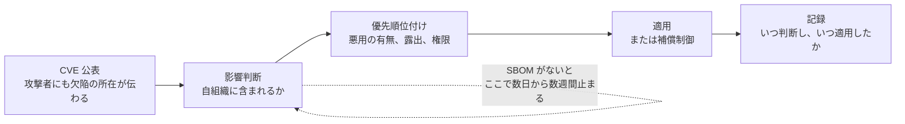
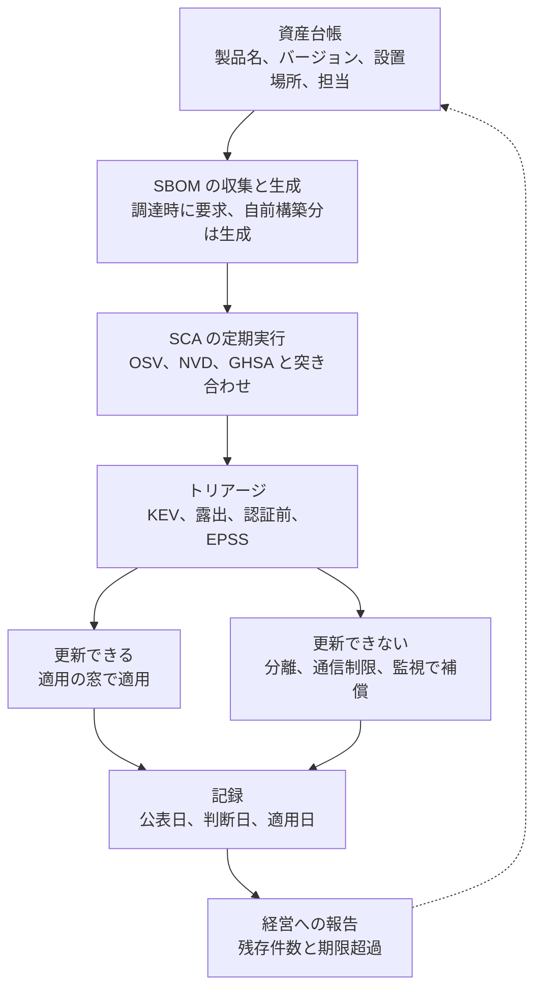

# SCA と SBOM で既知脆弱性に対処する

CVE が公表された脆弱性への対応は、技術的には「修正版に更新する」だけである。
それでも医療機関で対応が遅れるのは、更新の作業が難しいからではなく、**自組織が影響を受けるかどうかを判断できない**からである。

Log4Shell（CVE-2021-44228）のとき、多くの医療機関が最初に直面したのは「どの製品に Log4j が入っているか」という問いだった。
電子カルテ、部門システム、医療機器の管理サーバのいずれもが Java を使いうるが、その内訳を持っているのはベンダだけだった。

この非対称を埋める手段が二つある。
**SBOM**（ソフトウェア部品表）が「何が含まれているか」を可視化し、**SCA**（ソフトウェアコンポジション解析）が「それに既知の脆弱性があるか」を機械的に突き合わせる。

> [!NOTE]
> **表記ルール**：本ページでは、**事実**（一次情報で確認できる内容。出典を併記する）と、**分析**（筆者の解釈）を書き分ける。
> 用語の位置づけは [セキュリティの基礎](../../reference/security-basics.md)、規制側の要求は [ガイドラインと法規制](../../guidelines/) に対応する記述がある。

## 対応の速さを決めるのは、修正ではなく判断



**分析**：適用そのものに要する時間は、医療機関でも数時間から数日である。
実測すると滞留するのは B の影響判断であり、ベンダへの照会と回答待ちが大半を占める。
SBOM と SCA は、この滞留を機械的な突き合わせに置き換える取り組みである。

---

## SBOM

### 何を指すか

**SBOM**（Software Bill of Materials）は、ソフトウェアに含まれる部品（OSS ライブラリ、実行基盤、依存関係）とそのバージョンの一覧である。
製造業の部品表と同じ役割を、ソフトウェアで果たす。

**事実**：主要な記述形式は二つある。

**SPDX**：Linux Foundation のプロジェクト。ISO/IEC 5962:2021 として国際規格になっている。
出典：[SPDX](https://spdx.dev/)

**CycloneDX**：OWASP Foundation と Ecma International が共同で策定し、ECMA-424 として標準化されている。技術委員会は TC54 が担当する。
出典：[CycloneDX Specification Overview](https://cyclonedx.org/specification/overview/)

**事実**：米国では、2023 年から医療機器の市販前提出において SBOM の提出が法的に要求されている（FD&C Act 第 524B 条）。
出典：[FDA Medical Device Cybersecurity](https://www.fda.gov/medical-devices/digital-health-center-excellence/cybersecurity)（[海外のガイドライン、法規制](../../guidelines/global.md)）

### 誰が作り、誰が受け取るか

| 立場 | やること |
|---|---|
| **医療機器メーカー、システムベンダ** | ビルド工程で SBOM を生成し、リリースごとに更新して提供する。規制上の要求でもある |
| **医療機関** | 調達時に SBOM を要求して受け取り、資産台帳と結び付けて保管する |
| **自前で OSS を運用する組織** | 自分で生成する。OpenEMR や Orthanc を自院で構築しているなら、生成する主体は自組織になる |

**分析**：医療機関が SBOM を「もらう文書」と捉えると、受け取ったまま使われないファイルが増える。
SBOM は、資産台帳と脆弱性情報を結ぶ**索引**として使ったときに初めて効果が出る。
受け取り方を決めるより先に、突き合わせを誰がどの頻度で回すかを決める。

### 生成の例

```bash
# コンテナイメージから SBOM を生成する（CycloneDX 形式）
syft packages docker:openemr/openemr:latest -o cyclonedx-json > openemr-sbom.json

# ソースツリーから SBOM を生成する（SPDX 形式）
syft packages dir:. -o spdx-json > app-sbom.json

# 生成した SBOM に対して既知脆弱性を突き合わせる
grype sbom:openemr-sbom.json
```

---

## SCA

### 仕組みと限界

SCA は、依存関係を解決して部品の一覧を作り、脆弱性データベースと突き合わせる。
突き合わせ先は [OSV](https://osv.dev/)、[NVD](https://nvd.nist.gov/)、[GitHub Security Advisories](https://github.com/advisories) などである。

**分析**：SCA の結果をそのまま「対応が必要な脆弱性の一覧」と読むと、次の四つで判断を誤る。

| 限界 | 何が起きるか | 対処 |
|---|---|---|
| **到達可能性を見ない** | 呼び出していないコードの脆弱性まで一律に検出され、対応件数が膨らむ | VEX で影響なしを記録し、再検出のたびに再調査しない |
| **ベンダ製バイナリを開けない** | パッケージマネージャの外にある同梱ライブラリを検出できない | SBOM をベンダから受け取る。契約に含める |
| **改変されたコピーを見落とす** | ベンダが独自に修正したライブラリはバージョン表記と実体が一致しない | ベンダに修正状況（VEX）を求める |
| **バージョン範囲の記載に依存する** | 脆弱性 DB の影響範囲が不正確なとき、過検知と見落としの双方が起きる | KEV 掲載分と公開 PoC のあるものは、DB だけでなく一次情報を読む |

### VEX

**VEX**（Vulnerability Exploitability eXchange）は、「その脆弱性が実際に自製品へ影響するか」に関する製造者の見解である。
SBOM は含有の有無しか示さないため、影響の有無は別に伝える必要がある。

**分析**：医療機関にとって VEX の価値は、対応不要と判断した根拠が文書として残ることにある。
監査や届出の場面で「なぜ適用しなかったか」を説明する材料になる（[インシデント対応と事業継続](../../response/)）。

---

## 優先順位の付け方

**分析**：SCA を回すと、数百件の検出が出る。
すべてに同じ速度で対応することはできないため、次の順で絞る。

| 順 | 判断材料 | 意味 |
|---|---|---|
| 1 | **CISA KEV に掲載されているか** | 悪用が確認されている。医療でも [Mirth Connect の CVE-2023-43208](cve-cases.md#mirth-connect) が掲載された |
| 2 | **外部から到達できるか** | 患者ポータル、VPN、公開 API の背後にあるか |
| 3 | **認証前に成立するか** | 資格情報を必要としない欠陥は、露出がそのまま侵害の機会になる |
| 4 | **EPSS の値** | 今後 30 日間に悪用される確率の推定値 |
| 5 | **CVSS 基本値** | 影響の大きさ。単独では優先順位にならない |
| 6 | **診療への影響** | 停止できる時間帯があるか。代替手段があるか |

**事実**：EPSS（Exploit Prediction Scoring System）は FIRST が公開している、脆弱性が悪用される確率の推定モデルである。
出典：[FIRST EPSS](https://www.first.org/epss/)

**分析**：CVSS を優先順位の唯一の根拠にすると、9.8 の脆弱性が数十件並んだ時点で判断が止まる。
CVSS は影響の大きさを表す指標であって、自組織における緊急度ではない。
KEV と露出の有無を先に見ると、対応の順序が現実的な数に収まる。

---

## 医療に固有の制約

| 制約 | 内容 | 現実的な対処 |
|---|---|---|
| **機器を勝手に更新できない** | 医療機器のソフトウェアは、メーカーの承認なしに更新すると保守契約や薬事上の位置づけに影響しうる | メーカーの対応を待つ間、ネットワーク側で守る（[IoMT のリスク](../medical-devices/iomt.md)） |
| **バリデーション済みシステム** | 製薬の製造系や治験系では、変更のたびに検証記録が要る | 検査の自動化とリリース判断の手続きを分ける（[セキュリティの基礎](../../reference/security-basics.md)） |
| **停止できない** | 電子カルテと部門システムは診療時間中に止められない | 更新の窓を事前に決め、緊急適用の判断基準を先に合意しておく |
| **サポート切れの機器が残る** | 更新が提供されない資産が現に稼働している | セグメント分離、通信の制限、監視で補償する |
| **責任がベンダ側にある** | 利用者が中身を変更できない | 契約で通知と修正の期限を定める |

**分析**：ここで効くのは、パッチが当てられない資産に対する**補償制御**である。
分離、通信制限、監視、代替の運用手順の四つを、資産ごとにどれで守るかを決めておく。
「更新できないので対応不可」と記録するだけでは、リスクは保有されたまま残る。

---

## 国内の情報源

**事実**：日本では、IPA と JPCERT/CC が脆弱性情報の公表と調整を担う。

| 情報源 | 内容 |
|---|---|
| [JVN](https://jvn.jp/) | 開発者との調整を経て公表される脆弱性情報 |
| [JVN iPedia](https://jvndb.jvn.jp/) | 国内外の脆弱性情報を日本語で収録するデータベース |
| [MyJVN](https://jvndb.jvn.jp/apis/myjvn/) | JVN iPedia を機械的に取得する API |
| [IPA 脆弱性対策](https://www.ipa.go.jp/security/vuln/index.html) | 届出制度と対策情報 |
| [JPCERT/CC 脆弱性関連情報の取扱い](https://www.jpcert.or.jp/vh/) | 調整の枠組み |

**事実**：JVN iPedia には、OSS 医療情報システムの脆弱性も日本語で登録されている。
2026 年 8 月 20 日時点で、検索語 `OpenEMR` に 218 件、`DICOM` に 102 件が該当する。

```bash
# MyJVN API で製品名から脆弱性を検索する
curl -s "https://jvndb.jvn.jp/myjvn?method=getVulnOverviewList&feed=hnd\
&keyword=OpenEMR&rangeDatePublic=n&rangeDatePublished=n&rangeDateFirstPublished=n&maxCountItem=50"
```

**分析**：NVD だけを見ていると、国内の医療 IT ベンダや医療機器メーカーが JVN 経由で公表する情報を取り逃がす。
逆に JVN だけでは、海外 OSS の細かい CVE の反映に時間差がある。
両方を情報源として登録し、製品名で定期的に検索するのが実務的である。

**脆弱性を見つけた側になったとき**：自組織や第三者の製品に脆弱性を見つけた場合、日本では IPA が届出を受け付け、JPCERT/CC が開発者との調整を行う（情報セキュリティ早期警戒パートナーシップ）。
医療分野では、稼働中のシステムに影響する可能性があるため、公表までの調整が特に重要になる（[バグバウンティと脆弱性開示](../../practice/bug-bounty/)）。

---

## 運用に落とす



### 指標

**分析**：進捗を測るなら、検出件数ではなく次の四つを見る。
検出件数は、SCA の対象を広げるほど増えるため、改善の指標にならない。

| 指標 | 見るもの |
|---|---|
| 台帳の網羅率 | ネットワーク上の実機と台帳の差 |
| SBOM の取得率 | 調達済み製品のうち SBOM を受領した割合 |
| KEV 掲載分の残存件数 | 悪用が確認された脆弱性が、どれだけ残っているか |
| 公表から適用までの日数 | 判断の遅れが出る箇所を特定する |

経営層への報告では、この四つを継続して出す（[経営とガバナンス](../../governance/)）。

### 調達、契約に書く

- SBOM を、リリースごとに SPDX または CycloneDX 形式で提供すること
- 自社製品に影響する脆弱性が公表された場合の**通知の期限**
- 影響の有無に関する見解（VEX）を提供すること
- 修正版の提供期限と、サポート提供期間の終期
- 更新を提供できない場合の代替措置

契約の他の論点は [セキュリティの基礎](../../reference/security-basics.md) の第三者リスクの節にまとめている。

---

## よくある失敗

**分析**：導入した組織で繰り返し見る失敗を挙げる。

| 失敗 | なぜ起きるか | 立て直し方 |
|---|---|---|
| SBOM を受け取るだけで使わない | 突き合わせる相手（資産台帳）がない | 台帳の整備を先に行う |
| 検出件数の削減を目標にする | 数が減ることと、危険が減ることが一致しない | KEV 残存件数と適用日数に指標を変える |
| 開発環境だけで SCA を回す | 稼働中の資産が対象になっていない | 本番のイメージと構成に対して定期実行する |
| 医療機器を対象外にする | 更新できないため意味がないと考える | 更新可否と、リスクの把握は別の問題として扱う |
| ベンダの回答を待って止まる | 照会の期限が決まっていない | 契約に通知と回答の期限を書く |

---

## ツール

具体的なツールは [ツール](../../reference/resources/tools.md) の脆弱性管理、SBOM の節にまとめている。
生成には Syft や Trivy、突き合わせには Grype や OSV-Scanner、継続的な追跡には Dependency-Track が使われる。

---

## 関連ページ

- [医療で使われる OSS の一覧](oss-catalog.md)
- [報告された脆弱性の事例（CVE）](cve-cases.md)
- [組織の脆弱性の分類](../../threats/actors/organizational-vulnerabilities.md)
- [IoMT（医療 IoT 機器）のリスク](../medical-devices/iomt.md)
- [海外のガイドライン、法規制](../../guidelines/global.md)
- [ツール](../../reference/resources/tools.md)

---

<sub>[← OSS 医療情報システムの脆弱性](README.md) | [トップへ](../../../README.md)</sub>
