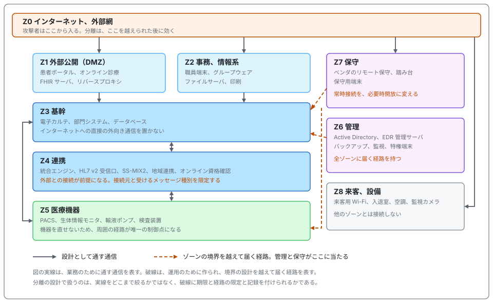
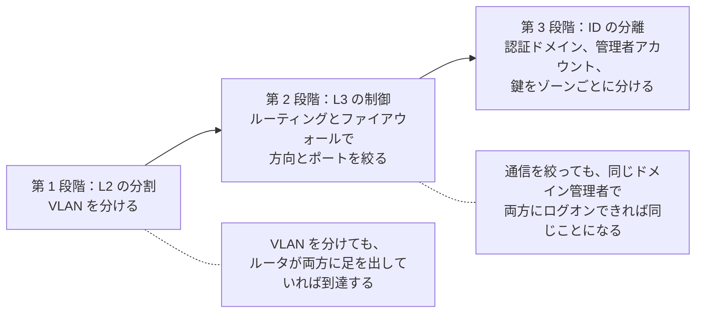
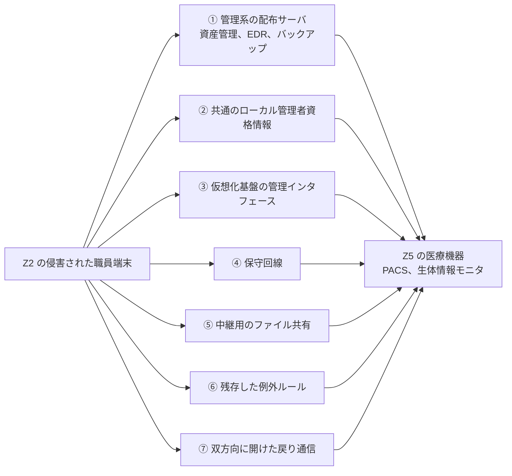

# 🧱 ネットワークの分離

「ネットワークを分離する」は、医療機関向けの対策として最も多く挙がる項目である。
一方で、どこで切るのか、何を通すのか、切れていることをどう確かめるのかは、実施の段になって決まっていないことが多い。
本ページは、その三つを扱う。

医療機関で分離が効くのは、**直せない資産の代わりに周囲を固める手立て**だからである。
薬事承認された構成の医療機器や、バリデーション済みの製造設備は、脆弱性が公表されても医療機関の側でパッチを当てられない（[医療機器のセキュリティ](medical-devices/)）。
資産そのものを変えられないとき、残る制御点は「誰がそこへ到達できるか」だけになる。

> [!NOTE]
> **表記ルール**：本ページでは、**事実**（一次情報で確認できる内容。出典を併記する）、**報道ベース**（報道のみで確認でき、当事者の公表資料では裏付けが取れていない内容）、**分析**（筆者の解釈）を書き分ける。

---

## 分離が担う範囲と、担わない範囲

分離は侵入を防がない。
侵入されたあとに、攻撃者が次の一歩を踏み出せる先を減らす。

| 攻撃の段 | 分離の効き方 |
|---|---|
| 初期侵入 | 効かない。境界機器の脆弱性、フィッシング、委託先経由の侵入は、分離の内側で起きる |
| 内部探索 | 効く。到達できる範囲が狭いほど、攻撃者が見つけられる資産が減る |
| 水平展開 | 最も効く。ゾーンをまたぐ通信を絞れば、1 台の侵害が全体に広がらない |
| バックアップの破壊 | 効く。バックアップ基盤への経路と認証を分ければ、同時に失われない |
| 暗号化と診療停止 | 部分的に効く。到達できたゾーンの中は止まる |

**分析**：分離の価値は、被害の有無ではなく被害の範囲で測る。
「分離していれば侵入されなかったか」を問うと効果は測れない。
「侵入されたとき、電子カルテとバックアップに何段で到達したか」を問うと測れる（[診断とペネトレーションテスト](../practice/pentest/)）。

**事実**：アイルランドの国家保健サービス Health Service Executive（HSE）は、2021 年の Conti による攻撃について外部機関による事後レビューを公表している。
レビューは、ネットワークが分割されていなかったことを、攻撃者が全国規模のシステムへ移動できた条件の一つとして扱っている（[Conti Cyber Attack on the HSE: Independent Post Incident Review](https://about.hse.ie/publications/conti-cyber-attack-on-the-hse-independent-post-incident-review/)、[事例](../threats/incidents/global/2021-timeline.md#GL-2021-01)）。

---

## 医療機関のゾーンモデル

分離の単位を**ゾーン**と呼ぶ。
ゾーンは、置かれている資産の性質と、止まったときの影響が揃う範囲で切る。
部署や建物では切らない。
同じ外来棟に、患者の端末と検査装置と職員端末が同居するためである。

  

| ゾーン | 置くもの | 入ってよい通信 | 入れてはいけない通信 | 医療での例外 |
|---|---|---|---|---|
| **Z1 外部公開** | 患者ポータル、オンライン診療、FHIR サーバ、リバースプロキシ | インターネットからの HTTPS | Z1 から Z3 への直接のデータベース接続 | なし |
| **Z2 事務、情報系** | 職員端末、グループウェア、ファイルサーバ | インターネット、メール、Z3 への業務アクセス | Z2 から Z5 への直接接続 | 医療機器の操作端末が事務系に置かれている構成が残りやすい |
| **Z3 基幹** | 電子カルテ、部門システム、データベース | Z2 と Z4 からの業務通信 | インターネットへの直接の外向き通信 | ベンダの更新配布のための外向き通信 |
| **Z4 連携** | 統合エンジン、HL7 v2 受信口、SS-MIX2、地域連携、オンライン資格確認 | 登録済みの接続元からの、種別を限定したメッセージ | 未登録の接続元からの MLLP 接続 | 地域連携と国の基盤は、外部との接続が前提になる |
| **Z5 医療機器** | PACS、生体情報モニタ、輸液ポンプ、検査装置 | Z3、Z4 からのオーダと結果の通信 | インターネットへの直接接続、Z2 からの直接接続 | 機器がメーカーの管理ポータルへ常時接続する構成 |
| **Z6 管理** | Active Directory、EDR 管理サーバ、バックアップ、監視、特権端末 | 特権端末からの管理通信 | 一般利用者の端末からの到達 | なし |
| **Z7 保守** | ベンダのリモート保守、踏み台、保守用端末 | 必要時に開放する、時限つきの接続 | 常時接続、接続先を限定しない経路 | 24 時間監視契約の機器では常時接続を求められる |
| **Z8 来客、設備** | 来客用 Wi-Fi、入退室、空調、監視カメラ | インターネットのみ | 他のすべてのゾーン | 入退室と空調の管理端末が事務系に置かれている構成 |

**分析**：この表で実際に議論になるのは右端の列である。
どのゾーンにも、業務上の理由がある例外が存在する。
例外を許すかどうかではなく、**例外に期限と経路の限定と記録を付けられるか**が分離の設計になる。

---

## 「分けた」と言えるのは、どの段階からか

分離の強さは三段階に分かれる。
医療機関で「分離済み」と説明される構成の多くは、第一段階で止まっている。

**分析**：ランサムウェアの水平展開は、到達性と資格情報の両方を使う。
第 2 段階までしか到達していない構成では、ドメイン管理者を奪われた時点で、ゾーンの境界が意味を失う。
[ランサムウェアグループ別の TTPs](../threats/actors/ransomware-groups.md) に挙げた T1003（認証情報のダンプ）と T1021（水平展開）が、この順で効く。

第 3 段階に届いているかは、次の問いで判別できる。

- Z6 の Active Directory が停止したとき、Z5 の医療機器は動き続けるか
- Z3 の管理者アカウントで、Z6 のバックアップ基盤にログオンできるか
- Z7 の保守用アカウントは、保守対象以外のゾーンに存在しないか

---

## 分離が破れる典型的な構造

侵入後の検証で繰り返し見つかる形を挙げる。
いずれも、ゾーンの図の上では分かれているのに、実際には到達できる状態を作る。

| 形 | なぜ成立するか | 断ち方 |
|---|---|---|
| ① 管理系が全ゾーンを貫く | 資産管理、EDR、バックアップの各エージェントは、定義上すべての端末に届く必要がある。配布サーバを取れば、その経路をそのまま使える | 配布サーバを Z6 に置き、管理者アカウントをゾーンごとに分ける。配布の実行を承認と記録の対象にする |
| ② 共通のローカル管理者資格情報 | 導入時にベンダが同じパスワードを設定し、以後変更されない | 端末ごとに個別化する仕組みを入れる。医療機器に付属する PC も対象に含める |
| ③ 仮想化基盤の集約 | ゲスト側の VLAN は分かれていても、ホストと管理インタフェースは共通である | 管理インタフェースを Z6 に隔離し、多要素認証を適用する。ゾーンをまたぐゲストを同一ホストに同居させない |
| ④ 保守回線がゾーンを迂回する | ベンダが機器と一緒に引いた回線が、院内の境界設計を通らない | 保守接続を Z7 の踏み台に集約し、そこからの経路だけを許可する |
| ⑤ 中継用のファイル共有 | 画像、帳票、検査結果をゾーン間で渡すために共有フォルダが置かれる | 共有をゾーンの境界に置き、読み書きの方向を片側に固定する。共有先の資格情報を業務ドメインから分ける |
| ⑥ 期限切れの例外ルールの残存 | 更改やトラブル対応で一時的に開けた許可が、そのまま残る | 例外に期限を持たせ、期限で自動的に失効させる。棚卸しの周期を決める |
| ⑦ 双方向にした戻り通信 | 「戻りが通らない」との申告に対し、送受信の両方向を許可してしまう | 状態を保持する検査で戻りを通す。逆方向の新規接続は許可しない |

> [!IMPORTANT]
> ①から③は、いずれも運用のために必要があって作られた経路である。
> 塞ぐのではなく、通る先と、通せる主体と、通ったことの記録を絞る形にする。

---

## 到達性を確認する

分離は、設定した時点ではなく、確認した時点で初めて分離になる。
確認は、設定の突き合わせと、実際の到達の測定の二段で行う。

### 到達性マトリクスを作る

ゾーンの組み合わせごとに、期待する状態を先に書き、確認したときに実測を書き込む。
下は記入用の型であり、実測の列は確認の結果で埋める。

| 起点 → 宛先 | 期待 | 実測 | 実測が期待と違ったとき |
|---|---|---|---|
| Z2 → Z3 | 業務ポートのみ | 記入 | 想定外のポートが開いていれば、用途を確認して閉じる |
| Z2 → Z5 | 遮断 | 記入 | 経路と、使っている業務を特定する |
| Z2 → Z6 | 遮断 | 記入 | 最優先で塞ぐ。管理系への一般端末からの到達は例外を認めない |
| Z5 → Z0 | 遮断 | 記入 | 機器の外向き通信の宛先を確認し、必要な宛先だけに絞る |
| Z7 → Z3、Z5 | 対象機器のみ、時限つき | 記入 | 常時開放なら、必要時開放に切り替える |
| Z8 → その他 | 遮断 | 記入 | 設備系の管理端末の置き場所を見直す |
| Z1 → Z3 | アプリケーション層を経由する経路のみ | 記入 | データベースに直接届く場合、経路を分ける |

**分析**：この表で最も扱いを誤りやすいのは、「遮断のはずが、業務で日常的に使われていた」という差分である。
塞ぐと診療が止まるため、その場では塞げない。
[診断とペネトレーションテスト](../practice/pentest/) で述べたとおり、この種の経路は、使われている事実を先に確定させ、代替の経路を用意してから切り替える。
確認せずに塞いだ結果、検査結果が届かなくなる事故は、攻撃による停止と区別がつかない。

### 確認のしかたを、ゾーンごとに変える

| 対象 | 確認の手立て | 避けること |
|---|---|---|
| Z1 から Z4 | 各ゾーンに検証端末を置き、許可されていないはずの宛先への接続を試す | 業務の繁忙帯での実施 |
| Z5 医療機器 | 設定の机上突き合わせと、受動的な通信観察を主体にする。能動的な確認は隔離環境の同型機で先に影響を見る | 稼働機器が同居するセグメントでのスキャン（[医療機器の検証手法](medical-devices/testing-methodology.md)） |
| Z6 管理 | 特権端末以外からの到達可否を、実際にログオンを試みる形で確認する | アカウントロックを招く試行 |
| Z7 保守 | 接続の開放記録と、実際の接続ログを突き合わせる | ベンダへの事前連絡なしの遮断試験 |
| Z8 設備 | 来客用 Wi-Fi から他ゾーンへの到達を試す | 該当なし |

**分析**：確認の結果は、設定のスクリーンショットではなく到達性の実測として残す。
設定は正しくても、経路の途中に別のルータや、二つの足を持つサーバが挟まると到達は残る。
残す記録は、起点、宛先、ポート、時刻、結果の五つで足りる。

---

## 例外の台帳

分離を運用に載せるとき、実際に管理するのは許可ルールではなく例外である。

| 記録する項目 | 理由 |
|---|---|
| 申請者と所管部署 | 期限切れのときに問い合わせる先を決める |
| 目的 | 更改後に同じ経路が要るかを判断する材料になる |
| 経路（起点、宛先、ポート、方向） | 棚卸しのときに、実ルールと突き合わせる |
| 期限 | 期限のない例外は、恒久のルールと区別できなくなる |
| 承認者 | 診療への影響を判断できる立場の人が承認したかを残す |
| 代替手段の検討結果 | 次の更改で消せるかどうかを判断する |

> [!TIP]
> 例外の棚卸しは、システム更改とベンダ契約の更新に合わせると回りやすい。
> 独立した棚卸しの会議体を作ると、優先度が下がって開かれなくなる。

---

## 医療機器ゾーンに固有の設計

Z5 は、他のゾーンと前提が違う。
機器を変更できず、エージェントも入れられず、止められない。

| 手立て | 内容 | 医療での制約 |
|---|---|---|
| 機器単位の分割 | 同じ Z5 の中で、機器の種類ごとにさらに分ける。1 台の侵害が同種の機器全体に及ばないようにする | 機器間の相互通信を前提とする構成（セントラルモニタと病棟モニタ）がある |
| 接続の認可 | ネットワークへの接続時に、機器を識別して割り当てるゾーンを決める | 認証に対応しない機器が多く、MAC アドレスによる識別に頼ることになる |
| 外向き通信の限定 | 宛先を、メーカーの保守サーバと時刻同期に限る | 宛先が変わる、宛先が名前解決に依存するといった構成がある |
| 保守接続の時限化 | 常時接続を、申請にもとづく必要時開放に変える | 24 時間監視を契約に含む機器では、事業者と条件を再交渉する必要がある |
| 通信の記録 | 機器のログが取れないため、ネットワーク側で通信を記録する | 記録を見る担当を決めないと、蓄積されるだけになる |

**分析**：機器単位の分割は、効果が大きい一方で、機器間の相互通信の実態を把握していないと診療を止める。
[IoMT のリスク](medical-devices/iomt.md) に述べたとおり、機器へ到達する経路の多くは管理サーバを経由する。
分割の前に、どの管理サーバがどの機器に正規の権限を持つかを確定させると、切る位置を誤りにくい。

---

## 分離そのものが診療を止めないために

分離の設計は、可用性を下げる方向にも働く。
ゾーンの境界に置いた機器が、単一障害点になるためである。

- 境界のファイアウォールとスイッチを冗長化する。冗長化していない構成では、境界の障害がゾーンの全停止になる
- 障害時の挙動を決める。通信を止める側に倒すか、通す側に倒すかを、ゾーンごとに事前に決めておく
- ルールの変更を、診療時間外に行う。変更後の到達性を、変更前に用意した確認手順で測る
- 遮断の判断に使えるように、ゾーン単位で切れる構成にしておく。侵害時にどこで切れば診療を残せるかは、[インシデント対応と事業継続](../response/) の初動の判断に直結する

**分析**：インシデント時の遮断は、平時の分離の設計をそのまま使う。
ゾーンが切ってあり、ゾーン単位で遮断できる状態なら、「全部止める」以外の選択肢が生まれる。
切れない構成では、初動の遮断が診療の全停止と同義になり、判断が遅れる。

---

## 規制と参照設計

| 文書 | 分離に関する位置づけ |
|---|---|
| [医療情報システムの安全管理に関するガイドライン 第 7.0 版](https://www.mhlw.go.jp/stf/shingi/0000516275_00006.html) | 医療情報システムのネットワーク構成と、外部と接続する際の管理を求める（[国内のガイドライン、法規制](../guidelines/japan.md)） |
| [医療機関におけるサイバーセキュリティ対策チェックリスト](../guidelines/japan.md) | 立入検査で使用される自己点検。ネットワークの構成把握と外部接続の管理が項目に含まれる |
| [HPH Cybersecurity Performance Goals](https://hhscyber.hhs.gov/cybersecurity-performance-goals.html) | Enhanced Goals に Network Segmentation が置かれている。任意の目標群であり、義務ではない |
| [HHS 405(d) HICP](https://405d.hhs.gov/) | 規模別の実践事項として、ネットワーク管理と医療機器の扱いを示す |
| [NIST SP 1800-24](https://csrc.nist.gov/pubs/sp/1800/24/final) | PACS を対象にした参照アーキテクチャ。医用画像の経路をどう区切るかの実装例が示されている |
| [NIST SP 1800-8](https://csrc.nist.gov/pubs/sp/1800/8/final) | 無線輸液ポンプを対象にした参照アーキテクチャ |
| [NIST SP 1800-30](https://csrc.nist.gov/pubs/sp/1800/30/final) | 遠隔患者モニタリングを対象にした参照アーキテクチャ |
| [IEC 80001 シリーズ](https://webstore.iec.ch/) | 医療機器を含む IT ネットワークのリスクマネジメント。責任の割り当てを扱う |
| [NIST SP 800-82 Rev.3](https://csrc.nist.gov/pubs/sp/800/82/r3/final) | 制御系のセキュリティ。製薬の製造 OT では、Purdue モデルにもとづく層構造がこちらに対応する（[製造設備と OT](../reference/pharma/manufacturing-ot.md)） |
| [NIST SP 800-207](https://csrc.nist.gov/pubs/sp/800/207/final) | ゼロトラストアーキテクチャ。ゾーンによる分離と、ID を制御点に置く設計の関係は[セキュリティの基礎](../reference/security-basics.md#8-ゼロトラスト)に整理している |

**分析**：国内のガイドラインは、ネットワークの構成把握と外部接続の管理までを求めており、ゾーンの切り方までは示していない。
参照アーキテクチャとして具体的な実装を示しているのは NIST SP 1800 シリーズであり、PACS、輸液ポンプ、遠隔モニタリングという医療機関に固有の対象を扱っている点で、そのまま設計の下敷きに使える。

---

## 実務チェックリスト

**現状の把握**
- [ ] 現行のネットワーク構成図が、実機の設定と一致していることを確認した
- [ ] ゾーンの定義と、各ゾーンに属する資産の一覧を作成した
- [ ] 台帳にない機器と回線（保守回線、ベンダが引いた線）を洗い出した

**設計**
- [ ] ゾーン間で許可する通信を、起点、宛先、ポート、方向で定義した
- [ ] Z6 管理ゾーンへの到達を、特権端末に限定した
- [ ] バックアップ基盤の認証を、業務ドメインから分離した
- [ ] 仮想化基盤の管理インタフェースを分離し、多要素認証を適用した
- [ ] 医療機器ゾーンからインターネットへの直接接続を遮断した
- [ ] 保守接続を踏み台に集約し、必要時開放に切り替えた

**確認**
- [ ] 到達性マトリクスを作成し、期待と実測を突き合わせた
- [ ] 「遮断のはずが業務で使われていた」経路を特定し、代替手段を決めた
- [ ] 医療機器ゾーンの確認を、受動観察と設定レビューで行った
- [ ] 確認の記録を、起点、宛先、ポート、時刻、結果の形で残した

**運用**
- [ ] 例外の台帳を作り、期限と承認者を記録した
- [ ] 棚卸しの周期と契機（更改、契約更新）を決めた
- [ ] ゾーン単位で遮断できることを、インシデント対応の手順に反映した
- [ ] 境界機器の冗長化と、障害時の挙動を決めた

---

## 関連ページ

- [防御プレイブック](../threats/actors/defense-playbook.md)：分離を含む対策の着手順序
- [IoMT（医療 IoT 機器）のリスク](medical-devices/iomt.md)：機器へ到達する経路と、検知の観測点
- [医療機器の検証手法](medical-devices/testing-methodology.md)：機器ゾーンでの確認のしかた
- [HL7 v2 と FHIR の攻撃面](web-security/hl7-fhir.md)：Z4 連携ゾーンで守る対象
- [クラウド事業者と医療](cloud/)：院内網とクラウドをつなぐ経路
- [診断とペネトレーションテスト](../practice/pentest/)：分離の実効性を測る検証
- [インシデント対応と事業継続](../response/)：遮断の判断と、診療の継続
- [セキュリティの基礎](../reference/security-basics.md#6-多層防御)：多層防御と最小権限の位置づけ

---

[← 技術領域](README.md) | [トップへ](../../README.md)
