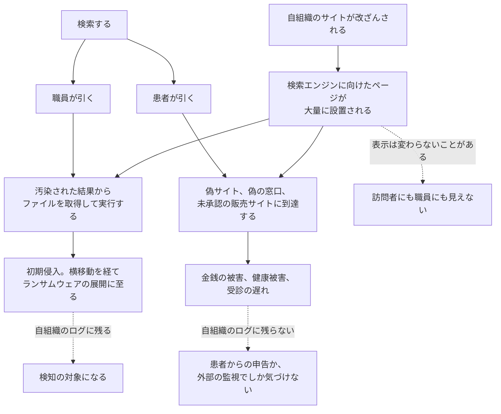
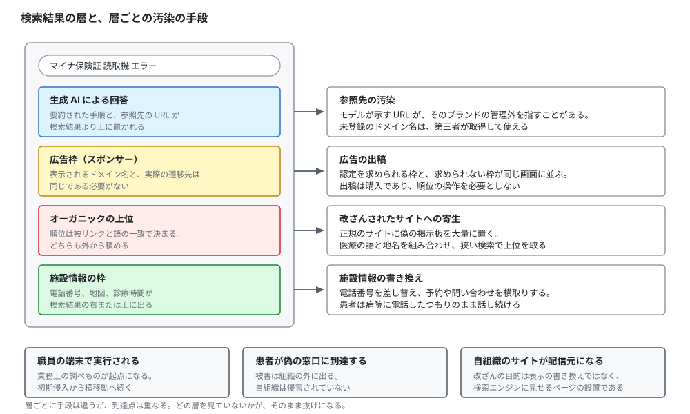
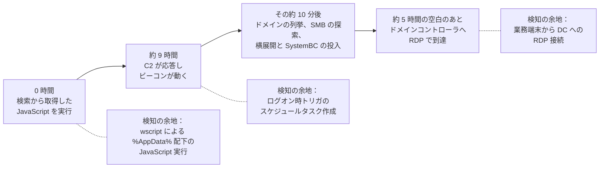

# 🔍 検索経路の汚染（SEO ポイズニング）

医療機関の業務は検索に依存している。
マイナ保険証の読取機が出したエラーコード、見慣れない薬剤の相互作用、行政に出す様式のひな形、部門システムの設定手順。
どれも、その場で調べて片づける対象である。
患者の側も、診療科名や症状、病院名で検索して受診先と連絡先を決める。

検索結果の並びは、どちらの側も検証しない。
**SEO ポイズニング**は、この並びを攻撃者が操作し、汚染された結果を上位に置く手口である。
利用者は自分から近づいており、届いたメールを疑うときのような警戒が働かない。

本ページは三つの型を分けて扱う。
職員の検索が初期侵入になる型、患者の検索が組織の外で被害を生む型、自組織のサイトが他者を汚染する踏み台になる型である。

> [!NOTE]
> **表記ルール**：本ページでは、**事実**（一次情報で確認できる内容。出典を併記する）、**報道ベース**（報道や第三者の集計のみで確認でき、当事者の公表資料では裏付けが取れていない内容）、**分析**（筆者の解釈）を書き分ける。

---

## 検索が業務動線になっている場所

| 場面 | 検索する主体 | 引かれる語 | 汚染されたときの帰結 |
|---|---|---|---|
| 機器やシステムの異常 | 医事課、情報システム部門、現場の職員 | エラーコード、機器の型名、画面に出た文言 | 偽の警告や偽のサポート窓口に到達する |
| 様式とひな形の入手 | 事務部門、治験や研究の担当者 | 契約書、同意書、届出の様式名 | 圧縮ファイルを開いてマルウェアを実行する |
| 業務ソフトの入手 | 各部門 | ソフト名、ダウンロード、無償版 | 正規の実行体に悪性の部品が同梱された配布物を取得する |
| 診療上の調べもの | 医師、薬剤師、看護師 | 薬剤名、相互作用、ガイドライン名 | 誤った情報源に到達する。持ち出しの動線になる |
| 受診先と連絡先の確認 | 患者、家族 | 病院名、診療科、予約、電話番号 | 偽サイトや偽の電話番号に到達する |
| 医薬品の入手 | 患者 | 薬剤名、通販、個人輸入 | 未承認品や偽造品を購入する |

**分析**：上四行と下二行で、被害の出る場所が違う。
上は自組織の内部に出る。
下は自組織が一切侵害されていなくても、患者と家族に出る。
後者は、自組織のログには何も残らない。

---

## 汚染の三つの型



**分析**：三つ目の型は、被害者であると同時に加害の経路になる。
改ざんの目的が表示の書き換えではなく検索順位の獲得である場合、トップページは正常に見える。
検索エンジンにだけ別の内容を返す設定（クローキング）が使われると、職員がサイトを見て回っても異常は見つからない。

---

## 検索結果の四つの層と、汚染の手段

検索結果の画面は一枚ではない。
生成 AI の回答、広告枠、オーガニックの順位、施設情報の枠が、上から順に積まれている。
それぞれ別の仕組みで並んでおり、汚染の手段も別である。

<p align="center">
  
</p>

| 層 | 汚染の手段 | 検知の担い手 |
|---|---|---|
| 生成 AI の回答 | 参照先の URL が実在しない、または第三者の管理下にある | 利用者。組織側から見えない |
| 広告枠 | 広告の出稿。表示されるドメイン名と遷移先を分けられる | 広告事業者の審査。組織側はブランド監視 |
| オーガニックの上位 | 改ざんしたサイトへのページ設置、被リンクの積み上げ、語の詰め込み | 検索エンジンの品質判定。組織側は Search Console |
| 施設情報の枠 | 電話番号や営業時間の書き換え申請 | 施設情報の管理者。組織側は登録の主張と監視 |

**分析**：この四つのうち、自組織が直接に手を打てるのは施設情報の枠と、自組織サイトの健全性だけである。
残りの二つは、検索事業者と利用者のあいだで起きる。
組織側の対策は、汚染を止めることではなく、汚染された結果に職員と患者が到達したときの帰結を小さくする方向に置くほかない。

---

## 段階ごとに、どの技法が当たるか

**事実**：MITRE ATT&CK は、検索順位の操作を能力の設置（Resource Development）の段階に位置づけ、[T1608.006 SEO Poisoning](https://attack.mitre.org/techniques/T1608/006/) として記述している。
語の詰め込み（隠しテキストを含む）、被リンクの購入と設置、回避的なリダイレクトとクローキングの併用が挙げられている。
広告の購入は [T1583.008 Malvertising](https://attack.mitre.org/techniques/T1583/008/) として別に置かれている。
出典：[MITRE ATT&CK](https://attack.mitre.org/)

| 段階 | 技法 | 医療機関での現れ方 | 組織側で手が届くか |
|---|---|---|---|
| 順位の獲得 | [T1608.006](https://attack.mitre.org/techniques/T1608/006/) SEO Poisoning | 診療科名、地名、様式名、機器の型名で上位を取られる | 届かない。第三者のサイト上で起きる |
| 広告枠の購入 | [T1583.008](https://attack.mitre.org/techniques/T1583/008/) Malvertising | 自院名を含む語で偽の窓口が出稿される | 届かない。通報のみ |
| 到達 | [T1189](https://attack.mitre.org/techniques/T1189/) Drive-by Compromise | 職員が検索結果から偽の掲示板や偽の更新画面に到達する | プロキシと DNS で一部届く |
| 実行 | [T1204.002](https://attack.mitre.org/techniques/T1204/002/) User Execution、[T1059.007](https://attack.mitre.org/techniques/T1059/007/) JavaScript | 圧縮ファイル内のスクリプトを二重クリックする | 届く。ここが最初の防御線 |
| 検査の回避 | [T1553.005](https://attack.mitre.org/techniques/T1553/005/) Mark-of-the-Web Bypass | 展開したファイルにゾーン情報が伝わらず、警告が出ない | 届く。展開ソフトの選定と設定 |
| 常駐 | [T1053.005](https://attack.mitre.org/techniques/T1053/005/) Scheduled Task | 業務語らしい名前のタスクが登録される | 届く |

**分析**：上の二段は組織の管理範囲の外にある。
MITRE も、この技法に対する予防的な緩和策は置けないとして、後続の段階での検知に重心を移すよう記述している。
医療機関が投資を判断するときも、順位の監視より、実行の段階を壊す手当のほうが効く。
順位の監視は、被害の規模を測る目的では意味があるが、防御としては数えない。

---

## 職員の検索が入口になる

### 豪州の医療機関を狙った GootLoader（2023 年）

**事実**：Trend Micro は 2023 年 1 月 9 日、Gootkit loader（Gootloader）が豪州の医療業界の組織を狙った一連の攻撃を分析した結果を公表した。
初期侵入は SEO ポイズニングである。
汚染の対象となった語は「hospital」「health」「medical」「enterprise agreement」と、豪州の都市名の組み合わせであった。
特定の医療事業者の名称も対象に含まれていた。
利用者は、改ざんされた WordPress サイト上に置かれた偽の掲示板ページに到達し、そこから圧縮ファイルをダウンロードする。
中身は JavaScript ファイルであり、実行すると感染が始まる。
後段では、正規の VLC Media Player の実行体を改名したものと悪性の DLL を組み合わせ、Cobalt Strike を動作させていた。
同社は 2022 年 12 月初旬に豪州サイバーセキュリティセンター（ACSC）へ調査結果を共有している。
出典：[Gootkit Loader Actively Targets Australian Healthcare Industry](https://www.trendmicro.com/en_us/research/23/a/gootkit-loader-actively-targets-the-australian-healthcare-indust.html)（Trend Micro、2023 年 1 月 9 日）

**分析**：狙われた語のうち「enterprise agreement」は、豪州の医療機関で使われる労使協定の呼称である。
業界の外では引かれない語であり、引く人はほぼ全員が当該業界の職員になる。
検索の量が少ない語ほど、上位を取るために必要な工作は少なくて済む。
広く知られた語で戦うより、狭い業務語を押さえるほうが、攻撃側の費用対効果は高い。

### 配信基盤が絞り込む条件と、事後の再現

**事実**：Sophos X-Ops は 2025 年 1 月 16 日、Gootloader の配信基盤の内部を分析した結果を公表した。
改ざんされた WordPress サイトに埋め込まれた PHP は、訪問者の IP アドレス、User-Agent、Referer、サーバ固有の識別子を集約し、攻撃者が運用する統制サーバへ送って可否の判定を受ける。
Referer には、利用者が入力した検索語が含まれる。
統制サーバは、その検索語に合わせた偽の掲示板の内容と、検索語に一致するファイル名の第一段を生成して返す。
配信の対象は、攻撃者が関心を持つ国からの要求に限定されている。
一度配信を受けた訪問者については、その要求元が属する `/24` の範囲全体が 24 時間のブロックリストに載る。
出典：[Gootloader inside out](https://www.sophos.com/en-us/blog/gootloader-inside-out/)（Sophos X-Ops、Gabor Szappanos、2025 年 1 月 16 日）

> [!IMPORTANT]
> **調査への含意**：この設計は、事後の再現を成立させない。
> 職員から申告を受けて同じ URL を開いても、偽の掲示板は出ない。
> ブロックが `/24` 単位で掛かるため、同じ拠点の別の端末から確認しても出ない。
> 24 時間後に別の回線から試しても、地理の条件と検索語の条件が揃わなければ出ない。

**分析**：したがって、証拠は「サイトを見に行って確かめる」側ではなく、利用者の端末とネットワークの記録の側にしか残らない。
初動で保全する対象を、あらかじめ決めておく必要がある。

| 保全する対象 | そこにしかない情報 |
|---|---|
| ブラウザの履歴とダウンロードの記録 | 到達した URL、検索エンジンからの遷移、取得したファイル名と時刻 |
| ダウンロードしたファイルの代替データストリーム（`Zone.Identifier`） | 取得元の URL と参照元 |
| プロキシまたは Web フィルタのログ | Referer に含まれる検索語、User-Agent、応答の種別と大きさ |
| DNS のクエリログ | 誘導先のドメイン名。ブラウザの履歴が消えても残る |
| 端末の実行の記録（EDR、Sysmon、スケジュールタスク） | 実行したスクリプトの名前と、その後の挙動 |

**分析**：この五つのうち、医療機関で最初に落ちるのはプロキシのログである。
Referer を記録しない設定、または短い保存期間が既定になっている製品がある。
検索語が残らないと、どの業務語が汚染されていたのかを後から数えられない。
保存の期間と項目は、侵害を前提に決める（[ログと監視の設計](logging.md)）。

### 侵入後に使われる時間

**事実**：The DFIR Report は 2024 年 2 月 26 日、Gootloader による侵入の全体を公開した。
利用者が雇用契約の様式を検索し、汚染された結果から偽の掲示板に到達して圧縮ファイルを取得したところが起点である。
圧縮ファイル内の JavaScript を実行したあと、約 9 時間後に C2 が応答し、Cobalt Strike のビーコンがレジストリへ書き込まれてメモリ上で実行された。
その約 10 分後に横展開が始まり、SystemBC が投入されている。
そこから約 5 時間、目立った活動のない時間が続き、再開後に SystemBC の SOCKS プロキシを経由した RDP でドメインコントローラへ到達している。
出典：[SEO Poisoning to Domain Control: The Gootloader Saga Continues](https://thedfirreport.com/2024/02/26/seo-poisoning-to-domain-control-the-gootloader-saga-continues/)（The DFIR Report、2024 年 2 月 26 日）



**分析**：最初の 9 時間は、C2 が応答するまでの待ち時間である。
攻撃者が操作を始める前に、端末側には実行の痕跡が残っている。
この 9 時間を使えるかどうかが、被害の範囲を決める。
報告に記された時間を起点から積むと、ドメインコントローラへの到達は 14 時間ほどの位置にあたる。
逆に言えば、C2 の応答が始まってからそこまでは 5 時間しかない。
検知の設計は、後段ではなく初回実行の観測点に重心を置く必要がある（[検知の設計を技法単位に落とす](detection-engineering.md)）。

### 2025 年の再開と、解析側を外す作り

**事実**：Huntress は 2025 年 11 月 5 日、Gootloader の活動再開を報告した。
2025 年 10 月 27 日以降に 3 件の感染を観測し、うち 2 件では手動操作を伴う侵入に発展して、初期感染から 17 時間以内にドメインコントローラが侵害された。
この一連の攻撃では、WOFF2 形式のフォントのグリフを差し替える手法が使われている。
ページの原文には無意味な文字列が書かれているが、閲覧者のブラウザで描画されると、業務書類らしいファイル名として読める。
文字列をコピーしたり、ソースを確認したりしても、表示された名前は取り出せない。
同社は、初期侵入を担う Storm-0494 と、後段でランサムウェアを展開する Vanilla Tempest の関係として整理している。
出典：[Gootloader Returns with Novel WOFF2 Font Obfuscation](https://www.huntress.com/blog/gootloader-threat-detection-woff2-obfuscation)（Huntress、Anna Pham、2025 年 11 月 5 日）

**報道ベース**：同じ一連の攻撃で配布された圧縮ファイルは、展開に使うソフトによって取り出される中身が変わる形で作られていた。
エクスプローラで展開すると悪性のスクリプトが出るが、解析側で使われる展開ソフトでは無害なテキストが出る。
出典：[Gootloader malware is back with new tricks after 7-month break](https://www.bleepingcomputer.com/news/security/gootloader-malware-is-back-with-new-tricks-after-7-month-break/)（BleepingComputer）

**分析**：この二つは、いずれも利用者ではなく検査側を外す作りである。
ページの本文を機械的に取得して危険な語を探す仕組みは、描画後の文字列を見ていない。
圧縮ファイルを解析用の環境で開いて中身を確かめる手順は、利用者の端末で起きたことと違う結果を返す。
検体の判定を一つの展開手段だけで行うと、無害と結論づけたまま調査が終わる。

**分析**：あわせて、圧縮ファイルにはゾーン情報の伝播という論点が乗る。
インターネットから取得したファイルには `Zone.Identifier` が付き、その先の実行に警告が掛かる。
展開の実装によっては、取り出されたファイルにこの印が引き継がれない（[T1553.005](https://attack.mitre.org/techniques/T1553/005/)）。
医療機関で使う展開ソフトを標準化し、印を引き継ぐ設定にしておくと、この段の警告が生きる。

### 「様式のダウンロード」型と「更新の通知」型

**事実**：MITRE ATT&CK は、T1608.006 の手順例として [Mustard Tempest（G1020）](https://attack.mitre.org/groups/G1020/)を挙げている。
同グループは、検索結果を汚染して偽のソフトウェア更新を配布し、マルウェアを届ける。
出典：[MITRE ATT&CK T1608.006](https://attack.mitre.org/techniques/T1608/006/)

**分析**：職員に届く経路は、大きく二つに分かれる。
一方は Gootloader のように、探していた様式そのものを装って圧縮ファイルを渡す型である。
利用者は「探し物が見つかった」と判断して開く。
他方は偽のブラウザ更新のように、目的とは無関係の通知を重ねて実行させる型である。
利用者は「更新しないと使えない」と判断して開く。

**分析**：前者は、業務語の汚染がそのまま威力になるため、狭い専門領域ほど成立しやすい。
後者は、閲覧したサイトが改ざんされてさえいれば、検索語を問わない。
医療機関の職員が地域の医師会、学会、取引先のサイトを日常的に開くことを考えると、後者の到達面は前者より広い。
職員教育で「探していたものが出てきたときこそ疑う」と伝えるだけでは、後者には効かない。

### 国内で公表されている事例

**事実**：国内の医療機関でも、業務上の検索が起点となった被害が公表されている。

| 事例 | 起点 | 経過 |
|---|---|---|
| [有田休日急患診療所（2025 年 9 月）](../threats/incidents/japan/2025-timeline.md#JP-2025-S27) | マイナ保険証の読取機のエラーコードを事務用パソコンで確認しようとした | 偽警告が表示され、記載の番号へ連絡して遠隔操作ソフトを導入。約 20 分間操作された |
| [福寿会足立東部病院（2023 年 12 月）](../threats/incidents/japan/2024-timeline.md#JP-2024-S03) | インターネットの検索中に詐欺広告へ誘導された | 表示された電話番号へ架電して遠隔操作ソフトを導入。**16 分間**アクセスされた |
| [国立がん研究センター東病院（2022 年 1 月）](../threats/incidents/japan/2022-timeline.md#JP-2022-S07) | テレワーク中に表示された偽のウイルス警告 | 端末を第三者に遠隔操作された。臨床研究の被験者の個人情報が閲覧された可能性 |

**分析**：有田休日急患診療所の事例は、汚染された動線の性質をよく示している。
起点は不審なサイトの閲覧ではなく、目の前の機器が出したエラーへの対処である。
この行動は業務として正しい。
「怪しいサイトを見ない」という指導は、この経路には効かない。
効くのは、エラーコードの意味を検索させずに済ませる導線、つまり一次窓口の明示と手順書の整備である。

**事実**：福寿会足立東部病院の事例では、院内のシステム担当者が電話を切り、ネットワークを遮断して停止させている。
残る二件は、何が操作を止めたかを公表資料で確認できない。
三件のいずれについても、製品側の検知が働いたという記載はない。

**分析**：確認できる範囲で止めたのは人である。
操作されていた時間も、記載のある二件では 16 分と約 20 分にとどまる。
この長さの事象を検知と対応の連鎖で止める設計は置きにくいため、先に用意するのは、「おかしい」と言い出せる環境と、その場で遮断できる権限のほうになる。

---

## 患者の検索が、組織の外で被害を生む

**事実**：厚生労働省は、同省ホームページになりすました偽サイトの存在が確認されているとして注意喚起している。
同省は、正しい URL が `https://www.mhlw.go.jp/` であることをブラウザのアドレスバーで確認するよう求めている。
出典：[厚生労働省ホームページの偽サイトとシンボルマークの無断使用にご注意ください](https://www.mhlw.go.jp/stf/newpage_03835.html)（厚生労働省）

**事実**：厚生労働省は、個人輸入により国内へ流入する製品の実態を把握するため、海外のインターネットサイトで日本国内向けに販売されている製品の買上調査を実施している。
令和 4 年度の調査では、いわゆる健康食品 56 製品と外国製医薬品 29 製品の計 85 製品を購入し、健康食品 56 製品のうち 10 製品から医薬品成分を検出した。
医薬品成分が検出された製品を販売していたサイトに対しては、削除要請などを行っている。
出典：[令和４年度「インターネット販売製品の買上調査」の結果について](https://www.mhlw.go.jp/stf/newpage_50208.html)（厚生労働省、2025 年 1 月 31 日公表）、[医薬品医療機器等法違反の疑いがあるインターネットサイトの情報をお寄せください](https://www.mhlw.go.jp/stf/seisakunitsuite/bunya/kenkou_iryou/iyakuhin/topics/tp131111-01_1.html)（厚生労働省、あやしいヤクブツ連絡ネット）

**事実**：ICPO（INTERPOL）は、違法な医薬品の流通を対象とする国際的な取締り（Operation Pangea）を継続している。
2026 年 3 月 10 日から 23 日にかけて 90 の国と地域で実施された Pangea XVIII では、269 人が摘発され、1550 万米ドル相当の医薬品が押収された。
あわせて、販売に使われていた約 5700 のウェブサイト、SNS のページ、チャネル、ボットが停止された。
前回の Pangea XVII（2024 年 12 月から 2025 年 5 月）では、約 1 万 3000 の同種の窓口が停止されている。
出典：[Global crackdown on illicit pharmaceuticals sees USD 15.5 million in seizures](https://www.interpol.int/en/News-and-Events/News/2026/Global-crackdown-on-illicit-pharmaceuticals-sees-USD-15.5-million-in-seizures)（INTERPOL、2026 年 5 月 7 日）、[Record 769 arrests and USD 65 million in illicit pharmaceuticals seized in global bust](https://www.interpol.int/en/News-and-Events/News/2025/Record-769-arrests-and-USD-65-million-in-illicit-pharmaceuticals-seized-in-global-bust)（INTERPOL）

**分析**：摘発の単位が「ウェブサイト、SNS のページ、チャネル、ボット」であることが、この領域の構造を示している。
販売の窓口は使い捨てである。
停止された数がそのまま成果になるのは、窓口を作る費用が低いからでもある。
患者側から見れば、検索して最初に出てきた窓口が正規である保証はどこにもない。

### 広告枠に掛かる審査と、その外側

**事実**：Google は、医療と医薬品に関する広告の掲載に第三者機関の認定を求めている。
オンライン薬局や遠隔医療の広告は LegitScript の認定を、米国の薬局は NABP の認定を要する。
日本では、処方薬に関連する用語の使用が、医療従事者向けを除いて許可されていない。
出典：[医療、医薬品（Google 広告のポリシー）](https://support.google.com/adspolicy/answer/176031)（Google）

**分析**：この認定は広告枠にしか掛からない。
同じ画面のオーガニックの結果と、生成 AI の回答には及ばない。
患者から見ると、審査を通った枠と通っていない枠が、上下に並んで表示される。

**分析**：国内の医療広告は、医療法にもとづく規制の対象であり、医療機関のウェブサイトも含まれる。
厚生労働省は医療機関ネットパトロールを設け、誇大な表示の通報を受け付けている（[医療広告規制について](https://www.mhlw.go.jp/stf/seisakunitsuite/bunya/kenkou_iryou/iryou/kokokukisei/index.html)）。
規制が実効的に掛かるのは、日本国内で医療を提供する正規の主体である。
海外に置かれた偽サイトや無許可の販売サイトは、この規制の外側にある。
表現を厳しく律せられる側と、律せられない側が同じ検索結果に並ぶ構図が、患者から見た判別を難しくしている。

### 患者からの申告を、記録として受け取る

**分析**：この型の被害は自組織のログに残らないため、観測点は患者からの申告に限られる。
代表電話や受付には、実際には次のような形で届く。

- 検索して出てきた番号に掛けたら、当院ではなかった
- 予約したはずだが、予約が入っていない
- ホームページから申し込んだのに、返信が来ない
- 当院の名前で送られてきた案内に、見覚えのない振込先が書かれていた

**分析**：これらは苦情として処理され、記録に残らないことが多い。
受付の対応記録に「どこで当院の情報を見たか」を一項目加えるだけで、偽サイトの発生に気づく仕組みになる。
外部の監視サービスを契約する前に、この一項目が効く。

---

## 自組織のサイトが、他者を汚染する踏み台になる

### 国内で観測されている型

**事実**：JPCERT/CC は 2026 年 7 月 16 日公表の四半期レポートで、2026 年 4 月から 6 月に報告を受けた Web サイト改ざんが **181 件**であり、前四半期の 90 件から 101% 増加したと報告している。
同期の報告件数は 1 万 4056 件、そこに含まれるインシデント件数は 9305 件で、後者の 89.3% をフィッシングサイトが占める。
この四半期に確認された事例として、国内の複数の正規 Web サイトが改ざんされ、検索エンジンが使う User-Agent（Googlebot）でアクセスした場合に限って海外のオンラインカジノの内容が表示される状態になっていたものを挙げ、当該サイトを検索結果の上位に表示させることを目的とした SEO ポイズニングであると考えられると記述している。
出典：[JPCERT/CC 四半期レポート 2026 年 4 月 1 日〜2026 年 6 月 30 日（PDF）](https://www.jpcert.or.jp/qr/2026/QR_FY2026-Q1.pdf)、[四半期レポート](https://www.jpcert.or.jp/qr/)（JPCERT/CC）

**分析**：この記述は、前節で「表示を変えない改ざん」と呼んだ型が、国内で現に観測されていることを示している。
判定の条件が User-Agent である以上、職員がブラウザで自組織のサイトを見て回っても、この状態には到達しない。
改ざんの検知を「見て気づく」に頼っている組織は、この型を構造的に見逃す。

### 国内の医療関連の改ざん事例

| 事例 | 内容 |
|---|---|
| [新潟医療福祉大学（2023 年 4 月）](https://www.nuhw.ac.jp/news/10664) | CMS への不正アクセスでサーバ内のファイルが書き換えられ、サイトにアクセスすると悪意のあるウェブサイトへ自動的に誘導される状態になった。4 月 1 日 20 時 51 分に改ざんされ、翌 2 日 3 時 55 分に復旧した |
| [印西総合病院（2024 年 6 月）](../threats/incidents/japan/2024-timeline.md#JP-2024-06) | ウェブサイトが改ざんされ、本来とは異なるページが約 8 時間半にわたって表示された |
| [秋田県立医療療育センター（2024 年 7 月）](../threats/incidents/japan/2024-timeline.md#JP-2024-07) | ウェブサイトの改ざんが約 11 時間半続いた |
| [渓仁会（2017 年 6 月）](../threats/incidents/japan/2019-earlier.md#JP-2017-02) | CMS の脆弱性により、病院と介護施設の関連 24 サイトが改ざんされた |

**分析**：これらは、表示が変わったために発覚している。
発覚までの時間はいずれも半日程度であり、日中に人が見るページであればこの程度で気づかれる。
裏を返せば、表示を変えない改ざんについては、同じ体制では発覚までの時間を見積もれない。

**分析**：改ざんの入口は、多くの場合 CMS とその拡張である。
医療機関のサイトは、診療科ごと、部門ごと、周年事業ごとに増える。
増えた分だけ更新されないまま残る。
サイトの棚卸しは、ドメイン名の棚卸しと同じ台帳で扱うのが現実的である（[メールとドメインの管理](email-domain.md)）。

### 踏み台の規模

**事実**：Shadowserver Foundation は 2026 年 6 月 18 日、SocGholish（偽のブラウザ更新を配布するマルウェア）の配信に利用可能な状態にあった正規の WordPress サイトについて、特別レポートを公表した。
2023 年 5 月から 2026 年 5 月にかけて、**144 万 1695 件**の侵害された事例を確認し、187 か国、7550 の AS にまたがる **113 万 4542 のドメイン**に及ぶとしている。
同レポートは、該当するサイトの管理者へ通知するために作成されたものであり、あわせて同組織の無償の日次ネットワークレポートの購読を勧めている。
オランダ、カナダ、米国、ドイツの法執行機関による Operation Endgame では、1 万 4971 のサイトが復旧され、106 のサーバとドメインが停止された。
出典：[SocGholish Compromised WordPress Sites Special Report](https://www.shadowserver.org/news/socgholish-compromised-wordpress-sites-special-report/)（The Shadowserver Foundation、2026 年 6 月 18 日）

**分析**：113 万ドメインという規模は、踏み台が業種で選ばれていないことを示している。
攻撃者は、更新されていない CMS が動いているサイトを無差別に集めている。
医療機関のサイトが選ばれる理由は、医療機関だからではなく、CMS が古いからである。
自院に狙われる理由がないと判断している組織にとって、この点は判断の前提が違うことを意味する。

### 踏み台になっていることを、外から教えてもらう

**分析**：自組織が配信元になっていることは、自組織からは見えにくい。
外部から通知を受け取る経路を、あらかじめ三つ用意しておく。

1. **Shadowserver の無償レポート**：自組織の IP レンジと AS を登録すると、侵害の観測が日次で届く（前掲）
2. **Search Console のセキュリティの問題**：Google がハッキングを検知した場合に、種別と該当 URL が表示される
3. **`abuse@` と `security@` の受信箱**：外部の研究者と CSIRT からの連絡先。担当者個人ではなく部門の窓口にする

**事実**：Search Console は、マルウェアの混入、コードの挿入、内容の挿入、URL の挿入、フィッシング、望ましくないソフトウェアの配布を検出の対象としている。
攻撃者がサイト所有者に見つかることを避けるためクローキングを使う場合があることが、同ヘルプに記述されている。
修正後は「審査をリクエスト」から申請でき、ほとんどの再審査には数日から数週間を要するとされている。
出典：[セキュリティの問題レポート](https://support.google.com/webmasters/answer/9044101?hl=ja)（Google Search Console ヘルプ）

**分析**：審査に数週間を要することは、復旧の計画に織り込む必要がある。
検索結果の警告表示が消えるまでのあいだ、患者は自院のサイトを開けない。
この期間の代替の連絡手段（電話、SNS、地域の広報）を決めておくのは、システム部門ではなく広報と診療部門の仕事になる（[サイバー BCP](../response/bcp-cyber.md)）。

### 自組織サイトのクローキングを、自分で確かめる

**分析**：自組織が管理するサイトに対する検査であるため、この確認は自組織の権限で実施できる。
確認の順序は次のとおりである。

1. Search Console の URL 検査で、Google が取得したページの内容を確認する。検索エンジンが実際に何を見ているかを権威をもって示すのは、この経路だけである
2. 検索パフォーマンスの一覧で、診療と無関係な語での表示回数が立っていないかを見る
3. `site:` 指定の検索で、自ドメイン配下に想定しないページが増えていないかを見る
4. 同じ URL を、通常のブラウザの User-Agent と、検索エンジンの User-Agent の二通りで取得し、返る内容の差分を取る
5. 公開ディレクトリのファイルの追加と更新日時を、直近の正規の更新と突き合わせる

**分析**：4 には限界がある。
配信側が User-Agent だけでなく IP アドレスの逆引きで判定している場合、User-Agent を変えただけでは切り替わらない。
Gootloader の配信基盤が IP と地理と Referer を組み合わせて判定していたことを踏まえると、この確認で差分が出なかったとしても、クローキングがないことの証明にはならない。
1 を主、4 を補助として扱う。

---

## 生成 AI の回答が、新しい最上段になる

**事実**：Netcraft は 2025 年 7 月、大規模言語モデルが返すログイン先の URL を調査した結果を公表した。
GPT-4.1 系のモデルに対し、50 のブランドについてログイン先を自然文で尋ねたところ、返ってきた 131 のホスト名のうち 34% がそのブランドの管理下になかった。
その内訳は、未登録またはパーク済みで第三者が取得できる状態のものが約 29%、無関係の事業者を指すものが 5% である。
出典：[LLMs Are Recommending Phishing Sites](https://www.netcraft.com/blog/large-language-models-are-falling-for-phishing-scams)（Netcraft、2025 年 7 月）

**分析**：この調査の対象は主要ブランドであり、医療機関を対象にしたものではない。
ただし同社は、学習データに現れる量が少ないブランドほど、誤りが出やすいとしている。
個々の病院、クリニック、地域の医師会は、この条件に当てはまりやすい。
患者が「◯◯病院 予約」と生成 AI に尋ねたときに、実在しないドメイン名が返り、それを第三者が取得できる状態が残る。

**分析**：メールとドメインの管理で扱った失効ドメインの問題が、この経路では逆向きに働く。
失効したドメインが再取得されるのではなく、一度も存在しなかったドメインが、モデルの出力を根拠に取得される。
自院の正しい URL を、紙の案内、診察券、院内の掲示に載せておくことが、検索と生成 AI の両方に対する備えになる。

---

## 検知の観測点

| 観測点 | データの出所 | 条件 | 医療の正常系で誤検知になる形 | この条件が外れるとき |
|---|---|---|---|---|
| 検索からの取得 | プロキシ、Web フィルタ | Referer が検索エンジンで、応答が圧縮ファイル | 学会、行政、ベンダが様式や資料を圧縮ファイルで配布している | 通信の内容を検査していない構成、Referer を記録しない設定 |
| スクリプトの初回実行 | EDR、Sysmon、プロセス作成の監査 | `wscript.exe` または `cscript.exe` の親が `explorer.exe` で、対象が利用者プロファイル配下 | 部門システムの導入や保守でベンダがスクリプトを使う | 実行体がスクリプトホスト以外に変わった場合 |
| ゾーン情報の欠落 | ファイル作成の記録 | ダウンロード配下に作られたスクリプトに `Zone.Identifier` がない | 内部の共有から複写したファイル | 展開ソフトが印を引き継ぐ設定であれば事象自体が起きない |
| 常駐の設置 | スケジュールタスクの作成記録 | ログオン時トリガで、業務語らしい名前 | 保守用のタスクが同様の名前で登録される | レジストリの Run キーや起動フォルダを使う実装 |
| 保管領域への書き込み | レジストリの監査、EDR | 利用者ごとの領域に、大きなサイズの値が書かれている | 一部の業務アプリが設定を同様の形で保持する | ファイルとして保持する実装 |
| 管理系への接続 | 認証基盤、ネットワーク | 業務端末からドメインコントローラへの RDP | 情報システム部門の端末からの正規の運用 | 管理系への到達を業務端末から遮断していれば事象が起きない |
| 自組織サイトの検索流入 | Search Console | 診療と無関係な語での表示回数の立ち上がり | 報道や SNS で話題になった直後 | クローキングの内容が索引に載る前 |
| 施設情報の登録内容 | 施設情報の管理画面 | 電話番号、診療時間、URL の変更 | 職員または委託事業者による正規の更新 | 変更通知を受け取る設定になっていない場合 |

**分析**：右の二列を埋めない検知は運用に載らない。
医療機関では、ベンダの保守作業と攻撃の初期挙動が形として似ることが多い。
保守の予定を記録に残し、突き合わせられる状態にしておくと、四列目の大半が解消する。
五列目は、その条件で見えない範囲を明示するためにある。
一覧に「これで見える」とだけ書くと、見えない範囲が組織の中で共有されない。

### 条件を持ち回せる形で書く

**分析**：委託先へ渡すのは、製品の画面で設定した内容ではなく、技法と条件と除外の組である（[ルールを持ち回せる形にする](detection-engineering.md#ルールを持ち回せる形にする)）。
上の表の二行目を、その形で書くと次の骨子になる。

```yaml
title: 検索経由で取得したスクリプトの初回実行
status: experimental
description: 圧縮ファイルから取り出された JavaScript が、利用者の操作で実行された事象を捉える
references:
  - https://attack.mitre.org/techniques/T1204/002/
  - https://attack.mitre.org/techniques/T1059/007/
tags:
  - attack.execution
  - attack.t1204.002
  - attack.t1059.007
logsource:
  category: process_creation
  product: windows
detection:
  selection:
    Image|endswith:
      - '\wscript.exe'
      - '\cscript.exe'
    ParentImage|endswith: '\explorer.exe'
    CommandLine|contains:
      - '\Downloads\'
      - '\AppData\Local\Temp\'
      - '\AppData\Roaming\'
    CommandLine|endswith:
      - '.js'
      - '.jse'
      - '.wsf'
  filter_vendor:
    # 除外の理由：部門システムの導入手順で使う配布物である。
    # 除外を外す条件：当該システムの導入が完了し、手順が廃止されたとき。
    CommandLine|contains: '\Deploy\<部門システム名>\'
  condition: selection and not filter_vendor
falsepositives:
  - ベンダによる導入と保守の作業
  - 利用者自身が作成した業務用スクリプト
level: high
```

**分析**：除外に理由と解除の条件を書いていない検知は、数年後に死角として残る。
医療機器ベンダの指定による除外は特に長く残るため、機器の更新や撤去のときに見直す契機を作る。

---

## 汚染されやすい語を、自分で数え上げる

**分析**：攻撃側は、検索の量が少なく、引く人の属性が絞れる語を選ぶ。
自組織にとってその語が何かは、自組織にしか分からない。
次の軸で洗い出すと、監視と教育の対象が決まる。

| 軸 | 例 | なぜ狙われるか |
|---|---|---|
| 自院の名称 | 正式名称、略称、旧名称、診療科名との組み合わせ | 患者と職員の双方が引く。偽サイトの標的になる |
| 業務の様式 | 同意書、紹介状、届出、労務の協定、契約のひな形 | 探し物を装って圧縮ファイルを渡せる |
| 機器とシステム | 電子カルテと部門システムの製品名、機器の型名、エラーコード | 引くのは職員だけで、量が少ない |
| 業務ソフト | 画像ビューア、圧縮ソフト、遠隔支援ソフト、統計ソフト | 正規の配布物に悪性の部品を同梱できる |
| 制度と手続 | 診療報酬の改定、オンライン資格確認、電子処方箋 | 期限のある手続きで、急いで調べる |
| 地域 | 市区町村名、最寄り駅名、医療圏の名称 | 語を絞り込み、上位を取る費用を下げる |

**分析**：この一覧は、そのまま二つの用途に使える。
一つは、ブランド監視の対象語として外部の監視に渡す。
もう一つは、職員教育で「この語を調べるときは、ここから入る」と示す配布先の一覧に変える。
後者のほうが効果が早い。
汚染された結果を減らすことはできないが、職員がそもそも検索しない状態は作れる。

**分析**：類似したドメイン名の出現は、証明書の透明性ログ（Certificate Transparency）でも観測できる。
自院のドメイン名に似た文字列で証明書が発行された時点で気づけば、偽サイトが稼働する前に準備ができる。
ドメイン名の管理と同じ台帳で扱う（[メールとドメインの管理](email-domain.md)）。

---

## 演習で確かめる

**分析**：この経路の演習には、実施するわけにはいかない行為が含まれる。
線引きを先に決めてから設計する（[検証と調査の法的境界](../practice/legal-boundary.md)）。

**実施しない行為**

- 第三者が管理するサイトへ、検証を目的としてページを設置する
- 実在する医療機関を装ったサイトを、外部から到達できる場所に公開する
- 検索エンジンの索引に対して、順位を操作する働きかけを行う
- 患者を対象に、偽の窓口へ到達するかを試す

**代わりに測れること**

| 測る対象 | 方法 | 記録する指標 |
|---|---|---|
| 実行の段が止まるか | 内部の配布先に、無害な JavaScript を含む圧縮ファイルを置き、検索からの遷移を模した経路で職員に取得させる | ASR が記録したか、EDR が警告したか、二重クリックで実行できたか |
| 気づいた職員が動けるか | 実行後に申告する経路を測る | 申告までの時間、申告先、遮断までの時間 |
| 記録が残るか | 実施後にプロキシと DNS と端末の記録を突き合わせる | Referer と検索語が残っているか、保存期間が調査に足りるか |
| サイトの側が見えるか | 自組織サイトに、無害な目印のページを置いて索引の状況を確認する | Search Console に現れるまでの時間、気づいた担当 |

**分析**：三行目が、この演習で最も価値のある項目である。
実行を止められたかどうかは製品の設定で決まるが、記録が残っているかどうかは設計で決まる。
記録がなければ、実際の侵害のときに「どの語が汚染されていたか」「何人が同じ結果を踏んだか」を答えられない。
演習の記録の取り方は、[レッドチーム演習と TLPT](../practice/pentest/red-team-tlpt.md) の整理に合わせる。

---

## 手当

順序は、効果が確実な順ではなく、掛かる費用が小さく効果の範囲が広い順に並べている。

### 職員の経路

| 手当 | 壊す段階 | 費用 | 効かない条件 |
|---|---|---|---|
| `.js`、`.jse`、`.vbs`、`.wsf` の既定の関連付けを、スクリプトホストからテキストエディタへ変える | 実行（T1204.002） | 小。グループポリシーで配布できる | 利用者が明示的にスクリプトホストを指定して実行した場合 |
| エラーコードと機器の不調について、検索より先に当たる一次窓口を明示し、番号を機器に貼る | 到達（T1189） | 小 | 窓口が閉まっている時間帯、窓口が繋がらない場合 |
| 業務ソフトの入手経路を、社内の配布先に一本化する | 到達 | 中。配布の運用が要る | 配布先に無い物を必要としたとき |
| ASR の「Block JavaScript or VBScript from launching downloaded executable content」を有効にする | 実行から後段への接続 | 中。監査モードでの評価が要る | 一部のサーバ OS を対象とする構成では配布できない |
| ASR の「Block execution of potentially obfuscated scripts」を有効にする | 実行 | 中 | クラウド保護を有効にしていない場合は動作しない |
| 圧縮ファイルの展開ソフトを標準化し、ゾーン情報を引き継ぐ設定にする | 検査の回避（T1553.005） | 小 | 展開ソフトを利用者が任意に導入できる状態 |
| 遠隔操作ソフトの導入と実行を端末側で制限する | サポート詐欺の後段 | 中 | ベンダの保守で同種のソフトを使っている場合 |
| 新規に登録されたドメイン名への接続を、DNS の段階で遅らせるか止める | 到達 | 中。誤遮断の対応が要る | 改ざんされた既存の正規ドメインが使われる場合は効かない |

**事実**：攻撃面の削減（ASR）ルールのうち、「Block JavaScript or VBScript from launching downloaded executable content」の GUID は `d3e037e1-3eb8-44c8-a917-57927947596d` である。
このルールは Microsoft Defender ウイルス対策と AMSI に依存し、Intune から Windows Server 2012 R2 と Windows Server 2016 へ配布する構成では対象外とされている。
「Block execution of potentially obfuscated scripts」の GUID は `5beb7efe-fd9a-4556-801d-275e5ffc04cc` で、利用にはクラウド配信の保護を有効にする必要がある。
出典：[ASR rules reference](https://learn.microsoft.com/en-us/defender-endpoint/attack-surface-reduction-rules-reference)（Microsoft）

**分析**：表の一行目と二行目の費用は小さい。
一行目は Gootloader 系の初回実行をそのまま止める。
二行目は、国内で公表されている被害の起点をそのまま塞ぐ。
検知の仕組みへ投資する前に、この二つが済んでいるかを確認する順序が合理的である。

**分析**：ASR を医療機関で適用するときは、監査モードで期間を取り、ベンダ指定の除外を棚卸ししてから遮断へ移す。
除外の内側が死角になる構造は、[Microsoft Defender と EDR の回避](windows/defense-evasion.md)で扱っている。

### 自組織のサイト

1. Search Console に登録し、セキュリティの問題の通知先を、担当者個人ではなく部門の窓口にする
2. Shadowserver の無償レポートを購読し、自組織の IP レンジと AS を登録する
3. `site:` 指定の検索と、Search Console の URL 検査で、検索エンジンが見ている内容を定期的に確認する
4. CMS と拡張の更新、管理画面の到達範囲の限定、管理者アカウントの二要素認証（[認証とアクセス管理](identity.md)）
5. ファイルの追加と改変を検知する仕組みを、公開ディレクトリに掛ける
6. 使わなくなったサイトを止める。周年事業や研究班のサイトは、終了時に停止する担当を決めておく
7. 復旧後の審査に数週間を要する前提で、その期間の代替の連絡手段を決めておく

**分析**：3 が、クローキングを使う設置に対して数少ない有効な確認手段である。
訪問者に見えないページも、検索エンジンの索引には載る。
索引を見る手段を持っていない組織は、この型を発見できない。

### 患者の経路

1. 正しい URL と電話番号を、紙の案内、診察券、院内の掲示、処方の袋に載せる
2. 施設情報の登録を自組織で管理し、変更の通知を受け取る
3. 受付と代表電話の対応記録に「どこで当院の情報を見たか」を加える
4. 自院名を含む語での偽サイトと偽広告の出現を監視する。監視の対象語に、略称と旧名称を含める
5. 偽サイトを確認したときの、削除要請と患者への告知の手順を決めておく
6. 医薬品の入手について、個人輸入の危険と、あやしいヤクブツ連絡ネットの窓口を案内する

**分析**：5 が抜けやすい。
偽サイトの発見から告知までの時間は、患者の被害の量に直結する。
告知の文面と掲載先を先に決めておくと、判断に要する時間が短くなる（[サイバー BCP](../response/bcp-cyber.md)）。

---

## 参照

**事実**：米国 HHS の HC3（Health Sector Cybersecurity Coordination Center）は、2023 年 6 月 22 日に SEO ポイズニングに関する Analyst Note（TLP:CLEAR）を公表し、医療分野に対する脅威として扱っている。
出典：[SEO Poisoning Analyst Note（PDF）](https://www.hhs.gov/sites/default/files/june-2023-seo-poisoning-analyst-note-tlpclear.pdf)（HHS HC3、2023 年 6 月 22 日）、[HC3 TLP Clear Analyst Note: SEO Poisoning](https://www.aha.org/cybersecurity-government-intelligence-reports/2023-06-26-hc3-tlp-clear-analyst-note-seo-poisoning-june-22-2023)（American Hospital Association による掲載）

**報道ベース**：同ノートは、類似ドメイン名の取得、語の詰め込み、クローキングを手口として挙げ、ドメイン名の登録監視と職員教育を対策として示したと報じられている。
出典：[SEO Poisoning Attacks Increase Across Healthcare](https://www.techtarget.com/healthtechsecurity/news/366594273/SEO-Poisoning-Attacks-Increase-Across-Healthcare)（TechTarget）

---

## 関連ページ

- [メールとドメインの管理](email-domain.md)：ドメイン名の管理と、なりすまされたときに組織の外へ出る被害
- [検知の設計を技法単位に落とす](detection-engineering.md)：観測点と条件の書き方、医療の正常系との切り分け
- [ログと監視の設計](logging.md)：Referer と検索語を残し、保守の予定と突き合わせる
- [Microsoft Defender と EDR の回避](windows/defense-evasion.md)：ASR と除外設定、無効化そのものを検知の対象にする
- [外部から見た自組織の攻撃面](../practice/attack-surface.md)：自組織のサイトとドメイン名の棚卸し
- [検証と調査の法的境界](../practice/legal-boundary.md)：演習で実施してよい範囲
- [レッドチーム演習と TLPT](../practice/pentest/red-team-tlpt.md)：初期侵入から後段までを通して測る
- [医療系 Web アプリケーションのセキュリティ](web-security/)：患者が触れる Web の側の設計
- [ランサムウェアの侵入から復旧までの流れ](../threats/actors/ransomware-chain.md)：初期侵入のあとに続く段階
- [国内のインシデント事例](../threats/incidents/japan/)：本ページで引いた国内事例の詳細

---

<sub>[← 技術領域](README.md) | [トップへ](../../README.md)</sub>
