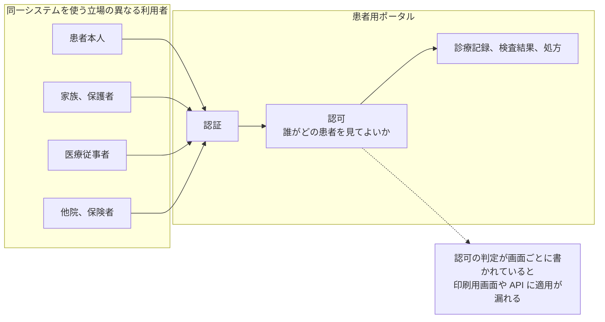

# 🌐 医療系 Web アプリケーションのセキュリティ

患者用ポータル、オンライン診療、Web 予約、健康管理アプリ、地域医療連携システム。
これらは技術的には一般的な Web アプリケーションであり、攻撃手法も一般的なものが通用する。
違うのは、扱うデータと、そこで起きる被害の重さである。

> [!NOTE]
> **表記ルール**：本ページでは、**事実**（一次情報で確認できる内容。出典を併記する）、**報道ベース**（報道のみで確認でき、当事者の公表資料では裏付けが取れていない内容）、**分析**（筆者の解釈）を書き分ける。
> 出典は、当事者の公表資料、行政文書、CVE、ベンダアドバイザリなどの一次情報を優先して示す。

## 一般の Web アプリとの違い

| 論点 | 医療系での現れ方 |
|---|---|
| データの種類 | 病名、投薬、検査結果、遺伝情報といった要配慮個人情報を扱う |
| 漏えい後の回復 | カード番号と違い、診療履歴は再発行も無効化もできない |
| 利用者の属性 | 高齢の患者や、代理でログインする家族が使う。セキュリティ機能の複雑さを上げにくい |
| アクセス経路 | 患者、医療従事者、他院、保険者、家族といった立場の異なる利用者が同一システムを使う |
| 認証の設計 | 診察券番号や生年月日といった、推測可能な値が識別子として使われがちである |
| 権限モデル | 「担当医のみ参照可」「同一病院内なら参照可」など、医療特有の複雑な認可要件を持つ |

医療系 Web アプリでは、権限モデルの複雑さがそのまま脆弱性の温床になる。
IDOR（Insecure Direct Object Reference）ひとつで、システム内の全患者の診療録が読み出せる状態になりうる。

## 一覧

- [患者用ポータルで狙われやすい脆弱性](patient-portal.md)

## 関連ページ

- [OSS 電子カルテ, HIS の脆弱性](../oss-vulnerabilities/ehr-systems.md)
- [ガイドラインと法規制](../../guidelines/)

---

[トップへ](../../../README.md)
