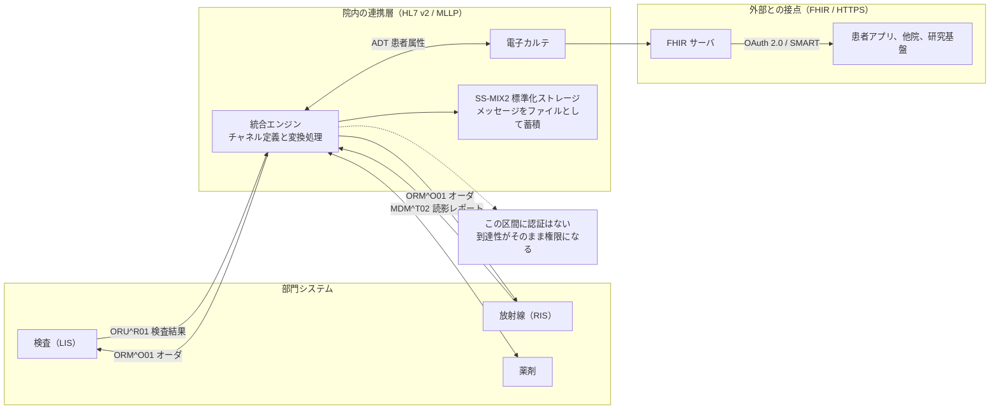
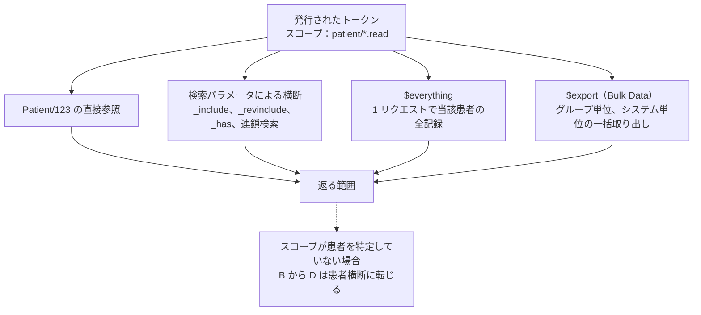

# HL7 v2 と FHIR の攻撃面

医用画像の経路が DICOM なら、文字情報の経路は HL7 v2 と FHIR である。
患者の入退院、検査オーダ、検査結果、処方、紹介状は、この二つのどちらかに乗って院内と院外を移動する。

DICOM と同じく、どちらの規格も認証を規格の本体に含まない。
違いは、FHIR が HTTP と OAuth 2.0 という既存の枠組みに認証と認可を委ねているのに対し、HL7 v2 は委ねる先すら決めていない点にある。

> [!NOTE]
> **表記ルール**：本ページでは、**事実**（一次情報で確認できる内容。出典を併記する）、**報道ベース**（報道や第三者の集計のみで確認でき、当事者の公表資料では裏付けが取れていない内容）、**分析**（筆者の解釈）を書き分ける。
> 出典は、当事者の公表資料、行政文書、CVE、ベンダアドバイザリなどの一次情報を優先して示す。

> [!WARNING]
> 本ページは、自組織のシステムの点検と、許可された範囲での検証を想定している。
> 稼働中の連携インタフェースへのメッセージ投入は、実在する患者の診療録を書き換えうる。
> 検証は合成データを載せたテスト環境で行う。

---

## 二つの規格が置かれる場所

同じ患者情報が、院内では HL7 v2 として、院外との接点では FHIR として流れる構成が増えている。
どちらの層に立っているかで、使える防御の手立てが変わる。



**分析**：図の左側と右側では、同じ「認可の不備」が別の形で現れる。
右側では、トークンのスコープ設計を誤ると患者を横断して参照される。
左側では、そもそもスコープにあたる概念がないため、ネットワークのどこから接続できるかだけが境界になる。

---

## HL7 v2 と MLLP

### メッセージの形

HL7 v2 のメッセージは、パイプ（`|`）で項目を区切った行の集まりである。
各行を**セグメント**と呼び、先頭 3 文字がセグメントの種別を表す。

```
MSH|^~\&|LIS|LAB01|EHR|HOSP01|20260820103000||ORU^R01|MSG00001|P|2.5
PID|1||900000001^^^HOSP01^PI||山田^太郎||19700101|M
OBR|1|ORD001||GLU^血糖^L
OBX|1|NM|GLU^血糖^L||210|mg/dL|70-109|H|||F
```

上は合成データによる検査結果メッセージの例である。
`MSH-3` から `MSH-6` に送信元と宛先のアプリケーション名と施設名が入り、`PID` に患者識別情報が、`OBX` に検査値が入る。

セキュリティの観点で読むべきは、この構造に認証を表す項目がないことである。
`MSH-3`（送信アプリケーション）と `MSH-4`（送信施設）は、送信側が自分で名乗る文字列であり、DICOM の AE Title と同じく認証情報ではない。

### MLLP が担っていること

**MLLP**（Minimal Lower Layer Protocol）は、HL7 v2 メッセージを TCP 上で送るためのフレーミング規約である。
メッセージの前に開始バイト（`0x0B`）を、後ろに終了バイト（`0x1C` と `0x0D`）を付けて区切るだけの仕様であり、認証も暗号化も含まない。
受信側はメッセージごとに ACK（`MSA` セグメントを含む応答）を返す。
仕様は HL7 の「HL7 Version 2 Transport Specification: MLLP」に定められている。

**分析**：この単純さが、検証時の判断を一つに絞る。
MLLP の受信口に TCP で接続できる相手は、原則としてメッセージを投入できる。
「投入できるか」は認証の問題ではなく、経路とファイアウォールの問題になる。

IANA の Service Name and Transport Protocol Port Number Registry には HL7 用として 2575/tcp が登録されているが、実運用ではインタフェースごとに任意のポートが割り当てられる。
外部露出の確認をポート番号の決め打ちで済ませられない理由がここにある。

### メッセージ種別ごとの、悪用されたときの帰結

| 種別 | 本来の用途 | 不正なメッセージが通ったときの帰結 |
|---|---|---|
| `ADT^A01` / `A04` / `A08` | 入院、外来受付、患者属性の更新 | 存在しない患者の登録、氏名や生年月日の書き換え |
| `ADT^A40` | 患者レコードの統合（マージ） | 別人の診療録が一つに統合される。取り消しの手順が用意されていない実装がある |
| `ORM^O01` / `OMG^O19` | 検査、処置のオーダ | 実施されていない検査の指示、既存オーダの取消 |
| `ORU^R01` | 検査結果の報告 | 検査値の差し替え。異常値の正常化、正常値の異常化 |
| `MDM^T02` | 文書の登録 | 診療録への文書の混入 |
| `DFT^P03` | 会計 | 診療報酬請求の内容の改変 |

**分析**：この表のうち、患者安全への影響が最も直接的なのは `ORU^R01` と `ADT^A40` である。
検査値の差し替えは、[医用画像の改ざん](../medical-devices/pacs-dicom.md)と同じく完全性の侵害であり、参照した医師が誤った判断に至る経路を持つ。
患者マージは、二人分の診療録が混ざった状態を作り、アレルギー情報や投薬歴を相互に汚染する。

### 検知と緩和

| 対象 | 検知したい事象 | 緩和策 |
|---|---|---|
| 接続元 | 登録されていない IP からの MLLP 接続、想定時間帯を外れた接続 | 受信口ごとに接続元 IP を限定する。インタフェース単位でセグメントを分ける |
| メッセージ種別 | 普段流れない種別の出現、`ADT^A40` の頻度の変化 | 受信するメッセージ種別を許可リストで限定する |
| 送信元の名乗り | `MSH-3` と `MSH-4` の値が、接続元 IP と対応しない | 統合エンジン側で、接続元と名乗りの対応を検査して破棄する |
| 応答 | NAK（`MSA-1` が `AE` または `AR`）の急増 | 形式を試行錯誤している痕跡として扱い、送信元を確認する |
| 経路 | 平文で流れる患者情報 | 対応する範囲で TLS を適用する。対応しない機器は経路を物理または論理で分離する |

> [!IMPORTANT]
> HL7 v2 のインタフェースは、資産台帳に「連携」とだけ書かれて残りやすい。
> どのシステムが、どのポートで、どの種別を受けているかを一覧にするところから始める。
> 一覧のない状態では、外部露出の確認も、異常なメッセージの判定もできない。

---

## 統合エンジンが集める権限と、その攻撃面

HL7 v2 の連携は、統合エンジン（Mirth Connect など）を中心にした星型で組まれることが多い。
このため、統合エンジンは電子カルテ、検査、放射線、薬剤の各システムへの接続情報を一箇所に保持する。

**分析**：攻撃者から見ると、ここを取ることは各システムを個別に取ることと同じ価値を持つ。
しかも、統合エンジンの正規の機能には、チャネルごとの変換処理としてスクリプトを実行する仕組みが含まれる。
コードを実行する機能が仕様どおりに備わっているため、侵入後の実行は脆弱性を必要としない。

**事実**：NextGen Healthcare Mirth Connect の 4.4.1 より前のバージョンには、未認証のリモートコード実行の脆弱性 CVE-2023-43208 が存在し、CISA の Known Exploited Vulnerabilities Catalog に登録されている（[NVD CVE-2023-43208](https://nvd.nist.gov/vuln/detail/CVE-2023-43208)、[CISA Known Exploited Vulnerabilities Catalog](https://www.cisa.gov/known-exploited-vulnerabilities-catalog)。経緯は[報告された脆弱性の事例](../oss-vulnerabilities/cve-cases.md#mirth-connect)に整理している）。

**検証と監視の観点**

- 管理コンソールと管理 API が、院内であっても限定された端末からのみ到達できるか
- チャネル定義の作成、変更、デプロイが記録され、変更の通知先が定まっているか
- 各システムへの接続資格情報の保管方法と、その資格情報が持つ権限の範囲
- 変換処理のスクリプトが外部へ通信できる構成になっていないか
- メッセージのアーカイブ機能が有効な場合、蓄積された患者情報の保護と保存期間

---

## SS-MIX2 標準化ストレージの参照経路

**事実**：SS-MIX2 標準化ストレージは、HL7 v2 メッセージを患者 ID と日付で階層化したディレクトリにファイルとして蓄積する仕様であり、厚生労働省標準規格として採択されている（仕様書は一般社団法人日本医療情報学会が「SS-MIX2 標準化ストレージ仕様書及び構築ガイドライン」として公開している。用語は[用語集](../../reference/GLOSSARY.md)を参照）。

**分析**：この構造には二つの帰結がある。

第一に、ストレージを置いたファイルサーバの共有設定が、そのまま診療情報へのアクセス制御になる。
アプリケーションの認可を通らずに、ファイルとして読み出せる経路が生まれる。

第二に、患者 ID がディレクトリ名になるため、ディレクトリの一覧を取得できれば患者の在籍を列挙できる。
ファイルを開かなくても、どの患者がいつ受診したかが分かる。

**確認すること**

- 標準化ストレージを置いた領域の共有権限が、連携に必要なアカウントに限定されているか
- 参照の監査ログが、ファイルサーバ側で取得されているか
- 拡張ストレージに置かれた画像や PDF に、同じ制限がかかっているか
- バックアップと、地域連携のために複製した先にも、同じ権限設計が適用されているか

---

## FHIR

FHIR は HTTP と JSON を使うため、一般的な Web API の検証手法がそのまま適用できる。
医療に固有なのは、検索の表現力が高く、1 回のリクエストで到達できる範囲が広いことである。

**事実**：FHIR の仕様は、自身がセキュリティのプロトコルではなく、セキュリティ機能を定義しないと明記し、認証と認可を OAuth 2.0 と SMART App Launch に委ねている（[FHIR Security](https://hl7.org/fhir/security.html)）。

### 1 回のリクエストで、どこまで取れるか



**分析**：検証で確認すべきは、個々のエンドポイントに認可があるかではなく、**トークンに紐づく患者の範囲が、サーバ側で強制されているか**である。
`patient/*.read` のようなスコープは、どのリソース種別を読めるかを表すが、どの患者を読めるかはトークンに紐づく起動時の文脈（launch context）が決める。
この文脈の検査がクライアント側の実装に委ねられていると、リソース種別の制限だけが残る。

### 確認する箇所

| 区分 | 確認内容 |
|---|---|
| 発見 | `metadata`（CapabilityStatement）と `.well-known/smart-configuration` から、有効な操作と認可サーバの構成を読み取れる。想定より広い操作が公開されていないか |
| 検索 | `_include`、`_revinclude`、`_has`、連鎖検索が、患者コンパートメントの外へ到達しないか（[Patient compartment](https://hl7.org/fhir/compartmentdefinition-patient.html)） |
| 識別子 | `identifier` 検索や `_id` の走査で、患者の在籍を列挙できないか。連番の患者 ID は列挙をそのまま許す |
| 一括操作 | `$everything`、`$export` を、どのスコープの主体が起動できるか。起動の記録が残るか |
| バックエンドサービス | 非対話型の認可（[SMART Backend Services](https://github.com/HL7/smart-app-launch)）で発行される `system/*` スコープは、利用者に紐づかない最大権限になる。鍵の保管と失効の手順があるか |
| 起動時の文脈 | `launch` で渡された患者の識別子を、サーバ側でトークンに束縛しているか。クライアントの送る値をそのまま信じていないか |
| 添付 | `Binary` リソースと `DocumentReference` の実体に、同じ認可が適用されるか |
| クライアント登録 | 動的クライアント登録が有効な場合、承認なしに新しいクライアントを登録できないか（[OpenEMR の事例](../oss-vulnerabilities/cve-cases.md)） |
| 外部参照 | サーバが URL を受け取って取得する処理（バリデータ、IG の読み込み、`$validate`）が SSRF の経路にならないか |

### 検知

| 監視対象 | 検知したい事象 |
|---|---|
| トークン単位の参照範囲 | 1 トークンが参照した患者数。想定を超えたら通知する |
| 一括操作 | `$export` と `$everything` の起動。起動主体、対象範囲、取得件数 |
| スコープと実参照の乖離 | 付与されたスコープの範囲内であっても、業務上ありえない組み合わせの参照 |
| 監査記録 | FHIR は監査記録のリソースとして [AuditEvent](https://hl7.org/fhir/auditevent.html) を定義している。記録している場合、参照を患者単位で追跡できる |
| 認可サーバ | クライアント登録の追加、リダイレクト先の変更、鍵の登録 |

---

## 実務チェックリスト

**HL7 v2 / MLLP**
- [ ] 受信口の一覧（システム、ポート、受けるメッセージ種別、接続元）を作成した
- [ ] 外部から MLLP の受信口に到達できないことを確認した
- [ ] 接続元 IP を受信口ごとに限定した
- [ ] `MSH-3` と `MSH-4` の名乗りと接続元の対応を検査している
- [ ] 想定外の種別と `ADT^A40` の頻度を監視している

**統合エンジン**
- [ ] 管理コンソールと管理 API の到達範囲を限定した
- [ ] チャネル定義の変更を記録し、通知している
- [ ] 保持している接続資格情報の権限を、必要最小限に見直した
- [ ] 既知の脆弱性への更新状況を確認した

**SS-MIX2**
- [ ] ストレージ領域の共有権限を、連携用アカウントに限定した
- [ ] 参照の監査ログを取得している
- [ ] 複製先とバックアップにも同じ権限設計を適用した

**FHIR**
- [ ] トークンに紐づく患者の範囲を、サーバ側で強制している
- [ ] `$everything` と `$export` の起動権限を限定し、記録している
- [ ] `_include`、`_revinclude`、連鎖検索がコンパートメントの外へ出ないことを確認した
- [ ] バックエンドサービス用の鍵の保管、更新、失効の手順を定めた
- [ ] 動的クライアント登録の可否を、意図した設定にした
- [ ] 参照ログを患者単位で取得している

---

## 検証環境

実データを持ち込まずに、連携の経路を再現できる。

| 目的 | 構成 |
|---|---|
| 合成患者データの生成 | [Synthea](https://github.com/synthetichealth/synthea) が FHIR、HL7 v2、CSV の形式で出力する |
| FHIR サーバ | [HAPI FHIR](https://github.com/hapifhir/hapi-fhir) の公式コンテナイメージ |
| FHIR の適合性検査 | [Inferno](https://inferno-framework.github.io/) |
| HL7 v2 の送受信 | [Mirth Connect](https://github.com/nextgenhealthcare/connect) でチャネルを組み、[python-hl7](https://github.com/johnpaulett/python-hl7) や [HAPI HL7v2](https://github.com/hapifhir/hapi-hl7v2) で送信側を作る |
| 通信の観察 | Wireshark は HL7 のディセクタを持つ。MLLP のフレーミングとメッセージ本文を、そのまま読める |

> [!TIP]
> 検証環境を作るときは、先に合成データを流し込んでから検証を始める。
> 空のサーバでは、検索パラメータが患者を横断するかどうかを確かめられない。

---

## 関連ページ

- [患者用ポータルで狙われやすい脆弱性](patient-portal.md)
- [PACS / DICOM のセキュリティ](../medical-devices/pacs-dicom.md)
- [ネットワークの分離](../segmentation.md)
- [OSS 電子カルテ、HIS の脆弱性](../oss-vulnerabilities/ehr-systems.md)
- [報告された脆弱性の事例（CVE）](../oss-vulnerabilities/cve-cases.md)
- [医療 DX：国の基盤と接続点](../dx-ax/medical-dx.md)
- [ツール](../../reference/resources/tools.md)

---

<sub>[← 医療系 Web アプリのセキュリティ](README.md) | [トップへ](../../../README.md)</sub>
