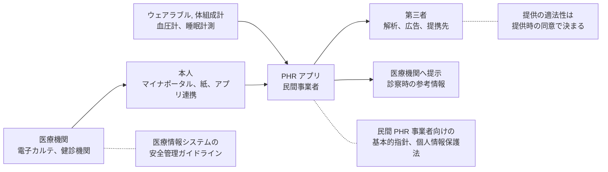

# 📱 PHR、健康アプリ、ウェアラブル

同じ健康情報でも、医療機関の中にあるときと、本人の端末に移ったあとでは、適用される枠組みが変わる。
医療情報システムの安全管理に関するガイドラインは、医療機関等を対象としている。
本人がアプリへ取り込んだ検査結果や、ウェアラブル端末が記録した心拍は、その外側にある。

本ページは、この外側を扱う。
医療機関にとっては、患者に勧めるアプリの確認と、患者が持ち込むデータの扱いという二つの接点がある。

> [!NOTE]
> **表記ルール**：本ページでは、**事実**（一次情報で確認できる内容。出典を併記する）、**報道ベース**（報道や第三者の集計のみで確認でき、当事者の公表資料では裏付けが取れていない内容）、**分析**（筆者の解釈）を書き分ける。

---

## 枠組みが切り替わる場所

**分析**：切り替わる場所は、データが本人の手に渡る点である。
医療機関が本人へ渡すところまでは医療分野の枠組みが働き、その先は本人と事業者の関係になる。
医療機関が「うちのガイドラインの範囲外」と扱うのは正しいが、患者にアプリを勧める場面では、勧めた側の説明責任が残る。

---

## 日本の枠組み

**事実**：総務省、厚生労働省、経済産業省は「民間 PHR 事業者による健診等情報の取扱いに関する基本的指針」を令和 3 年 4 月に策定し、令和 4 年 4 月に一部改定した。
健診等情報を取り扱う PHR サービスを提供する民間事業者に対し、法規制上の遵守事項に加えて、情報セキュリティ対策、個人情報の適切な取扱い、健診等情報の保存と管理および相互運用性の確保、要件遵守の担保方法について定めている。
出典：[基本的指針（PDF）](https://www.mhlw.go.jp/content/12600000/000812874.pdf)、[Q&A（PDF）](https://www.mhlw.go.jp/content/10904750/001030113.pdf)

**事実**：業界側の文書として、一般社団法人 PHR 普及推進協議会と PHR サービス事業協会が「民間事業者の PHR サービスに関わるガイドライン（第 3 版）」を 2024 年 6 月に公表している。
出典：[ガイドライン第 3 版（PDF）](https://www.meti.go.jp/policy/mono_info_service/healthcare/downloadfiles/phrgaidorain.pdf)

**事実**：健康診断等の結果は、個人情報保護法上の要配慮個人情報に含まれる（[国内のガイドラインと法規制](../../guidelines/japan.md)）。

**分析**：この枠組みの実効性は、事業者が指針に沿っているかを利用者が確認できるかにかかっている。
利用者が確認できるのは、プライバシーポリシーの記載と、アプリが要求する権限、実際の通信先だけである。
医療機関がアプリを患者に勧める場合、この確認を患者に委ねる形になる。

---

## 米国の枠組み

**事実**：米国では、HIPAA の対象外にある健康アプリ等について、FTC の Health Breach Notification Rule が適用される。
改正最終規則は 2024 年 4 月 26 日に公表され、2024 年 7 月 29 日に施行された。
本人の承諾のない第三者への開示が、規則上の「セキュリティ侵害」に含まれることが明確化されている。
出典：[Federal Register 2024-10855](https://www.federalregister.gov/documents/2024/05/30/2024-10855/health-breach-notification-rule)

**事実**：同規則にもとづく執行として、処方薬の割引サービス、排卵日予測アプリに対する命令が公表されている。
オンラインカウンセリングの事業者に対しては、FTC 法第 5 条にもとづく命令が出ている（[患者向けサイトの第三者送信](tracking.md)）。

**分析**：日米で枠組みは違うが、問われている中身は同じである。
侵入や脆弱性ではなく、事業者が自ら設置した送信の仕組みと、利用者への説明との乖離が対象になっている。

---

## 医療機関がアプリを患者に勧めるとき

| 確認項目 | 見るところ | 判断の目安 |
|---|---|---|
| 事業者 | 運営者の名称、所在、問い合わせ先 | 記載がない、連絡が取れない場合は勧めない |
| 送信先 | プライバシーポリシーに記載された第三者提供の範囲 | 「マーケティング目的」の記載があるかを確認する |
| 権限 | アプリが要求する端末の権限（位置情報、連絡先、写真） | 機能から説明できない権限を要求していないか |
| 認証 | 二要素認証の有無、パスワードの要件 | 検査結果を扱うサービスで記憶認証のみは弱い |
| 保存 | データの保存場所、暗号化の記載 | 記載がない場合は確認する |
| 削除 | 退会時のデータの扱い、削除の方法 | 削除の手段が示されているか |
| 二次利用 | 研究や統計での利用の記載、オプトアウトの可否 | 本人が選べる形になっているか |
| 事業終了 | 事業譲渡や終了時のデータの扱い | 記載がないことが多い。あるかどうかを見る |

**分析**：最後の項目が、健康データに固有の論点になる。
事業が続く前提で書かれた説明は、事業が終わるときに機能しない。
遺伝子検査サービスの事例では、破産手続でデータが資産として扱われた（[ゲノムデータの保護](../genomics.md)）。

---

## アプリを検証するときの範囲

**分析**：自組織が提供するアプリ、または自組織の許可を得て検証する対象について、次の範囲は自分のアカウントと自分のデータだけで確認できる。
他人のデータに到達できるかを確かめる場合は、検証用に用意した二つのアカウントを使い、実在の患者のデータには触れない。

| 観点 | 確認すること | 注意 |
|---|---|---|
| 通信 | TLS の使用、証明書の検証、平文で送られる項目 | 通信の観測は、自分の端末と自分のアカウントに限る |
| 保存 | 端末内に保存される内容、暗号化の有無 | 自分の端末で確認する |
| 権限 | 要求する権限と、実際の使用 | 端末の設定画面から確認できる |
| 第三者への送信 | 解析、広告の SDK による送信先 | 送信内容に健康情報が含まれるかを見る |
| 認可 | 自分のアカウントで、他の利用者のデータに到達できないか | 検証用アカウント二つで確認する。実在の患者では行わない |
| エクスポートと削除 | 出力される内容と、削除の実効性 | 削除後に再ログインして残存を確認する |

**分析**：この一覧で最も見つかりやすいのは、認可の不備である。
利用者を識別する値が連番になっている、リクエストの中の識別子を変えると他人のデータが返る、という形は、患者ポータルと同じ構造を持つ（[患者用ポータルの脆弱性](patient-portal.md)）。

---

## 医療機関側に返ってくる論点

**分析**：患者が持ち込むデータを診療に使う場合、三つの論点が医療機関側に戻ってくる。

**出所の確認**：アプリの画面や印刷物として提示されたデータは、機器が測定した値そのものとは限らない。
手入力された値、編集された値、別人の値が混じる可能性を前提に扱う（[完全性への攻撃と患者安全](../../threats/integrity-attacks.md)）。

**取り込みの経路**：アプリから電子カルテへ取り込む場合、連携の口が新たな外部接続になる。
FHIR などの API を用いる場合は、[HL7 v2 と FHIR の攻撃面](hl7-fhir.md)で扱った論点がそのまま当てはまる。

**記録としての扱い**：参考情報として記録に残す場合、出所と取得日時を併記する。
診療録の真正性の要求は、取り込んだデータにも及ぶ（[認証とアクセス管理](../identity.md)）。

---

## 実務チェックリスト

**患者に勧める場合**
- [ ] 事業者、送信先、削除の方法を確認した
- [ ] 二次利用の範囲と、選択の可否を確認した
- [ ] 事業終了時のデータの扱いに関する記載を確認した
- [ ] 患者への説明に、医療機関の責任範囲を含めた

**自組織が提供する場合**
- [ ] 民間 PHR 事業者向けの基本的指針の項目に沿って確認した
- [ ] 第三者へ送信する内容を一覧化し、説明と一致させた
- [ ] 認可の不備がないことを、検証用アカウントで確認した
- [ ] 削除の要求が、バックアップと派生データにも及ぶ設計にした

**取り込む場合**
- [ ] 取り込んだデータの出所と取得日時を記録する形式にした
- [ ] 連携の口を、外部接続の一覧に加えた
- [ ] 手入力された値と機器が測定した値を区別できる形にした

---

## 関連ページ

- [患者用ポータルの脆弱性](patient-portal.md)：認証と認可の設計
- [患者向けサイトの第三者送信](tracking.md)：説明と実際の送信の乖離
- [HL7 v2 と FHIR の攻撃面](hl7-fhir.md)：連携 API の攻撃面
- [ゲノムデータの保護](../genomics.md)：事業者が消えるときのデータの扱い
- [完全性への攻撃と患者安全](../../threats/integrity-attacks.md)：持ち込まれたデータの信頼性
- [医療 DX：国の基盤と接続点](../dx-ax/medical-dx.md)：マイナポータル経由の情報提供
- [国内のガイドラインと法規制](../../guidelines/japan.md)：要配慮個人情報の扱い

---

[← 医療系 Web アプリのセキュリティ](README.md) | [トップへ](../../../README.md)
