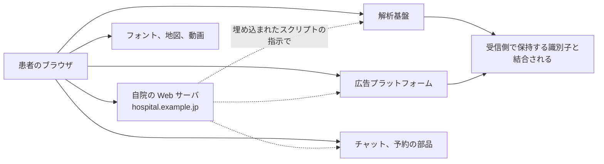
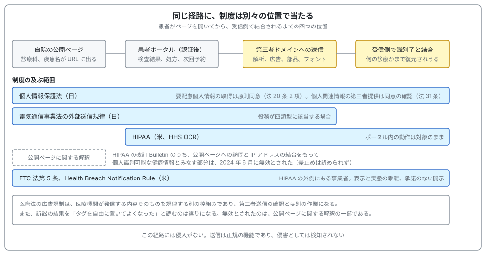

# 🧿 患者向けサイトの第三者送信

医療機関の Web サイトから患者の情報が外部へ出る経路は、二つある。
一つは攻撃者が脆弱性を使って持ち出す経路であり、[患者用ポータルの脆弱性](patient-portal.md)で扱っている。
もう一つは、自組織が設置したタグが、設計どおりに送信する経路である。
本ページは後者を扱う。

この経路には、他の攻撃面と違う性質が三つある。
侵入がないため、侵害として検知されない。
送信は正規の機能であり、遮断すると広告や解析が止まる。
そして、出ていく情報が診療科名や症状という、要配慮個人情報に直結する内容になりうる。

> [!NOTE]
> **表記ルール**：本ページでは、**事実**（一次情報で確認できる内容。出典を併記する）、**報道ベース**（報道や第三者の集計のみで確認でき、当事者の公表資料では裏付けが取れていない内容）、**分析**（筆者の解釈）を書き分ける。

---

## 何が外部に出るのか

患者がページを開いた時点で、ブラウザは自院のサーバ以外にも接続する。
広告タグ、アクセス解析、フォーム部品、チャット、地図、フォント、動画の埋め込みが、それぞれ別のドメインへ通信する。

各接続で、次の情報が相手に渡りうる。

| 渡りうる情報 | どこに含まれるか | 医療で問題になる例 |
|---|---|---|
| ページの URL | 送信先へ渡すパラメータ、Referer ヘッダ | `/department/oncology/`、`/disease/hiv/` のようなパスが診療内容を示す |
| クエリ文字列 | URL の一部 | 検索語、症状名、`?symptom=` のような入力 |
| フォームの入力値 | 部品が読み取る場合 | 予約フォームの氏名、生年月日、相談内容 |
| 識別子 | Cookie、広告 ID、ローカルストレージ | 同一人物を、他サイトの行動と結び付けられる |
| IP アドレスと環境情報 | 接続そのもの | 地域、端末、閲覧時刻 |
| ログイン後の画面 | 患者ポータル内にタグが残っている場合 | 検査結果、処方、次回予約の画面構成 |

**分析**：単体では個人を識別しない情報でも、受信側が既に持っている識別子と結合されると個人に紐づく。
医療で問題になるのは、結合されたときに「誰が」だけでなく「何の診療を受けているか」まで復元される点である。
氏名を送っていないことは、この経路の安全性を担保しない。

この一つの経路に、日米の制度がそれぞれ別の位置で当たる。
以降の節で制度ごとに見るが、先に全体の当たり方を示す。

---

## 米国で起きたこと

米国では、この経路が三つの制度から同時に問われた。
制度ごとに対象と論点が違うため、分けて読む必要がある。

| 制度 | 所管 | 対象 | 問われること |
|---|---|---|---|
| HIPAA | HHS OCR | 医療提供者、保険者とその業務受託者 | 保護対象保健情報の開示にあたるか、タグ提供者は業務受託者か |
| FTC 法第 5 条 | FTC | 事業者一般 | 表示と実態の乖離、不公正な取り扱い |
| Health Breach Notification Rule | FTC | HIPAA の外側にある健康アプリ等 | 本人の承諾のない開示を「セキュリティ侵害」として通知したか |

### HIPAA をめぐる経緯

**事実**：HHS OCR は 2022 年 12 月 1 日に、オンライン追跡技術への HIPAA の適用に関する Bulletin を公表し、2024 年 3 月 18 日に改訂した。
出典：[HHS Use of Online Tracking Technologies by HIPAA Covered Entities and Business Associates](https://www.hhs.gov/hipaa/for-professionals/privacy/guidance/hipaa-online-tracking/index.html)

**事実**：2024 年 6 月 20 日、米テキサス北部地区連邦地方裁判所（American Hospital Association et al. v. Becerra et al., No. 4:23-cv-01110-P、Pittman 裁判官）は、改訂 Bulletin のうち、認証を要しない公開ページへの訪問と個人の IP アドレスの結合をもって個人識別可能な健康情報が存在するとみなす部分（判決が Proscribed Combination と呼んだ部分）について、HHS の権限を超えるとして違法と宣言し、無効とした。
一方で、HHS に対して執行を禁じる差止めは認めなかった。
出典：[Opinion & Order（AHA が公開）](https://www.aha.org/legal-documents/2024-06-29-opinion-order-american-hospital-association-et-al-v-xavier-becerra-et-al)

**事実**：HHS は 2024 年 8 月 29 日に控訴を取り下げた。
出典：[AHA News 2024-08-29](https://www.aha.org/news/headline/2024-08-29-hhs-will-not-appeal-aha-court-victory-online-tracking-case)

**分析**：無効とされたのは、認証を要しない公開ページに関する解釈の一部である。
患者がログインした後の領域、すなわち患者ポータル内でのタグの動作は、この判断の対象外であり、依然として HIPAA の枠組みで扱われる。
訴訟の結果を「タグを自由に置いてよくなった」と読むのは誤りになる。

### FTC による執行

**事実**：FTC は Health Breach Notification Rule の改正最終規則を 2024 年 4 月 26 日に公表し、2024 年 7 月 29 日に施行した。
健康アプリ等が本人の承諾なく第三者へ健康情報を開示する行為が、規則上の「セキュリティ侵害」に含まれることを明確化している。
出典：[FTC 発表](https://www.ftc.gov/news-events/news/press-releases/2024/04/ftc-finalizes-changes-health-breach-notification-rule)、[FTC 規則ページ](https://www.ftc.gov/legal-library/browse/rules/health-breach-notification-rule)

**事実**：GoodRx は、Facebook や Google 等への利用者の健康情報の開示について通知を行わなかったとして、同規則にもとづく初の執行を受け、150 万ドルの民事制裁金を含む命令に服した（2023 年 2 月公表）。
出典：[FTC 発表](https://www.ftc.gov/news-events/news/press-releases/2023/02/ftc-enforcement-action-bar-goodrx-sharing-consumers-sensitive-health-info-advertising)

**事実**：排卵日予測アプリの Premom（Easy Healthcare）に対しても、同規則にもとづく執行が行われた（2023 年 5 月公表）。
出典：[FTC 発表](https://www.ftc.gov/news-events/news/press-releases/2023/05/ovulation-tracking-app-premom-will-be-barred-sharing-health-data-advertising-under-proposed-ftc)

**事実**：オンラインカウンセリングの BetterHelp については、FTC 法第 5 条にもとづく命令が 2023 年 7 月 14 日に最終承認され、780 万ドルの支払いが命じられた。
メールアドレス、IP アドレス、健康に関する質問への回答を広告目的で Facebook 等へ提供していたとされる。
出典：[FTC 発表](https://www.ftc.gov/news-events/news/press-releases/2023/07/ftc-gives-final-approval-order-banning-betterhelp-sharing-sensitive-health-data-advertising)

**分析**：三件に共通するのは、侵入も脆弱性も関与していない点である。
問われたのは、事業者が自ら設置した仕組みによる送信と、その説明との乖離だった。

---

## 日本での整理

日本では、まず個人情報保護法で考える。
電気通信事業法の外部送信規律は、適用の有無が役務の類型で決まるため、自院サイトが必ず対象になるとは限らない。

### 個人情報保護法

**事実**：病歴は要配慮個人情報にあたり、その取得には原則として本人の同意が必要である（法第 20 条第 2 項）。
出典：[個人情報保護委員会 ガイドライン（通則編）](https://www.ppc.go.jp/personalinfo/legal/guidelines_tsusoku/)

**事実**：Cookie 等の個人関連情報を第三者へ提供する場合において、提供先が個人データとして取得することが想定されるときは、本人の同意が得られていることを確認する義務がある（法第 31 条）。
出典：[個人情報保護委員会 ガイドラインに関する Q&A](https://www.ppc.go.jp/personalinfo/faq/APPI_QA/)

**事実**：医療分野については、個人情報保護委員会と厚生労働省が「医療・介護関係事業者における個人情報の適切な取扱いのためのガイダンス」を示している。
出典：[個人情報保護委員会](https://www.ppc.go.jp/personalinfo/legal/iryoukaigo_guidance/)

### 電気通信事業法の外部送信規律

**事実**：2023 年 6 月 16 日に施行された外部送信規律は、利用者に関する情報を外部送信させる指令を行う際、送信される情報の内容、送信先などを、あらかじめ通知するか、利用者が容易に知り得る状態に置くことを求める。
対象となる役務は、利用者間のメッセージの媒介、利用者が入力した情報を不特定の利用者が閲覧できる役務（SNS、電子掲示板等）、オンライン検索サービス、各種情報のオンライン提供の四類型である。
出典：[総務省 外部送信規律](https://www.soumu.go.jp/main_sosiki/joho_tsusin/d_syohi/gaibusoushin_kiritsu_00001.html)、[外部送信規律 FAQ](https://www.soumu.go.jp/main_sosiki/joho_tsusin/d_syohi/gaibusoushin_kiritsu_00002.html)

**分析**：自院の診療案内だけを掲載するサイトと、患者間の相談機能や情報提供サービスを備えるサイトでは、判断が変わりうる。
オンライン診療、健康情報のポータル、患者コミュニティを運営している場合は、対象になるかを個別に確認する必要がある。
一方で、対象外だった場合でも個人情報保護法の要求は残るため、「外部送信規律の対象ではないから対応不要」という結論にはならない。

### 医療広告規制との違い

**事実**：医療法にもとづく広告規制は、医療機関が発信する内容そのもの（虚偽、誇大、比較優良広告等）を規律する枠組みであり、Web サイトの監視事業が置かれている。
出典：[厚生労働省 医療法における病院等の広告規制について](https://www.mhlw.go.jp/stf/seisakunitsuite/bunya/kenkou_iryou/iryou/kokokukisei/index_00003.html)

**分析**：広告規制の確認と、第三者送信の確認は別の作業である。
サイト制作を委託している場合、広告規制のレビューは行われても、タグの棚卸しは行われていないことが多い。

---

## 棚卸しの手順

自院のサイトで何が送信されているかは、外部から観測できる。
本番環境に対しても、閲覧するだけであれば診療に影響しない。

| 段階 | 確認すること | 方法 | よくある発見 |
|---|---|---|---|
| 1 | 設置されているタグの一覧 | タグマネージャの管理画面、HTML と JavaScript の確認 | 退職者が設置したまま、誰も所有していないタグ |
| 2 | 実際の送信先ドメイン | ブラウザの開発者ツールのネットワークタブ、通信の記録 | 管理画面にないドメインへの送信（タグが別のタグを読み込む） |
| 3 | 送信される内容 | 送信されたリクエストの URL とペイロードを目視 | URL パスに診療科名、クエリに検索語 |
| 4 | URL の設計 | サイトマップと、公開ページの命名規則 | 疾患名がそのままパスに入っている |
| 5 | ログイン後の領域 | 患者ポータル内のページで 1 から 3 を繰り返す | 全ページ共通のテンプレートにタグが入り、ポータル内にも配信されている |
| 6 | 契約と説明 | 委託契約、プライバシーポリシー、同意取得の文言 | 実際の送信先が説明に含まれていない |

**分析**：最も見落とされるのが 2 と 5 である。
タグマネージャは、一つのタグが別のスクリプトを読み込む構造を許すため、管理画面の一覧と実際の送信先は一致しない。
また、ポータルの共通ヘッダにタグが入っている構成では、ログイン後の画面遷移まで送信対象になる。

---

## 設計で減らす

| 対策 | 何が変わるか | 注意点 |
|---|---|---|
| URL に疾患名や症状を含めない | パスとリファラから内容が読めなくなる | 既存 URL の変更は検索順位と外部リンクに影響する。リファラ制御と併用する |
| 予約フォームと問診を別ドメイン、別ページに分離する | フォーム側にタグを置かない構成にできる | 部品として埋め込む方式では分離にならない |
| `Referrer-Policy` を設定する | 送信先に渡る URL の粒度を下げられる | 解析の精度は下がる |
| タグの追加を承認制にする | 誰が何を設置したかを追える | 現場のマーケティング業務との調整が要る |
| Content Security Policy を設定する | 想定外のドメインへの送信を止められる。report-only で検知だけ先に始められる | 既存のタグを洗い出してからでないとサイトが壊れる |
| Subresource Integrity を使う | 読み込むスクリプトの改変を検知できる | 提供側が内容を頻繁に更新するタグには適用しにくい |
| サーバサイドでの計測に切り替える | 患者のブラウザから第三者への直接送信をなくせる | 送る内容を自組織で決められる分、何を送るかの判断責任が自組織に移る |
| 同意管理を入れる | 取得の根拠を説明できる | 同意しない選択が実際に機能することを確認する |

---

## 攻撃側から見たタグ

**分析**：タグは、自組織が明示的に許可した外部由来のスクリプトである。
そのため、次の二つの意味で攻撃面になる。

第一に、提供元が侵害されると、そのスクリプトを読み込んでいる全ページで任意のコードが動く。
決済や予約のフォームがあるページでは、入力値の窃取に直結する。
この形の攻撃は、他業種の EC サイトで繰り返し観測されてきた。

第二に、タグの設置権限そのものが標的になる。
タグマネージャの管理アカウントを奪えば、脆弱性を使わずに、公開サイト全体へスクリプトを配信できる。
タグマネージャは Web サーバの外にあるため、サーバ側の変更監視には現れない。

| 起点 | 成立する条件 | 検知の手立て | 緩和 |
|---|---|---|---|
| 提供元スクリプトの改変 | 外部ドメインのスクリプトを無検証で読み込んでいる | Subresource Integrity の検証失敗、CSP 違反レポート | SRI、読み込み元の限定、サーバサイド計測 |
| タグマネージャの管理アカウント奪取 | 管理アカウントが多要素認証なし、共有されている | 管理画面の変更履歴、公開ページの差分監視 | [認証の強化](../identity.md)、承認フロー、公開ページの定期差分監視 |
| 悪意あるタグの混入 | 誰でもタグを追加できる運用 | 送信先ドメインの一覧との差分 | 承認制、CSP の許可リスト |
| 期限切れドメインの再取得 | タグの提供元ドメインが失効し第三者に取得される | 読み込み先ドメインの登録情報の確認 | 依存するドメインの棚卸し |

**分析**：この観点は、[サプライチェーン](../../reference/pharma/supply-chain.md)の議論と同じ構造を持つ。
医療機関にとってのタグは、コードの委託先である。
契約の相手ではないことも多く、その場合は「契約なしに自組織のサイトでコードを実行している主体」が存在することになる。

### 検証の進め方

自組織の許可を得たうえで、次の範囲は診療に影響を与えずに実施できる。

1. 公開ページと患者ポータルの各画面を開き、発生した外部接続を記録する
2. 送信されたリクエストの URL とペイロードから、診療内容を推測できる情報が含まれるかを確認する
3. 読み込まれているスクリプトの提供元ドメインを一覧化し、登録情報と有効期限を確認する
4. CSP を report-only で適用し、実際の送信先との差分を一定期間観測する
5. 結果を、送信先、送信内容、根拠となる契約と説明の三点で整理する

**分析**：5 の形に整理すると、そのまま個人情報保護法上の説明資料になる。
検証の成果物が、技術部門だけでなく法務と広報にも使える形になる点で、優先順位を上げやすい主題である。

---

## 実務チェックリスト

**棚卸し**
- [ ] 公開サイトと患者ポータルで、外部へ送信しているドメインを一覧化した
- [ ] タグマネージャの管理画面の一覧と、実際の送信先の差分を確認した
- [ ] URL のパスとクエリに、診療科名、疾患名、症状が含まれていないか確認した
- [ ] ログイン後の領域にタグが配信されていないか確認した
- [ ] 各タグの所有部署と、設置の目的を特定した

**制度**
- [ ] 要配慮個人情報の取得にあたる送信がないかを整理した
- [ ] 個人関連情報の第三者提供に該当する場合の同意確認の方法を決めた
- [ ] 自院のサービスが外部送信規律の対象となるかを確認した
- [ ] プライバシーポリシーの記載と、実際の送信先を突き合わせた

**設計**
- [ ] タグの追加を承認制にした
- [ ] Content Security Policy を report-only で導入し、違反を観測している
- [ ] 予約と問診のフォームを、タグを置かない構成に分離した
- [ ] タグマネージャの管理アカウントに多要素認証を適用した

---

## 関連ページ

- [患者用ポータルの脆弱性](patient-portal.md)：攻撃者による持ち出しの経路
- [認証とアクセス管理](../identity.md)：管理アカウントの保護
- [海外のガイドラインと法規制](../../guidelines/global.md)：HIPAA と FTC の位置づけ
- [国内のガイドラインと法規制](../../guidelines/japan.md)：個人情報保護法と医療分野のガイダンス
- [診断とペネトレーションテスト](../../practice/pentest/)：Web 領域の検証
- [セキュリティの基礎](../../reference/security-basics.md)：多層防御と最小権限

---

[← 医療系 Web アプリのセキュリティ](README.md) | [トップへ](../../../README.md)
