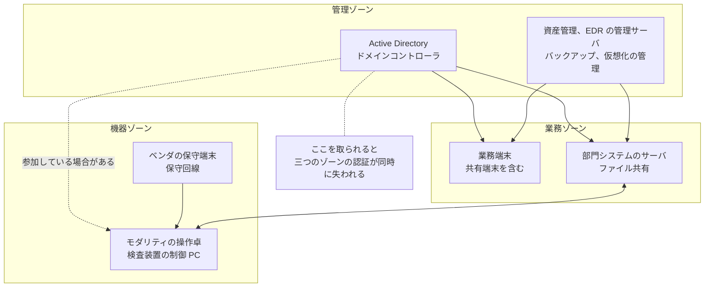
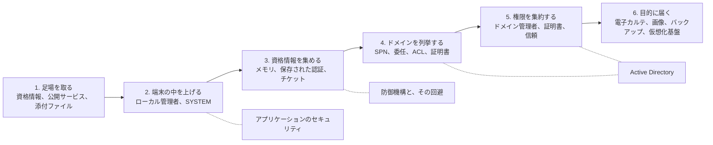
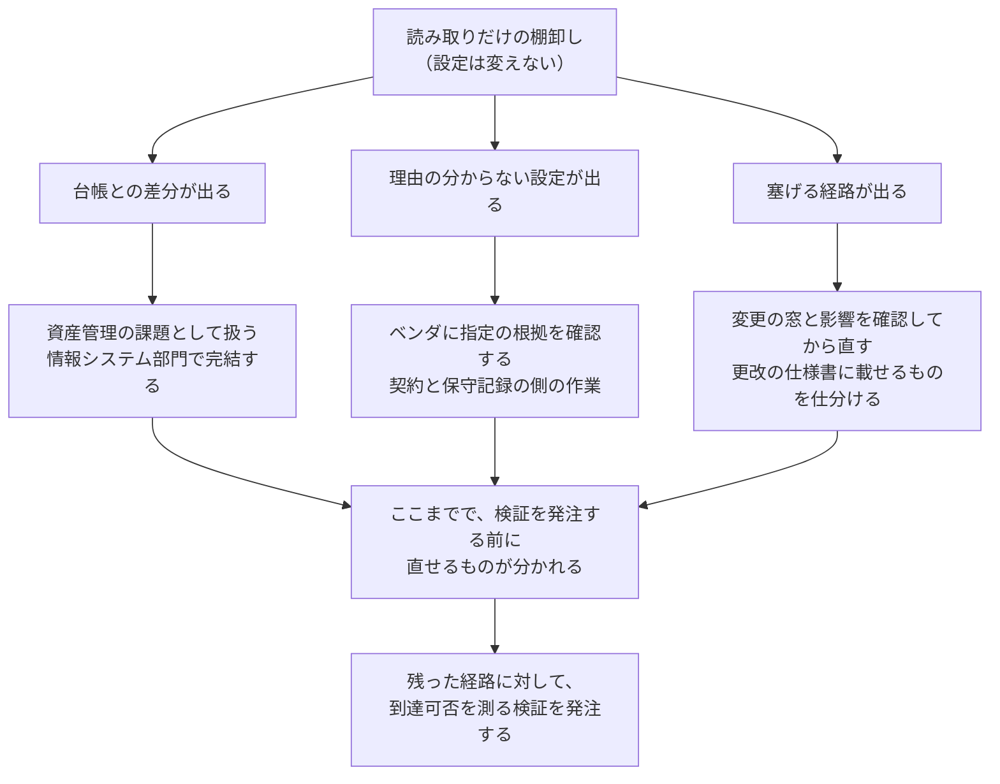
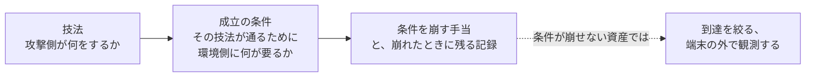

# 🪟 Windows 環境のセキュリティ

医療機関の情報システムは、電子カルテのクライアントから部門システムのサーバ、検査装置に付属する制御用の端末まで、その大半が Windows で動いている。
攻撃側から見ると、この事実は経路の設計を単純にする。
一つの技術基盤を理解すれば、受付の端末から画像の保管庫まで、同じ手順で通れる可能性が出るためである。

本群は、その Windows を三つに分けて扱う。
ドメイン（Active Directory）を中心とした環境の側、その上で動くアプリケーションの側、そして両者を守る防御機構と、その回避の側である。

いずれのページも、技法を並べるのではなく、**誰が、どの Windows を起点に、誰の何を使って、どこへ到達し、患者に何が起きるか**という形で書く。
その書き方と、本群で扱う七つのシナリオの一覧は [4 節](#4-攻撃シナリオの書き方と本群で扱う七つ)に置いた。
侵害の帰結として最も長く効くバックドアの仕込みは、残る場所を端末、サーバ、ドメイン、保守と医療機器の四つに分けて[別に整理している](active-directory.md#10-バックドアの仕込みと復旧で消えないもの)。

> [!NOTE]
> **表記ルール**：本ページでは、**事実**（一次情報で確認できる内容。出典を併記する）と、**分析**（筆者の解釈）を書き分ける。

> [!WARNING]
> 本群の記述は、自組織に対する検証の設計と、防御の設計に使うことを想定している。
> 権限のないシステムに対する検証は行わない。
> 立場ごとにどこで法の線に触れるかは[検証と調査の法的境界](../../practice/legal-boundary.md)にまとめている。
>
> 本群に置く攻撃シナリオは、公表された調査報告書、公的な統計、ベンダの資料から組み立てた**想定**である。
> 実在する特定の医療機関の構成や、公表されていない被害を指すものではない。

---

## 1. 医療機関の Windows を四つに分ける

同じ Windows でも、誰が管理し、更新できるかによって、打てる手が変わる。
本群では、利用者が操作する側を**クライアント**、サービスを提供する側を**サーバ**と呼び、攻撃シナリオではどちらであるかを必ず示す。
医療機関では次の四つが混在する。

| 区分 | 主な用途 | 管理する主体 | 更新できるか | エージェントを入れられるか |
|---|---|---|---|---|
| **業務端末** | 電子カルテの参照と入力、事務、外来と病棟の共有端末 | 情報システム部門 | できる。ただし停止の窓が限られる | 入れられる |
| **サーバ** | 部門システム、ファイル共有、ドメインコントローラ、バックアップ、仮想化の管理 | 情報システム部門とベンダ | 部門システムはベンダの検証待ちになる | 入れられるが、ベンダの指定で除外が付く |
| **医療機器に付属する PC** | モダリティの操作卓、検査装置、生体情報モニタの管理端末 | 臨床工学部門と機器メーカー | メーカーの承認なしには変えられない | メーカー保証の対象外になることがある |
| **保守用の端末と回線** | 装置ベンダが持ち込む端末、リモート保守の踏み台 | 装置ベンダ | 医療機関の管理外 | 医療機関からは見えないことが多い |

**分析**：この四区分は、そのまま防御の効き方の差になる。
上から二つは一般企業と同じ手当が入る。
下から二つは、端末の中に手を入れられないため、[到達できる範囲を狭める](../segmentation.md)側と、[端末の外で観測する](../logging.md#医療機器ゾーンで-edr-が入らないとき)側でしか守れない。

**分析**：図の点線が示すとおり、機器ゾーンの端末がドメインに参加しているかどうかで、被害の広がり方が変わる。
参加していれば、業務ゾーンで得た資格情報がそのまま機器ゾーンでも通る。
参加の要否は機器の設計ではなく導入時の運用で決まっていることが多く、確認すると要らないまま参加している例が出る（[防御プレイブック](../../threats/actors/defense-playbook.md#医療機関の-active-directory-で権限が集まりやすい箇所)）。

---

## 2. サポート期限と、医療での効き方

**事実**：Windows 10 のサポートは 2025 年 10 月 14 日に終了した。
消費者向けの拡張セキュリティ更新（ESU）は 2027 年 10 月 12 日までとされている。
出典：[Windows 10 support ends on October 14, 2025](https://support.microsoft.com/en-us/windows/windows-10-support-ends-on-october-14-2025-2ca8b313-1946-43d3-b55c-2b95b107f281)（Microsoft）

**事実**：Windows Server 2012 R2 の延長サポートは 2023 年 10 月 10 日に終了した。
出典：[Windows Server 2012 R2 のライフサイクル](https://learn.microsoft.com/en-us/lifecycle/products/windows-server-2012-r2)（Microsoft）

**事実**：組み込み機器向けの Windows 10 IoT Enterprise LTSC 2021 は、延長サポートの終了日が 2032 年 1 月 13 日である。
出典：[Windows 10 IoT Enterprise LTSC 2021 のライフサイクル](https://learn.microsoft.com/en-us/lifecycle/products/windows-10-iot-enterprise-ltsc-2021)（Microsoft）

**分析**：三つの日付が示すのは、医療機関の中で Windows の期限が一つに揃わないという条件である。
業務端末は 2025 年で線を引かれ、部門サーバはすでに 2 年前に線を越えており、医療機器に載る Windows だけが 2030 年代まで残る。
機器側の期限が長いこと自体は設計の意図どおりだが、その機器が業務ゾーンのドメインに参加していれば、期限の長い側が期限の短い側の弱点を引き受ける形になる。

**分析**：期限切れの端末を「更新できないから対象外」と扱うと、攻撃側から見た価値が変わらないまま残る。
[Hack The Box の型で病院を想定する](../../practice/pentest/htb-style-hospital.md#23-古い構成が残る機構)に整理したとおり、更新できない条件は業務と制度の側にあるため、代わりに置けるのは「届かなくする」と「起きたら気付く」の二つになる。

---

## 3. 攻撃側が Windows 環境を通る順序

侵入後の動きは、環境が Windows である限り、業種を問わずほぼ同じ順序を取る。
本群の各ページが、この順序のどこに対応するかを併記する。

**分析**：医療機関で 2 段目と 3 段目が短くなりやすいのは、共有端末の運用と、部門システムのサービスアカウントが理由になる。
複数の職員が一つの端末を使い、ログオフが徹底されない環境では、端末に残る資格情報の種類が増える。
部門システムが管理者権限のサービスアカウントで動いていれば、そのアカウントの権限がそのまま次の段になる（[認証とアクセス管理](../identity.md)）。

---

## 4. 攻撃シナリオの書き方と、本群で扱う七つ

技法の一覧は、そのままでは判断に使えない。
医療機関で予算と順序を決める材料にするには、次の五つを一組にして書く必要がある。

| 欄 | 何を書くか |
|---|---|
| **起点の Windows** | クライアントか、サーバか。どのゾーンにあるか |
| **攻撃者** | 誰が、どの権限から始めるか（外部の攻撃者、内部の者、委託先経由） |
| **直接の被害者** | 資格情報や端末を使われる当事者。多くは職員かベンダである |
| **到達点の Windows** | クライアントか、サーバか。何が保管され、何が動いているか |
| **最終的な被害者とリスク** | 患者と診療に、どう跳ね返るか |

**分析**：この形にすると、医療の固有性が最後の二つに集まることが分かる。
攻撃者の動きと経路は、他業種とほとんど変わらない。
変わるのは、到達点の先に患者がいることと、復旧を急がなければならない事情から消し残しが出ることである。

本群で扱うシナリオを一覧にする。

| シナリオ | 起点 | 到達点 | 最終的なリスク |
|---|---|---|---|
| [A. 外来の共有端末から、電子カルテとバックアップへ](active-directory.md#21-シナリオ-a外来の共有端末から電子カルテとバックアップへ) | クライアント | サーバ | 診療の停止、要配慮個人情報の流出 |
| [B. 部門システムのサービスアカウントから、同じベンダの全サーバへ](active-directory.md#22-シナリオ-b部門システムのサービスアカウントから同じベンダの全サーバへ) | サーバ | サーバ | 部門業務の停止、記録の改ざん |
| [C. 保守用の端末から、証明書を経由した再侵入の確保](active-directory.md#23-シナリオ-c保守用の端末から証明書を経由した再侵入の確保) | クライアント | サーバ | 資格情報を変えても戻られる |
| [D. 復旧したはずの環境に、戻られる](active-directory.md#103-シナリオ-d復旧したはずの環境に戻られる) | サーバ | サーバ | 復旧直後の二度目の停止 |
| [E. 非常勤の職員が、検査端末の SYSTEM を得る](app-security.md#33-シナリオ非常勤の職員が検査端末の-system-を得る) | クライアント | 同一端末 | 起点の確保、資格情報の窃取 |
| [F. 外部から届いた画像を開いた読影端末が、足場になる](app-security.md#43-シナリオ外部から届いた画像を開いた読影端末が足場になる) | クライアント | クライアント | 読影の停止、PACS への到達 |
| [G. ベンダ指定の除外の内側に、足場とバックドアを作る](defense-evasion.md#61-シナリオベンダ指定の除外の内側に足場とバックドアを作る) | サーバ | サーバ | 検知の空白が固定化する |

**分析**：七つのうち、A から D は認証基盤を通る経路、E と F は端末で動くソフトウェアの経路、G は防御の設定そのものを利用する経路である。
起点の欄を見ると、七つのうち四つがクライアントから始まる。
一方、到達点の欄はサーバに寄る。
**侵入はクライアントで起き、損害はサーバで出る**という非対称が、手当を二本立てにする理由になる（[6.2](defense-evasion.md#62-クライアントとサーバの帰結の違い)）。

### バックドアの位置づけ

**分析**：七つのシナリオのうち、C、D、G の三つがバックドアの仕込みに関わる。
攻撃側にとって、侵入は一度きりの作業だが、戻れる道を残しておけば、防御側の対応をやり過ごせる。
医療機関にとって重いのは、その道が**復旧の作業で消えない場所**に置かれる場合である。

残る場所は、端末、サーバ、ドメイン、保守と医療機器の四つに分かれ、右へ行くほど医療機関が自力で消せなくなる。
どこに何が残り、何をすれば消えるかは[バックドアの仕込みと、復旧で消えないもの](active-directory.md#10-バックドアの仕込みと復旧で消えないもの)にまとめた。

---

## 5. 構成

| ページ | 内容 |
|---|---|
| [Active Directory の攻撃面と、段階的な手当](active-directory.md) | 列挙、資格情報の取り方、委任と ACL、AD CS、信頼をまたぐ経路。四つの攻撃シナリオ、バックドアが残る四つの場所と復旧で消えないもの、Windows Red Team Lab（CRTE）の演習範囲と合格記に共通して現れる作業の型 |
| [Windows アプリケーションのセキュリティ](app-security.md) | 電子カルテのシッククライアント、部門システム、DICOM ビューワの攻撃面。配置と権限、DLL の探索順序、入力の解析とメモリ破壊。端末を起点とする二つのシナリオ、OSED（EXP-301）が扱う手順と、合格記から取り出せる作業の型 |
| [Microsoft Defender と EDR の回避が成立する条件](defense-evasion.md) | Windows 側の防御を六つの層に分け、層ごとに回避が狙う形と、無効化されたときに残る観測点を対にする。除外の内側を使うシナリオ、端末とサーバでの重さの違い、脆弱な正規ドライバ、演習で実施しないことと撤収 |

---

## 6. 三つの立場と、打てる手の範囲

同じ Windows の話でも、読み手の立場によって実行できる範囲が変わる。

| 立場 | できること | できないこと |
|---|---|---|
| **医療機関の情報システム部門** | ドメインの設計、特権の分離、端末の位置、記録の集約 | 医療機器に載るソフトウェアの修正。ベンダが持ち込む端末の設定 |
| **検証を行う側（診断、ペネトレーションテスト）** | 経路が通るかの確認、検知が働くかの確認、是正の順序づけ | 承認済み構成の変更。稼働中の機器への能動的な検証 |
| **医療機器メーカー、システムベンダ** | アプリケーションの実装、配置の権限、更新の提供、除外設定の指定 | 導入先ごとのネットワーク構成と運用 |

**分析**：三つの列が交差する場所に、手当の落ちる箇所が生まれる。
たとえばアプリケーションのインストール先の権限は、メーカーが決めて医療機関が受け入れるため、どちらも「相手が見ている」と考えて誰も見ない。
検証で見つける価値が高いのは、この種の、責任の境界にある設定である。

---

## 7. 最初の一週間で測るもの

**分析**：この群の内容を一度に手当てすることはできない。
実務では、読み取りだけで済み、業務を止めず、そのまま是正の対象になる項目から着手すると、最初の一週間で判断材料がそろう。
下の六つは、いずれも設定を一つも変えずに実施でき、医療機関の情報システム部門が自前でも、委託先に依頼する形でも実行できる。

| 測るもの | 出てくる所見 | 対応するページ |
|---|---|---|
| ドメインに参加している端末の一覧と、OS の版 | サポートが切れた版の台数、台帳にない端末、機器ゾーンから参加している端末 | [1 節](#1-医療機関の-windows-を四つに分ける)、[2 節](#2-サポート期限と医療での効き方) |
| ウイルス対策と EDR の導入状況、および除外設定の一覧 | 保護されていない端末、理由の分からない除外、指定元の記録がない除外 | [除外設定](defense-evasion.md#3-除外設定という医療機関に固有の穴) |
| 特権グループの構成員と、SPN が設定されたアカウント | 退職者と旧ベンダのアカウント、10 年変更されていないサービスアカウント | [6.3](active-directory.md#63-サービスアカウントとパスワード) |
| 委任の設定が入ったホスト | 制約なし委任が残るホストと、そこに管理者が接続した記録の有無 | [6.1](active-directory.md#61-委任) |
| 証明書テンプレートと、認証局の有無 | 要求者が主体名を指定できるテンプレート、登録権限が広いテンプレート | [7 節](active-directory.md#7-証明書サービスad-cs) |
| 部門システムのインストール先と、サービスの実行ファイルの権限 | 一般利用者が書き込める場所で動くサービス | [3 節](app-security.md#3-配置と権限で決まる権限昇格) |

**分析**：この順序を踏むと、外部への発注が変わる。
読み取りで出る所見を先に潰しておけば、検証の期間は、そこを直しても残る経路を測る作業に充てられる。
逆に、この棚卸しをせずに発注すると、報告書の大半が自前で見つけられた項目で埋まる（[外部から見た自組織の攻撃面](../../practice/attack-surface.md)）。

---

## 8. 三つのページに共通する読み方

**分析**：本群の三ページは、いずれも攻撃側の手順を扱うが、目的は手順の再現ではない。
どのページも、次の三つを一組にして書いている。

**分析**：中央の「成立の条件」を落とすと、残るのは攻撃側の手順だけになり、読み手は自組織で当てはまるかどうかを判断できない。
条件まで書けば、その条件が崩せない資産についても、到達を絞るか記録を残すかという次の手が決まる。
医療機関では、直せない資産が残るため、この形をとらないと実務に接続しない（[ネットワークの分離](../segmentation.md)、[ログと監視の設計](../logging.md)）。

> [!NOTE]
> **第三者の記述の扱い**：本群では、Microsoft や認定機関が公表する内容と、受験者個人が書いた合格記や技術ブログを区別する。
> 後者を「事実」として書くのは、**その記述が存在すること**までである。
> 取り込む価値があるのは、複数の記述に共通して現れる作業の型のほうにある（[合格記に共通して現れる作業の型](active-directory.md#93-合格記に共通して現れる作業の型)、[同（OSED）](app-security.md#61-合格記に共通して現れる作業の型)）。

---

## 関連ページ

- [認証とアクセス管理](../identity.md)：二要素認証の要求と期限、保守アカウント、ブレークグラス
- [ネットワークの分離](../segmentation.md)：ゾーンの切り方と、水平展開が通る五つの構造
- [ログと監視の設計](../logging.md)：何を残し、どれだけ保存し、誰が読むか
- [検知の設計を技法単位に落とす](../detection-engineering.md)：技法ごとの観測点と、医療の正常系
- [外に出た認証情報](../credential-exposure.md)：組織の外に出た資格情報の確認と失効
- [防御プレイブック](../../threats/actors/defense-playbook.md)：Active Directory で権限が集まりやすい箇所
- [診断とペネトレーションテスト](../../practice/pentest/)：領域ごとの検証の設計と実施上の制約
- [レッドチームと TLPT を医療機関に当てはめる](../../practice/pentest/red-team-tlpt.md)：潜伏を要件にする検証の工程

---

[トップへ](../../../README.md)
