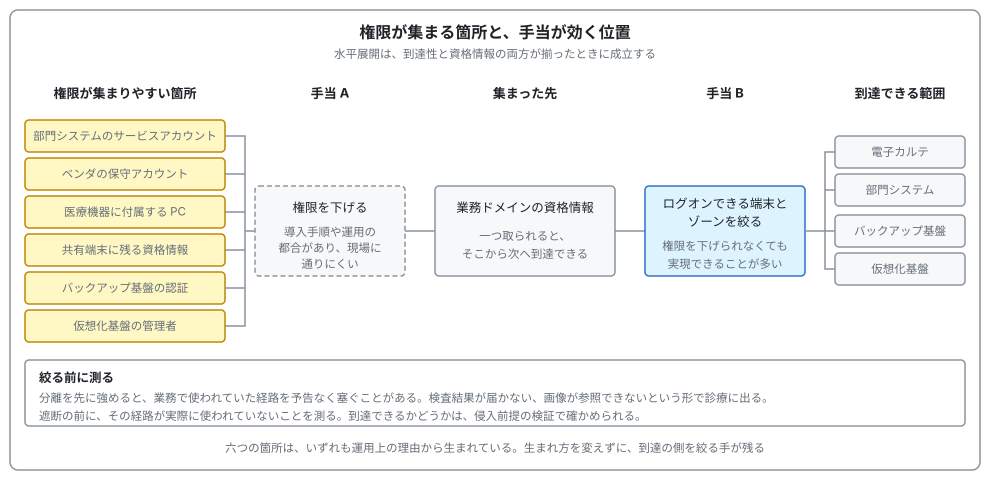
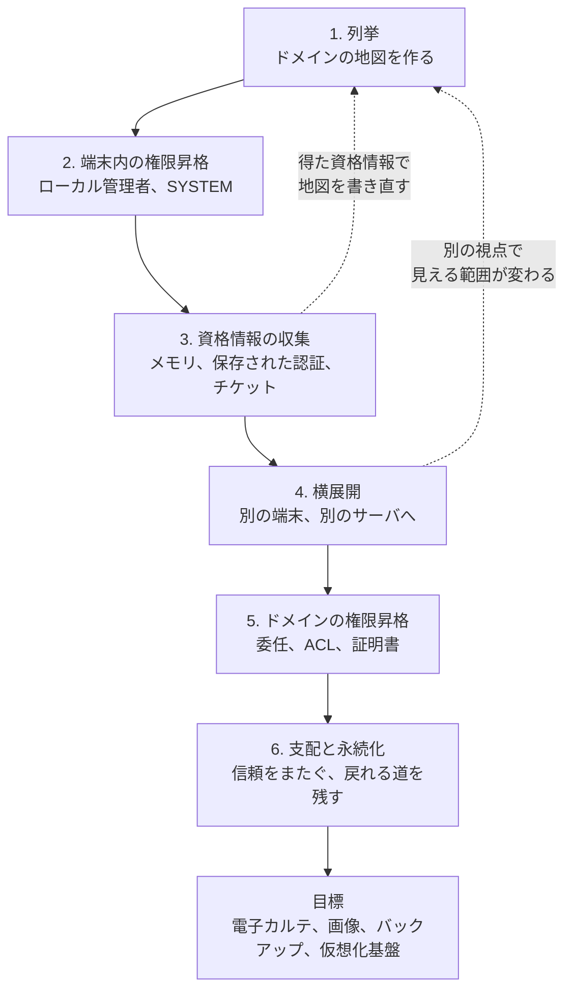
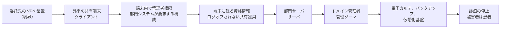
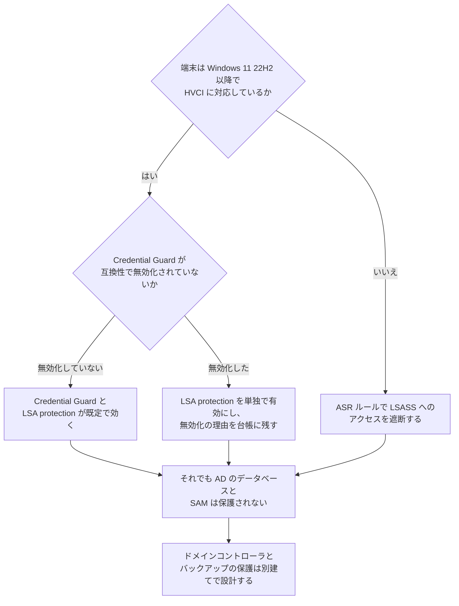
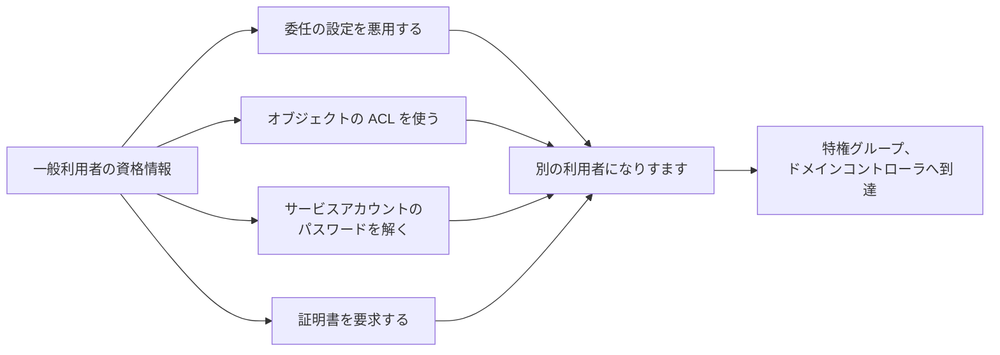
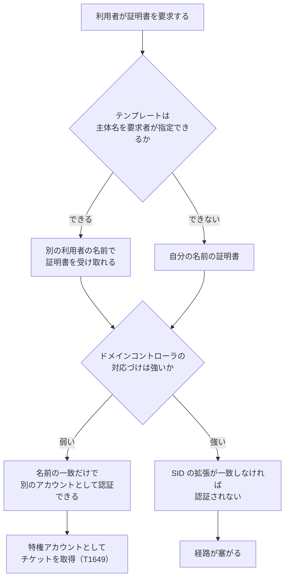
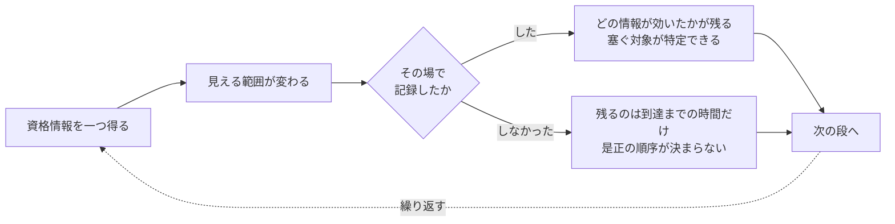
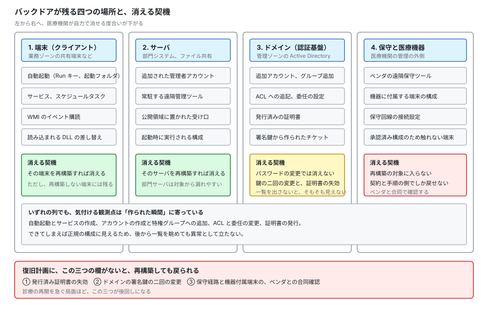
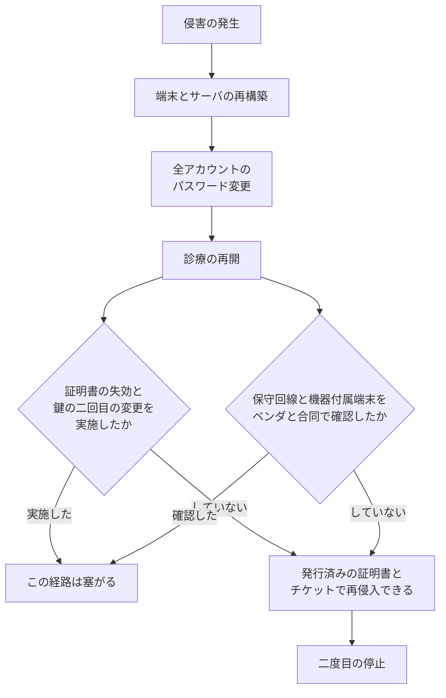
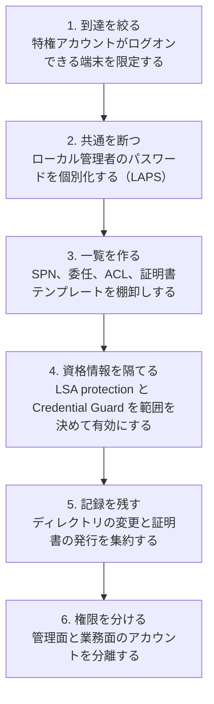

# 🏛️ Active Directory の攻撃面と、段階的な手当

医療機関の Active Directory は、患者情報を持たない。
そのため資産の重要度分類で優先度が下がりやすく、更新も後回しになる（[セキュリティの基礎](../../reference/security-basics.md)）。
一方で、電子カルテ、部門システム、バックアップ基盤、仮想化基盤のいずれもが、この一つの認証基盤に依存している。
[大阪急性期・総合医療センターの事例](../../threats/incidents/japan/2022-timeline.md#JP-2022-01)で、サーバ間で共通の ID とパスワードが横展開の決め手になったのは、この構造の帰結である。

本ページは、攻撃側が Active Directory を通るときの作業を段に分け（[2 節](#2-攻撃側の作業を六つの段に分ける)）、段ごとに、何を引くか、Windows 側にどの防御が用意されているか、医療機関で何が残りやすいかを対応づける。
段の説明に入る前に、起点がクライアントかサーバか、誰が攻撃者で誰が被害を受けるかを明示した攻撃シナリオを三つ置く（[2.1](#21-シナリオ-a外来の共有端末から電子カルテとバックアップへ) から [2.3](#23-シナリオ-c保守用の端末から証明書を経由した再侵入の確保)）。
侵害のあとに残されるバックドアと、復旧で消えないものは [10 節](#10-バックドアの仕込みと復旧で消えないもの)で扱う。
そのうえで、この領域を体系的に扱う演習環境として Windows Red Team Lab（CRTE）の範囲を一次情報で示し（[9 節](#9-windows-red-team-labcrteが扱う範囲)）、病院に当てはめたときの差と、先に効く手当の順序を並べる。

> [!NOTE]
> **表記ルール**：本ページでは、**事実**（一次情報で確認できる内容。出典を併記する）と、**分析**（筆者の解釈）を書き分ける。
>
> **第三者の記述の扱い**：認定機関が公表する内容と、受験者個人が書いた合格記や技術ブログを区別する。
> 後者を「事実」として書くのは、**その記述が存在すること**までである。
> 内容の正しさと、現在の試験や講座の運用が同じであることは保証されない。
> 実務に取り込む価値があるのは、複数の記述に共通して現れる作業の型のほうにある。

> [!WARNING]
> 本ページは、自組織に対する検証の設計と、防御の設計に使うことを想定している。
> 権限のない組織のドメインに対する列挙や検証は行わない。
> 記載する技法は、いずれも検知の観測点と緩和策を対にして書いている。
>
> 本ページの攻撃シナリオは、公表された調査報告書、公的な統計、ベンダの資料から組み立てた**想定**である。
> 実在する特定の医療機関の構成や、公表されていない被害を指すものではない。

---

## 1. ドメインが医療機関で占める位置

ドメインコントローラは、[ネットワークの分離](../segmentation.md#医療機関のゾーンモデル)で言う管理ゾーン（Z6）に属する。
そこから伸びる認証の依存は、業務ゾーンと機器ゾーンの両方に届く。

  

この図は[防御プレイブック](../../threats/actors/defense-playbook.md#医療機関の-active-directory-で権限が集まりやすい箇所)に置いたものである。
本ページは、この六つの箇所が実際にどう使われるかを、技法の側から展開する。

**分析**：医療機関のドメイン設計に現れる特徴は三つある。
第一に、部門ごとにベンダが異なるため、サービスアカウントの数が組織の規模に比して多い。
第二に、共有端末が多く、一つの端末に複数の職員の痕跡が残る。
第三に、24 時間の運用のため、業務時間外という概念で異常を切り分けられない。
三つとも、[11 節](#11-段ごとの観測点と医療の正常系)で検知の条件を書くときに効いてくる。

---

## 2. 攻撃側の作業を六つの段に分ける

侵入後の作業は、環境が Active Directory である限り、ほぼ同じ順序を取る。
各段の目的と、その段で得られるものを並べる。

**分析**：この図で効いてくるのは、点線の戻り矢印である。
段は一方向に進むのではなく、資格情報を一つ得るたびに 1 に戻り、見える範囲が変わる。
検証を発注する側がこれを知らないと、「何時間で到達したか」という一つの数字だけを受け取り、途中でどの情報が効いたかを取り逃す。
どの資格情報を得た時点で地図が変わったかを報告書に書かせると、優先して塞ぐ対象が特定できる。

### 2.1 シナリオ A：外来の共有端末から、電子カルテとバックアップへ

| 欄 | 内容 |
|---|---|
| **起点の Windows** | **クライアント**。外来の共有端末（業務ゾーン） |
| **攻撃者** | 外部の攻撃者。委託先の保守用 VPN 装置から侵入し、業務ゾーンに足場を得ている |
| **直接の被害者** | その端末を使う職員。本人の資格情報が、本人の意図と無関係に使われる |
| **到達点の Windows** | **サーバ**。ドメインコントローラ、電子カルテのサーバ、バックアップ基盤（管理ゾーン） |
| **最終的な被害者** | 患者。診療が止まり、過去の記録を参照できなくなる |
| **リスクの形** | 外来と手術の停止、救急の受け入れ停止、転院搬送、要配慮個人情報の流出 |

**成立の条件**：共有端末の利用者がローカル管理者に属していること、ログオフされずに複数人の資格情報が端末に残ること、その資格情報が部門サーバでも通ること。
**先に崩す条件**：三つのうち最も安く崩せるのは三番目である。
ローカル管理者のパスワードを端末ごとに個別化すれば（[5.3](#53-ローカル管理者の共通化を断つ)）、一台からの資格情報が他台で通らなくなる。
**気付ける観測点**：端末から端末への管理系ポートの接続、短時間に複数のサーバへ成功する同一アカウントのログオン。

### 2.2 シナリオ B：部門システムのサービスアカウントから、同じベンダの全サーバへ

| 欄 | 内容 |
|---|---|
| **起点の Windows** | **サーバ**。部門システム（検査、給食、物流など）のアプリケーションサーバ |
| **攻撃者** | 外部の攻撃者。フィッシングで職員の一般アカウントを得ている |
| **直接の被害者** | 部門システムを運用するベンダと、その部門の職員 |
| **到達点の Windows** | **サーバ**。同じサービスアカウントで動く、同一ベンダの全サーバ |
| **最終的な被害者** | 患者。検査結果の参照不能、給食と物流の停止 |
| **リスクの形** | 部門業務の停止、データの改ざん（[完全性への攻撃と患者安全](../../threats/integrity-attacks.md)）、そこを踏み台にした業務ゾーンへの展開 |

**分析**：この経路は、ドメイン管理者を取らずに成立する。
一般利用者の権限で SPN の一覧を引き、10 年変更されていないサービスアカウントのパスワードを解けば、そのアカウントが管理者として動いている全サーバに届く（[6.3](#63-サービスアカウントとパスワード)）。
被害の範囲は「そのベンダが納入したサーバ全部」になり、医療機関の部門の境界とは一致しない。

**気付ける観測点**：弱い暗号種別での大量のチケット要求と、サービスアカウントによる対話的なログオン。
後者は、サービスアカウントの本来の用途に含まれないため、条件として書きやすい。

### 2.3 シナリオ C：保守用の端末から、証明書を経由した再侵入の確保

| 欄 | 内容 |
|---|---|
| **起点の Windows** | **クライアント**。装置ベンダが持ち込む保守用の端末、または保守用の踏み台 |
| **攻撃者** | 外部の攻撃者。ベンダ側の環境を侵害し、保守回線を経由して院内に入っている |
| **直接の被害者** | 医療機関と装置ベンダの双方。どちらの管理台帳にも載らない経路が使われる |
| **到達点の Windows** | **サーバ**。認証局と、ドメインコントローラ |
| **最終的な被害者** | 患者。侵害が長期化し、復旧後も再侵入される |
| **リスクの形** | 資格情報を全面的に変更しても、発行済みの証明書で戻られる（[10 節](#10-バックドアの仕込みと復旧で消えないもの)） |

**分析**：三つのシナリオのうち、医療機関が最も気付きにくいのがこれである。
保守回線は台帳になく、保守用のアカウントは正規の作業でも使われ、証明書の発行は業務として行われる。
異常として立つのは、**発行の記録を取っている場合に限られる**（[7.2](#72-医療機関で確認する順序)）。

---

## 3. 列挙で何が見えるか

### 3.1 認証された利用者が引ける範囲

Active Directory は、業務のために、認証された利用者が広い範囲を読める設計になっている。
このため、一般利用者の資格情報が一つあれば、次の情報が取得できる。

| 引くもの | 攻撃側での使い道 | 医療機関で現れやすい形 |
|---|---|---|
| 利用者、グループ、組織単位（[T1087.002](https://attack.mitre.org/techniques/T1087/002/)、[T1069.002](https://attack.mitre.org/techniques/T1069/002/)） | 標的の選定、特権グループの特定 | 診療科と職種が組織単位に反映され、常勤と非常勤、委託の区別が名前から読める |
| コンピュータアカウント（[T1018](https://attack.mitre.org/techniques/T1018/)） | 到達先の一覧、OS の版の把握 | 機器名に装置の型番が入り、機器ゾーンの構成が推測できる |
| SPN（サービスプリンシパル名） | Kerberoasting の対象選定 | 部門システムのサービスアカウントが並ぶ |
| 委任の設定 | ドメイン権限昇格の経路 | 古い部門システムで制約なし委任が残る |
| オブジェクトの ACL | 権限を書き換えられる経路 | ベンダ作業のために付与された権限が残る |
| GPO とその適用先 | 配布経路の把握 | 部門ごとに例外の GPO が積み上がる |
| 証明書テンプレート | AD CS の悪用経路（[7 節](#7-証明書サービスad-cs)） | 導入時のテンプレートがそのまま残る |
| ドメインの信頼関係（[T1482](https://attack.mitre.org/techniques/T1482/)） | 別法人、別施設への経路 | 大学病院と附属施設、法人統合の名残 |

**分析**：この一覧のうち、医療機関で特に価値が高いのは 1 行目である。
医師名と診療科は学会発表や外来担当表として公開されており、ドメインから引いた一覧と突き合わせると、役職と権限の対応が推測できる（[医療機関に対する OSINT](../../practice/osint.md)）。
外から集めた情報と内から引いた情報が突き合わされる点が、医療の特徴になる。

### 3.2 列挙そのものを検知の対象にできるか

**分析**：列挙は正規の問い合わせで成立するため、単発では異常にならない。
条件にできるのは、量と幅である。
一つのアカウントが短時間に組織全体の利用者とコンピュータを網羅的に引く形は、業務では資産管理ツールと人事連携のバッチにしか現れない。
その二つを台帳として持っていれば、残りを異常として切り出せる（[検知の設計](../detection-engineering.md)）。

**分析**：検証を行う側から見ると、この検知の有無は最初の分岐になる。
網羅的な列挙で警告が上がる環境では、対象を絞った問い合わせに切り替える必要があり、作業時間が変わる。
検証の報告書には「どの列挙で気付かれたか」を残す。
気付かれなかった場合、それは攻撃側の技量ではなく、防御側の観測点の欠落を示している。

---

## 4. 端末の中で権限を上げる

ドメインの話に入る前に、攻撃側は足場の端末で管理者権限を取る。
ここで使われるのは、脆弱性より設定と配置の問題であることが多い。

| 経路 | 成立の条件 | 医療機関で残りやすい理由 |
|---|---|---|
| サービスの実行ファイルへの書き込み権限（[T1543.003](https://attack.mitre.org/techniques/T1543/003/)） | 部門システムが `Program Files` 以外にインストールされ、一般利用者が書き込める | ベンダのインストーラが独自の場所に置く |
| DLL の探索順序（[T1574.001](https://attack.mitre.org/techniques/T1574/001/)） | 書き込める場所に、読み込まれる名前の DLL を置ける | [Windows アプリケーションのセキュリティ](app-security.md#3-配置と権限で決まる権限昇格) に展開する |
| 引用されないサービスのパス（[T1574.009](https://attack.mitre.org/techniques/T1574/009/)） | パスに空白があり、途中に書き込める | 古い部門システムの導入時設定 |
| 保存された資格情報 | 手順書、バッチ、スケジュールタスクに平文で残る | 夜間バッチの運用が属人化している |
| 昇格の迂回（[T1548.002](https://attack.mitre.org/techniques/T1548/002/)） | 利用者がローカル管理者に属している | 部門システムの動作要件として管理者権限が求められる |

**分析**：最終行が医療で最も多い。
「この部門システムは管理者権限でないと動かない」という要件は、ベンダの検証環境がそうだったというだけの場合がある。
検証の所見として価値が高いのは、その要件が実際に必要かどうかを、ベンダに文書で確認させる指摘である。
権限を下げられれば、この段が一つ消える。

**検知の観測点**：新しいサービスの作成、書き込み可能な場所からの実行ファイルの起動、管理者グループへの追加。
**医療の正常系**：システム更改時の一括インストール、ベンダ保守での一時的な権限付与。
台帳と突き合わせ、作業計画にない実施だけを条件にする。

---

## 5. 資格情報をどう守り、どう破られるか

### 5.1 Windows 側に用意されている三つの手当

**事実**：Credential Guard は、NTLM のパスワードハッシュ、Kerberos のチケット認可チケット（TGT）、およびアプリケーションがドメインの資格情報として保存した情報を保護する。
仮想化ベースのセキュリティ（VBS）で秘密を隔離し、管理者権限で動くマルウェアであっても VBS が保護する秘密を取り出せないとされている。
Windows 11 22H2 および Windows Server 2025 以降、ハードウェア要件を満たすドメイン参加の非ドメインコントローラでは既定で有効になる。
出典：[Credential Guard overview](https://learn.microsoft.com/en-us/windows/security/identity-protection/credential-guard/)（Microsoft）

**事実**：同じ資料は、Credential Guard が Active Directory のデータベースとセキュリティアカウントマネージャ（SAM）を保護しないこと、およびドメインコントローラでの有効化は推奨されないことを明記している。
また、Kerberos の制約なし委任、TGT の抽出、NTLMv1、DES を必要とするアプリケーションは動作しなくなる。
出典：同上

**事実**：LSA protection（`RunAsPPL`）は、保護されていないプロセスが LSA のメモリを読むこととコードを注入することを防ぐ。
Windows 11 22H2 以降の新規インストールで、企業に参加しており HVCI に対応した端末では、既定で有効になる。
UEFI ロックを併用した場合、レジストリからの無効化は効かなくなる。
出典：[Configure added LSA protection](https://learn.microsoft.com/en-us/windows-server/security/credentials-protection-and-management/configuring-additional-lsa-protection)（Microsoft）

**事実**：攻撃面の削減（ASR）ルールのうち「Block credential stealing from the Windows local security authority subsystem」は、LSASS のプロセスメモリへのアクセスを遮断する。
Microsoft は、LSA protection または Credential Guard を有効にしている場合、このルールは不要であり追加の保護を与えないとしている。
逆に、カスタムのスマートカードドライバなどの互換性の問題で Credential Guard を有効にできない組織向けの代替として位置づけられている。
出典：[ASR rules reference](https://learn.microsoft.com/en-us/defender-endpoint/attack-surface-reduction-rules-reference)（Microsoft）

**分析**：この分岐で医療機関が止まりやすいのは、二つ目の問いである。
医療機器の管理ソフトや、電子カルテのカード認証がスマートカードのドライバを LSA に読み込ませる構成の場合、Credential Guard の有効化で動かなくなることがある。
そのときに取る手は「諦める」ではなく、無効化した端末の範囲を台帳に載せ、その範囲に ASR ルールと LSA protection を当て、ログオンできる相手を絞ることになる。

### 5.2 資格情報が保護されていても残る経路

**分析**：Credential Guard が守るのはメモリ上の秘密であり、次の三つはその外側に残る。

| 残る経路 | 内容 | 医療機関での形 |
|---|---|---|
| ディスクに保存された資格情報 | 手順書、スクリプト、アプリケーションの設定ファイル | 夜間バッチと連携処理の設定 |
| Kerberos のチケットの再利用（[T1550.003](https://attack.mitre.org/techniques/T1550/003/)） | ログオン中の利用者のチケットを使う | 共有端末に複数の職員がログオンしたまま残る |
| ドメインコントローラ上のデータベース | `NTDS.dit` とバックアップ | 復旧演習用のバックアップが業務ゾーンに置かれる |

**分析**：三行目が最も影響が大きい。
ドメインコントローラのバックアップは、それ自体がドメイン全体の資格情報を含む。
バックアップの保管場所が業務ゾーンのファイル共有にある構成は、Credential Guard を有効にしても意味を持たない（[サイバー BCP](../../response/bcp-cyber.md)）。

### 5.3 ローカル管理者の共通化を断つ

**事実**：Windows LAPS は、Active Directory または Microsoft Entra ID に参加した端末のローカル管理者アカウントのパスワードを自動で管理し、バックアップする機能である。
Microsoft は、その利点として pass-the-hash と水平移動への対策を挙げている。
2023 年 4 月 11 日の更新以降の Windows 10、Windows 11、Windows Server 2019 以降に組み込まれており、旧来の Microsoft LAPS 製品は Windows 11 23H2 以降で非推奨とされた。
出典：[Windows LAPS overview](https://learn.microsoft.com/en-us/windows-server/identity/laps/laps-overview)（Microsoft）

**分析**：医療機関で LAPS の導入が止まる理由は、技術ではなく運用にある。
装置ベンダの保守手順書に、共通のローカル管理者アカウントとパスワードが書かれている場合、個別化するとベンダの作業が止まる。
先に必要なのは、保守作業でどのアカウントを使うかをベンダごとに棚卸しし、契約と手順書の側を書き換えることである（[認証とアクセス管理](../identity.md)）。

---

## 6. ドメインの権限を上げる四つの経路

端末の中で管理者になっただけでは、ドメイン全体には届かない。
ここから先で使われるのは、脆弱性ではなく**設計の意図どおりに動く機能**である。
そのため更新では塞がらず、設定を変えるしかない。

### 6.1 委任

Kerberos の委任は、利用者に代わってサービスが別のサービスへ認証する仕組みである。
医療機関では、電子カルテのフロントエンドが部門システムへ利用者の権限で問い合わせる構成などで使われる。

| 種類 | 何ができるか | 危険度が高い理由 |
|---|---|---|
| **制約なし委任** | 委任先のサーバが、接続してきた利用者の TGT をそのまま保持する | そのサーバを取れば、そこに接続した全員の権限を得られる。管理者が一度でも接続すれば決まる |
| **制約付き委任** | 指定したサービスに限って、利用者になりすませる | 指定先が広いと実質的に制約にならない |
| **リソースベースの制約付き委任** | 委任を受ける側のオブジェクトに設定を書く | オブジェクトへの書き込み権限が、そのまま委任の設定権限になる |

**分析**：医療機関で制約なし委任が残るのは、導入年の古い部門システムに集中する。
設定した理由が記録に残っていないため、外すと何が止まるか分からず、そのまま残る。
検証の所見としては「制約なし委任が設定されたホストの一覧」と「そのホストに管理者アカウントが接続した記録の有無」を対にして出すと、判断が進む。

**手当**：特権アカウントを **Protected Users** グループに入れるか、アカウントの属性で「機密で委任できない」を設定する。

**事実**：ドメインの機能レベルが Windows Server 2012 R2 以上の場合、Protected Users グループのメンバーは、NTLM 認証を使えず、Kerberos の事前認証で DES と RC4 を使えず、制約なし委任と制約付き委任のどちらでも委任されなくなり、TGT の有効期間が 4 時間に固定される。
サービスとコンピュータのアカウントはこのグループのメンバーにできない。
出典：[Guidance about how to configure protected accounts](https://learn.microsoft.com/en-us/windows-server/identity/ad-ds/manage/how-to-configure-protected-accounts)（Microsoft）

> [!WARNING]
> **事実**：同じ資料は、この認証の制限に回避手段がなく、Enterprise Admins や Domain Admins のような高い権限を持つグループのメンバー全員を Protected Users に入れると、それらのアカウントがすべてロックアウトされうると警告している。
> 影響を検証するまで、高い権限のアカウントを一括で追加しない。

**分析**：医療機関でこの警告が現実になりやすいのは、NTLM でしか認証できない古い部門システムが残っているためである。
先に、どのシステムが NTLM を使っているかを認証基盤のログから測る（[ログと監視の設計](../logging.md)）。
測ってから入れる順序を守れば、深夜に管理者が締め出される事態を避けられる。

### 6.2 ACL

Active Directory のオブジェクトには、細かい権限が個別に設定できる。
運用のなかで付与された権限が、権限昇格の経路として残る。

| 残る形 | 何が起きるか |
|---|---|
| ベンダ作業のために付与した、利用者オブジェクトへの書き込み権限 | パスワードの再設定、委任設定の追加ができる |
| ヘルプデスク用のグループに付いた、グループへの書き込み権限 | 自分を特権グループに追加できる |
| 古い運用で付いた、GPO の編集権限（[T1484.001](https://attack.mitre.org/techniques/T1484/001/)） | 適用先の全端末でコードを実行できる |
| LAPS のパスワードを読む権限 | 対象範囲のローカル管理者のパスワードを取得できる |

**分析**：ACL の問題は、一覧を出さない限り誰も気付かないという性質を持つ。
権限は個別に付与され、付与した担当者は異動し、監査は「特権グループのメンバー」しか見ない。
そのため、特権グループに一人も余分がいない組織でも、ACL 経由で特権に到達する経路が残る。
検証で最も所見の価値が高い箇所の一つになる。

**検知の観測点**：オブジェクトの ACL の変更、GPO の変更、LAPS のパスワード読み取り。
**医療の正常系**：システム更改時の一括変更、ベンダ保守での一時的な付与。
条件は「変更そのもの」ではなく「作業計画と対応しない変更」にする。

### 6.3 サービスアカウントとパスワード

**事実**：Kerberoasting は、SPN が設定されたアカウントのサービスチケットを要求し、そのアカウントのパスワードから導かれた鍵で暗号化された部分をオフラインで解く技法である。
出典：[Steal or Forge Kerberos Tickets: Kerberoasting（T1558.003）](https://attack.mitre.org/techniques/T1558/003/)（MITRE ATT&CK）

**分析**：医療機関でこの技法が通りやすい条件は二つある。
部門システムのサービスアカウントの数が多いことと、そのパスワードが導入時に設定されて以降変更されていないことである。
導入から 10 年が経過したアカウントは、当時の桁数と文字種の要件で作られている。

**手当**：グループの管理されたサービスアカウント（gMSA）に置き換える。
gMSA はパスワードを自動で生成し、定期的に更新するため、解く対象がなくなる。
置き換えられない場合は、SPN が設定されたアカウントの一覧を作り、桁数を上げる対象として管理する。

**検知の観測点**：弱い暗号種別での大量のチケット要求。
**医療の正常系**：互換設定を要求する古い部門システムが、平時から同じ種別で要求している（[検知の設計](../detection-engineering.md#技法と観測点と医療の正常系)）。
平時の分布を測らないと、この条件は通知に接続できない。

---

## 7. 証明書サービス（AD CS）

### 7.1 なぜ証明書が権限昇格になるのか

証明書による認証は、証明書に書かれた主体が Active Directory のどのアカウントに対応するかを、ドメインコントローラが判定して成立する。
この対応づけが緩い場合、低い権限の利用者が、別の利用者として認証できる証明書を正規の手続きで受け取れる。
対応づけを厳しくする側は、本節の後半で示す更新（KB5014754）によって強制されるようになった。
一方で、どのテンプレートで誰に何を発行するかは、各組織の設定に残る。
本節が確認の対象にするのは、この設定の側である。

**事実**：SpecterOps は 2021 年 6 月に、Active Directory 証明書サービスの設定不備を体系的に整理した資料を公開し、証明書の窃取、アカウントの永続化、ドメインの権限昇格、ドメインの永続化に分類したうえで、権限昇格の類型に ESC1 から ESC8 の識別子を与えた。
出典：[Certified Pre-Owned](https://specterops.io/blog/2021/06/17/certified-pre-owned/)（SpecterOps）、[whitepaper（PDF）](https://specterops.io/wp-content/uploads/sites/3/2022/06/Certified_Pre-Owned.pdf)

**事実**：Microsoft は、Kerberos の鍵配布センターが証明書ベースの認証要求を処理する際の権限昇格の脆弱性として、CVE-2022-26923、CVE-2022-34691、CVE-2022-26931 に対応する更新を提供した。
更新後のエンタープライズ認証局は、発行する証明書に、要求元のセキュリティ識別子を含む拡張（オブジェクト識別子 `1.3.6.1.4.1.311.25.2`）を付与する。
強い対応づけとして `X509IssuerSerialNumber`、`X509SKI`、`X509SHA1PublicKey` が挙げられている。
2025 年 2 月 11 日に、レジストリキーで構成していない環境が自動的に強制モードへ移行し、2025 年 9 月 9 日にレジストリキーによる猶予の設定そのものが終了した。
出典：[KB5014754: Certificate-based authentication changes on Windows domain controllers](https://support.microsoft.com/en-us/topic/kb5014754-certificate-based-authentication-changes-on-windows-domain-controllers-ad2c23b0-15d8-4340-a468-4d4f3b188f16)（Microsoft）

### 7.2 医療機関で確認する順序

**分析**：医療機関で AD CS が導入されている場合、目的はほぼ二つに限られる。
無線 LAN の端末認証と、電子カルテのクライアント証明書である。
どちらも導入時にテンプレートを作って以降、見直されないことが多い。

確認は次の順で進むと、影響を出さずに済む。

1. 認証局が存在するか、何のために立てたかを台帳で確認する
2. 発行されているテンプレートを一覧にし、要求者が主体名を指定できる設定を洗う
3. 登録の権限が、どのグループに与えられているかを確認する
4. ドメインコントローラの対応づけが強い設定になっているかを確認する
5. 監査ログで、証明書の発行記録を残す設定になっているかを確認する

**検知の観測点**：証明書の発行記録、要求者と主体名が一致しない発行、証明書による認証の急増。
**医療の正常系**：端末の入れ替え時期に、無線 LAN 用の証明書がまとまって発行される。
発行の記録を取っていない環境では、この条件自体が書けない。

---

## 8. 信頼をまたぐ経路

医療機関のドメインは、一法人で閉じないことがある。
大学病院と附属施設、法人統合の名残、研究部門の別ドメイン、健診センターの分離といった構成が現れる。

| 経路 | 成立する条件 |
|---|---|
| 信頼関係を持つドメイン間での資格情報の再利用 | 双方向の信頼があり、両側で同じ利用者が権限を持つ |
| SID の履歴（`SIDHistory`） | 移行の名残として、旧ドメインの SID がアカウントに残っている |
| データベースのリンク | SQL Server 同士がリンクで接続され、権限が引き継がれる |
| クラウドとの同期 | オンプレミスの資格情報が、クラウド側の権限に対応づけられている |

**事実**：利用者オブジェクトが別のドメインへ移動すると、新しい SID が発行され、以前の SID は `SIDHistory` 属性に保存される。
利用者がサインインすると、現在の SID、過去の SID、所属グループの SID がすべてアクセストークンに含まれ、`SIDHistory` にある SID でもリソースへの許可または拒否が働く。
出典：[Security Identifiers](https://learn.microsoft.com/en-us/windows-server/identity/ad-ds/manage/understand-security-identifiers)（Microsoft）

**分析**：この仕様は移行のために用意されたものだが、移行が終わったあとに `SIDHistory` を消していない組織では、旧ドメインの権限が現在も有効なまま残る。
法人統合を経た医療機関で確認する価値が高い。
確認は読み取りだけで済み、業務への影響がない。

---

## 9. Windows Red Team Lab（CRTE）が扱う範囲

この領域を体系的に練習する環境として、複数のドメインとフォレストで構成された演習ラボが提供されている。
到達点の一覧としても読めるため、範囲を一次情報で示す。

### 9.1 演習ラボが公表している範囲

**事実**：Altered Security の Windows Red Team Lab は、Certified Red Team Expert（CRTE）の認定に対応する。
同社は、演習環境が完全にパッチを適用した Windows のインフラであり、複数のドメインとフォレストを含むと記載している。
認定試験は 48 時間の実技で、個別の Active Directory 環境が与えられ、課題の詳細な解法と実務的な緩和策を提出することが求められる。
出典：[CRTE Certification: Enterprise Active Directory Red Team](https://www.alteredsecurity.com/redteamlab)（Altered Security）

**事実**：同ページが挙げる学習目標には、次の項目が含まれる。

| 区分 | 挙げられている内容 |
|---|---|
| 列挙 | スクリプトをメモリ上に読み込む手法、PowerShell の防御機構の迂回、Microsoft Defender for Identity（MDI）の検知を避ける列挙の運用 |
| 端末内の権限昇格 | Windows の特権を用いた昇格、リークしたハンドルの悪用による SYSTEM の取得 |
| ドメインの権限昇格 | ACL を悪用した LAPS からの資格情報の取得、gMSA のパスワードのオフライン生成、Kerberos の委任設定の悪用、dMSA の悪用 |
| 横展開 | 運用上の秘匿（OPSEC）を意識した遠隔アクセス、COM オブジェクトの悪用による EDR の迂回、Credential Guard が有効な環境での資格情報の取得 |
| 支配と永続化 | ダイヤモンドチケットの利用と秘匿上の注意点、ドメインの DPAPI バックアップ鍵と KDS のルート鍵の悪用、Shadow Credentials によるアカウントの乗っ取り |
| ドメインとフォレストをまたぐ攻撃 | KRBTGT のハッシュと信頼鍵の悪用、AD CS の設定不備の悪用、`SIDHistory` の悪用、SQL Server のデータベースリンク、SID フィルタリングの迂回、Azure のハイブリッド ID の悪用 |
| 防御側の技術 | 特権管理ワークステーション、時間を区切った管理（JIT と JEA）、Tier モデルと ESAE、Credential Guard、WDAC、MDI、LAPS、Protected Users グループ |
| 検知と欺瞞 | 攻撃の検知手法と、その迂回、Active Directory への欺瞞の配置 |

出典：同上

**分析**：この一覧の並びが示すのは、攻撃側の演習が「侵入の手口」ではなく**列挙、昇格、横展開、永続化の運用**を中心に組まれているという点である。
本ページの [3 節](#3-列挙で何が見えるか)から [8 節](#8-信頼をまたぐ経路)までが、ほぼそのまま対応する。
医療機関の担当者がこの種の演習を経る価値は、**自分のドメインで同じ問いを立てられるようになる**点にある。
どのアカウントに SPN が付いているか、委任はどこに残っているか、ACL は誰に開いているか、証明書テンプレートは何を許しているか。
これらは、演習を経ていない担当者からは問いとして出てこない。

### 9.2 演習環境と医療機関の四つの差

**分析**：演習環境と医療機関の環境には四つの差がある。

| 差 | 演習環境 | 医療機関 |
|---|---|---|
| パッチの状態 | 完全に適用済みで、設定の不備だけが経路になる | 更新できない資産が混在し、既知の脆弱性がそのまま経路になる（[Hack The Box の型で病院を想定する](../../practice/pentest/htb-style-hospital.md)） |
| 到達の目的 | ドメインまたはフォレストの支配 | 診療が止まるかどうか。ドメインの支配は途中経過にすぎない |
| 触れてよい範囲 | すべて | 患者が接続された機器と、承認済み構成の端末には触れない |
| 失敗の代償 | 環境の再構築 | 診療の停止と、患者の安全 |

**分析**：三行目と四行目のため、演習で身についた手つきをそのまま持ち込むわけにはいかない。
医療機関での検証は、実施の可否を資産の性質で分岐させてから手法を決める（[検証と実務](../../practice/README.md#対象の性質と実施できる手法)）。

### 9.3 合格記に共通して現れる作業の型

認定の合格記は、講座の宣伝文には出てこない作業の実態を含む。
公開されている記述のうち、作業の進め方に触れた部分を取り出す。
技法そのものは講座の目次にあり、覚えれば済む。

**事実**：公開されている CRTE の合格記には、次の記述がある。

| 記述の内容 | 書いた人と時期 |
|---|---|
| 試験は侵入前提（Assumed Breach）で始まり、最初に与えられる端末から横展開する | Kyle Gray（2023 年 3 月 15 日） |
| 作業しながら報告書を書く（report as you go）。これが大きな違いを生む | 同上 |
| BloodHound を使うなら、試験の前にローカルへ用意する。収集器と本体の版が対応することを確認しておく | 同上 |
| BloodHound は優れているが、すべてを頼りきらない。手で見つけられる必要がある | 同上 |
| 収集したグラフのノードを読み落とすと、目の前にある経路を見逃して時間を失う | 同上 |
| 列挙を尽くす。48 時間あるので、食事、休憩、睡眠の時間を取る | 同上 |
| 報告書のテンプレートを、試験を始める前に用意しておく | 同上 |
| BloodHound は手元の端末で動かす。SQL Server を扱う道具に慣れておく | Stefano Lanaro（2024 年 4 月 16 日） |
| 詰まったら一度離れ、頭を切り替えてから戻る | 同上 |
| 報告書の冒頭に、背景、結果、推奨をまとめた要約を置いた | 同上 |

出典：[Certified Red Team Expert (CRTE) Review](https://www.misecurity.net/certified-red-team-expert-crte-review/)（Kyle Gray、MiSecurity、2023 年 3 月 15 日）、[Certified Red Team Expert (CRTE) Review](https://steflan-security.com/certified-red-team-expert-crte-review/)（Stefano Lanaro、2024 年 4 月 16 日）

**分析**：合格記が繰り返し書くのは、**記録、道具の準備、列挙の網羅、時間配分、報告書**という、そのまま診断の実務にあたる部分である。
医療機関の検証に置き換えると、次の対応になる。

| 合格記に現れる型 | 医療機関の検証で対応するもの |
|---|---|
| 侵入前提で始まる | 発注でも侵入前提型（Assumed Breach）が現実的になる。境界の突破に時間を使わず、内部の広がりを測れる（[用語を分ける](../../practice/pentest/README.md#1-用語を分ける)） |
| 作業しながら書く | 検証でも侵害調査でも、時系列は後から再構成できない。どの資格情報を得た時点で見える範囲が変わったかは、その場で書かなければ残らない（[2 節](#2-攻撃側の作業を六つの段に分ける)） |
| グラフの収集を事前に整える | ドメインコントローラへの網羅的な問い合わせは、負荷と記録の両方を伴う。実施の時間帯と、収集が残す痕跡を実施要領に書く |
| グラフに頼りきらない | 収集が許可されない環境、収集器が動かない古いドメインでは、手で引ける手順が要る |
| ノードを読み落とさない | 見落としは技量ではなく手順の問題として扱う。確認項目を表にして潰す（[3.1](#31-認証された利用者が引ける範囲)） |
| 休息と時間配分 | 医療機関の検証は夜間帯と休日に寄る。交代の体制がないと、最後の段の精度が落ちる |
| 報告書のテンプレート | 医療では宛先が経営層、情報システム部門、ベンダの三つに分かれる。同じ所見を三つの言葉で書く欄を先に作る |

**分析**：この図の分岐は、演習でも実務でも同じ位置に現れる。
医療機関にとっての損失は、記録がないと**塞ぐ順序を決められない**ことにある。
「12 時間で電子カルテに到達した」という結果だけでは、どの資格情報を先に個別化するかが決まらない。

### 9.4 参考にできる第三者の資料

いずれも第三者が運営する資料であり、医療固有の制約は書かれていない。
攻撃の手順として読むのではなく、**自組織で確認する項目の索引**として使うと、防御側でも役に立つ。

| 資料 | 提供元 | 防御側での使いみち |
|---|---|---|
| [The Hacker Recipes](https://www.thehacker.recipes/) | ShutdownRepo ほか | Active Directory の技法が体系立てて並ぶ。委任、証明書、チケットの各項が、確認項目の一覧になる |
| [Active Directory Security](https://adsecurity.org/) | Sean Metcalf | 攻撃と防御の双方を扱う解説。設定の既定値と、その変更が及ぼす範囲を確認できる |
| [HackTricks](https://hacktricks.wiki/en/index.html) | Carlos Polop ほか | 網羅性が高い手順集。自組織で塞げているかを一件ずつ確認する用途に向く |
| [BloodHound Documentation](https://bloodhound.specterops.io/) | SpecterOps | グラフが示すエッジの意味を確認する。防御側が自組織の到達経路を棚卸しする用途にも使える |
| [LOLBAS](https://lolbas-project.github.io/) | LOLBAS Project | 正規の Windows バイナリが悪用される形の索引。検知条件を「名前」ではなく「位置と親子関係」で書くための材料になる |
| [Atomic Red Team](https://github.com/redcanaryco/atomic-red-team) | Red Canary | 技法を単体で再現し、検知が働くかを確かめる。実施は隔離環境に限る |

> [!WARNING]
> 上表の資料には、そのまま実行できる手順が含まれる。
> 自組織または書面で許可を得た対象以外に対して実行しない。
> [Atomic Red Team](https://github.com/redcanaryco/atomic-red-team) のように技法を実行する道具は、稼働中の医療情報システムでは使わず、隔離した環境で行う（[ツール](../../reference/resources/tools.md#対象への影響による三段階)の三段階では侵襲にあたる）。

---

## 10. バックドアの仕込みと、復旧で消えないもの

支配に至った攻撃側は、資格情報を変更されても追い出されないよう、戻れる道を残す。
本節でいう**バックドア**は、専用のマルウェアだけを指さない。
正規の機能で作られた、攻撃側だけが知っている再侵入の口を含む。
医療機関でこれが重い問題になるのは、診療の再開を急ぐ復旧では、**消し残しがそのまま次の侵害の起点**になるためである。

### 10.1 どこに、何が残るか

  

| 残る場所 | 代表的な形 | 消える契機 | 医療機関で消し残す理由 |
|---|---|---|---|
| **端末**（クライアント） | 自動起動（[T1547.001](https://attack.mitre.org/techniques/T1547/001/)）、サービス（[T1543.003](https://attack.mitre.org/techniques/T1543/003/)）、スケジュールタスク、WMI のイベント購読、読み込まれる DLL の差し替え（[T1574.001](https://attack.mitre.org/techniques/T1574/001/)） | その端末の再構築 | 台数が多く、業務の再開を優先して再構築の対象から外れる端末が出る |
| **サーバ** | 追加された管理者アカウント、常駐する遠隔管理ツール、公開領域に置かれた受け口、起動時に実行される構成 | そのサーバの再構築 | 部門サーバはベンダの作業を待つため、後回しになる |
| **ドメイン**（認証基盤） | 追加アカウントとグループへの追加（[T1136.002](https://attack.mitre.org/techniques/T1136/002/)）、ACL への追記と委任の設定、発行済みの証明書（[T1649](https://attack.mitre.org/techniques/T1649/)）、署名鍵から作られたチケット | 鍵の二回の変更と、証明書の失効 | パスワードを全部変えたことで、終わったと判断される |
| **保守と医療機器** | ベンダの遠隔保守ツール、機器に付属する端末の構成、保守回線の接続設定 | 医療機関の再構築の対象外 | 台帳になく、構成を変える権限が医療機関にない |

**分析**：右へ行くほど、医療機関が自力で消せなくなる。
そして、右へ行くほど**気付きにくい形をしている**。
端末の自動起動は端末を再構築すれば消えるが、発行済みの証明書は、失効させるという判断を誰かが下さない限り残り続ける。

### 10.2 正規のツールを使った仕込み

**分析**：医療機関で見分けが難しいのは、攻撃側が持ち込む道具が、業務でも使われる正規の製品である場合である。
遠隔サポートのツール、資産管理のエージェント、リモートデスクトップの公開は、いずれも保守の現場で正規に使われている。
攻撃側がこれを追加でインストールしても、一覧の上では他の保守用ツールと並んで見える。

**事実**：CISA、FBI、HHS、MS-ISAC が 2025 年 7 月 22 日に公開した Interlock ランサムウェアの共同アドバイザリは、攻撃者が遠隔アクセスと永続化のために AnyDesk のような正規のリモート監視と管理のツールを利用したこと、および PowerShell でスタートアップフォルダへのファイル配置と、`Chrome Updater` という名前でのレジストリの Run キーへの値の追加を行ったことを記載している。
また、資格情報へのアクセスと横展開について、資格情報窃取ツールとキーロガーの導入、窃取した資格情報とリモートデスクトップによる移動、Kerberoasting によるドメイン管理者アカウントの侵害の可能性を記載している。
出典：[#StopRansomware: Interlock（AA25-203A）](https://www.cisa.gov/news-events/cybersecurity-advisories/aa25-203a)（CISA）

**分析**：条件に置けるのは、製品の名前ではなく**台帳との差分**である。
「業務で使っている遠隔操作ツールの一覧」を持っていれば、それ以外の製品の実行と通信が異常として立つ。
一覧がなければ、同じ事象は「保守で入れたのだろう」で流れる（[防御プレイブック](../../threats/actors/defense-playbook.md)）。

**分析**：このアドバイザリに医療分野の担当機関（HHS）が加わっていること自体が、対象の指定にあたる。
記載された手口は、本ページで扱った段のうち 3 段目から 5 段目に対応しており、特別な技法は含まれていない。
防御の側で先に埋めるべき箇所も、そこから動かない。

### 10.3 シナリオ D：復旧したはずの環境に、戻られる

| 欄 | 内容 |
|---|---|
| **起点の Windows** | **サーバ**。侵害中に攻撃側がドメインコントローラまで到達している |
| **攻撃者** | 同一の攻撃者、またはその足場を買った別の攻撃者 |
| **医療機関が実施したこと** | 端末とサーバの再構築、全アカウントのパスワード変更、診療の再開 |
| **消し残したもの** | 発行済みの証明書、署名鍵の一回だけの変更、ベンダの保守回線 |
| **最終的な被害者** | 患者。二度目の停止が、復旧直後に起きる |
| **リスクの形** | 復旧費用の二重化、再開した診療の再停止、対外的な信頼の毀損 |

**分析**：この図の分岐は、技術ではなく**復旧計画の記載事項**で決まる。
再構築とパスワード変更は、どの復旧計画にも書かれている。
証明書の失効、署名鍵の二回の変更、保守経路の合同確認は、書かれていなければ実施されない。
三つとも、実施には時間がかかり、診療の再開を急ぐ局面では後回しになりやすい（[サイバー BCP](../../response/bcp-cyber.md)、[基盤の構えと外部依存](../../response/dependencies.md)）。

### 10.4 仕込みに気付ける位置

| 仕込まれるもの | 観測できる場所 | 条件にできるもの | 医療の正常系 |
|---|---|---|---|
| 自動起動、サービス、スケジュールタスク | サーバ OS の監査、EDR | 作成と登録の記録 | 更改時の一括インストール、ベンダ保守 |
| WMI のイベント購読 | EDR、ASR ルールの記録 | 購読の作成 | 資産管理製品が使う場合がある |
| 追加アカウントと特権グループへの追加 | 認証基盤 | 作成と追加の記録 | 職員の異動、ベンダの保守用アカウント |
| ACL と委任の変更 | ディレクトリの変更記録 | 変更の記録 | 更改時の一括変更 |
| 証明書の発行 | 認証局の発行記録 | 要求者と主体名が一致しない発行 | 端末入れ替え時期の一括発行 |
| 遠隔管理ツールの導入 | EDR、プロキシとファイアウォール | 台帳にない製品の実行と通信 | 保守で使う正規の製品 |

**分析**：どの行も、**作られた瞬間にしか異常として立たない**という共通点を持つ。
できあがったあとは、正規に作られた構成と区別が付かない。
このため、これらの記録を残していない環境では、侵害の調査で「いつ、誰が作ったか」を答えられず、消し残しの有無も確定できない（[ログと監視の設計](../logging.md)）。

---

## 11. 段ごとの観測点と、医療の正常系

検知の条件は、技法だけでは書けない。
その組織の台帳と突き合わせて初めて絞れる（[検知の設計を技法単位に落とす](../detection-engineering.md)）。

| 段 | 観測点 | 条件にできるもの | 医療で正常系に現れる形 |
|---|---|---|---|
| 列挙 | 認証基盤の問い合わせ | 一つのアカウントによる網羅的な照会 | 資産管理ツール、人事連携のバッチ |
| 端末内の昇格 | サーバ OS の監査、EDR | 新規サービスの作成、書き込み可能な場所からの実行 | システム更改時の一括インストール |
| 資格情報 | サーバ OS の監査、EDR | LSASS への異常なアクセス、保護機能の停止 | ベンダ指定の除外設定の適用 |
| 横展開 | 認証基盤、通信フロー | 端末から端末への管理系ポートの接続 | 資産管理と遠隔サポートの通信 |
| ドメインの昇格 | 認証基盤、ディレクトリの変更記録 | ACL と委任の変更、証明書の発行 | 更改とベンダ保守での一括変更 |
| 永続化 | ディレクトリの変更記録、証明書の発行記録 | 特権グループへの追加、証明書の発行 | 職員の異動に伴う権限の追加 |

**分析**：右端の列が埋まらないうちは、その行を通知に接続しない。
医療機関では、右端に入る事象が他業種より多く、しかも記録が紙の作業計画にしかないことがある。
検知の設計より先に、保守記録の電子化が効いてくる場面がある。

---

## 12. 先に効く手当の順序

すべてを同時には進められない。
効果と、医療の運用への影響の小ささで並べる。

**分析**：1 番目を先頭に置く理由は、医療機関で唯一、既存の構成を変えずに実行できる手当だからである。
権限を下げる作業は現場の反発を受けやすいが、「その権限で、どの端末からログオンできるか」を絞る作業は、業務の手順を変えずに済むことが多い（[防御プレイブック](../../threats/actors/defense-playbook.md#医療機関の-active-directory-で権限が集まりやすい箇所)）。

**事実**：Microsoft は、従来の AD の Tier モデルを発展させた企業アクセスモデルとして、コントロールプレーン、管理プレーン、データとワークロードのプレーンの三つを挙げ、下位のプレーンから上位のプレーンを制御できないよう階層を強制することを求めている。
従来の Tier 0 は、コントロールプレーンとして、旧来の OT のようにネットワークによる制御しか手段がない領域を含む形に拡張された。
出典：[Enterprise access model](https://learn.microsoft.com/en-us/security/privileged-access-workstations/privileged-access-access-model)（Microsoft）

**分析**：この拡張は医療機関に当てはめやすい。
医療機器のゾーンは、端末の中に手を入れられないという点で、モデルが挙げる旧来の OT と同じ扱いになる。
機器そのものを制御できない以上、コントロールプレーンとして扱うのはネットワークの側になり、[ネットワークの分離](../segmentation.md)の設計がそのまま該当する。

---

## 関連ページ

- [Windows アプリケーションのセキュリティ](app-security.md)：端末内の権限昇格を、アプリケーションの実装と配置から見る
- [Microsoft Defender と EDR の回避が成立する条件](defense-evasion.md)：本ページの各段で、防御機構が何を止め、どこに跡が残るか
- [認証とアクセス管理](../identity.md)：二要素認証の要求と期限、保守アカウント、ブレークグラス
- [ネットワークの分離](../segmentation.md)：ゾーンの切り方と、水平展開が通る五つの構造
- [検知の設計を技法単位に落とす](../detection-engineering.md)：技法ごとの観測点と、医療の正常系の測り方
- [防御プレイブック](../../threats/actors/defense-playbook.md)：権限が集まりやすい箇所と、二つの手当
- [ランサムウェアの攻撃連鎖](../../threats/actors/ransomware-chain.md)：段ごとの検知と緩和の対応
- [レッドチームと TLPT を医療機関に当てはめる](../../practice/pentest/red-team-tlpt.md)：予告なしの検証で、この経路を測る工程

---

[← Windows 環境のセキュリティ](README.md) | [トップへ](../../../README.md)
