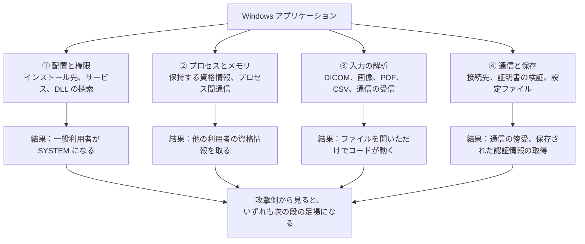
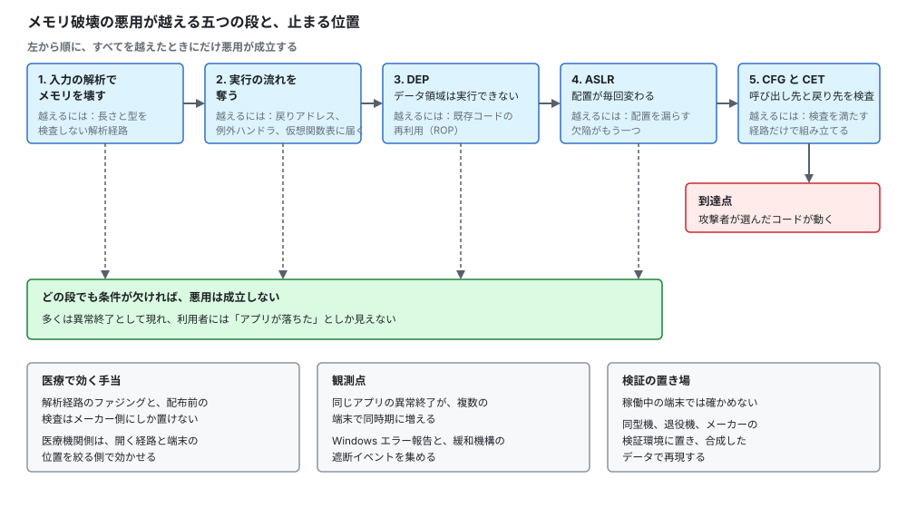
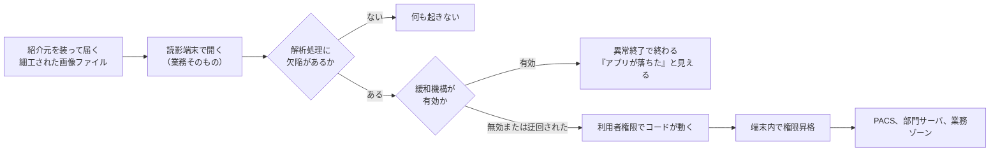
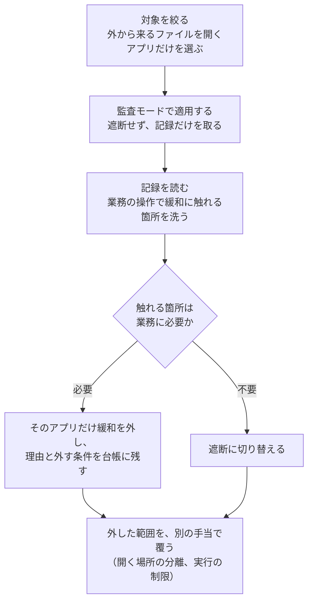
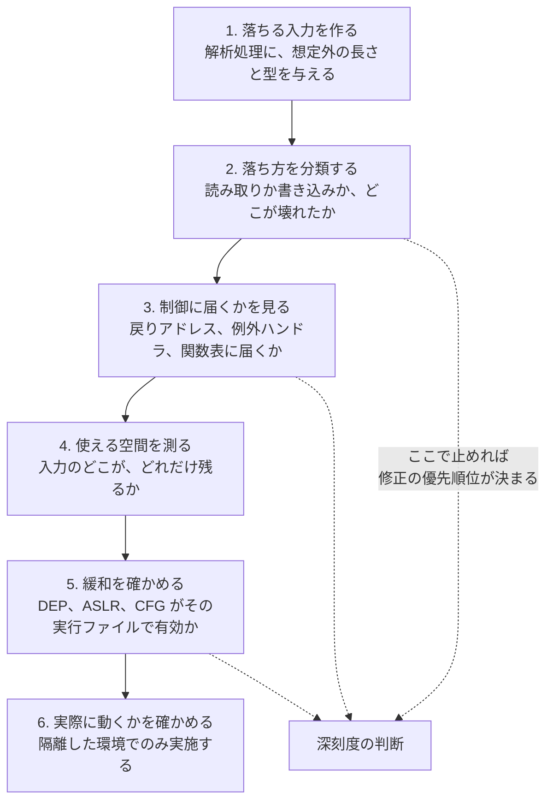
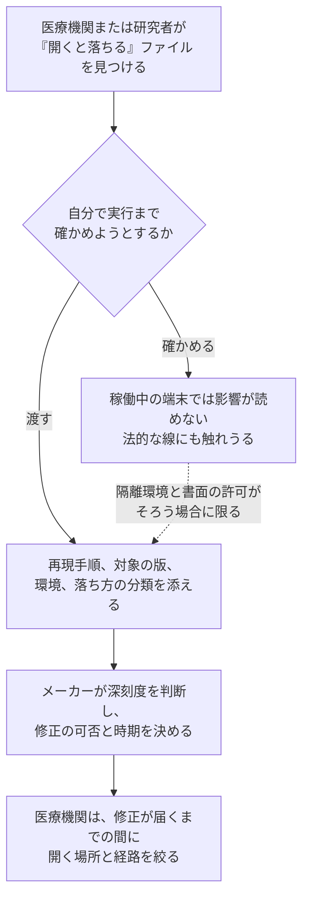

# 🧰 Windows アプリケーションのセキュリティ

医療機関で患者情報に触れるソフトウェアの多くは、ブラウザの中ではなく、端末にインストールされた Windows のアプリケーションとして動く。
電子カルテのクライアント、部門システムの端末ソフト、画像を読む DICOM ビューワ、検査装置の操作ソフト、ベンダの保守ツールがこれにあたる。
Web アプリケーションと違い、実行される場所が利用者の端末であるため、攻撃面は通信だけでなく、**インストール先の権限、読み込まれるライブラリ、開かれるファイルの解析**まで広がる。

本ページは、その攻撃面を四つに分けて扱い（[2 節](#2-攻撃面を四つに分ける)）、設定と配置に起因する権限昇格（[3 節](#3-配置と権限で決まる権限昇格)）と、入力の解析に起因するメモリ破壊（[4 節](#4-入力の解析とメモリ破壊)）を、公表された事例と対応づける。
そのうえで、この領域を扱う技能の体系として OSED（EXP-301）の範囲を一次情報で示し（[6 節](#6-osedexp-301が扱う手順)）、医療機関、検証を行う側、メーカーのそれぞれで何が実行できるかを分ける。

> [!NOTE]
> **表記ルール**：本ページでは、**事実**（一次情報で確認できる内容。出典を併記する）と、**分析**（筆者の解釈）を書き分ける。
>
> **第三者の記述の扱い**：認定機関が公表する内容と、受験者個人が書いた合格記や技術ブログを区別する。
> 後者を「事実」として書くのは、**その記述が存在すること**までである。
> 内容の正しさと、現在の試験や講座の運用が同じであることは保証されない。

> [!WARNING]
> 本ページに、そのまま攻撃に使える実装は載せない。
> 稼働中の医療情報システムと、患者が接続された医療機器に対する能動的な検証は、書面での許可と、影響の確認を経てから行う（[検証と調査の法的境界](../../practice/legal-boundary.md)）。
>
> 本ページの攻撃シナリオは、公表された脆弱性情報と、医療現場で一般に知られた運用から組み立てた**想定**である。
> 実在する特定の医療機関や製品の被害を指すものではない。

---

## 1. 医療で動く Windows アプリの性質

| 種類 | 実装の傾向 | 更新の経路 | 検証で問題になる点 |
|---|---|---|---|
| 電子カルテのクライアント | 独自のシッククライアント。サーバと専用の手順で通信する | ベンダの計画更新。年に数回 | 停止できない。テスト環境の構成が本番と違う |
| 部門システムの端末ソフト | 導入年が古く、実装の世代が混在する | 部門ごとに契約が分かれる | 誰が更新するかが契約で定まらない |
| DICOM ビューワ、画像の閲覧 | ファイルの解析処理を多く含む | 製品による。無償のものも使われる | ファイルを開く操作が業務そのもの |
| 検査装置、モダリティの操作ソフト | 承認を受けた構成の一部 | メーカーの承認が要る | 構成を変えられない |
| ベンダの保守ツール | 高い権限で動く。持ち込まれることがある | 医療機関の管理外 | 台帳に載らない |

**分析**：この表の右端が、Web アプリケーションとの最大の差になる。
Web では、脆弱性を見つければ運用側が修正を適用できる。
Windows アプリケーションでは、修正の提供と適用の権限がメーカー側にあり、承認済みの構成では医療機関の判断だけで更新できない。
そのため、検証の結論を「修正してほしい」で終わらせると動かない。
「届かなくする」と「起きたら気付く」に振り分けたうえで、修正の要求は調達の条件として次の更改に載せる（[医療機器の検証手法](../medical-devices/testing-methodology.md)）。

---

## 2. 攻撃面を四つに分ける

**分析**：四つのうち、医療機関側の運用で減らせるのは ① と ④ の一部である。
② と ③ は実装の内側にあり、メーカーにしか直せない。
検証の計画を立てるとき、この分担を先に決めておくと、報告書の宛先が分かれる。

---

## 3. 配置と権限で決まる権限昇格

### 3.1 三つの型

一般利用者の権限しか持たない者が、アプリケーションの配置を利用して SYSTEM の権限を得る経路である。
いずれも実装の欠陥というより、インストール時の設定で決まる。

| 型 | 成立の条件 | 確認の方法 |
|---|---|---|
| **サービスの実行ファイルを差し替える**（[T1543.003](https://attack.mitre.org/techniques/T1543/003/)） | サービスとして動く実行ファイルの置き場所に、一般利用者が書き込める | サービスの一覧と、その実行ファイルのパスの権限を突き合わせる |
| **DLL の探索順序を使う**（[T1574.001](https://attack.mitre.org/techniques/T1574/001/)） | 読み込まれる DLL の名前で、先に探索される場所に書き込める | 起動時に読み込みを試みて失敗している DLL の名前を記録する |
| **引用されないサービスのパス**（[T1574.009](https://attack.mitre.org/techniques/T1574/009/)） | パスに空白が含まれ、途中の位置に書き込める | サービスの構成を一覧にし、引用の有無と空白を確認する |

**事実**：歯科用の画像ソフトウェアである Panoramic Corporation Digital Imaging Software のバージョン 9.1.2.7600 には、`ccsservice.exe` コンポーネントを介して、ローカルの攻撃者が権限を昇格できる問題が CVE-2024-22774 として登録されている。
CWE-269（権限管理の不備）に分類され、CVSS v3.1 の基本値は 7.8 である。
出典：[NVD CVE-2024-22774](https://nvd.nist.gov/vuln/detail/CVE-2024-22774)

**分析**：この種の指摘が医療機関の診断で繰り返し出るのは、業務の性質と結び付いている。
画像や検査の端末は、装置と一体で導入されるため、インストール先とサービスの構成をベンダが決める。
医療機関側は「動けばよい」で受け入れ、権限の設定を確認しない。
確認は読み取りだけで完結し、業務を止めないため、検証の初手として費用対効果が高い。

### 3.2 手当と、確認の置き場

**手当**：インストール先を `Program Files` 配下に固定し、一般利用者の書き込みを外す。
サービスのパスを引用符で囲む。
起動時に読み込む DLL を絶対パスで指定する。
いずれも、医療機関側で実施できる場合と、ベンダの再インストールが要る場合に分かれる。

**分析**：現実には、次の更改まで直せない構成が残る。
その場合に効くのは、実行そのものを止める側の手当になる。
App Control（WDAC）や AppLocker で、許可した場所からの実行だけを認める設計にすれば、書き込める場所に置かれたファイルは動かない（[Microsoft Defender と EDR の回避が成立する条件](defense-evasion.md#1-windows-側の防御を六つの層で見る)）。

**検知の観測点**：新しいサービスの作成、利用者の書き込み可能な場所からの実行、署名のない DLL の読み込み。
**医療の正常系**：更改時の一括インストール、ベンダ保守での再インストール。
条件は「作業計画と対応しない実施」にする（[検知の設計](../detection-engineering.md)）。

### 3.3 シナリオ：非常勤の職員が、検査端末の SYSTEM を得る

| 欄 | 内容 |
|---|---|
| **対象の Windows** | **クライアント**。検査部門の端末（部門システムのクライアントが導入されている） |
| **攻撃者** | 内部の者、または端末の前に立てた者。権限は一般利用者のみ |
| **直接の被害者** | その端末を管理する情報システム部門と、部門システムのベンダ |
| **成立の条件** | 部門システムが `Program Files` の外にインストールされ、サービスの実行ファイルの置き場所に一般利用者が書き込める |
| **到達点** | 同じ端末の SYSTEM 権限。そこから端末に残る他の職員の資格情報へ |
| **最終的な被害者** | 患者。端末を起点に、検査部門のサーバと業務ゾーンへ経路が伸びる |
| **リスクの形** | 検査結果の参照と改ざん、資格情報の窃取、[ドメインの経路](active-directory.md#22-シナリオ-b部門システムのサービスアカウントから同じベンダの全サーバへ)への接続 |

**分析**：このシナリオが医療で現実味を持つのは、端末が物理的に開かれた場所にあり、非常勤や応援の職員、実習生、委託業者が日常的に触れるためである。
外部からの侵入を前提としなくても成立する。
確認は読み取りだけで済み（[3.2](#32-手当と確認の置き場)）、是正はベンダへの依頼になる。

**気付ける観測点**：サービスの実行ファイルの置き換え、新規サービスの作成、SYSTEM 権限での想定外のプロセスの起動。

---

## 4. 入力の解析とメモリ破壊

### 4.1 外から来るファイルを開く業務

Windows のアプリケーションは、外から来たデータを解析する。
医療では、その入力が診療の中身そのものになる。
画像、検査結果、紹介状、同意書、外部から持ち込まれた記録媒体がそれにあたる。

**事実**：MicroDicom DICOM Viewer の 2023.3（Build 9342）以前には、ヒープベースのバッファオーバーフローの脆弱性が CVE-2024-22100 として登録されている。
悪意のある DCM ファイルを利用者が開くことで、影響を受けるインストール上で任意のコードを実行されうる。
同じ版には、利用者が与えるデータの検証不足によりメモリの破壊に至る問題が CVE-2024-25578 として登録されている。
いずれも CVSS v3.1 の基本値は 7.8 で、CISA が ICS Medical Advisory（ICSMA-24-060-01）を公開している。
出典：[NVD CVE-2024-22100](https://nvd.nist.gov/vuln/detail/CVE-2024-22100)、[NVD CVE-2024-25578](https://nvd.nist.gov/vuln/detail/CVE-2024-25578)、[ICSMA-24-060-01](https://www.cisa.gov/news-events/ics-medical-advisories/icsma-24-060-01)（CISA）

**分析**：この事例が示す条件は、防御の設計を難しくする。
「知らないファイルを開かない」という一般的な指導が、そのままでは効かない。
外部の医療機関から届いた記録媒体を開くことは、読影と診療の手順に組み込まれている。
効かせられるのは、開く端末の位置と、開いたあとに何ができるかの側になる。

| 手当 | 内容 |
|---|---|
| 開く場所を分ける | 外部から持ち込まれた媒体を読む端末を、電子カルテと同じゾーンに置かない（[ネットワークの分離](../segmentation.md)） |
| 版を把握する | 画像の閲覧に使われるソフトウェアの版を台帳に持ち、公表された脆弱性と突き合わせる（[報告された脆弱性の事例](../oss-vulnerabilities/cve-cases.md)） |
| 実行の連鎖を切る | 閲覧ソフトから子プロセスが起動する形を、攻撃面の削減（ASR）ルールで止める |
| 異常終了を数える | 同じアプリケーションの異常終了が複数の端末で同時期に増える形を観測する |

**分析**：4 行目は、他の三つと性質が違う。
メモリ破壊の悪用は、成功する前に何度も失敗する。
失敗はアプリケーションの異常終了として現れ、利用者からは「落ちた」としか見えない。
この事象を集約していない組織では、悪用の試行が起きていること自体が観測できない。

### 4.2 悪用が成立するまでに越える段

  

**分析**：この鎖が示すのは、「脆弱性がある」ことと「悪用できる」ことが別だという点である。
医療機関が受け取る脆弱性情報の多くは、鎖の 1 段目だけを述べている。
対応の優先順位を決めるとき、その欠陥がどの段まで越えられるかを、メーカーの助言または検証で確かめると、順序が変わることがある。

### 4.3 シナリオ：外部から届いた画像を開いた読影端末が、足場になる

| 欄 | 内容 |
|---|---|
| **対象の Windows** | **クライアント**。読影端末、または外部媒体を読む受付の端末 |
| **攻撃者** | 外部の攻撃者。細工した DICOM ファイルを、紹介元を装って送るか、媒体として届ける |
| **直接の被害者** | ファイルを開いた職員（放射線科医、診療放射線技師、受付の担当者） |
| **成立の条件** | 閲覧ソフトの解析処理に欠陥があり、その端末で緩和機構が有効になっていない。かつ、業務として「届いたファイルを開く」運用がある |
| **到達点** | その端末の利用者権限。そこから[配置の問題](#3-配置と権限で決まる権限昇格)を使って SYSTEM へ |
| **最終的な被害者** | 患者。画像の参照不能、読影の停止、診療記録の流出 |
| **リスクの形** | 読影と画像診断の停止、[PACS への到達](../medical-devices/pacs-dicom.md)、業務ゾーンへの展開 |

**分析**：この経路の特徴は、**職員の判断で防げない**点にある。
「知らないファイルを開かない」という指導は、届いた画像を読むことが業務そのものである以上、成立しない。
効かせられるのは、開く端末の位置（[ネットワークの分離](../segmentation.md)）と、開いたあとに何ができるか（[3.2](#32-手当と確認の置き場)、緩和機構）の側になる。

**気付ける観測点**：閲覧ソフトからの子プロセスの起動、同一アプリの異常終了が複数端末で同時期に増える形（[8 節](#8-観測点のまとめ)）。

---

## 5. Windows 側に用意されている緩和機構

**事実**：Windows の exploit protection は、OS のプロセスとアプリケーションに対して、複数の緩和技術を適用する。
Windows 10 バージョン 1709、Windows 11、Windows Server バージョン 1803 以降で利用でき、Enhanced Mitigation Experience Toolkit（EMET）の機能の多くを含む。
EMET は 2018 年 7 月 31 日にサポートが終了しており、Microsoft は exploit protection への置き換えを求めている。
出典：[Apply mitigations to help prevent attacks through vulnerabilities](https://learn.microsoft.com/en-us/defender-endpoint/exploit-protection)（Microsoft）

**事実**：同じ資料は、適用できる緩和として、データ実行防止（DEP）、イメージの強制的なランダム化（強制 ASLR）、メモリ割り当てのランダム化（ボトムアップ ASLR）、例外チェーンの検証（SEHOP）、任意コードガード（ACG）、コード整合性ガード、低整合性イメージの遮断、子プロセスの禁止、インポートとエクスポートのアドレスのフィルタ、ヒープ整合性の検証などを挙げている。
また、一部の緩和はアプリケーションとの互換性の問題を起こしうるため、本番環境へ展開する前に監査モードで検証することを求めている。
出典：同上

**事実**：緩和が働いた記録は、Windows のイベントログの `Security-Mitigations` に残り、監査したものと遮断したものが別の識別子で記録される。
出典：同上

**分析**：医療機関でこの機能が使われない理由は、二つある。
互換性の確認に手間がかかることと、監査モードの記録を読む担当が決まらないことである。
実務的な進め方は、全体に一律で適用するのではなく、次の順序を取る。

**分析**：この順序の要は 3 段目にある。
医療機関で監査モードの記録を読む担当がいない場合、2 段目で止まったまま数年が過ぎる。
読む担当を決められないなら、監視を委託している先に、この記録を読む作業を仕様として渡す（[検知の設計](../detection-engineering.md#ルールを持ち回せる形にする)）。

---

## 6. OSED（EXP-301）が扱う手順

Windows のアプリケーションでメモリ破壊の欠陥を実際の悪用まで持っていく技能は、体系化された講座と認定の形で提供されている。
本ページの [4 節](#4-入力の解析とメモリ破壊)で扱った鎖を、手を動かして確かめる領域にあたる。

**事実**：OffSec の EXP-301 は「Windows User Mode Exploit Development」という名称で、スタックのバッファオーバーフローの悪用、IDA Pro とデバッガを用いたリバースエンジニアリング、独自のシェルコードの作成、データ実行防止（DEP）とアドレス空間配置のランダム化（ASLR）の迂回、書式指定文字列の脆弱性の悪用を扱う。
認定試験は 48 時間の監督付きで、三つの独立した課題が出題され、リバースエンジニアリング、悪用の作成、独自のシェルコードの作成が求められる。
前提として、デバッガの経験、32 ビットにおける基本的な悪用の概念、Python3 でのコード記述が挙げられている。
出典：[EXP-301: Windows User Mode Exploit Development](https://www.offsec.com/courses/exp-301/)（OffSec）

**分析**：この講座の構成から取り出せる、防御側にも意味のある作業の型は次のとおりである。
医療機器メーカーの検証部門と、医療系ソフトウェアを扱う PSIRT にとっては、そのまま手順になる。

**分析**：医療で価値が出るのは、多くの場合 2 段目と 5 段目である。
「落ちた」という報告だけでは、修正の優先順位が決まらない。
読み取りの違反で終わるのか、書き込みが制御に届くのかで、対応の緊急度が変わる。
5 段目は、その実行ファイルが DEP と ASLR を有効にしてビルドされているかという確認であり、ソースコードがなくても外から測れる。
古い部門システムでは、緩和を有効にせずにビルドされた実行ファイルが残っていることがある。

**分析**：一方、6 段目まで進める必要がある立場は限られる。
立場ごとに、どこまでが仕事になるかを分ける。

| 立場 | どこまで行うか | 理由 |
|---|---|---|
| 医療機関の情報システム部門 | 1 段目から 5 段目は行わない。版の把握と、公表された脆弱性との突き合わせに寄せる | 実施する権限も環境もない。効くのは配置と経路の側 |
| 検証を行う側（診断、ペネトレーションテスト） | 2 段目と 5 段目まで。6 段目は、契約と隔離環境がそろう場合に限る | 稼働中の環境で実行に至る検証は、影響が読めない |
| 医療機器メーカー、システムベンダ | 1 段目から 6 段目まで、自社製品に対して行う | 修正を提供できる唯一の立場であり、深刻度の判断に必要 |

**分析**：この分担は、脆弱性の届出の運用にも影響する。
医療機関または研究者が「落ちる入力」を見つけた時点で、実行に至るかを自分で確かめようとすると、法的な線と、環境の制約の両方に触れる。
再現手順を添えてメーカーに渡し、深刻度の判断はメーカー側で行う形が、双方にとって成立しやすい（[メーカー側の脆弱性受付と開示](../medical-devices/psirt-cvd.md)、[検証と調査の法的境界](../../practice/legal-boundary.md)）。

### 6.1 合格記に共通して現れる作業の型

技法の解説を除き、作業の進め方に触れた記述を取り出す。

**事実**：公開されている OSED の合格記には、次の記述がある。

| 記述の内容 | 書いた人と時期 |
|---|---|
| コースの後半に入ると、32 ビットのアセンブリの理解は任意ではなくなる。始める前に慣れておく | Spaceraccoon（2021 年 6 月 23 日） |
| Corelan の連載を先に済ませると時間を節約できる。講座はその流れに近い | 同上 |
| 補助のスクリプトは、理解せずに使うと破綻のもとになる。どう動き、なぜ動くかを理解する道具として使う | 同上 |
| 指示を正確に読み、時間を管理する | 同上 |
| WinDbg を使いこなす | Shelldon（2023 年 9 月 2 日） |
| 一つの課題で詰まったまま粘らず、課題を順に回す | 同上 |
| 提出前に、悪用が確実に動くことを確認する | 同上 |
| よく眠り、短い休憩を取り、時間配分を作る | 同上 |
| 公開されている練習用の脆弱なバイナリで、型を作る | 同上 |
| 追加課題（Extra Mile）まで手を動かすと、技法の変化形が身につく | I Break Stuff |
| 定期的に休憩を取る | 同上 |
| 提出する書庫に、作成したスクリプトを同梱する | 同上 |

出典：[ROP and Roll: EXP-301 Offensive Security Exploit Developer (OSED) Review and Exam](https://spaceraccoon.dev/rop-and-roll-exp-301-offensive-security-exploit-development-osed-review-and/)（Spaceraccoon、2021 年 6 月 23 日）、[OSED Exam Review](https://sh3lldon.github.io/posts/osed-exam-review/)（Shelldon、2023 年 9 月 2 日）、[OSED / EXP-301 Review](https://rouvin.gitbook.io/ibreakstuff/blogs/reviews/osed-review)（I Break Stuff）

**分析**：ここでも、共通して現れるのは技法ではなく、**基礎、道具、再現性、報告**である。
医療の実務に置き換えると、次の対応になる。

| 合格記に現れる型 | 医療機関、検証側、メーカーでの対応 |
|---|---|
| 基礎を先に作る | 「落ちた」を分類するには、スタックとレジスタの読み方が要る。ここを飛ばすと [6 節](#6-osedexp-301が扱う手順)の 2 段目で止まり、深刻度が決められない |
| 道具を理解して使う | 診断で使った道具の出力を機構まで説明できないと、承認済み構成のメーカーに「再現しない」と返されたときに反論できない |
| デバッガを主戦場にする | 医療のシッククライアントはソースが手に入らない。外から測る手段は、デバッガ、プロセスの観測、通信の観測に限られる |
| 課題を順に回す | 診断の期間内に一つの欠陥へ張り付くと、他の攻撃面（[2 節](#2-攻撃面を四つに分ける)の四つ）が未検証で残る |
| 提出前に再現を確認する | 再現しない報告は、ベンダ側で「再現せず」として閉じられる。版、OS、設定、手順を添える |
| 報告書と成果物を揃える | 医療では、深刻度を診療の言葉に翻訳するところまで書いて初めて判断につながる（[深刻度を、診療と患者安全の言葉に翻訳する](../../practice/pentest/README.md#7-深刻度を診療と患者安全の言葉に翻訳する)） |
| 練習用の環境を持つ | 稼働中の端末で試さないための前提になる。同型機、退役機、合成データで型を作る |

### 6.2 参考にできる第三者の資料

| 資料 | 提供元 | 使いみち |
|---|---|---|
| [Exploit writing tutorial（連載）](https://www.corelan.be/index.php/articles/) | Corelan Team | スタックの破壊から緩和の迂回までを順に扱う古典的な解説。落ち方の分類の語彙がそろう |
| [Debugging Tools for Windows（WinDbg）](https://learn.microsoft.com/en-us/windows-hardware/drivers/debugger/) | Microsoft | 異常終了の解析に使う。医療機関側でも、業務を止めている不具合の切り分けに使える |
| [Process Monitor](https://learn.microsoft.com/en-us/sysinternals/downloads/procmon)、[AccessChk](https://learn.microsoft.com/en-us/sysinternals/downloads/accesschk) | Microsoft（Sysinternals） | DLL の探索とファイルの参照を観測し、サービスとファイルの権限を一覧にする。[3 節](#3-配置と権限で決まる権限昇格)の確認がこの二つでほぼ済む |
| [signatus](https://github.com/bmdyy/signatus)、[quote_db](https://github.com/bmdyy/quote_db) | bmdyy | 練習用に公開されている、意図的に脆弱な Windows のバイナリ。隔離環境での訓練に使う |
| [App Control（WDAC）Wizard](https://github.com/MicrosoftDocs/WDAC-Toolkit) | Microsoft | 許可した場所からの実行だけを認めるポリシーを作る。[3.2](#32-手当と確認の置き場)の手当にあたる |

> [!WARNING]
> 練習用の脆弱なバイナリは、隔離した環境でのみ動かす。
> 業務の端末、医療機器に付属する端末、診療系に接続された環境には置かない。

---

## 7. 調達と開発の側に渡す要求

検証で見つかる問題の多くは、実装ではなく引き渡しの条件で決まる。
次の更改の仕様書に載せられる形で書く。

| 要求 | 確かめ方 |
|---|---|
| インストール先を `Program Files` 配下にし、一般利用者の書き込みを与えない | 導入後に、実行ファイルとサービスのパスの権限を確認する |
| サービスのパスを引用符で囲み、読み込む DLL を絶対パスで指定する | サービスの構成の一覧を提出させる |
| 実行ファイルを、DEP、ASLR、CFG を有効にしてビルドする | 納品物に対して、緩和の設定を確認する |
| 動作要件として管理者権限を求める場合、その理由を文書で示す | 要件の根拠を確認し、不要なら外させる |
| 外部から来るファイルの解析処理に対して、実施したファジングの範囲を示す | 試験の報告書を納品物に含める |
| 構成部品の一覧（SBOM）を提出する | [SCA と SBOM で既知脆弱性に対処する](../oss-vulnerabilities/sca-sbom.md) |
| 脆弱性の届出窓口と、修正の提供の期間を明示する | [メーカー側の脆弱性受付と開示](../medical-devices/psirt-cvd.md) |

**分析**：この表のうち、医療機関が単独で実現できる行は一つもない。
すべて、調達の条件として先に置くか、更改の交渉で入れるしかない。
稼働後に指摘しても、承認済みの構成では変えられないという答えが返る。
[医療の脅威モデリング](../../practice/threat-modeling.md)と[外部から見た自組織の攻撃面](../../practice/attack-surface.md)を、調達の前に行う理由がここにある。

---

## 8. 観測点のまとめ

| 攻撃面 | 観測点 | 条件にできるもの | 医療で正常系に現れる形 |
|---|---|---|---|
| 配置と権限 | サーバ OS の監査、EDR | サービスの作成、書き込み可能な場所からの実行 | 更改時の一括インストール |
| プロセスとメモリ | EDR、サーバ OS の監査 | 他のプロセスのメモリへの参照 | バックアップと資産管理の処理 |
| 入力の解析 | Windows エラー報告、緩和機構の記録、EDR | 同一アプリの異常終了の増加、閲覧ソフトからの子プロセスの起動 | 破損したファイルによる異常終了 |
| 通信と保存 | プロキシ、ファイアウォール、ファイルサーバ | 平時に出ない宛先への接続、設定ファイルへの参照 | ベンダの遠隔サポート |

**分析**：三行目の一列目にある Windows エラー報告は、医療機関でほぼ集約されていない。
集約すれば、悪用の試行だけでなく、業務を止めている不具合の分布も同時に見える。
情報システム部門にとって、セキュリティ以外の理由でも効く数少ない観測点になる。

---

## 関連ページ

- [Windows 環境のセキュリティ](README.md)：医療機関の Windows 資産の区分と、サポート期限
- [Active Directory の攻撃面と、段階的な手当](active-directory.md)：端末で得た権限が、ドメインでどう使われるか
- [Microsoft Defender と EDR の回避が成立する条件](defense-evasion.md)：実行を止める層と、そこに残る記録
- [医療機器の検証手法](../medical-devices/testing-methodology.md)：稼働させたまま測れないものをどう扱うか
- [報告された脆弱性の事例（CVE）](../oss-vulnerabilities/cve-cases.md)：医療分野で公表された脆弱性の読み方
- [SCA と SBOM で既知脆弱性に対処する](../oss-vulnerabilities/sca-sbom.md)：構成部品の把握
- [メーカー側の脆弱性受付と開示](../medical-devices/psirt-cvd.md)：見つけた欠陥を渡す先
- [医用画像 OSS（PACS/DICOM 実装）](../oss-vulnerabilities/imaging-pacs.md)：DICOM の解析に固有の攻撃面

---

[← Windows 環境のセキュリティ](README.md) | [トップへ](../../../README.md)
