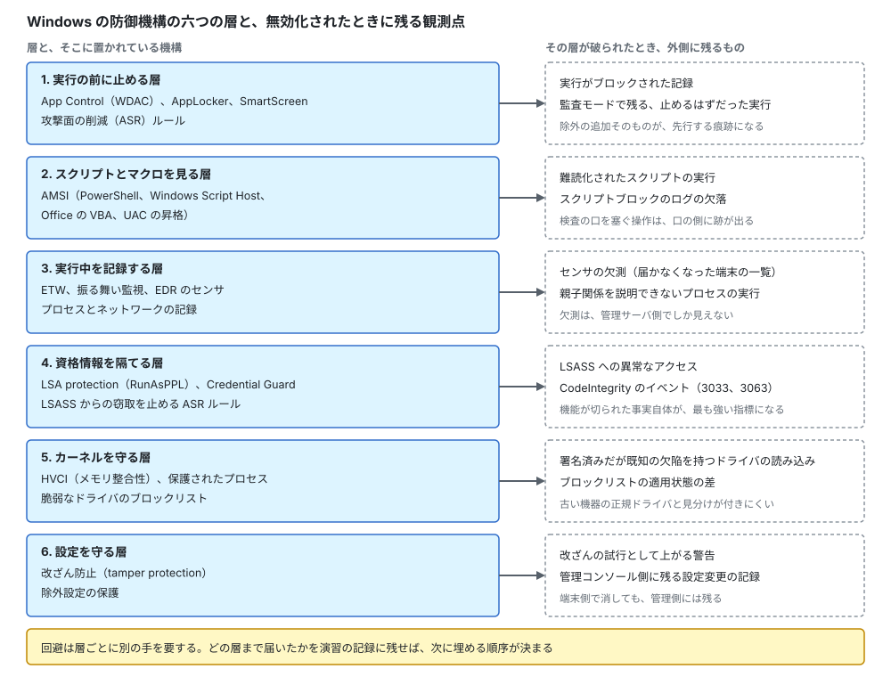
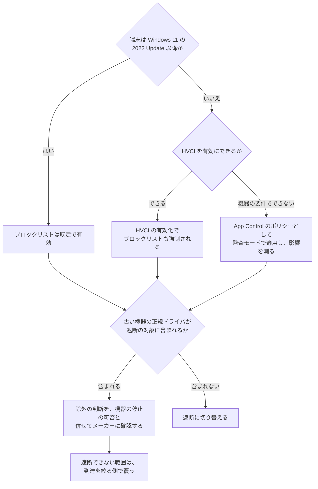
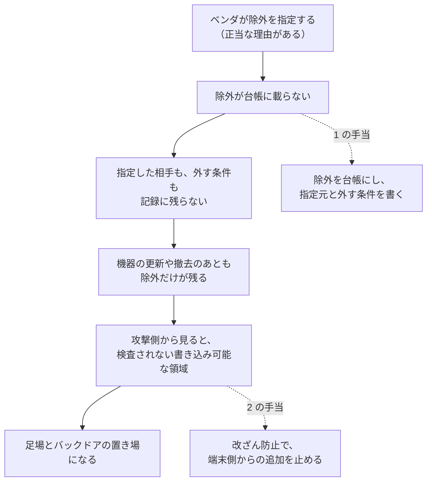
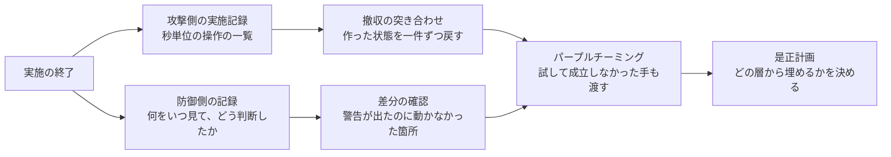
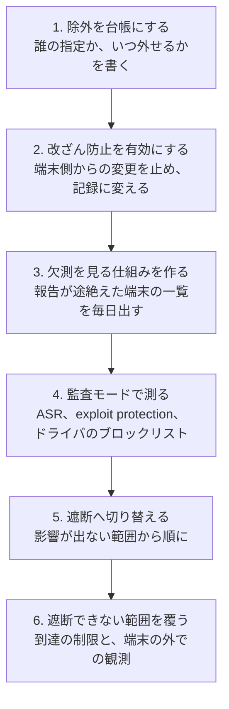

# 🕶️ Microsoft Defender と EDR の回避が成立する条件

「EDR を入れた」という一行で、端末の防御は終わったことにされやすい。
実際には、Windows 側の防御は独立した複数の層でできており、攻撃側はそのすべてを同時に相手にするのではなく、**一つずつ、別の手で外していく**。
どの層が外されたかによって、残る記録も、次に打つ手も変わる。

本ページは、その層を六つに分け（[1 節](#1-windows-側の防御を六つの層で見る)）、層ごとに、回避が狙う形と、外されたときに外側へ残る観測点を対にする（[2 節](#2-層ごとに何が狙われ何が残るか)）。
そのうえで、医療機関に固有の穴である除外設定（[3 節](#3-除外設定という医療機関に固有の穴)）と、正規のドライバを使う経路（[4 節](#4-脆弱な正規ドライバとセーフモード)）を扱い、演習でこれを測る方法（[7 節](#7-演習で測るときに記録に残すこと)）に接続する。

回避の実装は載せない。
載せるのは、**何が検査され、何が検査されないか**という条件と、それが崩れたときに何が観測できるかである。

> [!NOTE]
> **表記ルール**：本ページでは、**事実**（一次情報で確認できる内容。出典を併記する）と、**分析**（筆者の解釈）を書き分ける。
>
> **第三者の記述の扱い**：ベンダの公表資料と、個人が書いた合格記や技術ブログを区別する。
> 後者を「事実」として書くのは、**その記述が存在すること**までである。

> [!WARNING]
> 本ページは、自組織の検知の設計と、許可された演習の設計に使うことを想定している。
> 権限のない環境で防御機能を無効化する行為は行わない。
>
> 本ページの攻撃シナリオは、公表された資料から組み立てた**想定**である。
> 実在する特定の医療機関や事業者を指すものではない。

---

## 1. Windows 側の防御を六つの層で見る

  

**分析**：この分け方が実務で効くのは、**回避が層をまたいで効かない**という性質があるためである。
スクリプトの検査を避ける手は、カーネル側の保護には効かない。
資格情報の保護を外す手は、実行の記録を消さない。
そのため、演習の記録を「気付かれたか、気付かれなかったか」の二値で終わらせず、**どの層まで届いたか**で残すと、防御側が次に埋める場所が特定できる。

---

## 2. 層ごとに、何が狙われ、何が残るか

### 2.1 実行の前に止める層

**事実**：攻撃面の削減（ASR）ルールは、Microsoft Defender ウイルス対策の機能として、攻撃で悪用されやすいソフトウェアの挙動を対象にする。
標準的な保護として位置づけられているのは、脆弱な署名済みドライバの悪用の遮断、Windows のローカルセキュリティ機関のサブシステム（LSASS）からの資格情報の窃取の遮断、WMI のイベントサブスクリプションによる永続化の遮断の三つである。
このほかに、Office のアプリケーションからの子プロセスの生成、メールと Webmail からの実行可能な内容、PSExec と WMI に由来するプロセスの生成、難読化された可能性のあるスクリプトの実行を対象とするルールがある。
各ルールには監査モードがあり、遮断せずに記録だけを取れる。
出典：[ASR rules reference](https://learn.microsoft.com/en-us/defender-endpoint/attack-surface-reduction-rules-reference)（Microsoft）

**回避が狙う形**：許可された場所と、許可されたプロセスの内側で動くこと。
規則が「どこから起動したか」と「どのプロセスが子を作ったか」で判断する以上、その条件を満たす経路を選べば規則には触れない。

**残る観測点**：遮断の記録と、監査モードで残る「止めるはずだった実行」。
**先行する痕跡**：ルールの除外の追加そのもの（[3 節](#3-除外設定という医療機関に固有の穴)）。

### 2.2 スクリプトとマクロを見る層

**事実**：Antimalware Scan Interface（AMSI）は、アプリケーションとサービスが、端末に導入されているマルウェア対策製品と連携するためのインタフェースである。
Windows では、利用者アカウント制御（UAC）による昇格、PowerShell（スクリプト、対話的な利用、動的なコード評価）、Windows Script Host（`wscript.exe` と `cscript.exe`）、JavaScript と VBScript、Office の VBA マクロが AMSI と連携する。
AMSI はセッションの概念を持ち、断片に分割された内容を関連づけて判断できる。
出典：[Antimalware Scan Interface (AMSI)](https://learn.microsoft.com/en-us/windows/win32/amsi/antimalware-scan-interface-portal)（Microsoft）

**回避が狙う形**：検査の口を通らない実行の形と、検査に渡る内容を判定の対象から外す形の二つ。
Altered Security は、演習の学習目標として、スクリプトをメモリ上に読み込む手法と、PowerShell の防御機構の迂回を挙げている（[Active Directory の攻撃面](active-directory.md#9-windows-red-team-labcrteが扱う範囲)）。

**残る観測点**：スクリプトブロックのログが平時と比べて欠落する形、難読化されたスクリプトの実行、AMSI の提供元の構成の変化。

**分析**：医療機関でこの層の記録が使えない理由は、記録の設定が既定のままであることが多い点にある。
PowerShell のスクリプトブロックのログを有効にしていない環境では、この層は「働いたかどうかも分からない」状態になる。
有効化は端末の再構成を伴わず、[ログと監視の設計](../logging.md)の範囲で実施できる。

### 2.3 実行中を記録する層

この層は、EDR のセンサと ETW による記録が担う。
攻撃側から見ると、記録そのものを消すより、記録されない経路を選ぶか、センサの動作を止めるほうが確実である場合が多い。

**回避が狙う形**：正規のプロセスの内側で動くこと、OS に標準で入っている管理用のプログラムで用を足すこと（[T1218](https://attack.mitre.org/techniques/T1218/)）、記録の経路を止めること。
Altered Security は、COM オブジェクトの悪用による EDR の迂回を学習目標に挙げている。

**残る観測点**：センサの欠測。
**分析**：欠測は端末側では観測できない。
管理サーバ側で「昨日まで報告していた端末が、今日は報告していない」という差分を取る仕組みが要る。
医療機関では端末の電源が落とされる運用があるため、欠測の基準値を先に測らないと、この条件は使えない。

### 2.4 資格情報を隔てる層

この層の内容は [Active Directory の攻撃面](active-directory.md#5-資格情報をどう守りどう破られるか) に整理した。
回避の側から加えるのは、**無効化されたこと自体が記録に残る**という点である。

**事実**：LSA protection を有効にした状態で、署名の要件を満たさないドライバやプラグインの読み込みが失敗すると、イベントビューアの `CodeIntegrity` の運用ログにイベント 3033 と 3063 が記録される。
監査モードでは、同じ状況がイベント 3065 と 3066 として記録される。
Windows 11 バージョン 22H2 以降では、この監査モードが既定で有効になっている。
出典：[Configure added LSA protection](https://learn.microsoft.com/en-us/windows-server/security/credentials-protection-and-management/configuring-additional-lsa-protection)（Microsoft）

**分析**：この記録は、防御側にとって二つの意味を持つ。
一つは、資格情報の保護に触れる動きの検知。
もう一つは、LSA protection を有効にする前に、自組織のどのソフトウェアが LSA に読み込まれているかを知る手段である。
医療機関でスマートカード認証や生体認証を使っている場合、監査モードの記録が、有効化の可否を判断する材料になる。

### 2.5 カーネルを守る層

この層は、ドライバへの署名の要件、メモリ整合性（HVCI）、脆弱なドライバのブロックリストが担う。
回避が狙う形と、そこに残る観測点は [4 節](#4-脆弱な正規ドライバとセーフモード)で扱う。

### 2.6 設定を守る層

**事実**：改ざん防止（tamper protection）は、ウイルスと脅威の防止のようなセキュリティ設定が無効化または変更されることを防ぐ機能である。
有効な状態では、リアルタイム保護、動作監視、クラウド保護、定義更新、検出時の自動処置が維持され、**除外設定の変更と追加ができなくなる**。
グループポリシーで変更しても、改ざん防止の対象になっている設定への変更は無視される。
改ざんの試行が検出されると、Microsoft Defender ポータルに警告が上がる。
出典：[Protect security settings with tamper protection](https://learn.microsoft.com/en-us/defender-endpoint/prevent-changes-to-security-settings-with-tamper-protection)（Microsoft）

**分析**：この機能の実務上の意味は、防御そのものより**攻撃側の作業を記録に変える**点にある。
攻撃側が保護を止めようとした事実が、端末ではなく管理コンソール側に残る。
端末を初期化されても、この記録は消えない。

---

## 3. 除外設定という、医療機関に固有の穴

**事実**：ASR ルールのうち、いくつかは除外の対応が限定的である。
たとえば LSASS からの資格情報の窃取を遮断するルールは、除外の対応が限られると明記されている。
一方で、改ざん防止が有効な条件下では、Microsoft Defender ウイルス対策の除外を保護できる。
出典：[ASR rules reference](https://learn.microsoft.com/en-us/defender-endpoint/attack-surface-reduction-rules-reference)、[Protect security settings with tamper protection](https://learn.microsoft.com/en-us/defender-endpoint/prevent-changes-to-security-settings-with-tamper-protection)（Microsoft）

**分析**：医療機関では、除外設定が他業種より多く、しかも長く残る。
理由は運用の側にある。

| 除外が生まれる場面 | 残り続ける理由 |
|---|---|
| 医療機器ベンダが「この製品の動作のため、このフォルダを除外してほしい」と指定する | 指定を外すと、機器の保証と動作の前提から外れうる |
| 電子カルテのベンダが、性能上の理由でデータ領域の除外を求める | 除外を外すと応答が遅くなり、診療の速度に影響する |
| 導入時の検証で問題が出た製品を、暫定で除外する | 暫定の期限が記録されず、担当者の異動で理由が失われる |

**分析**：ここから導かれる検知の条件は、[検知の設計](../detection-engineering.md#技法と観測点と医療の正常系)に書いたとおり「除外設定の追加」ではなく「**保守記録と対応しない除外設定の追加**」になる。
条件を書けるようにするための作業は、台帳の側にある。

**運用で決めること**

1. 除外の一覧を、指定した相手（ベンダ名、担当者、文書）と対にして持つ
2. 除外を追加したときに、外す条件（製品の更新、機器の撤去）を併記する
3. 機器の更新と撤去のたびに、対応する除外が残っていないかを確認する
4. 改ざん防止で除外を保護し、端末側から追加できない状態にする

**分析**：4 が入ると、除外の追加が管理コンソールを通る操作に一本化される。
攻撃側が端末で除外を足そうとすれば、そこで止まるか、記録に残る。
現場のベンダ作業も同じ経路を通るため、1 と 2 の台帳が自然に埋まる。

---

## 4. 脆弱な正規ドライバとセーフモード

### 4.1 署名されたドライバを使う経路

**事実**：Microsoft は、カーネルで動くコードに厳格な要件を課しているため、攻撃者は正規かつ署名されたカーネルドライバの脆弱性を悪用してカーネルでマルウェアを動かす方向へ移っている、と説明している。
脆弱なドライバのブロックリストは、既知の脆弱性を持つドライバ、マルウェアの署名に使われた証明書、Windows のセキュリティモデルを迂回する挙動を持つドライバを対象とする。
Windows 11 2022 Update 以降、このブロックリストはすべての端末で既定で有効であり、メモリ整合性（HVCI）、Smart App Control、S モードのいずれかが有効な場合にも強制される。
更新は四半期ごとに行われ、加えて月次の Windows 更新でも配信される。
出典：[Microsoft recommended driver block rules](https://learn.microsoft.com/en-us/windows/security/application-security/application-control/app-control-for-business/design/microsoft-recommended-driver-block-rules)（Microsoft）

> [!IMPORTANT]
> **事実**：同じ資料は、ブロックリストが脆弱性を持つすべてのドライバを遮断することを保証しないと明記している。
> 互換性と信頼性への影響を避けるため、一部の遮断は保留されることがある。
> また、ドライバを遮断すると機器やソフトウェアが動作しなくなり、まれにブルースクリーンに至ることがあるとしている。

**事実**：ASR ルールの「Block abuse of exploited vulnerable signed drivers」は、脆弱な署名済みドライバが端末に保存されることを防ぐが、**すでに端末にあるドライバの読み込みは防がない**。
既存のドライバの読み込みを止めるには、ブロックリストの有効化または App Control のポリシーの適用が要る。
出典：[ASR rules reference](https://learn.microsoft.com/en-us/defender-endpoint/attack-surface-reduction-rules-reference)（Microsoft）

**分析**：医療機関でこの分岐が難しくなるのは、C の位置にある。
検査装置や画像機器に付属するドライバは、更新されないまま長く使われる。
ブロックリストの適用で機器が止まれば、診療が止まる。
そのため、監査モードで先に測るという手順を飛ばせない。

**残る観測点**：署名済みだが既知の欠陥を持つドライバの読み込み、ブロックリストの適用状態が端末間で食い違う形。

### 4.2 セーフモードで起動する経路

**事実**：ASR ルールの「Block rebooting machine in Safe Mode」は、`bcdedit` や `bootcfg` のような、悪用されやすいコマンドによる Windows のセーフモードでの再起動を防ぐ。
Microsoft は、セーフモードでは多くのセキュリティ製品が無効化されるか機能が制限された状態で動作し、その状態で攻撃者が改ざんのコマンドを実行したり、端末上のすべてのファイルを暗号化したりできる、と説明している。
なお、セーフモードは Windows 回復環境からは手動で利用できる。
出典：[ASR rules reference](https://learn.microsoft.com/en-us/defender-endpoint/attack-surface-reduction-rules-reference)（Microsoft）

**分析**：この経路は、端末側の記録では追いにくい。
セーフモードで起動している間、EDR のセンサが動いていなければ、その時間帯の記録は残らない。
観測できるのは、管理サーバ側での欠測と、再起動の前後にあるコマンドの実行になる。

---

## 5. 無効化そのものを検知の対象にする

攻撃側が防御機能を止めた事実は、それ自体が強い指標になる（[T1685](https://attack.mitre.org/techniques/T1685/)）。
条件は、機能ごとに置く場所が違う。

| 止められるもの | 観測できる場所 | 条件にできるもの | 医療の正常系 |
|---|---|---|---|
| EDR のセンサ | 管理サーバ | 報告が途絶えた端末の一覧と、その継続時間 | 電源を落とす運用、可搬端末の持ち出し |
| リアルタイム保護、除外設定 | 管理コンソール、改ざん防止の警告 | 端末側からの設定変更の試行 | 管理コンソール経由の正規の変更 |
| LSA protection、Credential Guard | `CodeIntegrity` の運用ログ | 署名の要件を満たさない読み込み | スマートカードと生体認証のドライバ |
| ドライバのブロックリスト | 端末の構成情報、App Control の記録 | 適用状態が端末間で食い違う | 機器付属の端末で、意図的に外している範囲 |
| イベントログの転送 | 集約先 | 転送が止まった端末 | 検証環境の初期化 |

**分析**：右端の列が示すとおり、どの行にも医療の正常系がある。
つまり、無効化の検知は「無効化されたか」ではなく「**説明の付かない無効化か**」の判定になる。
判定に必要なのは、端末の一覧、電源の運用、保守の記録、除外の台帳である。
これらが揃っていない組織では、警告が上がっても切り分けができず、やがて見なくなる。

---

## 6. 実際の攻撃で観測された形

**事実**：CISA、FBI、HHS、MS-ISAC が 2025 年 7 月 22 日に公開した Interlock ランサムウェアの共同アドバイザリは、初期アクセスとして、侵害された正規の Web サイトからのドライブバイダウンロードと、利用者に問題の修正を装って悪意のあるペイロードを実行させる ClickFix と呼ばれる手口を挙げている。
実行と永続化では、PowerShell スクリプトが Windows のスタートアップフォルダにファイルを置く形と、`Chrome Updater` という名前でレジストリの Run キーに値を追加する形が記載されている。
偵察には `systeminfo`、`tasklist /svc`、`Get-Service`、`Get-PSDrive`、`arp -a` といった標準のコマンドが使われ、暗号化の実行体は `conhost.exe` という名前の 64 ビット実行ファイルとして展開されている。
出典：[#StopRansomware: Interlock（AA25-203A）](https://www.cisa.gov/news-events/cybersecurity-advisories/aa25-203a)（CISA）

**分析**：このアドバイザリに記載された手口のうち、防御機構の回避にあたるのは、正規の名前を借りることと、標準のコマンドで偵察を済ませることである。
いずれも、検査の対象になりにくい形を選んだ結果である。
`conhost.exe` や `Chrome Updater` という名前は、一覧で見たときに違和感が出ない名前として選ばれている。

**分析**：検知の条件は、名前の一致では書けない。
名前で作った条件は、名前を変えられた時点で外れるためである。
置けるのは、実行体の位置と親子関係になる。
標準の名前を持つ実行ファイルが、標準ではない場所から起動する形。
ブラウザの更新を名乗るものが、ブラウザの導入先の外にある形。

### 6.1 シナリオ：ベンダ指定の除外の内側に、足場とバックドアを作る

| 欄 | 内容 |
|---|---|
| **対象の Windows** | **サーバ**。医療機器の管理サーバ、または部門システムのサーバ。ベンダ指定でフォルダが除外されている |
| **攻撃者** | 外部の攻撃者。業務ゾーンの端末にすでに足場がある |
| **直接の被害者** | そのサーバを運用するベンダと、情報システム部門 |
| **成立の条件** | 除外されたフォルダに書き込めること、除外の一覧が台帳になく、追加や変更が誰にも気付かれないこと |
| **到達点** | そのサーバでの常駐。加えて、除外の内側は検査されないため、**バックドアの置き場所として選ばれやすい** |
| **最終的な被害者** | 患者。侵害が長期化し、復旧後も同じ場所から戻られる |
| **リスクの形** | 検知の空白が固定化する。復旧時に、除外の内側が再構築の対象から漏れる（[バックドアの仕込み](active-directory.md#10-バックドアの仕込みと復旧で消えないもの)） |

**分析**：この経路の要点は、攻撃側が高度な回避を必要としない点にある。
除外は防御側が自分の手で作った空白であり、そこに置くだけで検査を通らない。
[3 節](#3-除外設定という医療機関に固有の穴)の台帳と、[2.6](#26-設定を守る層)の改ざん防止が、この経路に対する直接の手当になる。

**気付ける観測点**：除外されたフォルダ配下からの実行（除外は検査を止めるが、プロセスの起動そのものは EDR の記録に残る場合がある）、除外の追加の試行、そのサーバから外部への継続的な通信。

### 6.2 クライアントとサーバの、帰結の違い

**分析**：同じ技法でも、対象がクライアントかサーバかで、医療機関にとっての帰結が変わる。
発注と是正の順序を決めるときは、この差を先に置く。

| | クライアント（業務端末、機器付属 PC） | サーバ（部門、管理、ドメイン） |
|---|---|---|
| 攻撃側の目的 | 足場の確保と、資格情報の収集 | 到達点そのもの。停止と暗号化の対象 |
| 直接の被害者 | その端末を使う職員 | その業務に依存する部門全体 |
| 停止したときの影響 | 一台なら代替できる | 部門または病院全体の業務が止まる |
| 台数と再構築の可否 | 台数が多く、再構築はできるが漏れが出る | 台数は少ないが、ベンダの作業待ちで再構築が遅れる |
| バックドアの残りやすさ | 再構築で消えるが、対象から漏れた端末に残る | 再構築が遅れるあいだ、残り続ける |
| 先に手を打つ理由 | 侵入の起点になりやすい | 侵害されたときの損害が大きい |

**分析**：この表から出る順序は、**クライアントで起点を減らし、サーバで損害を抑える**という二本立てになる。
どちらか一方に寄せると、片側が空く。
医療機関では前者が人と運用の話（共有端末、ログオフ、権限）に、後者が構成と契約の話（分離、特権の分離、再構築の順序）になり、担当部署も変わる。

---

## 7. 演習で測るときに、記録に残すこと

**分析**：回避は、レッドチーム演習の目的ではなく、検知を測るための手段である（[レッドチームと TLPT を医療機関に当てはめる](../../practice/pentest/red-team-tlpt.md)）。
測るために、次の四つを記録に残す。

| 記録する項目 | それが答える問い |
|---|---|
| どの層に触れたか（[1 節](#1-windows-側の防御を六つの層で見る)の六つ） | 防御の構成のうち、どこが空いているか |
| 触れた時刻と、警告が上がった時刻 | 検知の遅れは、技術の問題か運用の問題か |
| 警告が上がったが、対応されなかった箇所 | 手順と権限の問題であり、検知の問題ではない |
| 試したが成立しなかった手 | 防御が働いた箇所。攻撃側は成功だけを書くため、意識して残す |

**分析**：四行目が抜けやすい。
攻撃側の報告書は成功した経路で構成されるため、働いた防御が記録に残らない。
その結果、次年度の予算で「効いていた対策」が削られることが起きる。
この差分を渡すために、攻撃側と防御側が同じ卓で技法ごとに検知を確かめる作業（パープルチーミング）が、終了フェーズに置かれている（[レッドチームと TLPT](../../practice/pentest/red-team-tlpt.md)）。

**分析**：技法単位で確かめる場合、監査モードが使える点が医療機関にとって効いてくる。
ASR ルールと exploit protection には監査モードがあり、遮断せずに記録だけを取れる（[Windows アプリケーションのセキュリティ](app-security.md#5-windows-側に用意されている緩和機構)）。
稼働中のシステムを止められない環境で、防御の設定を先に測る手段として使える。

### 7.1 演習で実施しない行為

**分析**：医療機関での演習における運用上の秘匿（OPSEC）は、攻撃側が隠れること自体が目的ではない。
患者と診療に影響を出さずに、検知の実力だけを測ることが目的になる。
そのため、実環境の攻撃側が使う手のうち、次は実施の対象から外す形が現実的になる。

| 実施しないこと | 外す理由 |
|---|---|
| 防御機能の恒久的な無効化 | 演習の期間中、その端末が本物の攻撃に対して無防備になる |
| ドライバの導入と、カーネルで動くコードの実行 | 端末が停止したとき、復旧に機器の再構成が要る |
| 稼働中の医療機器と、患者が接続された機器への到達 | 影響が患者に及ぶ |
| 資格情報の大量の持ち出し | 演習の記録そのものが、漏えいの対象になる |
| 業務データの暗号化と削除の再現 | 影響が読めない。到達できた事実の記録で足りる |

**分析**：この線を実施要領に書いておくと、防御側が本物の攻撃と誤認したときの判断が速くなる。
演習の範囲と中止を決める管理チームが「その操作は範囲に含まれない」と即答できれば、遮断の判断に迷いが出ない（[レッドチームと TLPT を医療機関に当てはめる](../../practice/pentest/red-team-tlpt.md)）。

### 7.2 撤収で戻すもの

演習と診断は、始めるより終わらせるほうが難しい。
攻撃側が作った状態を戻し損ねると、その残骸が次の侵害の入口になり、後日の調査でも本物の痕跡と区別できなくなる。

| 戻すもの | 戻し損ねたときに起きること |
|---|---|
| 追加したアカウントと、グループへの追加 | 監査で「正規に作られたアカウント」として残る |
| 変更した ACL と委任の設定 | ドメインの権限昇格の経路が残る（[Active Directory の攻撃面](active-directory.md#6-ドメインの権限を上げる四つの経路)） |
| 発行させた証明書 | パスワードを変更しても認証できる状態が残る |
| 追加した除外設定と、停止した保護機能 | その端末の防御が下がったまま戻らない |
| 置いた実行ファイル、サービス、自動起動 | 演習で作った痕跡が、本物の痕跡と区別できなくなる |
| 収集した資格情報と記録 | 契約で定めた期間を過ぎても、実施者の手元に残る |

**分析**：撤収の確認は、攻撃側の自己申告では閉じない。
実施記録と防御側の記録を突き合わせ、戻したことを防御側の観測点で確認する。
[5 節](#5-無効化そのものを検知の対象にする)に挙げた観測点は、そのまま撤収の確認にも使える。

### 7.3 参考にできる第三者の資料

**事実**：CRTE の合格記には、この講座がウイルス対策や Microsoft Defender for Identity を迂回する手法を扱うと述べた記述がある。
出典：[Certified Red Team Expert (CRTE) Review](https://www.misecurity.net/certified-red-team-expert-crte-review/)（Kyle Gray、MiSecurity、2023 年 3 月 15 日）

**分析**：回避の手法そのものは、こうした講座と公開資料の双方に出ている。
防御側が読む価値があるのは、手法の再現ではなく、**その手法が前提にしている条件**である。
条件が分かれば、条件を崩す設定と、崩れたときに残る記録を先に用意できる。

| 資料 | 提供元 | 防御側での使いみち |
|---|---|---|
| [ATT&CK Enterprise Matrix](https://attack.mitre.org/matrices/enterprise/) | MITRE | 技法の識別子で、検知の条件と演習の記録を突き合わせる |
| [Atomic Red Team](https://github.com/redcanaryco/atomic-red-team) | Red Canary | 技法を単体で再現し、検知が働くかを確かめる。隔離環境に限る |
| [Sigma](https://sigmahq.io/) | SigmaHQ | 検知の条件を製品に依存しない形で書き、委託先へ渡す（[検知の設計](../detection-engineering.md#ルールを持ち回せる形にする)） |
| [LOLBAS](https://lolbas-project.github.io/) | LOLBAS Project | 正規のバイナリが悪用される形の索引。条件を「名前」ではなく「位置と親子関係」で書く材料になる |
| [ired.team](https://www.ired.team/) | Mantvydas Baranauskas | 回避と横展開の手法を、動作の仕組みまで記した解説。前提条件を読み取る用途に向く |
| [HackTricks](https://hacktricks.wiki/en/index.html) | Carlos Polop ほか | 網羅性が高い手順集。自組織で塞げているかを一件ずつ確認する |

> [!WARNING]
> 上表の資料には、そのまま実行できる手順が含まれる。
> 自組織または書面で許可を得た対象以外に対して実行しない。
> 技法を実行する道具は、稼働中の医療情報システムでは使わず、隔離した環境で行う（[ツール](../../reference/resources/tools.md#対象への影響による三段階)の三段階では侵襲にあたる）。

---

## 8. 手当の順序

医療機関の条件（止められない、構成を変えられない、除外がある）を前提に並べる。

**分析**：1 番目を先頭に置く理由は、この作業だけが**設定を一つも変えずに実施でき、かつ以降のすべての判断の前提になる**ためである。
除外の一覧が出ない状態で 2 番目を有効にすると、ベンダ作業が止まって差し戻される。
6 番目に回る資産は、どの医療機関にも残る。
そこは[ネットワークの分離](../segmentation.md)と[ログと監視の設計](../logging.md#医療機器ゾーンで-edr-が入らないとき)の側で扱う。

---

## 関連ページ

- [Windows 環境のセキュリティ](README.md)：医療機関の Windows 資産の区分と、サポート期限
- [Active Directory の攻撃面と、段階的な手当](active-directory.md)：資格情報の保護と、ドメインでの経路
- [Windows アプリケーションのセキュリティ](app-security.md)：緩和機構と、監査モードでの測り方
- [検知の設計を技法単位に落とす](../detection-engineering.md)：技法ごとの観測点と、医療の正常系
- [ログと監視の設計](../logging.md)：何を残し、どれだけ保存し、誰が読むか
- [ランサムウェアの攻撃連鎖](../../threats/actors/ransomware-chain.md)：防御の無効化が置かれる段
- [防御プレイブック](../../threats/actors/defense-playbook.md)：段階ごとの防御の位置づけ
- [レッドチームと TLPT を医療機関に当てはめる](../../practice/pentest/red-team-tlpt.md)：潜伏を要件にする検証と、対になる検知

---

[← Windows 環境のセキュリティ](README.md) | [トップへ](../../../README.md)
