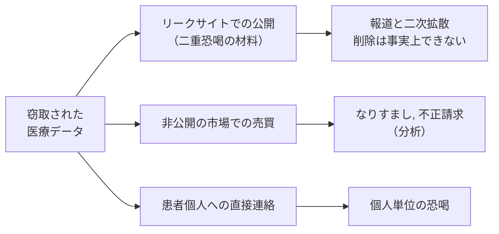

# 脅威アクターとリスク

誰が狙うのか、何のために狙うのか、どの情報が持ち出されるのか、その結果として何が起きるのか。
このページは、その四つを一枚で見渡すための概観である。
グループごとの手口は[ランサムウェアグループ別の TTPs](ransomware-groups.md)、打ち手は[医療機関向け防御プレイブック](defense-playbook.md)を参照してほしい。

> [!NOTE]
> **表記ルール**：本ページでは、**事実**（一次情報で確認できる内容。出典を併記する）、**報道ベース**（報道のみで確認でき、当事者の公表資料では裏付けが取れていない内容）、**分析**（筆者の解釈）を書き分ける。
> 出典は、当事者の公表資料、行政文書、CVE、ベンダアドバイザリなどの一次情報を優先して示す。

## 全体像

```mermaid
flowchart LR
    subgraph A["誰が"]
        A1["犯罪組織<br>（RaaS）"]
        A2["国家支援<br>グループ"]
        A3["内部者"]
        A4["個人, 未成年の<br>探索"]
    end
    subgraph B["何のために"]
        B1["金銭"]
        B2["諜報"]
        B3["主張, 妨害"]
        B4["好奇心, 腕試し"]
    end
    subgraph C["どうやって"]
        C1["ランサムウェア"]
        C2["脆弱性を突いた侵入"]
        C3["正規アカウントの悪用"]
        C4["委託先経由"]
    end
    subgraph D["何を"]
        D1["患者情報"]
        D2["診療の継続性"]
        D3["研究, 治験データ"]
        D4["製造 OT"]
    end
    subgraph E["何が起きるか"]
        E1["診療, 出荷の停止"]
        E2["公開, 売買"]
        E3["なりすまし, 詐欺"]
        E4["規制対応, 訴訟"]
    end
    A --> B --> C --> D --> E
```

動機が違っても、通る入り口は重なる。
そのため防御は、アクターの分類ではなく入り口の数で決まる。

---

## 誰が狙うか

| 類型 | 動機 | 能力 | 典型的な行為 | 医療での現れ方 |
|---|---|---|---|---|
| **犯罪組織（RaaS とアフィリエイト）** | 金銭 | 高い。侵入, 暗号化, 交渉が分業化されている | ランサムウェア、二重恐喝 | 電子カルテの停止。リークサイトでの患者情報公開 |
| **イニシャルアクセスブローカー** | 金銭 | 中。侵入までを担い、権限を転売する | VPN 脆弱性の悪用、漏えい認証情報の売買 | 売られた経路が数か月後に暗号化に使われる |
| **国家支援グループ** | 諜報、技術獲得 | 高い。長期潜伏を厭わない | 情報窃取、供給網侵害 | 製薬企業の創薬, 治験データ、ワクチン研究 |
| **ハクティビスト** | 政治的主張 | 低から中 | DDoS、Web 改ざん、暴露 | 病院サイトの停止。国際情勢に連動して標的が動く |
| **内部者** | 金銭、私怨、好奇心 | 与えられた権限に依存 | 権限を逸脱した閲覧、退職時の持ち出し | 著名人の診療録の閲覧。名簿の持ち出し |
| **個人の攻撃者, 小規模グループ** | 金銭、名声 | 低から中。既製ツールが中心 | 公開資産の探索、既知脆弱性の悪用 | 露出した PACS, 管理画面からの情報取得 |
| **好奇心による探索（学生, 未成年を含む）** | 好奇心、腕試し | 低い。検索サービスと公開ツールの範囲 | 露出機器の探索、初期パスワードでのログイン | 公開された医療機器の管理画面、院内ネットワークへの接続 |

> [!IMPORTANT]
> アトリビューション（攻撃の帰属）は、当事者または公的機関が公表している場合に限り記載する。
> 「どの組織が犯人か」の推測は、防御の意思決定をほとんど変えない。

### 好奇心による探索を軽く見ない

**事実**：インターネットから認証なしで到達できる PACS サーバが世界中に多数存在することが、複数の調査で報告されている。
露出した管理画面と既定の認証情報の組み合わせに到達するのに、高度な技術は要らない。

**出典**：[PACS と DICOM のセキュリティ](../medical-devices/pacs-dicom.md)に一次情報を整理している。[CISA ICS Medical Advisories](https://www.cisa.gov/news-events/ics-medical-advisories)

**分析**：攻撃者の技量が低くても、防御側の露出が大きければ侵入は成立する。
高度な組織だけを想定した対策は、最も安価な入り口を素通りさせる。

**事実**：日本では、他人の識別符号を用いてアクセス制御機能を回避する行為が、不正アクセス行為の禁止等に関する法律（平成 11 年法律第 128 号）第 3 条で禁じられている。
年齢による適用除外はなく、未成年も捜査, 補導の対象となる。

**出典**：同法第 3 条。検挙状況を含む国内の情勢は[警察庁の公表資料](https://www.npa.go.jp/publications/statistics/cybersecurity/index.html)にまとめられている。

**分析**：好奇心を咎めるだけでは同種の行為は減らない。
技術的関心の受け皿としては、[IPA の脆弱性関連情報の届出制度](https://www.ipa.go.jp/security/todokede/vuln/uketsuke.html)、CTF、[バグバウンティ](../bug-bounty/)といった合法な経路がある。
組織側にできるのは、外部からの報告を受け取る窓口を公開しておくことである。
窓口がなければ、善意の報告は届かず、悪意の探索だけが残る。

---

## 何を狙われるか

医療機関と製薬企業では、攻撃者が握ろうとする急所が違う。

| 観点 | 病院, 診療所 | 製薬企業 |
|---|---|---|
| **握られる急所** | 診療の継続性 | 研究開発の秘密と製造の継続性 |
| **主な動機** | 金銭（停止コストによる支払い圧力） | 金銭に加えて諜報 |
| **中心となる資産** | 電子カルテ、医事会計、部門システム、医療機器 | 治験データ、化合物, 製法、製造実行系（MES, OT） |
| **停止したときの影響** | 救急の受け入れ停止、手術延期、転院 | 出荷停止、医薬品供給の逼迫、治験の遅延 |
| **想定される主なアクター** | 犯罪組織、内部者、露出資産への日和見的な探索 | 犯罪組織、国家支援グループ、委託先経由の侵入 |
| **規制上の帰結** | 個人情報保護法に基づく報告、行政指導、[医療情報ガイドライン](../guidelines/)への適合の見直し | GxP 上の逸脱、当局査察、[データインテグリティ](../pharma/)の証明責任 |

### 狙われる情報

| 情報 | 具体例 | 攻撃者にとっての価値 |
|---|---|---|
| **基本識別情報** | 氏名、住所、生年月日、連絡先 | なりすましの土台。他の情報と結合するほど価値が上がる |
| **保険資格情報** | 被保険者番号、記号, 番号、資格情報 | 不正請求やなりすまし受診に使われうる（**分析**） |
| **病歴, 診断** | 傷病名、処方、検査結果、精神科, 感染症などの機微情報 | 変更も無効化もできない。個人への直接の恐喝材料になる |
| **請求明細（レセプト）** | 診療行為、点数、受診した医療機関と日付 | 病名がなくても、行動と病状をかなりの精度で再構成できる |
| **医用画像** | DICOM ファイル | ヘッダに患者情報が埋め込まれており、単体で個人を特定できる |
| **認証情報** | 職員アカウント、保守用アカウント、VPN 資格情報 | 次の侵入と水平展開の燃料。他の攻撃者へ転売される |
| **研究, 治験データ** | 症例報告、解析計画、未公表の結果 | 競争上の価値が高く、国家支援アクターの関心対象になる |
| **製造情報** | 製法、装置パラメータ、品質記録 | 模倣に使えるほか、OT を止めるための前提知識になる |

> [!NOTE]
> 患者情報は、漏えいしても本人が「変更」できない。
> クレジットカード番号は再発行できるが、病歴は再発行できない。
> この非可逆性が、医療データの恐喝材料としての価値を高めている（**分析**）。

---

## どう狙うか

| 行為 | 典型的な入り口 | 直接の帰結 | 検知, 緩和の軸 |
|---|---|---|---|
| **ランサムウェア（二重恐喝）** | VPN, 境界機器の脆弱性、漏えい認証情報、フィッシング | 業務停止とデータ公開の同時進行 | 暗号化前の潜伏期間で検知する。改ざん不可, オフラインのバックアップ |
| **脆弱性を突いた情報窃取** | 公開 Web, API、露出した医療系システムや機器 | 暗号化を伴わない静かな持ち出し | 公開資産の棚卸し。外向きの大量転送の監視 |
| **正規アカウントの悪用** | 漏えい認証情報、MFA 疲弊攻撃、ヘルプデスクへの詐取 | 正規操作に紛れるため気付きにくい | フィッシング耐性のある MFA。本人確認手順の厳格化 |
| **委託先, 供給網経由** | 保守回線、検査, 給食, 情報システム事業者との接続 | 自組織の対策を迂回される | 接続先の棚卸し、セグメント分離、契約上の要件 |
| **業務メール詐欺（BEC）** | メールアカウントの乗っ取り | 支払い先の書き換えによる金銭被害 | 送金手続きの多重承認。口座変更時の別経路確認 |
| **公開サービスの停止（DDoS など）** | 予約サイト、情報提供サイト | 診療そのものより広報, 受付が止まる | 上位回線, CDN 側での緩和。業務影響から優先度を判断する |
| **内部からの持ち出し** | 正規の権限 | 閲覧ログに残る権限逸脱 | アクセスログの定期レビュー。異動, 退職時の権限剥奪 |

攻撃の時系列と検知の機会は、[脅威アクターと TTPs](README.md#攻撃の流れ)の図に整理している。

---

## 何が起きるか

窃取されたデータは、複数の経路に同時に流れる。

被害は三つの層で現れる。

| 層 | 起きること |
|---|---|
| **患者** | 病歴, 受診歴の暴露。個人に対する直接の恐喝。なりすまし受診による診療録の汚染は、誤った治療につながりうる（**分析**） |
| **組織** | 診療, 出荷の停止と収益の喪失。復旧費用と代替運用の負担。報告義務と行政対応。訴訟, 信用の低下 |
| **社会** | 地域で代替できない医療機能の停止。医薬品供給の断絶。他院への患者集中による連鎖的な負荷 |

> [!WARNING]
> 支払いは復旧を保証しない。
> 復号ツールが正常に機能する保証も、窃取されたデータが削除される保証もない。
> 支払いの可否は、技術ではなく法務, 経営の判断として、事前に方針を決めておく（[身代金を支払うかの判断](defense-playbook.md#身代金を支払うかの判断)）。

---

## どこから手を付けるか

想定するアクターを絞り込む前に、開いている入り口を数えるほうが早い。

1. インターネットから到達できる自組織の資産を、機器と委託先を含めて列挙できるか
2. すべてのリモートアクセスに、フィッシング耐性のある MFA が掛かっているか
3. バックアップが暗号化, 削除の対象外に置かれ、復旧手順が実際に試験されているか

三つのいずれかに「いいえ」があるなら、アクターの分類より先にそこを埋める。
具体的な手順は[医療機関向け防御プレイブック](defense-playbook.md)にまとめている。

---

## 参考

| 資料 | 内容 |
|---|---|
| [CISA #StopRansomware](https://www.cisa.gov/stopransomware) | グループ別の TTPs と IOC を含む共同アドバイザリ |
| [HHS HC3](https://www.hhs.gov/about/agencies/asa/ocio/hc3/index.html) | 医療分野に特化した脅威情報とセクターアラート |
| [HHS OCR Breach Portal](https://ocrportal.hhs.gov/ocr/breach/breach_report.jsf) | 米国における 500 人以上の医療情報侵害の公開記録 |
| [ENISA](https://www.enisa.europa.eu/) | EU の医療分野を対象とした脅威ランドスケープ |
| [警察庁 サイバー空間をめぐる脅威の情勢](https://www.npa.go.jp/publications/statistics/cybersecurity/index.html) | 国内のランサムウェア被害報告の統計 |
| [厚生労働省 医療分野のサイバーセキュリティ対策](https://www.mhlw.go.jp/stf/seisakunitsuite/bunya/kenkou_iryou/iryou/johoka/cyber-security.html) | 国内医療機関向けの指針と注意喚起 |
| [IPA 脆弱性関連情報の届出受付](https://www.ipa.go.jp/security/todokede/vuln/uketsuke.html) | 発見した脆弱性を合法的に報告する窓口 |
| [個人情報保護委員会](https://www.ppc.go.jp/personalinfo/legal/) | 漏えい時の報告義務と要配慮個人情報の取り扱い |

---

[← 脅威アクターと TTPs](README.md) | [ランサムウェアグループ別の TTPs →](ransomware-groups.md) | [トップへ](../../README.md)
