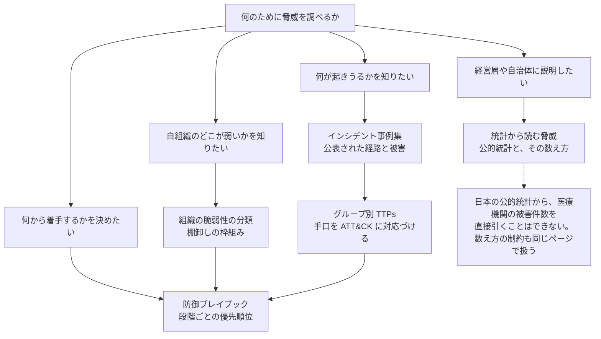

# 🎯 脅威

医療と製薬を狙う側を扱う。
誰が、どの動機で、どの入り口から入り、実際に何が起きたかを整理する。

## 構成

| セクション | 内容 |
|---|---|
| [インシデント事例集](incidents/) | 国内外の事例を年ごとに整理する。サイバー攻撃を主として、侵入経路、侵害範囲、診療への影響、公表された再発防止策を追跡する。サポート詐欺、システム障害、内部不正、記憶媒体の紛失と盗難などの事案も副として収録する |
| [脅威アクターと TTPs](actors/) | アクターと動機の整理、ランサムウェアグループの TTPs、攻撃と被害が連鎖する構造、防御プレイブック、組織の脆弱性の分類、窃取された医療情報の流通と二次被害 |
| [統計から読む脅威](statistics/) | 警察庁、IPA、個人情報保護委員会、厚生労働省と、FBI IC3、HHS OCR、ENISA の統計。医療分野がどの位置に現れるか、被害が統計に現れるまでの経路 |
| [完全性への攻撃と患者安全](integrity-attacks.md) | 漏えいでも停止でもない三つ目の型。値が変わったまま参照される状態と、その検知 |

## この群の位置づけ

攻撃側の分類から入ると、対策の優先順位を誤りやすい。
金銭目的のランサムウェア、諜報目的の国家支援グループ、政治的主張を伴う攻撃で動機は分かれるが、通る入り口は重なる。
そのため、[脅威アクターとリスク](actors/actors-and-risks.md) はアクターの分類ではなく入り口の数を出発点に置いている。

## 目的別の読み順

三つのセクションは、それぞれ違う問いに答える。
手元の目的に近いものから読むと、遠回りが減る。

技術領域ごとの攻撃面は [技術領域](../technology/)、検証の手順は [検証と実務](../practice/)、侵害が起きたあとの手順は [インシデント対応と事業継続](../response/) にまとめている。

---

[トップへ](../../README.md)
