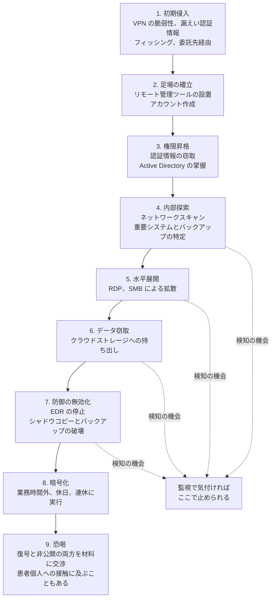

# 🎯 脅威アクターと TTPs

医療機関を標的とするランサムウェアグループについて、戦術, 技術, 手順（TTPs）を整理し、対応する防御策と結びつける。

> [!NOTE]
> **表記ルール**：本ページでは、**事実**（一次情報で確認できる内容。出典を併記する）、**報道ベース**（報道のみで確認でき、当事者の公表資料では裏付けが取れていない内容）、**分析**（筆者の解釈）を書き分ける。
> 出典は、当事者の公表資料、行政文書、CVE、ベンダアドバイザリなどの一次情報を優先して示す。

## このセクションの方針

攻撃グループの名前を覚えることに意味はない。
グループは離合集散し、名前を変え、テイクダウンされ、また現れる。
一方で **使われる手口はほとんど変わらない**。
そのため本セクションでは、グループ名ではなく手口を軸に整理し、防御策と対応づける。

> [!IMPORTANT]
> アトリビューション（攻撃の帰属）は、当事者または公的機関が公表している場合に限り記載する。
> 報道のみで語られている帰属は「報道ベース」と明記する。

## 一覧

- [脅威アクターとリスク](actors-and-risks.md)
- [ランサムウェアグループ別の TTPs](ransomware-groups.md)
- [医療機関向け防御プレイブック](defense-playbook.md)

## 医療が狙われる理由

| 攻撃者から見た条件 | 帰結 |
|---|---|
| 停止コストが極端に高い | 支払い圧力が生まれる。交渉が短期で決着しやすい |
| 攻撃対象領域が広い | 医療機器、委託先、遠隔保守など、侵入口の選択肢が多い |
| 復旧が難しい | 電子カルテの再構築には数か月かかる。バックアップからの復旧も検証に時間を要する |
| データの価値が高い | 診療情報は無効化できず、二重恐喝の材料になる |
| 検知能力が限られる | セキュリティ専任者が不在の医療機関が多い |

一部のグループは「医療機関は攻撃しない」と表明することがあるが、実際にはその表明と異なる攻撃が確認されている。
表明を防御の前提に置くわけにはいかない。

## 攻撃の流れ

医療機関に対するランサムウェア攻撃は、次の流れをたどることが多い。

[1] から [8] までには、数日から数か月の期間がある。
アイルランドの HSE の事例では、この潜伏期間中に検知の機会が複数回あったことが事後レビューで指摘されている。
防御の焦点は、暗号化の阻止ではなく、この潜伏期間での検知に置かれる。

---

[トップへ](../../../README.md)
