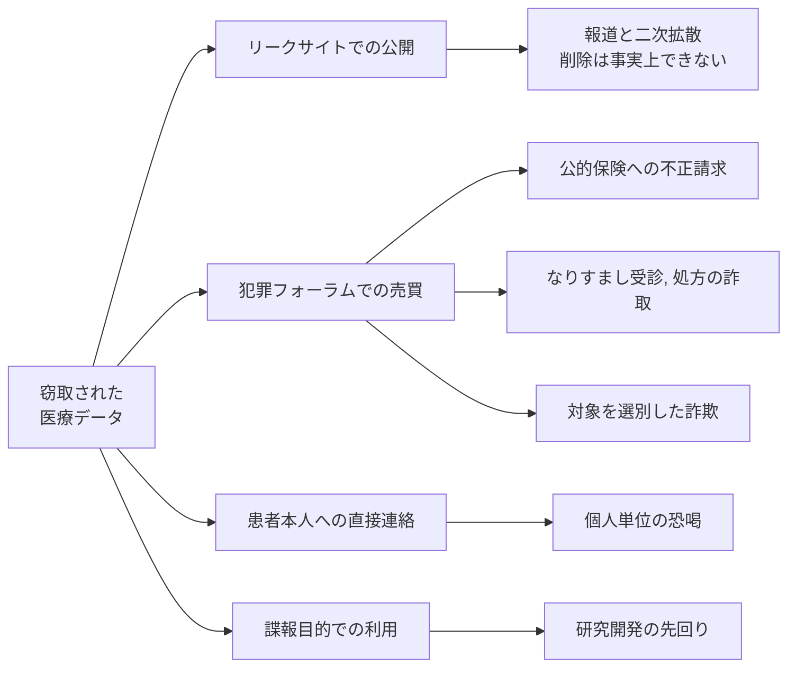

# 脅威アクターとリスク

誰が狙うのか、何のために狙うのか、どの情報が持ち出されるのか、その結果として何が起きるのか。
このページは、その四つを一枚で見渡すための概観である。
グループごとの手口は[ランサムウェアグループ別の TTPs](ransomware-groups.md)、打ち手は[医療機関向け防御プレイブック](defense-playbook.md)を参照してほしい。

> [!NOTE]
> **表記ルール**：本ページでは、**事実**（一次情報で確認できる内容。出典を併記する）、**報道ベース**（報道のみで確認でき、当事者の公表資料では裏付けが取れていない内容）、**分析**（筆者の解釈）を書き分ける。
> 出典は、当事者の公表資料、行政文書、CVE、ベンダアドバイザリなどの一次情報を優先して示す。

## 全体像

```mermaid
flowchart LR
    subgraph A["誰が"]
        A1["犯罪組織<br>（RaaS）"]
        A2["国家支援<br>グループ"]
        A3["内部者"]
        A4["個人, 未成年の<br>探索"]
    end
    subgraph B["何のために"]
        B1["金銭"]
        B2["諜報"]
        B3["主張, 妨害"]
        B4["好奇心, 腕試し"]
    end
    subgraph C["どうやって"]
        C1["ランサムウェア"]
        C2["脆弱性を突いた侵入"]
        C3["正規アカウントの悪用"]
        C4["委託先経由"]
    end
    subgraph D["何を"]
        D1["患者情報"]
        D2["診療の継続性"]
        D3["研究, 治験データ"]
        D4["製造 OT"]
    end
    subgraph E["何が起きるか"]
        E1["診療, 出荷の停止"]
        E2["公開, 売買"]
        E3["なりすまし受診, 不正請求"]
        E4["規制対応, 訴訟"]
    end
    A --> B --> C --> D --> E
```

動機が違っても、通る入り口は重なる。
そのため防御は、アクターの分類ではなく入り口の数で決まる。

---

## 誰が狙うか

| 類型 | 動機 | 能力 | 典型的な行為 | 医療での現れ方 |
|---|---|---|---|---|
| **犯罪組織（RaaS とアフィリエイト）** | 金銭 | 高い。侵入, 暗号化, 交渉が分業化されている | ランサムウェア、二重恐喝 | 電子カルテの停止。リークサイトでの患者情報公開 |
| **イニシャルアクセスブローカー** | 金銭 | 中。侵入までを担い、権限を転売する | VPN 脆弱性の悪用、漏えい認証情報の売買 | 売られた経路が数か月後に暗号化に使われる |
| **国家支援グループ** | 諜報、技術獲得 | 高い。長期潜伏を厭わない | 情報窃取、供給網侵害 | 製薬企業の創薬, 治験データ、ワクチン研究 |
| **ハクティビスト** | 政治的主張 | 低から中 | DDoS、Web 改ざん、暴露 | 病院サイトの停止。国際情勢に連動して標的が動く |
| **内部者** | 金銭、私怨、好奇心 | 与えられた権限に依存 | 権限を逸脱した閲覧、退職時の持ち出し | 著名人の診療録の閲覧。名簿の持ち出し |
| **個人の攻撃者, 小規模グループ** | 金銭、名声 | 低から中。既製ツールが中心 | 公開資産の探索、既知脆弱性の悪用 | 露出した PACS, 管理画面からの情報取得 |
| **好奇心による探索（学生, 未成年を含む）** | 好奇心、腕試し | 低い。検索サービスと公開ツールの範囲 | 露出機器の探索、初期パスワードでのログイン | 公開された医療機器の管理画面、院内ネットワークへの接続 |

> [!IMPORTANT]
> アトリビューション（攻撃の帰属）は、当事者または公的機関が公表している場合に限り記載する。
> 「どの組織が犯人か」の推測は、防御の意思決定をほとんど変えない。

### 好奇心による探索を軽く見ない

**事実**：インターネットから認証なしで到達できる PACS サーバが世界中に多数存在することが、複数の調査で報告されている。
露出した管理画面と既定の認証情報の組み合わせに到達するのに、高度な技術は要らない。

**出典**：[PACS と DICOM のセキュリティ](../../technology/medical-devices/pacs-dicom.md)に一次情報を整理している。[CISA ICS Medical Advisories](https://www.cisa.gov/news-events/ics-advisories)

**分析**：攻撃者の技量が低くても、防御側の露出が大きければ侵入は成立する。
高度な組織だけを想定した対策は、最も安価な入り口を素通りさせる。

**事実**：日本では、他人の識別符号を用いてアクセス制御機能を回避する行為が、不正アクセス行為の禁止等に関する法律（平成 11 年法律第 128 号）第 3 条で禁じられている。
年齢による適用除外はなく、未成年も捜査, 補導の対象となる。

**出典**：同法第 3 条。
検挙状況を含む国内の情勢は[警察庁の公表資料](https://www.npa.go.jp/publications/statistics/cybersecurity/index.html)にまとめられている。

**分析**：好奇心を咎めるだけでは同種の行為は減らない。
技術的関心の受け皿としては、[IPA の脆弱性関連情報の届出制度](https://www.ipa.go.jp/security/todokede/vuln/uketsuke.html)、CTF、[バグバウンティ](../../practice/bug-bounty/)といった合法な経路がある。
組織側にできるのは、外部からの報告を受け取る窓口を公開しておくことである。
窓口がなければ、善意の報告は届かず、悪意の探索だけが残る。

---

## 何を狙われるか

医療機関と製薬企業では、攻撃者が握ろうとする急所が違う。

| 観点 | 病院, 診療所 | 製薬企業 |
|---|---|---|
| **握られる急所** | 診療の継続性 | 研究開発の秘密と製造の継続性 |
| **主な動機** | 金銭（停止コストによる支払い圧力） | 金銭に加えて諜報 |
| **中心となる資産** | 電子カルテ、医事会計、部門システム、医療機器 | 治験データ、化合物, 製法、製造実行系（MES, OT） |
| **停止したときの影響** | 救急の受け入れ停止、手術延期、転院 | 出荷停止、医薬品供給の逼迫、治験の遅延 |
| **想定される主なアクター** | 犯罪組織、内部者、露出資産への日和見的な探索 | 犯罪組織、国家支援グループ、委託先経由の侵入 |
| **規制上の帰結** | 個人情報保護法に基づく報告、行政指導、[医療情報ガイドライン](../../guidelines/)への適合の見直し | GxP 上の逸脱、当局査察、[データインテグリティ](../../reference/pharma/)の証明責任 |

### 狙われる情報

| 情報 | 具体例 | 攻撃者にとっての価値 |
|---|---|---|
| **基本識別情報** | 氏名、住所、生年月日、連絡先 | なりすましの土台。他の情報と結合するほど価値が上がる |
| **保険資格情報** | 被保険者番号、記号, 番号、資格情報 | 盗んだ受給者番号を使った不正請求が米国で摘発されている（[何が起きるか](#何が起きるか)） |
| **病歴, 診断** | 傷病名、処方、検査結果、精神科, 感染症などの機微情報 | 変更も無効化もできない。個人への直接の恐喝材料になる |
| **請求明細（レセプト）** | 診療行為、点数、受診した医療機関と日付 | 病名がなくても、行動と病状をかなりの精度で再構成できる |
| **医用画像** | DICOM ファイル | ヘッダに患者情報が埋め込まれており、単体で個人を特定できる |
| **認証情報** | 職員アカウント、保守用アカウント、VPN 資格情報 | 次の侵入と水平展開の燃料。他の攻撃者へ転売される |
| **研究, 治験データ** | 症例報告、解析計画、未公表の結果 | 競争上の価値が高く、国家支援アクターの関心対象になる |
| **製造情報** | 製法、装置パラメータ、品質記録 | 模倣に使えるほか、OT を止めるための前提知識になる |

> [!NOTE]
> 患者情報は、漏えいしても本人が「変更」できない。
> クレジットカード番号は再発行できるが、病歴は再発行できない。
> この非可逆性が、医療データの恐喝材料としての価値を高めている（**分析**）。

---

## どう狙うか

| 行為 | 典型的な入り口 | 直接の帰結 | 検知, 緩和の軸 |
|---|---|---|---|
| **ランサムウェア（二重恐喝）** | VPN, 境界機器の脆弱性、漏えい認証情報、フィッシング | 業務停止とデータ公開の同時進行 | 暗号化前の潜伏期間で検知する。改ざん不可, オフラインのバックアップ |
| **脆弱性を突いた情報窃取** | 公開 Web, API、露出した医療系システムや機器 | 暗号化を伴わない静かな持ち出し | 公開資産の棚卸し。外向きの大量転送の監視 |
| **正規アカウントの悪用** | 漏えい認証情報、MFA 疲弊攻撃、ヘルプデスクへの詐取 | 正規操作に紛れるため気付きにくい | フィッシング耐性のある MFA。本人確認手順の厳格化 |
| **委託先, 供給網経由** | 保守回線、検査, 給食, 情報システム事業者との接続 | 自組織の対策を迂回される | 接続先の棚卸し、セグメント分離、契約上の要件 |
| **業務メール詐欺（BEC）** | メールアカウントの乗っ取り | 支払い先の書き換えによる金銭被害 | 送金手続きの多重承認。口座変更時の別経路確認 |
| **公開サービスの停止（DDoS など）** | 予約サイト、情報提供サイト | 診療そのものより広報, 受付が止まる | 上位回線, CDN 側での緩和。業務影響から優先度を判断する |
| **内部からの持ち出し** | 正規の権限 | 閲覧ログに残る権限逸脱 | アクセスログの定期レビュー。異動, 退職時の権限剥奪 |

攻撃の時系列と検知の機会は、[脅威アクターと TTPs](README.md#攻撃の流れ)の図に整理している。

---

## 何が起きるか

窃取されたデータは、一つの経路をたどって終わるのではなく、複数の経路に同時に流れる。
恐喝の材料として使われている最中に、同じデータが別の犯罪者へ売られ、数年後の詐欺に再利用される。

### 窃取データが現金に変わる経路

| 経路 | 攻撃者が行うこと | 攻撃者にとっての収入 | この経路を細くする打ち手 |
|---|---|---|---|
| **組織への恐喝** | 暗号化と公開予告を同時に突きつけ、復旧費用と規制対応費用の合計より安く見える額を提示する | 身代金。RaaS では運営者とアフィリエイトで分配する | 復旧時間の短縮。改ざん不可のバックアップ。支払い方針の事前決定 |
| **患者個人への恐喝** | 患者本人に連絡し、記録の非公開や削除と引き換えに少額を求める | 一人あたりは小さいが、対象が数万人規模になる | 公表と同時に患者向けの問い合わせ窓口と注意喚起を出す |
| **転売と再利用** | 認証情報とデータを犯罪フォーラムで売る。使用後に別の買い手へ再販する | 販売収入。同じ在庫を何度も売れる | 漏えい後の資格情報の一斉失効。露出資産の棚卸し |
| **公的保険への不正請求** | 盗んだ受給者番号で、提供していない医療材料や検査を請求する | 保険者から支払われる診療報酬 | 資格確認時の本人確認。請求内容の突合と患者本人への通知 |
| **なりすまし受診と処方の詐取** | 他人の資格で受診し、薬剤や医療材料を得て転売する | 薬剤の転売収入と医療費の踏み倒し | 本人確認を伴う資格確認。処方履歴の照合 |
| **対象を選別した詐欺** | 傷病名と受診歴で対象を絞り、医療費や保険の名目で接触する | 詐取した現金 | 患者への手口の周知。医療機関を名乗る連絡の真偽を確かめる手段の提供 |
| **諜報** | 治験データ、製法を持ち出し、自国の開発期間を縮める | 研究開発費の節約と競争上の優位 | 研究データの分離。外部への大量転送の監視 |

### 公的保険への不正請求

**事実**：米司法省と CMS が公表した 2025 年の医療詐欺一斉摘発では、324 名が総額 146 億ドルの請求に関与したとして訴追された。
このうちイリノイ州北部地区の事案では、窃取と欺瞞的な勧誘によって取得したメディケア受給者の識別番号と医療情報が検査会社と医療機器業者に販売され、7 億 300 万ドルの虚偽請求に使われたとされる。
受給者が同意したかのような音声を生成 AI で作成していたことも、あわせて公表されている。

**出典**：[CMS「National Health Care Fraud Takedown Results in 324 Defendants Charged in Connection with Over $14.6 Billion in Alleged Fraud」](https://www.cms.gov/newsroom/press-releases/national-health-care-fraud-takedown-results-324-defendants-charged-connection-over-14-6-billion)

**分析**：この構図が成り立つのは、受給者番号と本人情報の組み合わせだけで請求が受理される経路があるためである。
番号は本人が異変に気付いて再発行を求めない限り有効なままなので、窃取から請求までに時間が空いても価値が落ちない。
攻撃者から見た患者名簿は、使用期限のない請求権の束に近い。

### 患者個人への恐喝

**事実**：フィンランドの心理療法サービス Vastaamo の事件では、患者記録の公開を材料に患者本人が直接恐喝され、実行者は訴追されて 2024 年に有罪判決を受けた（[GL-2020-03 Vastaamo](../incidents/global/2020-timeline.md#GL-2020-03)に経緯と一次情報を整理している）。

**報道ベース**：控訴審では、2 万件を超える加重恐喝未遂を含む罪について 6 年 11 か月の刑が言い渡されたと報じられている。
米オクラホマ州の Integris Health の事案では、患者に送られた恐喝メールが、自身のデータの閲覧に 3 ドル、削除に 50 ドルを求めたと報じられている。

**出典**：[Yle（フィンランド公共放送）](https://yle.fi/a/74-20212466)、[BleepingComputer](https://www.bleepingcomputer.com/news/security/integris-health-patients-get-extortion-emails-after-cyberattack/)

**分析**：組織が支払いを拒んだあとでも、攻撃者には患者一人ひとりから少額を回収する余地が残る。
恐喝は、組織との交渉が決裂した時点では終わらない。
インシデント対応計画が想定する期間は、システム復旧の完了までではなく、患者への接触が止むまでで引く必要がある。

### 転売と再利用

**事実**：Europol の IOCTA 2025 は、盗まれたデータが複数の犯罪者の間で何度も売買され、使用後に再販されること、その結果として同一の被害者が複数のアクターから攻撃を受けうることを指摘している（"Data may be sold and purchased several times by different criminal actors, or resold after use. This can result in multiple actors launching attacks against the same victim."）。
同報告書は、イニシャルアクセスブローカーが広告するアクセスの価格が 2024 年に約 50% 上昇したとする分析を引用する一方、ブローカーが在庫の価値を誇張し、実際には偽物や古い漏えいデータであることもあると述べている。

**出典**：[Europol, Steal, deal and repeat（IOCTA 2025）](https://www.europol.europa.eu/cms/sites/default/files/documents/Steal-deal-repeat-IOCTA_2025.pdf)

**分析**：医療データの単価が高いという説明は、売り手側の主張を出所とすることが多い。
防御側が見積もるべきなのは単価ではなく、同じデータが繰り返し使われることによる再攻撃の確率である。
一度侵害を受けた組織は、その後も侵入実績のある標的として名簿に残る。

### 診療録の汚染

**事実**：HHS OIG は、医療 ID 窃取について、誤った情報が診療録に入り込んだ場合に極端な状況では生命に関わりうると注意喚起している（"In extreme circumstances, it could be life-threatening if the wrong information ends up in your medical record."）。

**出典**：[HHS OIG「Medical Identity Theft & Medicare Fraud」](https://oig.hhs.gov/documents/root/235/OIG_Med_Id_Theft_Brochure.pdf)

**分析**：他人の受診によって血液型、アレルギー、既往が診療録に混入すると、以後の治療判断がその記録を前提に行われる。
金銭被害は事後に取り戻せるが、汚染された診療録は、患者と医療機関の双方が汚染に気付くまで訂正されない。
漏えいの影響を数えるときの起点は、情報が出た時点ではなく、その情報が別人の医療行為として記録に書き戻された時点になる。

### 日本で成立しやすい経路

**分析**：公的医療保険は現物給付であり、診療報酬の請求は医療機関が保険者に対して行う。
個人が被保険者番号だけで直接請求する米国型の不正請求は、この構造では成立しにくい。
国内で成立しやすいのは、他人の資格を使った受診と処方の詐取、民間の医療保険への給付金請求の裏付け作り、電話による詐欺の信用付けの三つである。

**事実**：警察庁が公表した令和 7 年の確定値では、特殊詐欺の認知件数は 27,832 件、被害額は 1,423.1 億円である。
うち還付金詐欺は 3,179 件、61.9 億円で、還付金詐欺では接触手段の 9 割以上が電話である。
警察庁は還付金詐欺を「税金還付等に必要な手続きを装って被害者に ATM を操作させ、口座間送金により財産上の不法の利益を得る手口」と定義している。
また警察庁は、犯行グループから押収した名簿に登載されている者に対して、コールセンターを用いた注意喚起を実施している。

**出典**：[警察庁「令和７年における特殊詐欺及びＳＮＳ型投資・ロマンス詐欺の認知・検挙状況等について（確定値）」](https://www.npa.go.jp/bureau/criminal/souni/tokusyusagi/hurikomesagi_toukei2025.pdf)、[警察庁 SOS47 手口の解説](https://www.npa.go.jp/bureau/safetylife/sos47/case/)

**分析**：名簿が犯行の前提になっている以上、名簿の質は詐欺の成功率に直結する。
傷病名と受診歴を握る発信者は、還付の口実に具体性を与えられる。
「先月の入院分の払い戻し」と言える相手と、言えない相手とでは、電話が続く確率が変わる。
ただし、医療機関からの漏えいが国内の電話詐欺に使われたと公表された事例は確認できていない。
ここで示したのは、既存の詐欺類型に医療データが接続しうる筋道であって、接続した事例の報告ではない。

### 攻撃者側の採算

**事実**：米司法省の公表によれば、LockBit は 120 か国以上で 2,500 を超える被害者を出し、少なくとも 5 億ドルの身代金を得た。
運営者は各支払いの 20% を、攻撃を実行したアフィリエイトが残りの 80% を受け取る配分であり、運営者個人が 1 億ドル以上を受領したとされる。

**出典**：[米司法省「U.S. Charges Russian National with Developing and Operating LockBit Ransomware」](https://www.justice.gov/usao-nj/pr/us-charges-russian-national-developing-and-operating-lockbit-ransomware)

**分析**：この分業により、実行役はマルウェアの開発費を負担せず、運営者は個々の侵入の失敗リスクを負わない。
どの標的を選ぶかは実行役の判断に委ねられるため、選ばれるのは技術的に手強い標的ではなく、短期間で支払いに至る確率が高い標的になる。
医療機関がその条件に合うのは、停止が患者の安全に直結し、交渉に使える時間が短いためである。

**事実**：国内では、大阪急性期, 総合医療センターの事例で全面復旧までに約 2 か月半を要し、復旧費用と診療制限による逸失利益の規模が調査委員会報告書に示されている。

**出典**：[大阪急性期, 総合医療センター「調査委員会報告書について」](https://www.gh.opho.jp/incident/1.html)、経緯は[JP-2022-01 大阪急性期・総合医療センター](../incidents/japan/2022-timeline.md#JP-2022-01)に整理している。

**報道ベース**：米国では、患者の医用画像を含むデータを公開された Lehigh Valley Health Network が 6,500 万ドルの集団訴訟和解に応じたと報じられている。
Change Healthcare の親会社は、2024 年の対応費用を 31 億ドルと開示したと報じられている。

**出典**：[The Record](https://therecord.media/lehigh-valley-health-network-data-breach-settlement)、[TechCrunch](https://techcrunch.com/2025/01/24/unitedhealth-confirms-190-million-americans-affected-by-change-healthcare-data-breach/)

**分析**：攻撃者にとっての適正な要求額は、被害組織が支払いを拒んだ場合に負う費用の下側にある。
停止と訴訟で失う額が大きい組織ほど、身代金は相対的に安い出費として提示できるため、要求額の上限も上がる。
復旧時間の短縮は、技術的な回復力の問題であると同時に、相手が付けられる値段を下げる手段でもある。

**分析**：攻撃者側で費用がかかるのは、初期アクセスを得るまでである。
一度中に入れば、恐喝も転売も再利用も同じデータから繰り返せるため、経路を一つ増やす費用はほとんど増えない。
防御側は経路ごとに個別の対策を積み上げるため、費用の増え方が逆になる。

### 被害が現れる三つの層

| 層 | 起きること |
|---|---|
| **患者** | 病歴と受診歴の暴露。個人に対する直接の恐喝。診療録の汚染による治療判断の誤り。就労や人間関係への波及 |
| **組織** | 診療, 出荷の停止と収益の喪失。復旧費用と代替運用の負担。報告義務と行政対応。集団訴訟と信用の低下 |
| **社会** | 地域で代替できない医療機能の停止。医薬品供給の断絶。他院への患者集中による連鎖的な負荷 |

> [!WARNING]
> 支払いは復旧を保証しない。
> 復号ツールが正常に機能する保証も、窃取されたデータが削除される保証もない。
> 前掲のとおり、データは支払いの有無にかかわらず再販されうる。
> 支払いの可否は、技術ではなく法務, 経営の判断として、事前に方針を決めておく（[身代金を支払うかの判断](defense-playbook.md#身代金を支払うかの判断)）。

---

## どこから手を付けるか

想定するアクターを絞り込む前に、開いている入り口を数えるほうが早い。

1. インターネットから到達できる自組織の資産を、機器と委託先を含めて列挙できるか
2. すべてのリモートアクセスに、フィッシング耐性のある MFA が掛かっているか
3. バックアップが暗号化, 削除の対象外に置かれ、復旧手順が実際に試験されているか

三つのいずれかに「いいえ」があるなら、アクターの分類より先にそこを埋める。
具体的な手順は[医療機関向け防御プレイブック](defense-playbook.md)にまとめている。

---

## 参考

| 資料 | 内容 |
|---|---|
| [CISA #StopRansomware](https://www.cisa.gov/stopransomware) | グループ別の TTPs と IOC を含む共同アドバイザリ |
| [HHS HC3](https://www.hhs.gov/about/agencies/asa/ocio/hc3/index.html) | 医療分野に特化した脅威情報とセクターアラート |
| [HHS OCR Breach Portal](https://ocrportal.hhs.gov/ocr/breach/breach_report.jsf) | 米国における 500 人以上の医療情報侵害の公開記録 |
| [ENISA](https://www.enisa.europa.eu/) | EU の医療分野を対象とした脅威ランドスケープ |
| [Europol IOCTA](https://www.europol.europa.eu/publications-events/main-reports/iocta-report) | 窃取データの売買と再利用に関する EU の年次評価 |
| [警察庁 サイバー空間をめぐる脅威の情勢](https://www.npa.go.jp/publications/statistics/cybersecurity/index.html) | 国内のランサムウェア被害報告の統計 |
| [厚生労働省 医療分野のサイバーセキュリティ対策](https://www.mhlw.go.jp/stf/seisakunitsuite/bunya/kenkou_iryou/iryou/johoka/cyber-security.html) | 国内医療機関向けの指針と注意喚起 |
| [IPA 脆弱性関連情報の届出受付](https://www.ipa.go.jp/security/todokede/vuln/uketsuke.html) | 発見した脆弱性を合法的に報告する窓口 |
| [個人情報保護委員会](https://www.ppc.go.jp/personalinfo/legal/) | 漏えい時の報告義務と要配慮個人情報の取り扱い |

---

[← 脅威アクターと TTPs](README.md) | [ランサムウェアグループ別の TTPs →](ransomware-groups.md) | [トップへ](../../../README.md)
