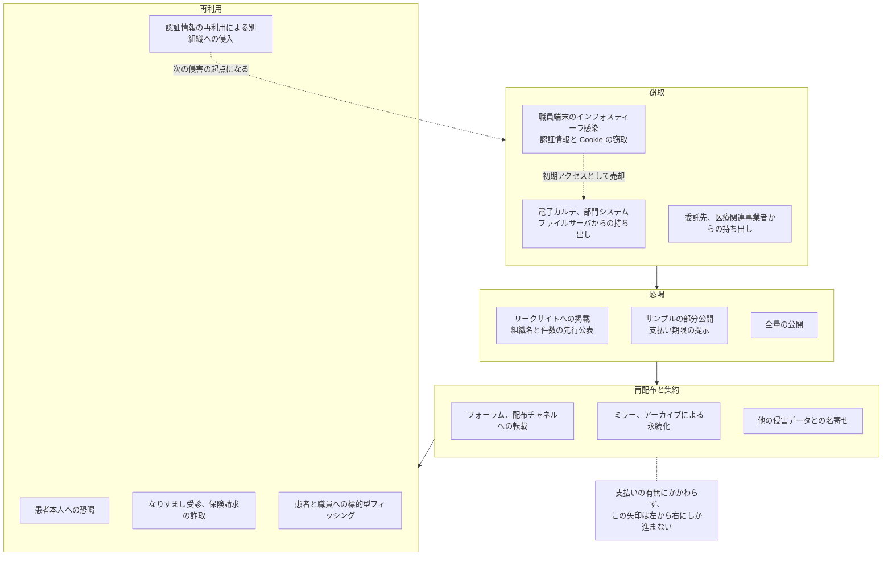
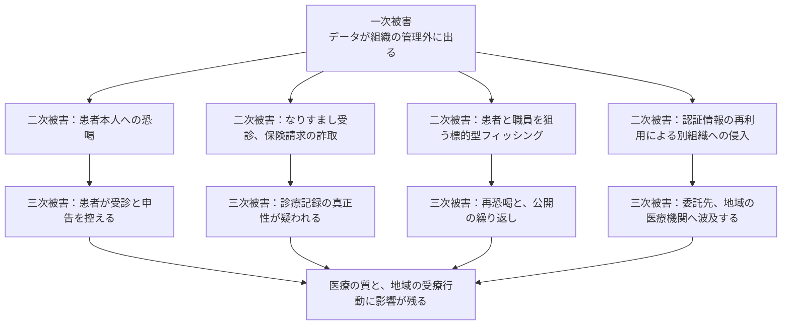

# ダークウェブと医療情報

窃取された診療情報は、持ち出された時点で被害が終わるわけではない。
リークサイトに掲載され、別の場に再配布され、他の侵害で得られたデータと突き合わされ、次の攻撃の材料になる。
本ページは、この流通の構造、そこから生じる被害の段、防御側が実際に打てる手の順に扱う。

> [!NOTE]
> **表記ルール**：本ページでは、**事実**（一次情報で確認できる内容。出典を併記する）、**報道ベース**（報道や第三者の集計のみで確認でき、当事者の公表資料では裏付けが取れていない内容）、**分析**（筆者の解釈）を書き分ける。
> 出典は、当事者の公表資料、行政文書、CVE、ベンダアドバイザリなどの一次情報を優先して示す。

本ページと近い主題を扱うページが四つある。
攻撃がどう進み、どこまで広がるかは [医療機関で連鎖するランサムウェア攻撃](ransomware-chain.md)、グループごとの手口は [ランサムウェアグループ別の TTPs](ransomware-groups.md)、侵害後の初動と届出は [インシデント対応と事業継続](../../response/)、着手する対策の順序は [医療機関向け防御プレイブック](defense-playbook.md) にある。
分担としては、持ち出されたあとの経過を本ページが引き受ける。

---

## 用語の整理

| 用語 | 内容 |
|---|---|
| **ダークウェブ** | Tor などの匿名化ネットワーク上でのみ到達できるサービス群。技術的には「到達方法」を指す言葉であり、犯罪専用の空間という意味ではない |
| **リークサイト** | ランサムウェアグループが、窃取したデータの一覧やサンプルを公開して支払いを迫るために運営するサイト。多くは Tor 上に置かれる |
| **フォーラム、マーケット** | 認証情報やデータを売買、交換する場。Tor 上に限らず、通常の Web やメッセージアプリのチャネルにも分散する |
| **インフォスティーラのログ** | 端末に感染したマルウェアが吸い上げた、認証情報、Cookie、セッション情報、ブラウザ保存データの一式。侵入の元手として売買される |
| **初期アクセスブローカー（IAB）** | 侵入経路を確保し、それ自体を商品として売る役割。侵入と、侵入後の展開が分業になっている |

> [!IMPORTANT]
> 「ダークウェブ」は場所の総称であって、脅威の種類ではない。
> 同じデータが、Tor 上のリークサイト、通常の Web の掲示板、メッセージアプリの配布チャネルに同時に存在することは珍しくない。
> 防御側が追うべきなのは所在ではなく、複製の経路と、再利用する側の動機である。

---

## 医療情報が狙われる条件

攻撃者から見た医療情報の特性は、決済情報と比べると分かりやすい。

| 観点 | クレジットカード番号 | 診療情報 |
|---|---|---|
| 無効化 | 再発行で無効にできる | 病名、検査結果、家族歴は無効化できない |
| 有効期間 | 有効期限で失効する | 本人が生存する限り価値が落ちにくい |
| 悪用の検知 | 不正利用検知の仕組みが業界に整備されている | 悪用されても本人が気付く経路がほとんどない |
| 含まれる情報 | 決済に必要な項目 | 氏名、生年月日、住所、保険者番号、連絡先が診療内容と結び付いた状態 |
| 被害の性質 | 金銭的損失に収まりやすい | 就労、保険、家族関係、社会的評価に及ぶ |

**分析**：医療情報の漏えいは、事後の無効化で被害を打ち切れない。
カード番号は止められるが、精神科の受診歴は止められない。
したがって、対策の重心は流出後の対応ではなく、持ち出される前の検知に置かざるをえない。

**分析**：もう一つの特性は、医療情報が **名寄せの起点** になることである。
氏名、生年月日、住所、保険者番号が一組で揃うため、他の侵害で得られたデータと突き合わせる基準として使いやすい。
単体の価値ではなく、他のデータを束ねる鍵としての価値が付く。

### 価格の数字を引用するときの注意

**事実**：「医療記録は 1 件あたり数百ドルで売買される」という数字が広く引用されているが、その多くは民間事業者による推計であり、算出方法と観測範囲が示されていない。
同じ対象について、1 件あたり 250 ドルとする推計と 1000 ドルとする推計が併存している（[Fierce Healthcare の整理](https://www.fiercehealthcare.com/hospitals/industry-voices-forget-credit-card-numbers-medical-records-are-hottest-items-dark-web)、[Experian の解説](https://www.experian.com/blogs/ask-experian/heres-how-much-your-personal-information-is-selling-for-on-the-dark-web/)）。

**分析**：価格は、データの完全性、鮮度、対象地域、売り手の評判で変わる。
さらに、二重恐喝で公開されるデータには値が付かない。
支払われなかった結果として無償で公開されるためである。
投資の根拠に単価を使うと、数字の出所を問われた時点で議論が止まる。
経営層に説明するときは、単価ではなく、無効化できないという性質、名寄せの起点になるという性質、[診療停止のコスト](../../governance/)を根拠に置くほうが崩れにくい。

---

## 流通の経路

窃取から再利用までは、担い手が分かれた一本の流れになっている。

**事実**：認証情報の売買は、個人の手作業ではなく市場として運営されていた。
2023 年 4 月 4 日、FBI とオランダ警察が主導した Operation Cookie Monster により Genesis Market が摘発され、テイクダウン時点で 150 万件規模の端末単位の出品と 8000 万件規模の認証情報が扱われていたことが公表されている。
出品されたデータは、AZORult、Raccoon、RedLine といったインフォスティーラによって収集されたものであった（[Eurojust の発表](https://www.eurojust.europa.eu/news/takedown-online-market-sold-stolen-account-credentials-Operation-Cookie-Monster)）。

**分析**：この摘発が示すのは、盗まれた認証情報が「どこかに漏れている」状態ではなく、検索して買える在庫として並んでいたという構造である。
一つの市場が閉じても在庫は別の場に移る。
したがって防御側の前提は、自組織の認証情報が既に誰かの在庫にあるかもしれない、という側に置くことになる。

**参考（民間調査）**：SpyCloud の 2023 年の報告では、北米と欧州のランサムウェア被害組織のうち約 30% で、事案に先行してインフォスティーラの感染が観測されたとされる（[SpyCloud 2023 Ransomware Defense Report](https://spycloud.com/resource/report/2023-ransomware-defense-report/)）。
民間事業者が自社の観測データを基に算出した数字であり、母集団の取り方に依存する点に注意がいる。

**事実**：米国の医療分野に対する認証情報の窃取については、HHS HC3 が医療機関向けの注意喚起を公表している（[Credential Harvesting アナリストノート](https://www.hhs.gov/sites/default/files/credential-harvesting-analyst-note-tlpclear.pdf)）。

---

### 二重恐喝がかける二つの圧力

二重恐喝は一つの脅しではなく、性質の違う二つの圧力を同時にかける手法である。
防御側の投資も、この二つに別々に対応する。

| 圧力 | 内容 | 効く対策 | 効かない対策 |
|---|---|---|---|
| 暗号化による停止 | 診療が続けられなくなる | オフラインバックアップ、セグメンテーション、縮退運用の手順 | 持ち出しの検知（停止は止められない） |
| 公開による恐喝 | 患者情報が公開される | 持ち出しの検知、保持期間の短縮、権限の最小化、外向き通信の制限 | バックアップ（復旧できても公開は止まらない） |

**分析**：バックアップの整備は診療の再開日数を縮めるが、公開の圧力には効かない。
逆に、持ち出しを検知しても暗号化は止まらない。
「バックアップがあるから支払わなくてよい」という説明は前半にしか答えておらず、公開への対応方針を決めていない状態で有事を迎えることになる。
支払いの方針を決めるときは、この二つを分けて議論する（[経営とガバナンス](../../governance/)）。

---

## 被害の段

被害は、漏えいそのもの（一次）、そのデータを使った加害（二次）、組織と地域に残る構造的な影響（三次）に分かれる。
段が進むほど、自組織の手を離れる。

### 二次被害

**事実**：フィンランドの心理療法サービス Vastaamo では、窃取された患者記録をもとに、患者本人へ直接の恐喝メールが送られ、応じなかった患者の記録が実際に公開された（[GL-2020-03](../incidents/global/2020-timeline.md#GL-2020-03)）。

**報道ベース**：オーストラリアの Medibank では、組織が支払いを拒否した結果、中絶や依存症治療を含む診療内容が段階的に公開された（[GL-2022-02](../incidents/global/2022-timeline.md#GL-2022-02)）。

**報道ベース**：米国の Lehigh Valley Health Network では、2023 年の侵害で放射線腫瘍科の患者の臨床写真を含むデータが公開され、集団訴訟が 6500 万ドルで和解した（[Insurance Journal](https://www.insurancejournal.com/news/east/2024/09/12/792600.htm)、[HIPAA Journal](https://www.hipaajournal.com/lehigh-valley-health-network-blackcat-settlement/)）。
当事者の公表資料と裁判所の記録は本リポジトリで未確認である。

**分析**：この三つに共通するのは、恐喝の相手が組織から患者個人へ下りている点である。
組織が支払うかどうかという枠組みでは、患者に生じる被害を止められない。
支払いの方針を決める段階で、この点を経営層と共有しておく必要がある。

**分析**：漏えいした情報は、患者と職員に対するフィッシングの精度も上げる。
受診日、診療科、担当医、請求金額を織り込んだ連絡は、一般的なばらまき型のメールとは区別がつきにくい。
漏えいの公表後は、「当院からは電話や SMS で振込を依頼しない」という形の、患者向けの明示的な案内が要る。

### 三次被害

| 影響 | 内容 | 手が届く範囲 |
|---|---|---|
| 受療行動の変化 | 記録が漏れうると考えた患者が、受診を控える、既往や症状を正確に申告しない | 自組織では回復しにくい。信頼の回復に年単位を要する |
| 記録の真正性への疑い | 窃取されたデータが改変されて再配布された場合、どれが正しい記録かを示す手続きが確立していない | 国レベルの制度設計が要る |
| 再恐喝 | 同じデータを別のグループが再度の恐喝材料に使う | 支払いによっても防げない |
| 委託先と地域への波及 | 医療関連事業者が持つデータには、複数の医療機関の患者が含まれる | 契約と、共同での対応設計に依存する |
| 職員への影響 | 苦情対応と復旧作業が重なり、職員が長期の負荷に置かれる | 事前に交代要員とメンタルヘルスの手当てを決めておく |

**事実**：医療 DX が進む将来に向けて、健康、医療データの廃棄ルール、窃取された健康、医療情報の真正性を担保する手順と基準の策定、ディープフェイクなどによる偽情報の拡散への対処について、政策議論を開始すべきであるとの提言が出されている（[日医総研ワーキングペーパー No.488](https://www.jmari.med.or.jp/result/working/post-4657/)、2024 年 12 月 10 日）。

**分析**：真正性の論点は、日本ではまだ手順が用意されていない。
漏えいしたデータが改変されて出回った場合、患者が「これは自分の記録ではない」と示す方法も、医療機関が「当院の記録と異なる」と示す方法も、制度としては整っていない。
現時点で医療機関ができるのは、監査ログと版管理を残し、いつ、誰が、どの記録を作成、更新したかを後から証明できる状態にしておくことに限られる。

---

## なりすまし受診と記録の汚染

**分析**：漏えいの帰結として見落とされやすいのが、他人が患者の身元で受診し、その診療内容が本人の記録に混入する経路である。
血液型、アレルギー、投薬歴の記載が実際の患者と食い違えば、記録の誤りが診療上の危険に変わる。
金銭的被害と違い、患者本人が気付く機会は、次に受診するときまでないことが多い。

対応として現実的なのは、次の三つに絞られる。

- 受付での本人確認の運用を、漏えい後の一定期間だけ強める（顔写真付き身分証の確認、保険資格の照合）
- 患者からの「身に覚えのない受診記録がある」という申告を受ける窓口を、漏えいの公表と同時に開く
- 記録の訂正手続きを決めておく。誤りを削除するのではなく、訂正の経緯を残す形にする

---

## 防御側が打てる手

### 出ていく前に気付く

流通の経路のうち、自組織で止められるのは最初の一歩だけである。
持ち出しの兆候は、平時の業務と量で区別する。

| 監視対象 | 見る指標 |
|---|---|
| 電子カルテ、部門システム | 通常の診療では起こらない件数の一括出力、参照、印刷 |
| PACS | 大量の画像取得。C-MOVE や WADO による広範囲の取得（[PACS と DICOM](../../technology/medical-devices/pacs-dicom.md)） |
| データベース | 全件走査に近い読み出し、業務時間外の実行 |
| 外向き通信 | 業務で使わないストレージ、転送サービスへの大量アップロード |
| 特権アカウント | 業務時間外の管理者操作、新規に作成された管理者アカウント |

**事実**：ネットワーク内部の監視の必要性は、専門家インタビューでも指摘されている。
医療機関のシステム管理者が把握しないまま持ち込まれた携帯型 Wi-Fi ルーターのような経路であっても、内部の通信量や時間帯を監視していれば早期に気付きやすいとされる（[日医総研 No.488](https://www.jmari.med.or.jp/result/working/post-4657/)）。

### 出たあとに知る

外部での流通を監視する仕組みには、できることの上限がある。
導入するかどうかより、限界を理解したうえで運用に載せるかどうかが分かれ目になる。

| 監視の対象 | 分かること | 分からないこと |
|---|---|---|
| リークサイトの掲載 | 自組織名、委託先名が掲載された事実、公表された件数 | 掲載前の期間。掲載件数の真偽。掲載されない取引 |
| インフォスティーラのログ | 自組織ドメインの認証情報が出回っている事実 | 収集の網羅性。事業者ごとに観測範囲が違う |
| フォーラム、配布チャネル | 再配布の広がり | 閉じたチャネルの内部 |

> [!WARNING]
> データの購入、攻撃者の窓口への独自の接触は行わない。
> 資金の提供にあたる可能性があり、証拠の保全を損ない、交渉の一貫性も崩れる。
> 接触の窓口は、法執行機関と、契約したインシデント対応事業者に一本化する。

**分析**：監視の目的は「見つけること」ではなく、「見つけたときに手順が動くこと」にある。
掲載を検知しても、失効させる権限が誰にあるかが決まっていなければ、検知から対応までの時間は縮まない。
外部監視を検討するときは、次の問いに答えられるかを先に確認するほうが順序として早い。

- 自組織の職員、委託先アカウントを、何時間で全件失効、再発行できるか
- リモートアクセスの経路のうち、多要素認証がないものが残っていないか（[Change Healthcare の事例](../incidents/global/2024-timeline.md#GL-2024-01)）
- 掲載を検知したとき、公表の判断を誰が行うか（[経営とガバナンス](../../governance/)）

### 監視を自組織の外に置く

**分析**：ここまでの二つの監視は、24 時間 365 日の体制がなければ、検知が翌営業日までずれる。
持ち出しも掲載も、業務時間内に起こるとは限らない。
一施設で監視要員を確保できない場合、選択肢は外部委託か、地域単位での共有になる。

**事実**：日医総研の提言では、SOC を制度化し、地域ごとに複数の医療機関をまとめて監視する仕組みを国の財源で整備することが求められている。
個別の医療機関にセキュリティ製品が導入されても、24 時間 365 日の監視と有事の対応には別に専門人材が必要であり、その確保を個々の組織に任せるのは現実的ではないという理由による（[No.488](https://www.jmari.med.or.jp/result/working/post-4657/)）。

**分析**：制度が整うまでの現実解は、保守契約の中に監視の範囲を書き込むことである。
どの機器のログを、誰が、どの時間帯に見て、何を検知したら誰に連絡するかを契約に書いていない場合、機器を導入しただけで監視されていない状態になりやすい。
委託の範囲と責任分界点は、[経営とガバナンス](../../governance/)、費用の桁は[対策費用の桁](../../governance/README.md#対策費用の桁)に整理している。

### 委託先の掲載に備える

**事実**：医療決済を担う Change Healthcare、病理検査を受託する Synnovis のように、医療関連事業者の侵害は複数の医療機関の患者に同時に及ぶ（[GL-2024-01](../incidents/global/2024-timeline.md#GL-2024-01)、[GL-2024-03](../incidents/global/2024-timeline.md#GL-2024-03)）。

**分析**：リークサイトに載るのが自院の名前とは限らない。
委託契約には、侵害の通知期限、開示されるデータ範囲、患者への通知の分担を書いておく。
書いていない場合、自院の患者が含まれるかどうかの確認から始めることになり、その間も掲載は進む。

### 公表と届出

**事実**：診療情報は要配慮個人情報にあたるため、漏えい等が発生した場合は 1 人分でも個人情報保護委員会への報告義務の対象となる。
報告は、発覚からおおむね 3 日から 5 日以内の速報と、30 日以内（不正の目的をもって行われたおそれがある行為による場合は 60 日以内）の確報の二段で行う（[個人情報保護委員会](https://www.ppc.go.jp/news/kaiseihou_feature/roueitouhoukoku_gimuka/)）。

**分析**：ランサムウェアによる漏えいでは確報の期限が 60 日側になることが多いが、リークサイトへの掲載はその期限を待たない。
掲載が先に起きたとき、患者と報道への説明を誰が、どの内容で行うかを決めていないと、確報の作成と同時並行で説明の方針を決める事態になる。
届出の手順は [インシデント対応と事業継続](../../response/)、規制の全体像は [国内のガイドラインと法規制](../../guidelines/japan.md) にまとめている。

---

## よくある誤解

| 誤解 | 実際 |
|---|---|
| 支払えば公開されない | 支払いは公開しないという約束と引き換えでしかない。同じデータが別のグループの手で再度の恐喝に使われた例が報じられている |
| 掲載されたデータは削除させられる | 掲載の時点で複製が複数存在する。削除の確約を得ても、複製が消えたことは確認できない |
| 自院は小規模だから狙われない | 選ばれる基準は規模ではなく、外から到達できる口の数と、そこに残った既知の脆弱性である（[攻撃側の分業](ransomware-chain.md#攻撃側の分業)） |
| 暗号化しているから漏れても読めない | 保存時の暗号化は、機器の盗難には効くが、運用中のアカウントを奪われた侵入には効かない |
| 監視サービスを入れれば流通を把握できる | 観測範囲は事業者ごとに異なり、閉じた取引は見えない。検知の網ではなく、検知後の手順を動かす引き金として扱う |

---

## 出典

| 資料 | 発行 |
|---|---|
| [Takedown of online market selling stolen account credentials（Operation Cookie Monster）](https://www.eurojust.europa.eu/news/takedown-online-market-sold-stolen-account-credentials-Operation-Cookie-Monster) | Eurojust, Europol |
| [Credential Harvesting アナリストノート](https://www.hhs.gov/sites/default/files/credential-harvesting-analyst-note-tlpclear.pdf) | HHS HC3 |
| [#StopRansomware アドバイザリ](https://www.cisa.gov/stopransomware) | CISA |
| [漏えい等報告・本人への通知の義務化について](https://www.ppc.go.jp/news/kaiseihou_feature/roueitouhoukoku_gimuka/) | 個人情報保護委員会 |
| [医療現場のサイバーセキュリティ確保に向けて：専門家インタビュー調査から（No.488）](https://www.jmari.med.or.jp/result/working/post-4657/) | 日本医師会総合政策研究機構 |
| [2023 Ransomware Defense Report](https://spycloud.com/resource/report/2023-ransomware-defense-report/) | SpyCloud（民間調査） |

---

[トップへ](../../../README.md)
