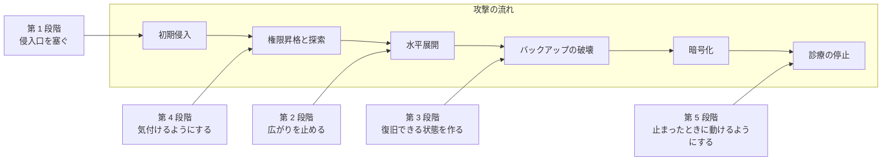

# 医療機関向け防御プレイブック

[ランサムウェアグループの TTPs](ransomware-groups.md) と、国内外の[インシデント事例](../incidents/)から導かれる対策を、優先順位をつけて整理する。

> [!NOTE]
> **表記ルール**：本ページでは、**事実**（一次情報で確認できる内容。出典を併記する）、**報道ベース**（報道のみで確認でき、当事者の公表資料では裏付けが取れていない内容）、**分析**（筆者の解釈）を書き分ける。
> 出典は、当事者の公表資料、行政文書、CVE、ベンダアドバイザリなどの一次情報を優先して示す。

> [!TIP]
> すべてを同時に実施できる医療機関は少ない。
> 本ページは、限られた予算と人員で何から着手するかを判断するための順序として構成している。

## 攻撃の流れと防御段階の対応

各段階が、攻撃のどこを断つためのものかを示す。

---

## 第 0 段階：現状を知る

対策の前に、守るべき対象と現在の状態を把握する必要がある。

- [ ] 外部からアクセスできる資産を洗い出す（VPN 装置、公開サーバ、リモートデスクトップ、PACS）
- [ ] 外部と接続している事業者を洗い出す（給食、検査、保守、地域連携、クラウド）
- [ ] 医療機器の台帳と IT 資産台帳を突き合わせる
- [ ] バックアップの構成と、実際に復旧できるかを確認する
- [ ] 厚生労働省の[サイバーセキュリティ対策チェックリスト](../../guidelines/japan.md)を埋める

現状把握のない対策投資は、たいてい効かない場所に向かう。

---

## 第 1 段階：侵入口を塞ぐ

国内外の公表済み事例で、初期侵入経路として繰り返し確認されている箇所である。
費用対効果が最も高い。

| 対策 | 内容 | 対応する事例 |
|---|---|---|
| **境界機器のパッチ適用** | VPN 装置、ゲートウェイ、リモートアクセス製品を最優先で更新する。EOL 製品は交換する | 半田病院、デュッセルドルフ大学病院 |
| **すべてのリモートアクセスへの MFA 適用** | 例外を作らない。委託先アカウント、保守アカウントも対象にする | Change Healthcare |
| **リモートデスクトップの直接公開の停止** | インターネットから RDP に到達できる状態を解消する | 多数 |
| **委託先接続の見直し** | 接続元, 接続先, 期間, 権限を必要最小限に限定する。常時接続を必要時開放に変える | 大阪急性期, 総合医療センター |
| **漏えい認証情報の監視** | 自組織のドメインの認証情報が流通していないか継続的に確認する | 多数 |

> [!IMPORTANT]
> Change Healthcare の事例では、多要素認証が設定されていないリモートアクセスアカウントが起点になったことが議会証言で明らかにされている。
> 全米規模の医療インフラ停止の起点が、この一点だった。

---

## 第 2 段階：広がりを止める

侵入を完全に防ぐことはできない。
被害を局所化できるかどうかが、診療停止期間を決める。

| 対策 | 内容 |
|---|---|
| **ネットワークの分離** | 医療機器、電子カルテ、事務系、来客用 Wi-Fi を分離する。医療機器セグメントからのインターネット直接アクセスを禁止する |
| **管理者権限の最小化** | 日常業務に管理者権限を使わない。特権アカウントを専用端末に限定する |
| **ローカル管理者パスワードの個別化** | 同一パスワードの使い回しを解消する（LAPS 等の仕組みを利用する） |
| **仮想化基盤の保護** | ESXi などのハイパーバイザ管理インタフェースを分離し、多要素認証を適用する。ここが落ちると全システムが同時に停止する |
| **不要なプロトコルの停止** | SMBv1、LLMNR, NBT-NS など、水平展開に使われる古い機能を無効化する |

---

## 第 3 段階：復旧できる状態を作る

バックアップは「取っている」ことではなく「戻せる」ことに意味がある。

- [ ] バックアップの少なくとも 1 系統をオフラインまたはイミュータブル（変更不可）で保管する
- [ ] バックアップ基盤の認証を、業務ドメインから分離する
- [ ] 実際にリストアする訓練を、年 1 回以上実施する
- [ ] 電子カルテの復旧に要する時間を実測し、その時間だけ紙運用に耐えられるかを検証する
- [ ] 復旧の優先順位を、診療への影響度に基づいて定義する

医療機関のランサムウェア被害では、バックアップも同時に暗号化されていた事例が繰り返し報告されている。
バックアップ基盤が業務ドメインの認証を使っている限り、ドメイン管理者を奪われた時点で一緒に失われる。

---

## 第 4 段階：気付けるようにする

暗号化までには数日から数か月の潜伏期間がある。
この間に検知できれば、被害は回避できる。

| 監視対象 | 検知したい事象 |
|---|---|
| 認証 | 業務時間外のログイン、通常と異なる場所からのアクセス、認証失敗の急増 |
| 特権操作 | 新規の管理者アカウント作成、グループへの追加 |
| ツール | 業務で使っていないリモート管理ツールの実行 |
| セキュリティ製品 | ウイルス対策, EDR の停止、定義更新の停止 |
| 内部通信 | 短時間での大量スキャン、通常と異なるサーバ間通信 |
| 外向き通信 | 大量のデータ転送、未知のクラウドストレージへの通信 |
| バックアップ | シャドウコピーの削除、バックアップジョブの異常終了 |

専任者を置けない場合、監視の外部委託（MDR, SOC サービス）を検討する。
検知の仕組みだけ導入して、通知に対応する人がいない状態が最も危うい。

---

## 第 5 段階：止まったときに動けるようにする

医療機関の事業継続計画は、「システムが 1 か月使えない」という前提で作る必要がある。

### ダウンタイム手順

- [ ] 紙運用への切り替え手順を、部門ごとに文書化する
- [ ] 紙の帳票と、検査依頼書, 処方箋の予備を確保する
- [ ] 過去の診療情報を参照する代替手段を用意する（定期的な紙, PDF 出力など）
- [ ] 訓練を実施する。文書があるだけでは動けない

### インシデント対応体制

- [ ] 初動の判断者と、意思決定の流れを定義する
- [ ] 外部の支援先（フォレンジック事業者、ベンダ、JPCERT/CC、医療 ISAC）の連絡先を事前に確保する
- [ ] 所轄官庁, 個人情報保護委員会への報告要件と期限を確認する
- [ ] 患者, 家族, 報道機関への広報方針を事前に定める
- [ ] 地域の医療機関との連携（患者の受け入れ, 転送）を協定として準備する

### 身代金を支払うかの判断

支払いの是非は、経営判断として事前に方針を定めておくべき事項である。
インシデント発生後に、混乱の中で初めて議論する状態は避けたい。
検討にあたっては次を踏まえる必要がある。

- 支払っても、復号ツールが正常に機能する保証はない
- 支払っても、窃取されたデータが削除される保証はない
- 制裁対象の組織への支払いは、法令上の問題を生じうる
- 国内外の公表事例では、身代金を支払わずに再構築を選んだ医療機関が複数ある

---

## 参照できる枠組み

| 枠組み | 用途 |
|---|---|
| [厚生労働省 サイバーセキュリティ対策チェックリスト](../../guidelines/japan.md) | 国内の医療機関が最初に埋めるべき自己点検 |
| [HHS HICP](https://405d.hhs.gov/) | 規模別の具体的な実践事項 |
| [HHS CPGs](https://hphcyber.hhs.gov/) | 優先順位づけされた性能目標 |
| [CISA Cross-Sector Cybersecurity Performance Goals](https://www.cisa.gov/cross-sector-cybersecurity-performance-goals) | 分野横断の基礎的な目標 |
| [NIST CSF 2.0](https://www.nist.gov/cyberframework) | 全体像の整理とギャップ分析 |
| [HSE 事後レビュー](../incidents/global/2021-timeline.md#GL-2021-01) | 実際の失敗から学ぶための一次資料 |

---

[← 医療機関で連鎖するランサムウェア攻撃](ransomware-chain.md) | [組織の脆弱性の分類 →](organizational-vulnerabilities.md) | [脅威アクターと TTPs](README.md) | [トップへ](../../../README.md)
