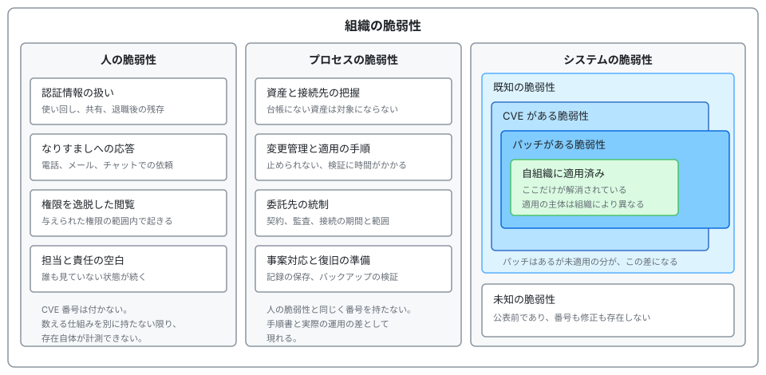
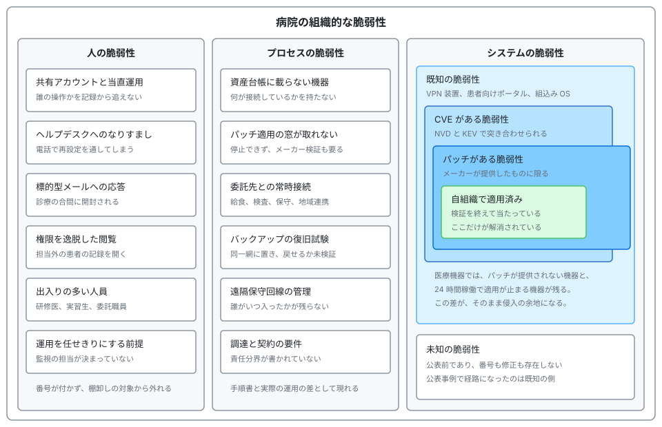
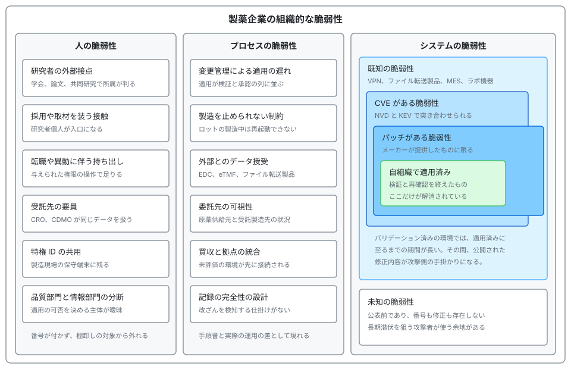

# 組織の脆弱性の分類

「脆弱性」という語は、多くの場合、CVE 番号の付いたソフトウェアの欠陥を指して使われる。
一方、公表された調査報告書から侵入の経路を拾うと、番号の付いた欠陥だけでは経緯をたどれないことが多い。
このページは、組織が抱える脆弱性を人、プロセス、システムの三層に分けたうえで、病院と製薬企業のそれぞれで中身を書き分けた図として示す。
グループ別の手口は[ランサムウェアグループ別の TTPs](ransomware-groups.md)、打ち手の一覧は[医療機関向け防御プレイブック](defense-playbook.md)にある。

> [!NOTE]
> **表記ルール**：本ページでは、**事実**（一次情報で確認できる内容。出典を併記する）、**報道ベース**（報道や第三者の集計のみで確認でき、当事者の公表資料では裏付けが取れていない内容）、**分析**（筆者の解釈）を書き分ける。
> 出典は、当事者の公表資料、行政文書、CVE、ベンダアドバイザリなどの一次情報を優先して示す。

---

## 分類の枠組み

  

三つの層は、次のように分かれる。

- **人の脆弱性**：職員が、与えられた権限の範囲で行う判断と操作に起因する欠陥である。
- **プロセスの脆弱性**：資産の把握、変更管理、委託先の統制、事案対応など、組織の手続きに起因する欠陥である。
- **システムの脆弱性**：製品とその構成に起因する欠陥である。三層のうち、外部の識別子で数えられるのはこの層だけである。

### 入れ子の読み方

システムの脆弱性は、外部でどこまで公表されているかによって階層が分かれる。

| 層 | 何が分かっている状態か | 突き合わせの手掛かり |
|---|---|---|
| 未知の脆弱性 | 公表前であり、識別子も修正も存在しない | ない。設計と監視で受け止める範囲になる |
| 既知の脆弱性 | 欠陥の存在が公表されている | ベンダアドバイザリ、公的機関の注意喚起 |
| CVE がある脆弱性 | 識別子が振られ、内容を参照できる | NVD、CISA KEV |
| パッチがある脆弱性 | 製造元が修正を提供している | ベンダのリリース情報、SBOM |
| 自組織で適用済み | 自組織の資産で解消されている | 資産台帳、構成管理の記録 |

**事実**：CISA は、悪用が確認された脆弱性を Known Exploited Vulnerabilities（KEV）カタログとして公表している。
出典：[CISA Known Exploited Vulnerabilities Catalog](https://www.cisa.gov/known-exploited-vulnerabilities-catalog)、[NVD](https://nvd.nist.gov/vuln/search)

**事実**：CVE 識別子は、CVE プログラムに参加する CNA（CVE Numbering Authority）が採番する。
出典：[CVE Program](https://www.cve.org/)

**分析**：採番を経ずに修正された欠陥は、識別子を持たないまま出荷される。
図で「パッチがある脆弱性」が「CVE がある脆弱性」の枠からはみ出しているのは、この部分である。
CVE 番号を数えて脆弱性を管理している限り、この分は集計から漏れる。

**分析**：既知、CVE、パッチという三つの境界は、外部の公表状況で決まるため、自組織の努力では動かない。
自組織が動かせるのは「パッチがある脆弱性」と「自組織で適用済み」の差だけである。
攻撃者に残された余地も、まずこの差に現れる。

---

## 病院の場合

  

病院では、診療を止められないという制約が三層すべてに効いてくる。
人の層では確認の手順が省かれ、プロセスの層では適用の窓が取れず、システムの層ではパッチが提供されない機器が残る。

### 人の脆弱性

| 現れ方 | 病院で起きる仕組み | 検知と緩和 |
|---|---|---|
| **共有アカウントと当直運用** | 交代勤務で端末と ID を引き継ぎ、緊急時は入力の速さが優先される | 同一 ID の同時ログインと深夜帯の大量参照を検知対象に置く。個人 ID とカード認証に寄せる |
| **ヘルプデスクへのなりすまし** | 24 時間の問い合わせ窓口があり、本人確認が電話で完結する | 登録済みの電話番号への折り返しを条件にする。多要素認証の端末再登録を記録し、直後の権限変更を監視する |
| **標的型メールへの応答** | 診療の合間に処理され、判断に使える時間が短い | 添付とリンクの実行を記録する。訓練の指標を開封率ではなく報告率に置く |
| **権限を逸脱した閲覧** | 救急対応を想定して参照権限が広く設定される | 担当外の患者記録への参照をログで突き合わせる。事後監査を制度として置く |
| **出入りの多い人員** | 研修医、実習生、非常勤、委託職員が定期的に入れ替わる | 人事の異動と ID の棚卸しを同じ周期で回す。退職時の失効を確認する |
| **運用を任せきりにする前提** | 情報システムの担当が兼務で、納入ベンダへの依存が強い | 監視の対象と担当を契約に明示する。誰が何を見ているかを一覧にする |

**事実**：HHS HC3 は 2024 年 4 月 3 日、医療分野の IT ヘルプデスクを標的とするソーシャルエンジニアリングについて注意喚起を出した。
攻撃者は職員を名乗って電話し、本人確認に使われる情報を提示したうえで、多要素認証の端末を新しく登録するよう依頼していた。
緩和策として、登録済みの電話番号への折り返し確認が挙げられている。
出典：[HC3 Sector Alert（PDF）](https://www.hhs.gov/sites/default/files/help-desk-social-engineering-sector-alert-tlpclear.pdf)

### プロセスの脆弱性

| 現れ方 | 病院で起きる仕組み | 検知と緩和 |
|---|---|---|
| **資産台帳に載らない機器** | 医療機器は診療部門が調達するため、情報システム部門の台帳に載らないことがある | 通信からの資産検出を併用する。調達の条件に台帳への登録を入れる |
| **パッチ適用の窓が取れない** | 24 時間稼働であり、機器によってはメーカーの動作検証を待つ必要がある | 適用できない資産を一覧にし、分離と監視で補う。適用の期限を機器の重要度別に決める |
| **委託先との常時接続** | 給食、検査、清掃、保守、地域医療連携で外部と接続が続く | 接続元と経路の棚卸しを定期化する。接続を必要な期間と範囲に限る |
| **バックアップの復旧試験** | 取得の成否確認で終わり、戻せるかと所要時間を測っていない | 復旧試験を年次の手順に入れる。保管を分離し、書き換えできない形にする |
| **遠隔保守回線の管理** | メーカーの保守性が優先され、接続の記録が残らない | 保守接続を申請制にし、開始と終了を記録する |
| **調達と契約の要件** | 仕様書にセキュリティ要件と責任分界が書かれない | 厚生労働省のチェックリストの項目を調達仕様に反映する |

**事実**：2023 年 4 月に施行された医療法施行規則の改正により、病院、診療所、助産所の管理者に対して、医療情報システムの安全管理に関する措置が義務づけられた。
厚生労働省は、履行状況を確認するためのチェックリストを公表しており、立入検査で使用されている。
出典：[厚生労働省 医療分野のサイバーセキュリティ対策](https://www.mhlw.go.jp/stf/seisakunitsuite/bunya/kenkou_iryou/iryou/johoka/cyber-security.html)（詳細は[国内のガイドライン、法規制](../../guidelines/japan.md)）

### システムの脆弱性

| 資産 | 図のどこに入るか | 打ち手 |
|---|---|---|
| **VPN 装置、リモートアクセス製品** | CVE があり、パッチもある。適用の遅れがそのまま露出になる | 版数の一覧を持ち、KEV 掲載の有無で適用の順序を決める |
| **患者向けの公開サービス** | 自組織で開発した部分の欠陥は CVE を持たない | 認証と認可の欠陥は識別子では拾えないため、[診断](../../practice/pentest/)で確認する |
| **医療機器の組込み OS** | 既知であっても、パッチが提供されない部分が残る | 分離、通信の制限、代替の緩和策を機器単位で決めて記録する |
| **PACS、部門システム** | 設定に起因する露出（認証なしでの公開）は CVE を持たない | 外部からの到達性を定期的に確認する（[PACS と DICOM](../../technology/medical-devices/pacs-dicom.md)） |
| **電子カルテ** | ベンダが提供する修正が、製品のバージョンに紐づく | 適用の可否と時期をベンダと合意し、合意内容を記録に残す |

**事実**：つるぎ町立半田病院の調査報告書では、侵入経路として VPN 装置の脆弱性が指摘されている。
ウイルス対策ソフトが停止していたこと、バックアップも被害を受けたことが記載されている。
出典：[つるぎ町立半田病院](https://www.handa-hospital.jp/)（コンピュータウイルス感染事案 調査報告書、[事例の整理](../incidents/japan/2021-timeline.md#JP-2021-01)）

**事実**：大阪急性期・総合医療センターの事例では、給食提供事業者の VPN 装置の脆弱性と認証情報が経路として示されている。
出典：[大阪急性期・総合医療センター](https://www.gh.opho.jp/)（情報セキュリティインシデント調査委員会 報告書、[事例の整理](../incidents/japan/2022-timeline.md#JP-2022-01)）

**分析**：報告書が公表された国内の二例では、いずれも既知の脆弱性か窃取された認証情報が経路になっている。
未知の脆弱性を無視してよいという意味ではない。
限られた工数をどちらに置くかを決めるとき、図の内側（適用済み）と一つ外側（パッチがある）の差を先に埋めるほうが、経路の数を減らしやすいということである。

---

## 製薬企業の場合

  

製薬企業では、変更を勝手に加えられないという制約が三層に効いてくる。
バリデーション済みの計算機化システムは、構成を変えるたびに検証と承認の手続きが要る。
その結果、修正が公表されてから自組織に適用されるまでの期間が長くなる。

### 人の脆弱性

| 現れ方 | 製薬企業で起きる仕組み | 検知と緩和 |
|---|---|---|
| **研究者の外部接点** | 学会発表、論文、共同研究で、氏名と所属と研究テーマが公になる | 標的になりやすい職種を特定し、その範囲に対して訓練と監視を厚くする |
| **採用や取材を装う接触** | 専門性の高い人材への個別接触が、業務上も日常的に発生する | 業務外の連絡経路からの資料要求を報告対象にする |
| **転職や異動に伴う持ち出し** | 与えられた権限の範囲の操作で、研究データを取り出せる | 大量の取得と外部への転送を検知対象にする。退職手続きと権限の失効を連動させる |
| **受託先の要員** | CRO、CDMO の担当者が、自社と同じデータを扱う | 委託先ごとにアカウントと権限を分け、監査の権利を契約に置く |
| **特権 ID の共用** | 製造現場の保守端末に、共用の管理者 ID が残る | 特権 ID を個人に割り当て、使用のたびに記録する |
| **品質部門と情報システム部門の分断** | 適用の可否を決める主体が、部門間で確定しない | 変更管理の手続きに、セキュリティ修正の判断経路を明記する |

### プロセスの脆弱性

| 現れ方 | 製薬企業で起きる仕組み | 検知と緩和 |
|---|---|---|
| **変更管理による適用の遅れ** | 修正の適用が、検証と承認の列に並ぶ | セキュリティ修正の判断経路をあらかじめ用意し、影響評価の範囲を型として定める |
| **製造を止められない制約** | ロットの製造中は、再起動も構成変更もできない | 停止できる期間を計画に組み込む。停止できない期間は分離と監視で補う |
| **外部とのデータ授受** | EDC、eTMF、ファイル転送製品を通じて、外部と日常的にやり取りする | 外部に開いた経路を一覧にし、認証の方式と版数を定期的に確認する |
| **委託先の可視性** | 原薬供給元と受託製造先の対策状況が、自社からは見えない | 質問票に加えて、接続点の技術的な確認を実施する |
| **買収と拠点の統合** | 事業の都合が先行し、未評価の環境が先に接続される | 接続の前に評価する手順を定め、評価が終わるまでは経路を限定する |
| **記録の完全性の設計** | 記録の改ざんを検知する仕掛けが、システムに組み込まれていない | 監査証跡の取得と保護を要件に置き、実際に検知できるかを試験する |

**事実**：欧州の GMP ガイドライン（EudraLex Volume 4）は、計算機化システムに対する要件を Annex 11 として定めている。
出典：[EudraLex Volume 4](https://health.ec.europa.eu/medicinal-products/eudralex/eudralex-volume-4_en)

**事実**：PIC/S は GMP ガイド（PE 009-17）を公開しており、Annex 11 の改訂ドラフトを 2025 年 7 月に「Documents for Industry」として掲載している。
出典：[PIC/S Publications](https://picscheme.org/en/publications)（改訂ドラフトの内容は[セキュリティ診断とペネトレーションテスト](../../practice/pentest/)を参照）

### システムの脆弱性

| 資産 | 図のどこに入るか | 打ち手 |
|---|---|---|
| **VPN、リモートアクセス製品** | CVE があり、パッチもある。境界に置かれるため露出が直接的である | バリデーションの対象外として扱えるかを整理し、適用の期限を短く保つ |
| **ファイル転送製品** | 外部との授受に使われるため、境界に露出する。CVE とパッチが公表された時点で、欠陥の所在も公になる | 版数を把握し、KEV に掲載された場合の緊急適用の手順を用意する |
| **製造実行システム、SCADA、PLC** | 既知であっても、稼働の制約から適用済みに至らない | ネットワークの分離と、変更が入らないことを前提とした監視で補う |
| **ラボ機器の組込み OS** | パッチが提供されない期間が長い | 機器単位で代替の緩和策を決め、更新の可否をメーカーに確認して記録する |
| **クラウド上の解析基盤** | 設定に起因する露出は CVE を持たない | 公開設定と権限の逸脱を継続的に確認する（[クラウド事業者と医療](../../technology/cloud/)） |

**分析**：修正の公表は、攻撃側にとっては欠陥の所在を示す情報でもある。
バリデーション済み環境で適用が遅れる期間は、この情報が出回ったあとの期間と重なる。
そのため製薬企業では、適用が終わるまでの間に何で補うかを、適用計画と同時に決めておく必要がある。

---

## 病院と製薬企業で何が違うか

| 論点 | 病院 | 製薬企業 |
|---|---|---|
| 止められない理由 | 診療が 24 時間続く | 製造ロットと治験の進行が止まる |
| 変更を縛るもの | 医療機器の薬事上の構成とメーカーの検証 | バリデーション済みの計算機化システムの変更管理 |
| 人の入口 | 職員数が多く、出入りが激しい | 研究者と受託先の要員が外部に露出する |
| 委託の形 | 給食、検査、清掃、保守、地域医療連携 | CRO、CDMO、原薬供給元 |
| 主な損害 | 診療の停止と患者情報の公開 | 開発情報の先取りと出荷の停止 |
| パッチが適用済みに至らない主因 | 提供されない、止められない | 検証と承認に時間がかかる |
| 番号で数えられない部分 | 設定の露出、委託先の接続 | 委託先の環境、記録の完全性 |

**分析**：どちらも、システムの層に「外側の枠は縮まらない」制約を抱えている。
病院ではメーカーが修正を出さないことが、製薬企業では検証が終わらないことが、それぞれ適用済みの枠を押し広げにくくしている。
制約の形が違うため、補い方も分かれる。
病院は機器単位の分離と代替措置が中心になり、製薬企業は適用計画と暫定の緩和策を組みにして進めることになる。

---

## 分類を運用に落とす

三層は、数え方が同じではない。
システムの層は外部の識別子で数えられるが、人とプロセスの層は識別子を持たない。
そのため、層ごとに別の指標を置く。

| 層 | 置ける指標 | 出所 |
|---|---|---|
| 人 | 訓練での報告率、権限の棚卸しの実施率、多要素認証の端末再登録の件数 | 訓練の記録、ID 管理の記録 |
| プロセス | 委託先接続の棚卸しの周期、復旧試験の実施と所要時間、調達仕様への要件反映率 | 運用の記録、契約書 |
| システム | パッチがある脆弱性のうち未適用の件数、適用期限の超過件数、KEV 掲載分の残存件数 | 資産台帳、脆弱性管理の記録 |

進め方は、次の順で置くと差が見えやすい。

1. 資産台帳を先に作る。台帳にない資産は、既知の脆弱性の対象にすらならない。
2. 台帳と KEV を突き合わせ、「パッチがあるのに適用済みでない」件数を出す。
3. 適用できない資産について、理由（提供されない、止められない、検証中）を記録し、代替の緩和策を紐づける。
4. 人とプロセスの層は、代理指標を決めて定点で観測する。件数の増減ではなく、記録が残っているかどうかを先に見る。

**分析**：この順序で進めると、三つの層のうちどこに手が足りていないかが数で見えやすくなる。
一方、資産台帳がない状態で脆弱性管理の製品を導入しても、対象外の資産は最後まで数に入らない。

---

## 関連

- [脅威アクターとリスク](actors-and-risks.md)：誰が、何のために狙うか
- [医療機関向け防御プレイブック](defense-playbook.md)：打ち手の優先順位
- [国内のガイドライン、法規制](../../guidelines/japan.md)：医療法施行規則、チェックリスト、薬機法
- [製薬企業のセキュリティ](../../reference/pharma/)：治験、製造 OT、供給網
- [セキュリティ診断とペネトレーションテスト](../../practice/pentest/)：診断で確認できる範囲

## 一次情報

| 対象 | 出典 |
|---|---|
| 悪用が確認された脆弱性 | [CISA Known Exploited Vulnerabilities Catalog](https://www.cisa.gov/known-exploited-vulnerabilities-catalog) |
| CVE の採番 | [CVE Program](https://www.cve.org/)、[NVD](https://nvd.nist.gov/vuln/search) |
| 国内の医療機関向け制度 | [厚生労働省 医療分野のサイバーセキュリティ対策](https://www.mhlw.go.jp/stf/seisakunitsuite/bunya/kenkou_iryou/iryou/johoka/cyber-security.html) |
| ヘルプデスクへのなりすまし | [HHS HC3 Sector Alert（PDF）](https://www.hhs.gov/sites/default/files/help-desk-social-engineering-sector-alert-tlpclear.pdf) |
| 計算機化システムの要件 | [EudraLex Volume 4](https://health.ec.europa.eu/medicinal-products/eudralex/eudralex-volume-4_en)、[PIC/S Publications](https://picscheme.org/en/publications) |
| 国内の公表報告書 | [つるぎ町立半田病院](https://www.handa-hospital.jp/)、[大阪急性期・総合医療センター](https://www.gh.opho.jp/) |

---

[← 医療機関向け防御プレイブック](defense-playbook.md) | [脅威アクターと TTPs](README.md) | [トップへ](../../../README.md)
