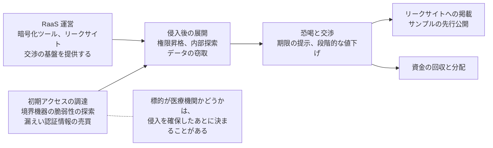
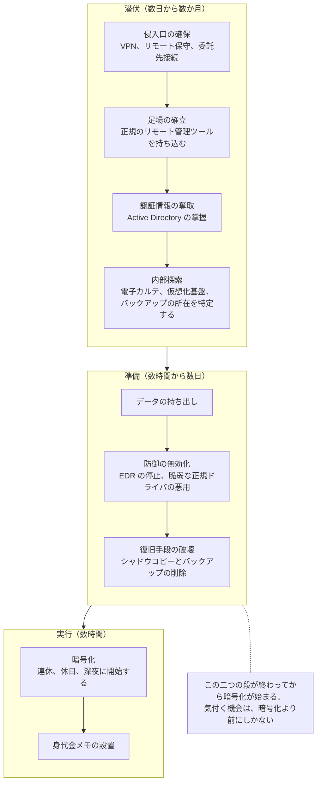
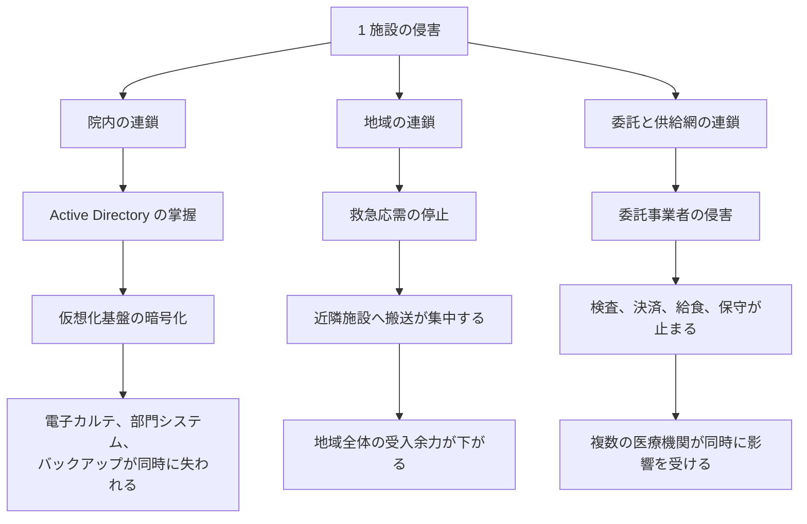
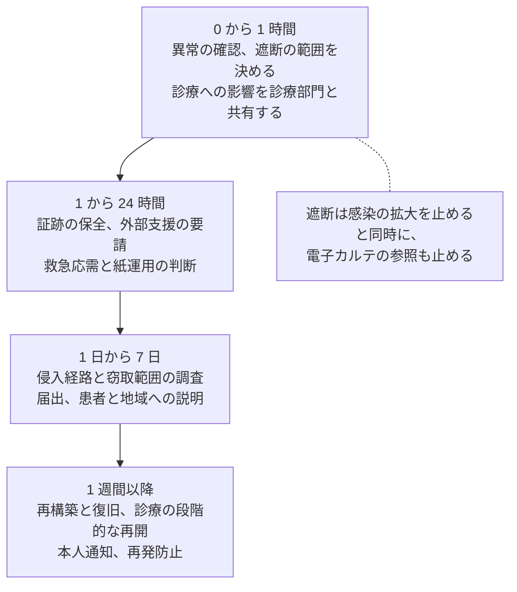

# 医療機関で連鎖するランサムウェア攻撃

ランサムウェア攻撃は、一人の攻撃者が一つの病院を暗号化して終わる出来事ではない。
侵入、展開、窃取、恐喝はそれぞれ別の担い手が引き受け、被害は院内から地域の医療提供体制と供給網へ広がる。
本ページは、この連鎖を、攻撃側の分業、進行の時間軸、被害の波及、要求される内容、被害後の順序、事前に決める事項の順に扱う。

> [!NOTE]
> **表記ルール**：本ページでは、**事実**（一次情報で確認できる内容。出典を併記する）、**報道ベース**（報道のみで確認でき、当事者の公表資料では裏付けが取れていない内容）、**分析**（筆者の解釈）を書き分ける。
> 出典は、当事者の公表資料、行政文書、CVE、ベンダアドバイザリなどの一次情報を優先して示す。

本ページと近い主題を扱うページが四つある。
グループごとの手口と ATT&CK への対応づけは [ランサムウェアグループ別の TTPs](ransomware-groups.md)、着手する対策の順序は [医療機関向け防御プレイブック](defense-playbook.md)、侵害後に同時に走る四つの流れは [インシデント対応と事業継続](../../response/)、自組織の弱点の棚卸しは [組織の脆弱性の分類](organizational-vulnerabilities.md) にある。
本ページは、その四つをつなぐ位置に置き、攻撃がどう進み、どこまで広がり、何を要求されるかを扱う。

---

## 攻撃側の分業

一つの攻撃には、複数の担い手が関わる。
侵入口を用意する者、侵入後に展開する者、暗号化ツールとリークサイトを提供する者、交渉を担う者が分かれている。

**事実**：RaaS（Ransomware as a Service）では、暗号化ツールと基盤を提供する運営と、実際に侵入して展開するアフィリエイトが分かれる。
このため同じグループ名で括られた攻撃でも、実行者ごとに手口が異なる（[ランサムウェアグループ別の TTPs](ransomware-groups.md)）。

**出典**：[CISA #StopRansomware アドバイザリ](https://www.cisa.gov/stopransomware)、[HHS HC3](https://www.hhs.gov/about/agencies/asa/ocio/hc3/index.html)

**分析**：この分業から導かれるのは、「規模が小さいから狙われない」という前提が成立しないことである。
境界機器の脆弱性の探索は、組織を選ばずインターネット全体に対して機械的に行われる。
到達できた組織の一覧が先にでき、医療機関かどうかの判断はそのあとに来る。
狙われるかどうかを決めるのは組織の規模ではなく、外から見えている口の数と、そこに残った既知の脆弱性である。

**分析**：分業は、防御側が使える時間にも影響する。
侵入を担う者は、到達できた組織を売却して次に移るため、侵入から展開までに空白が生じることがある。
この空白のあいだに漏えい認証情報の失効や境界機器の更新が済めば、買った側は入れない。

---

## 進行の時間軸

暗号化は攻撃の始まりではなく、終盤の作業である。
その前に、権限の奪取、バックアップの特定、データの持ち出しが済んでいる。

各段階で、医療機関側に何が見えるかを対応させる。

| 段階 | 攻撃側の作業 | 医療機関側に現れる兆候 | この段で止める手段 |
|---|---|---|---|
| 侵入口の確保 | 境界機器の既知脆弱性の悪用、漏えい認証情報でのログイン | 業務時間外の VPN 接続、通常と異なる国からの接続、多要素認証のない経路の使用 | 境界機器の更新、すべてのリモートアクセスへの多要素認証 |
| 足場の確立 | AnyDesk などのリモート管理ツールの持ち込み | 業務で採用していない管理ツールの実行と通信 | 実行できるアプリケーションの制限、通信先の制限 |
| 認証情報の奪取 | LSASS からの窃取、ドメインコントローラでの操作 | 特権アカウントの異常な使用、新規の管理者アカウント | 特権の分離、管理端末の限定 |
| 内部探索 | ネットワークスキャン、Active Directory の列挙 | 短時間での大量の内部接続、網羅的な照会 | 内部通信の監視、セグメント間の制限 |
| データの持ち出し | クラウドストレージや転送ツールへの大量アップロード | 外向きの大量転送、業務で使わない宛先への通信 | 外向き通信の監視と宛先の制限 |
| 復旧手段の破壊 | シャドウコピーの削除、バックアップ基盤への侵入 | バックアップジョブの異常終了、バックアップ基盤への異常なログイン | バックアップ基盤の認証を業務ドメインから分離する |
| 暗号化 | 連休や深夜に一斉実行 | 大量のファイル書き換え、拡張子の変更、業務端末の一斉停止 | この段では止まらない。範囲を狭める分離が効く |

**事実**：アイルランドの HSE の事例では、フィッシングによる初期侵入から暗号化までに約 8 週間の潜伏期間があり、その間に複数の検知機会が存在したことが事後レビューで指摘されている（[詳細](../incidents/global/2021-timeline.md#GL-2021-01)）。

**分析**：暗号化が連休や深夜に集中するのは、暗号化の速度を上げるためではない。
実行から発覚までの時間が長いほど、暗号化が及ぶ範囲が広がるためである。
当直体制では、異常に気付いてから遮断を判断できる人に連絡がつくまでに時間がかかる。
攻撃側が利用しているのは、暗号化の速さではなく、こちらの応答の遅さである。
したがって対策は、当直から判断者へ届くまでの経路を、平時に短くしておくことになる（[経営とガバナンス](../../governance/)）。

---

## 被害が広がる三つの方向

被害は三方向に広がる。
方向ごとに、自組織で打てる手が違う。

### 院内の連鎖

**分析**：基幹システムを仮想化基盤に集約する構成は、運用の効率を上げる一方で、暗号化の被害範囲を一致させる。
ハイパーバイザ層が暗号化されると、その上の電子カルテ、部門システム、検証環境が同時に失われる。
バックアップ基盤が業務ドメインの認証を使っている場合、ドメイン管理者を奪われた時点で復旧手段も同じ経路で失われる。
この連鎖を切る箇所は、ハイパーバイザの管理インタフェースと、バックアップ基盤の認証の二つに絞られる（[防御プレイブック 第 2 段階、第 3 段階](defense-playbook.md)）。

### 地域の連鎖

**事実**：国内の公表事例では、電子カルテの停止が救急の受入停止と外来の制限に至り、周辺の医療機関へ患者が搬送された経過が報告されている（[徳島県つるぎ町立半田病院](../incidents/japan/2021-timeline.md#JP-2021-01)、[大阪急性期・総合医療センター](../incidents/japan/2022-timeline.md#JP-2022-01)）。

**分析**：救急告示病院が受入を止めると、その分の搬送は近隣に回る。
搬送先の選定に要する時間が延び、受入側の負荷も上がるため、影響は被害施設の外側に出る。
被害施設が復旧に数か月を要する場合、この状態が地域の常態になる。
自施設の事業継続計画だけでは扱えないため、地域の医療機関との相互支援を協定として準備しておく必要がある。

### 委託と供給網の連鎖

**事実**：医療決済を担う Change Healthcare の侵害では、全米規模で保険請求と支払いの処理が停止した（[詳細](../incidents/global/2024-timeline.md#GL-2024-01)）。
病理検査を受託する Synnovis の侵害では、ロンドンの複数の医療機関で輸血と検査に影響が生じた（[詳細](../incidents/global/2024-timeline.md#GL-2024-03)）。

**分析**：この方向の連鎖は、自組織の内側をいくら固めても防げない。
委託先が止まったときに何が止まるかを事前に洗い出し、代替手段と手作業での継続手順を用意しておくことが、実際に打てる手になる。
契約では、侵害時の連絡義務と、復旧見込みの提示を求める条項が効く。

| 連鎖の方向 | 起点 | 波及先 | 自組織で打てる手 |
|---|---|---|---|
| 院内 | Active Directory、仮想化基盤 | 電子カルテ、部門システム、バックアップ | 権限と認証基盤の分離、バックアップの隔離 |
| 地域 | 救急応需の停止 | 近隣医療機関、消防、地域の受入体制 | 相互支援の協定、搬送調整の連絡経路 |
| 委託と供給網 | 検査、決済、保守、給食の事業者 | 契約している複数の医療機関 | 依存の棚卸し、代替手段、契約上の通知義務 |

---

## 何を要求されるか

要求は金銭の一点に見えて、実際には複数の圧力を組み合わせた形で来る。
恐喝の形態そのものは [ランサムウェアグループ別の TTPs](ransomware-groups.md#恐喝の形態) に整理した。
ここでは、医療機関が交渉のテーブルで実際に置かれる状況を扱う。

| 要求、圧力の型 | 内容 | 医療に固有の重み |
|---|---|---|
| 期限つきの金額提示 | 期限までに支払わなければ公開すると通告する | 診療停止が続く中で、期限が経営判断を急がせる |
| 段階的な値下げと延長 | 交渉の経過で金額を下げ、期限を延ばす | 交渉が長引くほど、診療の制限も続く |
| サンプルの先行公開 | 窃取した記録の一部を公開する | 公開されるのが要配慮個人情報であり、取り消せない |
| リークサイトへの掲載 | 組織名を掲載し、公開までの残り時間を表示する | 患者と地域からの問い合わせが、公表の準備より先に始まる |
| 患者への直接接触 | 患者本人に連絡し、記録の公開をちらつかせる | 医療機関を介さずに被害が患者へ届く |
| 規制当局への通報 | 被害組織の規制違反を通報すると告げる | 届出の準備と並行して圧力がかかる |
| 取引先、関係機関への連絡 | 委託元や地域の医療機関に連絡する | 連携先との関係に影響する |

**分析**：この段階で、対応の性質が技術から広報と法務へ移る。
交渉の窓口を情報システム部門に置くと、復旧作業と交渉が同じ担当者に重なり、どちらも遅れる。
窓口と復旧の指揮を分ける設計は、平時にしか決められない。

### 要求額の水準

要求額は、攻撃側が被害組織の規模と停止コストを見積もって設定する。
そのため、同じ手口でも小規模な診療所と全国規模の事業者では桁が変わる。

| 事例 | 要求または支払いの内容 | 支払いの有無 | 確度 |
|---|---|---|---|
| Hollywood Presbyterian Medical Center（2016、米） | 40 ビットコイン（当時のレートで約 1 万 7,000 ドル） | 支払った | 当事者公表（2016 年 2 月、院長名の公開書簡） |
| [HSE](../incidents/global/2021-timeline.md#GL-2021-01)（2021、アイルランド） | 2,000 万ドル相当を要求されたと報じられた | 支払っていない | 支払いの有無は当事者公表、金額は報道ベース |
| [Vastaamo](../incidents/global/2020-timeline.md#GL-2020-03)（2020、フィンランド） | 事業者に対してビットコインでの支払いを要求し、拒否後に患者本人へ 200 ユーロ相当を個別に要求したと報じられた | 事業者は支払っていない | 報道ベース |
| [Change Healthcare](../incidents/global/2024-timeline.md#GL-2024-01)（2024、米） | 2,200 万ドル相当のビットコインの送金がブロックチェーン上で観測されたと報じられた | 支払いが行われたことに親会社の CEO が議会証言で言及している | 支払いの有無は当事者証言、金額は報道ベース |
| [徳島県つるぎ町立半田病院](../incidents/japan/2021-timeline.md#JP-2021-01)（2021、日本） | 要求額は公表されていない | 支払わず、再構築を選択した | 当事者公表 |
| [大阪急性期・総合医療センター](../incidents/japan/2022-timeline.md#JP-2022-01)（2022、日本） | 要求額は公表されていない | 支払わず、復旧と再構築を実施した | 当事者公表 |

**分析**：この一覧から読めるのは、金額そのものより設定の仕方である。
単独の医療機関では数万ドルから数百万ドル相当、多数の医療機関が依存する事業者では数千万ドル相当と、桁が停止の波及範囲に対応している。
交渉の過程で金額が下がることも多く、最初の提示額は上限に近い。

> [!IMPORTANT]
> 公表される金額は一部に限られる。
> 支払った組織は公表しないことが多く、要求額だけが報道される事案、どちらも明らかにならない事案がある。
> ここに挙げた数字は水準を掴むための材料であり、統計として扱えるものではない。

**分析**：要求額は、被害額の一部にすぎない。
支払わない選択をした国内の事例でも、システムの再構築、診療制限による収入の減少、応援人員の費用が発生している。
経営判断で比較する対象は、要求額と復旧費用ではなく、要求額と「支払っても残る復旧費用と停止期間」になる。

### 暗号資産での支払い

**事実**：身代金は暗号資産で要求される。
ビットコインでの支払いを指定する形が中心であり、公表された事例でもビットコインでの要求と送金が確認されている（上表、および [CISA #StopRansomware](https://www.cisa.gov/stopransomware) の各アドバイザリ）。

**報道ベース**：追跡を避ける目的でモネロを指定し、ビットコインより低い金額を提示するグループが報じられている。

**分析**：支払いを選ぶ場合、判断から送金までに実務上の工程が挟まる。

- 暗号資産を調達する経路が要る。交換業者の口座開設と本人確認には日数がかかり、緊急時に始めて間に合う工程ではない。
- 交渉と送金を代行する事業者、サイバー保険の適用可否が関わる。契約の範囲を事前に確認していないと、この段で止まる。
- 送金先が制裁対象に該当する場合、支払いそのものが法令上の問題になる。米国では OFAC の制裁指定が論点になり、国内でも外国為替及び外国貿易法と犯罪収益移転防止法の適用が検討対象になる。
- ブロックチェーン上の送金は第三者が観測できる。支払いを公表しなくても、金額と時刻が事後に外部から特定されることがある。

**分析**：これらの工程は、いずれも診療が止まっている最中には整えられない。
支払う方針を採るにせよ採らないにせよ、交換業者の利用可否、保険の適用範囲、法務の相談先を平時に確認しておく作業は共通して要る。
方針を「そのとき考える」と決めることは、実際には支払えない状態を選ぶことに近い。

支払いの是非そのものは、[防御プレイブック](defense-playbook.md#身代金を支払うかの判断)で扱う。

**分析**：判断の材料として押さえておきたいのは、復号が復旧と同じではないことである。
復号ツールが正常に動いた場合でも、対象の端末とサーバに一台ずつ適用して整合性を確認する作業が残る。
数百台規模の環境では、この作業自体に週単位の時間がかかる。
支払いを検討する場合でも、その間の診療を続ける手立ては別に要る。

---

## 情報漏えいと、診療継続の困難

医療機関のランサムウェア被害は、情報漏えいと診療継続の困難という、性質の違う二つのリスクを同時に生む。
同じ事案として扱うと、優先順位を決められなくなる。

| | 情報漏えい | 診療継続の困難 |
|---|---|---|
| 現れる時期 | 数週間から数か月後（掲載、通知、二次被害） | 侵害の当日から |
| 元に戻るか | 戻らない。病歴と遺伝情報は再発行できない | 復旧すれば戻る |
| 主に判断する者 | 法務、個人情報の担当、経営 | 診療部門と経営 |
| 期限のある義務 | 個人情報保護委員会への報告と本人への通知 | 医療法施行規則にもとづく安全管理措置、自治体への連絡 |
| 悪化させる要因 | 窃取範囲が確定しない状態が続く | バックアップが同時に失われる |
| 経営が扱う指標 | 対象人数、要配慮個人情報の有無、通知費用 | 救急停止日数、手術の延期件数、外来制限の期間 |

**事実**：病歴、診療情報、健康診断の結果、遺伝情報は要配慮個人情報にあたり、漏えい等が生じた場合には個人情報保護委員会への報告と本人への通知が義務づけられている（[国内のガイドラインと法規制](../../guidelines/japan.md)）。

**事実**：2023 年 4 月施行の医療法施行規則の改正により、病院、診療所、助産所の管理者に医療情報システムの安全管理措置が義務づけられている（[同](../../guidelines/japan.md)）。

### 情報漏えいの側で起きること

窃取された診療情報は、公開されると取り消せない。
患者側に現れる二次的な影響として、次のものが想定される。

- 患者を名乗る問い合わせや、記録の公開を材料にした患者本人への接触
- 診療内容を知る立場を装ったフィッシングと詐欺
- 病歴を理由とする不利益、および患者が受ける精神的な被害
- 保険資格や医療費に関する情報の不正利用

**分析**：この影響は、医療機関の復旧が完了したあとに現れる。
対応体制を復旧の完了で解散させると、患者からの問い合わせを受ける先がなくなる。
窓口の存続期間は、システムの復旧ではなく通知の完了を基準に決める。

### 診療継続の側で起きること

止まって困る度合いは、診療科と治療の種類で大きく違う。

| 影響を受けるもの | 猶予 | 代替のしやすさ |
|---|---|---|
| 救急の受入 | なし | 近隣への搬送に依存する |
| 手術 | 数日から数週間（緊急手術は猶予なし） | 延期または他院への依頼 |
| 透析、化学療法、分娩 | 日単位で猶予がない | 実施先の確保が要る |
| 検査、画像診断 | 数日 | 外部委託、手作業の記録 |
| 処方、調剤 | 日単位 | 手書き処方箋、院外薬局との調整 |
| 会計、請求 | 数週間 | 手作業、後日精算。資金繰りに影響する |

**分析**：復旧の順序は、システムの依存関係ではなくこの猶予の短さで決まる。
一般的な復旧手順は基幹システムから戻すが、それは救急応需や透析の可否とは対応しない。
どのシステムが戻れば何が再開できるかを、平時に診療部門と対応づけておく必要がある。

**分析**：この二つのリスクは、初動で競合する。
窃取範囲の確定には、ログとディスクイメージの保全が要る。
一方で診療の再開は、同じ機器の再構築を急がせる。
どちらを先にするかは技術で決まらないため、平時に判断者を決めておく事項になる。

---

## 被害に遭ったときの順序

医療機関の初動が一般企業と違うのは、遮断の判断が診療の可否に直結する点にある。
時間帯ごとに、何を決めるかを並べる。

**分析**：時間帯を区切る目的は、作業を並べることではなく、判断者を分けることにある。
遮断は情報システム部門だけでは決められず、診療の停止も診療部門だけでは決められない。
両者の上に立つ判断者を平時に決めていない場合、当日は「誰が決めるか」の議論から始まる（[経営とガバナンス](../../governance/)）。

### 初動で気を付けること

| 事項 | 内容 |
|---|---|
| 電源 | 端末の電源を落とすと、メモリ上の情報が失われる。まずネットワークから切り離す。ただし機器の安全にかかわる場合は、そちらを優先する |
| 遮断の単位 | 施設全体か、セグメント単位か、拠点間の接続かを決める。単位によって診療への影響が変わる |
| 証跡 | 身代金メモ、リークサイトの掲載画面、通信ログ、認証ログを保全する。ログは保存期間を過ぎると上書きされる |
| 連絡先 | フォレンジック事業者、ベンダ、[JPCERT/CC](https://www.jpcert.or.jp/)、[医療 ISAC](https://m-isac.jp/)、所轄警察への連絡経路を確認する |
| 届出 | [個人情報保護委員会](https://www.ppc.go.jp/)への報告、自治体と厚生労働省への連絡について、期限と窓口を確認する（[国内のガイドラインと法規制](../../guidelines/japan.md)） |
| 説明 | 患者、地域の医療機関、報道への説明を、確定した事実の範囲で行う |

次の五つは、あとの調査と復旧を難しくする。

- 出所の確認できない復号ツールを本番環境で実行する
- 侵害の可能性がある環境に、バックアップをそのまま書き戻す
- 侵入経路が確定する前に、原因を断定して公表する
- 担当者が個人の判断で攻撃者と接触する
- 復旧を急いで、調査に要る証跡を上書きする

対応の全体像と、同時に走る四つの流れは [インシデント対応と事業継続](../../response/) にまとめている。

---

## 事前に決めておくこと

対策の詳細と着手の順序は [医療機関向け防御プレイブック](defense-playbook.md) にある。
ここでは、本ページで扱った連鎖のどこを切るかという観点で要点を挙げる。

| 目的 | 具体 | 切れる連鎖 |
|---|---|---|
| 外から見えている口を減らす | 境界機器の更新、すべてのリモートアクセスへの多要素認証、委託先接続の必要時開放 | 侵入そのもの |
| 院内の連鎖を切る | 仮想化基盤の管理インタフェースの分離、特権アカウントの分離、バックアップ認証の分離 | 1 台の侵害から全システムの停止へ至る経路 |
| 潜伏期間に気付く | 認証、特権操作、外向き通信、バックアップ異常の監視。当直から判断者への連絡経路 | 暗号化に至る前の数日から数か月 |
| 止まっても診療を続ける | 部門ごとの紙運用手順、診療の緊急度にもとづく復旧順序、地域の相互支援協定 | 停止が地域へ波及する経路 |
| 委託先の停止に備える | 依存の棚卸し、代替手段、契約上の通知義務 | 供給網から届く停止 |
| 当日に決めない事項をなくす | 遮断の決定権者と代行順位、支払いに対する方針、公表の基準、外部支援の契約 | 初動の遅れ |

**分析**：この六つのうち、費用がほとんどかからないのは最後の一つである。
決定権限と方針の文書化は、機器の導入を伴わずに、遮断までの時間という指標に直接効く。
予算の制約で技術対策を先送りする組織ほど、ここから着手する価値がある。

訓練では、次の分岐を含めておくと、医療に固有の判断が事前に一度通る。

- 平日の日中ではなく、連休の夜に発生した場合に、誰が遮断を決めるか
- 電子カルテが参照できない状態で、救急を受け入れるか
- 窃取範囲の調査と、診療再開のための再構築が競合したとき、どちらを先にするか
- 患者本人に攻撃者から連絡が届いた場合、どこが対応するか

---

## 参照先

| 情報源 | 内容 |
|---|---|
| [CISA #StopRansomware](https://www.cisa.gov/stopransomware) | グループ別の TTPs と IOC を含む共同アドバイザリ |
| [HHS HC3](https://www.hhs.gov/about/agencies/asa/ocio/hc3/index.html) | 医療分野に特化した脅威分析 |
| [厚生労働省 医療分野のサイバーセキュリティ対策について](https://www.mhlw.go.jp/stf/seisakunitsuite/bunya/kenkou_iryou/iryou/johoka/cyber-security.html) | ガイドライン、チェックリスト、注意喚起 |
| [個人情報保護委員会](https://www.ppc.go.jp/) | 漏えい等報告の受付と、医療・介護関係事業者向けガイダンス |
| [一般社団法人医療 ISAC](https://m-isac.jp/) | 国内の医療分野向け情報共有 |
| [JPCERT/CC](https://www.jpcert.or.jp/) | 国内の注意喚起とインシデント対応支援 |

---

## 関連ページ

- [ランサムウェアグループ別の TTPs](ransomware-groups.md)
- [医療機関向け防御プレイブック](defense-playbook.md)
- [組織の脆弱性の分類](organizational-vulnerabilities.md)
- [インシデント対応と事業継続](../../response/)
- [経営とガバナンス](../../governance/)
- [インシデント事例集](../incidents/)

---

[← ランサムウェアグループ別の TTPs](ransomware-groups.md) | [防御プレイブック →](defense-playbook.md) | [脅威アクターと TTPs](README.md) | [トップへ](../../../README.md)
