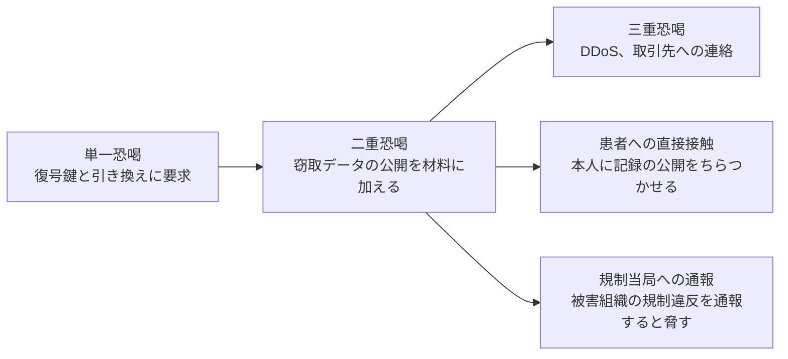

# ランサムウェアグループ別の TTPs

医療機関への攻撃が確認されている主要なグループと、その手口を整理する。

> [!NOTE]
> **表記ルール**：本ページでは、**事実**（一次情報で確認できる内容。出典を併記する）、**報道ベース**（報道や第三者の集計のみで確認でき、当事者の公表資料では裏付けが取れていない内容）、**分析**（筆者の解釈）を書き分ける。
> 出典は、当事者の公表資料、行政文書、CVE、ベンダアドバイザリなどの一次情報を優先して示す。
>
> 個々のグループの詳細な IOC（侵害指標）は、時間とともに陳腐化する。
> 最新の情報は CISA の [#StopRansomware アドバイザリ](https://www.cisa.gov/stopransomware) および [HHS HC3](https://www.hhs.gov/about/agencies/asa/ocio/hc3/index.html) を参照してほしい。
> 本ページは、変化しにくい手口の構造を把握することを目的とする。

---

## 主要グループの概観

| グループ | 状況 | 医療関連の代表事例 | 特徴 |
|---|---|---|---|
| **LockBit** | 2024 年に国際的な法執行機関の共同作戦により基盤が押収された。その後も活動の継続が報告されている | 徳島県つるぎ町立半田病院（2021） | RaaS として最大規模のアフィリエイト網を持ち、暗号化が高速 |
| **ALPHV / BlackCat** | 2024 年に活動を停止（アフィリエイトへの支払いを行わない形での撤収が報じられた） | Change Healthcare（2024） | Rust で実装。Linux / ESXi 版を備える |
| **Black Basta** | 2025 年に内部チャットログが流出し、実態が明らかになった | Ascension（2024） | Conti 系の系譜とされる。QakBot などの初期アクセスと連携 |
| **Conti** | 2022 年に内部資料の大量流出を経て解散。人員は他グループへ分散 | HSE アイルランド（2021） | 医療機関への攻撃を繰り返し、事後レビューが公開された点で研究価値が高い |
| **Hive** | 2023 年に法執行機関により基盤が押収された | 米国の複数の医療機関 | 医療機関を積極的に標的にしていたことが公表されている |
| **Rhysida** | 活動中 | Prospect Medical Holdings（2023）、小児病院への攻撃（2024） | 小児医療機関への攻撃で社会的批判を受けた |
| **Qilin（Agenda）** | 活動中 | Synnovis（2024） | 検査サービス事業者を攻撃し、輸血業務に影響を与えた |
| **INC Ransom** | 活動中 | 英国の医療機関（2024） | 医療、教育、自治体を広く標的にする |
| **Interlock** | 活動中 | 北米の医療機関 | 医療分野への攻撃が継続的に報告されている |
| **BlackSuit / Royal** | 活動中 | 北米の医療機関 | Conti 系の系譜とされる |

> [!WARNING]
> グループの状況は頻繁に変わる。
> テイクダウンされたグループの構成員が別の名前で活動を再開する例は珍しくない。
> 本表は 2026 年時点の整理であり、最新の状況は公的アドバイザリで確認してほしい。

---

## 共通する TTPs（MITRE ATT&CK 対応）

グループが変わっても、手口の骨格はほとんど共通している。
以下は、医療機関への攻撃で繰り返し観測される技術である。

### 初期侵入

| ATT&CK ID | 技術 | 医療での現れ方 | 検知、対策 |
|---|---|---|---|
| T1190 | 公開アプリケーションの悪用 | VPN 装置、リモートアクセスゲートウェイの既知脆弱性 | 境界機器を最優先でパッチ適用する。EOL 機器を洗い出す |
| T1133 | 外部リモートサービス | 保守用の常時接続、リモートデスクトップの直接公開 | すべてのリモートアクセスに MFA を適用する。常時接続を必要時開放に切り替える |
| T1078 | 正規アカウントの利用 | 漏えいした認証情報、委託先アカウント | 漏えい認証情報の監視。委託先アカウントの棚卸し |
| T1566 | フィッシング | 業務ファイルを装った添付、リンク | 添付、リンクの検査。利用者への訓練。ダウンロード実行の制限 |
| 供給網 | 委託先経由 | 給食、検査、保守などの事業者との接続 | 接続先の棚卸し、セグメント分離、契約上のセキュリティ要件 |

### 侵入後の活動

| ATT&CK ID | 技術 | 具体例 | 検知の着眼点 |
|---|---|---|---|
| T1219 | リモートアクセスツール | AnyDesk、ScreenConnect、TeamViewer などの正規ツールの持ち込み | 業務で使っていないリモート管理ツールの実行、通信 |
| T1003 | 認証情報のダンプ | LSASS からの窃取、NTDS.dit の取得 | LSASS へのアクセス、ドメインコントローラでの異常なファイル操作 |
| T1018 / T1087 | 内部探索 | ネットワークスキャナ、Active Directory 列挙ツール | 短時間での大量の内部通信、AD への網羅的な照会 |
| T1021 | 水平展開 | RDP、SMB、PsExec、Cobalt Strike | 管理者アカウントによる横方向の RDP、サービス作成 |
| T1562.001 | 防御の無効化 | EDR、ウイルス対策の停止。脆弱な正規ドライバの悪用 | セキュリティ製品の停止イベント。未知のドライバの読み込み |
| T1567.002 | データ持ち出し | Rclone やクラウドストレージ経由の大量アップロード | 外向きの大量転送、業務時間外の通信 |
| T1490 | 復旧の妨害 | ボリュームシャドウコピーの削除、バックアップの破壊 | シャドウコピー削除コマンドの実行、バックアップ基盤への異常なログイン |
| T1486 | 暗号化 | 業務時間外、休日、連休の実行 | 大量のファイル書き換え、拡張子変更 |

### 恐喝の形態

| 形態 | 内容 |
|---|---|
| 単一恐喝 | 復号鍵と引き換えに支払いを要求する |
| 二重恐喝 | 窃取したデータの公開を材料に加える |
| 三重恐喝 | DDoS や取引先への連絡を加える |
| 患者への直接接触 | 患者本人に連絡し、記録の公開をちらつかせる。フィンランドの Vastaamo 事件が典型例である |
| 規制当局への通報 | 被害組織の規制違反を当局に通報すると脅す |

医療分野では、患者への直接接触が実際に行われている。
インシデント対応計画に、患者からの問い合わせ対応と支援体制を含めておく必要がある。

---

## グループ別の補足

### LockBit

RaaS（Ransomware as a Service）として最大規模のアフィリエイト網を構築していた。
アフィリエイトごとに手口が異なるため、「LockBit の TTPs」という括り方には限界がある。
国内では、徳島県つるぎ町立半田病院の事例で使用が確認されている（[詳細](../incidents/japan/2021-timeline.md#JP-2021-01)）。

2024 年に英国 NCA を中心とする国際的な法執行作戦により、基盤の押収と復号ツールの提供が行われた。
その後も活動の継続が報告されており、テイクダウンが終息を意味しないことを示す事例になっている。

### ALPHV / BlackCat

Change Healthcare への攻撃により、米国の医療決済インフラ全体を停止させた（[詳細](../incidents/global/2024-timeline.md#GL-2024-01)）。
Rust による実装、Linux および VMware ESXi 向けの暗号化機能を備え、仮想化基盤ごと停止させる手口が特徴である。

**分析**：医療機関の多くは、電子カルテを含む基幹システムを仮想化基盤上に集約している。
ハイパーバイザ層が暗号化されると、その上のすべての仮想マシンが同時に失われる。
ESXi ホストの管理インタフェースを分離し、多要素認証を適用することの優先度は高い。

### Conti と HSE

アイルランドの HSE への攻撃は、公開された事後レビューによって攻撃の全体像が詳細に記録された希少な事例である。
フィッシングによる初期侵入から暗号化まで約 8 週間の潜伏期間があり、その間に複数の検知機会が存在した。
「なぜ気付けなかったのか」を組織的な問題として分析している点で、他の医療機関がそのまま参照できる。

### Black Basta

Ascension への攻撃で、全米規模の医療グループの電子カルテを停止させた。
2025 年に内部チャットログが流出し、標的選定や交渉の実態が公開情報として分析可能になった。

---

## 情報源

| 情報源 | 内容 |
|---|---|
| [CISA #StopRansomware](https://www.cisa.gov/stopransomware) | グループ別の TTPs と IOC を含む共同アドバイザリ |
| [HHS HC3](https://www.hhs.gov/about/agencies/asa/ocio/hc3/index.html) | 医療分野に特化した脅威分析レポート |
| [MITRE ATT&CK](https://attack.mitre.org/) | 技術の分類体系。Groups と Software のページが有用 |
| [Health-ISAC](https://health-isac.org/) | 会員向けの脅威情報共有 |
| [一般社団法人医療 ISAC](https://m-isac.jp/) | 国内の医療分野向け情報共有 |
| [JPCERT/CC](https://www.jpcert.or.jp/) | 国内の注意喚起 |
| [Ransomware.live](https://www.ransomware.live/) | リークサイトの観測情報（公開情報の集約） |

---

## 関連ページ

- [脅威アクターとリスク](actors-and-risks.md)
- [医療機関向け防御プレイブック](defense-playbook.md)
- [インシデント事例集](../incidents/)

---

[← 脅威アクターとリスク](actors-and-risks.md) | [連鎖するランサムウェア攻撃 →](ransomware-chain.md) | [トップへ](../../../README.md)
