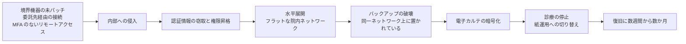

# 🚨 インシデント事例集

医療機関と医療関連事業者に対するサイバー攻撃の事例を、国内外に分けて整理する。

> [!NOTE]
> **表記ルール**：本ページでは、**事実**（一次情報で確認できる内容。出典を併記する）、**報道ベース**（報道のみで確認でき、当事者の公表資料では裏付けが取れていない内容）、**分析**（筆者の解釈）を書き分ける。
> 出典は、当事者の公表資料、行政文書、CVE、ベンダアドバイザリなどの一次情報を優先して示す。

## このセクションの方針

被害の一覧で終わらせないため、各事例について次の項目を可能な限り追跡する。

| 追跡項目 | 意図 |
|---|---|
| **侵入経路（Initial Access）** | 同じ経路が自組織に存在しないかを確認できるようにする |
| **侵害範囲** | 電子カルテ、部門システム、バックアップのどこまで到達したか |
| **診療への影響** | 停止期間、救急受入停止、転院、手術延期などの臨床影響 |
| **公表された再発防止策** | 当事者自身が実施した対策（最も実務的な参考情報） |
| **一次情報** | 調査報告書、公表資料へのリンク |

> [!IMPORTANT]
> **事実と推測を分ける。**
> 当事者の公表資料や調査報告書で確認できる内容は「事実」、報道のみで確認できる内容は「報道ベース」、筆者の解釈は「分析」と明記する。
> 攻撃グループの帰属は、当事者または公的機関が認めていない限り「未確認」として扱う。

## 一覧

- [🇯🇵 国内の事例](japan.md)
- [🌍 海外の事例](global.md)

## 事例から繰り返し確認される侵入経路

国内外の公表済み調査報告書に共通して現れる初期侵入経路です（詳細は各事例ページを参照）。

| 経路 | 概要 | 対応する項目 |
|---|---|---|
| **VPN 機器の脆弱性、認証情報** | 境界の VPN 装置が未パッチ、または漏えい認証情報で侵入される | [防御プレイブック](../actors/defense-playbook.md) |
| **取引先、委託事業者経由** | 給食、検査、保守などの委託事業者との接続を踏み台にされる | [防御プレイブック](../actors/defense-playbook.md) |
| **リモートアクセスの MFA 未適用** | 多要素認証のないリモートアクセス口が残存している | [防御プレイブック](../actors/defense-playbook.md) |
| **保守用の常時接続** | ベンダの保守回線、保守アカウントが監視外に置かれている | [医療機器のセキュリティ](../../technology/medical-devices/) |
| **フラットな院内ネットワーク** | 侵入後に電子カルテ、医療機器まで水平展開できてしまう | [防御プレイブック](../actors/defense-playbook.md) |

## 侵入から診療停止までの因果

公表された調査報告書に共通して現れる連鎖である。
最後の一段（診療の停止）だけが表に出るが、その手前には必ず複数の段階がある。

**分析**：この連鎖のうち、医療機関が自力で断てる箇所は複数ある。
境界機器の更新、委託先接続の限定、ネットワークの分離、バックアップの隔離のいずれか一つでも成立していれば、連鎖はその位置で止まる。
対策の詳細は[防御プレイブック](../actors/defense-playbook.md)にまとめる。

## 新規追加のしかた

新しい事例を追加するときは、[`docs/reference/_templates/incident.md`](../../reference/_templates/incident.md) をコピーして使ってほしい。
