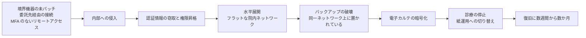

# 🚨 インシデント事例集

医療機関と医療関連事業者に対するサイバー攻撃の事例を、国内外に分けて年ごとに整理する。

> [!NOTE]
> **表記ルール**：本ページでは、**事実**（一次情報で確認できる内容。出典を併記する）、**報道ベース**（報道のみで確認でき、当事者の公表資料では裏付けが取れていない内容）、**分析**（筆者の解釈）を書き分ける。
> 出典は、当事者の公表資料、行政文書、CVE、ベンダアドバイザリなどの一次情報を優先して示す。

## 一覧

| 地域 | 入口 |
|---|---|
| 🇯🇵 国内 | [国内の事例](japan/README.md) |
| 🌍 海外 | [海外の事例](global/README.md) |

各地域の配下に、年ごとの**履歴**（`YYYY-timeline.md`）と**サマリー**（`YYYY-summary.md`）を置く。

| ページ | 内容 |
|---|---|
| 履歴（timeline） | その年の事例を時系列に並べる。一覧表と、事例ごとの経緯、教訓、一次情報 |
| サマリー（summary） | その年の要点、統計、規制の動き、前年との差分 |

2019 年以前は収録件数が少ないため、`2019-earlier.md` に集約している。

## このセクションの方針

被害の一覧で終わらせないため、各事例について次の項目を可能な限り追跡する。

| 追跡項目 | 意図 |
|---|---|
| **侵入経路（Initial Access）** | 同じ経路が自組織に存在しないかを確認できるようにする |
| **侵害範囲** | 電子カルテ、部門システム、バックアップのどこまで到達したか |
| **診療への影響** | 停止期間、救急受入停止、転院、手術延期などの臨床影響 |
| **公表された再発防止策** | 当事者自身が実施した対策（最も実務的な参考情報） |
| **一次情報** | 調査報告書、公表資料へのリンク |

> [!IMPORTANT]
> **事実と推測を分ける。**
> 当事者の公表資料や調査報告書で確認できる内容は「事実」、報道のみで確認できる内容は「報道ベース」、筆者の解釈は「分析」と明記する。
> 攻撃グループの帰属は、当事者または公的機関が認めていない限り「未確認」として扱う。

## 対象の区分

各ページの表と説明は、読み手の立場に合わせて次の三つに分けている。

| 区分 | 対象 |
|---|---|
| **病院系** | 病院、診療所、クリニック、国家保健サービスなど、患者に医療を提供する組織 |
| **製薬企業系** | 製薬企業、原薬製造、受託製造機関、治験に関わる組織 |
| **医療関連事業者** | 医療保険、医療決済、検査（ラボ）、電子カルテベンダ、保守事業者など、医療を支える事業者 |

区分は被害を受けた当事者で決める。
委託先が侵入経路になった事案は、被害の当事者である側に記録し、経路として本文に書く。

## 一次情報の強度

事例ごとに、根拠の強さを三段階で示す。
記述の深さもこれに応じて変える。

| 表示 | 意味 | 記述の深さ |
|---|---|---|
| **報告書** | 第三者調査委員会、有識者会議、国家監査機関などの調査報告書が公表されている | 経緯まで詳述する |
| **当事者公表** | 当事者または公的機関の公表資料で確認できる | 公表内容の範囲で要約する |
| **報道のみ** | 報道機関の報道でのみ確認でき、当事者の公表資料では裏付けが取れていない | 一覧表と短い記述に留める |

## 事例から繰り返し確認される侵入経路

国内外の公表済み調査報告書に共通して現れる初期侵入経路である（詳細は各年のページを参照）。

| 経路 | 概要 | 対応する項目 |
|---|---|---|
| **VPN 機器の脆弱性、認証情報** | 境界の VPN 装置が未パッチ、または漏えい認証情報で侵入される | [防御プレイブック](../actors/defense-playbook.md) |
| **取引先、委託事業者経由** | 給食、検査、保守などの委託事業者との接続を踏み台にされる | [防御プレイブック](../actors/defense-playbook.md) |
| **リモートアクセスの MFA 未適用** | 多要素認証のないリモートアクセス口が残存している | [防御プレイブック](../actors/defense-playbook.md) |
| **保守用の常時接続** | ベンダの保守回線、保守アカウントが監視外に置かれている | [医療機器のセキュリティ](../../technology/medical-devices/) |
| **フラットな院内ネットワーク** | 侵入後に電子カルテ、医療機器まで水平展開できてしまう | [防御プレイブック](../actors/defense-playbook.md) |

## 侵入から診療停止までの因果

公表された調査報告書に共通して現れる連鎖である。
最後の一段（診療の停止）だけが表に出るが、その手前には必ず複数の段階がある。

**分析**：この連鎖のうち、医療機関が自力で断てる箇所は複数ある。
境界機器の更新、委託先接続の限定、ネットワークの分離、バックアップの隔離のいずれか一つでも成立していれば、連鎖はその位置で止まる。
対策の詳細は[防御プレイブック](../actors/defense-playbook.md)にまとめる。

## 新規追加のしかた

1. [`docs/reference/_templates/incident.md`](../../reference/_templates/incident.md) をコピーする
2. 該当する地域と年の履歴ファイル（`japan/2026-timeline.md` など）を開き、[区分](#対象の区分)の節に追記する
3. 識別子を `JP-<年>-<連番>` または `GL-<年>-<連番>` の形で付け、見出しの直前に `<a id="...">` を置く
4. 冒頭の収録件数と、その年のサマリーの集計を更新する
5. 地域の README.md の年別ページ表の件数を更新する
6. [`skills/repo-review/SKILL.md`](../../../skills/repo-review/SKILL.md) の手順でレビューする

進行中の年に速報を書くときは、[月報](../../../monthly-reports/) に記録し、一次情報が確定してから履歴へ繰り上げる。

---

[← 脅威](../README.md) | [トップへ](../../../README.md)
